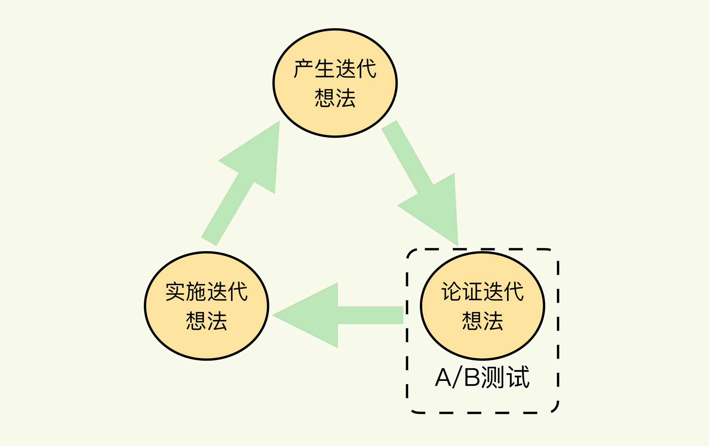
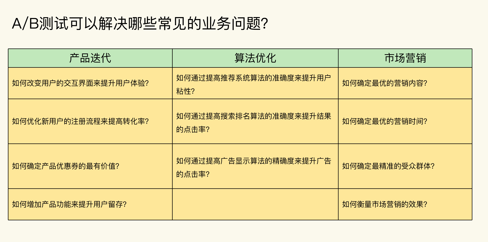
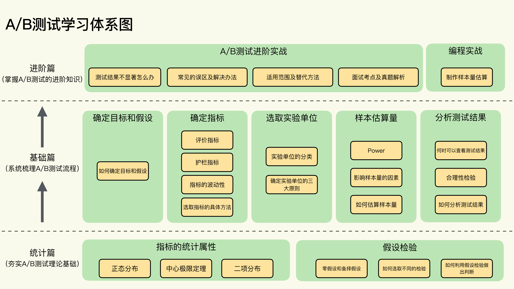

---
date: "2019-06-23"
---  
      
# 开篇词｜用好A/B测试，你得这么学
你好，我是博伟。欢迎和我一起学习A/B测试。

可能你对我还不是很熟悉，我先来做个自我介绍。我目前呢，在美国的互联网大厂FLAG工作，是一名资深数据科学家。在过去的7年多时间里，我一直在做A/B测试、机器学习建模、大数据分析的相关工作。

在从事A/B测试的经历中，我参与到从设计测试、实施测试到最后分析测试结果，给出业务指导的全过程，后来逐步在团队中主导A/B测试领域的相关工作，开发与A/B测试相关的数据产品，还和工程团队合作来改进提升内部的A/B测试平台，通过持续的A/B测试为公司的新业务带来上百万用户的增长。经过多年的经验积累，现在也为数据分析、营销和产品团队提供数十场A/B测试的讲座和上百次的咨询，给他们讲解A/B测试的最佳实践以及避坑经验。

在我多年的数据分析实践中，我越来越觉得，**A/B测试是促进业务持续增长的最实用、最有效的方式。**

不过我也发现，在这些不同的数据分析方法中，A/B测试也是最容易用错的方法。

究其原因，是因为A/B测试是一种实践性很强的方法，学校的教学中往往没有相关的课程。你可能会在统计课上学到过它的理论基础——假设检验，但是还是太过理论，不知道该怎么应用。A/B测试的难点就在于，如果你只有理论基础而没有实践经验，那么实践过程由于业务场景千变万化，可能就会有各种各样潜在的陷阱在等着你。只有兼顾了理论基础和实践经验，才能得出值得信赖的测试结果。

<!-- [[[read_end]]] -->

也因此，我非常希望能够系统地梳理和总结下自己在硅谷成熟科技公司学到的知识经验，并分享出来。在你即将学习的**这门课程中，我会先带你建立起一个做A/B测试的框架，让你在应对不同业务场景时，都能通过框架来按图索骥，灵活运用。**

不过在讲具体的学习方法之前，我想先和你聊一聊，A/B测试到底可以帮我们解决什么问题？

## 为什么想要获得持续的业务增长，就必须学习A/B测试？

在大数据时代，每个公司都在说数据驱动产品和业务的快速迭代，这当然没有错。但是，有很多人都认为，数据驱动就是做几次数据分析，产生一些报表，并没有把数据放在公司的业务决策流程中。

这是一个非常严重的误区。

**多年的专业经验告诉我，看一个公司或者团队是不是真正做到了数据驱动，就要看它的决策流程中有没有A/B测试这一环节。**

为什么这么说呢，我们先来了解下决策流程，也就是产品/业务迭代的流程。

你可以看到，产品/业务迭代的流程大概分为3步：

1.  具体的业务问题催生出迭代的想法，比如出现业务问题后，团队会提出具体的迭代方案；
2.  团队论证方案的可行性和效果；
3.  论证完成后，具体实施迭代方案。

很明显，只要论证环节结束了，就要开始进行迭代了。所以，做好充分而正确的论证，就是至关重要的环节。

这也很容易理解，你想，如果刚刚有了迭代的想法，不去论证就直接实施，就很难达到预期，甚至会产生负面效果。

这就好比一个刚刚研制成功的药品，不经过临床实验就直接推入市场，去治疗病人，那承担的风险是非常高的。因为这样不仅可能无法治愈病人，甚至还可能会产生严重的副作用。这么一想，你是不是就体会到论证的重要性了？

而A/B测试，就是保证这个关键环节不出现问题的最佳方案。因为它不仅可以让我们清楚地知道产品/迭代方案到底有没有效果，能产生多大效果，还可以在结果不如预期时，快刀斩乱麻，有理有据地放弃这个想法。

这样既能大大节省公司的成本，又能加快想法迭代的速度。如果在花费了大量时间和资源实施想法后，还收不到预期的效果，那就得不偿失了。

所以，**只有在决策流程中加入A/B测试这个环节，根据值得信赖的测试结果，而不是所谓的经验来做业务和产品决策时，才是真正的数据驱动决策。**

这其实也是所有公司都会面临一个问题：业务增长从来都不是一步到位的，那么如何保持业务的持续增长呢？A/B测试在提升业务和产品迭代上真的很管用，能持续带来营收和用户的增长。

无论是美国硅谷的FLAG，还是中国的BAT，每年都会进行成千上万次的线上A/B测试，参与测试的用户超百万（事实上，大部分用户是在不知情的情况下被参与的）。即使是一些初创公司，或者是像沃尔玛、美国航空这样的传统企业，也会通过小规模的A/B测试来优化提升业务。

以必应（Bing）搜索为例，A/B测试每个月都能帮助他们发掘数十个提升收益的方法，每个搜索的收益一年可以提升10\%\~25\%，这些AB测试带来的改进和其他提升用户满意度的努力，是必应搜索的盈利提升，以及其美国市场份额从2009年刚成立时的8\%上升到2017年的23\%的主要原因。

讲到这里，你可能会比较好奇，这些公司用A/B测试来解决什么具体的业务问题呢？你看下面我给你总结的表格就了解啦。

正因为发现了A/B测试在产品迭代、算法优化、市场营销等领域的巨大作用，越来越多的公司开始使用A/B测试，这方面的人才的需求量也越来越大。无论是偏技术的数据科学家、数据分析师，还是偏业务和产品的市场营销分析师、产品经理以及增长黑客，都需要在工作中掌握和应用A/B测试。而且从我多年做面试官的经验来看，A/B测试也是这些职位面试中必考的一块内容，重要程度可想而知。

看到这里，你可能已经非常想要学习A/B测试了，先别着急。我发现，很多人对A/B测试是既熟悉又陌生。

说熟悉，是因为A/B测试的基本概念很好理解，它就是指科学中的控制变量实验。说陌生，是因为A/B测试涉及到千变万化的业务场景、不同的数据，以及在实施过程中的多种琐碎环节，也存在着太多的误区。

## 理解A/B测试的原理很简单，想用好却很难

为什么这么说呢？我们直接看几个真实的案例吧。

我经常和营销、产品团队一起合作A/B测试，他们一般会提出一些A/B测试的想法，比如想要提升某款App的推送效果，希望能通过改变推送中的不同因素来提升推送的点击率。

刚开始，他们的很多想法完全不适合A/B测试。比如说，实验组和对照组相比，他们会想到同时改变推送的标题和内容，或者同时改变推送的内容和时间，等等，这就违反了控制变量实验中**实验组和对照组只能有一个因素不同**的原则。因为当我们同时变化多个因素时，即使最后得到了显著的测试结果，也没有办法确定到底是哪个因素造成的。

这就是基础不扎实导致的。这是一个非常严重的问题，因为不清楚原理，就很容易在设计实验和分析实验结果中采取错误的方法。

你可能会问，那我掌握好理论基础，是不是做A/B测试就没问题啦？

当然不是。A/B测试是一种实践性很强的方法。你可能会在统计课上学到过它的理论基础——假设检验，但是，怎么在实际业务场景中应用呢？这就是学习A/B测试的难点。

**理论上的东西是死的，但A/B测试的应用场景和相关的数据却是千变万化的**，在实施A/B测试中会遇到各种各样的数据问题或者工程Bug，要是一不小心哪怕忽视了很小的一个点，就会有各种各样的陷阱在等着你，实验结果就会变得不准确，之前的所有功夫就白费了。

我再跟你分享一个小例子。

某个专门测试App推送的平台，有一类流程是比较发推送有没有效果。对照组不发推送，实验组发推送。

在正式发送前，该平台还会做一个过滤，过滤掉那些不符合推送的用户，比如用户是未成年人，或者用户手机设备太旧不支持推送，等等。但是由于只有实验组会发推送，对照组并不会发推送，所以平台只在实验组实施了过滤机制：

但是，仔细想想，这个流程会使实验组和对照组有两个不同：有无推送和有无过滤。第一个不同是在实验设计中，但是第二个不同就纯粹是流程中加进来的，是偏差，会造成实验结果的不准确。

正确的流程如下图。对照组即使最后不发推送，也要经过和实验组同样的过滤，这样才能保证实验的准确性：

你看，这么一个细小的问题，就可能会导致整个A/B测试失败。

## 这门课程是如何设计的？

所以，为了让你快速且扎实地掌握A/B测试这门手艺，我结合我的从业经验，从统计原理、基本流程和进阶实战三个层面，为你梳理出了一条学习A/B测试的最佳路径。

第一模块是“统计篇”。

想要做好A/B测试，统计原理的学习肯定是不能漏掉的。统计学知识纷繁复杂，但做A/B测试，其实不需要掌握全部。所以**我精选了与A/B测试密切相关的统计理论，主要讲解A/B测试的理论基础-假设检验，以及A/B测试指标的统计属性这两块知识**，让你有针对性地学习理论知识，真正打好做A/B测试的理论基础。

即使你没有很好的统计学基础，也可以在这个模块快速掌握A/B测试的统计学基础，完全不用担心。

第二模块是“基础篇”。

在这个模块，我梳理了做A/B测试的几个关键步骤，包括确定目标和假设、确定指标、选取实验单位、计算所需样本大小，以及分析测试结果。我会在讲解流程的同时，也告诉你背后的原理，帮助你在实际应用时能举一反三。

第三模块是“进阶篇”。

想要让做A/B测试的技能更上一层楼，掌握了关键流程还不够。你还需要能够识别那些在实际业务场景中潜在的坑，并且要有相应的解决方法。

除此之外，你应该知道A/B测试并不是万能的，所以我会专门拿出一节课来给你讲解A/B测试的适用范围及替代方法。

如果你是想面试A/B测试相关职位呢，也不用担心，我会花两节课带你掌握面试中的常见考点及应对方法。

最后，我还会通过实战，带你亲自制作一个实用的样本量计算器，来解决网上工具参差不齐、适用范围有限等问题。

A/B测试其实并不难，因为它并不需要你掌握非常高深的计算机算法或者高等数学，所以说理解基本的统计知识就足够了。不过想要把A/B测试做好，肯定是有难度的。它的难度就在于，如果不遵循科学化的流程，那么在实践过程中就可能会出现各种状况和问题。

所以我也希望你能在学习这门课程的时候，边学边实践，在实践中学习、总结前人的经验，把A/B测试慢慢变成你在工作中的一项核心竞争力。

最后，今天是开篇，你可以在评论区写下你对这门课的期待，或者你的学习计划，让我们一起见证彼此的成长吧！