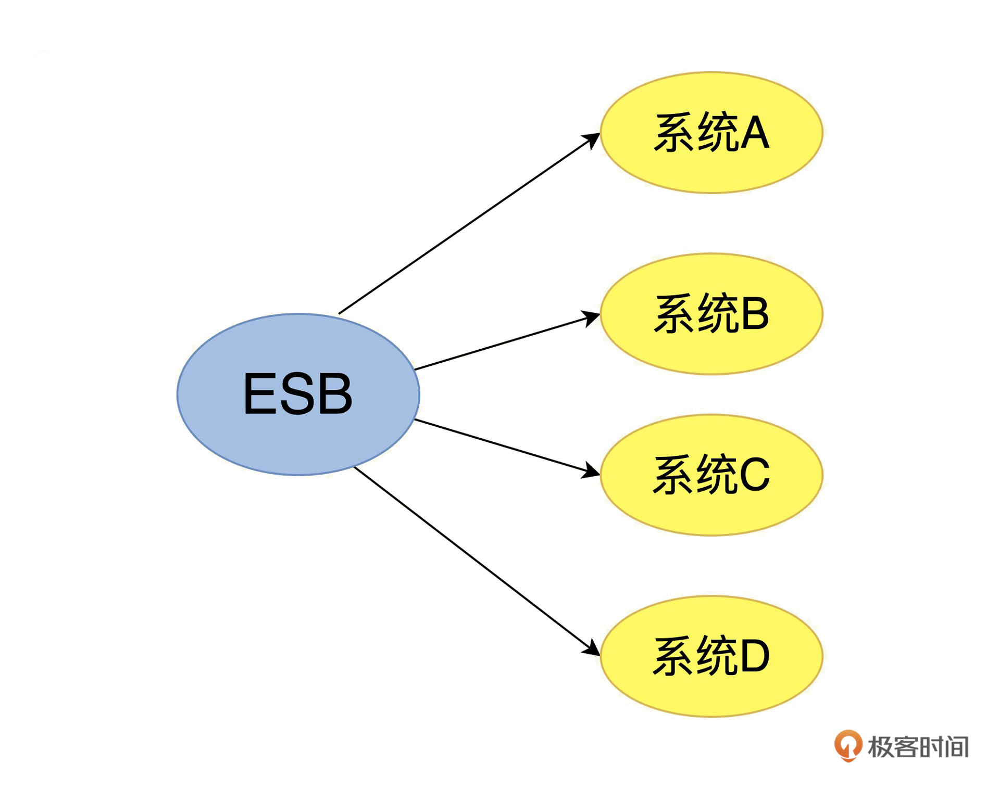
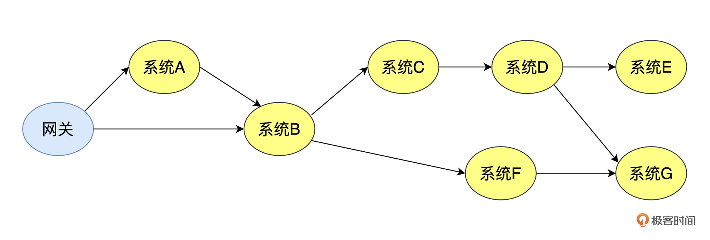
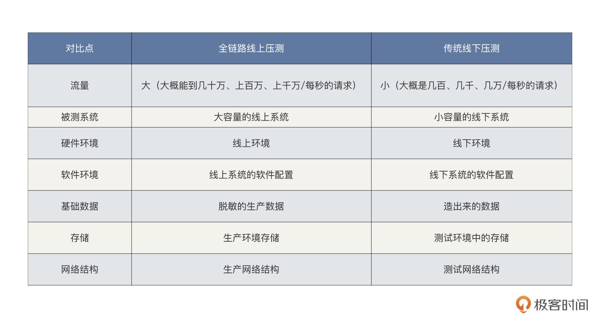

---
date: "2019-06-23"
---  
      
# 01 | 全链路压测：为什么很多测试人员迷信它？
你好，我是高楼。

时光如梭，梭梭催人进步。在技术行业中，更是如此。

在性能行业中，全链路压测的概念产生和落地实践已经有很多年了。很多企业也是不遗余力地投入资源来做全链路压测，但其中苦楚只有经历过的人才懂。尽管如此，还是有更多的企业紧跟其上，趋之若鹜。为什么全链路压测会有这么高的热度？

要理解这一点，你必须得先看看全链路压测的这些目标：

1.  全链路压测被称为系统整体容量保障的核武器。
2.  全链路压测可以实现生产环境的压测服务，模拟真实的生产峰值场景，以发现真实的线上瓶颈并实现监控分析。
3.  全链路压测可以实现精准的容量规划，确保线上系统的正常运行。
4.  全链路压测可以实现海量的并发请求，以模拟真实的用户峰值场景。
5.  全链路压测可以实现压测流量和生产流量的隔离，避免对生产流量产生影响。
6.  全链路压测可以自动化压测，减少人工成本，并提高压测频率，快速发现问题。

看完这些目标，你是不是有一种热血上涌的感觉？内心不由得感慨：“这真是一把神器，得全链路压测即可高枕无忧！”

这还没完，你可能还在网上看到过很多有关全链路压测的文章，文章里常常会涉及阿里、有赞、饿了么、美团、滴滴、京东、字节、陌陌、达达等一些企业。这些文章经常会给人一种感觉：为了增加系统运行安全性，全链路压测是企业必须要做的一件事情。

<!-- [[[read_end]]] -->

那我们是不是要紧跟大厂的步伐，在自己的企业中来做全链路压测呢？

盲目跟随当然不行！每个企业的阶段和项目状态都不相同，必须根据实际情况来判断。怎么判断？这还要从全链路压测的概念说起。

## 拆解全链路压测

我们先来拆解一下全链路压测，啥是“链路”？简单点说就是几个点连成的线。这个词在IT行业中非常常用，但是在性能行业中，却是近几年才被广泛使用的“新词”。要讲链路，就得说到微服务分布式架构的发展。

一开始，在微服务分布式架构还没有流行起来的时候，人们大多使用SOA架构，它大概的技术架构是这样的：

当然，系统之间也有调用，但都会通过ESB，调用链路也比较短。

进入到微服务分布式架构之后，由于微服务被拆得越来越细，大概的技术架构就变成了下图所示的样子：

当然，也有其他的表现形式，我们这里只是举个例子方便你理解。从上图看，调用链路明显变长了，这是大流量带来的系统拆分导致的。在这种情况下，识别问题也就更加困难了。

之前一个系统的功能点多，而现在一个系统的功能点少；之前测试一个系统就有一堆的业务逻辑，现在测试一个系统只有很简单的业务逻辑；之前一个系统就可以完成的业务操作，现在得跳好几个系统才能实现。

在互联网的初期，压测主要关注单系统接口，而这完全不能说明系统处理业务的容量能力。随着业务的大规模发展，性能也必须做到覆盖“全部”系统，“全链路”这个概念就显得格外重要了，它指的是系统的全链路。

说到这里，“全链路”的内涵就解释得差不多了，那说到压测，就得有工具、有平台。

由于系统架构的改变是容量改变引起的，因而容量出现大爆发的时候，要想实现压测，工具就必须支持这么大的容量。而之前常用的压力工具像LoadRunner、JMeter等，它们本身在分布执行能力、参数化拆分管理能力等方面都有着天生的弊端，所以我们必须另外打造具有大容量并发能力的工具。

这也是现在各企业想尽办法来实现自己的大并发压测平台的原因。

理清了概念，我们再来通过对比加深一下理解。因为全链路压测是为了满足线上环境的容量需求，所以这里我们主要将全链路线上压测和传统线下压测进行对比：

从表格中，你可以很清晰地看到二者的区别，但是这些对比点是不是固定的呢？不是的。比如说，在传统线下压测环境中，我们也能使用生产的脱敏数据。所以这个表格只是给你一个粗略的感觉。

我们抽象一下全链路线上压测和传统线下压测的区别，其实就一个关键点：在线上测还是在线下测。其他的区别也可以不算是区别，因为那些区别点都是可以平衡掉的，比如说压力场景、铺底数据、监控手段等，关键在于投入多少。投入的内容包括了：系统的改造投入、人员的投入、环境的投入、时间的投入。

有人说，既然投资这么大，不搞全链路不行吗？

## 你需要全链路压测吗？

当然可以。在我看来，现在很多企业都把全链路压测给整偏了。不管企业是大是小、系统是大是小，也不管成本高低，很多人都只是想实现全链路压测，摸到技术的风向标，这在我看来大可不必。

实际上，要不要使用全链路压测需要充分考虑企业的实际条件，你可以先来考虑这么几个问题。

第一，你的企业有没有那么大的流量需求？  
按我前面所列的量级，如果不到几十万、上百万、上千万/每秒的交易量，其实完全不用考虑全链路压测平台的实现逻辑。如果你只是觉得这逻辑听起来更高大上而去实现它，那投入的成本等于说是打了水漂。

第二，你的系统要不要做全链路线上压测？  
如果你不是在线上做全链路压测，那很多业务流量的改造工作就可以完全忽略。甚至，你都不用考虑改造什么压力工具，这纯属是在给自己找麻烦。

第三，你的系统能不能做全链路线上压测？  
大家可以看到，网上有关全链路压测的文章几乎都来源于互联网企业，而其他行业则是在后面跟风。为什么偏偏是那些互联网大厂特别需要全链路压测呢？首先是因为请求量大。其实，互联网大厂需要的环境太大，致使再弄一套测试环境的成本过高。再者，做全链路线上压测的系统，即使出了问题，也不会对企业利润产生太大的影响，这一点至关重要。但是，对于一个刚起步的小互联网企业来说，如果连正常的业务功能都不能保证按时按质地实现，还要加这个改造的工作量，我觉得也是不理智的。

我看到有些银行、证券企业也在做全链路线上压测，在我的经验里，银行、证券这些和钱有关的大企业，做全链路线上压测都是经过了多轮的验证和压测范围的缩减的。你看，这些大企业尚且如此，普通小企业就更应该根据实际情况量力而行了。

有人说，我们系统很多，一个系统一个系统地在线上做全链路压测行不行？如果你这么说，就意味着已经不是“全链路”了呀。

第四，你的组织支持不支持你做真正的全链路线上压测？  
这是一个很严肃的话题。很多大领导是看行业新闻来判断方向的，技术层的领导是看行业风向来判断具体动作的，而苦逼的底层干活的人只能执行任务。

在全链路线上压测这件事情上，必然不是底层干活的人（部门经理及以下）可以决定的。全链路线上压测是需要企业上下层协调一致才可以做得到的。如果领导只是给你安排了一个做全链路线上压测的任务，但没有给你具体的权限支撑，是不可能做得下去的。而恰好有很多上层领导就是这种光安排任务，不给具体支持的风格。

这时，你得跟领导详细沟通一下，把成本利弊都分析清楚。如果从企业角度思考后，你们一致认为全链路压测是必须要做的，那就需要领导更具体的支持才行，不然可能很难推进。

基于以上四点，你可以在企业中考量一下还需不需要做全链路压测，我估计，问完自己这四个问题，很多人都会发现自己的公司不太适合做全链路压测。不过对于另一些企业来说，全链路压测却不可或缺。因为它能解决以下三个问题：

1.  直接使用生产环境，避免了环境的差异性。
2.  实现高并发广域网压测平台，模拟了真实的用户场景。
3.  不用进行线下线上容量的推算。

传统的线下压测显然做不到这三点。如果以上三个问题对企业的影响较大，那么全链路压测就很有必要了。问题来了，如果想做到这几点，要做哪些具体的改造呢？

## 如果企业要做全链路压测，系统要做哪些改造？

### **压力工具改造**

这涉及到流量问题。如果你的压力场景只需要万级每秒以下的请求量级，其实不需要做工具改造，传统工具就能做得到。但是如果需要更大流量，就得对压力工具进行改造了。压力工具改造的内容有哪些呢？

1.  压力发起部分：主要是多节点分布式的改造。
2.  参数化部分：主要是数据量大引起的改造需求。在传统的压测工具中，基本上都是使用Master-Slave的方式，master负责拆分参数化数据，但当数据量过大的时候，显然这是个问题点。

改造的部分只有这两点，在其他的功能点上传统的压力工具是可以覆盖大流量的压测需求的。

### **业务流量的改造和隔离**

在业务流量的改造和隔离上通常有两种做法。第一，实现全链路的压测流量识别，从而实现隔离。第二，只在入口做压测流量的识别，直接旁路到另一套独立的链路中去（这里的硬件可以共用，但是会增加部署的复杂度）。

下面我们来说说，如果用第一种方法进行业务改造，有哪些技术点需要考虑。

业务标记改造的目的是实现业务流量的隔离，业务流量隔离的目的是不让压测流量影响真实的线上用户。**贯穿业务改造的关键是整个业务流的识别跟踪，最后还可以方便地进行数据的清理。**具体业务改造需要包含哪些方面呢？

* 脚本改造  
  也就是加上流量标记，以实现后续的流量隔离。这一点任何一个压力工具都只需要加个参数即可，没有复杂度。

* 应用服务改造  
  这将是改造工作量最大的部分。改造要实现的是对流量标记的识别，再把请求旁路到相应的存储组件中去。  
  有人说，这里能不能直接在网关上做改造，后续所有的技术组件都单独搭建一套呢？显然这也是可以的，只是单独搭建还是涉及到成本。如果愿意投入，直接搭建一套生产环境更为霸气。  
  应用的改造主要是对现有的业务代码进行入侵式的改造，增加业务开发的工作量。 实现的手段就是跨线程透传，将压测流量写入ThreadLocal对象中。

* 中间件的改造  
  对于一些跨服务调用使用的中间件，由于需要对压测流量进行标记，所以也是需要改造的。

* 存储逻辑的改造  
  不管是缓存还是数据库、队列，都要对压测流量进行识别，以便隔离。目的就是不影响生产数据。  
  对缓存（比如Redis\)，我们可以实现不同的key值；对于数据库，我们可以实现影子表或影子库。

* 日志改造  
  压测流量的日志最好不要和生产日志在一起。有人说，既然有了标记，那按标记删日志就可以了嘛。但是，有过性能经验的人都知道，日志做得不好，对性能的影响还是非常大的。所以既然已经做了应用服务的改造，那把压测流量的日志也单独写才是更理智的。

第二种业务流量改造方法比较简单，只要在网关做压测流量的识别即可，后面就全都是部署的活了。

### **全链路压测对监控系统的影响**

对于监控系统，不应该用改造这个词了。由于线上生产系统是必须有监控的，因而全链路压测不涉及太多对监控系统的改造，它更多的是工作量的增加，例如增加影子库这样的监控点。

对于一些改造后并没有增加节点的技术组件和模块来说，在监控上则没有影响。

## 总结

好，到这里，关于做全链路压测的必要性和改造点我就讲完了，我们来对这节课做个小结。

首先，我们梳理了全链路压测的概念，它强调了线上覆盖全业务链的最大容量场景。

然后，我们探讨了什么样的公司适合全链路压测。我请你思考了四个问题：

* 你的企业有没有那么大的流量需求？
* 你的系统要不要做全链路线上压测？
* 你的系统能不能做全链路线上压测？
* 你的组织支持不支持你做真正的全链路线上压测？

考虑好这几个问题，才能确定是否适合做全链路压测。

最后，我带你梳理了进行全链路压测前具体的改造路径，它包括压力工具改造和业务流量的改造与隔离。另外，全链路压测还会对监控系统产生一定影响。

面对全链路线上压测，希望你理性分析它的实施成本和上层的支持力度。切忌在没有必要的航线上不断试错。如果你的企业确实需要做全链路压测，那就要把改造的细节列清楚，并计算出成本。不盲从，不夸大，不缩小，做真正有价值的事情。

## 思考题

在结束今天的学习之前，我还想请你思考这两个问题：

1.  什么样的系统才需要全链路线上压测？
2.  如何计算全链路线上压测的成本？

欢迎你在留言区与我交流讨论。当然了，你也可以把这节课分享给你身边的朋友，他们的一些想法或许会让你有更大的收获。我们下节课见！