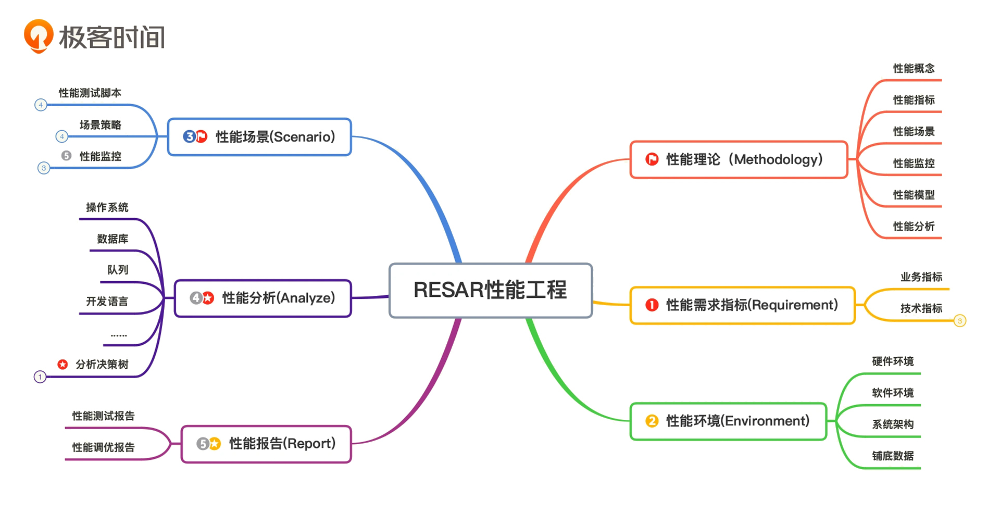
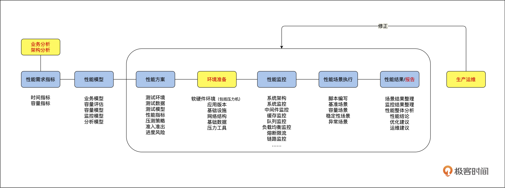
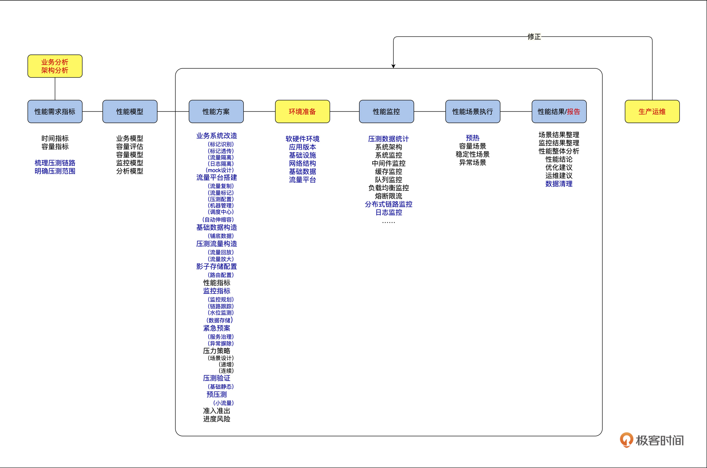
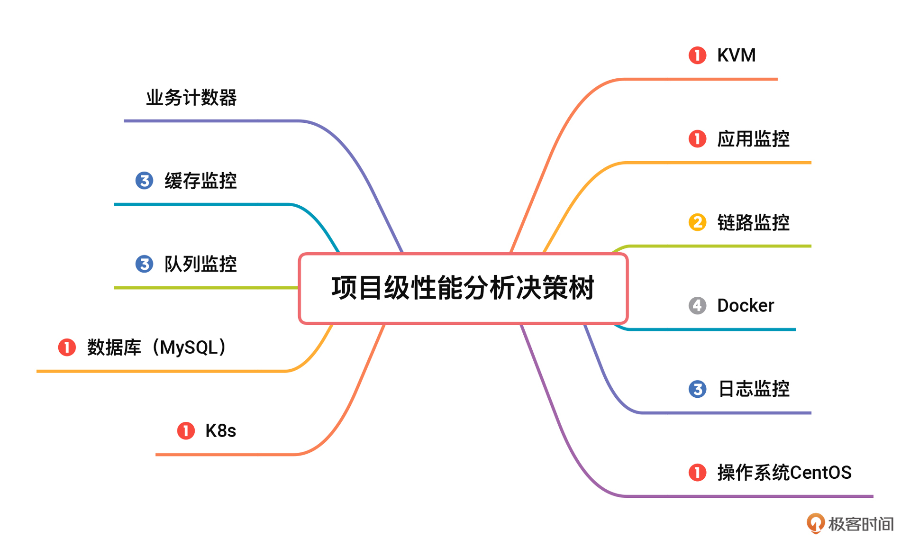
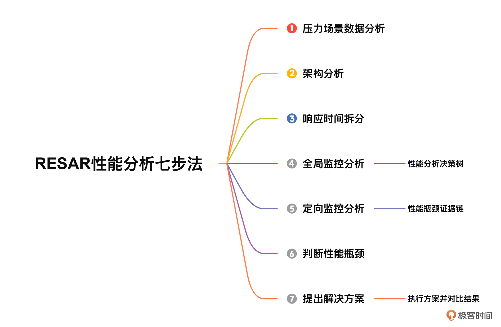
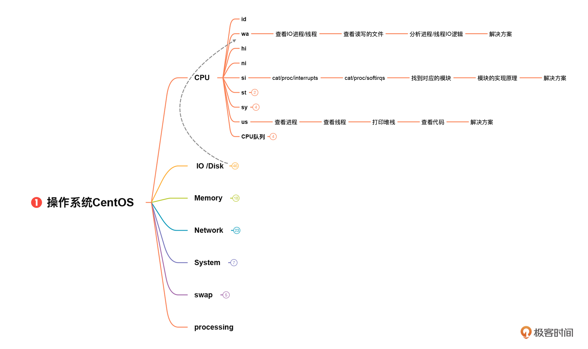

---
date: "2019-06-23"
---  
      
# 02 | RESAR 全链路流程：如何搞定所有容量场景？
你好，我是高楼。

在开篇词中，我已经提出过，全链路压测只是性能容量场景中的一个具体案例，它并没有跑出“RESAR性能工程”的范围。你可能会问，既然这样，这个全链路压测专栏还有什么新鲜的内容呢？这个专栏讲的是另一套性能工程级的逻辑吗？下面我们就来仔细地说一下。

这张RESAR性能工程的全景图已经在开篇词中展示过，性能需求指标、性能环境、性能场景、性能分析、性能报告是其中重要的五个部分。全链路压测同样也可以按这五个大的部分来讨论。

请注意，这五个部分看似是做事情的先后顺序，但顺序不是我想表达的。我想表达的是，对完整的性能项目来说，应该从哪几个方面来保证性能项目的成功。而这些事情是跟用什么开发模型来实施关系不大的。所以，这五个部分，你放到瀑布模型中也好，放到敏捷也好，放到DevOps也好，都可以。重点是你必须要做到，不然性能项目的结果就是不可控的。

那既然全链路压测只是一个特定的性能场景，对应到RESAR性能工程中，也就是性能场景了。

既然这样，我们为什么还要用这么多篇幅来讨论全链路压测呢？那是因为，全链路压测场景需要做的工作实在是有点多，“需求-环境-场景-分析-报告”几乎都有要考虑的内容，所以将它拆开仔细研究很有价值。

<!-- [[[read_end]]] -->

下面我们就从流程的角度来说明一下，全链路压测场景，在整个RESAR性能工程的执行流程中，有哪些是需要特别关注的。

## RESAR性能工程的通用流程在全链路压测中的具体变化

在RESAR性能工程的通用流程中，我画过这样的一个工作流程图来说明各个环节要做什么事情。

针对这个通用流程，如果要满足全链路压测，我们来做一下标记，看一下，有哪些变化。

图中，蓝色字体标示的是变化的关键点，这些内容和线下环境中性能项目要做的事有一些区别。我们一一对应看一下。

* 需求指标部分

显然，由于要考虑“全链路”，那就要梳理要压测的链路有哪些。如果是业务不复杂的系统，这项工作还是比较好做的。但如果是复杂的系统，就要分清主次了。其实全链路要考虑的范围，通常不是一个企业的所有业务链路，而是要把最核心的业务场景覆盖的链路梳理出来。

* 性能模型部分

这部分其实和传统的性能模型没有太大区别，动作都是要做的。即便你说我的容量模型就是和生产一致，那也要有一个判断。在具体实施的时候，不管你是生产引流、录制流量回放还是用压力工具，目标都是为了让性能模型和生产一致。

* 性能方案部分

这部分将有非常大的变化，因为会涉及到大量的改造动作。这些改造的动作不仅是开发去做个旁路的逻辑，还会涉及到部署的变化，所以这个方案是最最重要的内容。当然你可以把方案中的内容拆到其他阶段去完成，但是内容上不可少。

* 环境准备部分

由于全链路压测是在线上直接进行的，所以环境的准备也要格外地小心。在这一环节中，就可以看出不同企业的不同策略了。举例来说，互联网企业之所以可以做线上压测，主要是因为风险可控；而对银行业来说，在线上做全链路压测的风险极有可能是不能承担的，最多做做业务缩减版（比如说做查询业务）的“全链路”压测。如果你做了其他业务的压测，万一出现问题，银监会会立马找上门来。而互联网企业最多就是承受自己企业的风险，相比较而言风险就可控多了。

* 性能监控部分

性能监控部分应该说区别不太大，最多是把改造多出来的部分加到已有的监控体系中去。这里要多啰嗦一句，一定要保证监控计数器的完整性，因为在我的经验中，很多企业说是做了全方位360度无死角、透明度100\%的监控平台，但是在我看来，也只是达到了模块级的覆盖，具体分析问题时，仍然是缺东少西的。

* 性能场景执行部分

这算是性能行业中最活跃的部分，但也是投入多见效少的部分。我们看到市场上也有一些标识为“全链路压测工具”的产品，也有一些为了实现全链路压测而特意开发的功能。而实际上，真正要做到让全链路压测工具覆盖不同用户特性，根本不是压测工具的功劳，而是网络本身的功劳。所以你用传统压力工具也好，用新的压力工具也好，只要压力机分布在不同的网络中，就可以实现模拟真实用户的特性。 至于工具执行上的策略，和RESAR性能工程理论中的场景执行策略一致就行了。

* 性能结果/报告部分

在这一部分中，除了需要完成RESAR性能工程之前规定的动作之外，还要做数据清理工作。毕竟，这些压力数据都是生产上的垃圾数据。

通过以上的详细说明，你大概可以发现，RESAR性能工程的思维逻辑是完全可以覆盖全链路压测的。因为RESAR性能工程是一套方法论，在具体的落地中，你把它用在什么样的性能场景都可以，而全链路压测场景就是一个具体的落地场景。

有了这个认识之后，我们再来看看，RESAR性能工程中规定的其他内容，在全链路压测中有必要改动吗？下面我们找几个关键部分来分析。

## RESAR性能分析决策树

性能分析决策树是我在RESAR性能工程中提到的一个非常重要的概念，因为我强调性能项目要有分析调优的动作，而性能分析决策树就决定了能否做到这一点。如下图所示：

不管是在什么样的性能项目中，项目级的性能分析决策树都是必须要有的。因为它展示的是一个架构级的、全技术栈的、全组件模块的计数器全集。有了这个全集，在出现性能问题时，才会有要分析的数据。

在线下环境做性能场景时，如果出现了问题，反正也不影响谁，我们直接再来一遍就可以了。但全链路压测就不一样了。因为压测是在生产环境中执行的，如果出现问题，为了不影响真实用户，你不能把问题就这么放着不管，你要做的第一步就是恢复。但是恢复之后怎么找问题呢？那就得靠监控数据了。

所以性能分析决策树对全链路压测来说，更为重要了。在每个全链路压测的项目中，都要先把性能分析决策树创建好，再根据RESAR性能工程的理论逻辑，把监控平台能覆盖的计数器和性能分析决策树中的计数器一一比对，有缺失时，一定要补全。

有了性能分析决策树和性能监控平台给出的具体数据之后，就来到了我们的“RESAR性能分析七步法”了。

## RESAR性能分析七步法

我把性能分析的逻辑归纳为如下七步，这个归纳总结，在我的每个性能项目中都有具体的落地实践，这个思维引导着我解决了一个又一个未知的性能问题。

在全链路压测的过程中，如果出现了性能问题，其分析逻辑依旧可以按这七步来走。记住，这里要分析的可能就是历史监控数据了，因为我们上面说到了，全链路压测在线上出现问题时，首先是恢复，其次才是分析问题。

那这里又有一个致命的问题了：做定向监控分析时，数据不全，或需要做下一步动作才能得到有效的数据，怎么办？

我的建议是：先到测试环境中去模拟这个问题，能复现最好，但是如果测试环境中复现不了，就只能祈祷性能分析决策树的完整性了。如果还是不行，你只能到线上再执行一遍，让问题再次出现。与此同时，也要做好相关工作，使得即使是在测试时，用户的体验也不受太大影响。

总之，不管是什么样的性能问题，都是RESAR性能分析七步法可以覆盖到的，全链路压测的问题也不可能例外。

## 性能瓶颈证据链

有了RESAR性能分析七步法，就必然会有性能瓶颈的证据链。没有证据链的性能瓶颈分析就是耍流氓。而这个证据链的查找逻辑可以对应七步法中的“定向监控分析”部分。我在图片中给出了示例，你可以看一下：

对每个计数器，它的分析过程就是产生证据链的过程。也就是说，每个计数器出现问题（当然，大部分时候是需要多个计数器关联分析的）时所做的动作、产生的结果，你都严格地记录下来，然后通过自己的背景知识找到其间的关联性，这就成了证据链。

这个分析逻辑，在全链路压测的场景中是更为重要的。因为在线上环境中，我们没有多少试错、重复执行的机会，所以重视分析过程，才能让我们花更少的时间来精确地判断瓶颈产生的根本原因。

通过上面的描述，我相信你已经能理解RESAR性能工程和全链路压测之间的关系了。当然，在RESAR性能工程中还有大量的细节。比如说：业务模型的具体落地、场景实现的具体要求、性能指标的细化程度等等。它们在全链路压测落地的过程中，都是和RESAR性能工程中的要求完全一致的。

## 总结

好了，今天的课程就讲到这里，我们再来回顾一下今天的内容。

RESAR性能工程从前到后、从上到下地描述了一个性能项目的完整过程，它可以应用在所有的性能项目中，因而也可以覆盖全链路压测这个话题。

尽管在全链路压测中，一些具体动作（比如说要改造很多内容）和传统线下压测的内容不同，但这些都是为了准备环境。 而RESAR性能分析决策树、性能分析七步法、性能瓶颈证据链的思路，在全链路压测项目中仍然是快速找到问题的关键。倘若没有这些思维逻辑，我们还是只是实现了“压测”，而不“分析调优”。

有人会问：“在全链路压测中，分析调优是性能测试工程师的职责吗？如果是的话，那么大的系统，怎么可能看得过来呢？”在我看来，问出这个问题的人一定是从“性能测试工程师”的角度出发的，而我一直在说的分析调优，是一个项目组的事情，甚至是整个企业中所有相关方的事情。所以，分析调优的人员范围不限于性能测试工程师，毕竟，全链路压测也不是性能测试工程师能组织得起来的，而是需要高层的支持、多团队的协作才能办得到。

## 思考题

在课程结束前，我也想听一听你的思考。

1.  在RESAR性能工程中，你能想到哪些细节是在全链路压测中要重点关注的？
2.  全链路压测中的性能问题分析有什么特点？和传统的线下性能项目中的性能问题分析有什么具体的区别？

欢迎你在留言区与我交流讨论。当然，你也可以把这节课分享给你身边的朋友，分享学习所得，共同进步。我们下节课见！