---
date: "2019-06-23"
---  
      
# 03 | 压测方案：你是否忽略了一个重量级文档？
你好，我是高楼。

从这里开始，我们就进入全链路压测的第二部分了。我会基于一个完整的项目给你讲一讲全链路压测的核心需求。这一讲这是第二部分的开篇，非常重要，它是这个项目整体的全链路压测方案。这个方案是我基于上一个专栏[《高楼的性能工程实战课》](https://time.geekbang.org/column/intro/100074001)中给出的性能方案撰写的。

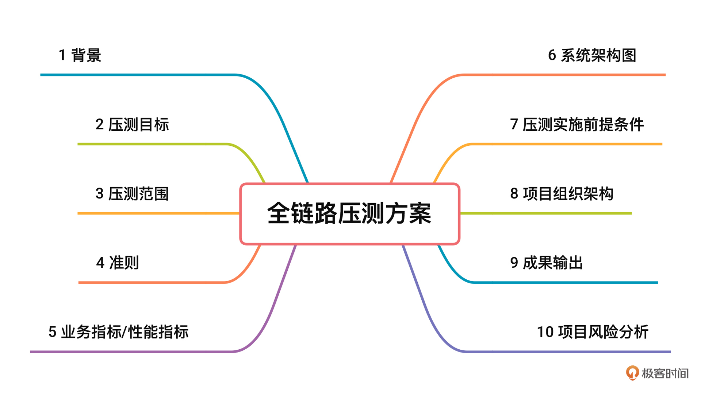

它包括性能指标、系统架构图、场景设计、监控设计、系统改造等部分，为后面的环境准备、具体执行奠定了基础。压测方案虽然常常被人忽视，但实际上起着非常关键的指导性作用。下面是我认为真正完整并且有意义的全链路压测方案的样子，希望能给你一些启发。

# 背景

接下来的课程，我要呈现的是一个完整项目从 0 到 1 落地全链路压测的过程。在项目的选择上，我将沿用我上一个专栏中的[开源微服务电商项目](https://github.com/xncssj/7d-mall-microservice)。我们这个系统采用的技术栈，是当前技术市场中流行的主流微服务技术栈，这样的环境具有很高的借鉴价值。而且，从我的 RESAR 全链路压测方案和逻辑来看，也足以支撑当前主流的微服务技术栈。

# 压测目标

1.  根据经典的电商下单流程，测试当前系统的单接口最大容量。
2.  录制真实的线上流量，回放压测流量，充分利用当前服务器资源，找到当前系统的性能瓶颈并优化，最终达到最佳容量状态。
3.  结合稳定性场景，做到精准的容量规划，给服务做限流降级提供数据上的参考。
4.  结合异常场景，实践并判断当前系统中的异常情况对线上产生的影响。

<!-- [[[read_end]]] -->

# 压测范围

通过梳理核心压测链路，即电商下单主流程，可确定压测范围，如下所示：

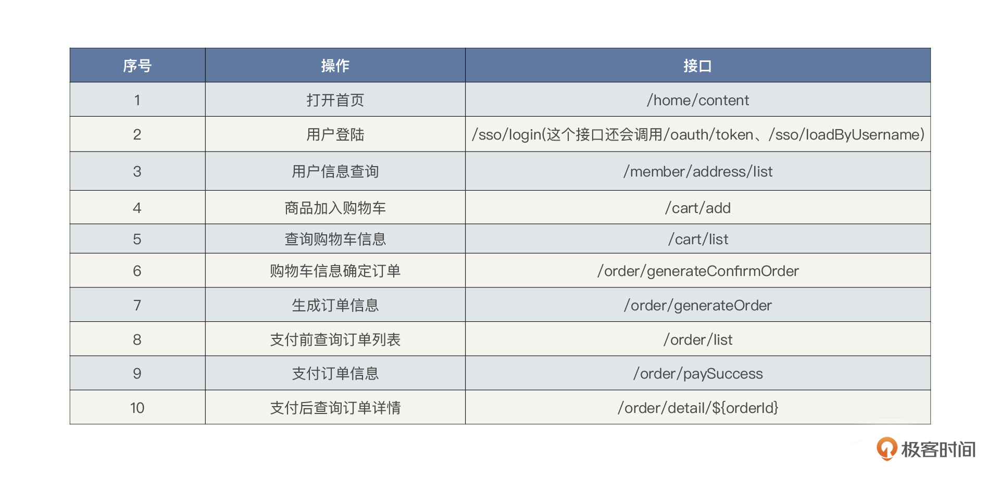

# 准则

## 启动准则

1.  确定旁路基础数据和生产一致，或按模型缩放。

2.  确定预压测（小流量）可以生成真实的业务。

3.  环境准备完毕，包括：  
    3.1. 基础静态数据压测验证通过。  
    3.2. 各组件基础参数梳理并配置正确。  
    3.3. 压力机到位并部署完毕。  
    3.4. 网络配置正确，连接通畅，可以满足压测需求。

4.压测计划、方案评审完毕。

5.架构组、运维组、开发组、测试组及相关保障人员到位。

## 结束准则

1.  达到项目的容量水位要求。
2.  关键性能瓶颈已解决。
3.  确定精准的容量规划数据。
4.  完成压测报告和性能调优报告。

## 暂停 / 再启动准则

1.  **暂停准则**

* 系统环境变化，如系统主机硬件损坏、网络传输时间超长、压力发生器出现损坏、生产库出现脏数据、系统主机因别的原因需升级暂停等。
* 需要调整线上环境资源，如操作系统升级、数据库参数调整、服务器伸缩扩容等。
* 出现压测风险中列出的问题。

2.  **再启动准则**

* 压测中发现问题得以解决。
* 线上环境恢复正常。
* 压测风险中出现的问题已解决。
* 线上环境调整完毕。

# 业务指标/性能指标

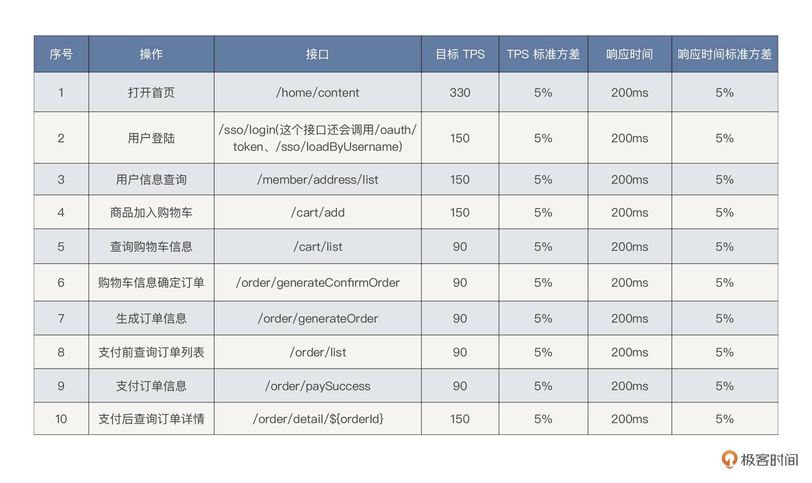

我们可以基于大促历史数据，分析流量洪峰前后的流量模型，结合当前业务量的增长趋势乘以最大容量水位系数，预估一个目标 TPS。比如这里我们暂定下单目标 TPS 为 1000，水位系数为 1（集群负荷/集群最大容量），不考虑冗余。

# 系统架构图

## 系统技术栈

我在下面整理了整个架构中使用的技术组件。它方便我们在后续的压测工作中整理出相应的关键性能参数配置。可以看到，我们这个项目已经覆盖了当前技术市场中的主流技术组件。

1.  微服务框架：[Spring Cloud](https://spring.io/projects/spring-cloud) 、[Spring Cloud Alibaba](https://github.com/alibaba/spring-cloud-alibaba)
2.  容器+MVC 框架：[Spring Boot](https://spring.io/projects/spring-boot)
3.  认证和授权框架：[Spring Security OAuth2](https://spring.io/projects/spring-security-oauth)
4.  ORM 框架：[MyBatis](http://www.mybatis.org/mybatis-3/zh/index.html)
5.  数据层代码生成：[MyBatisGenerator](http://www.mybatis.org/generator/index.html)
6.  MyBatis 物理分页插件：[PageHelper](http://git.oschina.net/free/Mybatis_PageHelper)
7.  文档生产工具：[Knife4j](https://github.com/xiaoymin/swagger-bootstrap-ui)
8.  搜索引擎：[Elasticsearch](https://github.com/elastic/elasticsearch)
9.  消息队列：[RabbitMQ](https://www.rabbitmq.com/)
10.  分布式缓存：[Redis](https://redis.io/)
11.  NoSQL 数据库：[MongoDB](https://www.mongodb.com/)
12.  应用容器引擎：[Docker](https://www.docker.com/)
13.  数据库连接池：[Druid](https://github.com/alibaba/druid)
14.  对象存储：[OSS](https://github.com/aliyun/aliyun-oss-java-sdk)、[MinIO](https://github.com/minio/minio)
15.  JWT 登录支持：[JWT](https://github.com/jwtk/jjwt)
16.  日志收集、处理、转发：[LogStash](https://github.com/logstash/logstash-logback-encoder)
17.  日志队列和缓冲：[Kafka](http://kafka.apache.org/)
18.  日志采集：[Filebeat](https://www.elastic.co/cn/beats/filebeat)
19.  可视化分析与展示：[Kibana](https://www.elastic.co/cn/kibana/)
20.  简化对象封装工具：[Lombok](https://github.com/rzwitserloot/lombok)
21.  全局事务管理框架：[Seata](https://github.com/seata/seata)
22.  应用容器管理平台：[Kubernetes](https://kubernetes.io/)
23.  服务保护：[Sentinel](https://sentinelguard.io/zh-cn/)
24.  分布式链路追踪系统：[Zipkin](https://zipkin.io/)
25.  基础资源监控： [Promethues](https://prometheus.io/)
26.  容器级链路监控： [Weave Scope](https://github.com/weaveworks/scope)
27.  可视化看板：[Grafana](https://grafana.com/)

## 系统逻辑架构图

画系统的逻辑架构图是为了后续性能分析的时候，脑子里能有一个业务链路径。我们在做性能分析时，要做响应时间的拆分，而只有了解了逻辑架构图才可以知道从哪里拆到哪里。

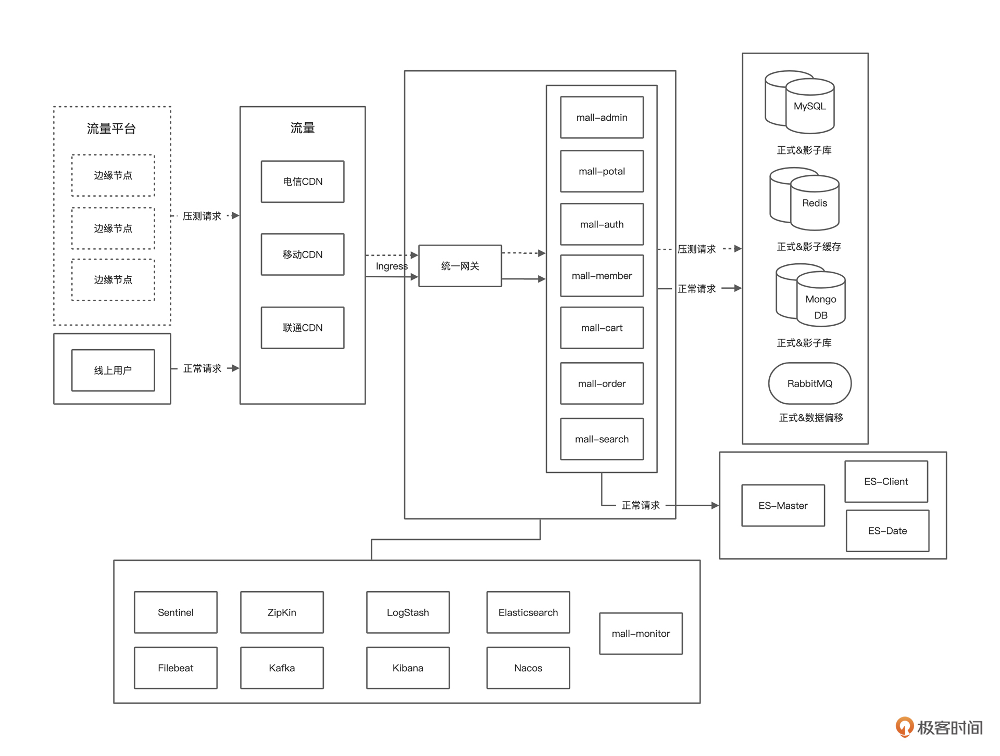

## 系统部署架构图

画部署架构图是为了让我们快速知道线上环境有多少节点、多少机器。在执行全链路压测时，可以根据经验对系统容量有一个预估。

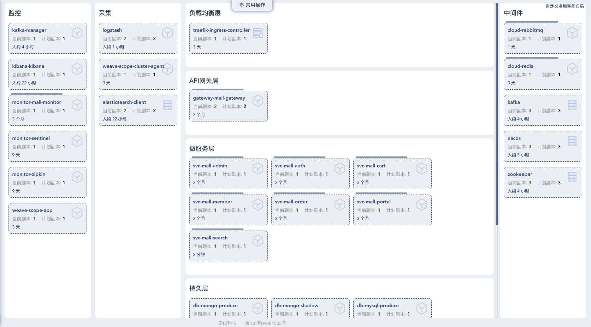

# 压测实施前提条件

## 硬件环境

通过对整体线上环境硬件资源的整理，我们可以根据经验预估大概能支持多大的业务量级，而不至于拍脑袋定指标。  
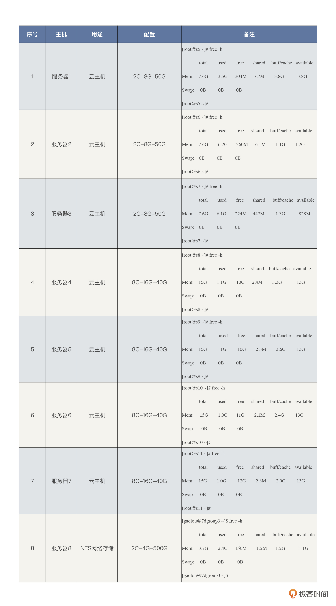

我们可以看到，当前云主机总共使用在应用中的资源是：38 C的 CPU 资源，88 G的内存资源。NFS 网络存储服务器不用在应用中。我们这里选择的云主机类型主要为计算密集型（通常比例1:2）。

在成本上，所有云主机加在一起一年大概六万左右的费用，这其中还包括云硬盘、云网络等杂七杂八的费用。

## 工具准备

### 流量平台

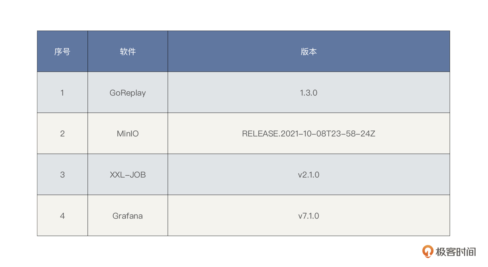

为了使得压测的请求跟真实的线上业务请求接近，在压测请求的来源方式上，我们将对线上的业务流量进行录制和回放，采用流量回放的方式来进行压测。

流量回放工具选择了 GoReplay，使用 Minio 对象存储对文件管理，可以做到对流量文件和 Gor 执行器 HTTP 上传下载。

同时在压测过程中，我们考虑将 GoReplay 数据做实时采集，然后再由 Grafana 来可视化展现。

最后，我们考虑结合 Shell 脚本，使用分布式任务调度中心对命令执行做统一任务调度。

### 监控工具

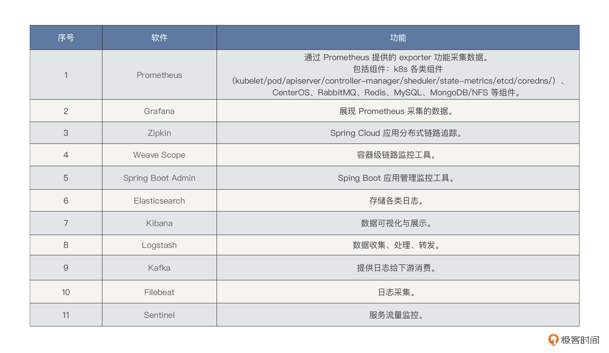

根据 RESAR 全链路压测中的“全局-定向”的全栈监控思路，我们在选择第一层监控工具时，要采集全量的全局计数器，采集的计数器包括各个层级，这里请参考前面的架构图。

但是，请你注意，在全局监控中，我们要尽量避免使用定向的监控手段，比如说 Java 应用中的方法级监控。因为在项目开始之初，我们不能确定到底在哪个层面会出现问题，所以不适合使用定向监控思路。

那全局监控怎么来做才最合理呢？这里我们可以结合线上运维现有的监控手段。注意，在性能监控过程中，我们尽量不要自己臆想，随意搭建监控工具。

## 基准数据

### 铺底数据

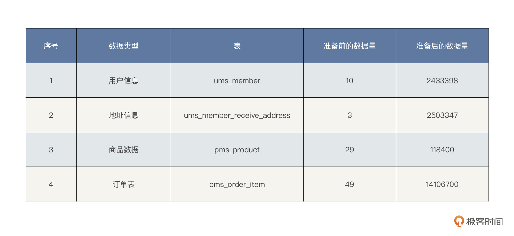

### 流量数据

在流量录制的做请求重写，加上压测标记参数，比如 Goreplay 使用–http-set-param 参数针对 URL 中存在的 key 进行改写，对不存在的参数进行追加。

这里需要强调的是，在 RESAR 全链路压测中，基础数据要满足几个特性：

1.  **生产环境的真实数据分布：**要想做到这一点，最合理的方式是脱敏生产数据。在我们这个系统中，生产流量录制后，脱敏去噪后共计 243 万条用户数据和 250 万条地址数据。
2.  **流量数据一定要使用真实数据来覆盖真实用户：**在全链路压测中一定要用真实流量数据来做参数化，而用多少数据取决于压测场景的设计。涉及真实的用户账号，需要 session 状态的，这里我们将考虑系统进行识别并单独处理。
3.  **流量数据一定要满足压测的可用性：**通过分析大促流量洪峰历史数据的增长趋势，做到精准预估当前压测需要的数据量级。

## 系统改造

### 压测标记

在全链路压测中生成压测流量后，线上业务中需要区分流量\(正常流量 \& 压测流量\)，我们称之为**链路打标**，也有的叫做**流量标记**，由于我们这个项目为微服务架构，几乎都是 RESTful 风格的 HTTP 接口，而 HTTP 是一个比较通用的协议，我们在压测流量的 Header 中增加一个标记项。一个 flag 的 key 。值为 7DGroup 的代表压测流量，key 不存在或者 key 值不等于 7DGroup，代表非压测流量。

### 压测透传

线上压测要保证压测安全且可控，不会影响真实用户的使用，不会对线上环境造成任何的数据污染。所以首先解决的是压测流量的识别与透传问题。

目前微服务架构中分布式跟踪系统作为基础设施，不会限制使用线程池等会池化复用线程的组件，并期望业务逻辑尽可能地透明。从技术能力上讲，全链路压测流量治理与分布式链路追踪系统是一样的，即流量标记。

目前市面上，几乎所有分布式链路追踪的实现，理论基础都是基于 Google Dapper 的[那篇论文](http://bigbully.github.io/Dapper-translation/)，其中最重要的核心概念就是 TraceId 和 SpanId。而对于分布式系统的压测流量透传主要涉及两大方面：

**跨线程间的透传：**

对于涉及多线程调用的服务来说，要保证压测标记在跨线程的情况下不丢失。主线程根据压测请求，将测试标记写入当前线程的 ThreadLocal 对象中，利用 [InheritableThreadLocal](https://github.com/alibaba/transmittable-thread-local) 的特性，将父线程 ThreadLocal 中的变量传递给子线程，这样就保证了压测标记的传递。而对于采用线程池的情况，同样对线程池进行封装，在往线程池中添加线程任务时，额外保存了ThreadLocal 中的变量，执行任务时再替换 ThreadLocal 中的变量。

**跨服务间的透传：**

对于跨服务的调用，我们对所有涉及到的服务进行了一一改造。利用 [Spring Cloud Sleuth](https://spring.io/projects/spring-cloud-sleuth)的服务间原生传递上下文特性，在原有传输上下文的基础上，添加压测标记的属性，以保证跨服务传输中始终带着压测标记。这样也就免去了代码的硬耦合。

### 压测隔离

线上压测最棘手的问题是写请求的压测，因为它会向生产库中写入大量的脏数据。我们借鉴了目前主流大厂的“影子库和数据偏移”的隔离方案。

* MySQL 使用影子库，将压测流量对 MySQL 的读写打到影子库上。即正常的业务库名为 mall，则影子库名 mall\_shadow，这样压测之后数据的清理工作就变得方便多了。
* MongoDB 使用影子库，即正常的业务库名为 mall，则影子库名 mall\_shadow。
* Redis 使用影子库，即正常的业务库名为 db1，则影子库名为 db5。
* RabbitMQ 使用数据偏移，发送消息后自动识别并加上压测标记。

### 日志隔离

微服务请求调用链追踪始终都是体现在分布式服务之间，我们通过网关入口透传，改造下日志框架，使接下来的日志都拦截并记录这个压测标记，那么最后存下来的日志有 traceID 和 tag 组合，最后搜索 ES 日志的时候，就能做到区分请求\(正常流量 \& 压测流量\)了。

考虑到日志打印一般是无序的，在一个用户的使用过程中，可能有多个不同的线程来进行处理。典型的例子是当用户访问某个页面时，应用服务可能会创建一个新的线程来处理该请求，也可能从线程池中复用已有的线程。在一个用户 session 存续期间，可能有多个线程处理过该用户的请求。当需要追踪某个用户在系统中的相关日志记录时，就会变得很麻烦。

解决办法就是引入 MDC（Mapped Diagnostic Context，映射调试上下文）。而 [SLF4J](http://www.slf4j.org/) 提供了 [MDC](http://www.slf4j.org/api/org/slf4j/MDC.html) \( Mapped Diagnostic Contexts \)功能，它的实现也是利用了 ThreadLocal 机制。改造代码只需要将指定的值 put 到线程上下文的 Map 中，然后在对应的地方使用 get 方法获取对应的值，从而达到自定义和修改日志输出格式内容的目的。

考虑到压测流量比较大，产生的日志也非常多，压测流量的日志很容易覆盖正常流量的日志。我们选择改写 Logback 的 Appender，根据流量标记将日志写入对应影子目录中，并且配置默认的删除策略，日志只保存三天。

### Mock 设计

对于第三方接口，例如下单支付，给用户发消息等，我们不能将压测流量的请求打过去，所以需要改写请求的逻辑，将 Mock 的逻辑保存在 Mock Server 上面，考虑使用 AOP 技术进行统一封装。

# 压测设计

## 场景执行策略

### 场景递增策略

对于性能场景，我们认为它必须满足两个条件：**连续**和**递增**，所以在这次的全链路压测执行过程中，我们会把这两点应用到下面的业务场景中。

这里面的详细介绍可以参考性能工程专栏的[《05 | 性能方案：你的方案是否还停留在形式上？》](https://time.geekbang.org/column/article/357539)

### 业务场景

在 RESAR 全链路压测中，性能场景只需要四类，执行顺序从上到下依次为：

* 基准场景
* 容量场景
* 稳定性场景
* 异常场景

请你注意，除了这四类性能场景外，再没有其他类型的场景了。在每一个场景分类中，我们都可以设计多个具体的场景来覆盖完整的业务。具体可以参考[《高楼的性能工程实战课》](https://time.geekbang.org/column/intro/402)，这里我就不逐一解释了。

## 监控设计

### 全局监控

有了前面的监控工具部分，监控设计就反而简单了。对于我们这个系统，全局监控如下所示：

从上图来看，我们使用 Prometheus/Grafana/Spring Boot Admin/Zipkin/Weave Scope/ELFK/Sentinel 实现具有全局视角的第一层监控。对工具中没有覆盖的第一层计数器，我们只能在执行场景时再执行命令来补充了。

注意，为了应对线上的风险，我们还需要提供压测熔断机制来应对突发事件，降低压测对线上服务的影响。这里我们主要考虑两个方面：

* 基于核心业务指标异常告警熔断
* 基于基础资源 Metric 告警熔断

### 定向监控

那后面的定向监控怎么办呢？在这里我也大体列一下常用的工具。这些工具是在有性能问题的时候才会去使用的。

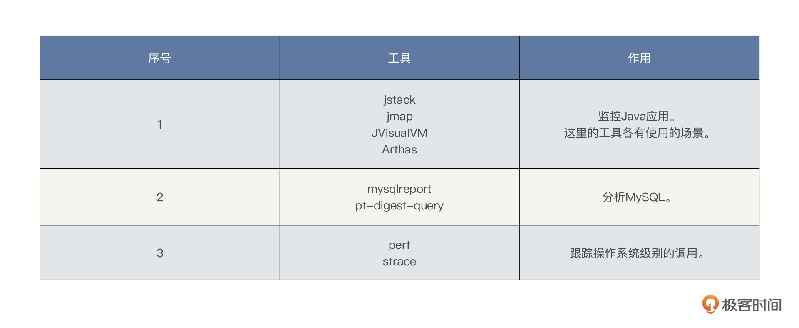

在性能分析的过程中，还会使用很多其他工具查找证据链，这里只能给出最常用的工具，无法全部罗列出来。大家要根据系统使用到的技术组件灵活使用工具，在课程后续的操作中，我们也有可能使用一些没有列出的工具。

# 项目组织架构

在全链路压测方案中，一定要画出项目的组织架构图，并且请你一定要在这部分写明各组织人员的工作范围和职责，避免出现扯皮的情况。我大体画了一下常见的组织架构图：

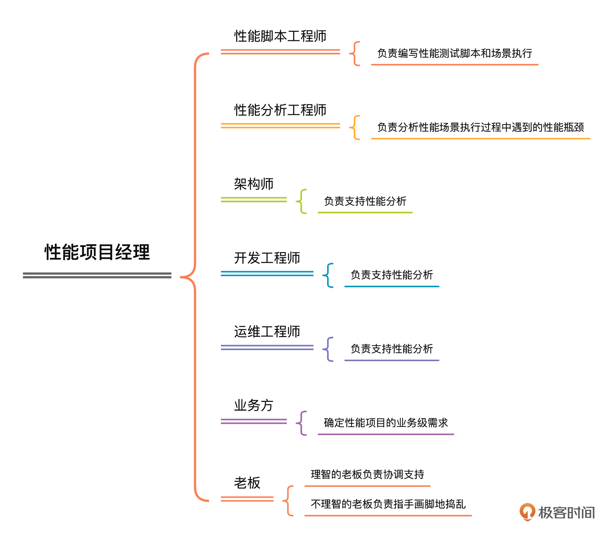

这是我按照工作内容而不是职场中的工作职位来设计的组织架构，我觉得这是一个合理的组织架构。在这张图中，性能工程师所负责的事情是现在大部分性能从业人员都在做的。此外，我们还需要性能分析工程师、架构师、开发工程师、运维工程师的支持和保障。

业务方作为性能的业务需求来源也必不可少。如果业务方提不出来什么合理的性能需求，那这个全链路压测项目很有可能一片混乱。

至于老板这个角色，在性能项目中，我们经常看到的老板都不懂什么叫性能，只会叫着要支持 XXX 并发用户数，支持 XXX 在线用户数。其实，这样的老板沟通起来也很简单，就是拿结果给他看就好了。不过，在全链路压测项目的执行过程中，当线上资源不足时，请你一定要让老板知道，同时降低老板的预期，要不然在后续的沟通中会很费劲。

# 成果输出

## 过程性输出

1.  压测方案
2.  流量数据
3.  场景执行结果
4.  监控结果
5.  问题记录

在全链路压测项目中，过程性输出有这些内容就够了。我们经常看到很多项目在执行完之后，除了有一份压测报告之外，什么过程性输出都没有。实在不理解这样的企业是怎么积累性能经验的。

## 结果输出

通常情况下，我们做的性能项目都会输出两个最终交付的文档：一个是性能场景执行结果记录的报告（就是现在我们常写的压测报告），另一个是性能调优报告。

* **全链路压测报告**

压测报告想必大家见得多了，这里只强调几点：

1.  一定要有结论，而不是给出一堆类似“资源使用率是多少”“TPS 是多少”“响应时间是多少”这种描述类的总结语。我们要给出“当前系统可支持 XXX 并发用户数”这样的结论。
2.  一定不要用“可能”这种模棱两可的词。
3.  压测报告中要有对运维工作的建议，也就是要给出关键性能参数的配置建议，比如线程池、队列、超时、服务限流降级等。
4.  性能结果报告中要有对后续压测工作的建议。

* **性能调优报告**

**调优报告是整个性能项目的精华，调优报告中一定要记录下每一个性能问题的问题现象、分析过程、解决方案和解决效果。可以说，调优报告完全是一个性能团队技术能力的体现。**

# 项目风险分析

对于全链路压测项目的风险，我把比较常见的风险列在这里：

1.  业务侧的性能需求不明确。
2.  线上环境问题。
3.  脏数据问题。
4.  梳理链路不准确。
5.  多个团队间协调沟通困难，无法协同。
6.  瓶颈分析不到位，影响进度。
7.  …

在我们这个课程所用的项目中，比较大的风险就是：

1.  硬件资源有限。
2.  项目时间不可控，因为出了问题，并没有人支持，只能自己搞。

不过请你放心，我们会努力克服困难，把这个全链路项目的执行过程都记录下来。

到这里，整个全链路压测方案就结束了。

# 总结

在这节课里，我把一个全链路压测方案该有的内容以及要写到什么程度，都给你梳理了一遍。希望能给你一些借鉴。

压测方案是一个性能项目的重要输出。对于一个完整的项目来说，压测方案就显得极为重要。因为它指导了整个项目的实施过程。在压测方案中，我强调了几个重点：核心链路、性能指标、系统架构图、系统改造、场景设计、监控设计等，它们都会对整个全链路压测项目的质量起到关键作用。

看完我的方案，希望你可以在后续的项目中，自己尝试去写一个完整的全链路压测方案。如果在撰写的过程中遇到什么问题，也可以在留言区向我提问。

# 课后题

这节课的内容到这里就要结束了，最后，请你思考两个问题：

1.  如何精确预测线上压测基础数据量？
2.  为什么要强调系统架构图的重要性？

欢迎你在留言区与我交流讨论。当然了，你也可以把这节课分享给你身边的朋友，他们的一些想法或许会让你有更大的收获。我们下节课见！