---
date: "2019-06-23"
---  
      
# 05 | 铺底数据：真实的压测数据应该做成什么样子？
你好，我是高楼。

这节课，我们来聊一下怎么准备全链路压测的铺底数据。

做测试少不了与测试数据打交道，做性能测试更不是几条数据就能简单概括的事情。

在全链路压测过程中，测试数据是必须计算清楚的。通常，测试数据分为**铺底数据**与**参数化数据（流量数据）**，不管是平时的业务功能测试、自动化测试，还是全链路压测等都需要有铺底数据，它们的区别只在于数据量级。另外，铺底数据还是压测清单与压测报告必须说明的内容。

那么铺底数据与参数化数据从什么地方获取呢？获取的数据又是否符合真实分布？下面我介绍几种构造数据的方法与思路，希望你能有所收获。

# 数据来源分析

刚才已经提到了，测试数据分为铺底数据与参数化数据。古人常说，“圣人千虑，必有一失；愚人千虑，必有一得。”我们也来思考一下，铺底数据是怎么获取的？

造数据这个事情对于工作时间不久的同学来说是一个棘手的事情，但对于一个工作很长时间的老鸟来说，这不是什么大问题。（对于压测数据要造多少量，分析逻辑你可以参考《[性能场景的数据到底应该做成什么样子？](https://time.geekbang.org/column/article/359221)》）

既然想要做铺底数据，就得知道要使用哪些表和字段。在做全链路压测之前，这些内容都要提前梳理出来。

你可以先把业务场景梳理完，再把相关接口整理出来。做完这些，就可以开始查找证据链了。

<!-- [[[read_end]]] -->


我把使用表的链路画成了一个流程图，在图中，我标示出了通过接口找到服务，进而找到 SQL和表的全过程。总之，查找思路就是层层追踪，一直找到表为止。造数据就是体力活。

现在你可以回想一下，这次链路涉及哪些服务、哪些表？表之间的关系又是什么？你可以复习一下上节课的内容，这里我就不再重复说了。

下面，我们通过实例演示怎么层层分析查找表。

## 表链路追踪示例

先追踪首页链路，打开首页 JMeter 脚本，观察下图文本框。

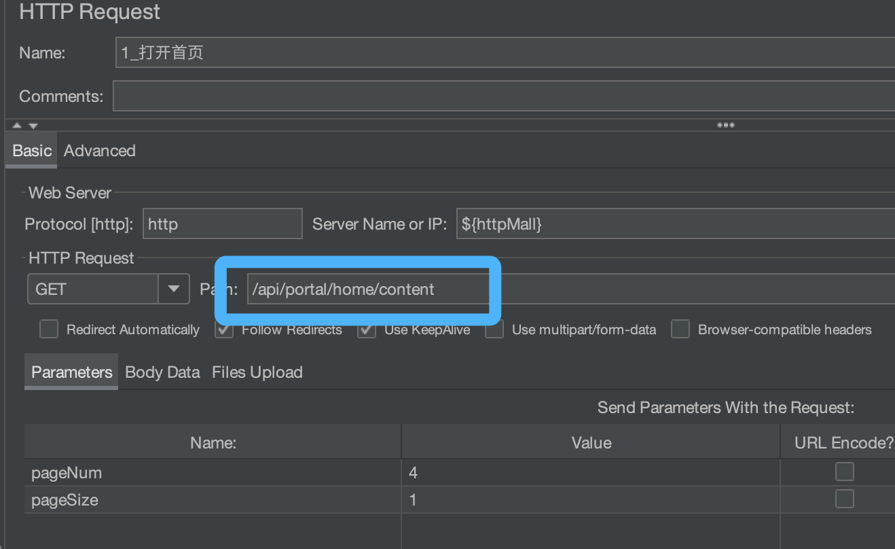

当前接口路径为【 /api/portal/home/content 】，可以知道目前请求的服务为 Portal 服务。

通过架构图，我们可以很清晰地知道当前在什么位置。

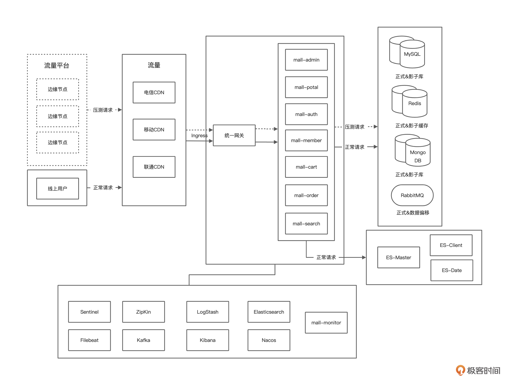

上图是用户从网关到应用再到数据库的调用逻辑。

我在这里用一个电商系统做案例演示。在分析代码之前，我们先回顾下 MVC （Model、View、Controller）开发模式。下图是最常见的一种开发模式，在 PaaS 化平台开发（Platform-as-a-Service，统一提供的平台类服务）中会稍有变动，需要根据实际项目调整分析步骤。

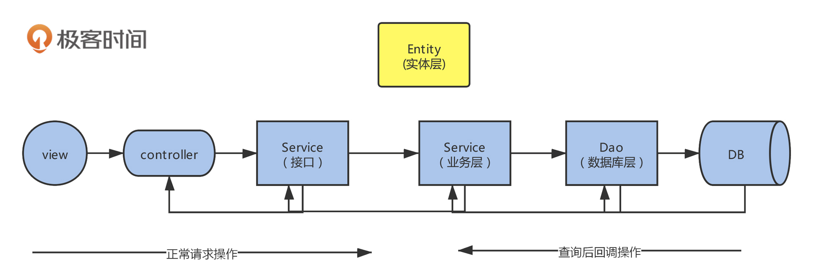

有了这种开发模式做基础，我们就可以很轻松地根据请求 url 一步一步分析了。

首先找到网关服务，再找到服务对应的 controller 层。在这里，你可以很清晰、直观地看到当前的请求，当前的服务。


思路参考：

1、找到接口请求的服务（本次是：Portal 服务）。

2、打开 Idea，然后打开 mall 源码，找到资源路径为 /content ，接口为：

```
     @ApiOperation("首页内容页信息展示")
        @RequestMapping(value = "/content", method = RequestMethod.GET)
        @ResponseBody
        public CommonResult<HomeContentResult> content(@RequestParam(value = "pageNum", defaultValue = "4") Integer page,
                                                       @RequestParam(value = "pageSize", defaultValue = "1") Integer size) {
            HomeContentResult contentResult = homeService.content(page, size);
            return CommonResult.success(contentResult);
        }
    

```

3、根据 MVC 开发思路，通过 controller 层找到业务层，然后根据业务层找到 DAO 层，再找到表。我在下面给出了业务层的代码供你参考。

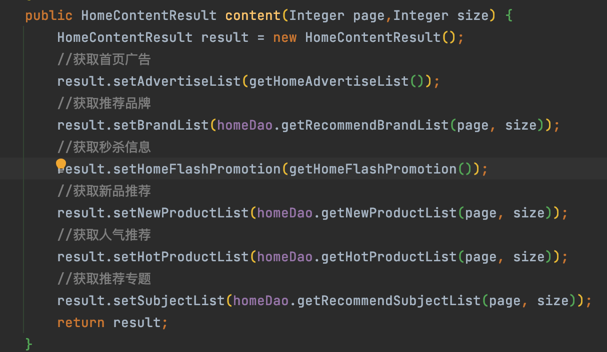

通过代码，我们可以梳理出链路追踪图，下图这种分析方法能一目了然地让我们知道，目前的方法调用了哪个表。

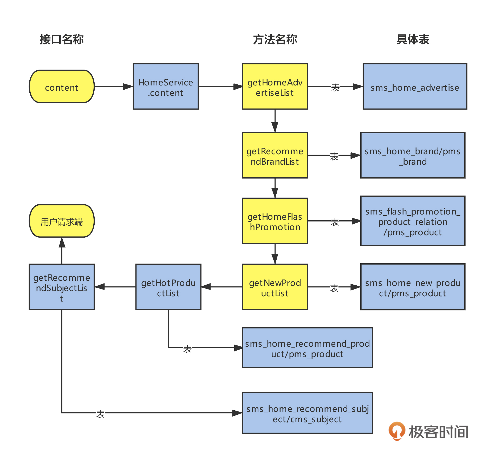

**需要注意的是，即使梳理出了表关系，也要在分析压测链路相关的业务之后，才能决定是否需要铺底数据。**

铺底数据的目的是模拟真实场景与预测业务一段时间后是否还能正常运转。上面的图片只是一个链路追踪分析示意图，它的目的就是找到表。其他的业务模块也可以按这样的方法去找到对应的表。

假如自己没有权限，你可以找对应的研发，让他梳理接口与表之间的关系，还需要告诉研发什么时候做压测，压测之前做好相关表铺底数据与备份工作，并且告诉他一个表的铺底数据量大概是多少。

顺便提一下，查找代码逻辑当然也可以借助 IDE 里面的提效工具，比如以下就是 IntelliJ IDEA [SequencePlugin](https://vanco.github.io/SequencePlugin/) 生成的代码调用图。

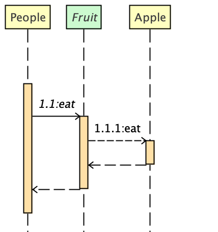

对于铺底数据来说，来源最可靠的就是从生产数据导入。不要认为直接导入就能用，对于用户来说，身份证号、手机号、银行账号、邮箱、密码、教育背景、还有家庭详细地址等这些信息都是敏感信息，一旦泄露出去就是重大信息安全事故，所以都必须做数据脱敏。

通过上一节梳理出来的场景，再根据上面的代码分析逻辑，我们很快就梳理出了压测链路的表，它们分别是：

1.  用户表
2.  用户地址表
3.  商品表
4.  库存表
5.  购物车表
6.  订单表

一般用户相关的表、订单相关表需要做铺底数据，商品表与库存表则只需要库存充足就行了。这些我们都需要灵活处理，不用墨守成规。

下面我们打开用户表观察一下表的结构。

```
    use 7dnewmall;
    desc ums_member; --命令看结果
    
    -- 直接打开表看信息
    CREATE TABLE `ums_member` (
      `id` bigint(20) NOT NULL AUTO_INCREMENT,
      `member_level_id` bigint(20) DEFAULT NULL COMMENT '会员等级',
      `username` varchar(64) DEFAULT NULL COMMENT '用户名',
      `password` varchar(64) DEFAULT NULL COMMENT '密码',
      `nickname` varchar(64) DEFAULT NULL COMMENT '昵称',
      `phone` varchar(64) DEFAULT NULL COMMENT '手机号码',
      `status` int(11) DEFAULT NULL COMMENT '帐号启用状态:0->禁用；1->启用',
      `create_time` datetime DEFAULT NULL COMMENT '注册时间',
      `icon` varchar(500) DEFAULT NULL COMMENT '头像',
      `gender` int(11) DEFAULT NULL COMMENT '性别：0->未知；1->男；2->女',
      `birthday` date DEFAULT NULL COMMENT '生日',
      `city` varchar(64) DEFAULT NULL COMMENT '所做城市',
      `job` varchar(100) DEFAULT NULL COMMENT '职业',
      `personalized_signature` varchar(200) DEFAULT NULL COMMENT '个性签名',
      `source_type` int(11) DEFAULT NULL COMMENT '用户来源',
      `integration` int(11) DEFAULT NULL COMMENT '积分',
      `growth` int(11) DEFAULT NULL COMMENT '成长值',
      `luckey_count` int(11) DEFAULT NULL COMMENT '剩余抽奖次数',
      `history_integration` int(11) DEFAULT NULL COMMENT '历史积分数量',
      PRIMARY KEY (`id`),
      UNIQUE KEY `idx_username` (`username`),
      UNIQUE KEY `idx_phone` (`phone`)
    ) ENGINE=InnoDB AUTO_INCREMENT=12 DEFAULT CHARSET=utf8 COMMENT='会员表'
    

```

在用户表中，你会发现用户名、密码、手机号都是敏感信息，都需要脱敏处理才能使用。那为什么职业与城市不是敏感信息呢？因为用户名与手机号修改之后，职业和城市的覆盖范围就太大了，这些信息自然就不再是敏感信息了。

你可以再打开地址信息表。

```
    CREATE TABLE `ums_member_receive_address` (
      `id` bigint(20) NOT NULL AUTO_INCREMENT,
      `member_id` bigint(20) DEFAULT NULL COMMENT '用户表ID',
      `name` varchar(100) DEFAULT NULL COMMENT '收货人名称',
      `phone_number` varchar(64) DEFAULT NULL COMMENT '收货人手机',
      `default_status` int(11) DEFAULT NULL COMMENT '是否为默认',
      `post_code` varchar(100) DEFAULT NULL COMMENT '邮政编码',
      `province` varchar(100) DEFAULT NULL COMMENT '省份/直辖市',
      `city` varchar(100) DEFAULT NULL COMMENT '城市',
      `region` varchar(100) DEFAULT NULL COMMENT '区',
      `detail_address` varchar(128) DEFAULT NULL COMMENT '详细地址(街道)',
      PRIMARY KEY (`id`)
    ) ENGINE=InnoDB AUTO_INCREMENT=7 DEFAULT CHARSET=utf8 COMMENT='会员收货地址表'
    

```

这个表也需要把收货人姓名和手机号做数据脱敏处理。

最后你还需要打开订单表，这里的一些重要信息也需要脱敏才能使用。哪些信息呢？这个问题不难，你可以自己想一想。

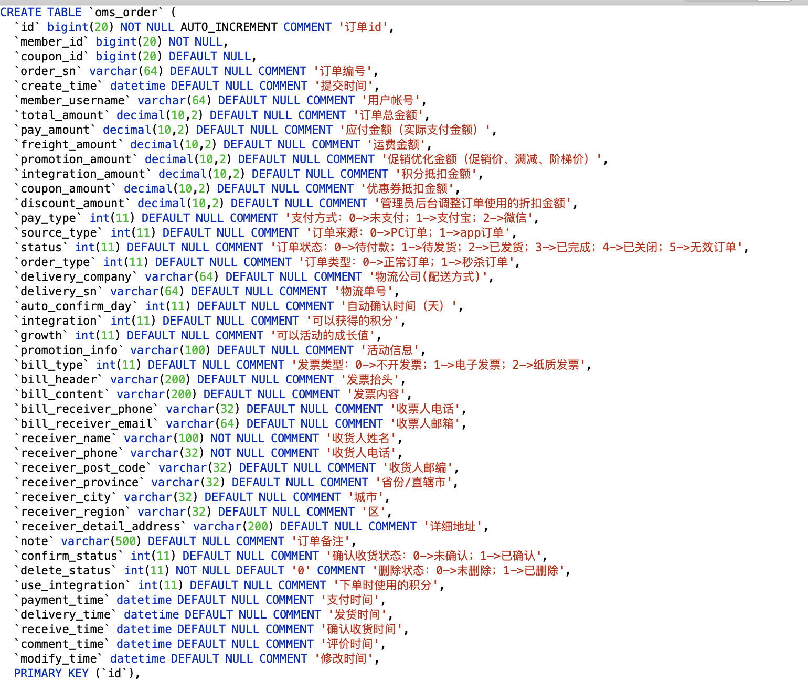

到这里，你知道了压测会涉及到哪些表，也知道了表中哪些数据需要脱敏处理，之后的事情就是找到合理的方法，把生产上面的数据处理后给性能测试库做铺底数据，或者给业务测试使用，那么具体应该怎么处理呢？

## 铺底数据的处理方法

### 1\. SQL替换脱敏数据

第一种方法是采用 MySQL 批量替换功能。请注意，只有数据库已经备份或者已经导入到测试库的时候，才能这样操作。

比如脱敏用户表，一般用户表脱敏用户名、密码、手机号等信息，密码都是加密的。但是脱敏的用户还是需要批量修改密码，不修改密码就不能登陆和获取认证 token ，没有 token 其他业务就没法获取请求。

假设下图蓝框内的手机号就是需要脱敏的手机号。

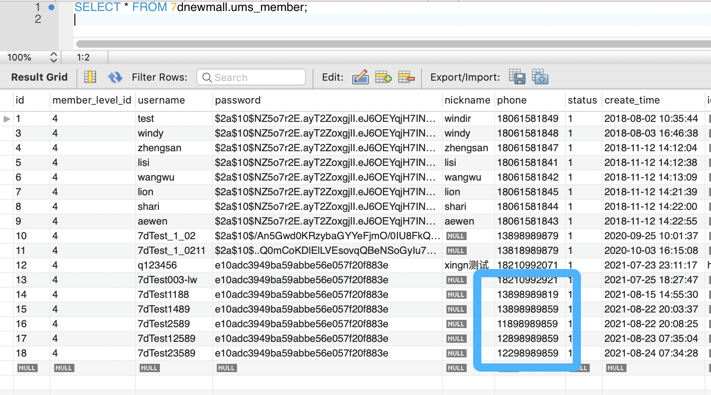

MySQL 中有 DML\(Data Manipulation Language\) 操作语言，其中 update 语句可以直接批量更新需要脱敏的表中的字段。

你可以看一下我给出的语句表达式和操作语句示例。

```
    UPDATE 表名 SET 字段名= REPLACE( 替换前的字段值, '替换前关键字', '替换后关键字' )  WHERE 条件；
    

```

```
    use 7dnewmall;
    
    SELECT * FROM 7dnewmall.ums_member;
    update 7dnewmall.ums_member set phone=replace(phone,'898','188')  where username like '7d%';
    SELECT * FROM 7dnewmall.ums_member;
    

```

再次执行查询 SQL 查看用户表和用户手机号，可以看到，带 where 条件的数据已经修改好了，在下图中，你可以看到具体的查询语句。

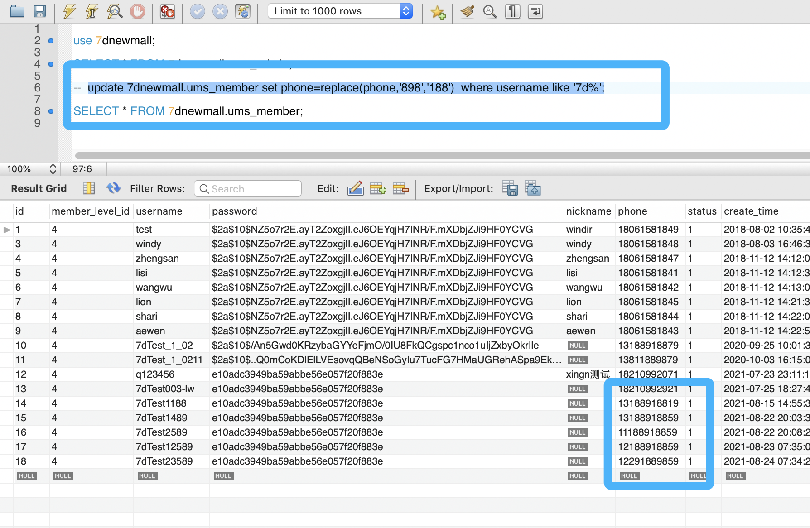

### 2\. 用Python脱敏数据

你需要先创建一个数据库，再创建一个表，下面是简单的语句：

```
    CREATE TABLE `user` (
      `id` int(11) NOT NULL AUTO_INCREMENT,
      `name` varchar(50) DEFAULT NULL,
      PRIMARY KEY (`id`)
    ) ENGINE=InnoDB AUTO_INCREMENT=8 DEFAULT CHARSET=utf8mb4 COLLATE=utf8mb4_0900_ai_ci
    

```

下一步，编写 Python 脚本，导入 pymysql 模块。  
在脱敏表数据的时候，可以根据需要修改成想要的数，下面给出的代码是最简单的操作示例。

```
    # -*- coding:utf-8 -*-
    # @Time: 9/17/21 23:09 PM
    # @Author: dunshan
    # @File: mallmysql.py
    
    import pymysql
    
    # 打开数据库连接
    conn = pymysql.connect(host="localhost", user="root", passwd="li123456", db="7d_api")
    
    if __name__ == '__main__':
        cur = conn.cursor()
        cur.execute("select * from user;")
        results = cur.fetchall()
        for row in results:
            # print(row[0])
            # print(row[1])
    
            sql = "INSERT INTO user(name) VALUES ('%s')" % (row[1] + "_测试")
    
            cur.execute(sql)
            conn.commit()
    

```

执行完上面的代码，查看表中的结果。

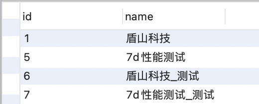

不过，**上面讲的只是单个数据库的实例演示，如果是不同库，就需要新建两个数据库链接进行操作了。**

### 3\. 用Java脱敏数据

这里我们通过原始 JDBC 链接操作数据库。大家可以根据实际情况把数据采集过来，加工后插入新数据库表中。下面的示例没有采用批处理插入数据，只是提供一种采集脱敏的方式。

你可以参考我给出的代码。

```
    import java.sql.*;
    
    /**
     * @author dunshan
     * @Title: 全链路
     * @Description: 铺底数据
     * @date 2021/9/19 / 11:11
     */
    public class JdbcOperMysql {
        private static String url = "jdbc:mysql://localhost:3306/mall_new?useUnicode=true&characterEncoding=utf-8&serverTimezone=Asia/Shanghai&allowMultiQueries=true";
        private static String username = "root";
        private static String password = "root";
        private static String driverClass = "com.mysql.cj.jdbc.Driver";
     
         //读取数据表
        public static void main(String[] args) throws SQLException, ClassNotFoundException {
            //注册数据库驱动
            Class.forName(driverClass);
            //通过DriverManager获取连接
            Connection connection = DriverManager.getConnection(url, username, password);
            //获取Connection对象获取Statement对象
            Statement statement = connection.createStatement();
            //执行SQl语句
            String sql = "SELECT * FROM ums_member;";
            ResultSet resultSet = statement.executeQuery(sql);
            //操作ResultSet
            System.out.println("id|username|nickname|phone|birthday");
    
    
    
            while (resultSet.next()) {
                UmsMember umsMember = new UmsMember();
                Long id = resultSet.getLong("id");
                String username = resultSet.getString("username");   //用户脱敏脱敏
                String nickname = resultSet.getString("nickname");    //昵称需要脱敏
                String phone = resultSet.getString("phone");        //手机号需要脱敏
                Date birthday = resultSet.getDate("birthday");
                System.out.println(id + "|" + username + "|" + nickname + "|" + phone + "|" + birthday);
                umsMember.setId(id);
                umsMember.setNickname(username);
                umsMember.setNickname(nickname);
                umsMember.setPhone(phone);
                umsMember.setBirthday(birthday);
                //插入表
                insertMall(umsMember);
            }
    
    
    
            if (resultSet == null) {
                try {
                    resultSet.close();
                } catch (SQLException e) {
                    e.printStackTrace();
                }
                resultSet = null;
            }
            if (statement == null) {
                try {
                    statement.close();
                } catch (SQLException e) {
                    e.printStackTrace();
                }
                statement = null;
            }
            if (connection == null) {
                try {
                    connection.close();
                } catch (SQLException e) {
                    e.printStackTrace();
                }
                connection = null;
            }
        }
    
        //插入新数据表
        public static void insertMall(UmsMember umsMember) throws SQLException, ClassNotFoundException {
            String url = "jdbc:mysql://localhost:3306/mall?useUnicode=true&characterEncoding=utf-8&serverTimezone=Asia/Shanghai&allowMultiQueries=true";
            String username = "root";
            String password = "root";
            String driverClass = "com.mysql.cj.jdbc.Driver";
            Connection connection = null;
            PreparedStatement preparedStatement = null;
            try {
                Class.forName(driverClass);
                //创建应用程序与数据库连接的Connection对象
                connection = DriverManager.getConnection(url, username, password);
                //执行SQL
                String sql = "INSERT INTO users(name,password,phone,brithday)" + "VALUES(?,?,?,?)";
                preparedStatement = connection.prepareStatement(sql);
                preparedStatement.setString(1, umsMember.getUsername());
                preparedStatement.setString(2, umsMember.getNickname());
                preparedStatement.setString(3, umsMember.getPhone());
                Date birthday = (java.sql.Date) umsMember.getBirthday();
                preparedStatement.setDate(4, birthday);
    
    
    
                preparedStatement.executeUpdate();
    
    
    
            } catch (ClassNotFoundException e) {
                e.printStackTrace();
            } finally {
                if (preparedStatement == null) {
                    try {
                        preparedStatement.close();
                    } catch (SQLException e) {
                        e.printStackTrace();
                    }
                    preparedStatement = null;
                }
                if (connection == null) {
                    try {
                        connection.close();
                    } catch (SQLException e) {
                        e.printStackTrace();
                    }
                    connection = null;
                }
    
            }
        }
    }
    

```

### 4\. 用ETL Kettle脱敏数据

你还可以使用 ETL 操作数据库来脱敏数据。但这个话题比较复杂，受到篇幅限制我没有办法在这里给你展开。你可以在[官方网站](https://community.hitachivantara.com/docs/DOC-1009855)了解相关内容，也可以直接[下载](https://sourceforge.net/projects/pentaho/)平台，通过实践来了解这方面的知识。

下图是 Kettle 通过 HTTP 接口获取原始数据，数据处理完后导入到关系型数据库中的例子。


### 5.用性能测试工具脱敏数据

我们可以通过JMeter、LoadRunner等压力工具，跑业务场景接口，把铺底数据造出来。

下图是一个 JMeter 跑混合场景的例子。


### 6.其他脱敏数据的方法

可以采用存储过程造数据、也可以分析日志，也就是把日志的数据处理完毕后，再脱敏敏感数据。这些处理过的数据可以用作铺底数据或测试数据。

下图是一个之前我们设计使用存储过程方案清洗生产数据的示意图。

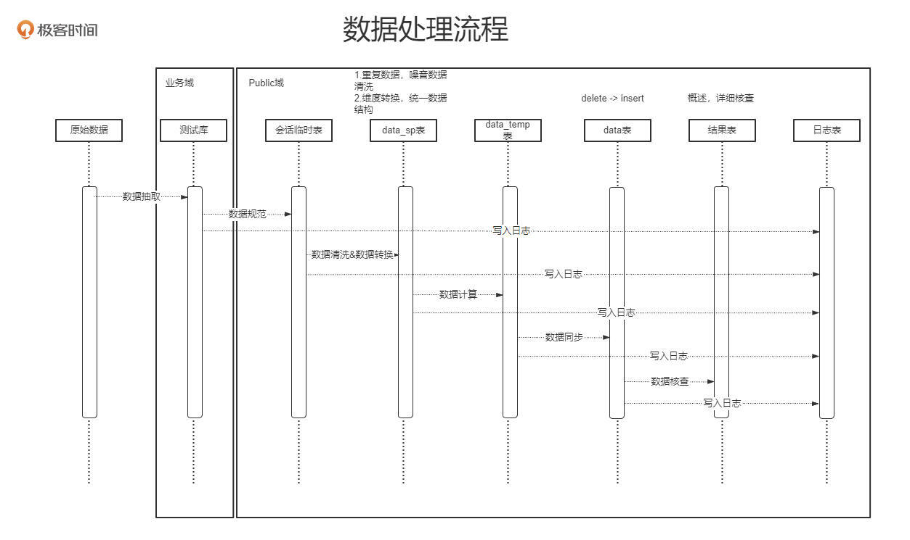

主要实现了以下的功能：

1.  使用存储过程实现了简单的数据清洗，满足了目前项目测试的数据需求。
2.  数据清洗解耦了执行和处理逻辑，支持动态扩展清洗规则。
3.  使用存储过程实现了数据抽取功能，支持规则表动态生成采集 SQL。
4.  使用临时中间表做数据同步，支持异常回滚。
5.  建立统一的表映射机制，满足了目前项目上的测试数据清洗需求。
6.  抽象了目前几种常用的数据核查规则，支持规则表动态扩展。
7.  满足源数据及存储表的一键数据核查，支持自动生成结果。
8.  通过日志表监控整个处理链路，实现了结果汇总，异常捕获，调试打印等功能。

到这里，你已经知道了造铺底数据的各种方法，但还有一个条件需要你注意：**你的项目是新项目还是老项目？**

实际上，新老项目在造铺底数据时还是有一点小区别的。如果是老项目，你可以根据自己项目的实际情况，从我上面所讲的方法中选择最适合自己的。但如果是新项目，其实通过业务场景把铺底数据跑出来才是最安全可靠的。它可以保证数据完整、分布均匀，重要的是不用修改什么造数逻辑，一个人就能做到。但缺点是花的时间长，需要跑每个逻辑，最终还是会把数据插入系统表中。

你可能会说，直接用存储过程、 SQL 或者其他工具把数据造出来不可以吗？这样造数据没有错，但如果系统复杂、表逻辑复杂，用存储过程就不是一个很好的方法。**对于新项目来说，建议通过业务脚本开多线程跑铺底数据。**

# 总结

好了，今天的课程到这里就要接近尾声了，我们再回过头来看一看。我们今天学习了怎么通过业务场景查找表，也学到了造数据的几种技术方法与思路。

铺底数据会直接影响性能测试结果。对于老系统来说，直接通过脱敏生产数据就能使用；但对于新系统来说，还是建议通过业务场景造铺底数据，这样最安全也是最有效。

对于铺底数据量，我们的目标是找到符合生产量级的数据量。新系统可以通过具体的业务推测未来3-5年系统大概会有多少用户，然后用这个数据做参考去跑铺底数据，跑数据的同时需要考虑数据分布，如果分布不正确会影响压测结果。

# 思考题

学完今天的课程，请你思考下面两个问题：

1、铺底数据的来源有哪些？

2、生产数据脱敏有几种方式？

欢迎你在评论区和我分享你的思考成果，也可以把这节课分享给你的朋友一起交流讨论，我们下节课再见！