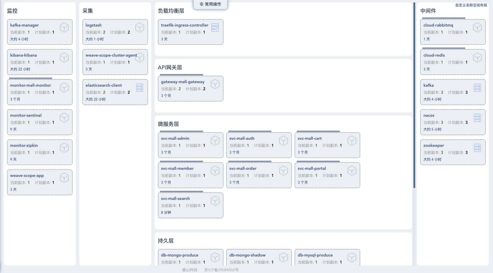
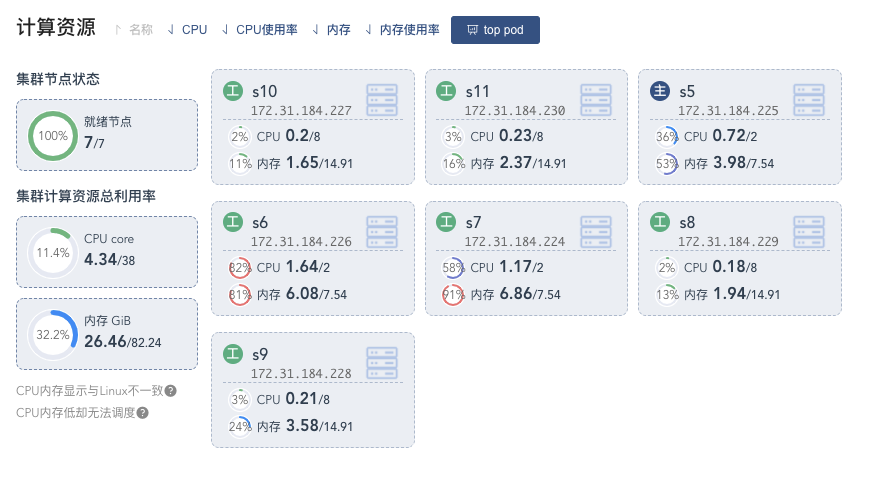
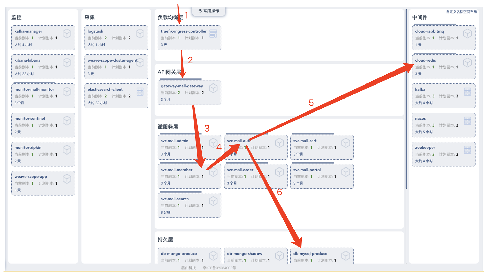
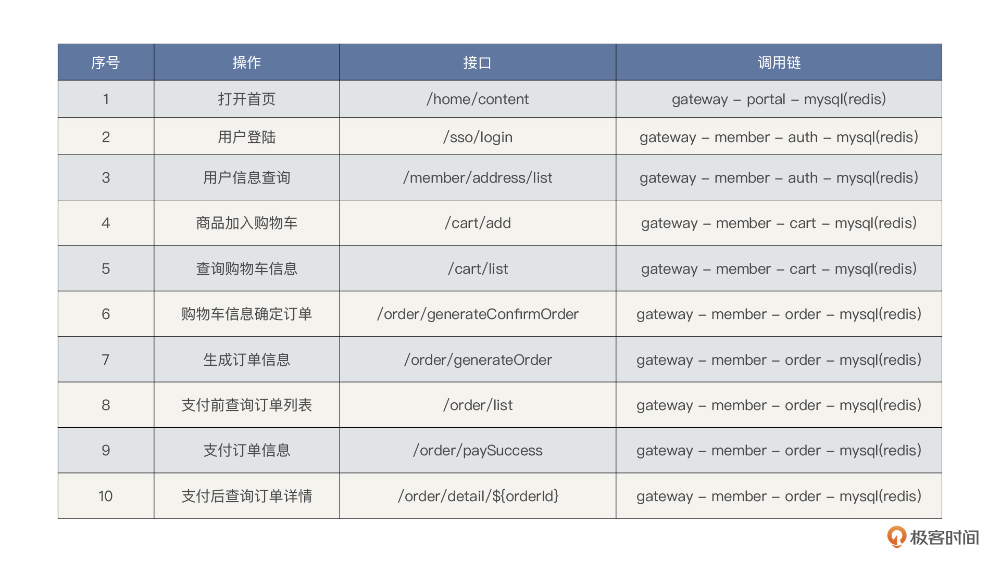
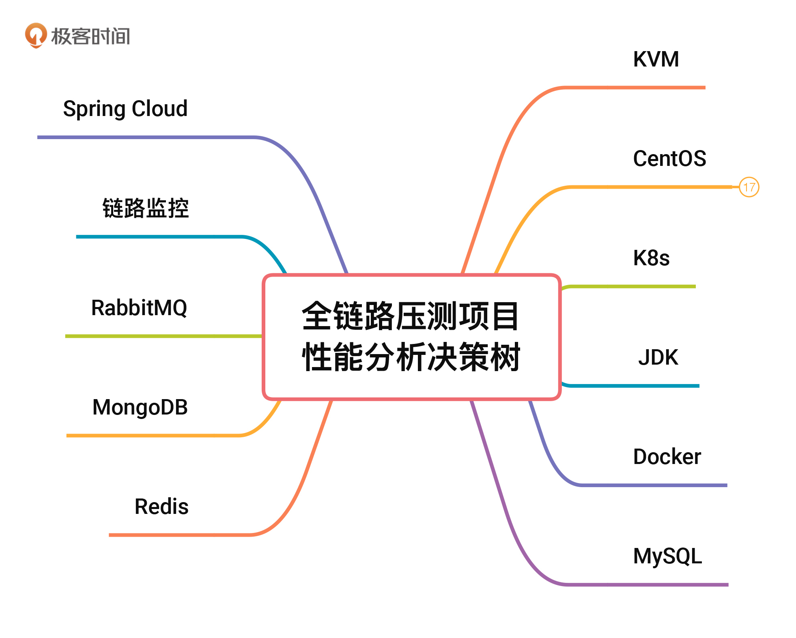
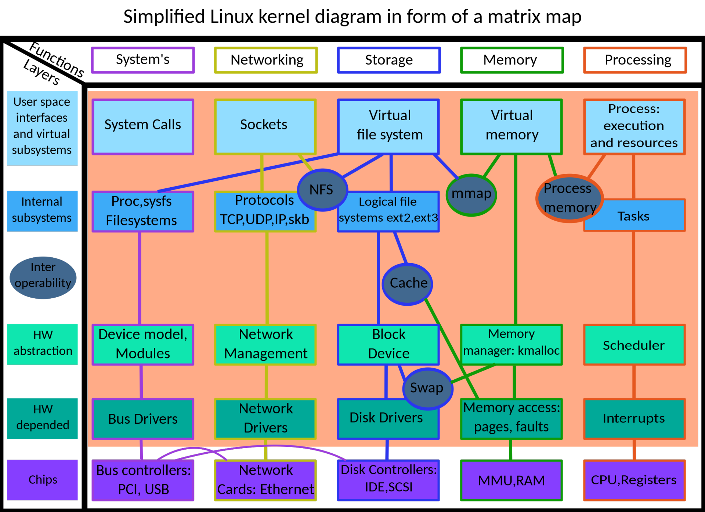
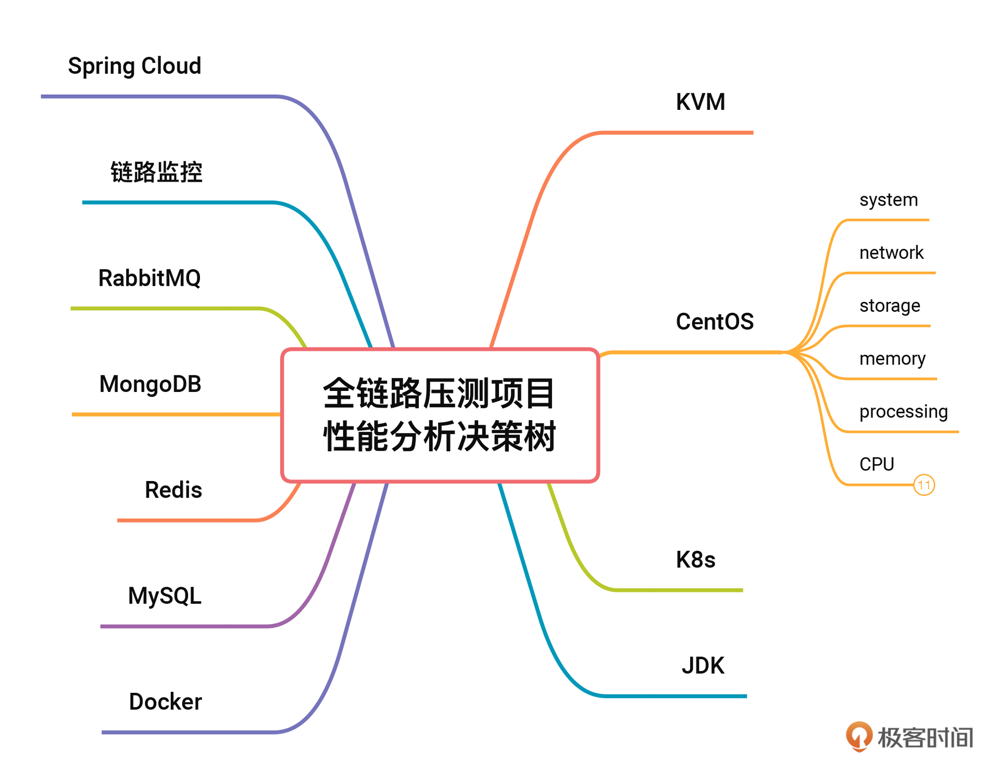
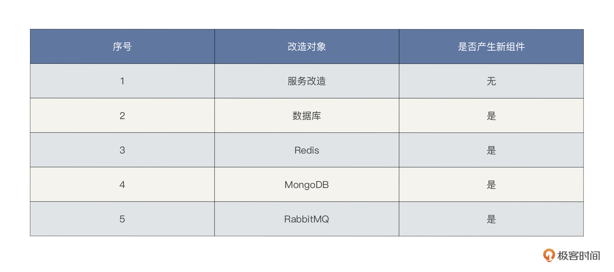
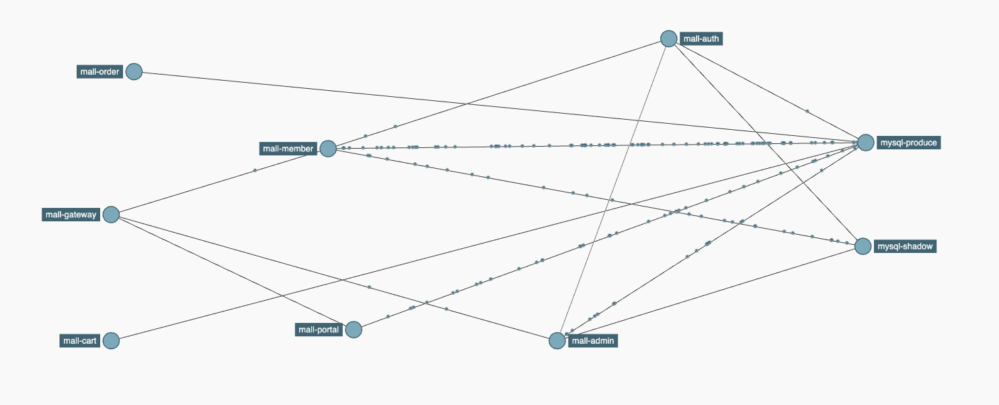

---
date: "2019-06-23"
---  
      
# 07 | 全栈监控：如何设计全栈监控策略？
你好，我是高楼。这节课，我们来看看怎样设计全链路压测的全局监控。

对于全链路压测来说，因为涉及到的服务比较多，所以分析逻辑难度加大，对监控的要求当然也更加复杂。

如果我们总是在性能瓶颈出现之后再去做分析，很可能会发现缺少各种数据。这时能做的就只有重新运行一遍场景，再增加监控工具，实现更多的数据采集，以补充分析逻辑中需要的数据。

但是这样的事情肯定是越少发生越好，所以在全链路压测场景执行之前，我们就要把监控策略考虑清楚。

怎么样来规划监控策略呢？跟着RESAR性能工程理念，我们从系统架构、性能分析决策树、全局监控几个方面来有节奏、有层次地思考一下。

## 系统架构

对于性能分析来说，我们要分析的是整个系统架构中，压测场景中涉及到的每一个技术组件，这些技术组件只有从架构的视角才能看得清楚。

从服务视角，我们可以知道需要监控的服务有哪些，保证服务的覆盖；从资源视角，可以让我们知道资源使用率应该达到多少才是合理的，同时资源视角也和容量模型有关，是重要的容量模型输入。

服务视角：

资源视角：

看到这样的系统架构，我们可不能只知道里面有几个框，还要清楚四点。

1.  服务列表和调用关系。

这一点在系统架构的文档中应该有描述。举例来说，在我们这个系统中，当我们发起一个登录请求时，对应上面的架构就是：gateway \- member \- auth \- mysql\(redis\)。了解了调用关系之后，等你要分析登录业务的性能时，就可以一层层剥离问题了。

<!-- [[[read_end]]] -->

2.  服务的规模。

服务中都有一个副本数量，看到这个副本数量之后，对应系统的最大容量，就要有概念了。一个副本能支持的最大容量是多少呢？这需要通过压测得知，而整个系统能支持多大的容量，就要根据副本做相应的扩展模型来计算了。

系统的容量根据每个业务系统的不同有很大的差别，像对一些共用服务（比如说ID服务），由于业务逻辑非常简单，所以单副本的容量就会高。而一些业务服务（比如说电商的订单服务、银行中的转帐服务），由于业务逻辑复杂，单副本的容量就会低一些。做压测的人对这些内容都要有事先的了解和大概的计算，以便判断它和最终的容量是否差距较大。

3.  硬件投入。

知道了服务的规模，当然也要知道硬件的规模。由于在K8s+Docker这样的服务编排逻辑中，我们事先并不知道每个服务会被调用到哪个硬件资源上，所以无法直接根据某个硬件资源来做相应的计算。但是在系统架构的规划中，应该明确给出每个服务应该配置多少的资源，如果你是容器化的服务，直接限制就好了。限制资源是为了让整个系统更加稳定，不要产生相互的影响。

4.  技术栈。

知道了上面的结构之后，就要分析出整个架构所使用的技术组件有哪些，一一列出。如果有足够的信息支撑，也可以知道每个组件是如何使用的。比如说分库分表、读写分离、单元化部署等等和压测有关的关键技术。

但是如何使用这些技术呢？先看看我从架构上推导出来的内容。由于上面是宏观的描述，落地到具体的细节中，我们需要知道的是宏观的信息如何在具体的业务调用过程中使用的，所以我们推导出如下内容。

* 业务调用链  
  我画了一个登录调用链你来直观感受一下。

  
像这样的调用链，画出来当然清晰，但是所有的业务调用链都画一下，这图也没法看了，所以我们可以列出来一个这样的表格。  

掌握这些调用链，后面的性能分析才不会在拆分时间时感到混乱。

* 容量所需的资源  
  我们还能大概计算一下容量所需的资源。比如，根据我的经验，登录服务在一个6C12G的容器（这里指的是登录链路上的所有服务都有这样的硬件配置）中，700TPS是稳稳的可以撑得住的，要是极端一点，上1000TPS也不是不可能，但对应的响应时间也会增加。这个时候会需要多少硬件资源呢，上面说了，登录业务涉及member和auth两个服务、一个MySQL、一个Redis。如果我们是想支撑2000TPS的登录业务，那就是近3倍的资源需求（先这样线性计算，实际项目中还是要进行横向扩展测试，同时我们还需要考虑冗余，即水位系数），那么总共需要的资源是多少呢？这里我拿CPU来计算一下，其他资源类似。

* 技术栈  
  有了上面的架构之后，我们可以列出这样的技术栈来。

1.  微服务框架：[Spring Cloud](https://spring.io/projects/spring-cloud) 、[Spring Cloud Alibaba](https://github.com/alibaba/spring-cloud-alibaba)
2.  容器+MVC 框架：[Spring Boot](https://spring.io/projects/spring-boot)
3.  认证和授权框架：[Spring Security OAuth2](https://spring.io/projects/spring-security-oauth)
4.  ORM 框架：[MyBatis](http://www.mybatis.org/mybatis-3/zh/index.html)
5.  数据层代码生成：[MyBatisGenerator](http://www.mybatis.org/generator/index.html)
6.  MyBatis 物理分页插件：[PageHelper](http://git.oschina.net/free/Mybatis_PageHelper)
7.  文档生产工具：[Knife4j](https://github.com/xiaoymin/swagger-bootstrap-ui)
8.  搜索引擎：[Elasticsearch](https://github.com/elastic/elasticsearch)
9.  消息队列：[RabbitMQ](https://www.rabbitmq.com/)
10.  分布式缓存：[Redis](https://redis.io/)
11.  NoSQL 数据库：[MongoDB](https://www.mongodb.com/)
12.  应用容器引擎：[Docker](https://www.docker.com/)
13.  数据库连接池：[Druid](https://github.com/alibaba/druid)
14.  对象存储：[OSS](https://github.com/aliyun/aliyun-oss-java-sdk)、[MinIO](https://github.com/minio/minio)
15.  JWT 登录支持：[JWT](https://github.com/jwtk/jjwt)
16.  日志收集、处理、转发：[LogStash](https://github.com/logstash/logstash-logback-encoder)
17.  日志队列和缓冲：[Kafka](http://kafka.apache.org/)
18.  日志采集：[Filebeat](https://www.elastic.co/cn/beats/filebeat)
19.  可视化分析与展示：[Kibana](https://www.elastic.co/cn/kibana/)
20.  简化对象封装工具：[Lombok](https://github.com/rzwitserloot/lombok)
21.  全局事务管理框架：[Seata](https://github.com/seata/seata)
22.  应用容器管理平台：[Kubernetes](https://kubernetes.io/)
23.  服务保护：[Sentinel](https://sentinelguard.io/zh-cn/)
24.  分布式链路追踪系统：[Zipkin](https://zipkin.io/)
25.  基础资源监控： [Prometheus](https://prometheus.io/)
26.  容器级链路监控： [Weave Scope](https://github.com/weaveworks/scope)
27.  可视化看板：[Grafana](https://grafana.com/)

其实，从架构中得到的信息还远不止上面的三种。请注意，我这里说的架构资料并不限于上面的图，还有架构设计相关的其他各种资料。从这些资料中，我们可以得出企业IT规划、架构设计思路、技术实现逻辑、运维技术的逻辑等等。

你可能会说，这些有什么用呢？这就是做性能要从工程的视角来解释的原因了。只有我们把性能工程覆盖到系统生命全周期中，压测这个动作才有真正的意义，才能贯穿一个系统从原始需求到线上运维的全流程。

现在，我们已经拿到了技术栈，接下来就要对应这个技术栈来确定我们的性能分析决策树了。

## 全链路压测性能分析决策树

性能分析决策树是什么？在第三讲里我讲过，针对项目中用到的技术栈，你通过分析对应的技术组件以及组件对应的模块，得到全量计数器，然后把这个过程通过树状结构展示出来，并画出相应的关联关系，这就是性能分析决策树了。

现在我们的技术栈已经有了，那就来看下对应的树状结构吧。

**第一，识别架构中所有的技术组件。**

在这里，我们要尽量识别出全部的技术组件。当然，如果有遗漏，在后续的工作中你还可以接着补充，只是要耽误些项目时间了。

**第二，细化技术组件的模块。**

这一步如果在专栏正文中全部展示给你的话，肯定会占用大量的篇幅，而且这个动作是重复的，没有必要一一细化，我只是想告诉你这个逻辑。

这里我拿操作系统CentOS来举个例子。因为做性能分析的时候，你没法绕过操作系统，所以拿操作系统来举例，会更有代入感。细化技术组件对应的模块时，我们必须要知道的是这个组件的架构，我们来看一下操作系统的[架构图](http://https://www.google.com/url?sa=i&url=https%3A%2F%2Fen.wikipedia.org%2Fwiki%2FFile%3ALinux_kernel_diagram.svg&psig=AOvVaw21IUoYtSDhqUYpvNOrJAw8&ust=1632147307259000&source=images&cd=vfe&ved=0CAsQjRxqFwoTCJDZhOeci_MCFQAAAAAdAAAAABBO)。

这是一个简化的Linux内核图，足够我们来判断有哪些内容了。

先看最上面一列大模块：System、Network、Storage、Memory、Processing。其实看到这一层就已经够了，我们至少可以判断出来有五个模块了。再看竖列，它表示的是每一模块在使用过程中的纵向关系，一直延伸到硬件的元器件。

有人可能会有疑惑了，为啥没有CPU呢？这是因为，只要系统用起来，就必然会使用CPU。所以CPU这个视角肯定不能遗漏。但是CPU是一个综合资源，不在我们现在的讨论模块范围里。其实你要去监控进程的时候，就一定可以看到CPU相关的计数器了。

  
还有一点要说明的是，这个模块是不是可以变动呢？当然是可以的，只要不遗漏，你怎么变动都是可以的，后面你还会看到我做的一个变化。

**第三，细化模块对应的计数器。**

有了模块，当然要有计数器来获取性能数据了。如何确定每个模块有哪些计数器呢？我们拿CPU这个模块来举例，其他模块你可以用同样的思路自己去细化。

我们知道在CentOS中，看CPU的时候，通常会用top、vmstat之类的命令。在top中可以看到9个CPU计数器，分别是：us/sy/ni/id/hi/si/wa/st/load average，vmstat中的计数器比top中少，所以我们就不用再看了。

那是不是在CentOS中只有这9个计数器呢，其实也不止，命令mpstat中就有两个计数器\%guest和\%gnice。把这些计数器都列到CPU模块上去，就得到了一个更加详细的性能分析决策树。

  
为了方便查看，我把操作系统细化出的性能分析决策树单独拿了出来。

我在这个图里做了几个调整：

1.  把Processing模块去掉了。因为我觉得在第一层的全局监控计数器中，是不需要细化到进程/线程这个粒度的；另外，在CPU上也可以反映出来Processing模块出现的性能问题，所以它不会被遗漏掉。
2.  增加了swap模块。虽然swap在性能项目中通常都是关着的，但为了不忘记它的存在，也要标记出来。
3.  画了关联线。我将需要关联分析的计数器建立起了联系，方便梳理思路。

看到这里，你就能彻底理解性能分析决策树是什么了。对表中所有的技术组件进行模块、计数器的细化，就可以得到这个项目中全部的性能计数器。这个过程怎么进行要看你的技术功底，如果一个人做不到，也可以组织团队一起来做。

那有了性能分析决策树，下一步怎么办呢？它当然不只是用来看的，我们要把这些计数器都监控起来。

## 全链路压测全局监控

全局监控就是把性能分析决策树中的所有计数器都监控起来。

还是拿操作系统来说，你可以再看一下上面的细化视图。这么多的计数器，有没有必要全都监控呢？这个要根据情况综合考虑。在上面的视图中，我把我觉得必须要监控到的计数器标成了红色，这些都是根据我的经验标注的，如果你不认可，那就标识出你认为重要的。针对这些重要的计数器，我们到监控工具中去看一下是不是都覆盖全面了。

我们可以拿现在最常用的node\_exporter+Prometheus+Grafana套件来看一下。

首先说CPU，前面我们列了11个计数器，这里面现在有的是us、sy、load average，这几个明明确确是一对一覆盖的。其他的，我在这个界面中都没看到。

这时，应该会有人想反驳我：“那不是有总使用率吗？这个值是从1-\%idle计算来的，不就覆盖了所有的CPU计数器了吗？”

这种问题我建议你不要这么大而化之。我们做性能分析，是要看到“每一个”计数器的，而不是总使用率，这个值没有办法给出依据，指导我们下一步怎么做。

如果在你的项目中，出现了这种总使用率的计数器，但除此之外就没有其他的计数器了。那可能有些问题体现不到这个总使用率的计数器上来。即便能体现出来，你的下一步动作也只能是去看每一个CPU计数器，而不可能直接知道性能分析的明确方向。

对于整个项目级的性能分析决策树，你可以自己去一一对一下监控工具，看缺少哪些性能分析决策树中的计数器，少的都要加上。当把整个项目的性能分析决策树，都覆盖到监控工具中之后，全局监控才算是完成了。

如果实在无法在短时间内加上这些计数器，那你就要在分析的时候记得用其他的工具命令来补充。

对这样量级的监控，通常会有人提出疑问：监控这么多数据，对性能没有影响吗？请记住，我们的逻辑是，要覆盖全性能分析决策树，但不是一股脑地把所有不重要的计数器都加上。这是不理智的。如果你发现监控工具对性能有很大的影响了，可以降低采样率，但这个风险是数据采集不准确，所以还是要评估好。比如在做性能分析时，把采集粒度调小一点；不分析时，把粒度调大一点。

## 全链路压测的监控逻辑

有了上面的监控思路，我们就可以对任何一个性能项目进行全方位的监控策略设计了。

那全链路压测中又有啥特别的呢？它的特别之处在于，改造的内容产生了新的组件。其实从方案中就可以看出来，我们要做的改造是哪几个模块。

我们必须把这些改造产生的新组件（影子库等）都监控起来。也就是说，原本我监控一个MySQL数据库就好了，现在分库了，就要监控两个库才可以。

举个例子，像Zipkin中，之前的链路中只有一个MySQL，现在就多出来一个shadow的MySQL。

在全局监控时，我们要把这些改造产生的组件全部覆盖。

同时，最好能够结合链路追踪系统，做到识别正常流量与压测流量。这样方便快速分析问题。

最后，为了应对线上的风险，我们还要着重及时关注异常情况，比如核心业务指标异常、基础资源 Metric 水位过高、异常错误集中等情况。

结合压测方案章节中的全局监控视图。

你可以看到的是，在技术栈的每个组件都有对应的监控工具。

当然，如果你所在的企业可以投入成本，可以考虑集成这些开源的监控工具，形成自己的监控平台，这也是现在很多企业在做的。市面上也有集成了这些开源监控工具的商业平台，总之，监控的内容都相差不大。

## 总结

这节课的内容就讲完了。

在这一讲，我给你描述了从系统架构细化到性能分析决策树，再细化到全局监控的全过程。这个过程在任何一个性能项目中都是可以复用的。

而全链路压测需要格外注意的，首先就是要全，其次要准。 不过也不要觉得做全链路压测就是改变了之前的技术逻辑，监控工具和思路完全不能用了。其实，相比通常压测项目的监控策略，全链路压测的主要的区别都是由于改造产生了新组件和压测流量所引起的。这些组件只是原有技术组件的叠加，在监控时考虑进去就行了。对于压测流量最好能做到自动识别出来。

只要有了全局监控，才可能在出现性能问题时，知道如何进行定向监控分析。在后面，我会对案例进行更详尽地分析，让你看到分析过程的逻辑。

## 思考题

最后，我想请你思考两个问题：

1.  性能分析决策树要求什么技术背景？如何才能做到不遗漏计数器？
2.  全局监控对性能瓶颈分析起到什么样的作用？

欢迎你在评论区和我分享你的思考成果，也可以把这节课分享给你的朋友一起交流、讨论，我们下节课再见！