---
date: "2019-06-23"
---  
      
# 09 | 压测模型：如何建立一套完整的全链路压测模型？
你好，我是高楼。

这一讲，我们开始学习模型部分。

在完整的性能工程中，模型到底有哪些内容呢？这个问题，估计每一个做性能项目的人都没有看到过什么定论。

这节课呢，我想跟你分享一下我总结出来的性能项目中的模型，我把它称为**性能五模型**。

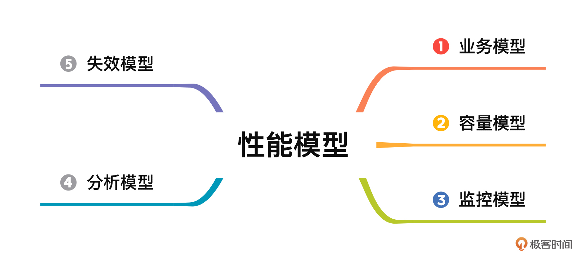

简单解释一下，它分为**业务模型、容量模型、监控模型、失效模型**和**分析模型**五个部分。

1.  业务模型确定了压力工具中的设置；
2.  容量模型确定了系统的设计容量计算方式；
3.  监控模型确定了监控的内容；
4.  分析模型确定了分析的逻辑；
5.  失效模型确定了异常场景。

那么，在全链路压测项目中，这些模型产生了什么变化呢？

从分类和内容上来说，没有任何变化。主要的变化是，所有的模型都乘以了2。


因为全链路压测强调的是**线上执行**，所以不管你用什么样的方式来组织线上的架构，除了正在运行的真实模型之外，你还要从全链路压测的视角把这些模型再考虑一遍。

在具体描述每个模型之前，我先把整体的架构图展示一下，以便让你看到我们是在哪些地方做了改造的动作。


在这个架构图中，我们对微服务、缓存、队列、数据库做了改造，用灰色标示的是做了改造的部分。其中，微服务、缓存、队列部分没有用新的硬件设备，是在同样的硬件中实现的；数据库创建了影子库，所以增加了同配置的硬件。

<!-- [[[read_end]]] -->

现在我们来说一下每一个模型的具体内容。

## 业务模型

业务模型就是将真实场景的业务比例复制或推算出来的过程。关于复制，我们要考虑不同的手段。

**手段一：线上流量复制的方式复制出业务模型。**

简而言之就是流量复制，这也是现在全链路压测中经常讨论的一个话题。流量复制使用的工具，我在[第6讲](https://time.geekbang.org/column/article/432143)中已经有过详细的论述，如果你记不清了，也可以回过头去温习一下。这里就不复述了。

这里我们要讨论的是：复制出来的流量，是不是回放或放大回放就可以满足我们的目标了呢？

当然没有那么简单，因为我们先要确定**目标**是什么。如果我们的目标就是要测试录制出来的那一段流量产生的业务比例，这样做确实是可以的。

但如果我们的目标是通过放大录制的流量来评估未来的场景，那基本上就靠不住了。因为复制出来的业务模型，是不能代表未来业务模型的变化的。

**手段二：通过统计线上流量的方式复制出业务模型。**

我把详细的流程给你梳理了一下：  
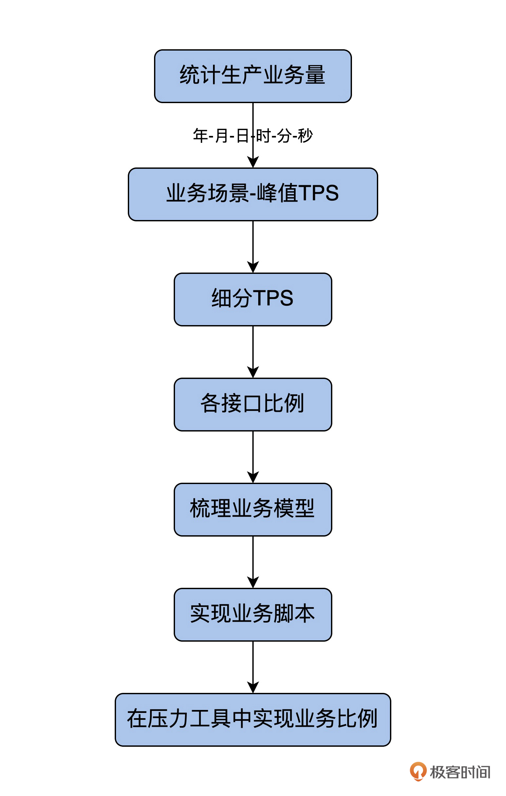

只要业务比例和生产环境一致，通过这种方式复制出的业务模型，就和录制回放手段产生的压力结果没有区别。

不过，如果要想推算未来的模型，也存在同样的弊端。

谈到这里，我们就不得不说说推算业务模型这件事了。假设我们拿到了这样的生产业务模型。  
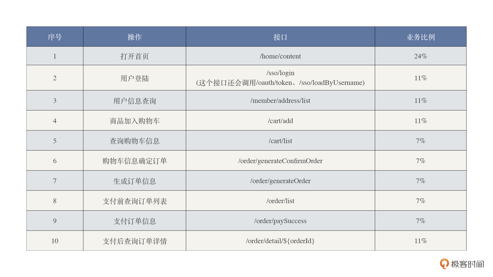  
但是由于未来业务的变化，业务部门评估认为，未来购买的比例会增加。那从接口上来说，就是图表中4-9之间的业务比例会增加，于是我们得到了下面这个模型。

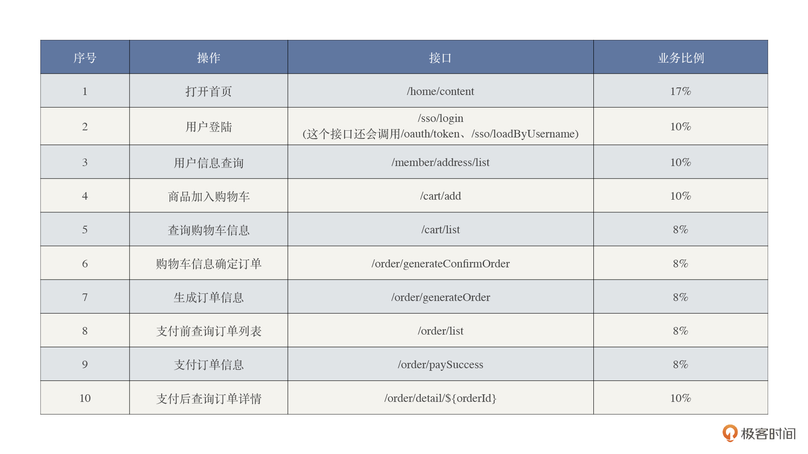  
如果我们想实现这样的业务模型，那用复制出来的流量回放显然是不可以的。要实现这样的业务模型大概只有一个选择，那就是用压力工具来实现压力。

所以，**对于业务模型来说，关键是要看测试目标。**

## 容量模型

在执行测试场景之前，要先计算一下系统大概能支持多少容量（本节课后面的容量都用TPS这个概念来承载）。容量模型的计算离不开架构图，这张图我在前面已经给你展示过了，我再放在这里加深一下你的印象，希望你能把它牢牢地记下来。


有了架构图，我们再来输入一些数据。

1.  微服务应用在总资源40C80G的硬件资源，可以支撑混合场景1500TPS，且硬件资源已饱和。
2.  在上述条件下，2台数据库\(8C16G\)使用率最大的硬件资源CPU，只用到了50\%左右；2台缓存（4C8G）和2台队列服务器（4C8G）最大的资源使用率（CPU使用率）只有20\%左右；2台网关（4C8G）最大资源使用率是40\%。

请注意，上面的信息并不需要臆测，只要通过正常的性能容量场景就可以得到这样的数据。那么，如果现在我们希望系统支持3000TPS，需要多少资源呢？

如果用线性计算，我们可以得到图片中这些变化。


也就是说，应用类的资源要增加一倍，而数据库、缓存、队列服务器的资源可以不用增加。

可是，真的就这么简单吗？你是不是也觉得这样的计算非常不靠谱？

试想一下，当压力增加的时候，数据库资源用完，响应会变慢，那显然TPS就会下降，所以不可能达到3000TPS。而缓存和队列服务器就还好，因为还有比较大的空间。

如果这么做不合理，那我们是不是再增加一些数据库服务器资源就好了呢？其实即便是这样，我们也无法让系统容量成倍地增加，因为还有另一个问题：微服务应用资源已经用完了。

如果我们增加了成倍的资源，在不考虑其他服务器的情况下，这成倍资源的增加会带来TPS的成倍增加吗？这是不能确定的。因为资源的增加，会带来服务节点的增加，紧接着会带来远程调用时网络带宽的增加。请注意，这个增加不止是网络资源，还包括网关和负载均衡压力的增加。

**所以我不建议这样线性地计算**，怎么来计算呢？最好的方式就是拿真实的数据说话，采用递增加压的方式，先看一下TPS增加的幅度和资源消耗之间的关系。相应地创建下面这样的表格：

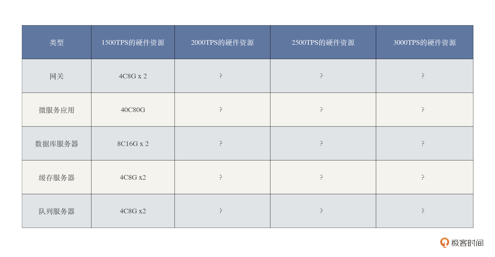

我们先增加到2000TPS，再增加到2500TPS，再增加到3000TPS，然后看看硬件资源的增长率。这里我只把硬件的增加列出来，就不再详细记录使用率的百分比了。

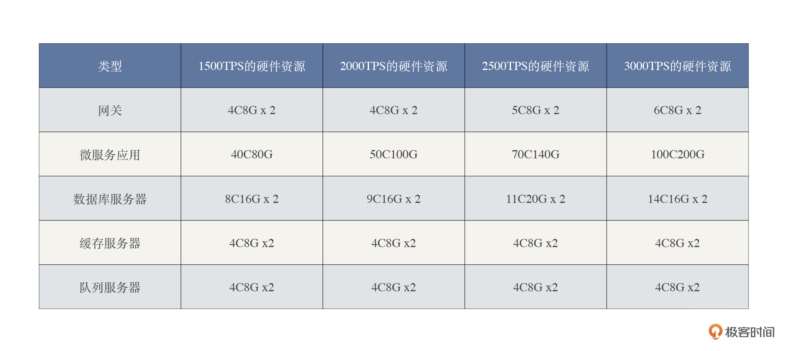

通过数据来看，网关的资源增加主要是CPU，微服务应用和数据库也都有增加，但并不是完全线性的，TPS越往上增加，微服务应用和数据库的增幅也越大，成本越高。缓存和队列由于没有达到使用的上限，所以不需要增加。

在这样的示例中，我们得到最重要的启发就是：**容量的规划不能通过简单的线性计算得到合理的结果，而是要通过容量场景的执行得到一个合理的增长模型。**

## 监控模型

监控模型在全链路压测过程中是非常重要的模型。根据RESAR性能工程理念，全局监控的关键是“全”。怎么才能全呢。那就要在监控之前做几个动作：

1.  分析技术栈。我这里主要列出了涉及到改造的技术栈。

  
2\. 创建性能分析决策树。

接下来，我们要为上面提到的网关、微服务应用、缓存、队列和数据库一一创建性能分析决策树。

由于网关和微服务应用都是基于Java编写的，所以这里我们直接创建一个Java应用的性能分析决策树：

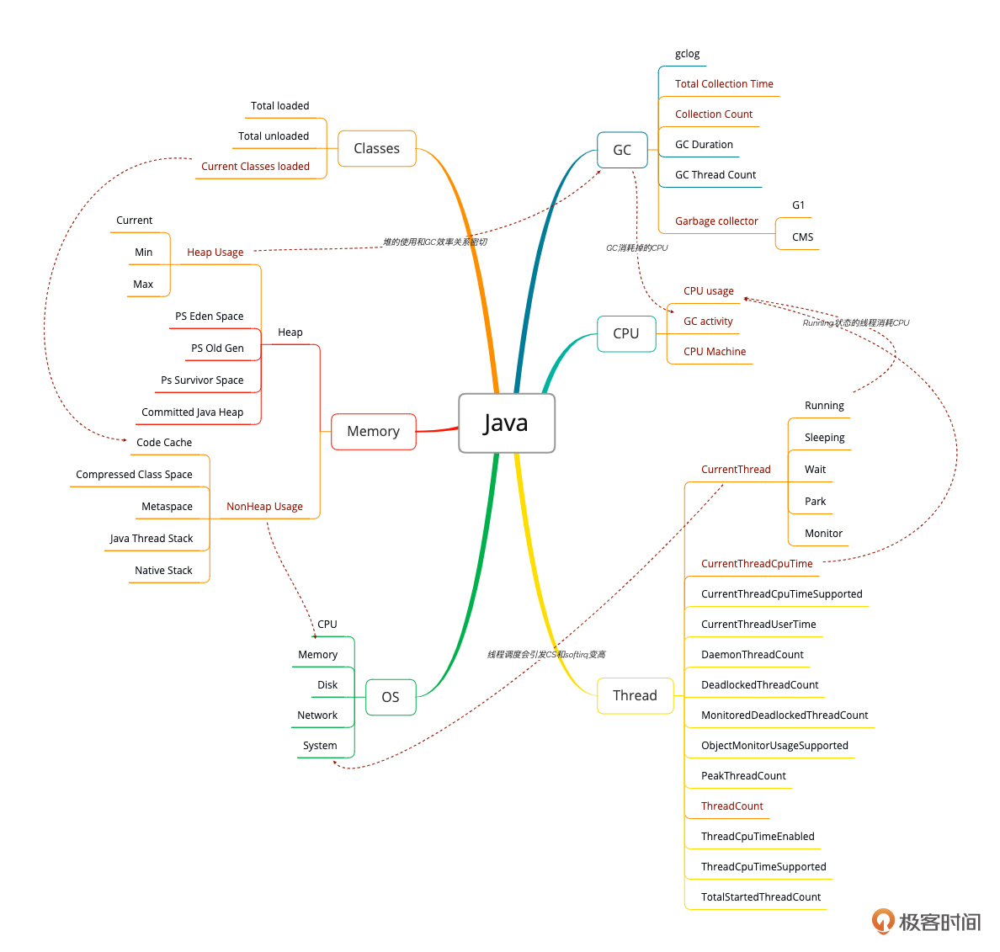

数据库性能分析决策树：

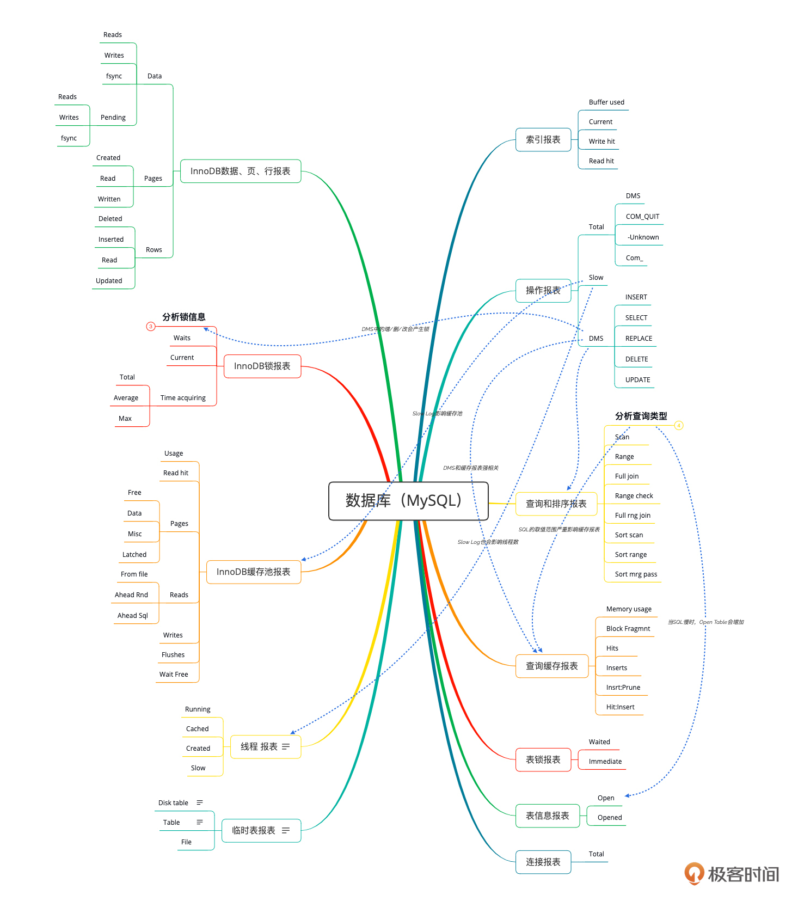  
缓存性能分析决策树：

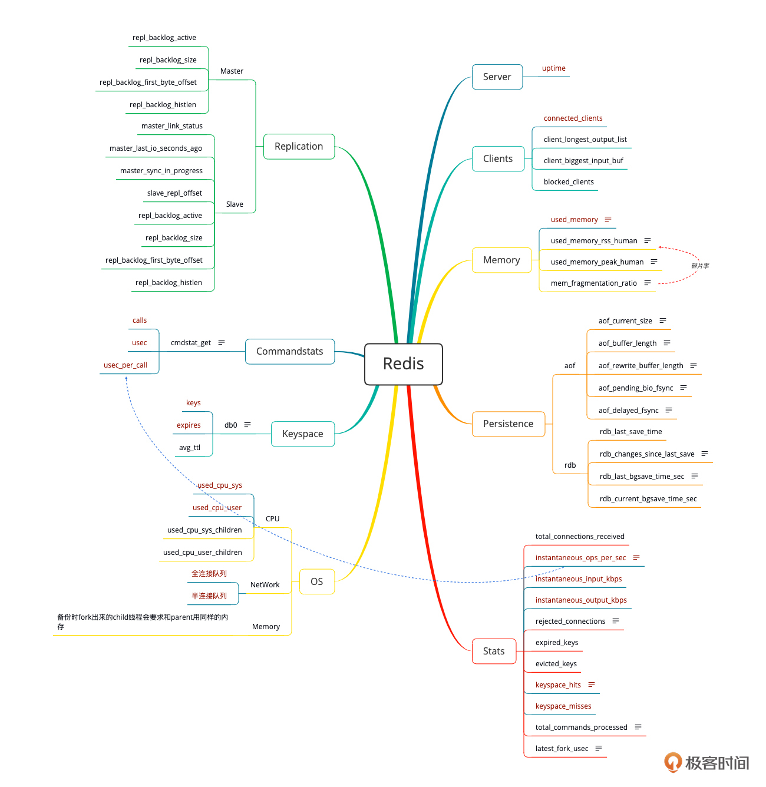

队列性能分析决策树：

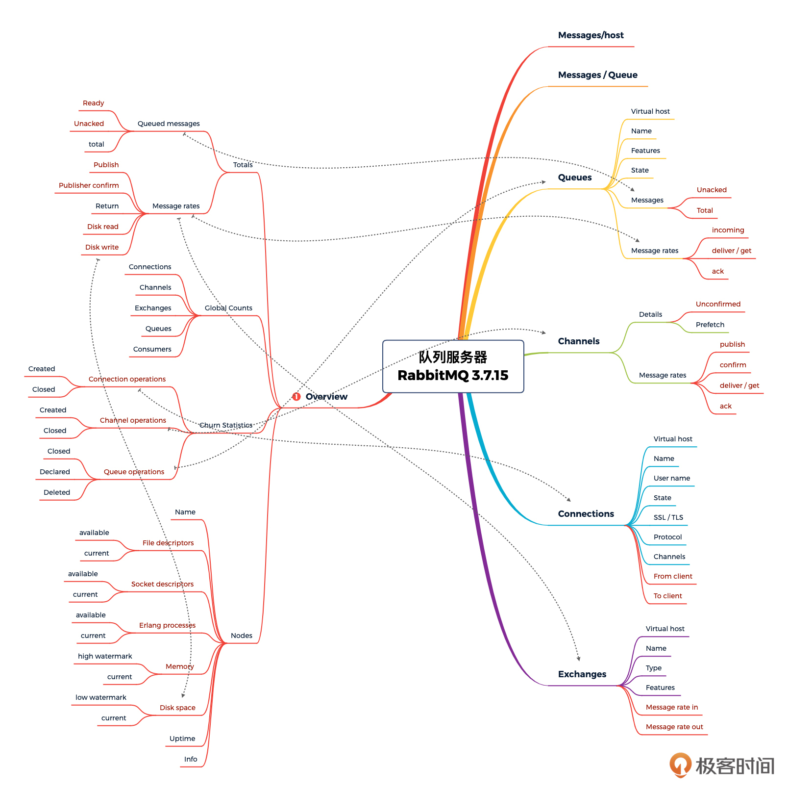

这样，我们几个关键技术组件的性能分析决策树就完成了。其他的技术栈，你可以自己创建一下，组织的形式和分类的方式并不是固定的，只要你能理解就可以。关键在于监控数据的完整性。

3.  有了整个项目的性能分析决策树之后，就要把这些需要监控的计数器，都体现到监控工具中了。对应每一个技术组件，我们用下图表示一下覆盖关系。

  
看完这张图你会发现，我们在设计监控模型的时候，是每一个技术组件都会覆盖到的。  
这个逻辑在所有的性能项目中都是一样的。

而在全链路压测的项目中，由于做了改造，必然会涉及到一些监控计数器的增加。具体有哪些呢？我们还是拿关键组件来说明。

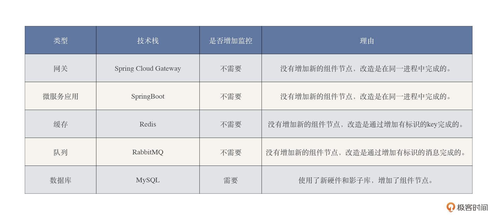

从表格上可以看出，在我们这个全链路压测项目中，相比较之前的监控内容，只是增加了新的数据库节点而已。

在这里，如果你说：“我以前监控得都不全，加这些怕是不够吧”。那就是你之前的工作有疏漏了，请后退出去把门带上，面壁反省。

## 分析模型

分析模型是建立在监控模型基础之上的，所以我们必须把性能分析决策树再拿出来，接着往下拆解。

我们来举例说明一下：

* 对数据库的查询和排序报表类计数器的分析

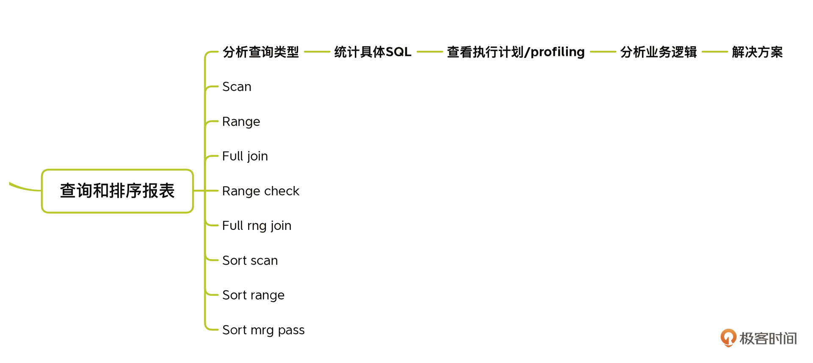  
我们要做的是：分析查询类型 \- 统计具体的SQL语句 \- 查看执行计划和Profiling信息 \- 分析业务逻辑 \- 提出解决方案。

* 对InnoDB锁报表计数器的分析


我们要分析的逻辑是：分析锁信息 \- 统计具体的SQL语句 \- 查看执行计划和Profiling信息 \- 分析业务逻辑 \- 提出解决方案。

* 对InnoDB缓存池报表计数器的分析

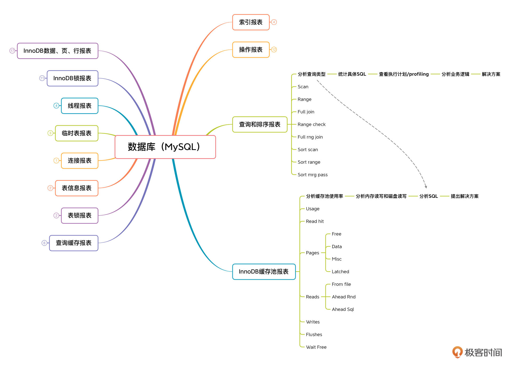  
之所以这个图截得大一点，是分析SQL和查询排序报表之间有了关联关系。

我们要分析的逻辑是：分析缓存使用率 \- 分析内存读写和磁盘读写 \- 分析SQL（分析SQL的类型） \- 提出解决方案。

再拿java的性能分析决策树来举个例子。

* 对Java线程类计数器的分析：

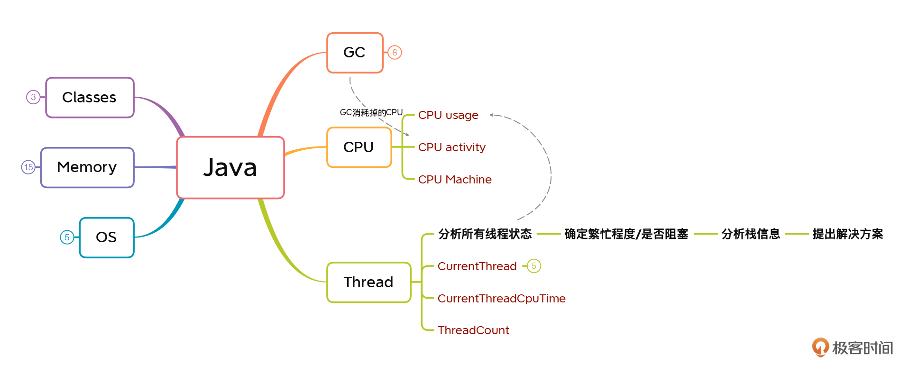

对Java的线程池，分析过程是：分析所有线程状态 \- 确定繁忙程序/是否阻塞 \- 分析栈信息 \- 提出解决方案。

但是因为分析线程状态要结合CPU使用率来分析，所以在图片中你可以看到，他们之间也有一条线。

把所有的分析路径都分析出来，我们的分析模型就创建完成了。其实在这一步，最需要的就是技术功底和耐心。

可能有人会说，这么庞大的分析模型是一个人能完成的吗？根据我的经验，如果你认真学习，多则十年八年，少则五六年，确实是可以一个人完成的。

不过，其实你也不用这么纠结是不是一个人，毕竟性能项目从来都不是一个人的事情，而是一个团队、一个企业的事情。

由于每一类、每一个计数器都需要创建一个分析逻辑，而且往往还需要多个计数器关联分析，所以很难在文章里让你看到我们这一步做得有多壮观。如果我把所有的分析路径都创建出来放在文章里，那图片会糊得像马赛克一样。

不过，我还是建议你自己去创建针对项目的完整的性能分析决策树和分析模型。因为只有亲手做一遍，才能慢慢理解它的博大精深，也能知道自己会卡在什么地方。

## 异常（失效）模型

最后，我们再看下异常模型。异常模型又叫失效模型，其实在性能领域中，我真是不想提它，但又不得不提。

在很多企业中，异常、故障、失效这样的场景，都被列为非功能测试范畴，而非功能的案例在性能领域中其实只会蜻蜓点水似的做上几个，不完整不说，效果也很一般。如果想做得完整呢，那就不是一个性能项目的成本能cover得住的了。

为什么成本这么高？我们先来看一下异常场景有哪些类型。

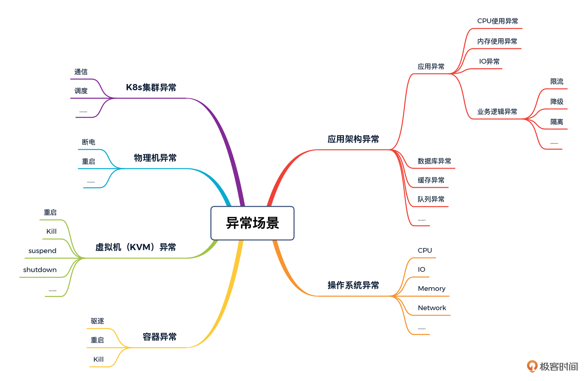

在这个图中，我根据技术栈从下到上的层级罗列了一下，大概有20多个测试点。请注意，这里的测试点只是针对一个节点来说的，如果你有成百上千的节点，那就是乘法关系。想一想吧，要做完整的异常场景，靠手工是很难做得下去的。

这个时候，你是不是自然而然地想到了“混沌工程”这个概念？

确实，你可以借鉴混沌工程的理念和工具来完成其中一部分内容。但是当前市场上几个用得比较多的开源混沌工具，基本上是停留在微服务分布式应用、容器编排、操作系统这几个角度，而且部分模拟的手段和真实生产环境中出现的故障并不一致。

举例来说，在阿里开源的 [ChaosBlade-Operator](https://github.com/chaosblade-io/chaosblade-operator) 中，模拟CPU使用率高的方式是启动了一个进程来消耗掉CPU，其实跟你写一个do while或者sleep是同样的功能。

```
    top - 11:13:32 up  1:29,  1 user,  load average: 1.28, 0.58, 0.36
    Tasks: 130 total,   2 running, 128 sleeping,   0 stopped,   0 zombie
    %Cpu0  : 78.4 us,  2.3 sy,  0.0 ni, 18.9 id,  0.0 wa,  0.0 hi,  0.3 si,  0.0 st
    %Cpu1  : 77.9 us,  3.3 sy,  0.0 ni, 18.7 id,  0.0 wa,  0.0 hi,  0.0 si,  0.0 st
    KiB Mem :  8008972 total,  2815456 free,  1042748 used,  4150768 buff/cache
    KiB Swap:        0 total,        0 free,        0 used.  6657892 avail Mem
    
      PID USER      PR  NI    VIRT    RES    SHR S  %CPU %MEM     TIME+ COMMAND
    26633 root      20   0  108552  12488      4 R 147.8  0.2   0:40.34 chaos_burncpu
     2450 root      20   0  830076  93308  29864 S   1.7  1.2   1:48.33 dockerd
     1459 root      10 -10  193480  25652  14620 S   1.0  0.3   0:57.01 AliYunDun
     3500 root      20   0 1594788  81096  35772 S   1.0  1.0   1:06.78 kubelet
     1949 root      20   0 1172680  52168  14772 S   0.7  0.7   0:06.45 containerd
     4881 root      20   0 1041280  40388  17168 S   0.7  0.5   0:31.43 calico-node
        9 root      20   0       0      0      0 S   0.3  0.0   0:02.45 rcu_sched
     3770 root      20   0  107688   6492   2784 S   0.3  0.1   0:00.09 containerd-shim
     4811 root      20   0  109096  10564   3100 S   0.3  0.1   0:02.88 containerd-shim
    

```

你看，上面的chaos\_burncpu进程就是来干这个坏事的。

有过线上运维经验的人可以回忆一下，在线上遇到过的CPU使用率高的性能问题，是不是很少是因为新产生了一个进程而抢掉了CPU导致的？通常情况下，CPU消耗高，都是一个正在使用的应用进程内部产生的性能缺陷导致的，这才是常见的性能缺陷。所以这种模拟手段，并不能覆盖我们在线上看到的问题，只能起个心理安慰的作用。

那应该怎样设计异常模型呢？我的建议是，把你的生产环境中出现的问题罗列出来，分析原因，把相应的缺陷实现到异常模型中去。比如说，由于某个方法写得不好而导致了CPU的长期消耗，那你可以写一段方法性能差的代码打包到应用中去，通过开关触发；或者直接attach到正在运行的Java进程中，将消耗CPU的代码直接注入到进程中去并运行起来。这样的异常模型才是符合真实缺陷的设计。

如果针对异常场景的每一个分类，我们都做出符合真实场景中的缺陷的设计，就可以得到完整的异常模型啦了。

## 总结

你也看到了，这节课，我并没有给你一套拿去就能用的压测模型。当然，这也是做不到的，因为模型只有在一个具体的项目中去细化和创建才有价值。

相比拿来即用的压测模型，我更想传递给你的是思考的逻辑。我希望在这样的逻辑指导下，你可以去创建属于自己的模型，如果有困难，可以来找我沟通。

好了，我们最后总结一下知识点。这节课，我们重点分析了业务模型、容量模型、监控模型、分析模型和异常模型：

* 业务模型的重点是，根据全链路压测的目标来确定如何实现业务的比例关系。你是要复现历史的容量峰值场景，还是推算未来的容量峰值场景？这个问题很关键，而具体使用什么样的压测工具反而不是重点。
* 容量模型的重点是，计算的逻辑要合理。你可以单点估算，也可以用混合容量估算。但前提是，一定是符合具体项目的估算逻辑的。我看到有些企业用“TPC-C”或“日交易量x峰值系数/交易时长”来估算TPS。在我看来，还是太单薄了。
* 监控模型的重点是“全”。现在很多企业用云服务器，厂商会提供一些监控视图。在我的经验中，厂商提供的监控视图就没有完整的，通常都是分析时发现缺这少那的。所以别觉得有了监控视图，你就有了完整的监控模型，那是不现实的。还是创建自己的性能分析决策树，再来比对一下缺少什么更为合理。
* 分析模型的重点是分析逻辑，而分析逻辑靠的是技术功底。所以要想创建分析模式，当能力不足时，可以借助团队的力量。
* 异常模型的重点是“真实”，不真实的异常，做得再多也没有意义。

在性能领域中，我把以上的内容称为性能五模型，在全链路压测模型的创建中，也是这五个模型，不会有偏差。

## 课后题

在结束今天的学习之前，我还想请你思考两个问题：

1.  尝试在自己的项目中创建监控模型和分析模型，告诉我你创建时的难点在哪里？
2.  异常模型可不可以独立到压测项目之外进行？

欢迎你在留言区与我交流讨论，我们下节课见！