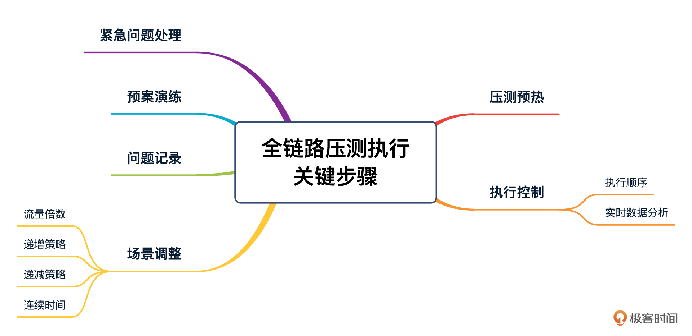
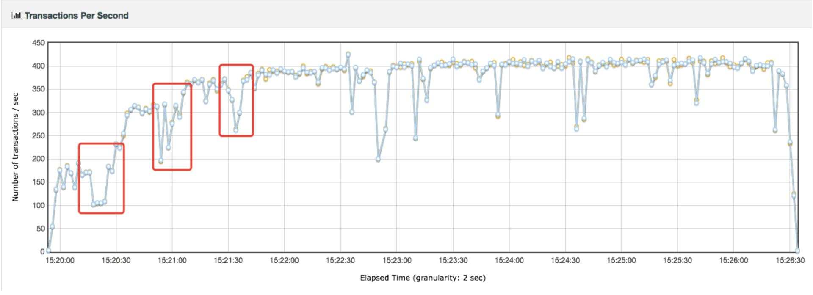
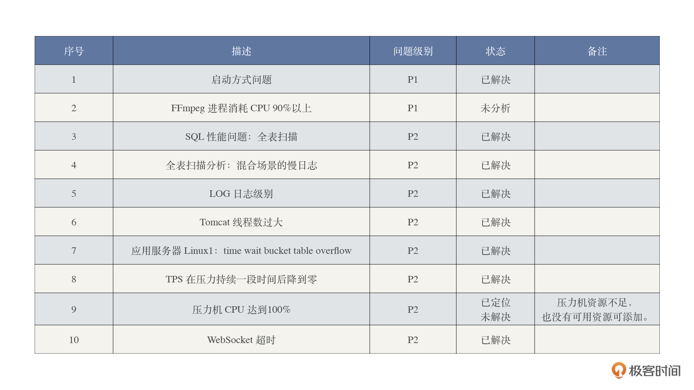

---
date: "2019-06-23"
---  
      
# 10 | 场景执行：压测执行过程中的关键步骤是什么？
你好，我是高楼。

上节课，我们重点讨论了压测模型。今天我们一起来看一下，在全链路压测执行过程中有哪些关键步骤。

这两节课的内容是密切相关的。因为通常情况下，有了全链路压测模型之后，我们就需要把这些性能需求指标一一对应到容量场景业务中去了。

关于场景设计和执行，首先有两个重点需要你格外关注：

* 场景分为四类：**基准、容量、稳定性、异常**；
* 执行过程中要保持**连续、递增**。

接下来，我会从全链路压测角度把场景执行做更为详细的补充。

有的同学可能会想，全链路压测的场景执行是有多重要，至于拿一节课来讲吗？其实，你可以把场景执行理解为是全链路压测方案的落地，它是全链路压测活动实施的核心，更是性能分析的起点。我大概能写出 10 个这样的句子来说明场景的**地位**。

下面这张图列出了全链路压测场景执行过程中，一些关键步骤所包含的内容。

在全链路压测中，只要场景跑起来，图中这些内容就都是我们要观察的部分。

下面我就拆开来讲一讲，希望你能明白它们的重要性。

## 压测预热

我们首先要关注的就是压测预热。

高并发系统有几种常用的手段：缓存、队列、限流、降级、熔断等。

但其实这里还有一个经常被人忽视的动作：**预热**。

你有没有看到过这样的情况，压测开始时响应时间长，但随着压力的持续，响应时间会缩短。

<!-- [[[read_end]]] -->

出现这样的问题显然都是因为没做好压测预热。系统如果没有预热，在压力开始时，由于缓存、工作线程池、连接池等资源没有分配，响应时间就会比较长。例如，缓存中没有数据，需要从磁盘中直接读取数据时，就会有磁盘 IO 寻址的过程，这显然会增加响应时间。

所以，我们一定要知道，开始压测的前置动作是预热而不是冷启动。当我们开始压测时系统容量处于低水位的情况下，突然遇到大量压测流量，会直接把系统容量拉升到高水位，这时由于后端反应较慢，会导致前端超时，从而出错。请注意，**这种状态下，并不是系统宕掉了，而是反应慢导致的超时**。

这里要啰嗦几句，很多人描述系统时就老说系统“打挂”、“死掉”了之类的话，这种感性的描述完全没办法给出明确的技术上的原因，会让沟通的效率非常低。

关于压测要不要预热，你其实还可以从另一个角度去判断，你只要确保它和生产环境中的逻辑一致就可以了。生产环境在提供用户服务之前如果要预热，那压测也要预热，预热时最好可以覆盖所有的数据；生产环境如果不预热，那么压测也不用预热。

既然压测预热这么重要，我们应该怎么入手呢？

最简单直接的思路就是把容量场景中涉及到的业务都提前预压测一遍，通过容量场景的逻辑，实现预热的过程，让系统对资源进行提前准备。需要做到遍历容量场景中所有的业务接口，让一些资源加载进来。

## 执行控制

解决了预热的问题，接下来，我们就要来看下执行的部分了。

根据 RESAR 性能工程理论，如果你想让性能场景循序渐进、没有遗漏地覆盖所有生产场景，就要尽可能地按照**“基准-容量-稳定性-异常”**的逻辑执行。请注意，除了这四类性能场景之外，就再也没有其他类型的场景了。只不过每一个类别的场景，我们都可以设计多个具体的场景来对应不同的压测目标。

在这四个类别的场景中，基准场景是容量场景的前奏，容量场景是线上业务的真正模拟。

在基准场景执行过程中，第一阶段的目标就是把资源用光，第二阶段的目标是将系统优化到满足业务容量。

但你要知道，无论哪个系统，要调优都是没有止境的，而我们的目标是要保证线上系统的正常运行。因为我们这个课程的示例项目只有一个系统，所以，我们先做接口级的，然后把接口拼装成完整的业务量，并实现复制流量模型，然后在容量场景中执行。在基准场景执行阶段，我们将执行测试范围中业务接口级的基准场景。

在容量场景中，我们还是要继续秉承**“连续、递增”**的执行逻辑。最重要的是，要实现我们前面提到的流量模型，来回放真实线上的业务场景。

接着我们来看稳定性场景，这里只有两个关注重点：

1.  稳定性场景的时长；

2.  用多大的 TPS 来执行。

在执行稳定性场景时，完全可以用最大的稳定 TPS 来运行，只要覆盖了容量规划周期之内的业务容量即可。

对于异常场景呢，有些企业是把它放到非功能场景分类中的。我之所以把异常场景放在性能部分，是因为我认为，这些异常场景需要在有压力的情况下执行。当然，你也可以用一些所谓的“混沌工程”的工具来实现对容器的随机删除、网络丢包、模拟 CPU 高等操作。不过，这个话题就太大了。在后面的课程里，我会设计几个常用的异常性能场景来带你看一下效果。

另外，在场景执行的过程中，还有几个点需要你关注一下：

* 要查看实时的性能数据曲线，并判断是停下来还是继续，要分析哪些内容。这可以让我们清楚下一步要干什么事情。
* 在一开始的压测执行中，不要过度上监控工具。最好是先上全局监控工具，等有了问题之后，我们再重复执行场景，上定向监控工具。

说明一下，全局监控主要关注的是压测应用系统的性能分析决策树的第一层计数器。比如：基础性能监控（CPU 性能、磁盘性能、网络性能）等。定向监控主要关注的是有问题的计数器。它是在分析根本原因的过程中所使用的监控手段和思路。比如，当CPU使用率较高时，我们可以通过定向监控来寻找根本的原因。

* 需要关注业务指标。这些关键的业务指标都有具体的业务含义，比如单位时间内的下单成功率等。在整个全链路压测过程中，性能测试人员在压测启动后就需要紧盯监控看板，任何性能指标异常，都需要第一时间进行性能分析。

## 场景调整

场景执行起来之后，我们还需要进行场景调整。在这一步，我们需要明确很多内容，比如流量放大的倍数到底应该从多少开始？最大是多少？要解决这些问题，最好的方式就是**保持连续递增加压**。

这里我以 JMeter 为例。

图中画红框的地方其实就是压力递增呈现出来的性能问题。在递增过程中，被测系统的资源要动态分配。系统会不会在这个时候抖动，我们完全可以从这样的图中看出来，而这样的场景也才算是真实的线上场景。

如果不连续递增，就不会有图中红框这样的部分，也就不能复制出线上的真实场景了。

此外，我们还需要考虑：场景需不需要递减策略？场景执行持续时间是多长？等等。

## 预案演练

在正常全链路压测之前，我们一定要线下环境做好压测预演，预演主要确认下面几个方面：

* 压测流量是否写入到了正确的目的地。例如，压测流量写入到影子库，压测日志写到影子目录，生成压测 Cache 等等。
* 做好压测异常的降级预案，确认降级策略是否完整且有效。
* 进一步确保所有的监控都已到位，确保压测的时候能够准确、及时地发现问题。
  * 核心链路的流量和耗时监控是否准确；
  * 中间件、缓存、数据库的监控报警是否及时；
  * 基础资源的指标报警是否有效；
  * 业务异常监测指标是否正常且及时。
* 有了以上的几步之后，还要模拟常见的性能瓶颈，确认可以快速恢复环境。常见的性能瓶颈有：CPU 使用率高、内存溢出、IO 等待、网络出现队列等。

## 问题记录

在压测中遇到性能问题的时候，随时记录问题数据和相关现象是一个很必要的步骤。

在全链路压测过程中，通过标记透传、流量隔离等一系列功能，我们可以快速发现并定位一批性能问题。我一直提倡在性能工程中做分析调优，所以这里我们也要对应地产出性能调优报告。

在发现并解决问题后，先随手就记录到问题清单里面，后续有时间再补充完善下调优报告。

关于问题清单，你可以参考下面这个示例：

我们通常将问题等级设置为 P0\~P3 这么 4 个级别，P0 级别最高，P3 级别最低。对于我们这个电商项目来说，主要以下单失败、支付失败、资损等这些跟钱相关的指标为主要衡量标准。如果是其他项目，就需要根据业务类型，制定符合实际业务特点的等级标准了。

整理问题清单还有一个好处，那就是，如果出现的一些性能问题需要其他人员配合解决，我们可以第一时间把这些问题现象记录下来，然后配合迭代计划、绩效和工单系统，将问题指派到相关负责人，提高项目的性能优化效率。

在每次压测后，我们还要进行复盘，总结压测中的遇到的问题。将压测结果、监控指标等结果数据形成报告发给相关人员，制定好后续的工作以及跟进的负责人。

如果这些流程都能够落到实处，后续我们也就更容易开展常态化的全链路压测活动，推动建立公司项目的性能运营体系，将一些模糊的、松散的性能优化工作转变为日常工作了。

## 紧急问题处理

在压测过程中，最怕的就是线上出现紧急故障。线上故障带来的影响不仅仅是技术方面的，还有业务方面的，比如出现了大量的用户投诉、资损等情况。如果问题上了微博热搜，情况就更糟糕了。这时候性能团队承受着非常大的压力，如果没做好故障应对机制，整个团队很容易陷入混乱。

这也暴露出一个难点，那就是，全链路压测除了需要花时间梳理核心链路、做流量隔离等工作外，还要协同整个链路涉及到的多个团队，比如业务团队、架构团队、开发团队、运维团队，不同系统的团队等。

我们要保证每个业务线统一作战，让大家能够在给定的时间点进行联调和压测值守。在压测推进的时候，按照核心链路所在的模块进行跟进，每个模块出一个值班人员，各个值班人员快速跟进出现的紧急问题。

在处理紧急故障的时候也有几个重要的原则：

* 优先恢复业务，暂不分析解决问题；
* 快速地组织协调：
  * 快速确认故障级别及业务影响面；
  * 组织应急团队，冷静且有序地处理问题；
  * 保持信息公开，及时向社会通报。

等到问题解决之后，我们再对故障进行复盘，原则是对事不对人。其实这时候公司大领导的角色很重要，因为出现线上故障后，扯皮的例子简直不要太多。

## 总结

好了，到这里，我们整个全链路压测的关键步骤就介绍完了。这节课的要点有下面三个：

首先，整个性能团队要对全链路压测实施有一个正确和理性的认识，科学地与实际业务结合，制定出对应合理的场景执行方式；

其次，结合运维体系，我们要在压测前要做好各类预案演练，当线上压测故障真实发生时，能够做到冷静正确地处理问题，以及高效地组织协调应对；

最后，在压测复盘中，我们需要总结出不足之处，为下一步的改进打下基础。这样，整个全链路压测活动质量才能不断提升，技术方案也将不断完善。

当然了，只记住这些“道理”是远远不够的，我更希望你吃透我这节课所讲的内容，把它们都灵活地应用起来。

## 思考题

在课程的最后，我还是照例给你留两道思考题：

1.  在你的工作经验中，有哪些性能问题扯皮的案例？是否能够在后续的工作中合理地规避？
2.  总结本节课中全链路压测场景中的关键内容，对比一下你的项目实践，是否有缺失？

欢迎你在留言区和我交流讨论，我们下节课见！