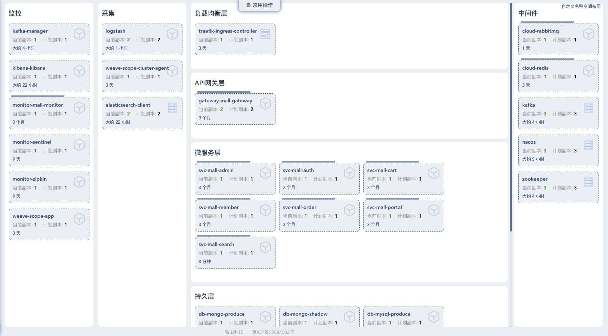
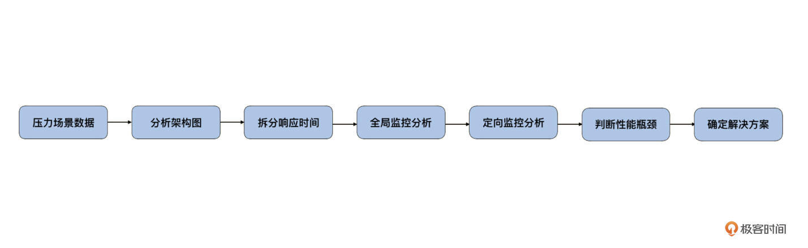
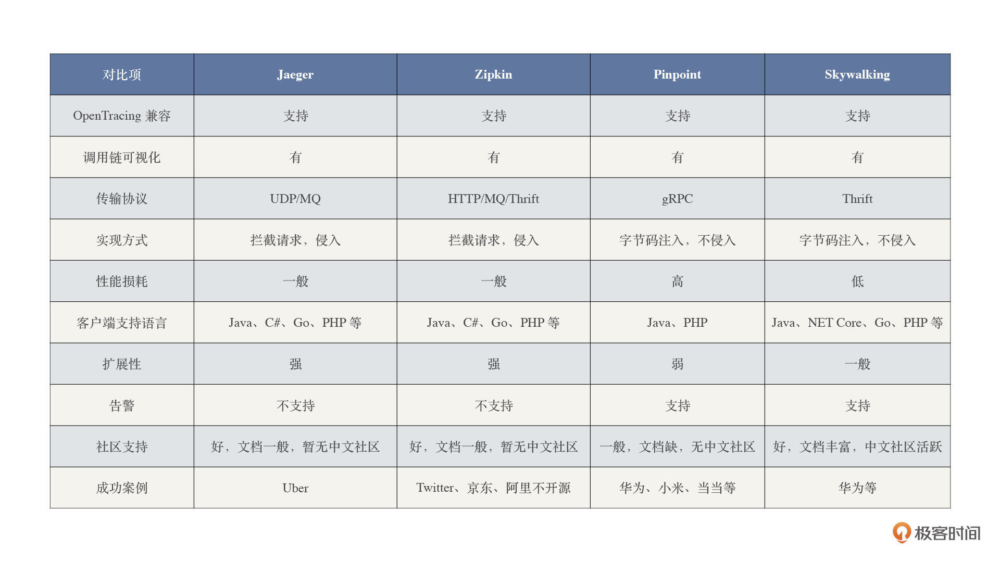
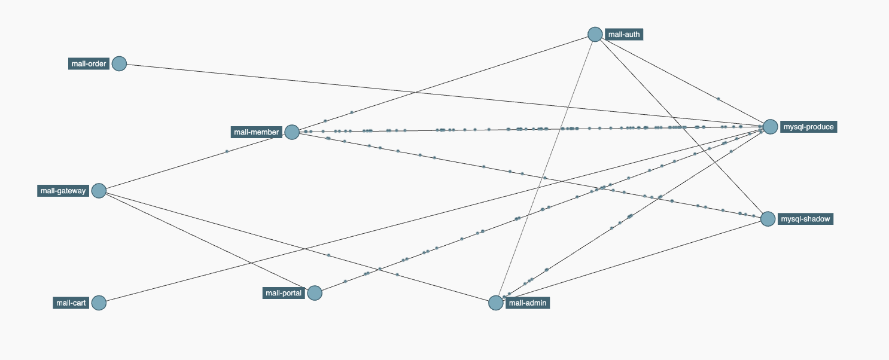

---
date: "2019-06-23"
---  
      
# 11 | 链路追踪：如何选择一款适合自己项目的工具？
你好，我是高楼。

从这里开始，我们进入链路追踪改造部分，这节课，我们来看一下怎么在全链路压测项目中选择合适的链路追踪方案。

## 为什么需要链路追踪？

首先，我们看下这个课程的开源电商项目的部署架构。

从部署架构图中你可以很直观地看到，在微服务架构下，系统的功能是由大量的微服务协调组成的。例如：电商下单业务就需要会员系统服务（mall-member）、认证中心服务（mall-auth）、订单系统服务（mall-order）、购物车系统服务（mall-cart）逐级调用才能完成。而实际在电商企业，每个服务可能是由不同的团队进行开发，部署在成百上千台服务器上的。

这么复杂的调用链路就带来一系列问题：

1.  如何快速发现性能问题？
2.  如何精准判断故障影响范围？
3.  如何梳理服务依赖以及依赖的合理性？
4.  如何分析链路性能问题以及容量规划？

当系统发生故障的时候，我们需要一种机制对故障点进行快速定位，确认到底是哪个服务、哪个接口出了问题，那么分布式链路追踪技术由此产生。

**所谓的分布式链路追踪，就是运行时通过某种方式记录下各服务之间的调用过程，再通过可视化UI方式帮助相关人员快速定位到故障点。** 现如今，分布式链路追踪已经成为微服务架构性能监控的底层基础设施，没有它，性能分析人员就像盲人摸象，根本无法彻底了解服务间链路通信的全过程。

<!-- [[[read_end]]] -->

而在我的**RESAR 性能分析七步法**中，**分析架构图、拆分响应时间、定向分析**都需要借助链路追踪来梳理服务依赖，分析业务核心链路也要用到它。可想而知，链路追踪对性能项目的作用有多大。

## 链路追踪的设计需求

知道了链路追踪的重要性，那么，链路追踪应该做成什么样子呢？

总的来说，我们希望链路追踪能够从**全局监控**到**定向监控**，从**整体维度**到**局部维度**展示各项指标，将跨服务的所有调用链性能信息集中展现出来。这些信息有利于我们度量整体和局部性能，方便我们找到问题产生的源头，极大缩短性能分析时间。

首先，我们需要关注在请求处理期间各个调用的各项性能指标，比如：TPS、响应时间及错误数等。

1.  TPS，收集链路拓扑可计算相应组件、服务的实时数据；
2.  响应时间，整体调用和各个服务的响应时间等；
3.  错误数，统计单位时间服务异常次数。

我们希望从链路追踪中，就可以清晰地看到一个请求对应的每一段的耗时。比如说，一个接口调用另一个接口、Redis、MySQL 等组件时的耗时。当我们发现哪一段耗时比较长的时候，就可以到耗时长的那个组件上，根据定向监控的数据接着往下分析了。

另外，我们对全链路压测标识透传也是有要求的，那就是：

> 对于跨服务的调用，我们需要对所有涉及到的服务进行一一改造。添加压测标识的属性，以此保证传输中始终带着压测标识。

也就是说，这个压测标记需要在链路追踪中被**识别、记录、并传递**，这样我们就能做到区分请求\(正常流量 \& 压测流量\)了。

好了，我们先来总结一下，我们希望通过链路追踪达到的目标：

1.  请求链路追踪，快速定位问题：可以通过调用链结合业务日志快速定位错误信息；
2.  可视化UI： 细化服务各个阶段耗时并可视化展示，方便进行性能分析；
3.  依赖优化：统计各个调用组件的可用性、梳理服务依赖关系，可做到精准优化；
4.  数据分析，优化链路：可以得到流量的请求路径，汇总分析各业务场景；
5.  区分流量：可以识别、记录、传递压测标记，做到快速区分请求\(正常流量 \& 压测流量\)。

## 链路追踪的选型

上面我们介绍了链路追踪需要达到的几个主要目标，那么我们又该怎样选择适合自己项目的链路追踪组件呢？

[Google Dapper](http://bigbully.github.io/Dapper-translation/) 中已经提到了需要关注的几个主要的方面：

1.  探针的性能消耗：对服务的影响要尽可能小，服务埋点本身会带来一定的性能损耗，这对于性能敏感的应用是致命伤；
2.  代码的侵入性：对应用尽量少侵入，对业务尽可能透明；
3.  可扩展性：支持集群部署，支持的组件越多越好；
4.  数据的分析：数据分析要快，分析的维度要多。

目前业务主流的链路追踪系统，大致功能可以分为以下四大模块：

1.  埋点与生成日志：可分为客户端、服务端、以及客户端和服务端双向埋点；
2.  搜集与存储日志：分布式日志采集，一般都支持消息队列作为缓存，支持常见的 ElasticSearch 数据储存；
3.  分析与统计调用链数据：调用链数据汇总，还原调用链路，并分析最终的调用形态；
4.  可视化 UI 展示：直观地了解业务处理过程中服务间的依赖关系与处理时间、处理状态等信息。

目前业界流行的链路追踪组件有 Jaeger、Zipkin、SkyWalking 和 Pinpoint 等。但是，这些组件对业务代码的侵入性和不同系统的兼容性都各有其特点。

为了让你有个更为直观的认识，我给你画了个表格，我们一起来看看不同组件的优劣。

从这张对比表可以看出：

1.  [Zipkin](https://zipkin.io/) 和 [Jaeger](https://www.jaegertracing.io/) 在各个方面的指标都差不多（Jaeger 是 Zipkin Plus（改良版））；
2.  相对其它三种组件，[Skywalking](http://skywalking.apache.org/) 的功能较为齐全，性能损耗也较低，同时客户端也支持多种主流语言；
3.  [Pinpoint](https://pinpoint-apm.github.io/pinpoint/) 是一个完整的性能监控解决方案，有从探针、收集器、存储到 Web 可视化界面等全套体系，但它在性能和可扩展性方面有所不足；
4.  四种组件都支持 [OpenTracing](https://opentracing.io/)，这样开发者可以无缝切换追踪组件，使得通用链路追踪的实现成为可能。

总之，每种组件都有它的优缺点，我建议你在选择链路追踪组件的时候，一定要根据自身项目的实际情况，仔细考量哪些地方可以妥协，哪些地方可以放弃，最终选择出一款最适合自己项目的组件。

考虑到我们的电商项目是 Spring Cloud 技术栈，在压测标记跨服务透传上又存在刚性需求，而 [Spring Cloud Sleuth](https://spring.io/projects/spring-cloud-sleuth) 是一套原生的解决方案。

> Sleuth 是 Spring Cloud 提供的服务治理模块，在其标准生态下内置了 Sleuth 这个组件。它通过扩展 Logging 日志的方式实现微服务的链路追踪。

利用 Sleuth 服务间原生传递上下文特性，在原有传输上下文的基础上，添加了压测标记的属性，以保证后续跨服务传输中始终带着压测标记。这样也就免去了代码的硬耦合。

Sleuth + Zipkin 是一套成熟的链路追踪解决方案，基于经典 X-B3 Trace 协议 的 Java 接口实现 Brave，使用 Brave SDK，提供了基本的操作 API，手动埋点生成 Trace，如果需要与框架或者项目集成的话，就需要手动添加配置文件或增加代码，它的 [instrumentation](https://github.com/openzipkin/brave/tree/master/instrumentation) 子项目，已经提供了 SpringMVC、MySQL、Dubbo 等等的常用组件链路追踪的功能。但是 SDK 埋点的方式，对业务代码存在侵入性，当升级埋点时，必须要做代码的变更。

而性能更好的 Skywalking，依赖 Java Agent 探针，通过**字节码注入**的方式修改目标方法的字节码，实现调用拦截和数据收集，可以做到真正的无侵入的埋点，在应用程序启动时使用 \-javaagent 参数，就可以将探针包注入目标应用程序，完成埋点的植入。对业务代码无侵入的方式，可以做到无感的热升级。用户不需要理解深层的原理，就可以使用完整的监控服务。

但是，从改造难度和成本方面来说，**Brave 比字节码注入更容易上手，**简单阅读 Skywalking 和 Brave 插件的代码，你就可以发现两者的实现难度有天壤之别。Brave 的代码量很少，核心功能都集中在 [brave-core](https://github.com/brave/brave-core) 这个模块下，一个中等水平的开发人员，可以在一天之内读懂它的内容，并且能对 API 的结构有非常清晰的认识。

作为一个专栏项目，我们希望能够尽量能覆盖绝大部分人群，所以**最终我们选择了 Sleuth + Zipkin作为链路追踪解决方案**。

如果你对 Zipkin 还不是很了解的话，可以参考这篇文章《 [快速了解分布式链路追踪系统 Zipkin](https://mp.weixin.qq.com/s/zNGhUNTlLkxvFTc24UKlzw) 》，文中对 Zipkin 的入门知识做了详细的介绍。

## 链路追踪的改造

说完了链路追踪组件选型，紧接着我们看看如何让它在我们的电商项目中落地？

首先，我们来看一下电商项目集成 Sleuth+ Zipkin 的应用架构。

从架构图中可以看到：我们构建了一个服务网关，通过 API 网关调用具体的微服务，所有的服务都注册到 Nacos 上；当客户端的请求到来之时，网关作为服务端的门户，会根据配置的规则，从 Nacos 中获取对应服务的信息，并将请求反向代理到指定的服务实例。

系统涉及的需要新增/改造业务服务与组件包含以下 10 个：

1.  Zipkin，链路追踪系统
2.  Kafka，消息队列
3.  ElasticSearch，搜索引擎
4.  mall-gateway，API 网关
5.  mall-auth，认证中心服务
6.  mall-member，会员系统服务
7.  mall-order，订单系统服务
8.  mall-cart，购物车系统服务
9.  mall-protal，商城后台系统服务
10.  mall-admin，后台管理系统服务

顺便提下，Zipkin 包括如下的 Transport 方式：

1.  HTTP，通过 [okhttp3](https://github.com/openzipkin/zipkin-reporter-java/blob/master/okhttp3/) 或 [urlconnection](https://github.com/openzipkin/zipkin-reporter-java/tree/master/urlconnection) 实现。
2.  ActiveMQ，通过 [activemq-client](https://github.com/openzipkin/zipkin-reporter-java/tree/master/activemq-client) 实现。
3.  RabbitMQ，通过 [amqp-client](https://github.com/openzipkin/zipkin-reporter-java/blob/master/amqp-client/) 实现。
4.  Kafka，通过 [kafka](https://github.com/openzipkin/zipkin-reporter-java/blob/master/kafka) 或 [kafka08](https://github.com/openzipkin/zipkin-reporter-java/blob/master/kafka08) 实现。
5.  Thrift，通过 [libthrift](https://github.com/openzipkin/zipkin-reporter-java/blob/master/libthrift/) 实现。

请求量级小的时候，选择 HTTP 方式即可。量级比较大的时候，**我们推荐使用 Kafka 消息队列。**

而 Zipkin Server Storage 负责存储链路数据，目前支持 Memory、MySQL、Cassandra、ElasticSearch 等数据库，不同数据库的适用环境也不一样：

1.  Memory：默认存储器。主要用于简单演示，生产环境下不推荐。
2.  MySQL：小规模使用时，可以考虑用 MySQL。
3.  ElasticSearch：**主流数据库。通常情况下都会采用 ElasticSearch 存储链路数据。**
4.  Cassandra：在 Twitter 内部被大规模使用，因为 Cassandra 易跨站，支持灵活的 schema。

我们这里将链路日志推送到 Kafka，然后启动 Zipkin Server 聚合日志，监听 Kafka ，如果有新的消息则进行拉取存入到 ElasticSeach，最后再用 Zipkin UI 展示链路过程。

最后，我们再来梳理下整个系统链路追踪改造部分，它大概分为五大部分：

1.  在服务中加入 Spring Cloud Sleuth 生成链路追踪日志；
2.  使用 [Brave](https://github.com/openzipkin/brave) 库，集成 Zipkin 客户端埋点。使用 [instrumentation](https://github.com/openzipkin/brave/tree/master/instrumentation) 插件，实现对 SpringMVC、MySQL 等组件实现链路追踪的功能；
3.  将链路日志推送到 Kafka；
4.  启动 Zipkin Server 聚合日志，监听 Kafka ，如果有新的消息则进行拉取存入到 ElasticSeach；
5.  最后使用 Zipkin UI 展示链路过程、使用 Kibana 查询链路数据。

完成这些内容后，整体展示出来的内容如下图所示：

## 总结

好了，这节课我们讲到这里，我来总结一下：

* 现如今链路追踪是微服务架构的基础设施，也是性能分析人员不可缺少的“神兵利器”；
* 链路追踪、快速定位问题、可视化UI、数据分析等功能已成为众多链路追踪工具的标配；
* 探针性能损耗低、对应用透明、可扩展性强，数据分析快且丰富等功能是用户重点关注的内容；
* 另外我们还一起梳理了全链路压测中链路追踪的需求、目标和几种常见的组件，确定了系统最后的选型方案。

总之，每种组件都有它的优缺点，在做链路追踪组件的选型时，一定要根据自身项目的实际情况，仔细衡量哪些地方可以妥协，哪些地方可以放弃，从而选择一款适合自己项目的组件。

下一节课，我们将进入实践环节，我会通过案例演示如何应用 Sleuth+Zipkin 来实现链路追踪改造。

## 思考题

在课程的最后，我还是照例给你留两道思考题：

1.  你知道链路追踪和系统监控的区别是什么？
2.  除了我列出的链路追踪组件，你还知道哪些？

欢迎你在留言区和我交流讨论，我们下节课见！