---
date: "2019-06-23"
---  
      
# 12 | 链路追踪：如何对一个具体的项目进行追踪改造？
你好，我是高楼。

在上一讲，我给你梳理了链路追踪的背景、目标、几种常见的组件，我们还确定了系统最后的选型方案。

在这一讲，我会通过案例演示在应用 Sleuth+Zipkin 来追踪我们电商微服务项目请求的过程中，需要关注的一些技术细节。

首先，我们来回顾一下电商项目集成 Sleuth+ Zipkin 的应用架构。​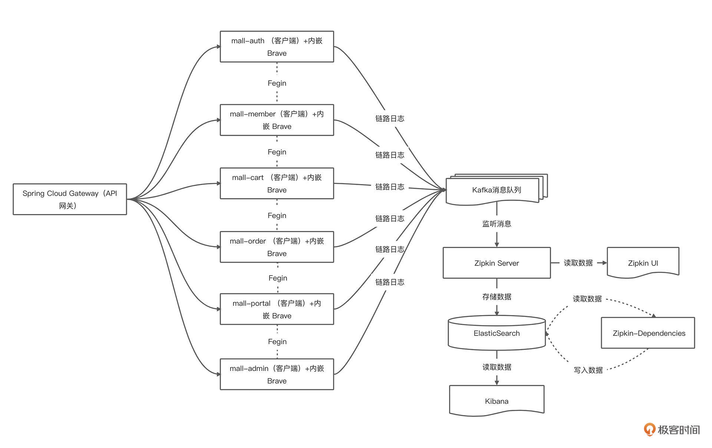

系统涉及的需要新增或改造的服务与组件包含以下 10 个：

1.  Zipkin，链路追踪系统
2.  Kafka，消息队列
3.  ElasticSearch，搜索引擎
4.  mall-gateway，API 网关
5.  mall-auth，认证中心服务
6.  mall-member，会员系统服务
7.  mall-order，订单系统服务
8.  mall-cart，购物车系统服务
9.  mall-protal，商城后台系统服务
10.  mall-admin，后台管理系统服务

结合技术栈，可以得出下面这张表格。表格整合了涉及追踪的技术组件，可以指导我们后续的改造工作。

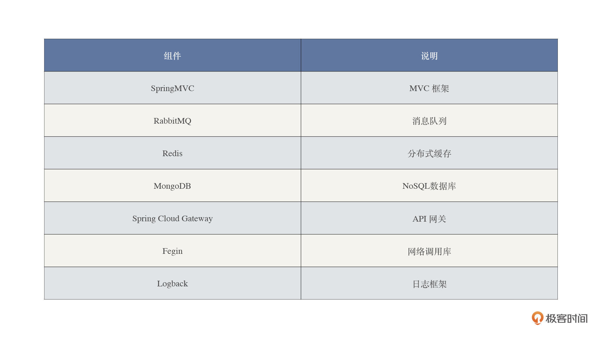

接下来，我们通过 Demo 预演来一一做一下组件追踪的技术验证工作。

## demo 预演

### SpringMVC、Fegin、Logback

一般而言，我们使用 [Brave](https://github.com/openzipkin/brave) 库，作为 Zipkin 客户端。同时它的 [instrumentation](https://github.com/openzipkin/brave/tree/master/instrumentation) 子项目，已经提供了 SpringMVC、Fegin 等组件的链路追踪功能。

<!-- [[[read_end]]] -->

所以通过引入 Spring Cloud Sleuth + Zipkin 相关依赖，可以实现对它们的自动配置，从而实现链路追踪的功能。

```
       <!--添加 Sleuth 依赖 -->
            <dependency>
                <groupId>org.springframework.cloud</groupId>
                <artifactId>spring-cloud-starter-sleuth</artifactId>
                <version>2.2.6.RELEASE</version>
            </dependency>
            <!--Zipkin 客户端-->
            <dependency>
                <groupId>org.springframework.cloud</groupId>
                <artifactId>spring-cloud-starter-zipkin</artifactId>
                <version>2.2.6.RELEASE</version>
            </dependency>
    

```

从我给出的截图可以看出，已经成功引入 Zipkin、Sleuth 和 Brave 相关的依赖。

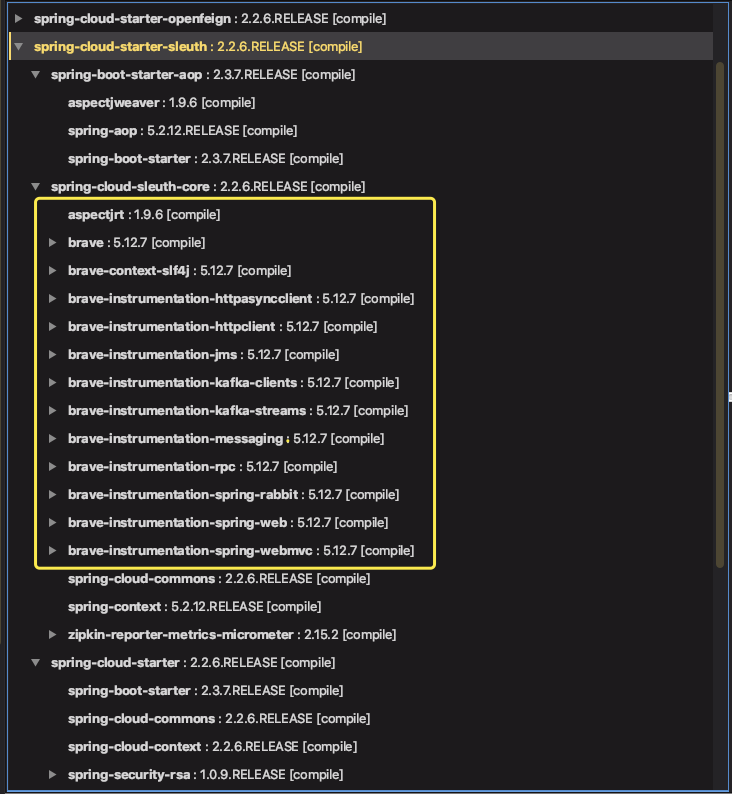

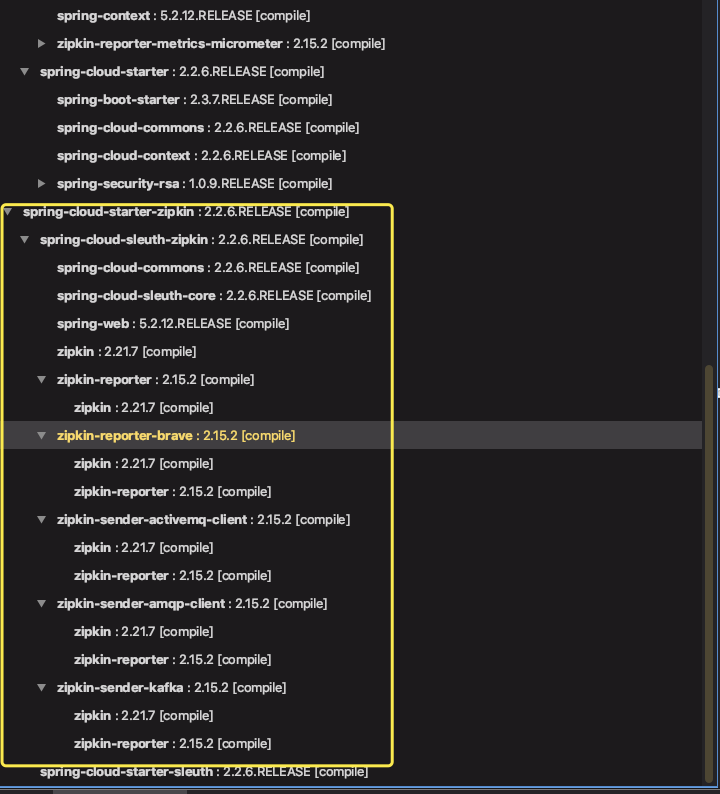

具体的示例，你可以参考这篇文章： [Sleuth+Zipkin 实现 Spring Cloud 链路追踪](https://mp.weixin.qq.com/s/7Xqk_1xGlLZom9hkfyW9hg) ​。

最后，Zipkin 可视化 UI 会出现对应的链路调用图及详细的链路。

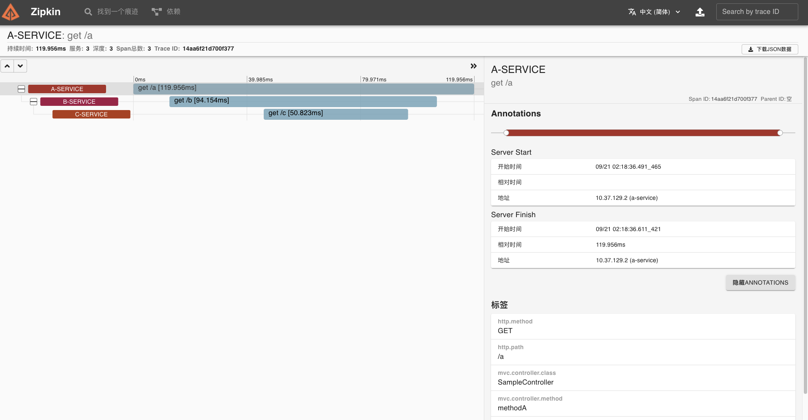

### Spring Cloud Gateway

因为 [Brave](https://github.com/openzipkin/brave) 库默认提供了 Gateway 链路追踪的功能，所以要想实现 Sleuth 对 [Spring Cloud Gateway](https://spring.io/projects/spring-cloud-gateway) 的代理请求的链路追踪，我们只需要集成就可以了。

这里我们结合上面示例中的三个服务，实现一个 API 网关，转发请求到 A 服务，即 Gateway \-> A \-> B \-> C，各服务间通过 Fegin 实现远程调用。

注意，Spring Cloud Gateway 是基于 [WebFlux](https://docs.spring.io/spring-framework/docs/current/reference/html/web-reactive.html) 实现的，而 Spring Cloud Sleuth 的 [instrument/web](https://github.com/spring-cloud/spring-cloud-sleuth/blob/master/spring-cloud-sleuth-core/src/main/java/org/springframework/cloud/sleuth/instrument/web/) 模块提供的插件，实际是针对 WebFlux 框架，同样也适用于 Spring Cloud Gateway。

具体操作如下：

第一步，创建 pom.xml 文件，引入相关依赖。

```
    <dependencies>
            <!-- 引入 Spring Cloud Gateway 相关依赖，使用它作为网关，并实现对其的自动配置 -->
            <dependency>
                <groupId>org.springframework.cloud</groupId>
                <artifactId>spring-cloud-starter-gateway</artifactId>
            </dependency>
            <!-- 引入 Zipkin 依赖-->
            <dependency>
                <groupId>org.springframework.cloud</groupId>
                <artifactId>spring-cloud-starter-zipkin</artifactId>
            </dependency>
            <!--添加 Sleuth 依赖 -->
            <dependency>
                <groupId>org.springframework.cloud</groupId>
                <artifactId>spring-cloud-starter-sleuth</artifactId>
            </dependency>
        </dependencies>
    

```

​第二步，在 application.yml 中，添加服务路由相关配置。

```
    server:
      port: 8888
    
    spring:
      application:
        name: demo-gateway-application
      sleuth:
        sampler: #采样器
          probability: 1.0 #采样率，采样率是采集 Trace 的比率，默认 0.1
          rate: 10000 #每秒数据采集量，最多 n 条/秒 Trace
        web:  # Web 组件的配置项，例如说 SpringMVC
          enabled: true
      zipkin: #设置 zipkin 服务端地址
        base-url: http://127.0.0.1:9411
    
      cloud:
        # Spring Cloud Gateway 配置项，对应 GatewayProperties 类
        gateway:
          # 路由配置项，对应 RouteDefinition 数组
          routes:
            - id: feign-service-route
              uri: http://127.0.0.1:7000
              predicates:
                - Path=/**
    

```

因为使用的是 [instrument/web](https://github.com/spring-cloud/spring-cloud-sleuth/blob/master/spring-cloud-sleuth-core/src/main/java/org/springframework/cloud/sleuth/instrument/web/) 模块提供的插件，所以和 SpringMVC 一样，WebFlux 也是使用 spring.sleuth.web 配置项。

配置项中，我们创建了一个编号为 feign-service-route 的路由，转发到 a-service 服务。

第三步，网关启动类。

```
    package com.dunshan.gatewaydemo;
    import org.springframework.boot.SpringApplication;
    import org.springframework.boot.autoconfigure.SpringBootApplication;
    /**
     * @author dunshan
     */
    @SpringBootApplication
    public class GatewayApplication {
        public static void main(String[] args) {
            SpringApplication.run(GatewayApplication.class, args);
        }
    }
    

```

最后启动所有应用，我们使用 Postman 测试一下接口，执行一次请求操作，尝试追踪该链路。

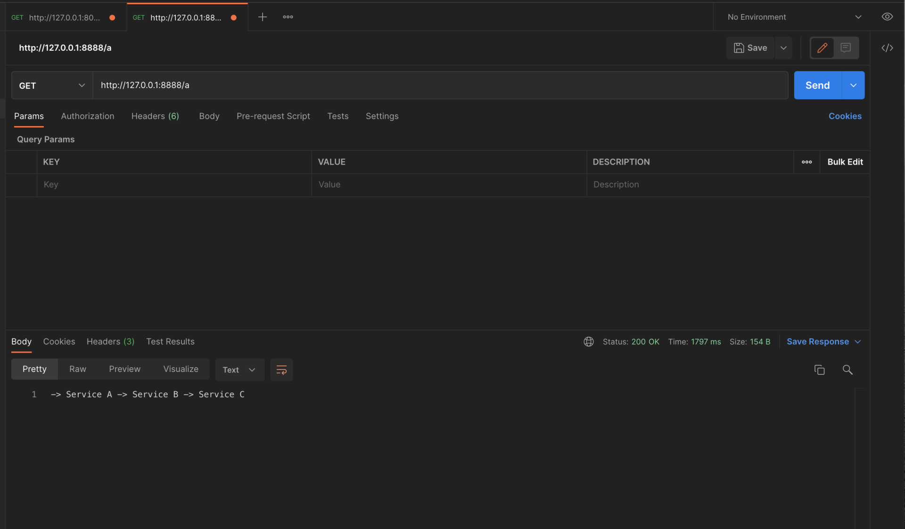

在 Zipkin 可视化 UI 就可以看到刚才我们调用接口的链路数据了。

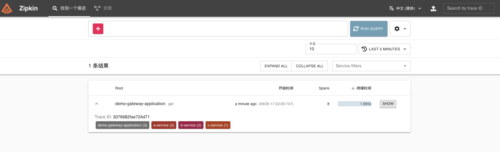

这条链路经过 gateway、a-service、b-service、c-service 四个服务。

我们点开该链路，可以看到一个 Trace 明细。


### MySQL

这里需要实现一个简单的 MySQL 查询，接下来我会使用 MySQL8 驱动进行数据库的操作，这也是我们项目目前采用的方式。

目前 Brave 支持通过三种插件实现 MySQL 链路数据收集，它们分别是：

* [brave-instrumentation-mysql](https://github.com/openzipkin/brave/tree/master/instrumentation/mysql)
* [brave-instrumentation-mysql6](https://github.com/openzipkin/brave/blob/master/instrumentation/mysql6/)
* [brave-instrumentation-mysql8](https://github.com/openzipkin/brave/blob/master/instrumentation/mysql8/)

我简单演示一下用 Spring JDBC Template 的方式进行 MySQL 操作的步骤。

第一步，创建 pom.xml 文件，引入相关依赖。

```
      <dependencies>
            <!-- 引入 SpringMVC 相关依赖，并实现对其的自动配置 -->
            <dependency>
                <groupId>org.springframework.boot</groupId>
                <artifactId>spring-boot-starter-web</artifactId>
            </dependency>
            <!-- 实现对数据库连接池的自动化配置 -->
            <dependency>
                <groupId>org.springframework.boot</groupId>
                <artifactId>spring-boot-starter-jdbc</artifactId>
            </dependency>
            <!--Mysql 数据库驱动-->
            <dependency>
                <groupId>mysql</groupId>
                <artifactId>mysql-connector-java</artifactId>
                <version>8.0.15</version>
            </dependency>
            <!-- 引入 Zipkin 依赖-->
            <dependency>
                <groupId>org.springframework.cloud</groupId>
                <artifactId>spring-cloud-starter-zipkin</artifactId>
            </dependency>
            <!--添加 Sleuth 依赖 -->
            <dependency>
                <groupId>org.springframework.cloud</groupId>
                <artifactId>spring-cloud-starter-sleuth</artifactId>
            </dependency>
            <!-- Brave 对 MySQL8 的支持 -->
            <dependency>
                <groupId>io.zipkin.brave</groupId>
                <artifactId>brave-instrumentation-mysql8</artifactId>
            </dependency>
        </dependencies>
    

```

这里引入 brave-instrumentation-mysql8 依赖，实现对 MySQL 的链路追踪。

第二步，在 application.yml 中，添加数据库相关配置。

```
    spring:
      application:
        name: demo-service # 服务名
      sleuth:
        sampler: #采样器
          probability: 1.0 #采样率，采样率是采集 Trace 的比率，默认 0.1
          rate: 10000 #每秒数据采集量，最多 n 条/秒 Trace
        web:  # Web 组件的配置项，例如说 SpringMVC
          enabled: true
      zipkin: #设置 zipkin 服务端地址
        base-url: http://127.0.0.1:9411
    
      # datasource 数据源配置内容
      datasource:
        url: jdbc:mysql://127.0.0.1:3306/test?useSSL=false&useUnicode=true&characterEncoding=UTF-8&queryInterceptors=brave.mysql8.TracingQueryInterceptor&exceptionInterceptors=brave.mysql8.TracingExceptionInterceptor&zipkinServiceName=mysql-demo
        driver-class-name: com.mysql.jdbc.Driver
        username: root
        password: root
    
    logging:
      level:
        root: debug #为演示需要，开启 debug 级别日志
    

```

在这里，Brave 通过实现类 [TracingQueryInterceptor](https://github.com/openzipkin/brave/blob/master/instrumentation/mysql8/src/main/java/brave/mysql8/TracingQueryInterceptor.java) 拦截 SQL 请求，进行 MySQL 的链路追踪。切记，在 spring.datasource.url 配置项上的 queryInterceptors、exceptionInterceptors 和 zipkinServiceName 属性上，一定要分别设置拦截器和该 MySQL 在 Zipkin 中展示的服务名。

第三步，在 MySQL 数据库中，创建用户表并插入数据。

```
    CREATE TABLE `t_user` (
      `id` int(8) NOT NULL AUTO_INCREMENT COMMENT '主键自增',
      `username` varchar(50) NOT NULL COMMENT '用户名',
      `password` varchar(50) NOT NULL COMMENT '密码',
      PRIMARY KEY (`id`)
    ) ENGINE=InnoDB AUTO_INCREMENT=1 DEFAULT CHARSET=utf8 COMMENT='用户表';
    
    INSERT INTO `t_user`(`id`, `username`, `password`) VALUES (1, '7d', '123456');
    
    

```

​第四步，创建 DemoController 类，提供示例 API 接口。

```
    package com.dunshan.mysql8demo.controller;
    import org.springframework.beans.factory.annotation.Autowired;
    import org.springframework.jdbc.core.BeanPropertyRowMapper;
    import org.springframework.jdbc.core.JdbcTemplate;
    import org.springframework.web.bind.annotation.GetMapping;
    import org.springframework.web.bind.annotation.RequestMapping;
    import org.springframework.web.bind.annotation.RequestParam;
    import org.springframework.web.bind.annotation.RestController;
    
    @RestController
    @RequestMapping("/7d")
    public class DemoController {
        @Autowired
        private JdbcTemplate template;
        @GetMapping("/get")
        public String get(@RequestParam("id") Integer id) {
            this.selectById(1);
            return "success";
        }
        public Object selectById(Integer id) {
            return template.queryForObject("SELECT id, username, password FROM t_user WHERE id = ?",
                    new BeanPropertyRowMapper<>(Object.class), // 结果转换成对应的对象。
                    id);
        }
    }
    

```

第五步，创建 DemoServiceApplication 启动类。

```
    package com.dunshan.mysql8demo;
    import org.springframework.boot.SpringApplication;
    import org.springframework.boot.autoconfigure.SpringBootApplication;
    
    @SpringBootApplication
    public class DemoServiceApplication {
        public static void main(String[] args) {
            SpringApplication.run(DemoServiceApplication.class, args);
        }
    }
    

```

这样在 /7d/get 接口会执行一次 MySQL 的查询操作。  
最后启动应用，我们使用 Postman 测试一下接口，尝试追踪该链路。

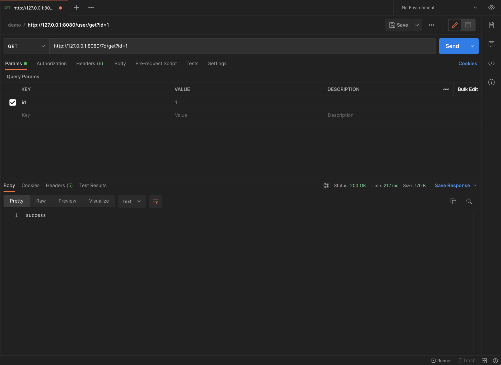

同样在 Zipkin 可视化 UI 也可以看到刚才调用接口的链路数据。

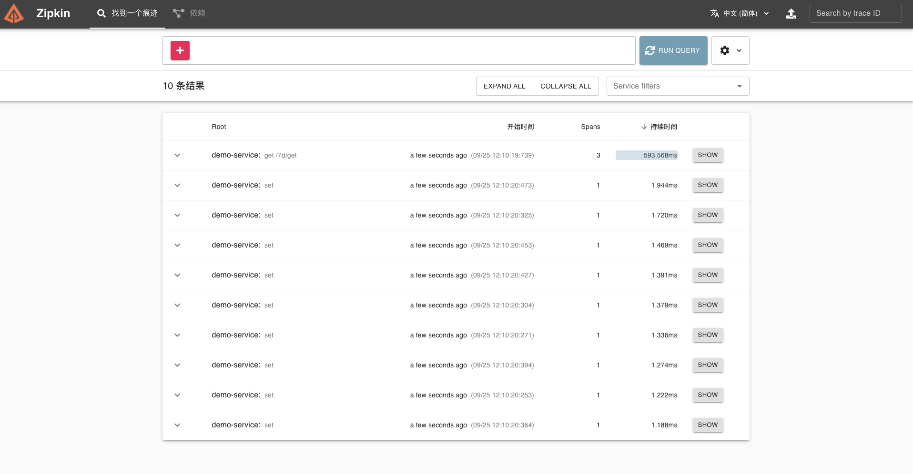

点开这个链路，可以看到一个 Trace 明细。


到这里，我们的 MySQL 组件链路追踪就成功了。

### Redis

这一部分需要实现简单的 Redis 操作，接下来我们使用 Spring Data Redis + Jedis 进行 Redis 的操作（项目部分服务使用的方式）。目前 Brave 暂未支持 Jedis 客户端的方式，所以我们只能考虑其它的办法。

在 [opentracing-contrib](https://github.com/opentracing) 项目中，有一个 [java-redis-client](https://github.com/opentracing-contrib/java-redis-client) 子项目，提供了 OpenTracing 针对 Jedis、Lettuce 等客户端的链路追踪功能。这样，我们搭配上 [brave-opentracing](https://github.com/openzipkin-contrib/brave-opentracing) 项目，可以使用 OpenTracing API 收集的链路数据，发送给 Zipkin。

而 Lettuce 基于 Brave 实现了 [BraveTracing](https://github.com/lettuce-io/lettuce-core/blob/main/src/main/java/io/lettuce/core/tracing/BraveTracing.java) ，从而可以实现对 Redis 操作的链路追踪。并且，Spring Cloud Sleuth 的 [instrument/redis](https://github.com/spring-cloud/spring-cloud-sleuth/tree/main/spring-cloud-sleuth-autoconfigure/src/main/java/org/springframework/cloud/sleuth/autoconfig/instrument/redis) 模块对它实现了自动配置。如果项目中是使用 Lettuce 作为 Redis 客户端的话，可以考虑采用这种方式。

我们还是来看下具体的操作步骤。

第一步，创建 pom.xml 文件，引入相关依赖。

```
       <dependencies>
            <!-- 引入 SpringMVC 相关依赖，并实现对其的自动配置 -->
            <dependency>
                <groupId>org.springframework.boot</groupId>
                <artifactId>spring-boot-starter-web</artifactId>
            </dependency>
            <!-- 实现对 Spring Data Redis 的自动化配置 -->
            <dependency>
                <groupId>org.springframework.boot</groupId>
                <artifactId>spring-boot-starter-data-redis</artifactId>
                <exclusions>
                    <!-- 去掉对 Lettuce 的依赖，因为 Spring Boot 优先使用 Lettuce 作为 Redis 客户端 -->
                    <exclusion>
                        <groupId>io.lettuce</groupId>
                        <artifactId>lettuce-core</artifactId>
                    </exclusion>
                </exclusions>
            </dependency>
            <!-- 引入 Jedis 的依赖 -->
            <dependency>
                <groupId>redis.clients</groupId>
                <artifactId>jedis</artifactId>
            </dependency>
            <!-- 引入 Zipkin 相关依赖-->
            <dependency>
                <groupId>org.springframework.cloud</groupId>
                <artifactId>spring-cloud-starter-zipkin</artifactId>
            </dependency>
            <!--引入 Sleuth 相关依赖 -->
            <dependency>
                <groupId>org.springframework.cloud</groupId>
                <artifactId>spring-cloud-starter-sleuth</artifactId>
            </dependency>
            <!--  Brave 对 Opentracing 的实现 -->
            <dependency>
                <groupId>io.opentracing.brave</groupId>
                <artifactId>brave-opentracing</artifactId>
                <version>0.35.0</version>
            </dependency>
            <!-- Opentracing 对 Redis 的支持 -->
            <dependency>
                <groupId>io.opentracing.contrib</groupId>
                <artifactId>opentracing-redis-jedis3</artifactId>
                <version>0.1.16</version>
            </dependency>
            <dependency>
                <groupId>io.opentracing.contrib</groupId>
                <artifactId>opentracing-redis-spring-data</artifactId>
                <version>0.1.16</version>
            </dependency>
        </dependencies>
    

```

这里引入 [brave-opentracing](https://mvnrepository.com/artifact/io.opentracing.brave/brave-opentracing) 依赖，也就是 Brave 对 Opentracing 的实现。

注意，Opentracing 和 JDBC 一样是一个通用标准，因此需要有 Brave 对 Opentracing 做具体实现，从而将链路数据写入到 Zipkin 中。就好比 JDBC 对 MySQL Driver 实现，将数据写入到 MySQL 数据库中一样。

同时，我们要引入 [opentracing-redis-spring-data](https://mvnrepository.com/artifact/io.opentracing.contrib/opentracing-redis-spring-data) 和 [opentracing-redis-jedis3](https://mvnrepository.com/artifact/io.opentracing.contrib/opentracing-redis-jedis3) 依赖，实现对 Jedis 操作 Redis 的链路追踪。

第二步，在 application.yml 中，添加redis相关配置。

```
    spring:
      application:
        name: demo-service # 服务名
      sleuth:
        sampler: #采样器
          probability: 1.0 #采样率，采样率是采集 Trace 的比率，默认 0.1
          rate: 10000 #每秒数据采集量，最多 n 条/秒 Trace
      zipkin: #设置 zipkin 服务端地址
        base-url: http://127.0.0.1:9411
        
      # 对应 RedisProperties 类
      redis:
        host: 127.0.0.1
        port: 6379
        password: # Redis redis密码，默认为空。
        database: 0 # Redis redis中的数据库号，默认为 0。
        timeout: 6000 # Redis 连接超时时间，单位：毫秒。
        # 对应 RedisProperties.Jedis 内部类
        jedis:
          pool:
            max-active: 8 # 连接池最大连接数，默认为 8。使用负数表示没有限制。
            max-idle: 8 # 默认连接数最小空闲的连接数，默认为 8。使用负数表示没有限制。
            min-idle: 0 # 默认连接池最小空闲的连接数，默认为 0。允许设置 0 和 正数。
            max-wait: -1 # 连接池最大阻塞等待时间，单位：毫秒。默认为 -1，表示不限制。
    logging:
      level:
        root: debug #为演示需要，开启 debug 级别日志
    

```

第三步，创建 SleuthConfiguration 配置类，创建一个 [TracingRedisConnectionFactory](https://github.com/opentracing-contrib/java-redis-client/blob/master/opentracing-redis-spring-data2/src/main/java/io/opentracing/contrib/redis/spring/data2/connection/TracingRedisConnectionFactory.java) Bean 对象。这样，我们就能拦截到 Redis 操作，进行相应的链路跟踪了。

```
    package com.dunsan.redisdemo.config;
    
    import io.opentracing.Tracer;
    import io.opentracing.contrib.redis.common.TracingConfiguration;
    import io.opentracing.contrib.redis.spring.data.connection.TracingRedisConnectionFactory;
    import org.springframework.boot.autoconfigure.data.redis.RedisProperties;
    import org.springframework.context.annotation.Bean;
    import org.springframework.context.annotation.Configuration;
    import org.springframework.data.redis.connection.RedisConnectionFactory;
    import org.springframework.data.redis.connection.jedis.JedisConnectionFactory;
    
    @Configuration
    public class SleuthConfiguration {
    
        @Bean
        public RedisConnectionFactory redisConnectionFactory(Tracer tracer, RedisProperties redisProperties) {
            // 创建 JedisConnectionFactory 对象
            RedisConnectionFactory connectionFactory = new JedisConnectionFactory();
            // 创建 TracingConfiguration 对象
            TracingConfiguration tracingConfiguration = new TracingConfiguration.Builder(tracer)
                    // 设置拓展 Tag，设置 Redis 服务器地址。因为默认情况下，不会在操作 Redis 链路的 Span 上记录 Redis 服务器的地址，所以这里需要设置。
                    .extensionTag("Server Address", redisProperties.getHost() + ":" + redisProperties.getPort())
                    .build();
            // 创建 TracingRedisConnectionFactory 对象
            return new TracingRedisConnectionFactory(connectionFactory, tracingConfiguration);
        }
        
    }
    

```

第四步，创建 DemoController 类，提供示例 API 接口。

```
    package com.dunsan.redisdemo.controller;
    
    import org.springframework.beans.factory.annotation.Autowired;
    import org.springframework.data.redis.core.StringRedisTemplate;
    import org.springframework.web.bind.annotation.GetMapping;
    import org.springframework.web.bind.annotation.RequestMapping;
    import org.springframework.web.bind.annotation.RequestParam;
    import org.springframework.web.bind.annotation.RestController;
    
    @RestController
    @RequestMapping("/7d")
    public class DemoController {
    
        @Autowired
        private StringRedisTemplate redisTemplate;
    
        @GetMapping("/get")
        public String get(@RequestParam("id") Integer id) {
            this.get("demo");
            return "success";
        }
    
        public void get(String key) {
            redisTemplate.opsForValue().get(key);
        }
    
    }
    

```

这样在 /7d/get 接口中，就会执行一次 Redis 的查询。

第五步，创建 DemoServiceApplication 启动类。

```
    package com.dunsan.redisdemo;
    
    import org.springframework.boot.SpringApplication;
    import org.springframework.boot.autoconfigure.SpringBootApplication;
    
    @SpringBootApplication
    public class DemoServiceApplication {
    
        public static void main(String[] args) {
            SpringApplication.run(DemoServiceApplication.class, args);
        }
    
    }
    

```

最后启动应用。我们用 Postman 测试一下口，执行一次 Redis 查询操作，尝试跟踪该链路。

在 Zipkin 可视化 UI 中就可以看到刚才我们调用接口的链路数据了。

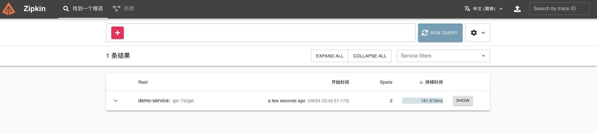

点开该链路，可以看到一个 Trace 明细。

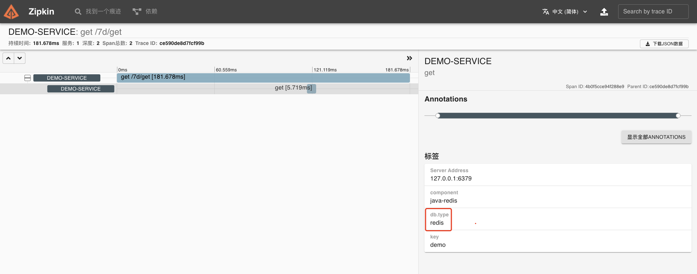

到这里，我们的 Redis 组件链路跟踪也已经成功了。

### MongoDB

这里还是实现简单的 MongoDB 操作，我会使用 Spring Data MongoDB + MongoTemplate 进行 MongoDB 的操作。目前，Brave 默认提供了对 MongoDB 操作的链路跟踪，通过 [brave-instrumentation-mongo](https://github.com/openzipkin/brave/tree/master/instrumentation/mongodb) 库实现收集链路数据。

我们来看下具体的实现路径：

第一步，还是引入相关依赖。

```
       <dependencies>
            <!-- 引入 SpringMVC 相关依赖，并实现对其的自动配置 -->
            <dependency>
                <groupId>org.springframework.boot</groupId>
                <artifactId>spring-boot-starter-web</artifactId>
            </dependency>
            <!-- 自动化配置 Spring Data Mongodb -->
            <dependency>
                <groupId>org.springframework.boot</groupId>
                <artifactId>spring-boot-starter-data-mongodb</artifactId>
            </dependency>
            <!-- 引入 Zipkin 相关依赖 -->
            <dependency>
                <groupId>org.springframework.cloud</groupId>
                <artifactId>spring-cloud-starter-zipkin</artifactId>
            </dependency>
            <!--添加 Sleuth 依赖 -->
            <dependency>
                <groupId>org.springframework.cloud</groupId>
                <artifactId>spring-cloud-starter-sleuth</artifactId>
            </dependency>
            <!--添加 brave mongodb 依赖 -->
            <dependency>
                <groupId>io.zipkin.brave</groupId>
                <artifactId>brave-instrumentation-mongodb</artifactId>
                <version>5.13.3</version>
            </dependency>
    

```

第二步，创建全局配置文件，添加MongoDB配置。

```
    spring:
      application:
        name: demo-service # 服务名
    
      sleuth:
        sampler: #采样器
          probability: 1.0 #采样率，采样率是采集 Trace 的比率，默认 0.1
          rate: 10000 #每秒数据采集量，最多 n 条/秒 Trace
        web:  # Web 组件的配置项，例如说 SpringMVC
          enabled: true
    
      zipkin: #设置 zipkin 服务端地址
        base-url: http://127.0.0.1:9411
    
      data:
        # MongoDB 配置项，对应 MongoProperties 类
        mongodb:
          host: 127.0.0.1
          port: 27017
          database: demo
    #      username:
    #      password:
    logging:
      level:
        root: debug #为演示需要，开启 debug 级别日志
    

```

第三步，创建 SleuthConfiguration 配置类，创建一个 [TraceMongoCommandListener](https://github.com/openzipkin/brave/blob/master/instrumentation/mongodb/src/main/java/brave/mongodb/TraceMongoCommandListener.java) Bean 对象。这样，我们就能拦截到 MongoDB 操作，进行相应的链路跟踪了。

```
    package com.dunshan.mongodbdemo.config;
    
    import brave.Tracer;
    import brave.Tracing;
    import brave.mongodb.MongoDBTracing;
    import com.mongodb.MongoClientSettings;
    import com.mongodb.client.MongoClient;
    import com.mongodb.client.MongoClients;
    import com.mongodb.event.CommandListener;
    import org.springframework.context.annotation.Bean;
    import org.springframework.context.annotation.Configuration;
    
    @Configuration
    public class SleuthConfiguration {
    
        @Bean
        public MongoClient mongoClient(Tracer tracer) {
            CommandListener listener = MongoDBTracing.create(Tracing.current())
                    .commandListener();
            MongoClientSettings settings = MongoClientSettings.builder()
                    .addCommandListener(listener)
                    .build();
            MongoClient client = MongoClients.create(settings);
            return client;
        }
    
    }
    

```

第四步，创建 DemoController 类，提供示例 API 接口。

```
    package com.dunshan.mongodbdemo.controller;
    
    import org.springframework.beans.factory.annotation.Autowired;
    import org.springframework.data.mongodb.core.MongoTemplate;
    import org.springframework.data.mongodb.core.query.Criteria;
    import org.springframework.data.mongodb.core.query.Query;
    import org.springframework.web.bind.annotation.GetMapping;
    import org.springframework.web.bind.annotation.RequestMapping;
    import org.springframework.web.bind.annotation.RequestParam;
    import org.springframework.web.bind.annotation.RestController;
    
    @RestController
    @RequestMapping("/7d")
    public class DemoController {
    
        @Autowired
        private MongoTemplate mongoTemplate;
    
        @GetMapping("/get")
        public String get(@RequestParam("id") Integer id) {
            this.findById(1);
            return "success";
        }
    
        public DemoDO findById(Integer id) {
            return mongoTemplate.findOne(new Query(Criteria.where("_id").is(id)), DemoDO.class);
        }
    
    }
    
    

```

我们可以请求 /7d/get 接口，执行一次 MongoDB 的查询。

第五步，创建 DemoServiceApplication 启动类。

```
    package com.dunshan.mongodbdemo;
    
    import org.springframework.boot.SpringApplication;
    import org.springframework.boot.autoconfigure.SpringBootApplication;
    
    @SpringBootApplication
    public class DemoServiceApplication {
    
        public static void main(String[] args) {
            SpringApplication.run(DemoServiceApplication.class, args);
        }
    
    }
    

```

最后启动应用。我们使用 Postman 测试接口，执行一次 MongoDB 查询操作，尝试跟踪该链路。

在 Zipkin 可视化 UI 中可以看到刚才我们调用接口的链路数据。

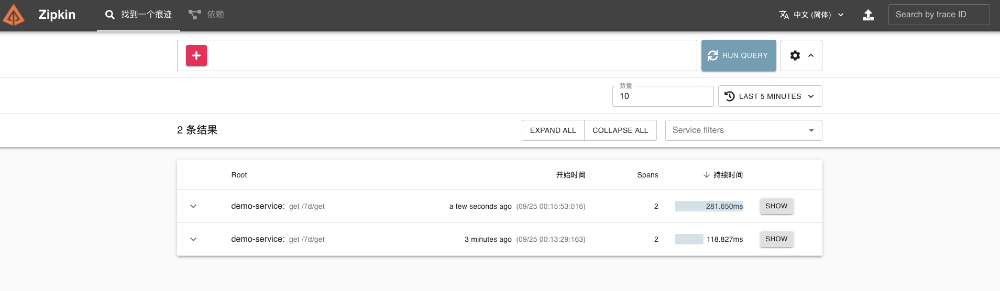

点开该链路，可以看到一个 Trace 明细。

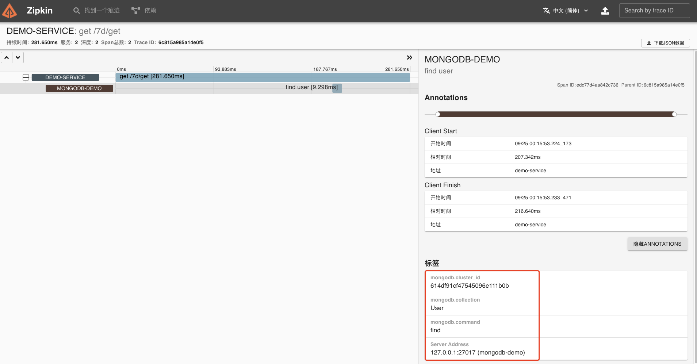

我们的 MongoDB 组件链路跟踪也已经成功了。

### RabbitMQ

因为 [Brave](https://github.com/openzipkin/brave) 库也默认提供了 RabbitMQ 链路追踪的功能，所以同样只需要集成就可以了。

顺便提下 ，Brave 主要通过两个插件实现链路数据收集，它们分别是：

* [brave-instrumentation-messaging](https://github.com/openzipkin/brave/tree/master/instrumentation/messaging)
* [brave-instrumentation-spring-rabbit](https://github.com/openzipkin/brave/blob/master/instrumentation/spring-rabbit/)

**搭建生产者示例**

第一步，还是引入相关依赖。

```
        <dependencies>
            <!-- 引入 SpringMVC 相关依赖，并实现对其的自动配置 -->
            <dependency>
                <groupId>org.springframework.boot</groupId>
                <artifactId>spring-boot-starter-web</artifactId>
            </dependency>
            <!-- 引入 Spring Cloud Stream RabbitMQ 相关依赖，将 RabbitMQ 作为消息队列，并实现对其的自动配置 -->
            <dependency>
                <groupId>org.springframework.cloud</groupId>
                <artifactId>spring-cloud-starter-stream-rabbit</artifactId>
            </dependency>
            <!-- 引入 Zipkin 依赖-->
            <dependency>
                <groupId>org.springframework.cloud</groupId>
                <artifactId>spring-cloud-starter-zipkin</artifactId>
            </dependency>
            <!--添加 Sleuth 依赖 -->
            <dependency>
                <groupId>org.springframework.cloud</groupId>
                <artifactId>spring-cloud-starter-sleuth</artifactId>
            </dependency>
        </dependencies>
    

```

第二步，创建全局配置文件，添加RabbitMQ配置。

```
    spring:
      application:
        name: demo-producer
      cloud:
        # Spring Cloud Stream 配置项，对应 BindingServiceProperties 类
        stream:
          # Binder 配置项，对应 BinderProperties Map
          binders:
            demo:
              type: rabbit # 设置 Binder 的类型
              environment: # 设置 Binder 的环境配置
                # 如果是 RabbitMQ 类型的时候，则对应的是 RabbitProperties 类
                spring:
                  rabbitmq:
                    host: 127.0.0.1 # 服务地址
                    port: 5672 # 服务端口
                    username: guest # 服务账号
                    password: guest # 服务密码
          # Binding 配置项，对应 BindingProperties Map
          bindings:
            demo-output:
              destination: DEMO-TOPIC # 目的地,使用 RabbitMQ Exchange
              content-type: application/json # 内容格式
              binder: demo # 设置使用的 Binder 名字
      sleuth:
        sampler: #采样器
          probability: 1.0 #采样率，采样率是采集 Trace 的比率，默认 0.1
          rate: 10000 #每秒数据采集量，最多 n 条/秒 Trace
        messaging:
          # Spring Cloud Sleuth 针对 RabbitMQ 组件的配置项
          rabbit:
            enabled: true # 是否开启
            remote-service-name: rabbitmq # 远程服务名，默认为 rabbitmq
      zipkin: #设置 zipkin 服务端地址
        base-url: http://127.0.0.1:9411
    
    server:
      port: 18080
    

```

第三步，创建 MySource 接口，声明名字为 Output Binding。

```
    package com.dunshan.rabbitmqdemo.producerdemo.message;
    
    import org.springframework.cloud.stream.annotation.Output;
    import org.springframework.messaging.MessageChannel;
    
    public interface MySource {
    
        @Output("demo-output")
        MessageChannel demoOutput();
    
    }
    

```

第四步，创建 DemoMessage 类，示例 Message 消息。

```
    package com.dunshan.rabbitmqdemo.producerdemo.message;
    
    /**
     * 示例 Message 消息
     */
    public class DemoMessage {
    
        /**
         * 编号
         */
        private Integer id;
    
        public DemoMessage setId(Integer id) {
            this.id = id;
            return this;
        }
    
        public Integer getId() {
            return id;
        }
    
        @Override
        public String toString() {
            return "DemoMessage{" +
                    "id=" + id +
                    '}';
        }
    
    }
    

```

​第五步，创建 DemoController 类，提供示例 API 接口。

```
    package com.dunshan.rabbitmqdemo.producerdemo.controller;
    
    import org.slf4j.Logger;
    import org.slf4j.LoggerFactory;
    import org.springframework.beans.factory.annotation.Autowired;
    import org.springframework.messaging.Message;
    import org.springframework.messaging.support.MessageBuilder;
    import org.springframework.web.bind.annotation.GetMapping;
    import org.springframework.web.bind.annotation.RequestMapping;
    import org.springframework.web.bind.annotation.RestController;
    
    import java.util.Random;
    
    @RestController
    @RequestMapping("/7d")
    public class DemoController {
    
        private Logger logger = LoggerFactory.getLogger(getClass());
    
        @Autowired
        private MySource mySource;
    
        @GetMapping("/send")
        public boolean send() {
            // 创建 Message
            DemoMessage message = new DemoMessage()
                    .setId(new Random().nextInt());
            // 创建 Spring Message 对象
            Message<DemoMessage> springMessage = MessageBuilder.withPayload(message)
                    .build();
            // 发送消息
            return mySource.demoOutput().send(springMessage);
        }
    
    }
    

```

我们可以请求 /7d/send 接口，执行一次发送消费。

第六步，创建 DemoServiceApplication 启动类。

```
    package com.dunshan.rabbitmqdemo.producerdemo;
    
    import org.springframework.boot.SpringApplication;
    import org.springframework.boot.autoconfigure.SpringBootApplication;
    import org.springframework.cloud.stream.annotation.EnableBinding;
    
    @SpringBootApplication
    @EnableBinding(MySource.class)
    public class ProducerApplication {
    
        public static void main(String[] args) {
            SpringApplication.run(ProducerApplication.class, args);
        }
    
    }
    

```

这样，我们的生产者示例就搭建完了。

**搭建消费者示例**

第一步，还是引入相关依赖。

```
        <dependencies>
            <!-- 引入 SpringMVC 相关依赖，并实现对其的自动配置 -->
            <dependency>
                <groupId>org.springframework.boot</groupId>
                <artifactId>spring-boot-starter-web</artifactId>
            </dependency>
            <!-- 引入 Spring Cloud Stream RabbitMQ 相关依赖，将 RabbitMQ 作为消息队列，并实现对其的自动配置 -->
            <dependency>
                <groupId>org.springframework.cloud</groupId>
                <artifactId>spring-cloud-starter-stream-rabbit</artifactId>
            </dependency>
            <!-- 引入 Zipkin 依赖-->
            <dependency>
                <groupId>org.springframework.cloud</groupId>
                <artifactId>spring-cloud-starter-zipkin</artifactId>
            </dependency>
            <!--添加 Sleuth 依赖 -->
            <dependency>
                <groupId>org.springframework.cloud</groupId>
                <artifactId>spring-cloud-starter-sleuth</artifactId>
            </dependency>
        </dependencies>
    

```

第二步，创建全局配置文件，添加相关数据库配置。

```
    spring:
      application:
        name: demo-consumer
      cloud:
        # Spring Cloud Stream 配置项，对应 BindingServiceProperties 类
        stream:
          # Binder 配置项，对应 BinderProperties Map
          binders:
            demo:
              type: rabbit # 设置 Binder 的类型
              environment: # 设置 Binder 的环境配置
                # 如果是 RabbitMQ 类型的时候，则对应的是 RabbitProperties 类
                spring:
                  rabbitmq:
                    host: 127.0.0.1 # RabbitMQ 服务的地址
                    port: 5672 # RabbitMQ 服务的端口
                    username: guest # 服务账号
                    password: guest # 服务密码
          # Binding 配置项，对应 BindingProperties Map
          bindings:
            demo01-input:
              destination: DEMO-TOPIC # 目的地。这里使用 RabbitMQ Exchange
              content-type: application/json # 内容格式。这里使用 JSON
              group: demo-consumer-group-DEMO-TOPIC # 消费者分组
              binder: demo  # 设置使用的 Binder 名字
    
      sleuth:
        sampler: #采样器
          probability: 1.0 #采样率，采样率是采集 Trace 的比率，默认 0.1
          rate: 10000 #每秒数据采集量，最多 n 条/秒 Trace
        messaging:
          # Spring Cloud Sleuth 针对 RabbitMQ 组件的配置项
          rabbit:
            enabled: true # 是否开启
            remote-service-name: rabbitmq # 远程服务名，默认为 rabbitmq
      zipkin: #设置 zipkin 服务端地址
        base-url: http://127.0.0.1:9411
    
    server:
      port: ${random.int[10000,19999]} # 随机端口，方便启动多个消费者
    

```

spring.sleuth.messaging.rabbit 是 Spring Cloud Sleuth 针对 RabbitMQ 组件的配置项，对应 [SleuthMessagingProperties.Rabbit](https://github.com/spring-cloud/spring-cloud-sleuth/blob/master/spring-cloud-sleuth-core/src/main/java/org/springframework/cloud/sleuth/instrument/messaging/SleuthMessagingProperties.java#L150-L175) 类。

* enabled 配置项，是否开启，默认为 true。
* remote-service-name 配置项，远程服务名，默认为 rabbitmq。

第三步，创建 MySink 接口，声明名字为 Intput Binding。

```
    package com.dunshan.rabbitmqdemo.consumerdemo.listener;
    
    import org.springframework.cloud.stream.annotation.Input;
    import org.springframework.messaging.SubscribableChannel;
    
    public interface MySink {
    
        String DEMO_INPUT = "demo-input";
    
        @Input(DEMO_INPUT)
        SubscribableChannel demoInput();
    
    }
    

```

第四步，创建 DemoMessage 类，示例 Message 消息。

```
    package com.dunshan.rabbitmqdemo.consumerdemo.message;
    
    /**
     * 示例 Message 消息
     */
    public class DemoMessage {
    
        /**
         * 编号
         */
        private Integer id;
    
        public DemoMessage setId(Integer id) {
            this.id = id;
            return this;
        }
    
        public Integer getId() {
            return id;
        }
    
        @Override
        public String toString() {
            return "DemoMessage{" +
                    "id=" + id +
                    '}';
        }
    
    }
    

```

​第五步，创建 DemoConsumer 类，消费消息。

```
    package com.dunshan.rabbitmqdemo.consumerdemo.listener;
    
    import org.slf4j.Logger;
    import org.slf4j.LoggerFactory;
    import org.springframework.cloud.stream.annotation.StreamListener;
    import org.springframework.messaging.handler.annotation.Payload;
    import org.springframework.stereotype.Component;
    
    @Component
    public class DemoConsumer {
    
        private Logger logger = LoggerFactory.getLogger(getClass());
    
        @StreamListener(MySink.DEMO_INPUT)
        public void onMessage(@Payload DemoMessage message) {
            logger.info("[onMessage][线程编号:{} 消息内容：{}]", Thread.currentThread().getId(), message);
        }
    
    }
    

```

第六步，创建 DemoServiceApplication 启动类。

```
    package com.dunshan.rabbitmqdemo.consumerdemo;
    
    import org.springframework.boot.SpringApplication;
    import org.springframework.boot.autoconfigure.SpringBootApplication;
    import org.springframework.cloud.stream.annotation.EnableBinding;
    
    @SpringBootApplication
    @EnableBinding(MySink.class)
    public class ConsumerApplication {
    
        public static void main(String[] args) {
            SpringApplication.run(ConsumerApplication.class, args);
        }
    
    }
    

```

最后，启动应用。我们使用 Postman 测试一下接口，发送一条消息，尝试跟踪该链路。

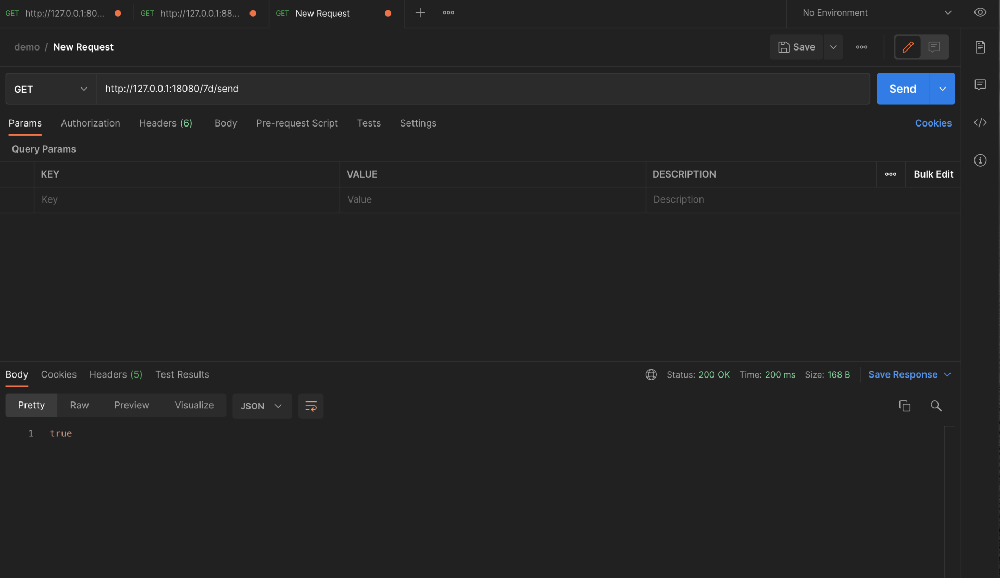

查看结果，在 Zipkin 已经可以看到刚才我们调用接口的链路数据了。

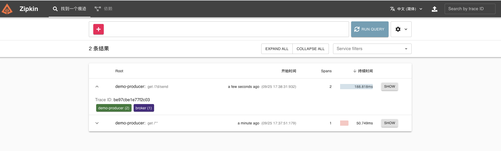

点开该链路可以看到一个 Trace 明细。

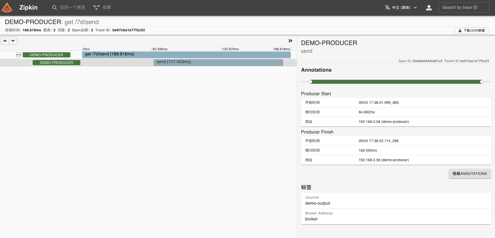

到这里，我们的 RabbitMQ 组件链路跟踪也成功了。

刚才，我对所有的技术组件都单独进行了 demo 预演。单就这个过程来说，改造的复杂度还是可以接受的。接下来我们就一起来看看，怎么让它们在真实项目中落地。

## 系统改造

### 服务改造

我这里主要介绍三个服务的改造过程（其他服务是类似的操作），它们分别是：

1.  mall-gateway，API 网关
2.  mall-auth，认证中心服务
3.  mall-member，会员系统服务

mall-gateway 主要使用的是 Spring Cloud Gateway 技术，我们这个项目的主要用途是路由匹配、请求统一校验认证和鉴权。

大致的执行流程可以参考[下图](https://docs.spring.io/spring-cloud-gateway/docs/current/reference/html)。

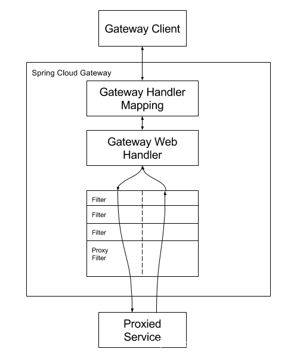

通过上面的介绍，我们知道 Sleuth 原生就支持对 Spring Cloud Gateway 链路追踪，所以我们只需要集成就可以了。

我们在 pom.xml 文件引入相关依赖。

```
    <dependencies>
            <!-- 引入 Spring Cloud Gateway 相关依赖-->
            <dependency>
                <groupId>org.springframework.cloud</groupId>
                <artifactId>spring-cloud-starter-gateway</artifactId>
            </dependency>
            <!-- 引入 Zipkin 依赖-->
            <dependency>
                <groupId>org.springframework.cloud</groupId>
                <artifactId>spring-cloud-starter-zipkin</artifactId>
            </dependency>
            <!--添加 Sleuth 依赖 -->
            <dependency>
                <groupId>org.springframework.cloud</groupId>
                <artifactId>spring-cloud-starter-sleuth</artifactId>
            </dependency>
        </dependencies>
    

```

* mall-auth

mall-auth 是认证中心服务，主要结合 Oauth2 实现用 JWT 令牌存储信息、刷新令牌功能还有权限认证等工作，涉及的组件主要为 Redis （非 Jedis 客户端方式）和 MySQL。

所以在 pom.xml 文件，引入相关依赖即可。

```
      <!--添加 Sleuth 依赖 -->
            <dependency>
                <groupId>org.springframework.cloud</groupId>
                <artifactId>spring-cloud-starter-sleuth</artifactId>
            </dependency>
            <!--Zipkin 客户端-->
            <dependency>
                <groupId>org.springframework.cloud</groupId>
                <artifactId>spring-cloud-starter-zipkin</artifactId>
            </dependency>
            <!-- Brave 对 MySQL8 的支持 -->
            <dependency>
                <groupId>io.zipkin.brave</groupId>
                <artifactId>brave-instrumentation-mysql8</artifactId>
            </dependency>
    

```

​启动应用后，我们使用 API 文档测试下接口，尝试跟踪该链路。

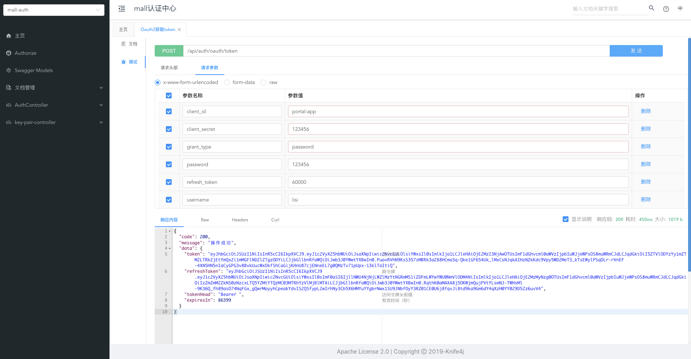

在 Zipkin 就可以看到刚才我们调用接口的链路数据了，它分别涉及了四个组件。

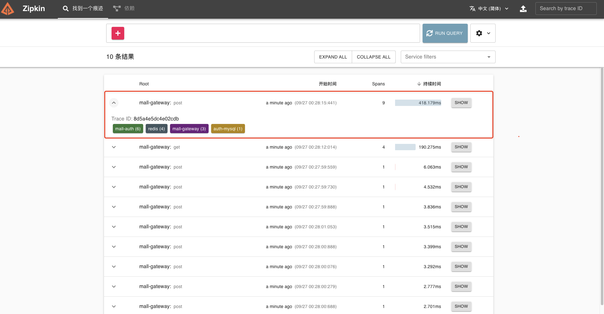

我们点开该链路，可以看到一个 Trace 明细。

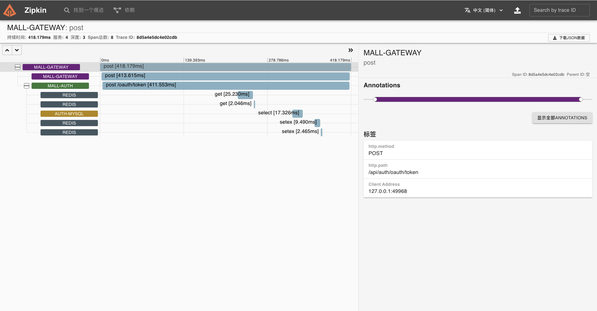

同样，我们也可以查看拓扑关系。

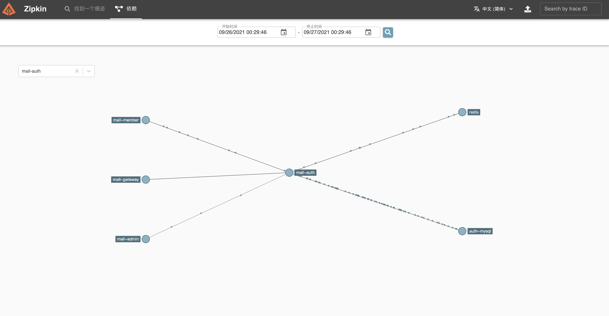

* mall-member

mall-member 是我们的会员服务，这里以核心接口【会员登录】为例，梳理一下它涉及到的组件。

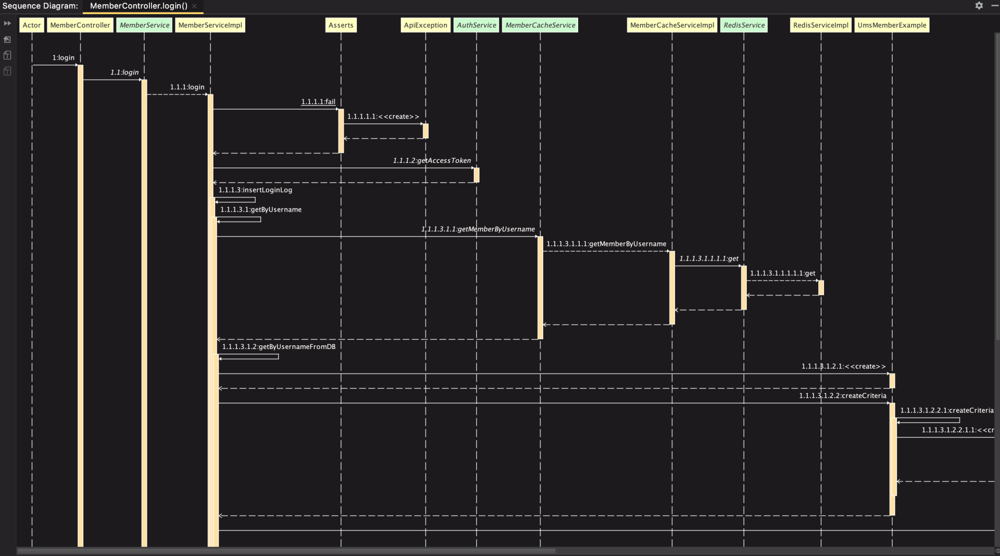

通过分析代码调用链，我们知道它主要涉及 MySQL、Redis、MongoDB 等组件。

所以我们只需要在 pom.xml 文件引入相关依赖即可。

```
       <!--添加 Sleuth 依赖 -->
            <dependency>
                <groupId>org.springframework.cloud</groupId>
                <artifactId>spring-cloud-starter-sleuth</artifactId>
            </dependency>
            <!--Zipkin 客户端-->
            <dependency>
                <groupId>org.springframework.cloud</groupId>
                <artifactId>spring-cloud-starter-zipkin</artifactId>
            </dependency>
            <!-- Brave 对 MySQL8 的支持 -->
            <dependency>
                <groupId>io.zipkin.brave</groupId>
                <artifactId>brave-instrumentation-mysql8</artifactId>
            </dependency>
            <!--添加 brave mongodb 依赖 -->
            <dependency>
                <groupId>io.zipkin.brave</groupId>
                <artifactId>brave-instrumentation-mongodb</artifactId>
                <version>5.13.3</version>
            </dependency>
            <!--  Brave 对 Opentracing 的实现 -->
            <dependency>
                <groupId>io.opentracing.brave</groupId>
                <artifactId>brave-opentracing</artifactId>
                <version>0.35.0</version>
            </dependency>
            <!-- Opentracing 对 Redis 的支持 -->
            <dependency>
                <groupId>io.opentracing.contrib</groupId>
                <artifactId>opentracing-redis-jedis3</artifactId>
                <version>0.1.16</version>
            </dependency>
            <dependency>
                <groupId>io.opentracing.contrib</groupId>
                <artifactId>opentracing-redis-spring-data</artifactId>
                <version>0.1.16</version>
            </dependency>
    

```

同时，要在 config 下新增两个配置类。

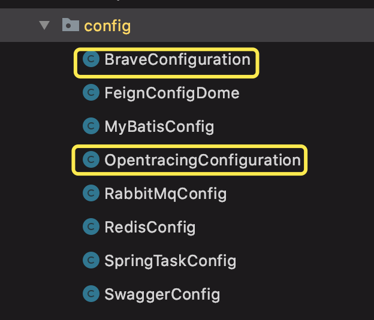

BraveConfiguration 为 MongoDB 链路追踪配置类，OpentracingConfiguration 为 Redis 组件链路追踪配置类。

启动应用后，我们使用 API 文档测试【会员登录】接口，尝试追踪该链路。

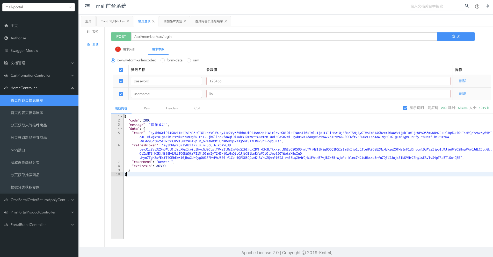

在 Zipkin 中可以看到刚才我们调用接口的链路数据，它分别涉及了五个组件。

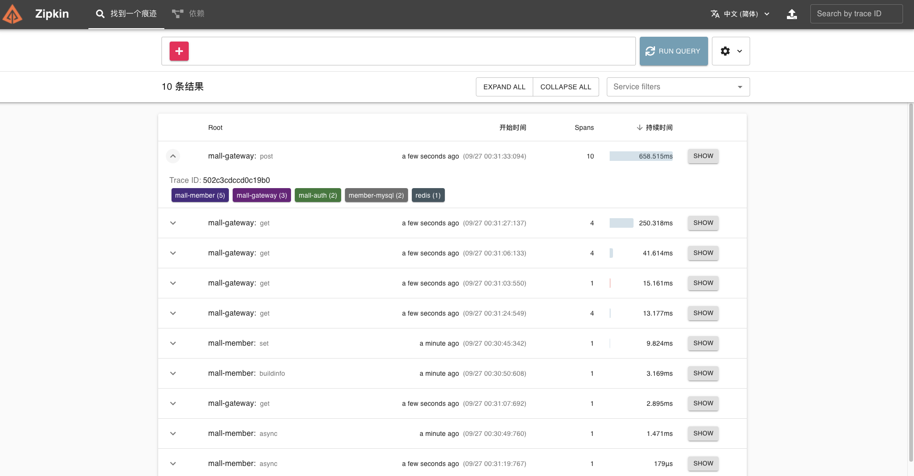

我们点开这条链路，可以看到 Trace 明细。

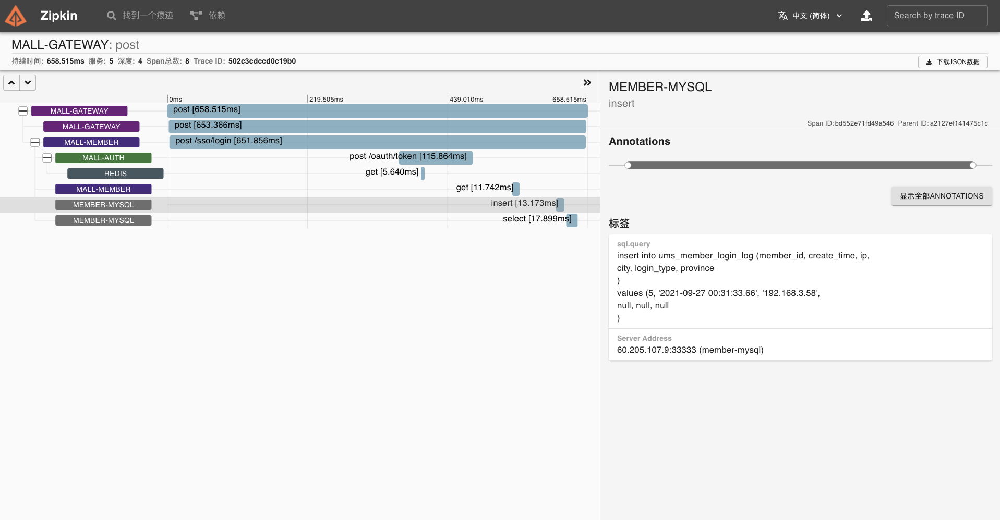

也可以查找依赖，看到拓扑关系。

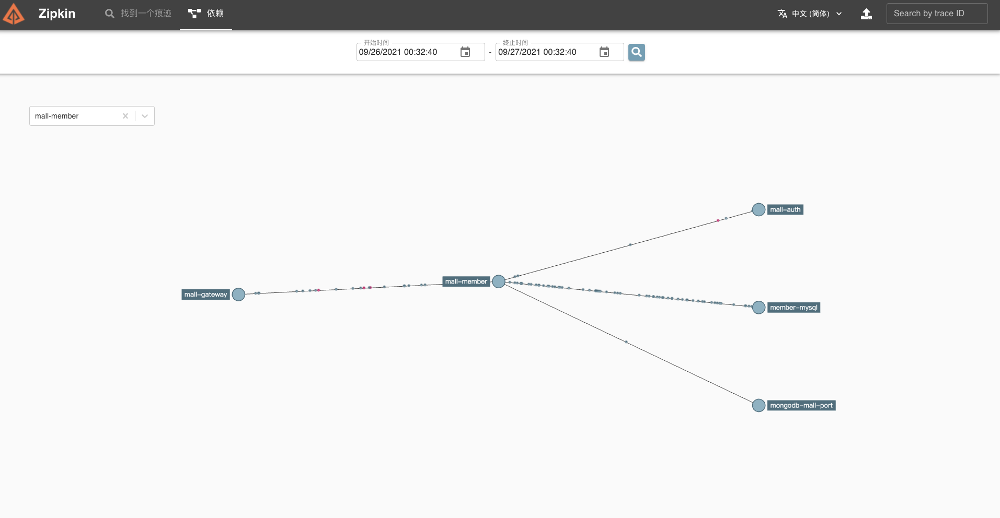

接着我们使用 API 文档测试一下【添加品牌关注】接口，尝试追踪该链路。

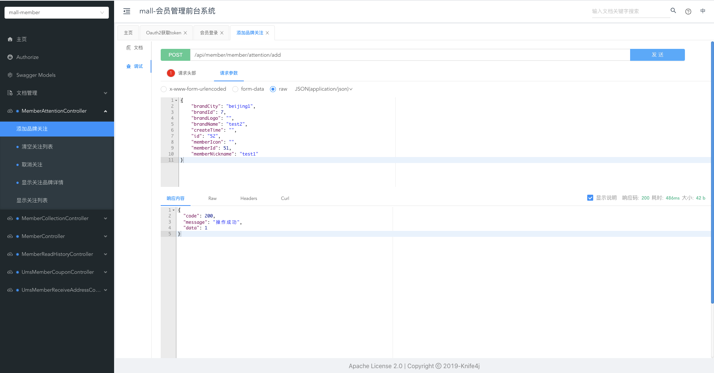

在 Zipkin 可以看到刚才我们调用接口的链路数据，它分别涉及了三个组件。

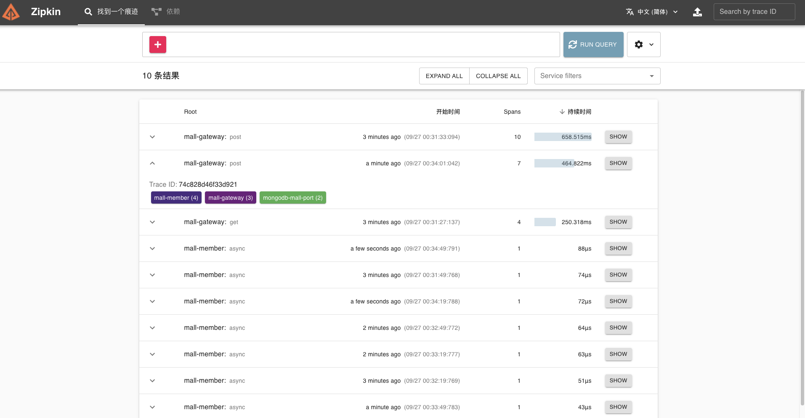

我们点开这条链路，也可以看到详细的 Trace 明细。

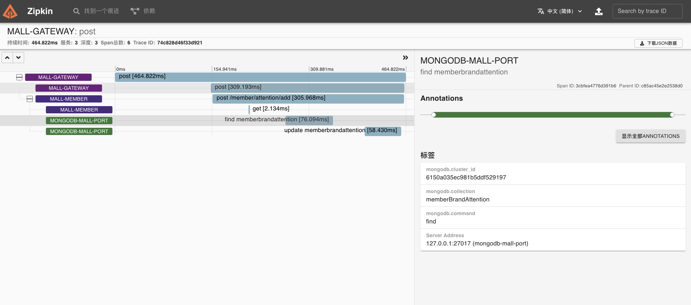

### Zipkin 改造

改造完服务后，我们还有一个需求，那就是对 Zipkin 生产环境的功能增强。也就是说， 我们这里将链路日志推送到 Kafka，然后启动 Zipkin Server 聚合日志，监听 Kafka ，如果有新的消息则进行拉取存入到 ElasticSeach，最后再用 Zipkin UI 展示链路过程。

这里的改造大概分为两个部分：

* 将链路日志数据写入 Kafka 进行削峰；
* Kafka 写入 Zipkin Server 进行聚合并存储。

第一步，我们需要在各个服务引入 Kafka 依赖。

```
      <!-- 引入 Spring Cloud Stream Kafka-->
            <dependency>
                <groupId>org.springframework.cloud</groupId>
                <artifactId>spring-cloud-starter-stream-kafka</artifactId>
            </dependency>
    

```

​第二步，修改 bootstrap.yml 配置文件，增加 Kafka 系列配置。

```
    spring:
      zipkin: #设置zipkin服务端地址
        sender:
          type: kafka  #指定发送到kafka,还可以指定Rabbit、Web
        service:
          name: ${spring.application.name} #Zipkin链路日志中收集的服务名称
        kafka:
          topic: zipkin
      kafka:
        bootstrap-servers: kafka:9092 #Kubernetes中Kakfa地址,当然也可以指定Kubernetes集群外的Kafk
    

```

第三步，Zipkin 安装时增加 Storage 参数，比如 Docker 安装可以参考我给出的命令。

```
    docker run -it -d --restart=always -e KAFKA_BOOTSTRAP_SERVERS=192.168.3.58:9092 -e STORAGE_TYPE=elasticsearch -e ES_HOSTS=http://192.168.3.58:9200 -p 9411:9411  openzipkin/zipkin
    

```

第四步，在 Kafka Manager 验证一下 Topic 情况。

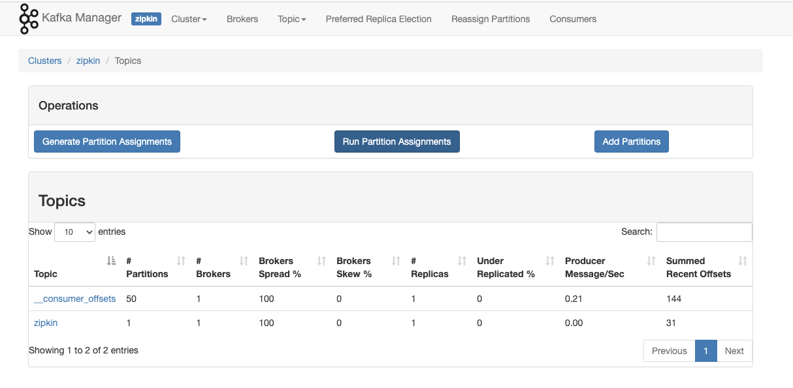

最后，我们使用 ES Head 客户端插件查询一下链路日志。

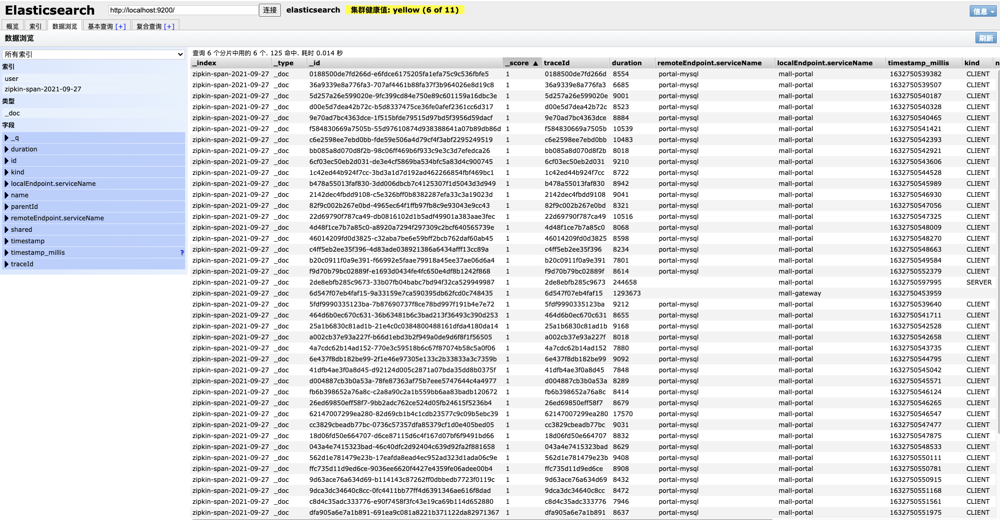

可以看到，链路追踪数据已经成功保存了。

## 总结

好了，这节课的内容到这里就全部讲完了。

刚才，我们进行了 demo 预演和系统实战，演示了如何在微服务项目中集成 Sleuth + Zipkin 落地链路追踪，希望能够给你一些启发。

这里有几个重点我们再一起回顾一下：

* 在 [Brave](https://github.com/openzipkin/brave) 库，常见的 Spring Cloud Gateway、SpringMVC、Fegin、Logback、MongoDB、MySQL、RabbitMQ 等组件均已默认支持；
* 目前 Brave 支持通过三种插件实现 MySQL 链路追踪，具体需要适配 MySQL 驱动版本；
* 目前 Brave 暂未支持 Jedis 客户端的方式，所以我们可以考虑替代用 OpenTracing 的方式；
* 从经验性角度，前置 kafka，一方面作为队列和缓冲，另一方面提供了统一的入口渠道，通过将链路日志数据写入 Kafka 进行削峰，再由 Kafka 写入 Zipkin Server 进行聚合，所以较适合数据量大、服务多的环境。

链路追踪现如今已成为微服务架构性能监控的标配，如何去选型并结合系统本身的特点做到成功的改造是不容易的。希望你可以动手实践起来，因为只有实践才是检验真理的唯一标准。

## 思考题

在课程的最后，我还是照例给你留两道思考题：

1.  你觉得使用 Brave SDK，手动埋点生成 Trace 的难点在哪里？为什么？
2.  在生产环境中为什么考虑把链路追踪日志先推送到 Kafka 消息队列？

欢迎你在留言区和我交流讨论，我们下节课见！