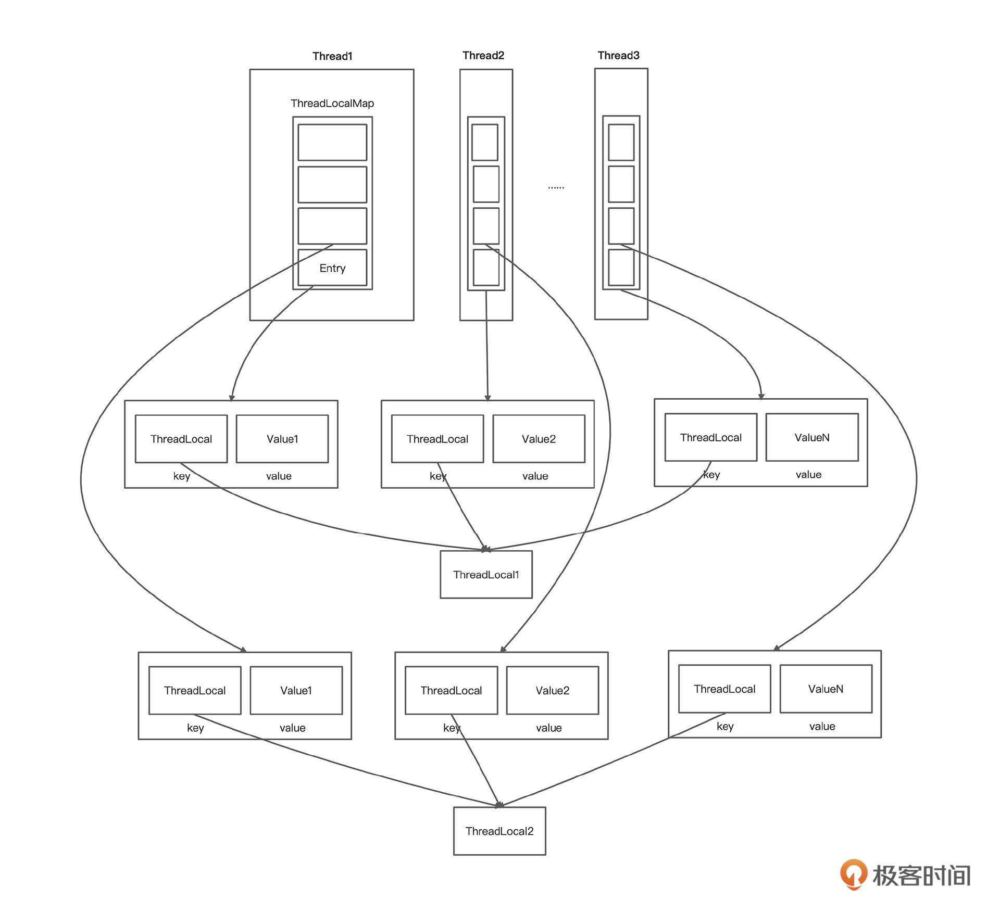
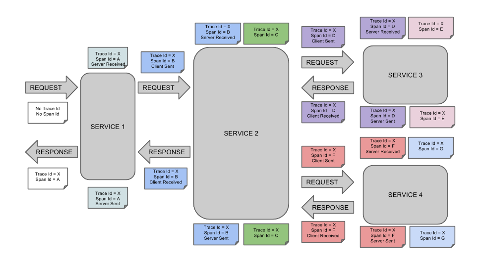
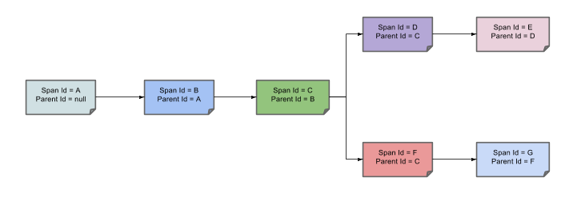
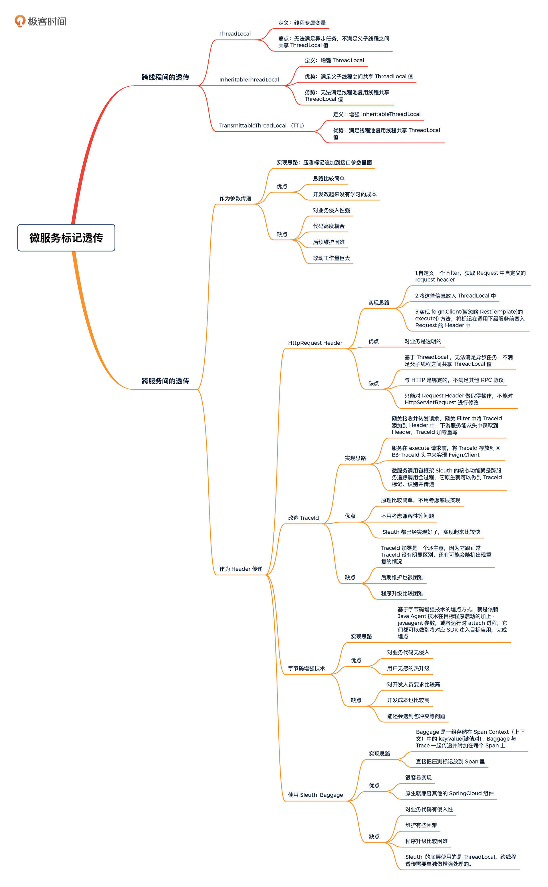

---
date: "2019-06-23"
---  
      
# 13 | 标记透传：微服务系统如何做标记透传方案选型？
你好，我是高楼。

接下来的两节课，我们会详细讲讲标记透传。这节课呢，我会带你看看，在微服务系统中如何对标记透传方案进行选型。下节课我们会进入实战，讲解如何基于微服务技术进行标记透传的落地。

在微服务系统中，服务之间可以通过各种方式和协议进行通信，而且一般链路都很长。在全链路压测的系统中，线上压测要保证压测安全且可控，不会对真实用户产生影响，也不会对线上环境造成数据的污染，我们首要解决的就是压测标记在整条链路中透传和识别的问题。

分布式系统的压测流量透传主要包含两大方面：

* **跨线程间的透传：**能够做到跨线程间对压测标记进行传递，同时可以兼容不同的协议类型，支持对标记的存取操作；
* **跨服务间的透传：**能够通过网络在上下游服务间进行标记传递，有点像“击鼓传花”的感觉，而且可以做到全链路双向传递。

接下来，我们分别看看这两大方面都有哪些可供选择的标记透传方案。

## 跨线程间的透传

我们先来看下跨线程间的透传。对于涉及多线程调用的服务来说，一个重点就是要保证压测标识在跨线程的情况下不丢失。

这个时候，我们就不得不提到本地线程专属变量 ThreadLocal 了。ThreadLocal 能够提供线程局部专属变量，这些变量和普通变量的不同之处在于，我们访问的每个变量\(通过 Get 或 Set 的方法\)的线程都有独立初始化的变量副本。ThreadLocal将状态与线程关联起来的私有静态字段\(例如Request ID 或 TraceID\)保存起来。

<!-- [[[read_end]]] -->

我们通过这张图片快速了解下 ThreadLocal 的内部存储结构。



在这张图里，我们可以看到 ThreadLocal 的存储结构是这样的：

* 每个 Thread 维护一个 ThreadLocalMap 映射表，这个映射表的 key 是 ThreadLocal 实例本身，value 是真正需要存储的 Object；
* ThreadLocal 本身并不存储值，它只是作为一个 key 来让线程从 ThreadLocalMap 中获取 value；
* ThreadLocal 能在每个线程间进行隔离，这主要是靠在每个 Thread 对象中维护一个 ThreadLocalMap 来实现的。

虽然 ThreadLocal 能够提供线程局部专属变量，但也有它的局限性，那就是它无法在父子线程之间传递。

你可以参考一下我给出的代码。

```
    package com.dunshan.threadlocaldemo.demo;
    
    /**
     * @author: dunshan
     * @date: 2021-4-2 13:13
     */
    
    public class ThreadLocalDemo {
        private static final ThreadLocal<Integer> flagThreadLocal = new ThreadLocal<>();
        public static void main(String[] args) {
            Integer flagId = new Integer(5);
            ThreadLocalDemo threadLocalExample = new ThreadLocalDemo();
            threadLocalExample.setRequestId(flagId);
        }
    
        public void setRequestId(Integer flagId) {
            flagThreadLocal.set(flagId);
            doRun();
        }
    
        public void doRun() {
            System.out.println("首先打印 flagId:" + flagThreadLocal.get());
            (new Thread(new Runnable() {
                @Override
                public void run() {
                    System.out.println("子线程启动");
                    System.out.println("在子线程中访问 flagId:" + flagThreadLocal.get());
                }
            })).start();
        }
    }
    

```

在代码中你可以看到，我在 doRun 方法中又启动了一个子线程来执行业务\(模拟异步处理\)。

运行结果如下：

```
    首先打印 flagId:5
    子线程启动
    在子线程中访问 flagId:null
    

```

从运行结果中也能看出来，在子线程中是不能获取父线程中的变量值的。就像前面分析存储原理时提到的，因为子线程拥有自己的 ThreadLocalMap，所以不能获取父线程 ThreadLocalMap 中的值。

但是在实际业务中呢，很多业务都是需要异步操作的，所以我们需要父子线程能够直接共享 ThreadLocal 中的值。怎么解决这个问题呢？

这个时候，我们可以考虑引入另外一个线程对象 **InheritableThreadLocal**。

我们通过下面这段代码，看看它是怎么实现父子线程之间共享 ThreadLocal 值的。

```
    package com.dunshan.threadlocaldemo.demo;
    
    /**
     * @author: dunshan
     * @date: 2021-4-2 13:13
     */
    
    public class InheritableThreadLocalDemo {
        private static final InheritableThreadLocal<Integer> flagThreadLocal = new InheritableThreadLocal<>();
        public static void main(String[] args) {
            Integer flagId = new Integer(5);
            InheritableThreadLocalDemo threadLocalExample = new InheritableThreadLocalDemo();
            threadLocalExample.setRequestId(flagId);
        }
    
        public void setRequestId(Integer flagId) {
            flagThreadLocal.set(flagId);
            doBussiness();
        }
    
        public void doRun() {
            System.out.println("首先打印 flagId:" + flagThreadLocal.get());
            (new Thread(new Runnable() {
                @Override
                public void run() {
                    System.out.println("子线程启动");
                    System.out.println("在子线程中访问 flagId:" + flagThreadLocal.get());
                }
            })).start();
        }
    }
    

```

运行结果如下：

```
    首先打印 flagId:5
    子线程启动
    在子线程中访问 flagId:5
    

```

从运行结果可以看出，子线程成功获取到了父线程 ThreadLocal 的值，这样也就解决了父子线程值传递的问题。  
不过，在大部分业务场景下，业务应用不可能每一个异步请求都要 new 一个单独的子线程来处理，这样会导致内存被撑爆。所以，通常情况下，我们还会使用到线程池，而线程池中又存在线程复用的情况。假设线程池复用线程变量值，就会导致父子线程变量复制混乱。

你可以看下这段示例代码：

```
    package com.dunshan.threadlocaldemo.demo;
    
    import java.util.concurrent.ExecutorService;
    import java.util.concurrent.Executors;
    
    /**
     * 演示 InheritableThreadLocal 的缺陷
     * @author: dunshan
     * @date: 2020-4-4
     */
    
    public class InheritableThreadLocalWeaknessDemo {
    
        private static final InheritableThreadLocal<Integer> INHERITABLE_THREAD_LOCAL = new InheritableThreadLocal<>();
        //模拟业务线程池
        private static final ExecutorService threadPool = Executors.newFixedThreadPool(5);
    
        public static void main(String[] args) throws InterruptedException {
            //模拟同时 10 个 web 请求，一个请求一个线程
            for (int i = 0; i < 10; i++) {
                new TomcatThread(i).start();
            }
    
            Thread.sleep(3000);
            threadPool.shutdown();
        }
    
        static class TomcatThread extends Thread{
            //线程下标
            int index;
    
            public TomcatThread(int index) {
                this.index = index;
            }
    
            @Override
            public void run() {
                String parentThreadName = Thread.currentThread().getName();
                //父线程中将 index 值塞入线程上下文变量
                System.out.println( parentThreadName+ ":" + index);
                INHERITABLE_THREAD_LOCAL.set(index);
    
                threadPool.submit(new BusinessThread(parentThreadName));
            }
        }
    
        static class BusinessThread implements Runnable{
            //父进程名称
            private String parentThreadName;
    
            public BusinessThread(String parentThreadName) {
                this.parentThreadName = parentThreadName;
            }
    
            @Override
            public void run() {
                System.out.println("parent:"+parentThreadName+":"+INHERITABLE_THREAD_LOCAL.get());
            }
        }
    }
    

```

这段代码模拟了同时有 10 个 web 请求（启动 10 个线程），每个线程内部都向线程池中提交一个异步任务的情况。

运行结果：

```
    Thread-1:1
    Thread-4:4
    Thread-5:5
    Thread-6:6
    Thread-7:7
    Thread-8:8
    Thread-9:9
    parent:Thread-1:1
    parent:Thread-0:0
    parent:Thread-4:4
    parent:Thread-3:0
    parent:Thread-8:1
    parent:Thread-7:7
    parent:Thread-9:0
    parent:Thread-2:2
    parent:Thread-5:4
    parent:Thread-6:1
    

```

在运行结果中我们也能看到，子线程中输出的父线程名称和它们下标的 index 无法一一对应，在子线程中出现了线程本地变量混乱的现象。在全链路压测中，出现这种情况是致命的。

那我们要怎么解决这个问题呢？

当然你可以实现自己的工具类，将要传递的变量封装到对象里，在启动子线程时将对象传递进去，这样子线程就可以拿到父线程的变量了。

我们这里选择的是 [TransmittableThreadLocal](https://github.com/alibaba/transmittable-thread-local) （TTL）。

TransmittableThreadLocal 是阿里开源的一个增强 InheritableThreadLocal 的库，能够很好地解决使用线程池在线程之间复制值混乱的问题。

接下来，我们一起验证一下， TransmittableThreadLocal 是不是真的能解决上面的问题。

首先需要引包：

```
    <dependency>
         <groupId>com.alibaba</groupId>
         <artifactId>transmittable-thread-local</artifactId>
         <version>2.12.0</version>
     </dependency>
    

```

示例代码如下：

```
    package com.dunshan.threadlocaldemo.demo;
    
    import com.alibaba.ttl.TransmittableThreadLocal;
    import com.alibaba.ttl.TtlRunnable;
    import java.util.concurrent.ExecutorService;
    import java.util.concurrent.Executors;
    
    /**
     * @author: dunshan
     * @date: 2021-4-2 13:13
     */
    
    public class TransmittableThreadLocalDemo {
    
        private static final TransmittableThreadLocal<Integer> INHERITABLE_THREAD_LOCAL = new TransmittableThreadLocal<>();
        //模拟业务线程池
        private static final ExecutorService threadPool = Executors.newFixedThreadPool(5);
    
        public static void main(String[] args) throws InterruptedException {
            //模拟同时 10 个 web 请求，一个请求一个线程
            for (int i = 0; i < 10; i++) {
                new TomcatThread(i).start();
            }
    
            Thread.sleep(3000);
            threadPool.shutdown();
        }
    
        static class TomcatThread extends Thread{
            //线程下标
            int index;
    
            public TomcatThread(int index) {
                this.index = index;
            }
    
            @Override
            public void run() {
                String parentThreadName = Thread.currentThread().getName();
                //父线程中将 index 值塞入线程上下文变量
                System.out.println( parentThreadName+ ":" + index);
                INHERITABLE_THREAD_LOCAL.set(index);
    
                threadPool.submit(TtlRunnable.get(new BusinessThread(parentThreadName)));
            }
        }
    
        static class BusinessThread implements Runnable{
            //父进程名称
            private String parentThreadName;
    
            public BusinessThread(String parentThreadName) {
                this.parentThreadName = parentThreadName;
            }
    
            @Override
            public void run() {
                System.out.println("parent:"+parentThreadName+":"+INHERITABLE_THREAD_LOCAL.get());
            }
        }
    }
    

```

运行结果如下：

```
    Thread-1:0
    Thread-3:2
    Thread-2:1
    Thread-4:3
    Thread-5:4
    Thread-6:5
    Thread-7:6
    Thread-8:7
    Thread-9:8
    Thread-10:9
    parent:Thread-5:4
    parent:Thread-2:1
    parent:Thread-6:5
    parent:Thread-10:9
    parent:Thread-8:7
    parent:Thread-1:0
    parent:Thread-7:6
    parent:Thread-3:2
    parent:Thread-9:8
    parent:Thread-4:3
    

```

我们可以看到，子线程中输出的内容和父线程一致，**没有出现线程变量复制混乱的情况**。

通过刚才的学习，我们能够知道，在跨线程间透传的场景下，使用 ThreadLocal 库友好地解决了线程专属变量的问题，但是它还不能真正解决父子线程值传递丢失的问题，于是 JDK 又引入了 InheritableThreadLocal 对象。然后呢，这又引出了下一个问题，那就是涉及到线程池等复用线程场景时，还是会存在变量复制混乱的缺陷。我们的解决方案是，在全链路压测标记透传改造方案中直接引入 TransmittableThreadLocal 来增强 InheritableThreadLocal 对象。

虽然跨线程间透传的过程有点复杂，我们也看到了，问题一个接着一个，但这些问题都被我们很好地解决了。压测标识在跨线程的情况下始终保持不丢失，我们的目的就达到了。

## 跨服务间的透传

好了，讲完了跨线程间的透传，我们再来看下跨服务间的透传有哪些可供选择的方案。

跨服务透传的方案有很多，其中，基于 HTTP 请求的数据传递类型主要有两种：一、作为参数传递；二、作为 Header 传递。

而作为 Header 传递的类型，细分下来大概有下面这四种方案：

* 放入 HttpRequest Header
* 改造 TraceId
* 使用字节码增强技术
* 使用 Sleuth Baggage

下面，我们就来仔细说一说这几种方案。

#### 方案一：作为接口参数

实现思路就是把压测标记追加到接口参数里面。这样做的优点是思路比较简单，开发改起来也没有学习的成本。但缺点还是比较明显的：对业务侵入性强，代码高度耦合，后续维护会有一定困难，如果我们想要增加一个参数，那么所有的接口都需要跟着改动，工作量很大。

#### 方案二：放入 HttpRequest Header

我们都知道现在的微服务结构大部分情况下都是通过 HTTP 调用的，所以说， HTTP Header 好像天生就是做标记透传载体的料。

一般我们的实现思路是：先自定义一个 Filter，获取 Request 中自定义的 request header。然后将这些信息放入 ThreadLocal 中。最后实现 feign.Client\(暂时忽略 RestTemplate\)的 execute\(\) 方法，在调用下级服务前把标记塞入 Request 的 Header 中。

我们可以通过 Spring 提供的方法从任意地方获取 HttpServletRequest 里的 Header，当然了，因为我们使用了ThreadLocal，所以上述操作要保证在同一线程中。

```
     ServletRequestAttributes requestAttributes = (ServletRequestAttributes) RequestContextHolder
                    .getRequestAttributes();
            HttpServletRequest request = requestAttributes.getRequest();
            //获取头标记
            String header = request.getHeader("headerKey");
    

```

这种方式的优点是显而易见的，因为它对业务是透明的。

但缺点也比较多，比如链路中有父子线程的话，我们就没有办法从 RequestContextHolder 中拿到标记信息了。同时， Request Header 和 HTTP 是绑定的，就算大部分业务都在用 HTTP 协议进行交互，总还是有些应用会使用 TCP 协议的 RPC 框架，比方说 Thrift、Dubbo等，这时候，这个方案就不适用了。

除此之外，还有许多应用间使用消息队列来做异步任务的情况，它们也希望做到标记透传。另外，大多数情况下，利用这个方案我们只能对 Request Header 做取得操作，而不能对 HttpServletRequest 进行修改。

所以说，如果使用这个方案的话，这些问题都需要考虑到，做到根据项目的实际需求灵活选择，切不可蒙头转向干活，到最后发现方案满足不了要求又推翻返工。

#### 方案三：改造 TraceId

分布式系统中的服务调用链路追踪在理论上并不复杂，它有两个关键点，一个是为请求链路创建唯一的追踪标识，二是统计各个处理单元的延迟时间。

主要实现原理如下图：



在[这张图](https://docs.spring.io/spring-cloud-sleuth/docs/2.2.8.RELEASE/reference/html/#propagating-extra-fields)中，每个颜色的注解表明一个 Span\(总计 7 个 Span，从 A 到 G \)，如果注解显示：Trace Id = X；Span Id = D；Client Sent。这就表明当前 Span 将 Trace Id 设置为了 X，将 Span Id 设置为了 D，同时它还表明了 Client Sent（客户端发起一个请求）事件。

我们将这些 Span 的关系（Parent/Child）图形化：



从这张图中我们可以看到，一次链路调用 TraceId 作为唯一的请求 ID，而 Span 标识了各节点发起的请求信息，最后各个子 Span 通过 Parent Id 与父 Span 关联起来。

那么 Sleuth 在服务内部是如何对TraceId进行处理的呢？

下面是一个使用多 Header 的 HTTP 请求传递流程图:

```
       Client Tracer                                                  Server Tracer     
    ┌───────────────────────┐                                       ┌───────────────────────┐
    │                       │                                       │                       │
    │   TraceContext        │          Http Request Headers         │   TraceContext        │
    │ ┌───────────────────┐ │         ┌───────────────────┐         │ ┌───────────────────┐ │
    │ │ TraceId           │ │         │ X-B3-TraceId      │         │ │ TraceId           │ │
    │ │                   │ │         │                   │         │ │                   │ │
    │ │ ParentSpanId      │ │ Inject  │ X-B3-ParentSpanId │ Extract │ │ ParentSpanId      │ │
    │ │                   ├─┼────────>│                   ├─────────┼>│                   │ │
    │ │ SpanId            │ │         │ X-B3-SpanId       │         │ │ SpanId            │ │
    │ │                   │ │         │                   │         │ │                   │ │
    │ │ Sampling decision │ │         │ X-B3-Sampled      │         │ │ Sampling decision │ │
    │ └───────────────────┘ │         └───────────────────┘         │ └───────────────────┘ │
    │                       │                                       │                       │
    └───────────────────────┘                                       └───────────────────────┘
    

```

在这张图中，Sleuth 通过 Filter 对 Header 进行处理，先检测 Header 中是否存在 “X-B3-TraceId” 标识，如果存在就传入新的 TraceId，如果不存在就生成新的值。

我们再来看下，在跨服务过程中 Sleuth 具体是如何处理 TraceId 的？

首先网关接收请求后，TraceWebFilterr 中将 TraceId 添加到 Header 中，以便所转发的请求对应的服务能从头中获取到 Header。同时网关还将 TraceId 放到 MDC \(Mapped Diagnostic Context\)中，以便应用在输出日志时携带 TraceId。

然后，服务在 execute 请求前，Sleuth 将 TraceId 存放到 X-B3-TraceId 头中来实现 Feign.Client（具体参见 [TraceFeignClient](https://github.com/vaquarkhan/spring-cloud-sleuth-Zipkins/blob/master/spring-cloud-sleuth-core/src/main/java/org/springframework/cloud/sleuth/instrument/web/client/feign/TraceFeignClient.java) ），具体的步骤是：

* 用 Sleuth 创建 TraceFilter，对所有的网络请求进行拦截，如果请求的 Header 中没有 Span 信息，那就创建 Span 对象，生成 Span id、Trace id 等。如果 Header 中有Span信息，就直接使用 Header 中的数据创建 Span 对象，之后将 Span id、Trace id 设置到 MDC 中。
* 当使用 RestTemplate 发送请求时，RestTemplate 和 Interceptor Injector 会拦截请求。我们可以将新生成的 Span id、Trace id 等信息设置到请求的 Header 中，这样服务端收到请求后就可以从 Header 中解析出 Span 信息了。

其他场景的执行原理都是差不多的，这里就不多介绍了 。

我们看到，微服务调用链框架 [Sleuth](https://github.com/spring-cloud/spring-cloud-sleuth.git) 的核心功能就是跨服务追踪调用全过程，它原生就可以对Traceld进行标记、识别并传递。所以，我们可以复用 Sleuth 的相关功能同时顺带修改 Sleuth 源码，将 TraceId 识别并改造后一起往下游服务透传。

讲完了原理，我们再来看下具体如何改造 TraceId。首先我们需要了解下 TraceId 的组成结构。

比如下面这个示例。

```
    X-B3-TraceId: 80f198ee56343ba864fe8b2a57d3eff7
    X-B3-ParentSpanId: 05e3ac9a4f6e3b90
    X-B3-SpanId: e457b5a2e4d86bd1
    X-B3-Sampled: 1
    

```

可以看到，在 Header 中有 4 个属性：

* X-B3-SpanId：一次链路调用唯一 ID（可以是 RPC，DB 等，没有特定的限制）；
* X-B3-ParentSpanId：上层服务的调用 Span\_ID，最上层服务 Parent\_ID 为 null；
* X-B3-TraceId：用于标示一次完整且唯一的请求 ID，一般为 64 位或 128 位的数字；
* X-B3-Sampled：是否被抽样为输出的标志，1 为需要被输出，0 为不需要被输出。

所以，做 TraceId 改造我们可以这样考虑，如果是正常标记，则是以 1 开头，后面全为零。

```
    “b3”、“1000000000000000e457b5a2e4d86bd1-e457b5a2e4d86bd1”
    

```

如果是压测标记，那就全部是以 2 开头，后面全为零。

```
    “b3”、“2000000000000000e457b5a2e4d86bd1-e457b5a2e4d86bd1”
    

```

你可以使用符合 TraceId 格式的数字，只要有效就可以了。  
到这里，我们已经解决了获取标记的技术问题，通常的做法就是实现一个 Filter 就行了，而后面就是重写 TraceId 并传递给下游服务。

在 Sleuth 2.2中， 我们可以这样实现：

```
    @Bean 
    ExtraFieldPropagation.Factory customPropagationFactory() {
      return ExtraFieldPropagation.newFactory(
          CustomTraceIdPropagation.create(B3Propagation.FACTORY, "my_trace_id"));
    }
    

```

在 Sleuth 3.0中， 我们可以这样实现：

```
    @Bean 
    BaggagePropagation.Factory customPropagationFactory() {
      return BaggagePropagation.newFactory(
          CustomTraceIdPropagation.create(B3Propagation.FACTORY, "my_trace_id"));
    }
    

```

这种方式的优点是原理比较简单，不用考虑底层实现，也不用考虑兼容性等问题，因为 Sleuth 都已经实现好了，实现起来比较快。  
但是实际上，TraceId 加零是一个坏主意，因为它跟正常 TraceId 没有明显区别，还有可能会随机出现重复的情况。另外，后期维护也很困难，我们很容易忘了以前修改了哪些地方，移交给别人维护就更加困难了。而且程序升级也比较困难，以后每次 Spring 或者 Sleuth 要升级的时候，都要重新修改源码。

最后，我们放弃了这个方案，主要的原因就是可能会影响现有的正常 TraceId，对我们来说并不是性价比最高的选择。

#### 方案四：使用字节码增强技术

Java 还有一种基于字节码增强技术的埋点方式，就是依赖 Java Agent 技术在目标程序启动时加上 \-javaagent 参数，或者运行时 attach 进程，两种做法都可以做到将对应的 SDK 注入到目标应用，完成埋点。它们整体来说对服务应用是透明的，对业务代码无侵入。

关于字节码的基础知识你可以参考美团的[《字节码增强技术探索》](https://tech.meituan.com/2019/09/05/java-bytecode-enhancement.html)这篇文章，已经讲得很清楚了，我就不多赘述了。

在项目具体落地的过程中，我们可以考虑在框架或中间件层做统一的 SDK Jar 包托管，将 SDK 包直接打入 Base 镜像内，然后，借助 Jar 包容器提供的入口，将封装好的 TransmittableThreadLocal SDK 在应用启动之前完成埋点工作，这样的话，就能够实现应用无感知透传了。

整个 SDK 带起过程你可以参考这张[示意图](https://www.infoq.cn/article/z503AvLZyA0SXJCkY61o)。


这样做的优点是，对业务代码无侵入，可以做到用户无感的热升级；缺点是对开发人员要求比较高，开发成本也比较高，同时，SDK 引入可能还会遇到包冲突等问题。

在实践方面更加具体的例子你可以参考这篇文章：[《JVM 字节码增强技术之 Java Agent 入门》。](https://mp.weixin.qq.com/s/gf8-2DXSNLJ5lhFv7bmN6Q)

#### 方案五：使用 Sleuth Baggage

既然我们可以在程序里获取到 Trace 和 Span 相关信息，那为什么不把信息直接放到 Span 里呢？在 Span 中能放点额外信息，这样就不用自己实现了。事实上，只要 Sleuth 里有 Baggage ，我们确实可以这样做。

Baggage 是一组存储在 Span Context（上下文）中的 key:value（键值对）。Baggage 和 Trace 一起传递并附加在每个 Span 上。Spring Cloud Sleuth 可以识别以 Baggage 为前缀的 Header，消息传递以 baggage\_ 开始。

需要注意的是，Baggage 的数据和大小没有明显的限制，但是太多会拖慢整个系统的性能。

Baggage 跟随 Trace 一起传递\(每个子 Span 都包含父 Span 的 Baggage\)。默认情况下，因为 Zipkin 不知道 Baggage，所以也不接收这些信息。

需要注意的是，从 Sleuth 2.0.0 开始，我们就必须在项目配置中明确传递 baggage keys 的名称了。Tags 会附加到指定的 Span，也就是该标签只在指定的 Span 中呈现。但是，如果包含 Tag 的 Span 存在，我们可以根据 Tag 搜索对应的 Trace。所以说，你如果希望通过 Baggage 查找 Span ，就应该在 root span 中添加相应的 Tag。

比如下面这个例子。

```
    spring.sleuth.baggage-keys=baz,bizarrecase
    spring.sleuth.propagation-keys=foo,upper_case
    initialSpan.tag("foo",ExtraFieldPropagation.get(initialSpan.context(), "foo"));
    initialSpan.tag("UPPER_CASE",ExtraFieldPropagation.get(initialSpan.context(), "UPPER_CASE"));
    

```

这里有关 Baggage 的配置，还有几点需要说明：

* 我们在使用 spring.sleuth.baggage-keys 时，可以设置以 baggage-为前缀的键，用于 HTTP 调用和 baggage- 的消息传递。
* 还可以使用该 spring.sleuth.propagation-keys 属性传递带前缀的键列表，这些键被传播到远程服务而没有任何前缀。
* 另外，还可以使用该 spring.sleuth.local-keys 属性来传递将在本地服务传播但不会通过网络传播的列表键。

使用 Sleuth Baggage 的优点是它很容易实现，而且也支持 RestTemplate 的调用，同时它还原生就兼容其他的 SpringCloud 组件。但它也存在和 Sleuth 一样的缺点，也就是对业务代码有侵入性、维护有些困难，而且程序升级后都要重新修改源码。注意哦，Sleuth 底层使用的是 ThreadLocal，后续在跨线程透传方面我们还是需要单独做增强处理的。

## 总结

好了，这节课就讲到这里。我们刚才一起梳理了标记透传的背景、目标和几种常见的方案，这里我们做个总结。

从标记透传的对象来说，我们主要可以分为两个方面，也就是跨线程间的透传和跨服务间的透传。

跨线程透传主要解决的是线程间的变量复制传递的问题，比如父子线程、线程池复用等场景，最后我们看到 TransmittableThreadLocal （TTL）是 Java 语言一个比较优雅且通用的解决方案。

而跨服务透传主要的方式就是参数传递和 Header 传递，在 Header 传递方案内，有诸如 HttpRequest Header、改造 TraceId、Java Agent、Sleuth Baggage等技术方案，它们都各有特点，各有用场。你可以看看我给你画的这张思维导图，上面有非常详细的概述和总结，希望对你有帮助。



最后，需要强调是，在做具体标记透传技术选型时，我们还是要根据自身项目特点，仔细衡量各各项指标，选择一款适合自己项目的技术方案，技术过于纯粹，适用才是王道。

下一节课，我们进入实践环节，我会通过案例给你演示如何实现标记透传改造。

## 思考题

在课程的最后，我还是照例给你留两道思考题：

1.  除了我上面列出的这些技术方案，你还接触过哪些？
2.  如果是异构系统，说说你对技术方案选型的考虑？

欢迎你在留言区和我交流讨论，我们下节课见！