---
date: "2019-06-23"
---  
      
# 14 | 标记透传：如何基于微服务技术进行标记透传？
你好，我是高楼。

这节课，我们详细讲讲怎样基于微服务技术进行标记透传的落地。

微服务已经成为现在主流的分布式架构了。在微服务架构中，服务之间的调用越来越复杂，问题排查的难度也越来越高，这让链路追踪成为微服务架构的基础设施，甚至可以说是性能分析人员不可缺少的“神兵利器”。

在全链路压测场景中，链路追踪技术需要额外解决的是压测标记的**识别、记录、并传递的**问题。上节课我们讲过，在微服务架构下标记透传需要满足以下两个需求：

* 跨线程间的透传要保证压测标记在跨线程的情况下不丢失，这里面包括异步场景、线程池复用等情况；
* 跨服务间的透传要保证压测标记在跨服务网络调用的情况下不丢失，而且可以做到全链路双向传递，这里面包括服务内异步任务（MQ）、服务内其它基于 TCP 协议的 RPC 框架等情况。

## 方案设计

考虑到我们的电商项目是 Spring Cloud 技术栈，所以我们可以使用 [Spring Cloud Sleuth](https://spring.io/projects/spring-cloud-sleuth) 这一套跨服务间透传的原生方案。但是 Sleuth 在跨线程间透传的实现上底层使用的是 ThreadLocal，而项目又有 MQ 异步透传的需求，所以它并不能完全满足我们标记透传的需求。所以在这里，我们考虑引入**数据上下文**对象来解决这个问题。

<!-- [[[read_end]]] -->

所谓引入数据上下文，就是引入一个能承载压测标记的对象，我们希望它能够兼容不同的应用协议，同时能够支持跨线程间的透传，最重要的是能支持随时存取。所以，我们抽象出一层数据上下文（Context ）对象。

数据上下文逻辑如下图所示：

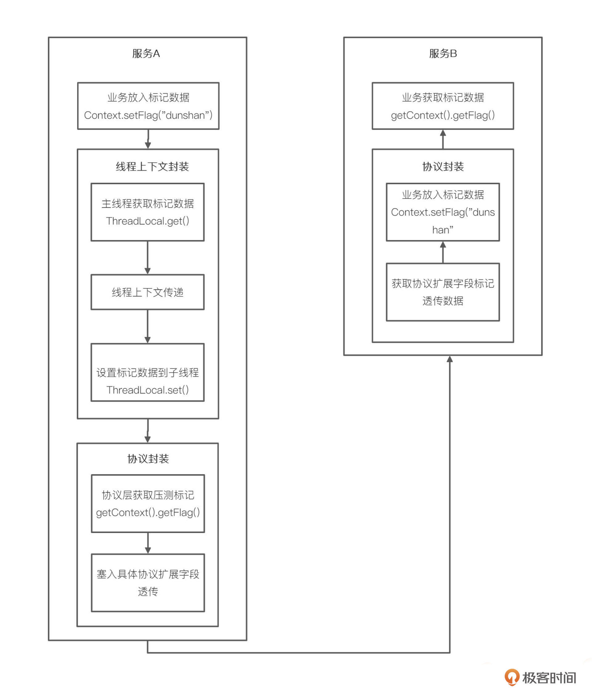

创建数据上下文后，跨线程间的标记透传我们就有了 Transmittable ThreadLocal 对象，这样，我们就可以实现随用随取了，它同时也解决了跨协议标记透传的问题。

至于跨服务间的标记透传，我们考虑把标记数据直接放到 Span Baggage 扩展字段中，这样就不用自己实现了。

你可以看下我画的这张压测标记透传设计图：

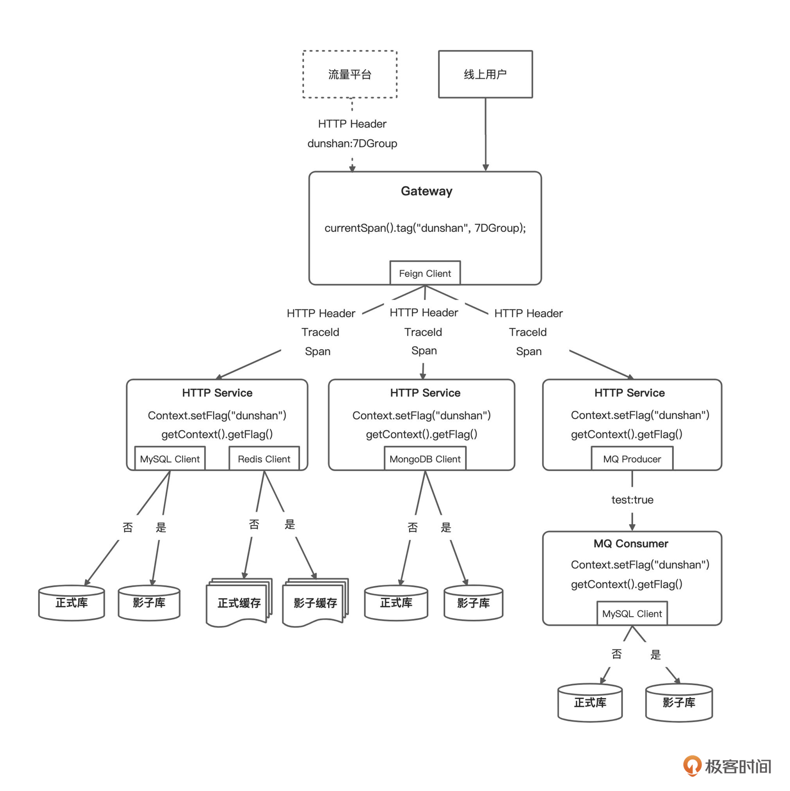

我们可以看到，网关接收请求后，在 Filter 中将压测标记添加到 Span 中，这样，所转发的请求对应的服务就能从 Header 中获取到标记数据了。同时在 Filter 中判断并赋值到 Logback MDC 中，以便应用在输出日志时区分是正常流量还是压测流量。

## 技术预演

为了降低风险呢，我们先在开发环境搭建一个示例微服务项目（参考电商项目）进行链路追踪与标记透技术预演。

针对这个预演方案，我给你画了一张调用关系逻辑图。

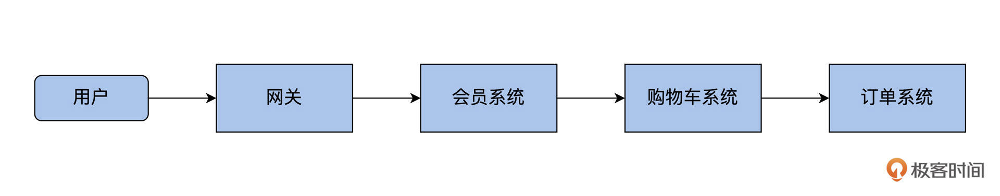

通过分析架构图，可以很清楚地看到，这次 demo 微服务需要搭建的 4 个服务分别是网关、会员、购物车和订单。这 4 个微服务采用 Nacos 做注册中心；但是为了降低 demo 项目难度，我们没有添加数据库操作，只做了一个简单请求；配置中心使用本地做配置，没有采用 Nacos 做配置中心。

下面我们就来具体地看一看，这 4 个微服务是怎么一步一步搭建起来的。

首先，因为我们需要用 Sleuth 与 Zipkin 来完成项目跟踪，所以就要先搭建这两个服务。搭建 Sleuth 和 Zipkin 的方法可以参考我给出的这篇文章《 [Sleuth+Zipkin 实现 Spring Cloud 链路追踪](https://mp.weixin.qq.com/s/7Xqk_1xGlLZom9hkfyW9hg) 》，受到篇幅限制呢，我这里就不展开了。

### 搭建微服务 demo

搭建好 Sleuth 和 Zipkin 之后，我们开始正式搭建微服务 demo。

* 新建父项目 pom 文件

首先，新建空项目，在 pom.xml 加入相关依赖包。

```
    <?xml version="1.0" encoding="UTF-8"?>
    <project xmlns="http://maven.apache.org/POM/4.0.0"
             xmlns:xsi="http://www.w3.org/2001/XMLSchema-instance"
             xsi:schemaLocation="http://maven.apache.org/POM/4.0.0 http://maven.apache.org/xsd/maven-4.0.0.xsd">
        <modelVersion>4.0.0</modelVersion>
        
        <groupId>com.dunshan</groupId>
        <artifactId>springboot-sleuth-zipkin</artifactId>
        <version>1.0-SNAPSHOT</version>
        <modules>
            <module>dunshan-sz-gateway</module>
            <module>dunshan-member</module>
            <module>dunshan-cart</module>
            <module>dunshan-order</module>
            <module>dunshan-common</module>
        </modules>
        <packaging>pom</packaging>
        
        <properties>
            <maven.compiler.source>8</maven.compiler.source>
            <maven.compiler.target>8</maven.compiler.target>
            <spring.boot.version>2.3.0.RELEASE</spring.boot.version>
            <spring.cloud.version>Hoxton.SR5</spring.cloud.version>
            <spring.cloud.alibaba.version>2.2.0.RELEASE</spring.cloud.alibaba.version>
            <zipkin.version>2.2.6.RELEASE</zipkin.version>
            <sleuth.version>2.2.6.RELEASE</sleuth.version>
            <transmittable.version>2.12.1</transmittable.version>
            <swagger.version>2.7.0</swagger.version>
        </properties>
    
          <!--
              引入 Spring Boot、Spring Cloud、Spring Cloud Alibaba 三者 BOM 文件，进行依赖版本的管理，防止不兼容。
           -->
        <dependencyManagement>
            <dependencies>
                <dependency>
                    <groupId>org.springframework.boot</groupId>
                    <artifactId>spring-boot-starter-parent</artifactId>
                    <version>${spring.boot.version}</version>
                    <type>pom</type>
                    <scope>import</scope>
                </dependency>
                <dependency>
                    <groupId>org.springframework.cloud</groupId>
                    <artifactId>spring-cloud-dependencies</artifactId>
                    <version>${spring.cloud.version}</version>
                    <type>pom</type>
                    <scope>import</scope>
                </dependency>
                <dependency>
                    <groupId>com.alibaba.cloud</groupId>
                    <artifactId>spring-cloud-alibaba-dependencies</artifactId>
                    <version>${spring.cloud.alibaba.version}</version>
                    <type>pom</type>
                    <scope>import</scope>
                </dependency>
            </dependencies>
        </dependencyManagement>
        
    </project>
    

```

* 创建网关服务

然后，在网关服务的 pom 文件中添加配置文件，内容包含 Gateway、Nacos、Zipkin、Sleuth 组件，这些内容共同组成网关服务。

```
    <?xml version="1.0" encoding="UTF-8"?>
    <project xmlns="http://maven.apache.org/POM/4.0.0"
             xmlns:xsi="http://www.w3.org/2001/XMLSchema-instance"
             xsi:schemaLocation="http://maven.apache.org/POM/4.0.0 http://maven.apache.org/xsd/maven-4.0.0.xsd">
        <parent>
            <artifactId>dunshan-sleuth-zipkin</artifactId>
            <groupId>com.dunshan</groupId>
            <version>1.0-SNAPSHOT</version>
        </parent>
        <modelVersion>4.0.0</modelVersion>
    
        <artifactId>dunshan-sz-gateway</artifactId>
    
        <properties>
            <maven.compiler.source>8</maven.compiler.source>
            <maven.compiler.target>8</maven.compiler.target>
        </properties>
    
        <dependencies>
            <!-- 引入 Spring Cloud Gateway 相关依赖，使用它作为网关，并实现对其的自动配置 -->
            <dependency>
                <groupId>org.springframework.cloud</groupId>
                <artifactId>spring-cloud-starter-gateway</artifactId>
            </dependency>
            <!--Nacos 客户端 -->
            <dependency>
                <groupId>com.alibaba.cloud</groupId>
                <artifactId>spring-cloud-starter-alibaba-nacos-discovery</artifactId>
            </dependency>
            <!-- 引入 Zipkin 依赖-->
            <dependency>
                <groupId>org.springframework.cloud</groupId>
                <artifactId>spring-cloud-starter-zipkin</artifactId>
            </dependency>
            <!--添加 Sleuth 依赖 -->
            <dependency>
                <groupId>org.springframework.cloud</groupId>
                <artifactId>spring-cloud-starter-sleuth</artifactId>
            </dependency>
        </dependencies>
    
    </project>
    

```

* 创建全局过滤器 Filter

我们知道，Filter 过滤器能过滤所有请求，还能获取请求资源信息。所以，我们在工程中新增一个全局过滤器（ Filter ），这样，它就可以对全部的请求加以过滤和判断了。如果一个标记带有请求，过滤器就能够获取请求中的标记，放入 Span Baggage 扩展字段（Tag）中去，如果这个请求没有标记，就直接返回走正常路径。

你可以参考我给出的代码。

```
    import brave.Tracer;
    import org.slf4j.Logger;
    import org.slf4j.LoggerFactory;
    import org.slf4j.MDC;
    import org.springframework.beans.factory.annotation.Autowired;
    import org.springframework.cloud.gateway.filter.GatewayFilterChain;
    import org.springframework.cloud.gateway.filter.GlobalFilter;
    import org.springframework.http.server.reactive.ServerHttpRequest;
    import org.springframework.stereotype.Component;
    import org.springframework.web.server.ServerWebExchange;
    import reactor.core.publisher.Mono;
    
    /**
     * @author dunshan
     * @description: 网关过滤
     * @date 2021-10-02 14:18:33
     */
     
    @Component
    public class globalTagFilter implements GlobalFilter {
        private final static Logger logger = LoggerFactory.getLogger(globalTagFilter.class);
    
        private Tracer tracer;
        @Autowired
        public void setTracer(Tracer tracer) {
            this.tracer = tracer;
        }
    
        @Override
        public Mono<Void> filter(ServerWebExchange exchange, GatewayFilterChain chain) {
            String dunshan = exchange.getRequest().getHeaders().getFirst("dunshan");
            if (dunshan != null) {
                logger.info("dunshan：" + dunshan);
                tracer.currentSpan().tag("dunshan", dunshan); //透传标签
                ServerHttpRequest request = exchange.getRequest().mutate().header("dunshan", dunshan).build();
                exchange = exchange.mutate().request(request).build();
            }
            return chain.filter(exchange);
        }
    }
    

```

要想实现 GlobalFilter 接口，你可以在 Filter 类中获取标记，把标记赋值给 tracer.currentSpan\(\).tag\(\) 。

* 在 application.yml 中添加配置

在网关服务中的配置文件输入文件内容，内容包含：项目名称、端口号、Sleuth 采集数据比例、Zipkin 服务地址还有其他配置信息。

需要注意的是，propagation-keys 参数需要配置 value，同时，你也可以根据需要配置其他参数，但是为了前后服务调用一致性，这里选择配置为 dunshan 关键字。

```
    server:
      port: 6000
    
    spring:
      application:
        name: dunshan-gateway
      sleuth:
        sampler: #采样器
          probability: 1.0 #采样率，采样率是采集 Trace 的比率，默认 0.1，百分之百采集
          rate: 10000 #每秒数据采集量，最多 n 条/秒 Trace
        propagation:
          tag:
            whitelisted-keys:
              - dunshan
            enabled: true
        propagation-keys:
          - dunshan
        web: # Web 组件的配置项，例如说 SpringMVC
          enabled: true
      zipkin: #设置 zipkin 服务端地址
        base-url: http://127.0.0.1:9411
    
      cloud:
        # Spring Cloud Gateway 配置项，对应 GatewayProperties 类
        nacos:
          discovery:
            server-addr: localhost:8848
            username: nacos
            password: nacos
        gateway:
          discovery:
            locator:
              enabled: true
              lower-case-service-id: true #使用小写 service-id
          # 路由配置项，对应 RouteDefinition 数组
          routes:
            - id: dunshan-member
              uri: lb://dunshan-member
              predicates:
                - Path=/api/member/**
              filters:
                - StripPrefix=2
    

```

完成网关服务配置后，可以启动 Nacos、Zipkin 还有网关服务，这时打开 Nacos，就能看到网关服务了。

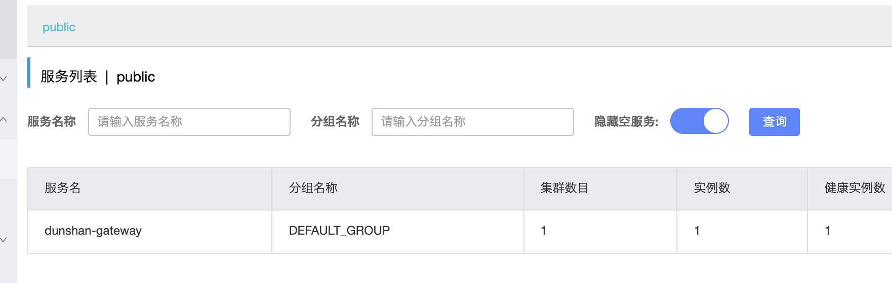

对于整个标记透传过程来说，我们还需要搭建会员系统、购物车系统、订单系统来完成整个链路跟踪预演。

所以接下来，我们就依次搭建和部署一下其他服务。在这里，我用会员服务系统做例子，其他服务的搭建过程是一样的，我就不重复演示了。你只需要注意修改每个服务配置文件中的服务名字和端口号就可以了。

* 新建会员系统

新建 dunshan-member 会员应用系统，在 pom.xml 配置文件中添加如下配置：

```
    <dependencies>
            <!--Spring Web 应用 -->
            <dependency>
                <groupId>org.springframework.boot</groupId>
                <artifactId>spring-boot-starter-web</artifactId>
            </dependency>
            <!--Nacos 客户端 -->
            <dependency>
                <groupId>com.alibaba.cloud</groupId>
                <artifactId>spring-cloud-starter-alibaba-nacos-discovery</artifactId>
            </dependency>
            <!--服务间通信组件 OpenFeign -->
            <dependency>
                <groupId>org.springframework.cloud</groupId>
                <artifactId>spring-cloud-starter-openfeign</artifactId>
                <version>2.2.6.RELEASE</version>
            </dependency>
            <!--添加 Sleuth 依赖 -->
            <dependency>
                <groupId>org.springframework.cloud</groupId>
                <artifactId>spring-cloud-starter-sleuth</artifactId>
                <version>${sleuth.version}</version>
            </dependency>
            <!--Zipkin 客户端-->
            <dependency>
                <groupId>org.springframework.cloud</groupId>
                <artifactId>spring-cloud-starter-zipkin</artifactId>
                <version>${zipkin.version}</version>
            </dependency>
        </dependencies>
    

```

添加依赖包后，在 Controller 控制器下新建 MemberController 类，新建这个类的主要功能是暴露一个 get 接口请求，同时，它还会调用购物车服务接口，会员系统请求资源路径为 /member/uer/\{id\} ，响应为 Object。

```
    package com.member.controller;
    
    import com.member.feign.CartServiceFeignClient;
    import org.springframework.beans.factory.annotation.Autowired;
    import org.springframework.web.bind.annotation.GetMapping;
    import org.springframework.web.bind.annotation.PathVariable;
    import org.springframework.web.bind.annotation.RestController;
    import javax.annotation.Resource;
    import javax.servlet.http.HttpServletRequest;
    import java.util.HashMap;
    
    /**
     * @author dunshan
     * @description: 会员服务 index
     * @date 2021-10-02 14:47:29
     */
     
    @RestController
    public class MemeberController {
        @Resource
        CartServiceFeignClient cartFeignClient;
    
        @Autowired
        HttpServletRequest request;
        @GetMapping("/member/user/{id}")
        public Object memberUser(@PathVariable(value = "id") Integer id) {
            String dunshan = request.getHeader("dunshan");
            String result = cartFeignClient.openCartInfo(id);
            result = "-> dunshan-member" + result;
            HashMap<String, Object> map = new HashMap<>();
            map.put("data", result);
            map.put("dunshan", dunshan);
            return map;
        }
    }
    

```

你可以采用 OpenFeign 来完成会员服务和购物车服务、订单服务之间的调用。

例如，你可以参考我给出的代码，在会员服务中新建 CartServiceFeignClient 来远程调用 Cart 服务。

```
    package com.dunshan.member.feign;
    
    import org.springframework.cloud.openfeign.FeignClient;
    import org.springframework.web.bind.annotation.GetMapping;
    import org.springframework.web.bind.annotation.PathVariable;
    
    /**
     * @author dunshan
     * @description: 购物车 feign
     * @date 2021-10-02 14:45:01
     */
     
    @FeignClient("dunshan-cart")
    public interface CartServiceFeignClient {
    
        @GetMapping("/cart/user/{id}")
        String openCartInfo(@PathVariable(value="id") Integer id);
    
    }
    

```

会员服务系统配置文件如下：

```
    server:
      port: 7000
    spring:
      cloud:
        nacos:
          discovery:
            server-addr: localhost:8848
            username: nacos
            password: nacos
      application:
        name: dunshan-member
      sleuth:
        propagation:
          tag:
            whitelisted-keys:
              - dunshan
            enabled: true
        sampler: #采样器
          probability: 1.0 #采样率，采样率是采集 Trace 的比率，默认 0.1
          rate: 10000 #每秒数据采集量，最多 n 条/秒 Trace
        propagation-keys:
          - dunshan
      zipkin: #设置 zipkin 服务端地址
        base-url: http://127.0.0.1:9411
    logging:
      level:
        root: info #为演示需要，开启 debug 级别日志
    

```

到这里，我们的会员服务系统就建好了。我来总结一下会员服务系统开发的主要步骤：

1.  新建会员服务工程；
2.  在 pom.xml 文件中加入依赖；
3.  在控制层新增 get 请求，把请求数据响应给前端用户。根据 demo 设计思路，这里需要调用购物车接口，所以需要注入购物车接口；
4.  在 Feign 包下新增可以远程调用购物车请求的资源接口；
5.  在 application.yml 配置中添加 Zipkin 服务地址还有其他信息。

上面 5 个步骤完成之后，我们的会员服务系统就开发好了。接下来，我们要重复上面 5 个步骤，把购物车服务和订单服务都搭建起来。

你也可以看一下我们搭建出来的整个项目的截图。

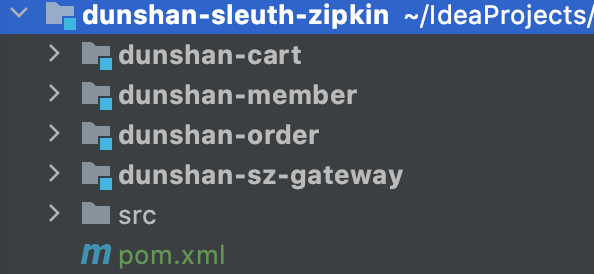

项目搭建好之后，启动项目服务，你就能在 Nacos 中看到全部的服务注册情况了。下面是 Nacos 注册中心显示的服务。

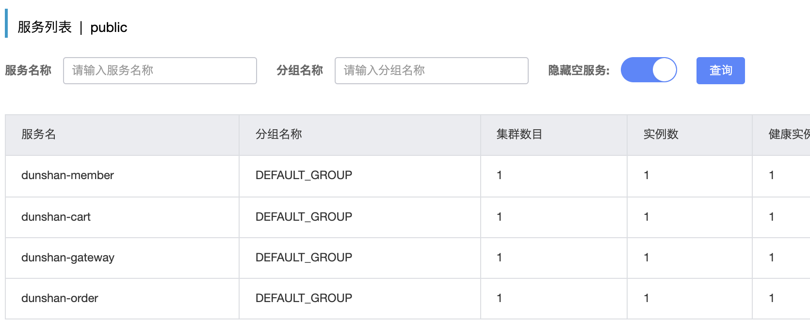

好了，现在我们已经把整个微服务 demo 搭建好了，下面的问题是，要怎么实现它呢？

### 获取压测标记

首先，我们要获取压测标记。

前面我们在网关服务中设计了全局过滤器，只要添加标记到 Span Baggage 就能在每个微服务中使用了。怎么使用呢，下面我用订单服务做个实验：

在网关服务的 Span Context 中设置 Baggage，具体如下：

```
    # 放入
    tracer.currentSpan().tag("dunshan", dunshan); 
    
    # 取出
    BaggageField dunshan = BaggageField.getByName("dunshan");
    

```

如果在下游服务中获取标记成功，就证明微服务 demo 实验成功了。  
那么我们在订单服务中的 Controller 层新增 OrderController 类，尝试获取压测标记。

具体代码参考如下：

```
    package com.dunshan.order.controller;
    
    import brave.Tracer;
    import brave.baggage.BaggageField;
    import org.springframework.beans.factory.annotation.Autowired;
    import org.springframework.web.bind.annotation.GetMapping;
    import org.springframework.web.bind.annotation.PathVariable;
    import org.springframework.web.bind.annotation.RestController;
    import javax.servlet.http.HttpServletRequest;
    
    /**
     * @author dunshan
     * @date 2021-11-12 17:47:52
     */
     
    @RestController
    public class OrderController {
        @Autowired
        HttpServletRequest request;
        @Autowired
        Tracer tracer;
        @GetMapping("/order/user/{id}")
        public String orderInfo(@PathVariable(value = "id") Integer id) {
            String result = null;
            //使用 brave 类获取透传标记信息
            BaggageField dunsha = BaggageField.getByName("dunshan");
            String tagInfo = dunsha.getValue();
            System.out.println("=============\n" + tagInfo);
            //使用 HttpServletRequest 获取标记
            String dunshan = request.getHeader("dunshan");
            if ("7DGroup".equals(dunshan)) {
                result = tagInfo + "->-order->" + id;
                return result;
            }
            result = " --> 我是没有头信息-> dunshan-order";
            return result;
        }
    }
    

```

可以使用  HttpRequest Header 和 Sleuth Baggage 这两种方式来获取标记信息，你可以根据实际情况灵活选择，这里采用 BaggageField.getByName\(“dunshan”\) 获取标记，获取压测标记后，可以直接放入数据上下文中。

### 测试接口

完成整个服务搭建 demo 后，我们在 JMeter 中添加 Http request 请求，验证一下订单服务能不能获取标记。

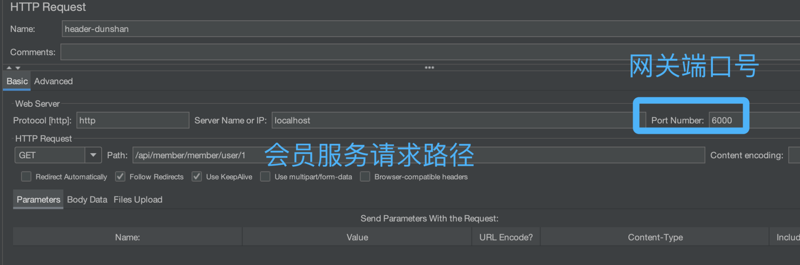

在 JMeter HTTP Header Manager 中设置压测标记。

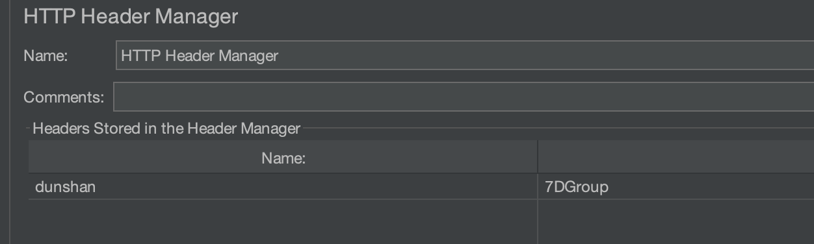

然后，执行 JMeter 脚本来验证订单服务。

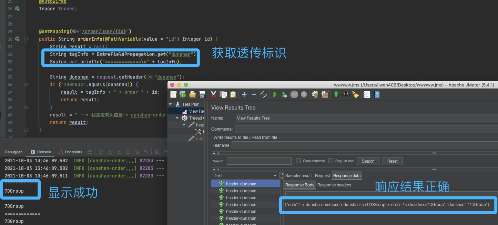

经过上面的 JMeter 操作之后，我们再来观察一下程序日志，日志显示了 JMeter 添加的标记。说明 demo 标记透传成功。

### 抽取数据上下文对象

​在 demo 预演获取压测标记验证通过后，我在前面介绍过，我们需要抽象出一层数据上下文（Context ）对象，我用订单系统做一下演示。

在订单系统中新建 config 包，再新建 AppContext 类：

```
    package com.dunshan.order.config;
    
    import com.alibaba.ttl.TransmittableThreadLocal;
    import java.io.Serializable;
    
    /**
     * @author dunshan
     * @description: 数据上下文
     * @date 2021-11-12 17:53:39
     */
     
    public class AppContext implements Serializable {
        private static final TransmittableThreadLocal<AppContext> contextdunshan = new TransmittableThreadLocal<>();
        private String flag;
        public static AppContext getContext() {
            return contextdunshan.get();
        }
        public static void setContext(AppContext context) {
            contextdunshan.set(context);
        }
        public static void removeContext() {
            contextdunshan.remove();
        }
        public String getFlag() {
            return flag;
        }
        public void setFlag(String flag) {
            this.flag = flag;
        }
    }
    

```

有了 TransmittableThreadLocal 类后，需要在 Filter 类中获取 Tag，然后存放到 AppContext 里面。只有这样， 才能确保 AppContext.getContext\(\).getFlag\(\) 方法在不同类中使用。

Filter 参考如下：

```
    import brave.Tracer;
    import org.slf4j.Logger;
    import org.slf4j.LoggerFactory;
    import org.springframework.beans.factory.annotation.Autowired;
    import org.springframework.cloud.gateway.filter.GatewayFilterChain;
    import org.springframework.cloud.gateway.filter.GlobalFilter;
    import org.springframework.http.server.reactive.ServerHttpRequest;
    import org.springframework.stereotype.Component;
    import org.springframework.web.server.ServerWebExchange;
    import reactor.core.publisher.Mono;
    
    /**
     * @author dunshan
     * @description: 全局过滤器
     * @date 2021-10-02 14:18:33
     */
     
    @Component
    public class globalTagFilter implements GlobalFilter {
    
        private final static Logger logger = LoggerFactory.getLogger(globalTagFilter.class);
        private Tracer tracer;
        
        @Autowired
        public void setTracer(Tracer tracer) {
            this.tracer = tracer;
        }
    
        @Override
        public Mono<Void> filter(ServerWebExchange exchange, GatewayFilterChain chain) {
            String dunshan = exchange.getRequest().getHeaders().getFirst("dunshan");
            if (dunshan != null) {
                logger.info("dunshan：" + dunshan);
                tracer.currentSpan().tag("dunshan", dunshan); //透传标签
                ServerHttpRequest request = exchange.getRequest().mutate().header("dunshan", dunshan).build();
                exchange = exchange.mutate().request(request).build();
            }
            return chain.filter(exchange);
        }
    }
    

```

有了数据上下文 Threadlocal 对象后，用户就可以随用随取。使用参考如下：

```
    AppContext.getContext().setFlag("value"); # 放入压测标记
    AppContext.getContext().getFlag();        # 取出压测标记
    

```

最后，我们就可以在订单服务中的 Controller 中获取数据上下文存储的压测标记。运行结果如下图：

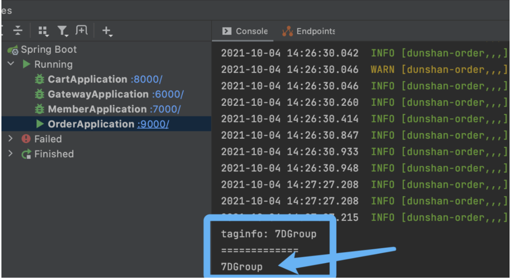

### Zipkin 链路追踪

刚才，我们已经看到业务应用成功获取了压测标记，下面我们打开链路追踪系统 Zipkin ，看看能不能正常显示透传的压测标记。

我们在浏览器中输入 [http://127.0.0.1:9411/zipkin](http://127.0.0.1:9411/zipkin/) 点击 【找到一个痕迹】，再点击【run query】， 数据就显示出来了。

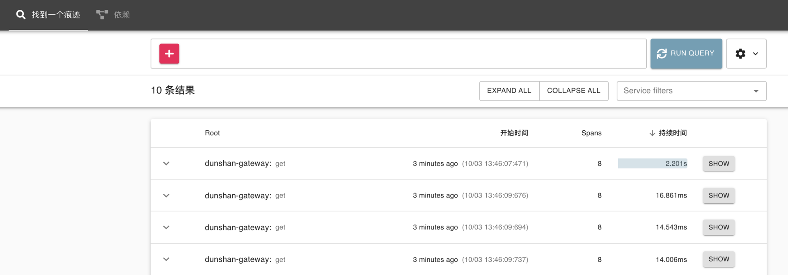

选择一个请求，点击 show ，看到标签下面的自定义标签为 dunshan，它的值为 7DGroup。通过这里我们也能知道，压测标记能在每个服务中显示出来。

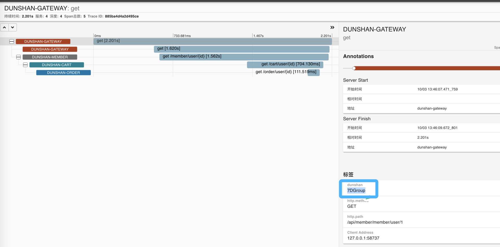

为了验证网关服务、会员服务、购物车服务和订单服务标签是不是也会显示自定义标签，我们依次打开每个请求查看标签是不是已经改好了。

* 网关（Gateway）

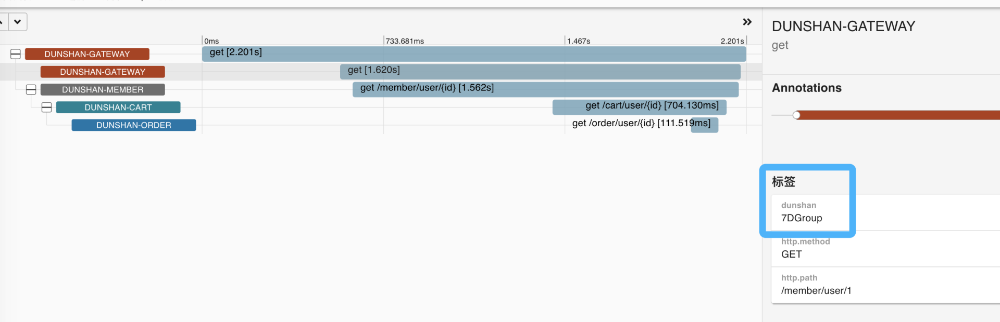

* 会员服务（Member）

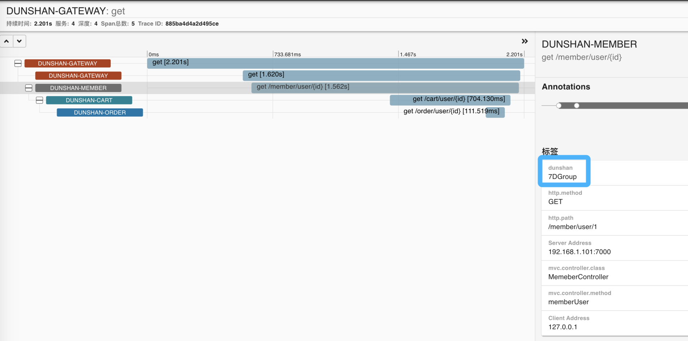

* 购物车服务（Cart）

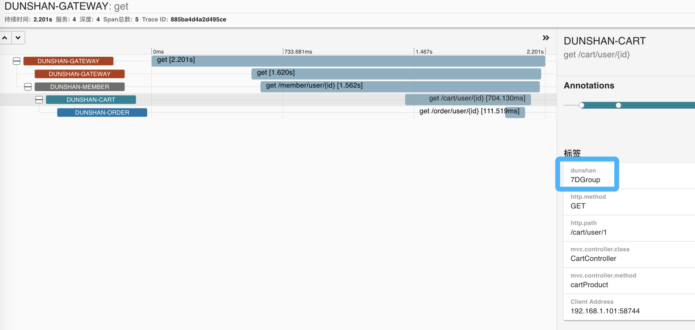

* 订单服务（Order）

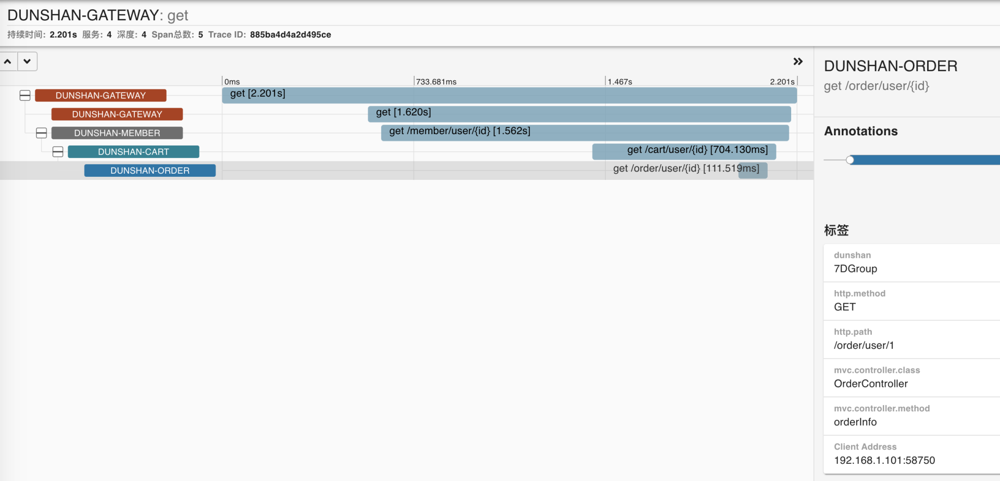

在网关中添加压测标记到 Span Baggage 中，在 Zipkin 链路中也可以看到每个服务添加了自定义标签。

打开链路跟踪图，可以看到服务之间的链路调用是完整的。

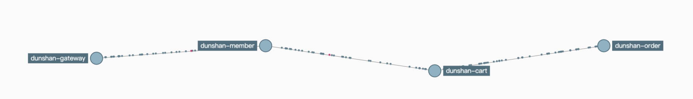

经过本地 demo 预演，我们知道了，只要在网关中拦截并添加压测标记并放入 Span Baggage 中，其他下游服务就能够通过 Span Baggage 获取压测标记来区分流量了。我们还知道，在 Zipkin 中也是能显示压测标记的。

基于刚才 demo 的预演，接下来，我们尝试对真实系统进行改造。

# 系统改造

* 网关服务改造

首先，我们对网关服务进行改造。

有了本地 demo 的改造经验后，我们可以直接在 mall 项目中找到网关服务，然后在它的全局过滤类中添加 Tag 标签。其他服务只要加入 Zipkin 依赖 Jar 包就可以了。

具体操作是，打开 mall 项目，找到 mall-gateway 服务，再找到 AuthGlobalFilter 类，添加之前 demo 网关自定义的 Tag 标记信息。

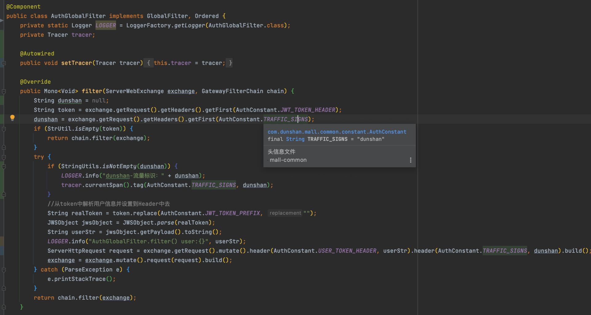

全局配置修改完毕后，还需要在 application.yml 配置文件里增加配置。

因为整个 mall 项目比较复杂，我们先对 mall-member 和 mall-auth 服务进行改造，如果这两项改造成功，那其他服务只要增加配置文件就可以了。

* 认证服务改造

接下来，我们对改造的服务进行认证。

找到 mall-member 服务和 mall-auth 认证服务，在配置文件中添加如下配置内容。

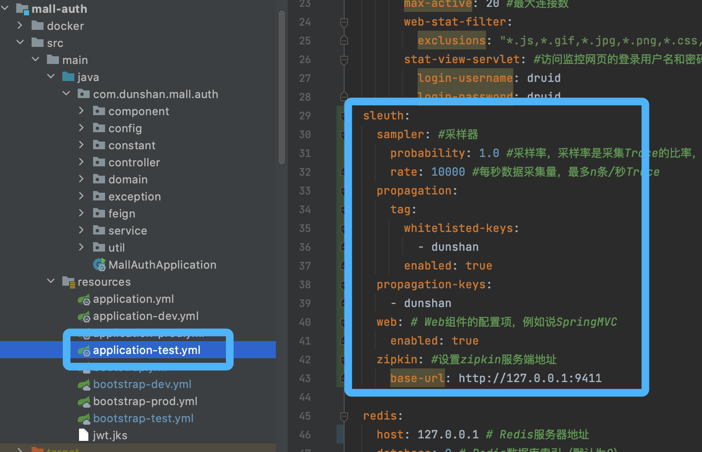

上面是添加认证服务的过程示意图，可以看到，添加mall-member 服务配置文件和添加认证服务没有什么区别。添加配置文件后，我们就可以启动 mall-member 、 mall-auth 和 mall-gateway 服务了：

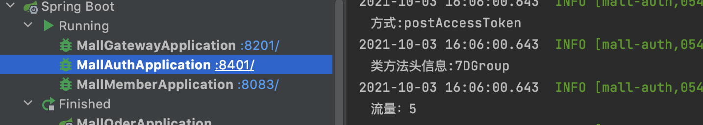

* JMeter 接口测试

启动项目后，打开 JMeter 注册接口。项目的注册脚本开发过程我就不在这里演示了，你可以参考这篇文章《 [高楼的性能工程实战课之脚本开发](https://mp.weixin.qq.com/s/KHGfK7DUbSBcNOF6J8mb6Q) 》。

需要注意的是，执行注册接口需要增加 Header 信息，这样在 Zipkin 中就能识别自定义 tag 标签了。脚本如下：

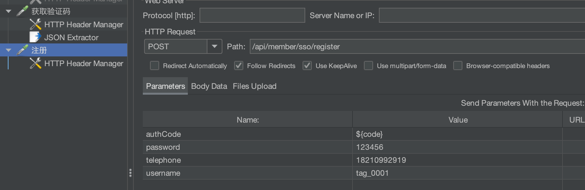

头信息的位置我已经标注在图片中了。

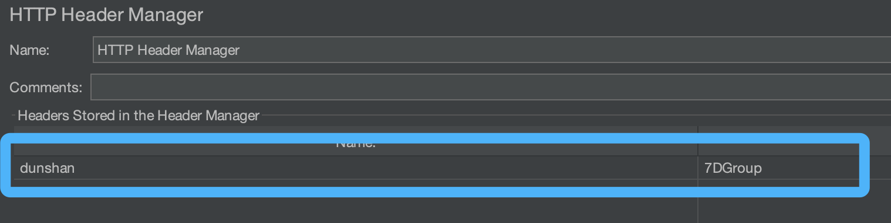

脚本执行结果：

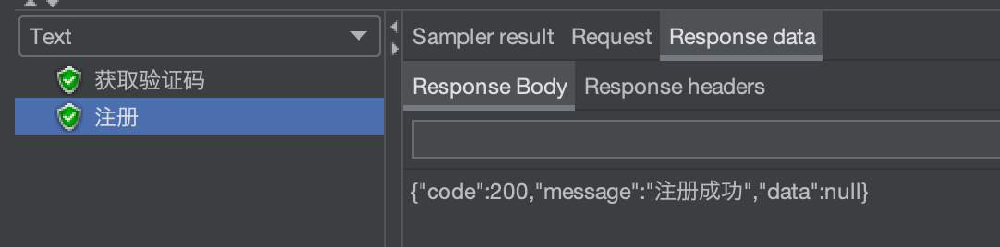

* Zipkin 链路追踪

最后，我们打开 Zipkin 查看有没有自定义标记，如果有压测标记，说明标记透传改造成功。

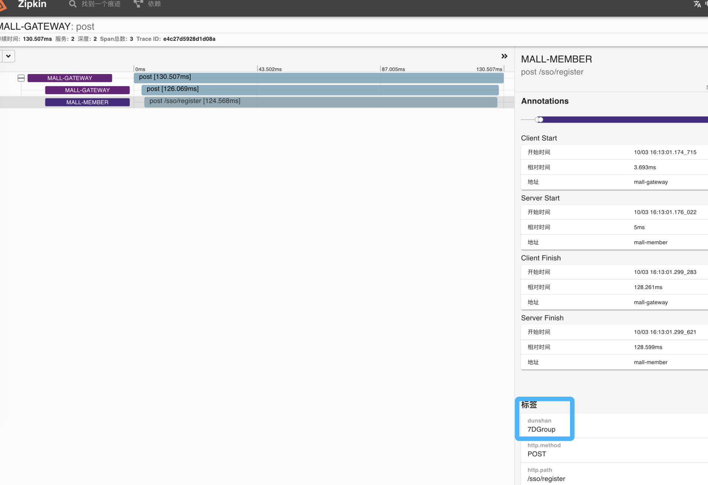

打开链路图也可以很清晰地看到目前的调用关系。

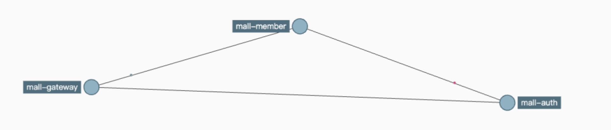

到这里，我们微服务电商项目的压测标记改造就完成了。

需要强调的是，你必须时刻记住我们做全链路压测标记追踪的目的。那就是，区分压测流量和线上流量，方便后续流量识别和隔离的动作。

# 总结

好了，这节课就讲到这里，我们使用 demo 预演和系统改造，完整演示了标记透传的改造过程。这节课有几个要点，我希望你能够记住：

* 通过抽象出一层数据上下文（Context ）对象，我们能够让压测标记兼容不同的应用协议，并支持跨线程间的透传、随时存取等功能；
* 在跨服务间的标记透传方面，我们可以利用 Sleuth 服务间原生传递上下文的特性，但是在此基础上，我们可以在网关拦截并添加压测标记的属性到 Span Baggage 中，以保证后续跨服务传输中始终带着压测标记，这样也就免去了代码的硬耦合；
* 下游服务可以使用  HttpRequest Header 或 Sleuth Baggage 这两种方式来获压测标记信息，获取标记后，我们可以把它直接放到数据上下文中，方便后续业务的使用。

总之，标记透传使用的场景比较单一，它除了在全链路压测中用于区分流量，通常还会应用在线上灰度发布场景中。不过从技术实现来看，这两者逻辑是一致的。

下一节课，我们进入流量隔离环节，我会通过案例给你演示怎样实现各个组件的流量隔离。

# 思考题

在课程的最后，我还是照例给你留两道思考题：

1.  为什么要引入数据上下文对象，它解决了什么问题？
2.  除了 Java 中的 ThreadLocal 对象，你还知道哪些语言有类似的方案？

欢迎你在留言区和我交流讨论，我们下节课见！