---
date: "2019-06-23"
---  
      
# 16 | 流量隔离：Redis 缓存隔离是怎么做的？
你好，我是高楼。

这节课，我们详细来讲讲如何基于微服务技术落地 Redis 缓存隔离。

在全链路压测的流量隔离中，有一个很重要的部分就是缓存隔离，即区分对应的 Cache。

说到缓存肯定离不开 Redis，因为高性能架构设计中都离不开它，在互联网和传统行业中呢，也都有它的身影。可以说，Redis 是性能项目中的必备知识点。

Redis 是一个 NoSQL 数据库，它使用的是内存存储的非关系型数据库，Redis 不使用表，使用 K-V 存储。

根据前面的经验我们知道，要改造什么就得知道它和其它组件的依赖关系，只有这样才能知道要对谁做改造。

所以，我又得祭出这个项目链路图了，脑中有策，心中有图，手中有码，改造才有路。

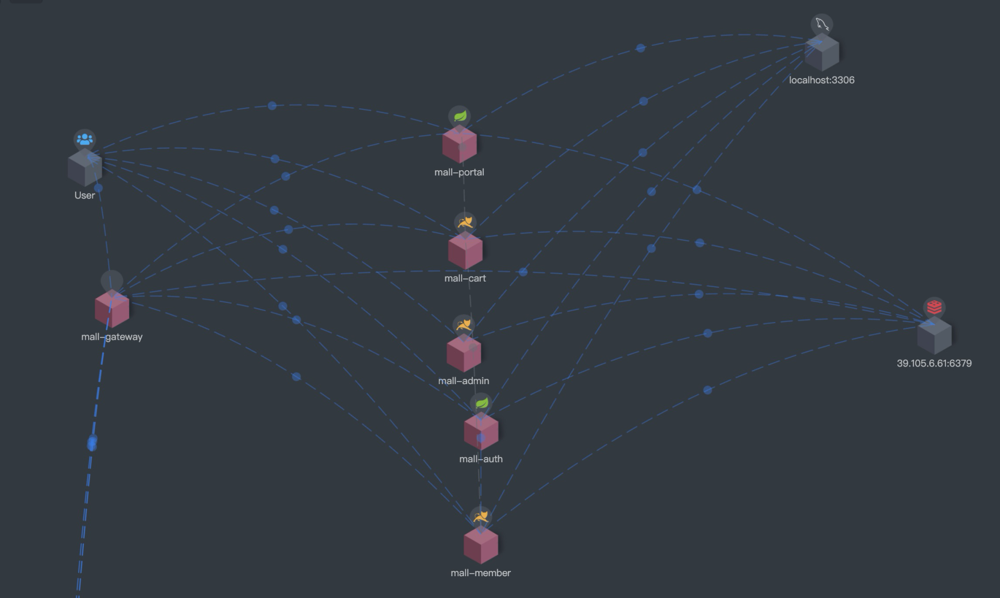

从链路图中我们可以看到，几乎所有业务系统（除了搜索）都和 Redis 组件有关系，所以，相关业务系统都得做缓存隔离改造，以保证正常流量与压测流量的缓存分离。

为了方便你更直观地理解，我给你画了个简要的思维导图。

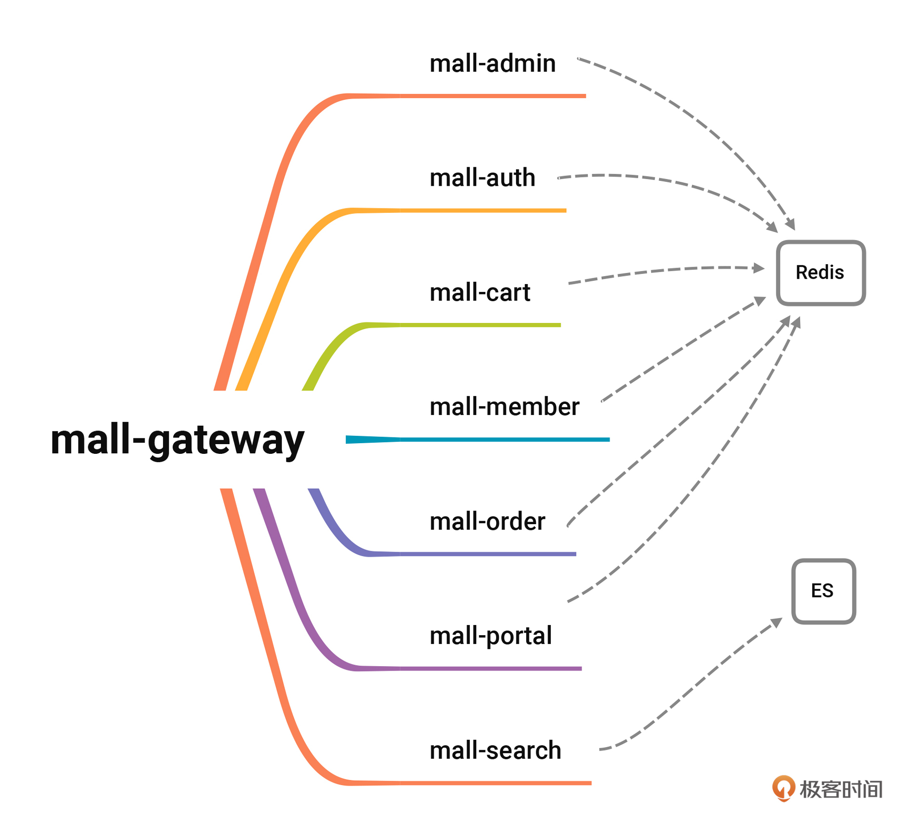

好了，搞懂了组件间依赖关系后，我们就要进入相关技术预演了。

## 技术预演

在正式动工之前，我们先回顾一下数据库隔离的方式。上一讲我们提过， MySQL 数据库隔离通常有三种方式，分别是数据偏移、影子库、影子表，Redis 和 MySQL 数据结构不同，所以 Redis 的缓存隔离技术会有些区别。

<!-- [[[read_end]]] -->

首先，我们来了解下目前业界对于缓存隔离的主要解决方案，以及它们的优缺点和适用场景。

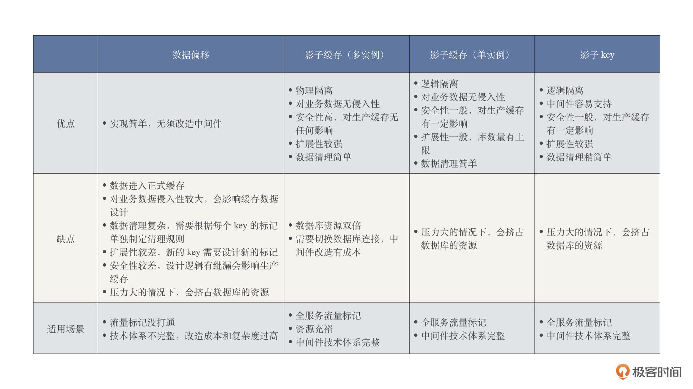

我们可以看到，根据不同的项目情况，可以选择不同的技术方案，**这里最优、最安全的方案当然首推影子缓存（多实例）**，具体的优缺点上面表格已经写得非常清楚了。​

下面我们来对缓存隔离里面的核心技术做下 demo 预演。

### 缓存隔离落地

在这里呢，我会主要介绍影子缓存和影子 key 两种方案。

* 第一种方案：影子缓存（多实例）

影子缓存（多实例）方案，首先要满足多数据源，然后确保它们分属两个物理上不同的Redis实例。在全链路压测过程中，业务层会识别标记，并选择对应的的 Redis 数据源，操作不同的 Redis 实例。

这里我给你画了一个简单的逻辑图：

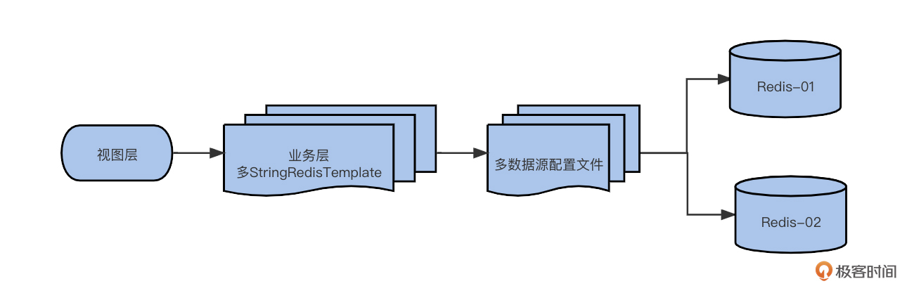

实现的具体操作步骤是：

**第一步：添加依赖。**

在 pom 中添加相关依赖。

```
    <dependency>
       <groupId>org.springframework.boot</groupId>
       <artifactId>spring-boot-starter-data-redis</artifactId>
    </dependency>
    <dependency>
       <groupId>redis.clients</groupId>
       <artifactId>jedis</artifactId>
    </dependency>
    

```

**第二步：添加全局配置文件。**

新建工程，在配置文件  application.yml 中新增两个数据源配置，配置文件参考如下：

```
    spring:
      redis:
        database: 1   # Redis数据库索引（默认为0）
        host: 9.15.21.27  # Redis服务器地址
        port: 16379  # Redis服务器连接端口
        password:    # Redis服务器连接密码（默认为空）
        timeout: 0  # 连接超时时间（毫秒）
        pool:
          max-active: -1 # 连接池最大连接数（使用负值表示没有限制）
          max-wait: -1  # 连接池最大阻塞等待时间（使用负值表示没有限制）
          max-idle: 8  # 连接池中的最大空闲连接
          min-idle: 0  # 连接池中的最小空闲连接
      redis2:
        database: 2   # Redis数据库索引（默认为0）
        host: 19.15.201.27  # Redis服务器地址
        port: 16379  # Redis服务器连接端口
        password:    # Redis服务器连接密码（默认为空）
        timeout: 0  # 连接超时时间（毫秒）
        pool:
          max-active: -1 # 连接池最大连接数（使用负值表示没有限制）
          max-wait: -1  # 连接池最大阻塞等待时间（使用负值表示没有限制）
          max-idle: 8  # 连接池中的最大空闲连接
          min-idle: 0  # 连接池中的最小空闲连接
    

```

**第三步：添加读取配置类。**

再创建两个方法读取不同的数据源配置，参考代码如下：

```
    import org.springframework.beans.factory.annotation.Value;
    import org.springframework.cache.annotation.EnableCaching;
    import org.springframework.context.annotation.Bean;
    import org.springframework.context.annotation.Configuration;
    import org.springframework.context.annotation.Primary;
    import org.springframework.data.redis.connection.RedisConnectionFactory;
    import org.springframework.data.redis.connection.jedis.JedisConnectionFactory;
    import org.springframework.data.redis.core.StringRedisTemplate;
    import redis.clients.jedis.JedisPoolConfig;
    
    /**
     * @description:
     * @author: dunshan
     * @create: 2021-08-19 23:18
     **/
    @EnableCaching
    @Configuration
    public class RedisDevConfiguration {
        @Primary
        @Bean(name = "slaveDataSource")
        public StringRedisTemplate slaveDataSource(@Value("${spring.redis.host}") String hostName,
                                                 @Value("${spring.redis.port}") int port, @Value("${spring.redis.password}") String password,
                                                 @Value("${spring.redis.pool.max-idle}") int maxIdle, @Value("${spring.redis.pool.max-active}") int maxTotal,
                                                 @Value("${spring.redis.database}") int index, @Value("${spring.redis.pool.max-wait}") long maxWaitMillis, @Value("${spring.redis.pool.min-idle}") int minIdle) {
            StringRedisTemplate temple = new StringRedisTemplate();
            temple.setConnectionFactory(connectionFactory(hostName, port, password, maxIdle, maxTotal, index, maxWaitMillis, minIdle));
            return temple;
        }
    
        @Bean(name = "masterDataSource")
        public StringRedisTemplate masterDataSource(@Value("${spring.redis2.host}") String hostName,
                                                    @Value("${spring.redis2.port}") int port, @Value("${spring.redis2.password}") String password,
                                                    @Value("${spring.redis.pool.max-idle}") int maxIdle, @Value("${spring.redis.pool.max-active}") int maxTotal,
                                                    @Value("${spring.redis2.database}") int index, @Value("${spring.redis.pool.max-wait}") long maxWaitMillis, @Value("${spring.redis.pool.min-idle}") int minIdle) {
            StringRedisTemplate temple = new StringRedisTemplate();
            temple.setConnectionFactory(
                    connectionFactory(hostName, port, password, maxIdle, maxTotal, index, maxWaitMillis, minIdle));
            return temple;
        }
        public RedisConnectionFactory connectionFactory(String hostName, int port, String password, int maxIdle,
                                                        int maxTotal, int index, long maxWaitMillis, int minIdle) {
            JedisConnectionFactory jedis = new JedisConnectionFactory();
            jedis.setHostName(hostName);
            jedis.setPort(port);
            if (password != null) {
                jedis.setPassword(password);
            }
            if (index != 0) {
                jedis.setDatabase(index);
            }
            jedis.setPoolConfig(poolCofig(maxIdle, maxTotal, maxWaitMillis, minIdle));
            // 初始化连接pool
            jedis.afterPropertiesSet();
            RedisConnectionFactory factory = jedis;
            return factory;
        }
        public JedisPoolConfig poolCofig(int maxIdle, int maxTotal, long maxWaitMillis, int minIdle) {
            JedisPoolConfig poolCofig = new JedisPoolConfig();
            poolCofig.setMaxIdle(maxIdle);
            poolCofig.setMaxTotal(maxTotal);
            poolCofig.setMaxWaitMillis(maxWaitMillis);
            poolCofig.setMinIdle(minIdle);
            return poolCofig;
        }
    }
    

```

**第四步：验证结果。**

为了验证 Redis 的配置是否生效，我们新建一个测试类，在类里面中注入两个数据源：

```
       @Resource(name = "slaveDataSource")
       private StringRedisTemplate slavetemplate;
        
       @Resource(name = "masterDataSource")
       private StringRedisTemplate masterTemplate;
    
       @Test
       void contextLoads() {
            slavetemplate.opsForValue().set("one", System.currentTimeMillis() + "我是正常流量标记");
            System.out.println(slavetemplate.opsForValue().get("one"));
            System.out.println("-----------");
            masterTemplate.opsForValue().set("two", System.currentTimeMillis() + "我是压测流量标记");
            System.out.println(masterTemplate.opsForValue().get("two"));
        }
    

```

最后，我们就可以把整个工程运行起来了，你可以参考文稿中的运行结果。

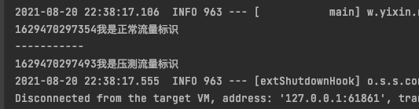

需要说明是，影子缓存（单实例）方案跟上面的实现逻辑是一致的，只不过单实例的数据库数量是有上限的，一般为 16 个。

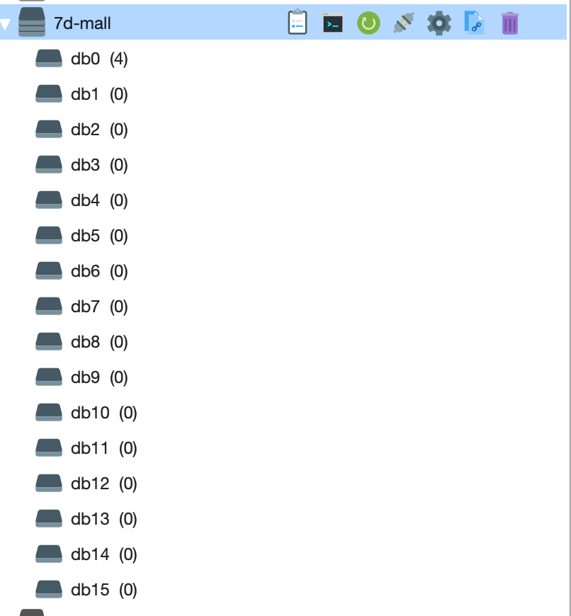

不过在正式线上压测的时候，我还是推荐你使用多实例，这样能从物理上完全隔离掉生产缓存。

到这里，我们的第一种方案就已经验证通过了。接下来我们再来看看第二种方案。

* 第二种方案：影子 key

所谓影子 key，就是在同一个库中，用不同的 key 存储不同的 value。

它大致的逻辑是下面的样子。

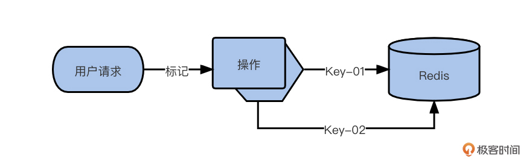

你可以看一下我给出的demo 代码。

```
        @Autowired
        private RedisTemplate redisTemplate;
    
        @GetMapping("/redis/{key}")
        public void setRedisDemo(HttpServletRequest request,@PathVariable String key) {
            String header = request.getHeader("7d");
            if (header！= null &&"7dGroup".equals(header)) {
                redisTemplate.opsForValue().set(key, "压测流量");
                log.info("压测流量");
            } else {
                redisTemplate.opsForValue().set(key, "线上流量");
            }
        }
    

```

它的基本原理就是，接口在 Header 信息中携带“ 7DGroup” 压测标记。然后，后台通过 HttpRequest 获取 Header 信息，业务层通过 Header 标记判断用对应 key 来操作缓存。

### 数据源上下文实现

上一节课，我们采用 AOP 技术完成了 MySQL 数据库的切换，你可以思考一下， Redis 是不是也可以用这种方式完成数据源切换。

其实确实是可以的。下面，我们就来演示怎么通过 AOP 技术完成 Redis 数据源的切换。

下面是一张简单的逻辑图：

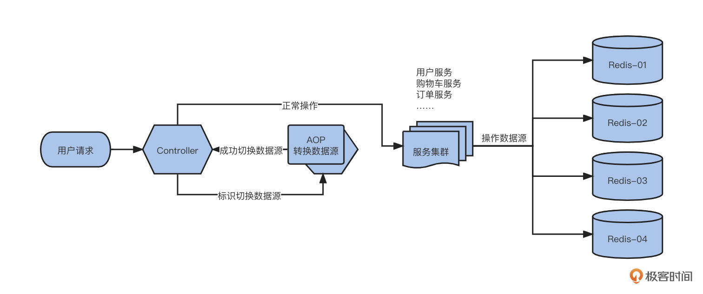

**第一步：添加全局配置文件。**

新建工程，在配置文件中添加数据源配置，参考代码如下：

```
    spring:
      http:
        multipart:
          max-file-size: 100MB
          max-request-size: 100MB
          enabled: true
      redis:
        database: 3
        host: 9.105.1.27
        port: 16379
        password:    # 密码（默认为空）
        timeout: 6000ms  # 连接超时时长（毫秒）
        jedis:
          pool:
            max-active: 1000  # 连接池最大连接数（使用负值表示没有限制）
            max-wait: -1ms      # 连接池最大阻塞等待时间（使用负值表示没有限制）
            max-idle: 10      # 连接池中的最大空闲连接
            min-idle: 5       # 连接池中的最小空闲连接
      cache:
        type: none
    
    resar:
        oneDatabase: 5  #压测数据库
    

```

**第二步：创建读取Redis配置文件类。**

有了配置文件，还得有读取配置文件类，只有这样才能正常读取自定义配置信息：

```
    import org.springframework.boot.autoconfigure.AutoConfigureAfter;
    import org.springframework.boot.autoconfigure.data.redis.RedisAutoConfiguration;
    import org.springframework.boot.autoconfigure.data.redis.RedisProperties;
    import org.springframework.boot.context.properties.EnableConfigurationProperties;
    import org.springframework.context.annotation.Bean;
    import org.springframework.context.annotation.Configuration;
    import org.springframework.context.annotation.Primary;
    import org.springframework.data.redis.connection.RedisPassword;
    import org.springframework.data.redis.connection.RedisStandaloneConfiguration;
    import org.springframework.data.redis.connection.jedis.JedisClientConfiguration;
    import org.springframework.data.redis.connection.jedis.JedisConnectionFactory;
    import redis.clients.jedis.JedisPoolConfig;
    
    import java.time.Duration;
    
    /**
     * @description:读取数据源配置
     * @author: dunshan
     * @create: 2021-08-21 12:02
     **/
    @Configuration
    @AutoConfigureAfter(RedisAutoConfiguration.class)// 自动获取application.yml中的配置
    @EnableConfigurationProperties(RedisProperties.class)
    public class RedisConfig {
        private RedisProperties properties;
    
        public RedisConfig(RedisProperties properties){
            this.properties = properties;
        }
    
        @Bean
        @Primary
        public JedisConnectionFactory jedisConnectionFactory(){
            RedisStandaloneConfiguration config = new RedisStandaloneConfiguration();
            config.setHostName(properties.getHost());
            config.setPort(properties.getPort());
            config.setPassword(RedisPassword.of(properties.getPassword()));
            config.setDatabase(properties.getDatabase());
            return new JedisConnectionFactory(config, getJedisClientConfiguration());
        }
    
        private JedisClientConfiguration getJedisClientConfiguration() {
            JedisClientConfiguration.JedisClientConfigurationBuilder builder = JedisClientConfiguration.builder();
            if (properties.isSsl()) {
                builder.useSsl();
            }
            if (properties.getTimeout() != null) {
                Duration timeout = properties.getTimeout();
                builder.readTimeout(timeout).connectTimeout(timeout);
            }
            RedisProperties.Pool pool = properties.getJedis().getPool();
            if (pool != null) {
                builder.usePooling().poolConfig(jedisPoolConfig(pool));
            }
            return builder.build();
        }
    
        private JedisPoolConfig jedisPoolConfig(RedisProperties.Pool pool) {
            JedisPoolConfig config = new JedisPoolConfig();
            config.setMaxTotal(pool.getMaxActive());
            config.setMaxIdle(pool.getMaxIdle());
            config.setMinIdle(pool.getMinIdle());
            if (pool.getMaxWait() != null) {
                config.setMaxWaitMillis(pool.getMaxWait().toMillis());
            }
            return config;
        }
    
        @Bean(name = "redisTemplate")
        @Primary
        public SelectableRedisTemplate redisTemplate() {
            SelectableRedisTemplate redisTemplate = new SelectableRedisTemplate();
            redisTemplate.setConnectionFactory(jedisConnectionFactory());
            return redisTemplate;
        }
    }
    

```

**第三步：创建数据源上下文类**

我们这个场景还是使用 TransmittableThreadLocal 来保存数据源对象信息。这个在 [第13讲](https://time.geekbang.org/column/article/444794) 已经讲得很清楚了，我就不多赘述了。

```
    /**
     * @description: 数据源上下文
     * @author: dunshan
     * @create: 2021-08-21 11:50
     **/
    public class RedisSelectSupport {
        private static final TransmittableThreadLocal<Integer> SELECT_CONTEXT = new TransmittableThreadLocal<>();
    
        public static void select(int db){
            SELECT_CONTEXT.set(db);
        }
    
        public static Integer getSelect(){
            return SELECT_CONTEXT.get();
        }
    }
    

```

**第四步：编写StringRedisTemplate 继承类。**

我们实现一个 RedisTemplate 来创建对应的 Redis 连接。

关键代码参考如下：

```
    import org.springframework.data.redis.connection.RedisConnection;
    import org.springframework.data.redis.core.StringRedisTemplate;
    
    /**
     * @description: 创建数据源连接
     * @author: dunshan
     * @create: 2021-08-21 11:49
     **/
    public class SelectableRedisTemplate extends StringRedisTemplate {
    
        @Override
        protected RedisConnection createRedisConnectionProxy(RedisConnection pm) {
            return super.createRedisConnectionProxy(pm);
        }
    
        @Override
        protected RedisConnection preProcessConnection(RedisConnection connection, boolean existingConnection) {
            Integer db;
            if((db = RedisSelectSupport.getSelect()) != null){
                connection.select(db);
            }
            return super.preProcessConnection(connection, existingConnection);
        }
    
    }
    
    

```

做好以上这些准备工作后，我们就可以开始实现后续的标记识别和缓存隔离动作了。

### 标记数据上下文实现

在做数据上下文的改造实现之前，我们还是先来回顾以下标记透传架构图。

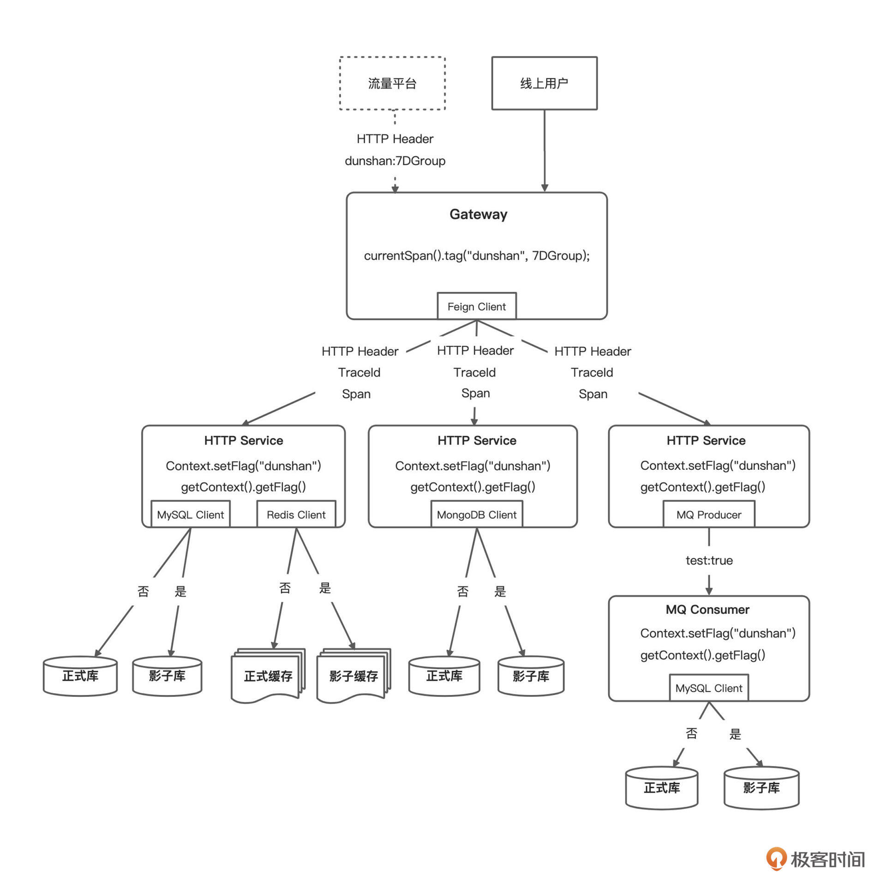

我们在 [14 讲](https://time.geekbang.org/column/article/446320)已经把标记透传逻辑讲得很清楚了，所以接下来，我们基于上面的标记透传方案，在业务层使用 AOP 拦截请求，做对应的数据源上下文设置即可。

这里使用的 demo 工程还是 14 讲的示例，主要包括网关、会员系统、购物车系统和订单系统 4 个服务：


首先，我们还是需要实现一个全局 Filter 过滤器，用它获取标记信息，然后将标记存放到数据上下文中。

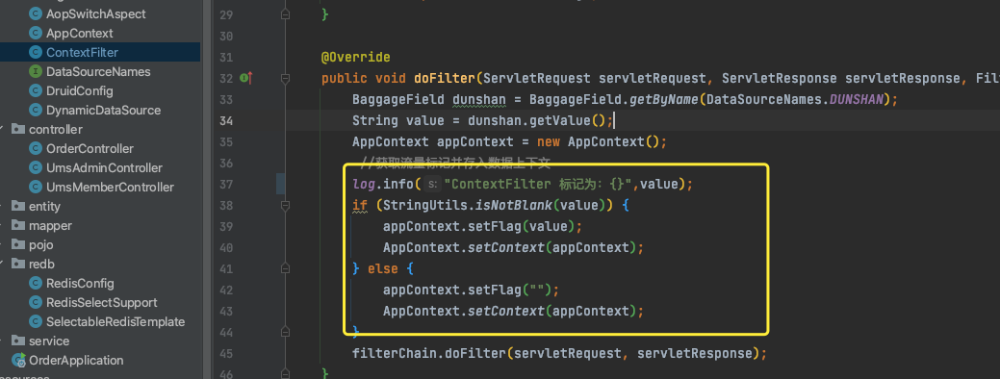

标记存放到数据上下文后，我们就可以使用 AOP 拦截请求和判断对应的目标数据源了。

关键代码如下：

```
    @Value("${spring.redis.master.database}")
    private int defaultDataBase;
    @Value("${spring.redis.shadow.database}")
    private int shadowDataBase;
    
    /**
     * 拦截入口下所有的 public方法
     */
    @Pointcut("execution(public * com.dunshan.order.controller..*(..))")
    public void pointCutAround() {
    }
    
    /**
     * @param point
     * @throws Throwable
     */
    @Around(value = "pointCutAround()")
    @ConditionalOnBean(SelectableRedisTemplate.class)
    public Object configRedis(ProceedingJoinPoint point) throws Throwable {
        AppContext context = AppContext.getContext();
        String flag = context.getFlag();
        int db = defaultDataBase;
        try {
            if (flag != null && flag.equals(DataSourceNames.HEAD)) {
                db = shadowDataBase;
                log.info("redis 压测流量：" + db);
            } else {
                db = defaultDataBase;
                log.info("redis 正常流量: " + db);
            }
            RedisSelectSupport.select(db);
            return point.proceed();
        } finally {
            RedisSelectSupport.select(defaultDataBase);
            log.debug("redis switch {} to {}", defaultDataBase, db);
        }
    }
    

```

之所以说这段代码关键，是因为它能让我们从   AppContext.getContext\(\) （数据上下文）中获取标记，从而判断是使用正式缓存还是影子缓存。  
改造完成后，我们就可以验证缓存隔离效果是否达到预期了。

这里，我们测试同一个接口，切换对应两个不同的数据库，同 key 但不同 value ，具体而言：

* 正式缓存：db0，value为线上流量；
* 影子缓存：db5，value为压测流量。

Redis 查询结果如下：

```
    127.0.0.1:6379[5]> select 5
    OK
    127.0.0.1:6379[5]> get 7d
    "\xe5\x8e\x8b\xe6\xb5\x8b\xe6\xb5\x81\xe9\x87\x8f"
    127.0.0.1:6379[5]> select 0
    OK
    127.0.0.1:6379> get 7d
    "\xe7\xba\xbf\xe4\xb8\x8a\xe6\xb5\x81\xe9\x87\x8f"
    127.0.0.1:6379>
    

```

这里，我们还是使用 JMeter 做下接口测试。

* 正常流量（不带 Header 标记）

脚本中不设置 Header 信息。

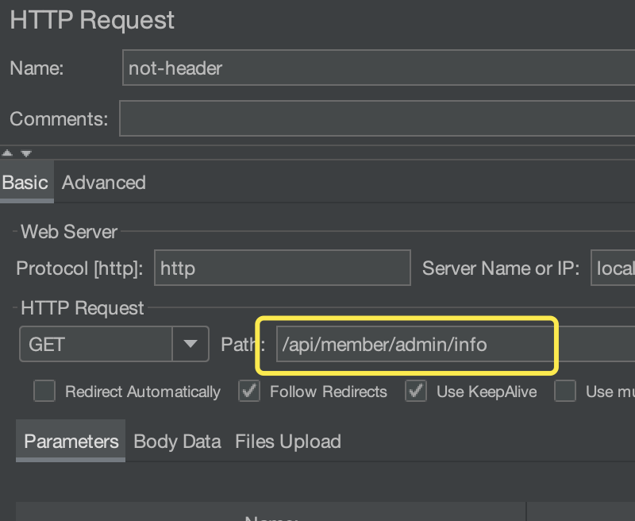

测试完成后，查看测试结果数据，可以看到，返回的结果为“线上流量”。

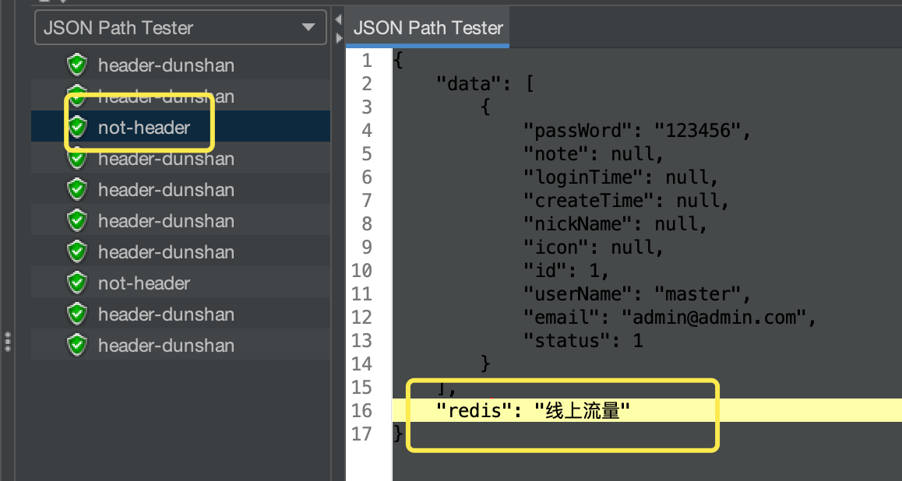

* 压测流量（带 Header 标记）

脚本中设置 Header， 具体为 “dunshan:7DGroup”：

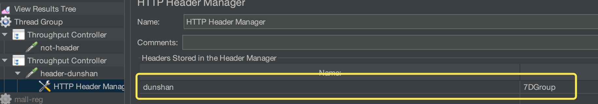

测试完成后，查看测试结果数据，我们看到返回的结果为“压测流量”。

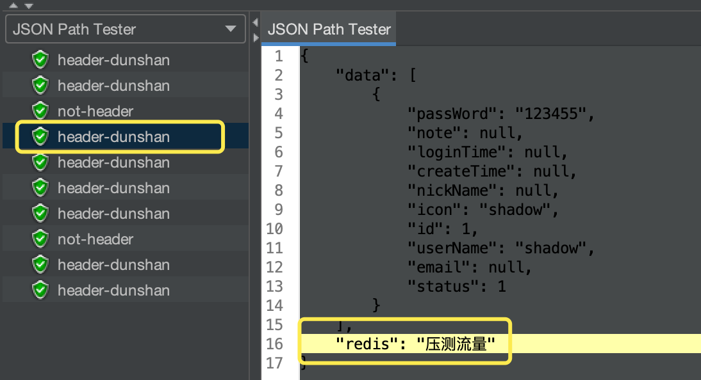

最后，我们打开订单服务查看日志，从日志可以看到打印 Redis 数据库切换成功。

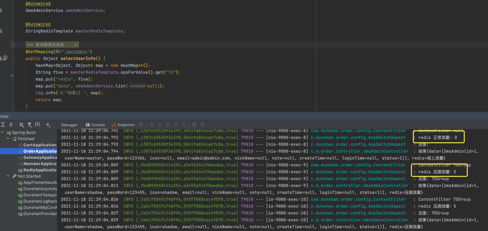

之前已经说过了，只要 demo 能完成数据源切换，并且数据隔离正常，那么就可以把目前的配置文件和相关类移植到真实系统中去了。

## 真实系统改造

我们先来对 mall-member（会员系统） 进行改造验证，如果改造并验证成功，我们就可以同步到其他系统了。

### **第一步：移植代码**

打开工程，选择 mall-member 模块，在配置文件新建一个包，然后把目前调试成功的配置文件复制到该工程中。

如果你仔细看一下就可以发现，系统在 mall-common 中有封装 Redis 公共模块，非常方便供其他模块调用。所以，我们可以把 RedisSelectSupport 与SelectableRedisTemplate 两个类放到公共配置类中：

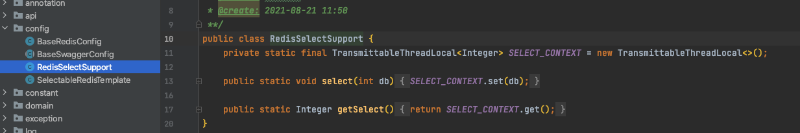

把上面两个类放到公共配置后，我们还要配置下 AOP 切面：

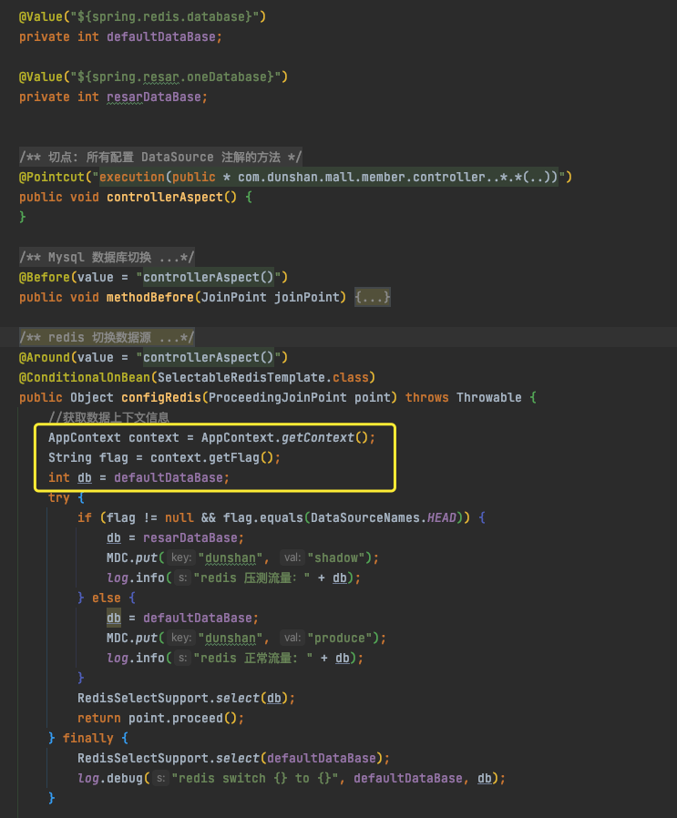

这里要注意哦， public 中的包名路径需要修改正确，不然拦截不会生效。

紧接着，我们把 RedisConfig 类移植到工程中去：

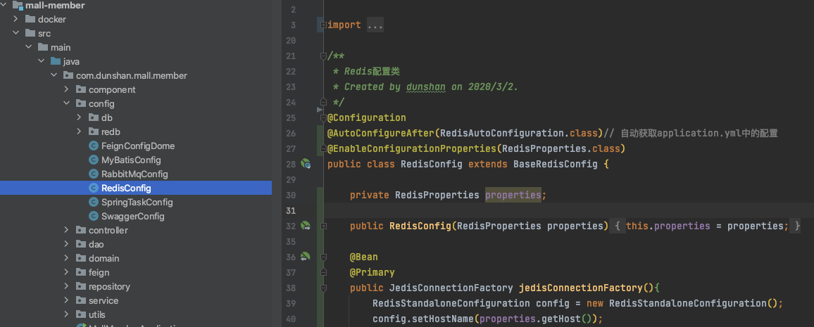

为了方便验证结果，我们还需要在 Controller 中添加一个测试接口，代码参考如下:

```
    /**
     * @author 7DGroup
     * @program: dunshan-mall
     * @description:
     * @date 2021-08-22 11:05:24
     */
    @Log4j2
    @Controller
    @RequestMapping("/index")
    public class IndexController {
    
        @Autowired
        private StringRedisTemplate redisTemplate;
    
        @GetMapping("/test/{name}")
        @ResponseBody
        public Object set(@PathVariable String name) {
            System.out.println("参数" + name);
            redisTemplate.opsForValue().set("student", name);
            HashMap<String, Object> map = new HashMap<>();
            map.put("ok", "调试");
            map.put("data", redisTemplate.opsForValue().get("student"));
            return map;
        }
    }
    

```

上面是一个很简单的 Get 请求的写接口，主要演示的是当流量过来的时候，如何生成对应的 Cache。

### **第二步：测试接口验证**

改造完成后，我们还是使用 JMeter 来做下接口测试，验证改造是否达到预期吧。

验证步骤主要有四个：

1、配置好数据源；

2、核实初始化 Cache；

3、通过 JMeter 接口测试；

4、验证日志及生成的 Cache。

首先，配置好对应的数据源，这里 db1 为正式缓存，db5 为影子缓存。

```
        database: 0 # Redis数据库索引（默认为0）
        port: 6379 # Redis服务器连接端口
        password:  # Redis服务器连接密码（默认为空）
        timeout: 3000ms # 连接超时时间（毫秒）
      resar:
        oneDatabase: 5
    

```

接下来，我们核实下数据。可以看到，这两个库的 key 的都没有 student 。  
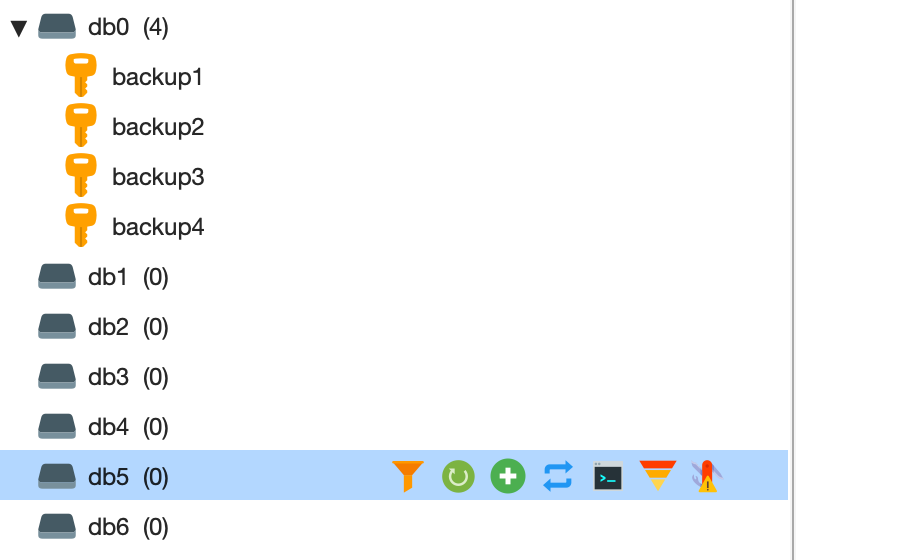

接下来，我们通过 JMeter 来做下接口测试验证。

* **压测流量（带Header标记）**

开发第一个请求脚本，在 HTTP Header Manager 里面添加压测标记。

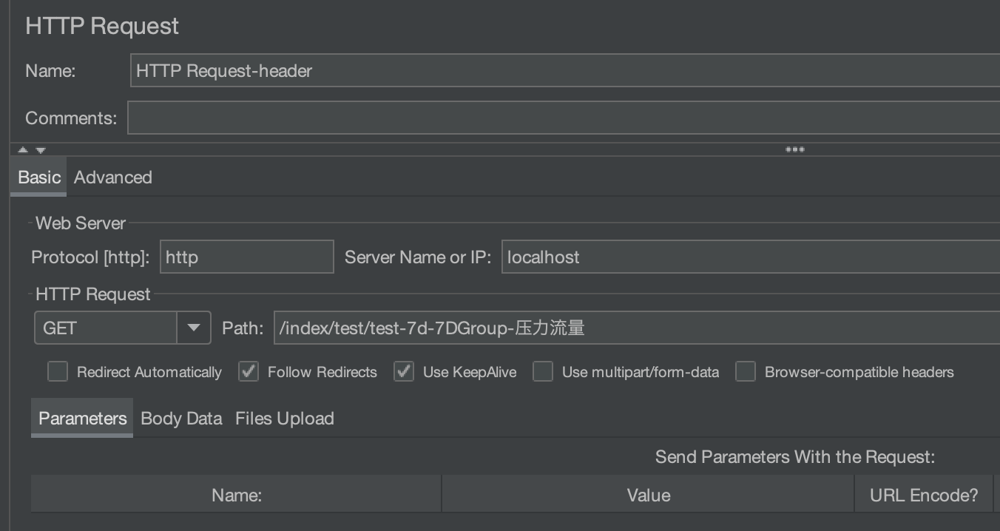

注意，JMeter 中的 Header 标记需要与代码中判断的标记保持一致。

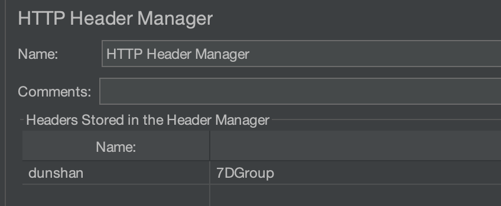

然后我们打开JMeter 结果查看树，点击第一个请求日志查看响应结果。可以看到提示已经成功了。

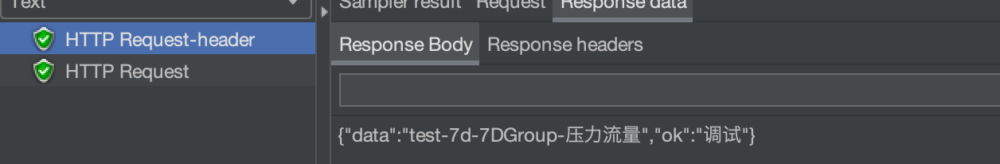

我们再打开 Redis 客户端工具查看 db0 ，显示的结果也与预期一致。

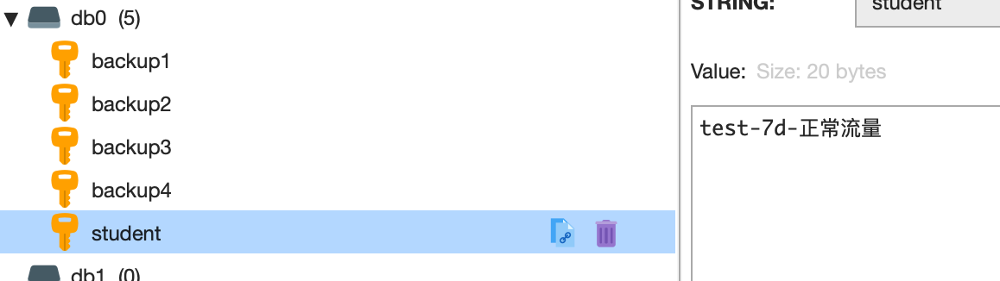

* **正式流量（不带Header标记）**

我们在 JMeter 脚本中去掉 HTTP Header Manager 组件。

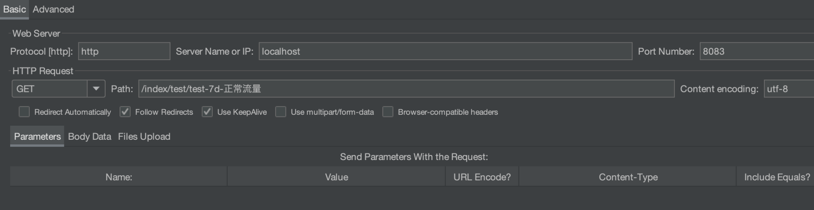

同样还是打开JMeter 结果查看树，点击第二个请求日志查看响应结果。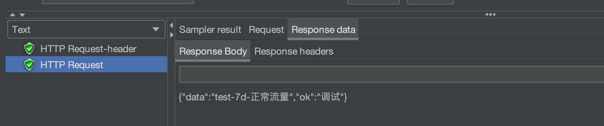

然后我们再打开 Redis db5，显示数据与请求数据也是一致的。

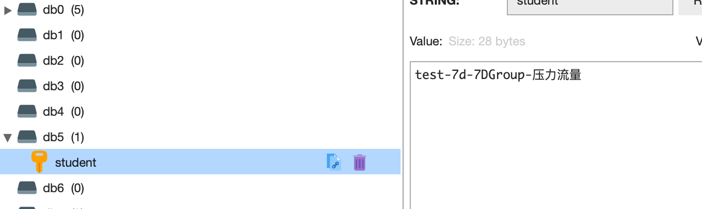

好了，测试接口验证通过之后，我们就可以验证真实接口是否有效了。

### **第三步：真实接口验证**

这里我们验证的接口为【会员登录】接口，使用的工具还是 JMeter 。

* **压测流量（带 Header 标记）**

这里需要注意的是，要提前在脚本增加对应的 Header 标记。

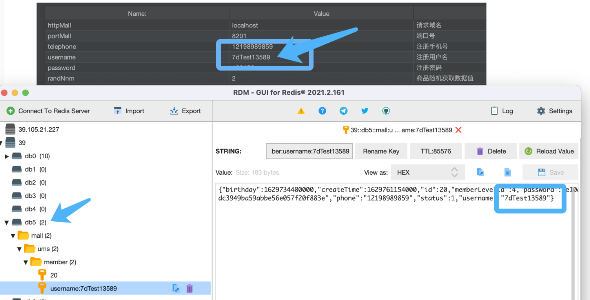

我们可以看到压测流量已经成功了，在 db5（影子缓存）中生成了对应的数据。

* **正式流量（不带 Header 标记）**

Redis 中 db0（正式缓存） 的数据也生成正常：

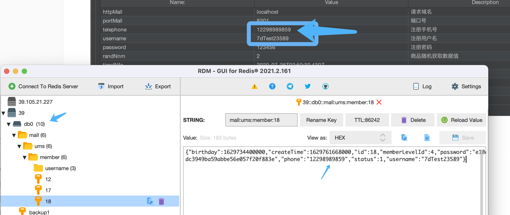

到这里，我们的真实接口测试验证也通过了。

刚才，我们演示了 mall-member 模块的改造过程，通过区分正常流量和压测流量生成对应的Cache，我们知道这部分系统改造已经成功了。

有了上面的改造经验之后，其他模块我们也可以按这个步骤来进行。我建议你一步一步地改造，这样能让改造的风险处于更加可控的范围内。

## 总结

好了，到这里，我们就把整个缓存隔离的改造介绍完了。这节课的要点有下面三个：

1、隔离方案选型：做好复杂度识别、风险管控、成本计算等前置工作。由于全链路压测本来就是在压力大的前提下产生的需求，所以缓存的隔离，使用多实例物理分离的方式来做隔离方案是最为合理的。

2、demo 预演：在技术预演中，我们也给出了两种实现方案，那就是根据Header识别和根据数据上下文识别。

3、真实系统改造：主要涉及到移植代码和验证两大环节。

大家都知道现在处理集中的大访问量的一些常见手段：缓存、队列、限流、熔断、降级等。而缓存作为一个系统大幅提升性能的重要手段，在全链路压测的逻辑中是绝对不能忽视的。这也是我这节课讲得这么详细的原因。我希望你能从文本中看到在全链路压测中，具体每一步的改造过程。

因为改造涉及的代码比较多，在这个专栏结束之后，我也会把所有改造过的代码都公布出来，方便大家一起交流讨论。

## 思考题

在这节课结束之前，我还是给你留两道思考题 ：

1、Redis 缓存隔离和 MySQL 隔离方案上有什么区别？

2、如果线上做了 Redis 缓存隔离，压测的时候我们需要注意些什么？

欢迎你在留言区与我交流讨论，我们下节课再见！