---
date: "2019-06-23"
---  
      
# 20 | Mock：如何屏蔽第三方接口的影响？
你好，我是高楼。这节课，我们聊一聊全链路压测中 Mock 技术的落地。

曾经也有不少人问我，在压测过程中，第三方接口响应时间慢怎么办呢？其实，响应时间慢，容量达不到要求，这是在依赖第三方系统的全链路压测过程中必然会面对的问题。这个时候，性能测试还要做，开发也不会为了性能测试修改业务代码，第三方我们也驱动不了。为了解决这个问题，我们就不得不用上Mock技术了。

什么是Mock呢？简单来说就是指使用各种技术手段模拟出各种需要的资源以供测试使用。Mock技术目前按应用场景主要分两大类：

* Mock 一个对象，构造返回预期的数据，主要适用于单元测试；
* Mock 一个 Server ，构造返回预期的服务，主要适用于接口和性能测试。

而对于我们全链路压测来说，最主要使用的技术还是Mock Server。

Mock Server的逻辑是非常直观的：


通过这张图我们可以看到，真实用户和压测用户是走同样的应用服务节点的。但不同的是，真实用户最终会走到真实的第三方服务，而压测用户会走到Mock Server上去。

请注意，在全链路压测的过程中，我们要Mock的是压测流量。而在整个逻辑中，我们是直接在应用服务中做标记透传、识别、流量隔离的，所以压测流量和正式流量是用**同样的应用服务**。

<!-- [[[read_end]]] -->

说到这里，我还想提一下Service Mesh。现在网上我们经常看到的通过 Service Mesh 实现的全链路逻辑，是在入口的POD上添加tag，并通过网络路由实现对不同版本的转发的。这个逻辑其实也是实现了全链路方式的。逻辑图如下：


但是，这种方式有两个点要说明：

1.  Service Mesh是用不同的应用服务容器来实现的。也就是说，压测流量和正常流量走的已经不是同一个POD中的应用服务了。而我们专栏描述的内容，是会走同样的POD中的应用服务的。
2.  Service Mesh 的方式无法实现对数据库、缓存、队列等的隔离。

所以从这两点来看，Service Mesh做灰度发布是完全没问题的，但是要想实现全链路压测的初衷它是做不到的。

也正是因此，我们才需要用 Mock 的技术手段来做第三方的服务隔离。

虽然Mock技术并不复杂，但它却是全链路压测过程中不可或缺的一个知识点，所以我们还是把它拆开讲一讲。

市面上有很多种前后端 Mock Server框架，我们只要根据项目需要搭建最简单实用的 Mock Server 框架解决问题就可以了。如果实在没有框架可以借鉴，我们还可以自己写一个 Mock Server，**反正Mock 的目的就是把不可控变成可控**。

通常，我们把Mock Server分为**前端Mock Serve**r和**后端Mock Server**。

不过，因为前端Mock Server主要是为了规避在开发过程中前端等待后端的情况。但是在全链路的逻辑中，使用Mock Server主要是为了规避调用第三方时的影响，所以在全链路压测项目中，我们只要实现后端Mock Server就可以了。

为了逻辑描述的完整性，这里我还是会给出一个前端Mock Server技术的简单示例，你可以稍做了解。

下面，我们就来看看前端Mock Server和后端Mock Server各有什么技术吧。

## 前端 Mock Server

当前端开发有依赖后端接口的数据时，我们可以在前端自己搭建 nodejs 服务，构造返回预期的服务。那么常见的前端 Mock Server有哪些呢？

这里我给你提供两个常见的Mock Server： [server-mock](https://www.npmjs.com/package/server-mock) 和 [json-server](https://github.com/typicode/json-server) 。

我们以 server-mock 为例，介绍一下它怎么使用。

第一步，安装完nodejs环境之后，执行 npm 快速安装 server-mock，命令如下：

```
    npm install -g server-Mock
    

```

第二步，在当前目录新建一个文件夹（名字随便，这里我用了 7d）。

再次输入命令Mock init，输入完毕后，目录下自然会创建两个文件：index.html 与 router.js。

你可以打开这两个文件查看一下代码。这是一个很简单的demo，index.html 就是一个表单与发送请求的 js 代码；router.js 内是Mock规则，当收到某个特定字段后，Mock Server应该返回相应的响应信息。

第三步，简单修改下index.html文件：


第四步，修改 route.js 文件，对调用的接口和参数设计对应的响应内容：

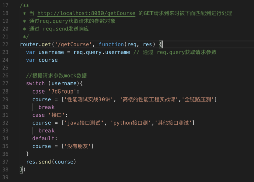

第五步，在命令行输入 Mock start 启动server-mock， 终端上就会有下面的提示：

```
    Success: server start success， open the link http://localhost:8080 in browser 
    

```

我们只要根据提示在浏览器中打开地址就能看到效果了。

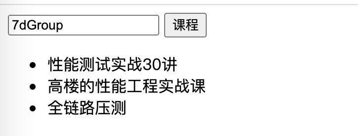

另外，你还可以直接在浏览器输入地址，响应结果就是 JSON格式的自定义内容，如下所示：


有了接口响应数据，接下来就可以做前端开发了。

## 后端 Mock Server

好了，刚才，我们简单了解了一下前端Mock Server ，并演示了 server-mock 的使用方法。接下来，就要进入我们这节课的重点也就是后端Mock Server了。

这类Mock Server有很多，下面我们重点介绍一款常用的：Moco。

简单介绍一下Moco：

> Moco 本身支持 API 和独立运行两种方式。通过 API ，开发人员可以在Junit、TestNg 等测试框架里使用 Moco，这样极大地降低了接口测试的复杂度。  
> Moco 可以根据一些配置，启动一个真正的 HTTP 服务（监听本地指定端口）。当发起的请求满足一个条件时，就会收到一个 response 。Moco 底层并没有依赖于像 Servlet 这样的重型框架，而是基于 Netty 的网络应用框架编写的，这样就绕过了复杂的应用服务器，所以它的速度是极快的。

了解了Moco的基本特性，接下来我们就看下怎么实现。

首先第一步，下载Moco的jar（<https://github.com/dreamhead/moco>），启动 Moco HTTP Server。

```
    java -jar <moco-runner-path> http -p <port> -c <configfile-path>
    

```

这个启动命令里，这几个参数的含义你可以了解一下：**moco-runner-path** 指jar 包路径；**port** 指HTTP 服务监听端口；**configfile-path** 指配置文件路径。

第二步，在本地启动一个 HTTP 服务器，其中监听端口是 12306，配置文件是 JSON 文件。只需要本机发起一个 request 就可以了，如：<http://localhost:12306> 。

根据不同的请求类型，我们要设计相应的返回值。我给你画了一个简单的思维导图，方便你理清不同类型的接口。

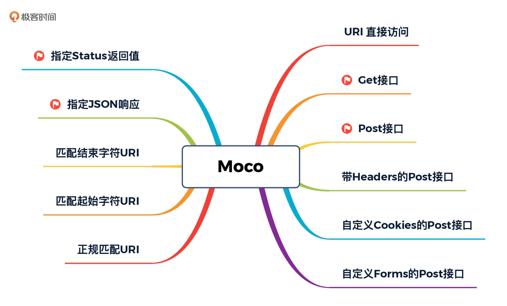

针对这张图中几个常见的接口（比如：Get接口、Post接口、带Headers的Post接口、自定义Cookies的Post接口、指定 JSON 响应、指定Status返回值），我们做一下具体的演示。

* **Get接口**

返回值JSON内容定义为：

```
    [
      {
        "description":"这是一个请求queries",
        "request":{
          "uri":"/7d",
          "queries":{
            "name":"7DGroup"
          }
        },
        "response":{
          "text":"success！"
        }
      }
    ]
    

```

通过 Postman 验证服务，测试 Get 请求：

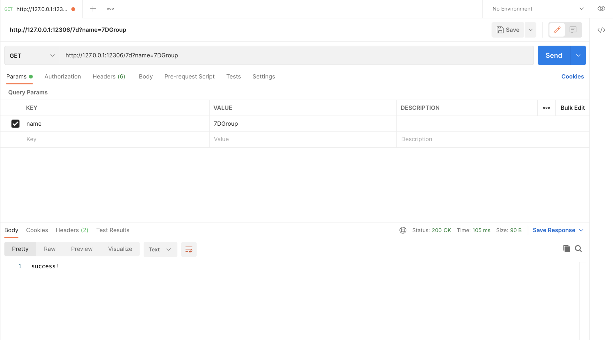

Moco 服务日志为：

```
    09 十一月 2021 11:21:04 [nioEventLoopGroup-3-2] INFO  Request received:
    GET /7d HTTP/1.1
    Host: 127.0.0.1:12306
    User-Agent: PostmanRuntime/7.4.0
    Accept: */*
    Accept-Encoding: gzip, deflate
    Cache-Control: no-cache
    Postman-Token: 2d36e386-e022-4478-8acd-258eff4ff684
    X-Lantern-Version: 5.1.0
    Content-Length: 0
    09 十一月 2021 11:21:04 [nioEventLoopGroup-3-2] INFO  Response return:
    HTTP/1.1 200
    Content-Length: 10
    Content-Type: text/plain; charset=utf-8
    success！
    

```

* **Post 接口**

返回值JSON 内容定义如下：

```
    [
      {
        "description":"这是一个post请求",
        "request":{
          "uri":"/7d",
          "method":"post"
        },
        "response":{
          "text":"success！"
        }
      }
    ]
    

```

通过 Postman 验证服务，测试 Post 请求：

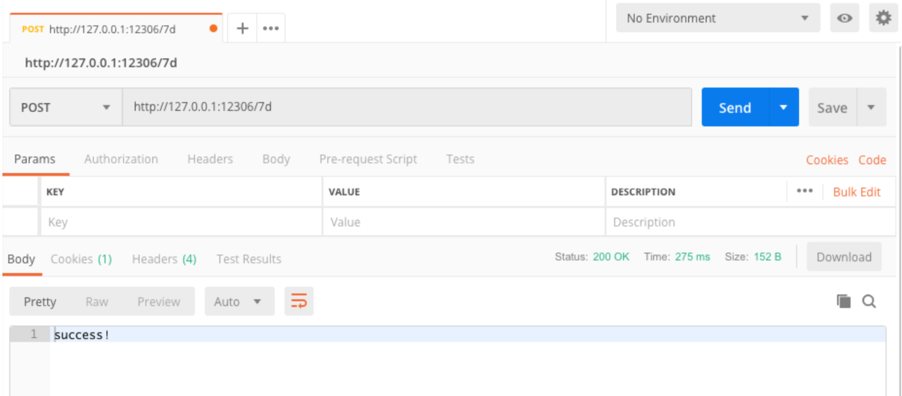

Moco 服务日志为：

```
    09 十一月 2021 11:29:30 [nioEventLoopGroup-3-2] INFO  Request received:
    POST /7d HTTP/1.1
    Host: 127.0.0.1:12306
    User-Agent: PostmanRuntime/7.4.0
    Content-Length: 0
    Accept: */*
    Accept-Encoding: gzip, deflate
    Cache-Control: no-cache
    Postman-Token: 73f38af1-4efb-473a-b9d2-de0392c65bbe
    X-Lantern-Version: 5.1.0
    09 十一月 2021 11:29:30 [nioEventLoopGroup-3-2] INFO  Response return:
    HTTP/1.1 200
    Content-Length: 10
    Content-Type: text/plain; charset=utf-8
    success！
    

```

* **带Headers的Post接口**

返回值JSON内容定义如下：

```
    [
      {
        "description":"这是一个带headers的post请求",
        "request":{
          "uri":"/7d",
          "method":"post",
          "headers":{
            "content-type":"application/json"
          }
        },
        "response":{
          "text":"success！"
          }
        }
    ]
    

```

通过 Postman 验证服务，测试带**Headers**的 Post 请求：

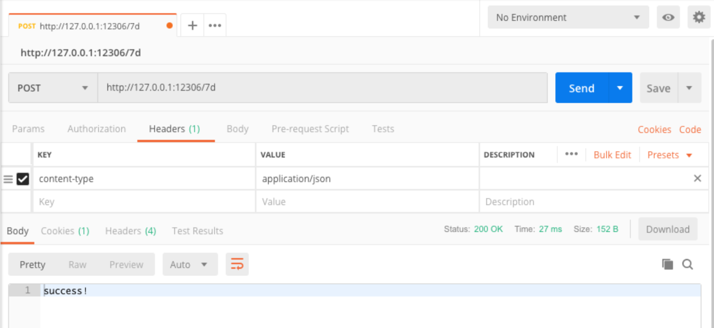

Moco 服务日志为：

```
    09 十一月 2021 11:34:43 [nioEventLoopGroup-3-2] INFO  Request received:
    POST /7d HTTP/1.1
    Host: 127.0.0.1:12306
    User-Agent: PostmanRuntime/7.4.0
    Content-Length: 0
    Accept: */*
    Accept-Encoding: gzip, deflate
    Cache-Control: no-cache
    Content-Type: application/json
    Postman-Token: 0a82d74b-303f-42a3-9da0-32fd6c604166
    X-Lantern-Version: 5.1.0
    09 十一月 2021 11:34:43 [nioEventLoopGroup-3-2] INFO  Response return:
    HTTP/1.1 200
    Content-Length: 10
    Content-Type: text/plain; charset=utf-8
    success！
    

```

* **自定义Cookies的Post接口**

返回值 JSON 内容定义如下：

```
    [
      {
        "description":"这是一个带cookies的post请求",
        "request":{
          "uri":"/7d",
          "method":"post",
          "cookies":{
            "login":"7dgroup"
          }
        },
        "response":{
          "text":"success！"
          }
        }
    ]
    

```

通过 Postman 验证服务，发送带自定义 Cookie的 Post 请求，Post请求中的 Cookie 配置如下：

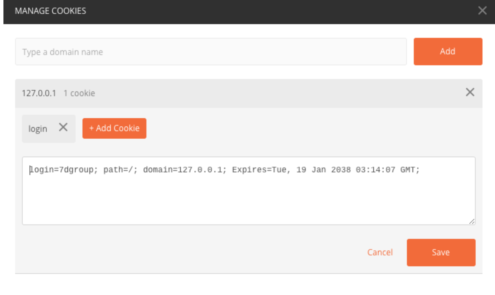

Postman接口配置如下：

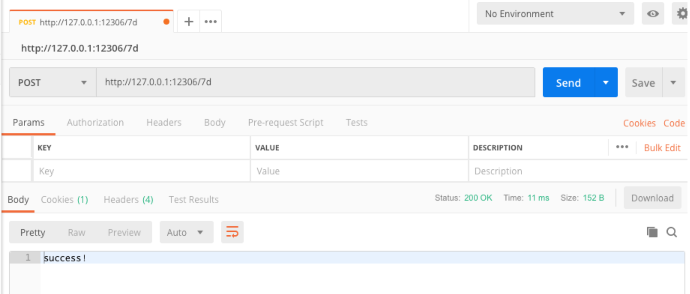

Moco 服务日志如下：

```
    09 十一月 2021 12:26:46 [nioEventLoopGroup-3-3] INFO  Request received:
    
    POST /7d HTTP/1.1
    Host: 127.0.0.1:12306
    User-Agent: PostmanRuntime/7.4.0
    Content-Length: 0
    Accept: */*
    Accept-Encoding: gzip, deflate
    Cache-Control: no-cache
    Cookie: login=7dgroup
    Postman-Token: 36a12412-6eb1-44a4-a2d8-ea222eba8968
    X-Lantern-Version: 5.1.0
    
    09 十一月 2021 12:26:46 [nioEventLoopGroup-3-3] INFO  Response return:
    
    HTTP/1.1 200
    Content-Length: 10
    Content-Type: text/plain; charset=utf-8
    
    success！
    

```

* **指定 JSON响应**

返回值JSON内容定义如下：

```
    [
      {
        "description":"这是一个指定Json响应的post请求",
        "request":{
          "uri":"/7d",
          "method":"post"
        },
        "response":{
          "json":{
            "name":"success",
            "code":"1"
          }
        }
      }
    ]
    

```

通过 Postman 验证服务，测试 Post 请求：

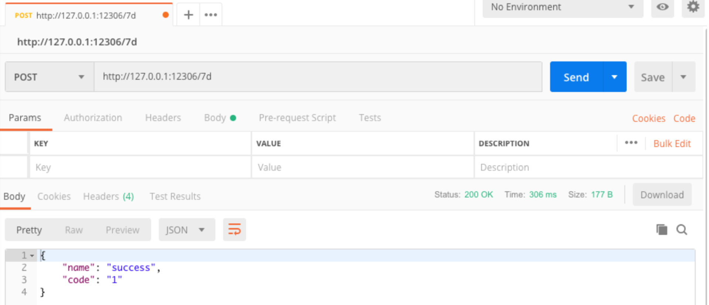

Moco 服务日志如下：

```
    09 十一月 2021 13:25:19 [nioEventLoopGroup-3-2] INFO  Request received:
    
    POST /7d HTTP/1.1
    Host: 127.0.0.1:12306
    User-Agent: PostmanRuntime/7.4.0
    Content-Length: 0
    Accept: */*
    Accept-Encoding: gzip, deflate
    Cache-Control: no-cache
    Content-Type: multipart/form-data; boundary=--------------------------703341725381001692596870
    Postman-Token: e5686919-85b9-44d0-8a73-61bf804b6377
    X-Lantern-Version: 5.1.0
    
    09 十一月 2021 13:25:19 [nioEventLoopGroup-3-2] INFO  Response return:
    
    HTTP/1.1 200
    Content-Length: 29
    Content-Type: application/json; charset=utf-8
    
    {"name":"success","code":"1"}
    

```

* **指定Status返回值**

返回值JSON内容定义如下：

```
    [
      {
        "description":"这是指定响应status的get请求",
        "request":{
          "uri":"/7d",
          "method":"get"
        },
        "response":{
          "status":200
        }
      }
    ]
    

```

通过 Postman 验证服务，测试 Get 请求：

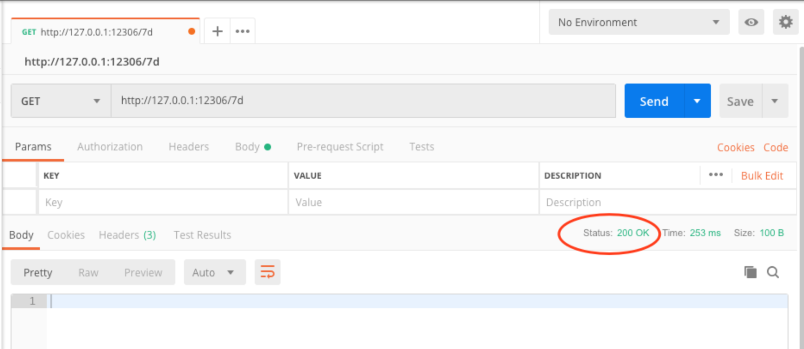

Moco 服务日志如下：

```
    09 十一月 2021 13:29:07 [nioEventLoopGroup-3-2] INFO  Request received:
    
    GET /7d HTTP/1.1
    Host: 127.0.0.1:12306
    User-Agent: PostmanRuntime/7.4.0
    Accept: */*
    Accept-Encoding: gzip, deflate
    Cache-Control: no-cache
    Content-Type: multipart/form-data; boundary=--------------------------465777039297587100709267
    Postman-Token: 791fa21c-386f-4389-aaa9-ba06d9e53aff
    X-Lantern-Version: 5.1.0
    Content-Length: 0
    
    09 十一月 2021 13:29:07 [nioEventLoopGroup-3-2] INFO  Response return:
    
    HTTP/1.1 200
    

```

刚才，我们对常见的接口类型进行了Mock自定义，你可以根据自己的接口类型进行相应的定义。

不过讲到这里，你可能还会有一个问题，这样的Mock Server可以支持大容量的压力吗？其实是完全可以的，你只要在前面加上一个Nginx，后面的节点数是可以随便添加的，能一直加到满足你的需求为止。

## 系统改造

好了，知道了怎么搭建Mock Server之后，现在我们要来解决另一个关键问题，那就是如何基于压测标记实现流量的区分。还记得我们在这节课开头的这张图吧。我们希望，在同一个应用服务中实现正式流量和压测流量的请求（如果你是用Service Mesh做的不同版本的发布，不在这个逻辑之内）。


注意哦，重点来了！ 请看上面的应用服务C，现在网上我们能看到的几乎所有Mock相关的文章，都是直接把这个应用服务C的后端调用接到了Mock Server上。其实这是有问题的，也不符合全链路压测的逻辑。

全链路压测的前提是不影响真实的生产服务的同时，又可以在同一应用服务中实现将压测流量转发到Mock Server上去。所以这时，就必须在应用服务C上做逻辑判断。也就是让正式的流量走真实的第三方服务，让压测流量走到Mock Server中去。

这就是我们需要改造的部分了。因为改造比较简单，这次我们不做demo了，直接在真实系统中改造。

先来看下我们的整体逻辑设计图：

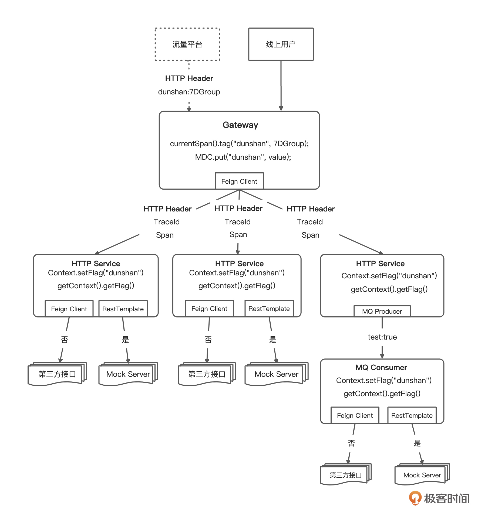

在这张图里，HTTP Header透传到Service里后，业务方通过数据上下文获取到压测标记，这时我们要进行判断：

* 如果是正式流量，就走Feign Client调用真实的第三方接口；
* 如果是压测流量，就走RestTemplate调用Mock Server。

我们用order服务中典型的需要做第三方Mock的pay接口来详细演示一下实现步骤。

第一步，在应用服务项目的配置文件application.yaml中添加Mock相关的配置。

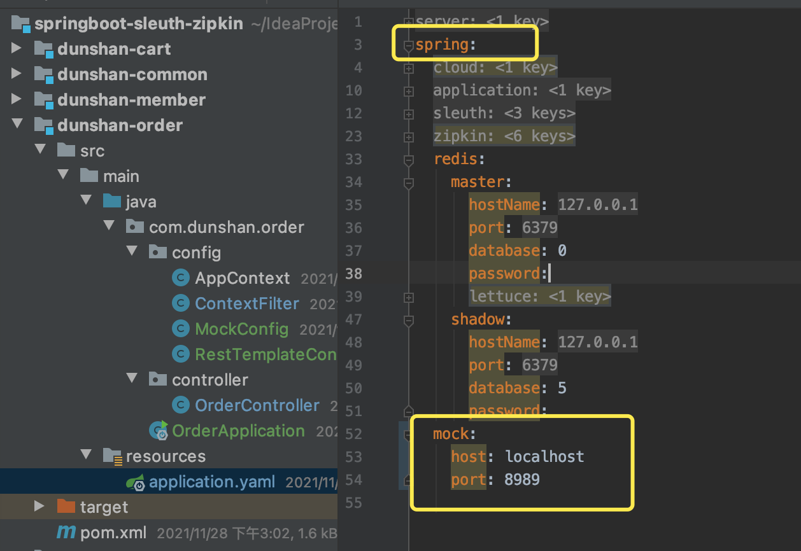

第二步，编写Mock配置读取类。

```
    @Log4j2
    @Component
    public class MockConfig {
    
        @Value("${spring.mock.host}")
        private String host;
        
        @Value("${spring.mock.port}")
        private String port;
        
        public String getHost() {
            return host;
        }
        
        public String getPort() {
            return port;
        }
        
    }
    

```

第三步，编写RestTemplate 配置类，用于后面的HTTP调用。

```
    import org.springframework.context.annotation.Bean;
    import org.springframework.context.annotation.Configuration;
    import org.springframework.http.client.ClientHttpRequestFactory;
    import org.springframework.http.client.SimpleClientHttpRequestFactory;
    import org.springframework.web.client.RestTemplate;
    
    /**
     * @description:  RestTemplate 配置类
     * @author: dunshan
     * @create: 2021-11-28 16:23
     **/
     
    @Configuration
    public class RestTemplateConfig {
    
        @Bean
        public RestTemplate restTemplate(ClientHttpRequestFactory factory) {
            return new RestTemplate(factory);
        }
        
        @Bean
        public ClientHttpRequestFactory simpleClientHttpRequestFactory() {
            SimpleClientHttpRequestFactory factory = new SimpleClientHttpRequestFactory();
            factory.setReadTimeout(5000);
            factory.setConnectTimeout(15000);
            return factory;
        }
        
    }
    

```

第四步，在调用pay接口时实现Mock判断。

```
    
    private SimpleDateFormat sdf = new SimpleDateFormat("yyyy-MM-dd HH:mm:ss");
    
    @Autowired
    RestTemplate restTemplate;
    @Autowired
    MockConfig mockConfig;
    
    @GetMapping("/pay")
    public Object payOrder() {
    
        HashMap<String, Object> map = new HashMap<>();
        String name = "";
        
        //获取流量标识
        String flag = AppContext.getContext().getFlag();
        
        if (StringUtils.isNoneEmpty(flag)) {
             //请求 mock 服务
            String url = String.format("http://%s:%s/7d", mockConfig.getHost(), mockConfig.getPort());
            ResponseEntity<String> response = restTemplate.getForEntity(url, String.class, name);
            String body = response.getBody();
            map.put("ok", JSON.parse(body));
            map.put("time", sdf.format(new Date()));
            return map;
        }
        
        //走正常服务
        map.put("ok", "正式数据");
        return map;
        
    }
    

```

第五步，Moco 服务响应JSON配置。

```
    [
      {
        "description": "这是一个get请求",
        "request": {
          "uri": "/7d",
          "method": "get"
        },
        "response": {
          "json":{
            "name":"Mock Success",
            "code":"100"
          }
        }
      }
    ]
    
    

```

第六步，验证 Mock 服务。

我们启动JMeter，模拟发送正常流量和压测流量。

* 正常流量（不带压测标记）  
  

返回结果如下：


* 压测流量（带压测标记）  
  


返回结果如下：

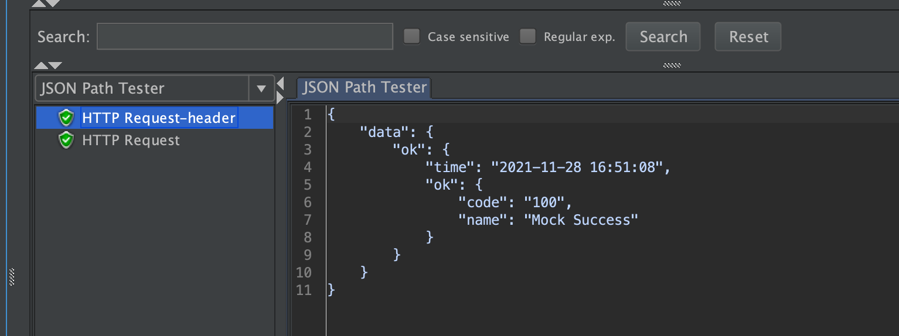

从上面的结果可以看到，压测流量请求会走到Mock Server上；而正常的流量请求会走到真正的第三方服务上。

到这里，全链路压测的Mock改造就成功了。

## 总结

好，这节课就讲到这里。

刚才，我们介绍了常见的前端和后端Mock Server，并做了详细的演示。我们还演示了系统改造的部分。主要的逻辑，就是业务方从数据上下文中获取压测标记，然后通过判断让它走不同的调用方向。**这里的关键是让压测流量和正常流量在同一个服务中去实现**。这样在全链路线上压测时，才能真正地把所有生产上用到的服务和方法都覆盖到了。

现在市场上的 Mock Server已经有很多了。至于用哪一种工具其实并不重要，只要能满足需求就可以。如果没有 Mock Server，我们还可以自己写一个服务。

Mock是一种比较简单易懂的逻辑，但它却能解决全链路压测中对第三方强依赖的问题，这可解决了一个大问题，希望你能够用好它。

## 思考题

​学完这节课，我想请你思考两个问题：

1.  你还知道哪些可以作为Mock Server的应用？各有什么优缺点？
2.  你觉得Mock Server的配置中，还有哪些难点？

欢迎你在留言区与我交流讨论。我们下节课见！