---
date: "2019-06-23"
---  
      
# 23 | 压测平台：如何改造对象存储和性能监控？
你好，我是高楼。

这节课我们来聊聊如何改造分布式压测平台。

在第 6 讲，我们已经详细了解了流量工具的选型，我们一起来回顾下全链路流量平台必须具备的能力：

1.  能录制线上真实流量；
2.  能实现海量数据的并发请求，并覆盖地域性的 CDN 边缘节点；
3.  能支持常见协议的请求；
4.  对线上尽量应用透明，也就是说无侵入性；
5.  避免写请求的脏数据，压测流量能够被识别，方便压测后清理；
6.  工具使用简单，能够满足压测实时监控，服务安全保护（过载熔断）。

按照上面这几条能力需求，我还画了一个比较典型的全链路流量平台架构设计图。


在这张架构图中，我把压测平台分为压测 web 管理端、调度服务、压测引擎、监控服务、对象存储、录制服务六大模块。这样的一个全链路流量平台基本上就可以覆盖大部分企业的需求了。

接下来，我会就这里面部分的技术细节进行拆解。因为内容比较多，我会分成两节课讲解。这节课，我们主要看一下对象存储和性能监控模块如何落地。

## 对象存储

对象存储简单来说就是一种海量、安全、低成本、高可靠的云存储服务，适合存放任意类型的文件。它还支持快速查询、上传下载等功能。通俗来说就是一个文件仓库。

现在大部分的公有云厂商，都提供了自己的对象存储服务，比如阿里云的OSS、华为云的OBS，腾讯云的COS等，我们只需集成云厂商提供的SDK即可访问。而开源产品方面，比较常见的有 Ceph 和 [MinIO](http://www.minio.org.cn/overview.shtml#)。

<!-- [[[read_end]]] -->

其中，Ceph是一个比较强大的分布式存储系统，但是它整个系统非常复杂，比较重量级，需要花费大力气去维护，很显然与我们的目标不是很符合，所以暂时不考虑。

而MinIO是一个基于Apache License V2.0开源协议的高性能、分布式的对象存储系统，而且兼容亚马逊S3云存储服务，非常适合存储大容量非结构化的数据，比如图片、视频、日志文件等。而且MinIO系统较为轻量级，可以很简单地和其它的应用结合，很显然，气质和我们的流量平台比较符合。

总而言之，如果想自建对象存储服务，而且有能力、规模又比较大的话，采用 Ceph 更好一点。但是我们只是想要一个对象存储，要求没有那么多，所以我们才选择了 MinIO。它的整体结构图如下：


我们设计的上传文件的大致流程你可以看看下面这张图：

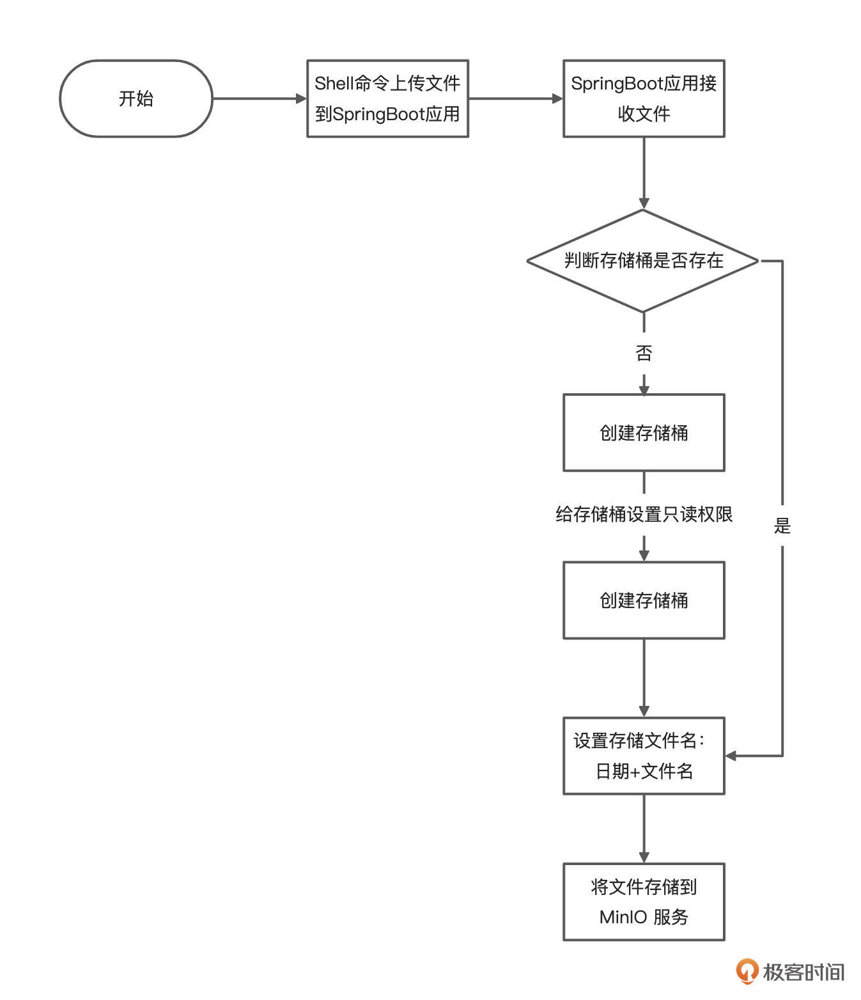

知道了大致的流程，接下来看看我们如何落地。

* 搭建 MinIO Server

这里，为了方便调试，我们使用Docker快速搭建 MinIO Server，并设置端口号、容器名。

```
    docker run -d --name minio-server \
    -p 9000:9000 \
    -p 9001:9001 \
    minio/minio server /data \
    --console-address ":9001"
    

```

如果你希望集成到k8s，还可以使用Operator方式搭建MinIO Server，具体方法可以参考[官网文档](http://docs.minio.org.cn/minio/k8s/deployment/deploy-minio-operator.html)。

启动成功后，访问MinIO的IP地址，因为我的 MinIO Server 安装在本机，所以是 <http://localhost:9001>，输入默认的账号密码是 minioadmin/minioadmin。

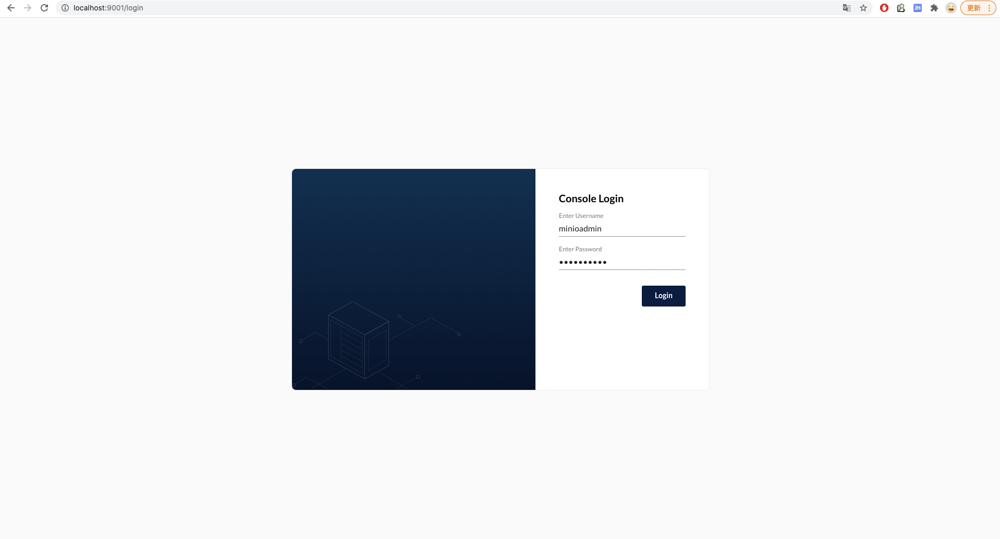

登录后，进入控制台看板页。


好了，搭建完 MinIO Server 之后，我们就需要实现自己的对象存储 HTTP服务了。

* 通过 SpringBoot 实现 HTTP 服务

因为项目使用的是 SpringBoot 应用，所以这里主要演示通过 SpringBoot 实现的 HTTP 服务。

首先， 在 pom.xml中 添加 MinIO 的相关依赖：

```
    <!--MinIO JAVA SDK-->
    <dependency>
        <groupId>io.minio</groupId>
        <artifactId>minio</artifactId>
        <version>3.0.10</version>
    </dependency>
    

```

第二步，在 SpringBoot 中开启文件上传功能，在 application.yml 中添加如下配置：

```
    spring:
      servlet:
        multipart:
          enabled: true #开启文件上传
          max-file-size: 10MB #限制文件上传大小为10M
    

```

然后，添加一个 MinioController 控制器用于实现文件的上传、下载、删除操作：

```
    package com.dunshan.controller;
    
    import com.google.api.client.util.IOUtils;
    import com.dunshan.common.api.CommonResult;
    import com.dunshan.dto.MinioUploadDto;
    import io.minio.MinioClient;
    import io.minio.policy.PolicyType;
    import io.swagger.annotations.Api;
    import io.swagger.annotations.ApiOperation;
    import org.slf4j.Logger;
    import org.slf4j.LoggerFactory;
    import org.springframework.beans.factory.annotation.Value;
    import org.springframework.stereotype.Controller;
    import org.springframework.web.bind.annotation.RequestMapping;
    import org.springframework.web.bind.annotation.RequestMethod;
    import org.springframework.web.bind.annotation.RequestParam;
    import org.springframework.web.bind.annotation.ResponseBody;
    import org.springframework.web.multipart.MultipartFile;
    
    import javax.servlet.http.HttpServletResponse;
    import java.io.InputStream;
    import java.io.OutputStream;
    import java.net.URLEncoder;
    import java.text.SimpleDateFormat;
    import java.util.Date;
    
    /**
     * Created by dunshan on 2019/12/25.
     */
    
    @Api(tags = "MinioController", description = "MinIO对象存储管理")
    @Controller
    @RequestMapping("/minio")
    public class MinioController {
    
        private static final Logger LOGGER = LoggerFactory.getLogger(MinioController.class);
        @Value("${minio.endpoint}")
        private String ENDPOINT;
        @Value("${minio.bucketName}")
        private String BUCKET_NAME;
        @Value("${minio.accessKey}")
        private String ACCESS_KEY;
        @Value("${minio.secretKey}")
        private String SECRET_KEY;
    
        @ApiOperation("文件上传")
        @RequestMapping(value = "/upload", method = RequestMethod.POST)
        @ResponseBody
        public CommonResult upload(@RequestParam("file") MultipartFile file) {
            try {
                //创建一个MinIO的Java客户端
                MinioClient minioClient = new MinioClient(ENDPOINT, ACCESS_KEY, SECRET_KEY);
                boolean isExist = minioClient.bucketExists(BUCKET_NAME);
                if (isExist) {
                    LOGGER.info("存储桶已经存在！");
                } else {
                    //创建存储桶并设置只读权限
                    minioClient.makeBucket(BUCKET_NAME);
                    minioClient.setBucketPolicy(BUCKET_NAME, "*.*", PolicyType.READ_ONLY);
                }
                String filename = file.getOriginalFilename();
                SimpleDateFormat sdf = new SimpleDateFormat("yyyyMMdd");
                // 设置存储对象名称
                String objectName = sdf.format(new Date()) + "/" + filename;
                // 使用putObject上传一个文件到存储桶中
                minioClient.putObject(BUCKET_NAME, objectName, file.getInputStream(), file.getContentType());
                LOGGER.info("文件上传成功!");
                MinioUploadDto minioUploadDto = new MinioUploadDto();
                minioUploadDto.setName(filename);
                minioUploadDto.setUrl(ENDPOINT + "/" + BUCKET_NAME + "/" + objectName);
                return CommonResult.success(minioUploadDto);
            } catch (Exception e) {
                LOGGER.info("上传发生错误: {}！", e.getMessage());
            }
            return CommonResult.failed();
        }
    
        @ApiOperation("文件删除")
        @RequestMapping(value = "/delete", method = RequestMethod.POST)
        @ResponseBody
        public CommonResult delete(@RequestParam("objectName") String objectName) {
            try {
                MinioClient minioClient = new MinioClient(ENDPOINT, ACCESS_KEY, SECRET_KEY);
                minioClient.removeObject(BUCKET_NAME, objectName);
                return CommonResult.success(null);
            } catch (Exception e) {
                e.printStackTrace();
            }
            return CommonResult.failed();
        }
        
        @ApiOperation("文件下载")
        @RequestMapping(value = "/download", method = RequestMethod.GET)
        @ResponseBody
        public CommonResult download(@RequestParam("filename") String filename, HttpServletResponse httpResponse) {
            try {
                MinioClient minioClient = new MinioClient(ENDPOINT, ACCESS_KEY, SECRET_KEY);
                InputStream inputStream= minioClient.getObject(BUCKET_NAME, filename);
                httpResponse.reset();
                httpResponse.setHeader("Content-Disposition", "attachment;filename=" + URLEncoder.encode(filename, "UTF-8"));
                httpResponse.setContentType("application/octet-stream");
                httpResponse.setCharacterEncoding("utf-8");
                OutputStream outputStream = httpResponse.getOutputStream();
                IOUtils.copy(inputStream, outputStream);
                outputStream.close();
    
            } catch (Exception e) {
                LOGGER.info("导出失败：", e.getMessage());
                e.printStackTrace();
            }
            return null;
        }
    }
    

```

最后，在 application.yml 中对 MinIO 客户端进行配置：

```
    # MinIO对象存储相关配置
    minio:
      endpoint: http://127.0.0.1:9000 #MinIO服务所在地址
      bucketName: goreplay #存储桶名称
      accessKey: minioadmin #访问的key
      secretKey: minioadmin #访问的秘钥
    

```

* 接口测试

接下来我们启动 SpringBoot 应用，使用 Postman 来测试验证一下功能。

首先，访问上传接口，进行文件上传。上传接口的地址是：<http://localhost:8080/minio/upload>。

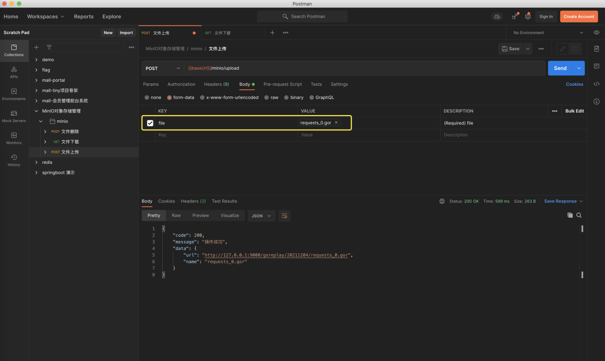

上传完成后，我们打开 MinIO 的管理界面，可以看到上传后的文件。

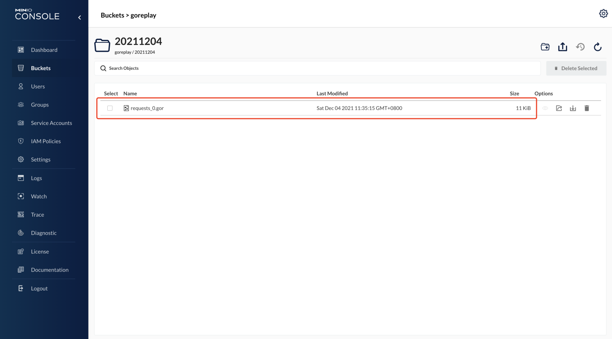

我们还可以调用删除接口来删除其中某文件，需要注意的是，objectName 参数值是存储桶（Buckets）中的文件相对路径，删除文件接口地址：<http://localhost:8080/minio/delete>。

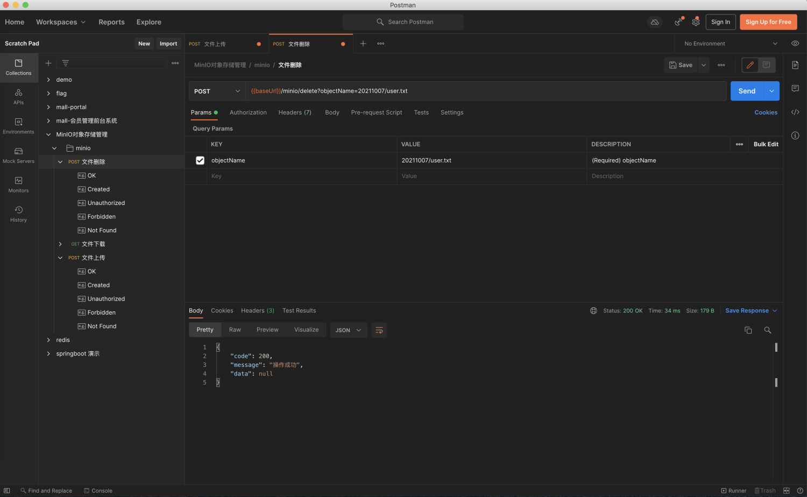

最后，我们还可以调用下载接口来下载文件，下载文件接口地址：<http://localhost:8080/minio/download>。

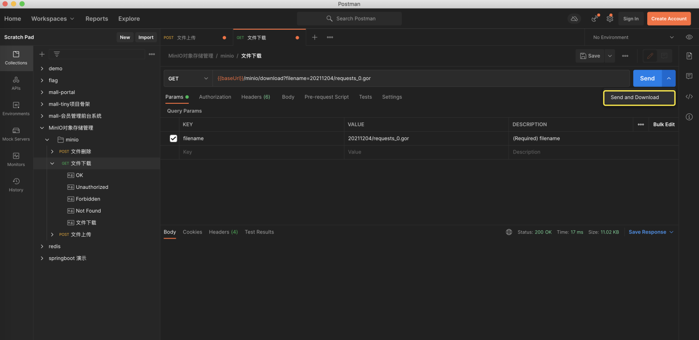

导出文件时填好文件名称，选择 **send and download**按钮就可以在 Postman 中下载文件了。

好了，到这里，我们的对象存储服务就改造完成了，这样，我们流量仓库的功能也就差不多实现了。

## 性能监控

接下来，我们要对 GoReplay 性能监控进行改造。

* GoReplay 统计请求队列信息

前面我们讲过， GoReplay 通过参数：-stats \--out-http-stats 在控制台将统计的发送请求队列信息默认每 5 秒输出到控制台。

下面是参数 \--stats \--output-http-stats 的说明：

```
    --stats  //打开输出队列的状态
            Turn on queue stats output
    -output-http-stats  //每5秒钟输出一次输出队列的状态
            Report http output queue stats to console every N milliseconds. See output-http-stats-ms
    -output-http-stats-ms int
            Report http output queue stats to console every N milliseconds. default: 5000 (default 5000)
    

```

统计并发送请求队列信息的核心代码主要会用到下面两个函数。

我们用 [output\_http.go](https://github.com/buger/goreplay/blob/master/output_http.go) 实现统计信息收集：

```
    // PluginWrite writes message to this plugin
    // 统计信息收集
    func (o *HTTPOutput) PluginWrite(msg *Message) (n int, err error) {
    	if !isRequestPayload(msg.Meta) {
    		return len(msg.Data), nil
    	}
    
    	select {
    	case <-o.stop:
    		return 0, ErrorStopped
    	case o.queue <- msg:
    	}
    
    	if o.config.Stats {
    		o.queueStats.Write(len(o.queue))
    	}
    	if len(o.queue) > 0 {
    		// try to start a new worker to serve
    		if atomic.LoadInt32(&o.activeWorkers) < int32(o.config.WorkersMax) {
    			go o.startWorker()
    			atomic.AddInt32(&o.activeWorkers, 1)
    		}
    	}
    	return len(msg.Data) + len(msg.Meta), nil
    }
    

```

[gor\_stat.go](https://github.com/buger/goreplay/blob/master/gor_stat.go) 类中用 NewGorStat 函数构造统计：

```
    // NewGorStat统计函数
    func NewGorStat(statName string, rateMs int) (s *GorStat) {
    	s = new(GorStat)
    	s.statName = statName
    	s.rateMs = rateMs
    	s.latest = 0
    	s.mean = 0
    	s.max = 0
    	s.count = 0
    
    	if Settings.Stats {
    		go s.reportStats()
    	}
    	return
    }
    

```

控制台输出的发送请求队列信息是这样的：

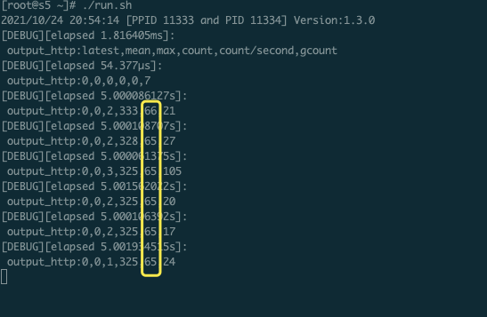

其中，倒数第二列等同于当前的TPS，但是这就是仅有的统计项了。如果想要更复杂的测试统计结果，就需要我们自己去埋点丰富监控指标了。

* GoReplay 埋点思路

在前面的课程中，我们已经选用了Exporter+Prometheus+Grafana作为我们全局的监控解决方案了，这里我们能不能把 GoReplay 的 Metrics 实时接入进来呢？

事实上是可以做到的。

我们先来看看 node\_exporter+Prometheus+Grafana套件的运行效果：

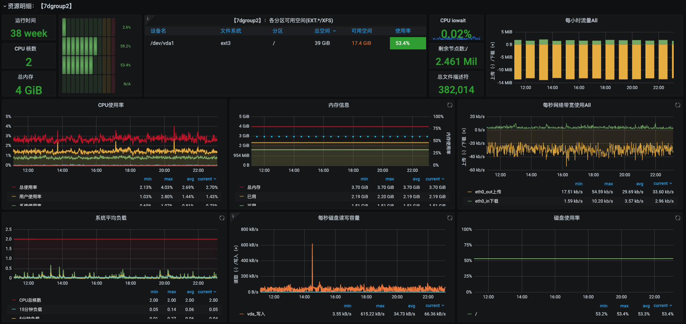

Prometheus 提供了 [官方版 Golang 库](https://github.com/prometheus/client_golang) ，用于采集并暴露监控数据。我们只需要埋点，让 GoReplay 支持实时 Metrics 统计就可以了。这样，在 GoReplay 执行流量回放时，我们就可以实时采集TPS和响应时间等各项压测指标了，另外，结合 Grafana 看板还可以做到图形可视化展示。

既然我们要去 GoReplay 埋点，那么就得知道去哪里埋，对吧？所以我们得先分析源码，找出 GoReplay 发出请求的代码，理清 GoReplay 埋点的思路。

在用 GoReplay 进行流量回放时，我们主要使用的是HTTP输出的插件[output\_http.go](https://github.com/buger/goreplay/blob/master/output_http.go) 。它通过实现 HTTP 协议， 进而实现 io.Writer 接口，最后根据配置注册到 Plugin.outputs 队列里。

在[output\_http.go](https://github.com/buger/goreplay/blob/master/output_http.go) 中， NewHTTPOutput 是默认初始化函数：

```
    // NewHTTPOutput constructor for HTTPOutput
    // Initialize workers
    func NewHTTPOutput(address string, config *HTTPOutputConfig) PluginReadWriter {
    	o := new(HTTPOutput)
    	var err error
    	config.url, err = url.Parse(address)
    	if err != nil {
    		log.Fatal(fmt.Sprintf("[OUTPUT-HTTP] parse HTTP output URL error[%q]", err))
    	}
    	if config.url.Scheme == "" {
    		config.url.Scheme = "http"
    	}
    	config.rawURL = config.url.String()
    	if config.Timeout < time.Millisecond*100 {
    		config.Timeout = time.Second
    	}
    	if config.BufferSize <= 0 {
    		config.BufferSize = 100 * 1024 // 100kb
    	}
    	if config.WorkersMin <= 0 {
    		config.WorkersMin = 1
    	}
    	if config.WorkersMin > 1000 {
    		config.WorkersMin = 1000
    	}
    	if config.WorkersMax <= 0 {
    		config.WorkersMax = math.MaxInt32 // idealy so large
    	}
    	if config.WorkersMax < config.WorkersMin {
    		config.WorkersMax = config.WorkersMin
    	}
    	if config.QueueLen <= 0 {
    		config.QueueLen = 1000
    	}
    	if config.RedirectLimit < 0 {
    		config.RedirectLimit = 0
    	}
    	if config.WorkerTimeout <= 0 {
    		config.WorkerTimeout = time.Second * 2
    	}
    	o.config = config
    	o.stop = make(chan bool)
    	//是否收集统计信息，统计输出间隔是多少
    	if o.config.Stats {
    		o.queueStats = NewGorStat("output_http", o.config.StatsMs)
    	}
    
    	o.queue = make(chan *Message, o.config.QueueLen)
    	if o.config.TrackResponses {
    		o.responses = make(chan *response, o.config.QueueLen)
    	}
    	// it should not be buffered to avoid races
    	o.stopWorker = make(chan struct{})
    
    	if o.config.ElasticSearch != "" {
    		o.elasticSearch = new(ESPlugin)
    		o.elasticSearch.Init(o.config.ElasticSearch)
    	}
    	o.client = NewHTTPClient(o.config)
    	o.activeWorkers += int32(o.config.WorkersMin)
    	for i := 0; i < o.config.WorkersMin; i++ {
    		go o.startWorker()
    	}
    	go o.workerMaster()
    	return o
    }
    

```

初始化配置后，启动 HttpClient 网络库：

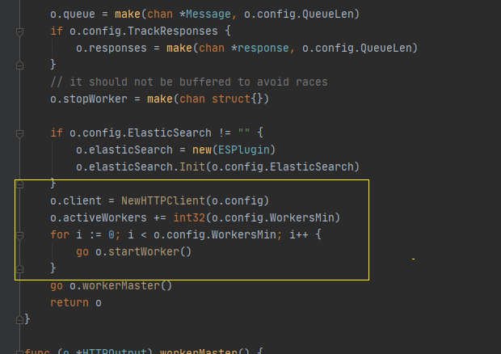

紧接着，HttpClient 会启动多个发送请求协程：

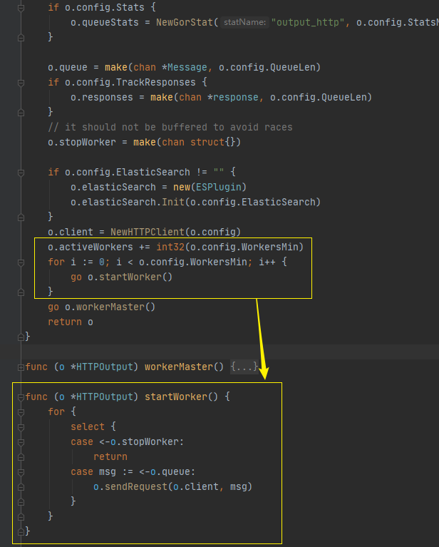

HttpClient 执行请求发送：

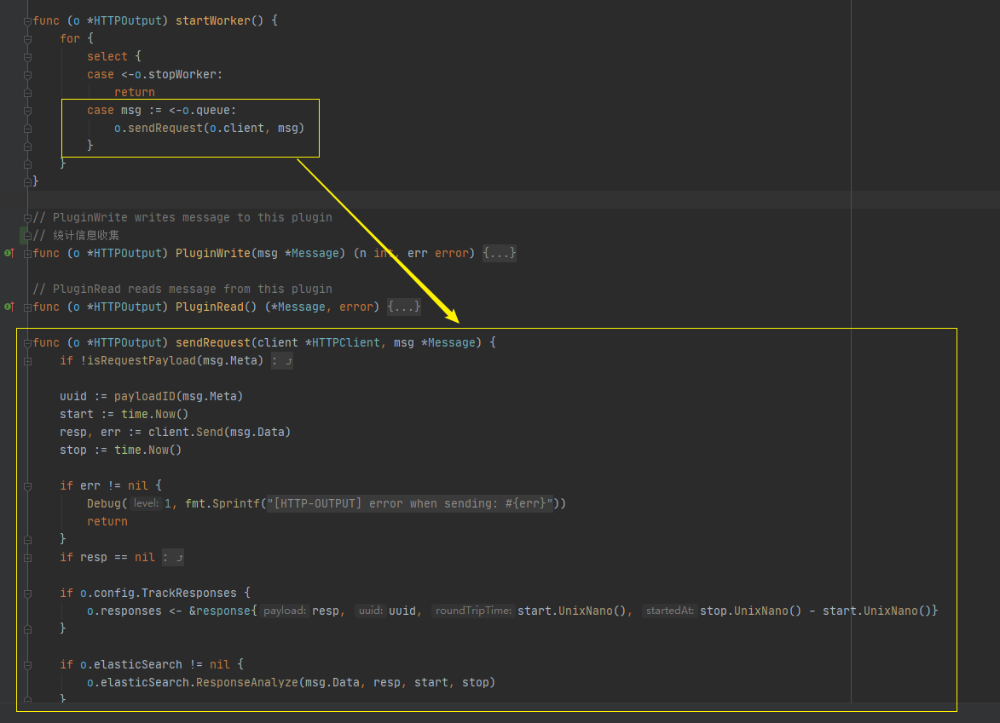

我们可以看看HttpClient 发送请求的细节，下面这张图中，我圈出的内容是各种配置的生效点：


为了对[output\_http.go](https://github.com/buger/goreplay/blob/master/output_http.go) 有一个更清晰的理解，你可以看看下面这张核心代码逻辑调用图：

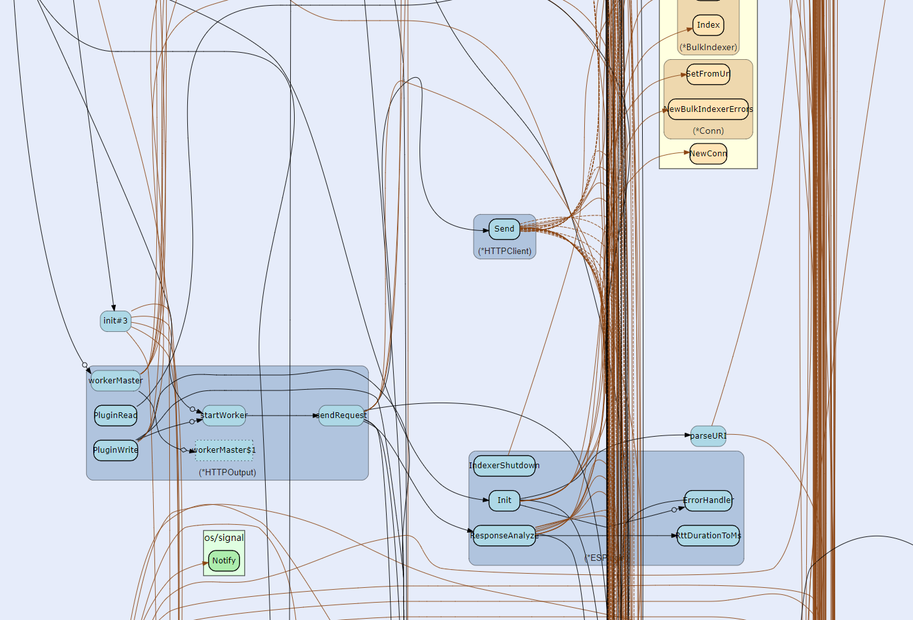

好了，搞懂了 GoReplay 发出请求的逻辑，接下来，我们就需要具体埋点了。

* GoReplay 实现埋点

我们之所以要埋点，主要是为了实现获取请求的状态码以及对应的 TPS，然后在获取请求返回值的位置插入对应的 Metric。

在此之前，我们先要了解 Prometheus 中常见的四大指标类型：

* Counter（计数器）：一个递增的计数器，只增不减，但是它可以被重置为0（例如重启服务）。常用于需要记录请求次数、错误数量的场景；
* Gauge（仪表盘）：可以用它来表示一个可以任意变化的浮动值，可增可减。常用于反馈当前情况的场景；
* Histogram（累积直方图）：多用于需要统计一些数据分布的情况。它可以计算在一定范围内的分布情况，同时还提供了度量指标值的总和。常用于记录请求延迟、响应大小等统计场景；
* Summary（摘要）：在一段时间范围内对数据进行采样，和 Histogram 累积直方图比较类似，主要用于计算在一定时间窗口范围内，度量指标对象的总数以及所有度量指标值的总和。

更多内容你可以参考 [Prometheus官网](https://prometheus.io/docs/instrumenting/writing_clientlibs/#counter)。

了解了基础概念，我们就来看看要怎么在 GoReplay 中进行改造。

第一步，通过 go get 命令来安装相关依赖库，示例如下：

```
    go get github.com/prometheus/client_golang/prometheus/promhttp
    

```

有关全面的 API 文档，你可以参考 Prometheus 的各种 Go 库的 [GoDoc](https://godoc.org/github.com/prometheus/client_golang) 文档。

第二步，创建 prometheus\_family.go 类，初始化监控 Metric。

```
    package metrics
    
    import "github.com/prometheus/client_golang/prometheus"
    
    // 创建 Prometheus 数据Metric, 就相当于SQL 数据库 声明table
    var (
    	//Counter（计数器）
    	totalRequestsCounter = prometheus.NewCounterVec(
    		prometheus.CounterOpts{
    			Name: "goreplay_total_requests",
    			Help: "total income requests",
    		},
    		[]string{"location", "code"},
    	)
    	//Counter (计数器)
    	subRequestsCounter = prometheus.NewCounterVec(
    		prometheus.CounterOpts{
    			Name: "test_sub_requests",
    			Help: "sub requests",
    		},
    		[]string{"test"},
    	)
    	//Gauge（仪表盘）
    	circuitBreakerRateGauge = prometheus.NewGaugeVec(
    		prometheus.GaugeOpts{
    			Name: "goreplay_circuit_breaker_rate",
    			Help: "rate of circuit breaker",
    		},
    		[]string{"location", "code"},
    	)
    
    	buckets = []float64{0, 100, 200}
    	// Histogram(累积直方图)
    	totalRequestsTimeHistogram = prometheus.NewHistogramVec(
    		prometheus.HistogramOpts{
    			Name:    "goreplay_total_requests_time",
    			Help:    "income requests time",
    			Buckets: buckets,
    		},
    		[]string{"location"},
    	)
    
    )
    
    // 注册定义好的Metric 相当于执行SQL create table 语句
    func init() {
    	prometheus.MustRegister(totalRequestsCounter)
    	prometheus.MustRegister(subRequestsCounter)
    	prometheus.MustRegister(circuitBreakerRateGauge)
    	prometheus.MustRegister(totalRequestsTimeHistogram)
    }
    
    func IncreaseTotalRequests(location,code string) {
    	totalRequestsCounter.With(prometheus.Labels{"location": location, "code": code}).Add(1)
    }
    
    func IncreaseSubRequests() {
    	subRequestsCounter.With(prometheus.Labels{}).Add(1)
    }
    
    
    
    func ObserveTotalRequestsTimeHistogram(location string, d float64) {
    	totalRequestsTimeHistogram.With(prometheus.Labels{"location": location}).Observe(d)
    }
    

```

这里，我在项目中创建了 package metrics，初始化了 API 请求相关的 Metric，并且注册到了github.com/prometheus/client\_golang/prometheus 。

第三步，改造 output\_http.go 类，在业务代码中采集数据。

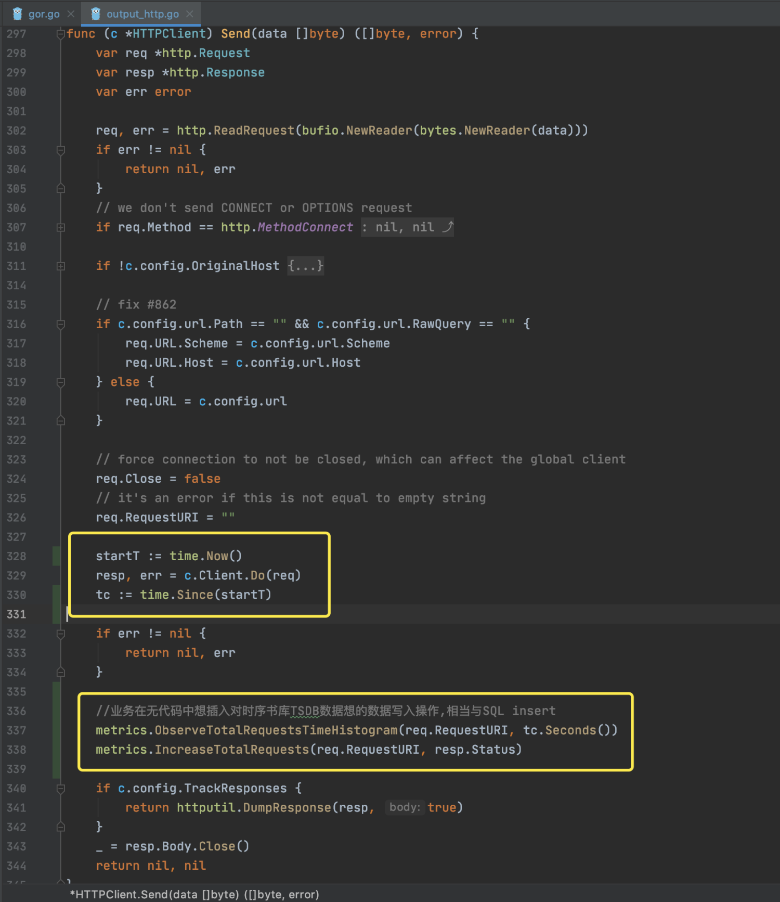

从这张截图可以看到，我们为了获取请求状态码以及对应的TPS，在获取请求返回值的位置插入了counter metric；为了获取不同请求的响应时间等指标，我们还需要在发出请求前记录开始时间，待请求返回后记录结束时间，同时还要记录时间消耗的 Histogram Metric。

这里大家可以举一反三，扩展其它的 Metric。

第四步，改造 main.go ，进行 Metric 注册，提供/metric 接口给 Prometheus TSDB 时序数据库收集数据。

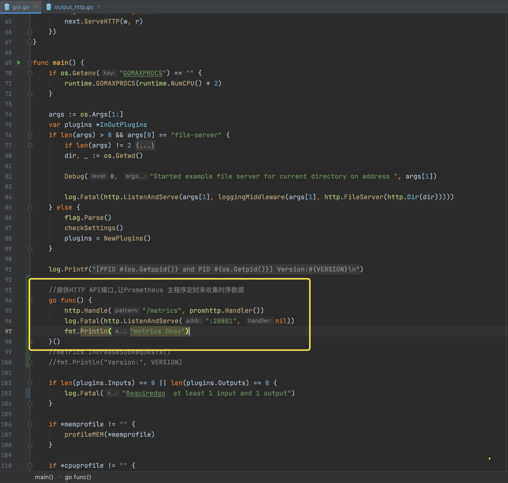

第五步，重新编译 GoReplay 程序。

在代码所在目录（./src/goreplay）下使用 go build 命令。

```
    go build
    

```

第六步，在启动 GoReplay 进行流量回放时，查看监听端口，可以看到我们注册的端口 28081，访问接口：<http://localhost:28081/metrics>。

```
    。......
    
    # HELP goreplay_total_requests total income requests
    # TYPE goreplay_total_requests counter
    goreplay_total_requests{code="200 ",location=""} 22
    # HELP goreplay_total_requests_time income requests time
    # TYPE goreplay_total_requests_time histogram
    goreplay_total_requests_time_bucket{location="",le="0"} 0
    goreplay_total_requests_time_bucket{location="",le="100"} 22
    goreplay_total_requests_time_bucket{location="",le="200"} 22
    goreplay_total_requests_time_bucket{location="",le="+Inf"} 22
    goreplay_total_requests_time_sum{location=""} 2.1513923769999996
    goreplay_total_requests_time_count{location=""} 22
    # HELP promhttp_metric_handler_requests_in_flight Current number of scrapes being served.
    # TYPE promhttp_metric_handler_requests_in_flight gauge
    promhttp_metric_handler_requests_in_flight 1
    # HELP promhttp_metric_handler_requests_total Total number of scrapes by HTTP status code.
    # TYPE promhttp_metric_handler_requests_total counter
    promhttp_metric_handler_requests_total{code="200"} 20
    promhttp_metric_handler_requests_total{code="500"} 0
    promhttp_metric_handler_requests_total{code="503"} 0
    

```

第七步，在Prometheus 主程序中拉取采集数据。

在Prometheus主程序的配置文件中填写第四步的API接口信息，这样，Prometheus TSDB 时序数据库就可以开始定时收集 Metric 数据了。

```
    ###################### GoReolay ######################
    - job_name: "GoReolays5"
      static_configs:
      - targets: ['172.31.184.225:28081']
        labels:
          instance: s5
    

```

第八步，在 Grafana 做图形数据展示。

Prometheus 提供了一种功能表达式语言 PromQL，这种语言可以允许用户实时选择和汇聚时间序列数据。另外，表达式的结果可以在结合 Grafana 的控件中显示为图形，也可以显示为表格数据，或者由外部系统通过 HTTP API 调用，因为篇幅有限，网上关于这部分的资料又很多，这里我就不多说了。

到这里，我们对 GoReplay 的埋点改造工作就做完了，通过 Metric 实现了从客户端统计压测过程中的各项指标。

## 总结

好，这节课就讲到这里。

刚才，我们介绍了流量平台的对象存储和性能监控功能的选型及改造，我还对这两个部分做了详细的演示。通过结合 MinIO Server 和 HTTP 服务，我们可以实现程序二进制包、执行器 jar 包、流量文件等文件管理，并能够使用通用的 HTTP 上传下载功能。另外，通过 Prometheus 在GoReplay 埋点，我们还进一步丰富了性能监控指标。

在当前的全链路压测的市场中，对全链路压测工具的分布式改造总是讳忌莫深的部分，而压力工具对全链路压测来说，目标是能够实现足够的流量即可。从本节课的内容可以看到，相比传统的压力工具，全链路压测工具在改造上的技术成本还算是高的，但值得欣慰的是开源的工具也是完全可以实现的。

下一节课，我们将继续讲解分布式改造的各环节，我会通过案例给你演示怎样进行分布式调度改造工作。

## 课后题

学完这节课，请你思考两个问题：

1.  你有没有做过 Prometheus 埋点，谈谈你对业务埋点的一些心得吧！
2.  相比文件系统，你觉得对象存储的优势在什么地方？

欢迎你在留言区与我交流讨论。当然了，你也可以把这节课分享给你身边的朋友，他们的一些想法或许会让你有更大的收获。我们下节课见！