---
date: "2019-06-23"
---  
      
# 26 | 全局监控（上）：如何快速落地全局监控？
你好，我是高楼。

在第7讲中，我们已经讲解了如何设计全链路压测的全局监控。其中的主要逻辑是：  
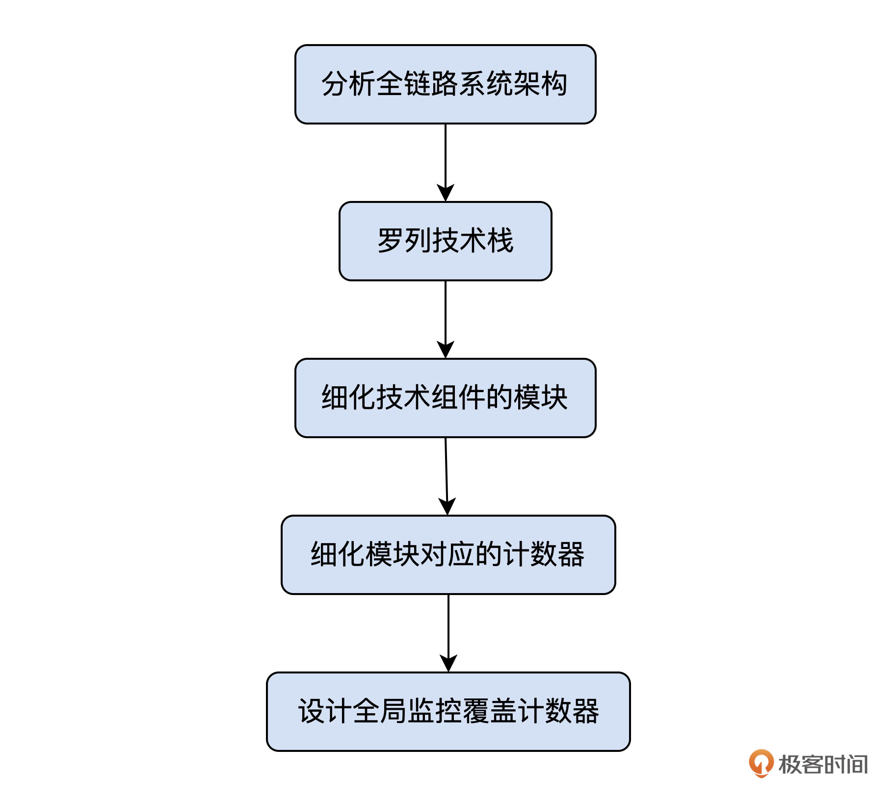

根据这个逻辑呢，我们可以得出下面这样的性能分析决策树：

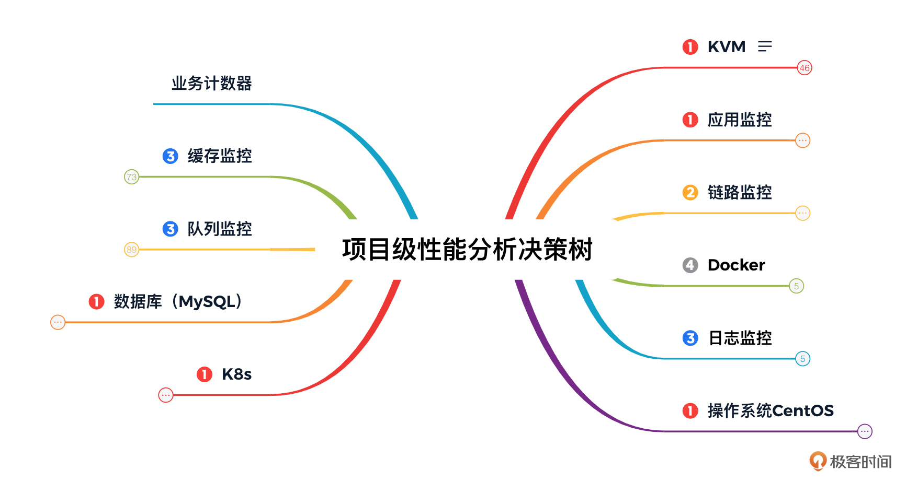

为了实现对这个性能分析决策树中所有计数器的监控，我们要将需要监控的组件，一一对应监控工具。整体视图如下：

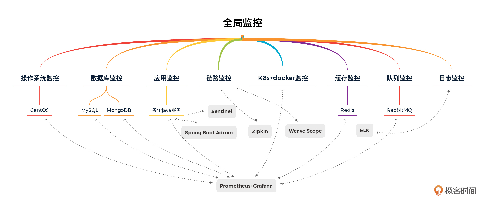

这张图其实我们前面也已经见过好几次了。从图里我们可以看出，这个项目中需要用到哪些监控工具。

这里你就要注意了，虽然我们选择了这些监控工具，但这只是因为这个工具相比其他工具，更多地覆盖了前面列出的计数器。但！并不是说，这些工具就覆盖了**全部**的计数器。

下面，我们就来看看这些工具到底能做哪些内容。因为全局监控的内容比较多，所以我会分两讲，挑选最为常见并且重要的几个组件为你拆解。这节课呢，我们的重点是拆解k8s+docker监控、操作系统监控和数据库监控。

## k8s+docker监控

对于k8s+docker的监控，主要的全局监控计数器如下所示：

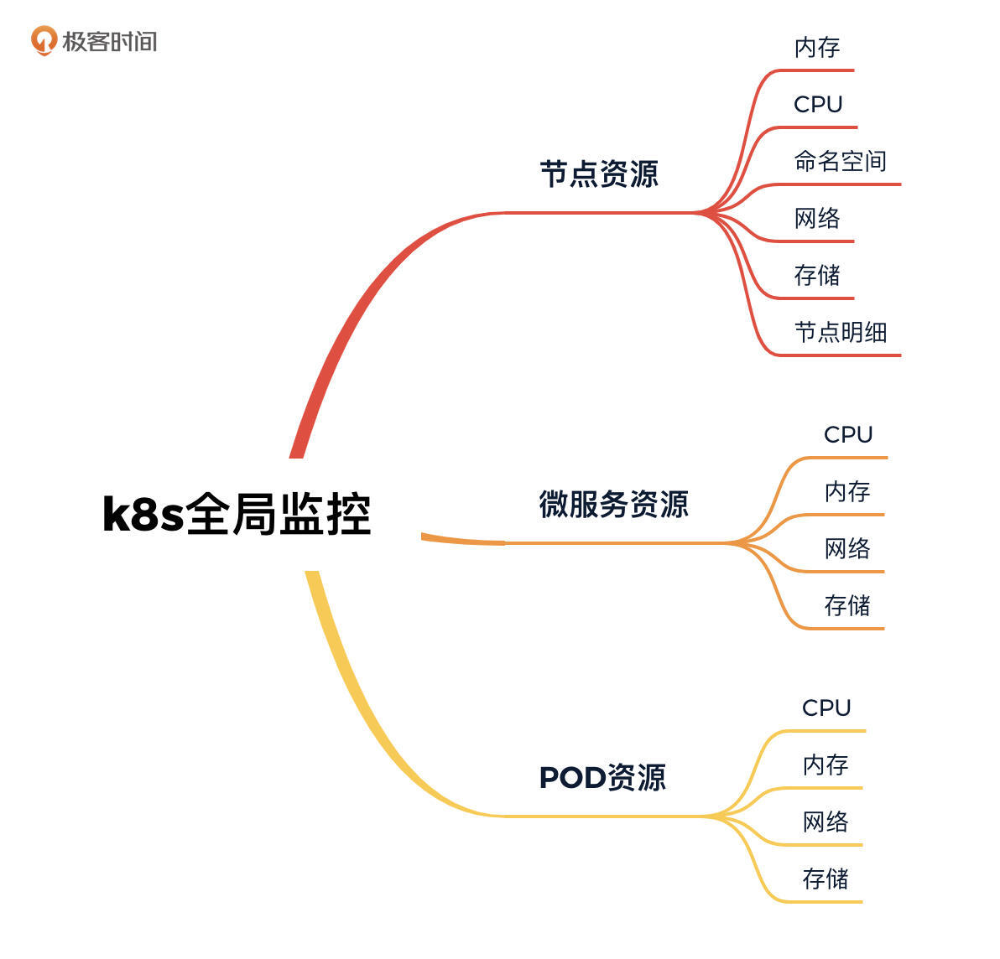

为了实现对k8s+docker的全局监控，我希望能有工具可以把这些关键的性能计数器都展示出来，于是这里我选择了cAdvisor+Prometheus+Grafana的组合。如果你对安装部分感兴趣，可以参考上一讲[《环境搭建：我们的系统是怎么搭建起来的？》](https://time.geekbang.org/column/article/467606)。

<!-- [[[read_end]]] -->

针对我们列出的全局监控计数器，这个监控套件都可以满足，并且它以不同的视角给出了不同的图形。

### 节点资源总览

节点资源总览的上半部分是所有节点的总体统计数据，下半部分是每个节点的明细数据。这都是以节点为维度来展示的。

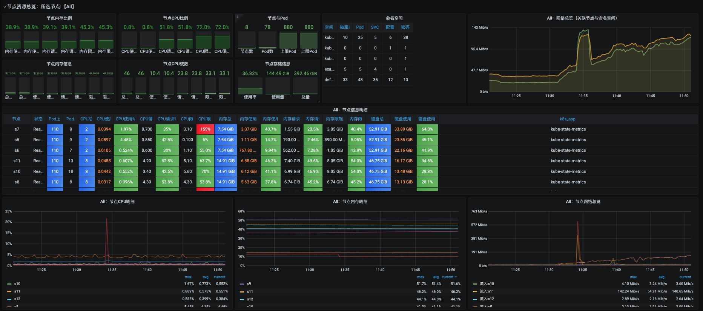

通过这个视图，我们可以看到每个Worker的当前使用状态，并判断出资源是否被过度请求。

我们再来看看节点信息的明细数据。

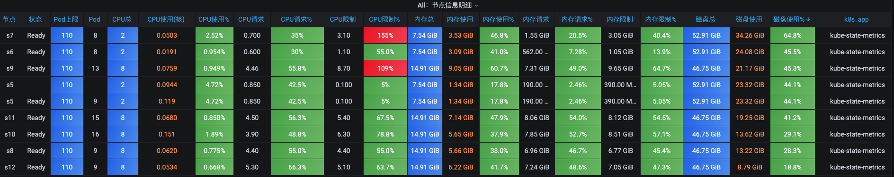

这个图主要分为三个部分：CPU、内存、磁盘。我们可以在图里看到各资源总数、使用率、请求比例、限制等信息。

看到图里那两条红色的CPU使用率\%没有？它为什么是红色的呢？拿上面那一条来说，由于CPU限制在配置时达到了3.10，而CPU总数只有2个，所以就是\$3.1\\div2=155\%\$，这就意味着，在这个节点上，如果所有的POD都满负荷运行起来的话，就会出现抢资源的情况。你可以到这个节点上去看一下，k8s自动调度了哪些POD在这台机器上。

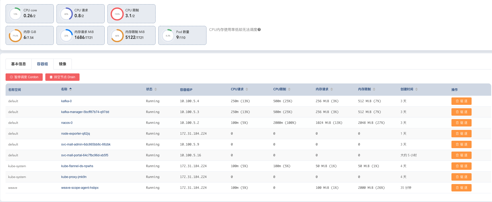

从这张图可以看到，其中的Kafka、Nacos、Flannel 几个节点配置的CPU限制加在一起就达到3.1了，并且这里面还有些POD是没有配置CPU和内存限制的。这就意味着，在大压力的场景下，如果这些POD都满负荷运转起来，那必然会出现抢资源的情况。

但上面的数据都是表格的形式，想要用表格来判断一段时间的趋势是不行的。而我们做性能分析的时候，必然要看的就是，一个场景在它的执行时间段里的资源使用率的趋势图。所以这个监控界面又很贴心地给出了几个曲线图。

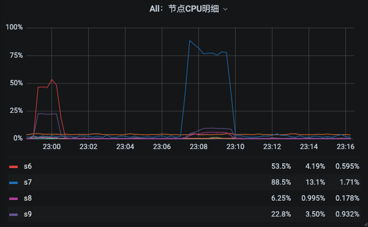

在这样的曲线图中，你一旦选择了场景执行时间段，就可以非常容易地判断出是哪个节点的CPU使用率高了。这样，你就可以直接到这台机器上去进一步定位资源使用率高的进程了。

内存部分的计算和CPU的逻辑也是一致的。

而对磁盘监控来说呢，cAdvisor+Prometheus+Grafana的组合在这个视角上除了能看到磁盘使用率，其他的倒没有特别有用的信息。而磁盘使用率其实对我们做性能分析的来说，只要不用完，通常是不用怎么关心的。我们更需要关心的是磁盘计数器的读写，而不是使用率。

对于网络来说呢，这部分给出了两个图，一个是所有的节点网络总览图，另一个是每个节点的进出字节数。

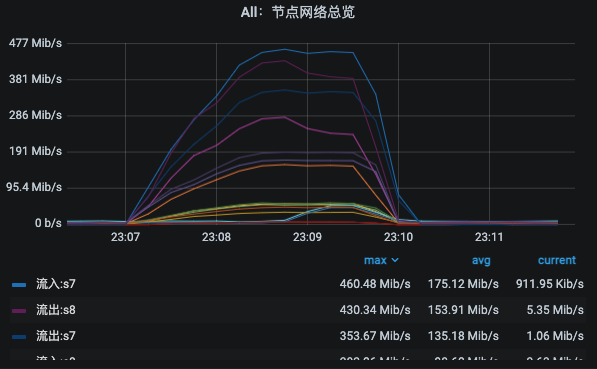

这也可以让我们对网络有个基础的判断。

### 微服务资源总览

在微服务资源总览部分，我们也可以看到和节点资源总览同样的结构。它的上半部分是表格，用来展示每个微服务的CPU、内存、磁盘、容器数的信息。下半部分呢是曲线，用来展示每个微服务的CPU、内存、网络信息。

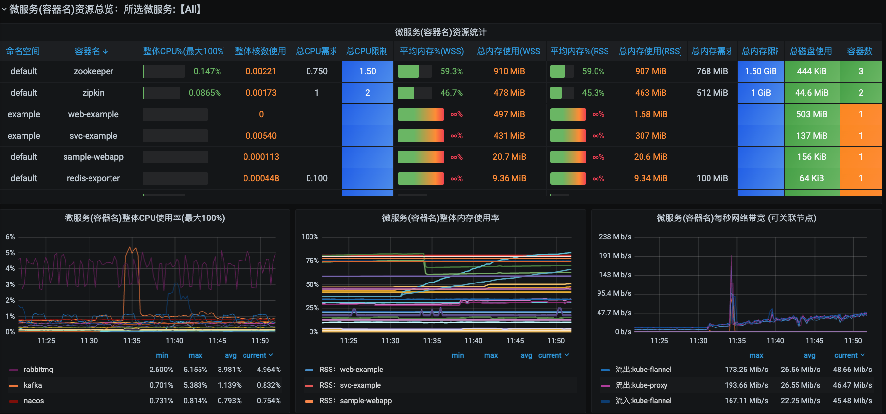

我一直在强调要使用曲线来观察性能的趋势，意思就是在每个视角上都应该用这样的曲线图来展示性能的趋势。

针对微服务来说，如果配置了CPU和内存的限制，也就是限制了整个微服务中的所有副本。为什么能得到这样的结论呢？我们一起来解析一下。

比如说，上图中我们看到Zookeeper的总CPU限制是1.50，我们可以先去查一下总共有几个Zookeeper副本。

```
    [root@s5 ~]# kubectl get pods -n default -o wide | grep zookeeper
    zookeeper-0                               1/1     Running   5          3d1h    10.100.7.34      s11    <none>           <none>
    zookeeper-1                               1/1     Running   0          3d1h    10.100.2.8       s9     <none>           <none>
    zookeeper-2                               1/1     Running   0          3d1h    10.100.1.4       s6     <none>           <none>
    [root@s5 ~]#
    

```

从查询结果来看，总共是3个ZooKeeper副本分别分布在不同的Worker节点上。那我们再来查一ZooKeeper的配置文件：

```
    [root@s5 ~]# kubectl describe pod zookeeper -n default
    Name:         zookeeper-0
    Namespace:    default
    Priority:     0
    Node:         s11/172.31.184.230
    .....................
        Restart Count:  5
        Limits:
          cpu:     500m
          memory:  512Mi
        Requests:
          cpu:      250m
          memory:   256Mi
    .....................
    
    Name:         zookeeper-1
    Namespace:    default
    Priority:     0
    Node:         s9/172.31.184.228
    .....................
        Limits:
          cpu:     500m
          memory:  512Mi
        Requests:
          cpu:      250m
          memory:   256Mi
    .....................
    Name:         zookeeper-2
    Namespace:    default
    Priority:     0
    Node:         s6/172.31.184.226
    .....................
        Limits:
          cpu:     500m
          memory:  512Mi
        Requests:
          cpu:      250m
          memory:   256Mi
    .....................
    

```

看到这些配置内容了吧，上面的1.50就是从三个 ZooKeeper 副本上的CPU限制（500m）相加得来的。

内存的计算逻辑和CPU一致。磁盘的部分在微服务的视角上那就更没有太多要说的了。因为这里只有一个总磁盘使用大小，只要微服务不会无限地使用磁盘，通常都不用太过关注。

微服务的网络部分是从微服务的视角出发，来计算进出两个方向的带宽的。

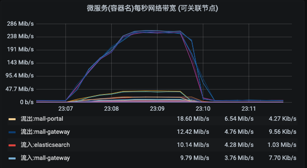

请注意，这里也同样是计算了所有副本的带宽的。

### POD资源总览

在POD资源总览部分，我们可以看到它的上半部分是表格，展示的是每个POD的CPU、内存、磁盘、容器数的信息。而下半部分呢是曲线，展示的是每个POD的CPU、内存、网络信息。

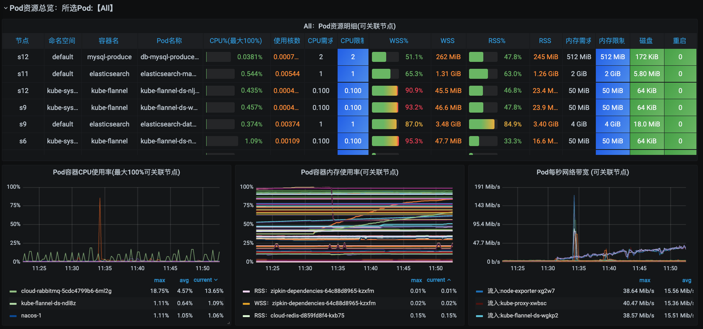

这里你就要注意一下了，这里是每个微服务下所有的POD都会一一分开展示。而CPU和内存的限制逻辑也和微服务一致，只是这里统计到了每一个POD，而微服务部分是把所有POD副本都加到一起了。

内存的部分，这里分为了WSS（Working Set Size，指一个应用正常运行必须的内存）和RSS（Resident Set Size，实际使用的物理内存，包含与其他进程共享占用的内存）两个视角。

磁盘也只有一个总使用大小，这里不多说它。网络部分呢，这里也从每个POD的视角给出了进出两个方向的带宽大小。

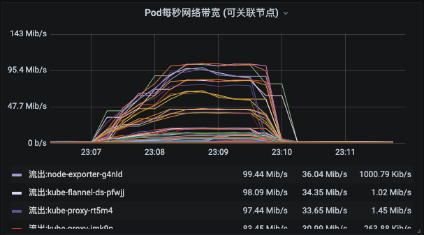

从以上三个资源总览视图我们可以看到，这三个资源视角在逻辑上是合理递进的。对于微服务分布式架构来说，微服务是包括多个POD的，而节点上是运行多个POD的，微服务是逻辑划分，而节点和POD是具体的承载。

所以，只要从这三个视角来分析，就可以让你快速找到是哪个节点或哪个微服务消耗的资源多。

关于k8s，我在这个专栏里主要描述和应用相关的部分。如果想对它有更系统的了解的话，你可以去找相关内容有针对性地学习。

## 操作系统监控

对操作系统的监控，我在之前的专栏中已经讲过很多次了。在这里呢，我再带着大家往深处多走几步。

我还是先把操作系统的全局监控计数器列出来给你看一下。

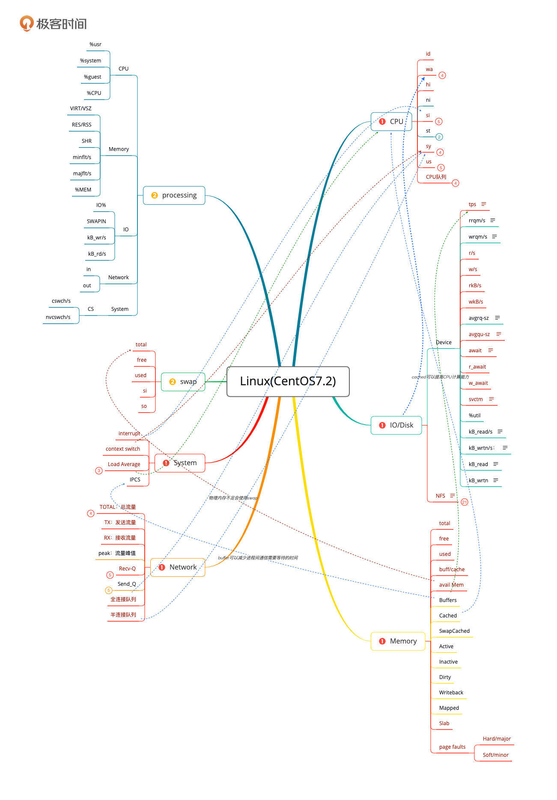

在操作系统层面，对于性能分析来说，我经常看的计数器就是上图中的红色计数器部分。这里我们选择Prometheus+Grafana+node\_exporter来实现监控。你可以参考一下下面这几张监控图：

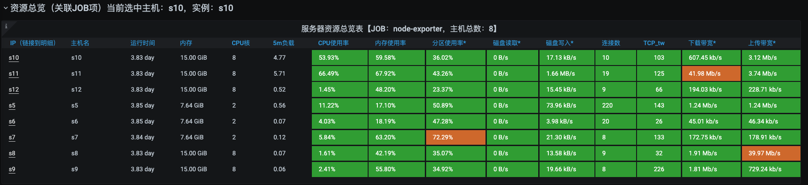

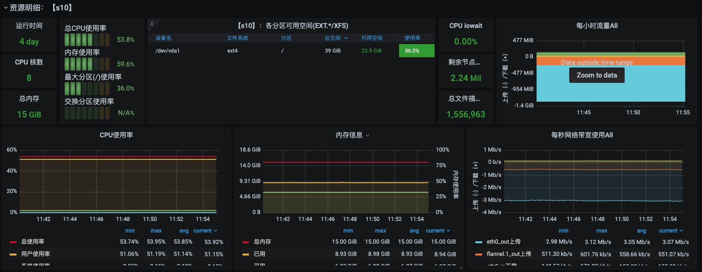

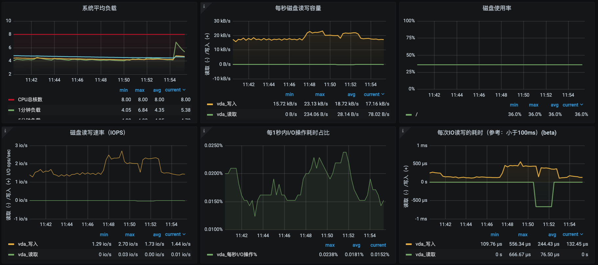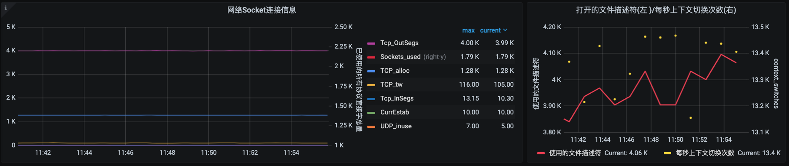

从监控图中可以看得出，我们的计数器已经非常丰富了。

第一张图是节点资源的总览视图，它同样也是以表格来展现的，这一点和k8s部分的节点信息明细视图虽然有点像，但还是有区别的。在k8s部分的节点信息明细视图中，资源是以请求及限制的逻辑来计算的，而在这个视图中是以实际使用来计算的。比如说吧，CPU使用率在k8s部分的节点信息明细视图中是以CPU核数来计算的，这种算法比较粗犷；而在上面这个视图中就比较精细了，它是以CPU时钟来计算的，所以具体的数值在这个视图中会更为精准。

那这样丰富的视图是不是就覆盖了前面所列出的所有全局计数器的需求了呢？其实并没有。在CPU、内存、网络和系统部分，其实都是存在一定缺陷的。

### CPU部分的缺陷

比如说CPU部分。我在思维导图中列出的是下面这些计数器：

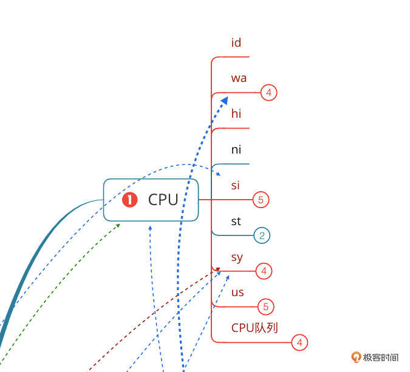

这里一共有9个计数器。但是在这个监控视图中，我们只看到了4个。

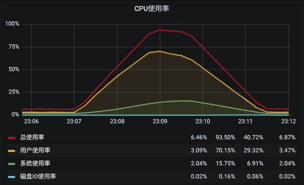

虽然这已经是比较常用的CPU计数器了，但是对我们做性能分析的人来说，仍然是不够的。我们需要看所有的计数器才可以，同时我们还要看**每个CPU的每个计数器**的值才可以。而这一点在这个监控套件中是实现不了的。

### 内存部分的缺陷

再来说说内存部分的缺陷。我在思维导图中列出的内存计数器如下：

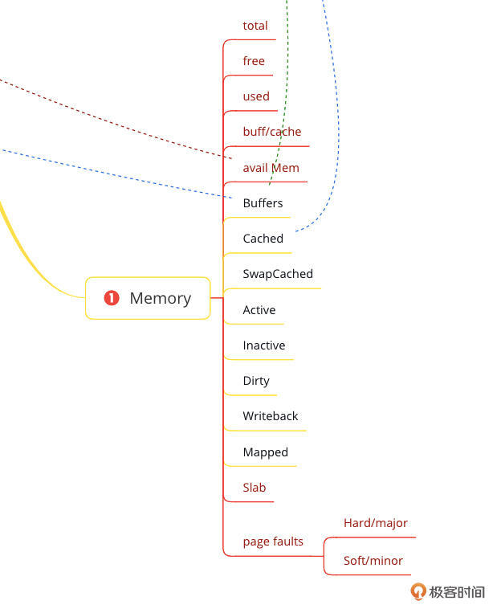

而在这个监控套件中只有已用内存、可用内存和内存使用率。这显然也是不够的，通常我们判断内存够不够用是要靠page faults的，而这个关键的计数器在这个监控套件中居然没有。

其实你去node\_exporter（Grafana展现的数据是通过Prometheus到node\_exporter中取出的）中去看也是没有和page faults相关计数器的，不得不说这个是大麻烦。

那在做具体内存相关的分析的时候，你就要登录到主机中，执行sar、pidstat等相关的命令去查看系统级和进程级的page faults数据了。

### 网络部分的缺陷

再来说一下网络部分的缺陷。我在思维导图中列出的网络计数器如下：

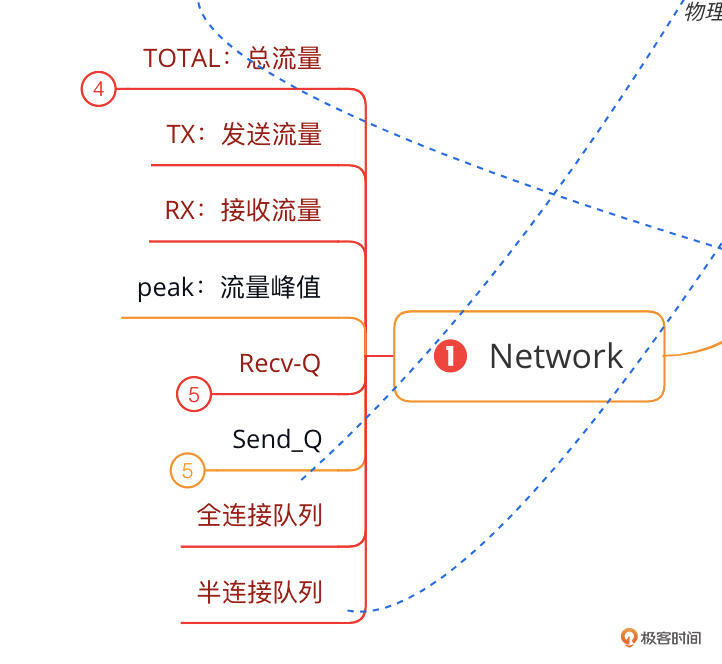

在我选择的监控套件中，网络流量是可以看到的，也区分了不同的网卡，也区分了进出带宽。

但是这里我列的队列却是没有的。全连接队列和半连接队列是用来判断TCP连接能不能建立的重要计数器，同时，对于网络到底堵在了哪个节点上，Recv\_Q（接收队列）和Send\_Q（发送队列）也是非常重要的判断依据。这里都缺失了。

这就导致我在做网络性能瓶颈判断时，通常都不看这个监控套件中的数据，而是直接到主机上执行netstat、iftop等命令来判断网络问题。

### 系统部分的缺陷

再来说一下系统部分的缺陷。我在思维导图中列出的系统计数器如下：

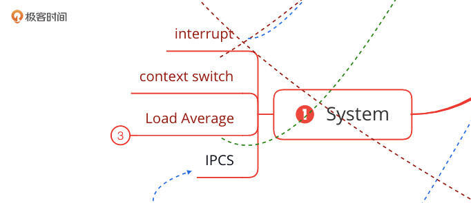

注意：上图中的Load Average放在这里，只是为了方便我自己在做这个全链路压测项目时，来理解系统相关的内容，这个计数器应该放在CPU部分。

在我选择的这个监控套件中，是缺少interrupt（中断）相关的计数器的。在CPU的部分有hi/si两个计数器来标明硬中断和软中断消耗的CPU。但是在做性能分析时，我们还需要软硬中断的具体次数。而这个具体次数是存放在Linux操作系统的proc目录中的interrupts和softirqs两个文本中的。所以当你需要的时候，就要去查看这两个文本了。

不过，对于磁盘部分，这个监控套件倒是够用的。

好了，刚才我们细数了操作系统监控套件的这么多缺陷。那既然问题这么多，为什么我们还要选择它呢？**因为在现在的技术市场上，这已经是最好用的监控工具了**。它可以原生支持k8s，并且也确实提供了相当多有用的计数器数据。

只不过，我们还是要知道这些缺陷，具体分析的时候呢，先从监控视图判断有没有瓶颈点，再根据判断到相应的节点中进一步查看更详细的计数器，那就是定向监控的部分了。幸好这部分需要弥补的计数器，可以通过自行扩展node\_exporter去实现。

## 数据库监控

我们下面再来看看数据库的性能监控分析。这里我拿MySQL举个例子。

虽然MySQL在被Oracle收购之后，前景变得越来越不明朗，很多企业为了寻求心理上的安全感还停留在5.x的版本，也有企业已经转向了MariaDB。同时呢，国内还有很多厂商使用MySQL的开源代码改造自己的数据库，并且也有企业付之商用。

但是，在现在开源的市场上，MySQL数据库仍然是大部分企业选择的关系型数据库，所以我还是拿它来做个说明。

### MySQL性能监控

先来看一下我经常使用的MySQL性能分析决策树的思维导图。

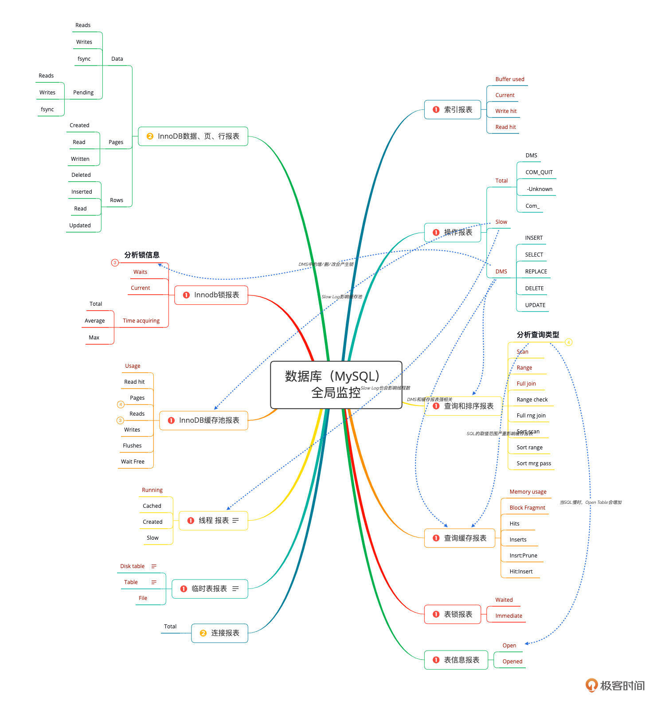

在MySQL的分析中，我还是遵从自己的习惯，着重先看图上红色的计数器。从我的经验中来看，这些计数器已经可以覆盖大部分的性能问题了。

我们知道对于关系型数据库来说，它的功能就是执行增删改查的SQL。我们只要能让SQL执行得足够快就好了。为了直观地看到SQL执行得快不快，针对罗列的计数器，我们选择通过Prometheus+Grafana+mysql\_exporter套件来实现对MySQL的全局监控。下面是它具体的展示效果。

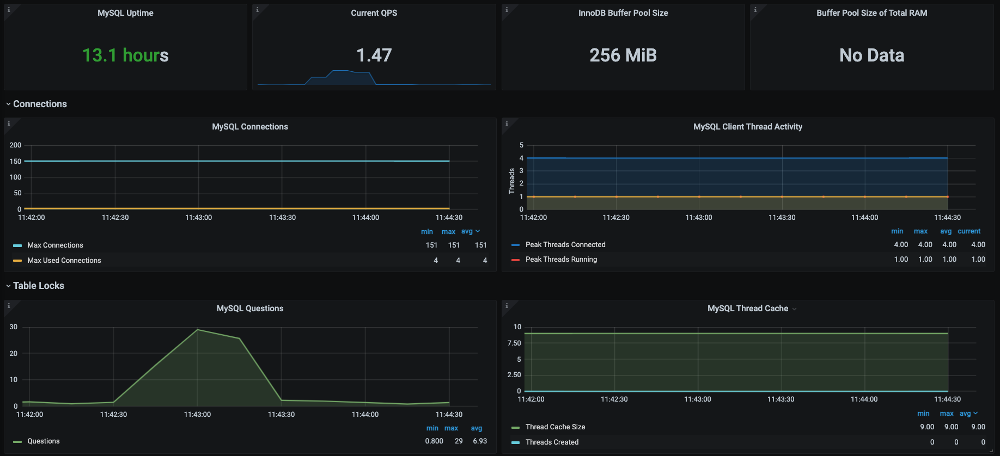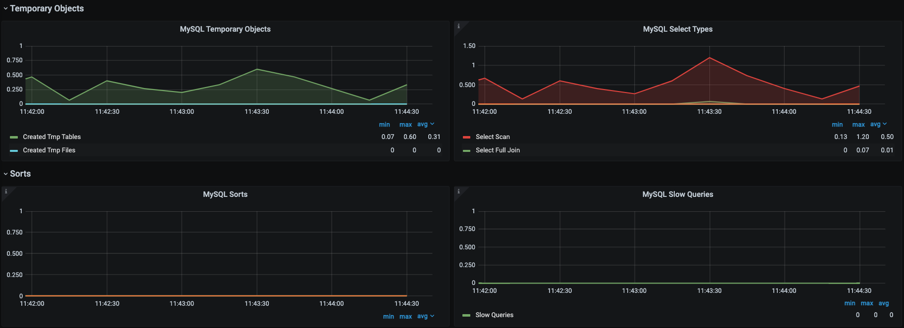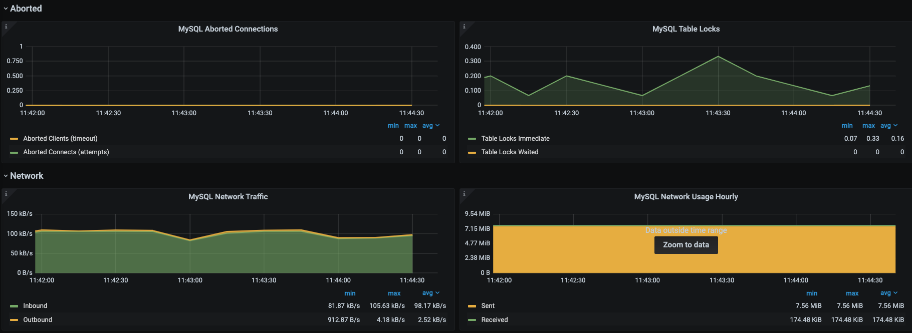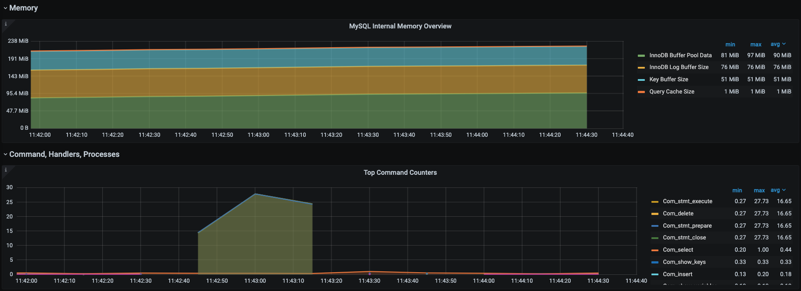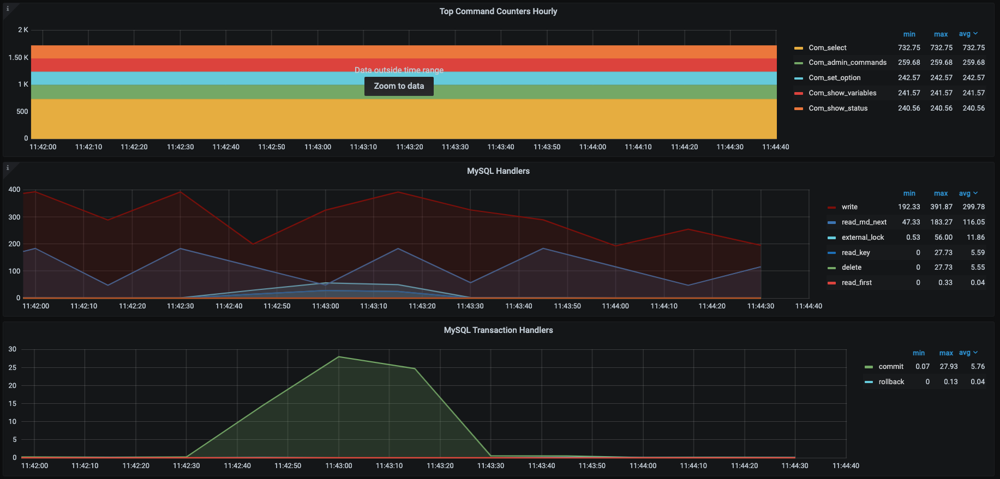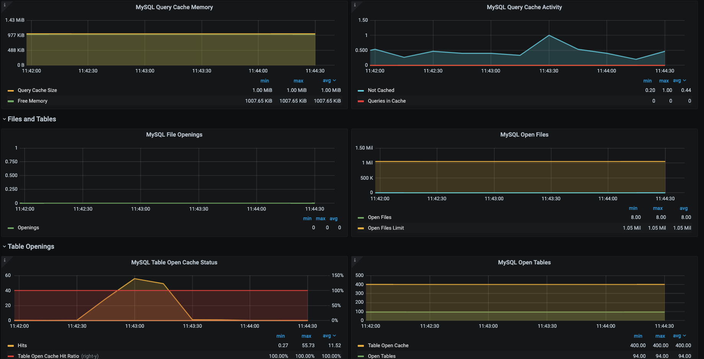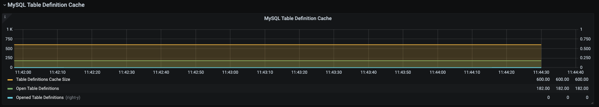

这些图中的数据和思维导图中的数据基本上是可以对应上的，所以这是我经常使用的一个MySQL监控模板，对我来说，这个监控套件没有缺陷。因为它不仅包括了我想要的计数器，还都是有趋势图的，历史数据也可以保存，perfect\!

不过，我们总会遇到没有Grafana+Prometheus的场景。这时，我建议你使用mysqlreport，mysqlreport是对mysql状态的一个快照。这个快照是包括了启动以来的所有状态信息的，所以我建议你在执行性能场景之前先刷新一遍状态值，甚至可以考虑重启一下MySQL数据库（当然这个动作过大，你也要考量一下之后再做），争取取到的状态和执行的性能场景有着直接的关系。

当然，在MySQL中即使有了上面的全局监控思路，还是缺少了重要的一个环节，那就是慢日志。慢日志是分析MySQL不得不提的一个重要功能模块。在慢日志的分析中，我常用的工具是两个pt-query-digest和mysqldumpslow。因为我需要用它们统计慢日志的执行次数和执行时间（总时间和平均时间），然后对慢日志进行排序。

mysqldumpslow的执行语句如下：

```
    mysqldumpslow -s t -t 10 TENCENT64-slow.log.last
    

```

执行的结果如下：  
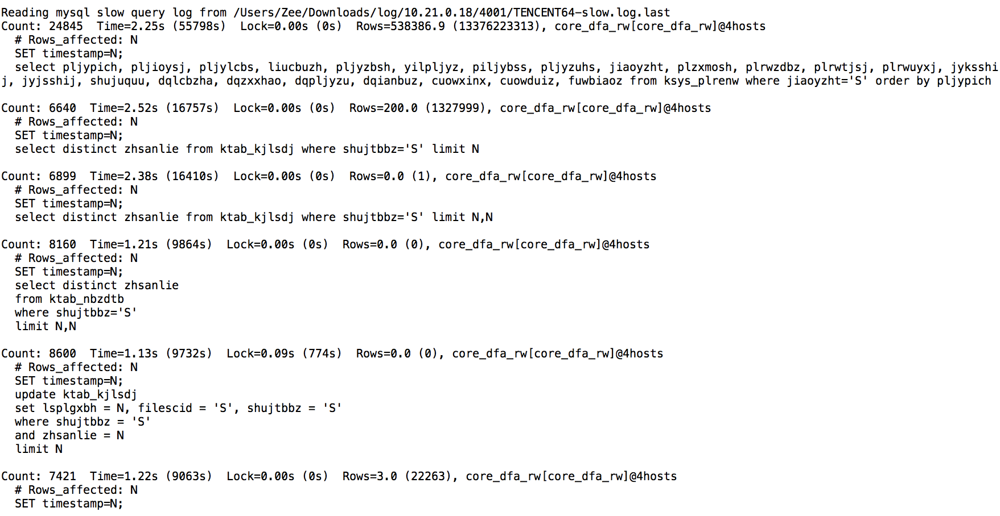

pt-query-digest的执行语句：

```
    pt-query-digest TENCENT64-slow.log.last
    

```

结果如下：  
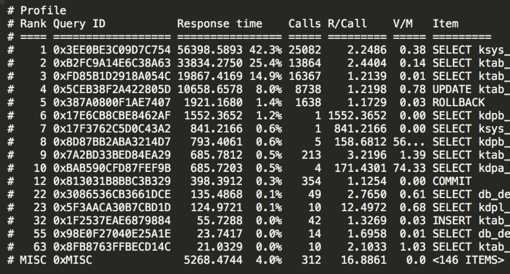

在上面的结果中，可以看到调用次数（mysqldumpslow中是Count，pt-query-digest中是Calls）和时间（mysqldumpslow中是Time，pt-query-digest中是Response Time）两个关键的排序参数，而且结果中也给出了具体的SQL。当我们看到某个SQL占比较高时，就需要进一步定向分析这个SQL的执行计划或者Profile信息了。

## 总结

好，这节课就讲到这里啦。

在微服务分布式架构盛行的技术市场中，k8s和docker作为容器编排和容器中的绝对的翘楚，是不能不说的环节。作为性能测试和性能分析的人，如果不理解它们的原理和逻辑，那就算你看到监控工具炫丽的界面也会毫无知觉。所以在这节课中，我们描述了这一部分的资源监控结构。

同样，我也描述了操作系统和数据库相关的监控逻辑，把我工作中最常用的判断逻辑和相应的计数器展示给你了。

对于监控工具，我一直在强调，就是不仅要知道有哪些计数器，还要知道每个计数器的含义和作用。我这不是要你完全都记在脑子里，而希望当你发现一个问题时，能知道下一步要做什么才能进一步做判断。

我们一直都在说云架构，而云架构对于上层应用来说，还是要看用哪个具体的计数器来判断性能瓶颈，这是需要逻辑的。并不是说提到了云架构，我们就要换一套全新的计数器了。还有人一提到“信创”这样的新词就是蒙的，搞得好像完全不是一回事似的。这就像小学数学题里问：“一排4棵树，有4排，共有几棵树？”他知道是16棵，但是把树换成电线杆子，他就不会了。

其实，如果你不是做底层架构的、不是做信创的具体实现的，对应用来说，该看什么还是看什么。底层的知识都是需要学习的，这是基础的IT知识体系中必不可少的内容。

## 课后题

好了，最后我还是给你留两道思考题：

1.  你觉得在k8s+docker的监控中，还需要哪些这节课没有提到的计数器？
2.  你觉得操作系统作为一个跳不过去的技术组件，在性能瓶颈分析的逻辑中，最大的价值是什么？

欢迎你在留言区和我交流讨论，我们下节课再见！