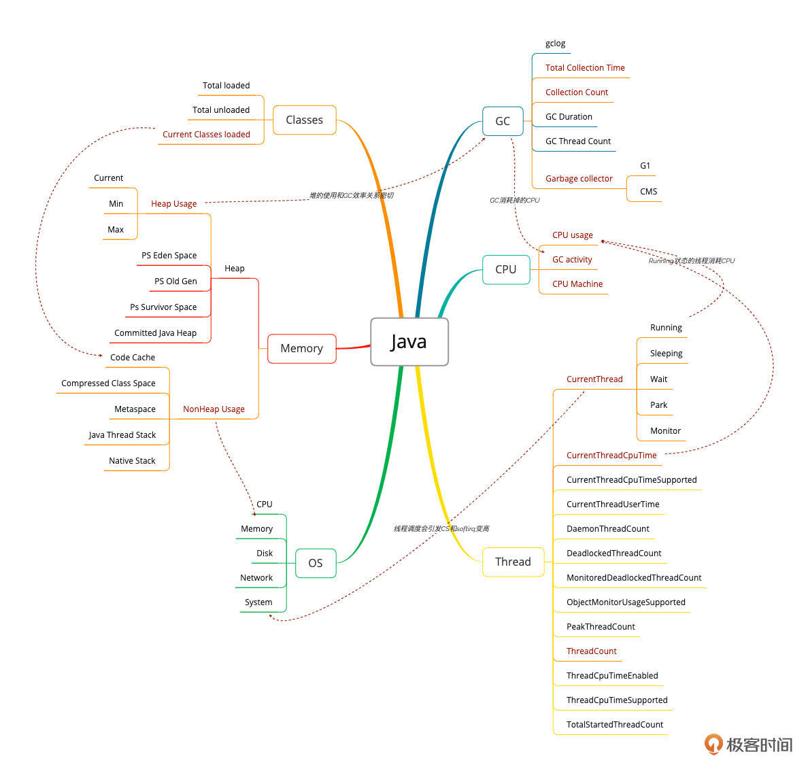
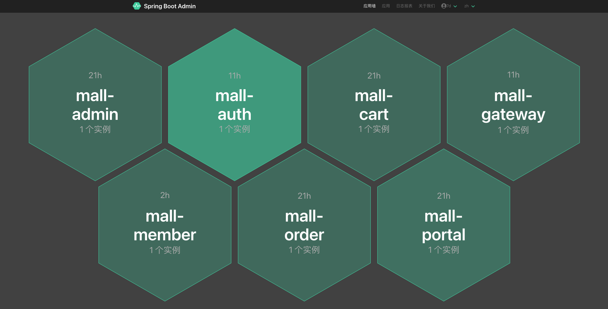
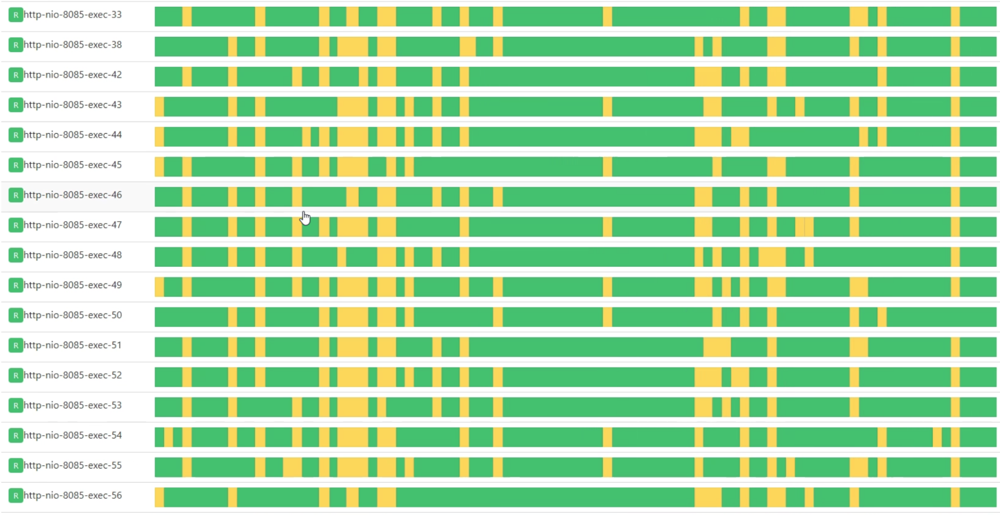
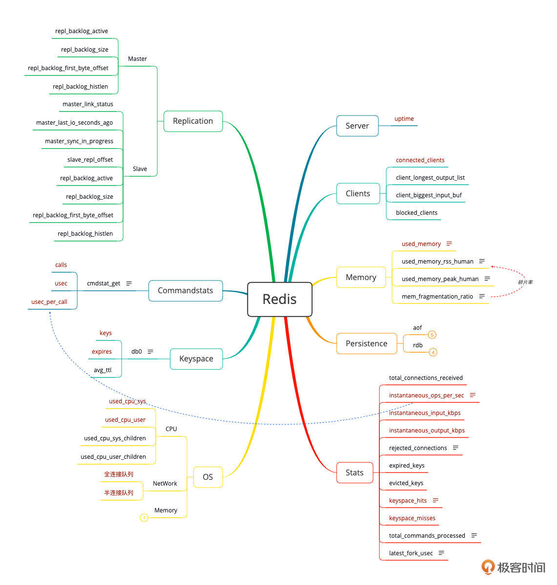
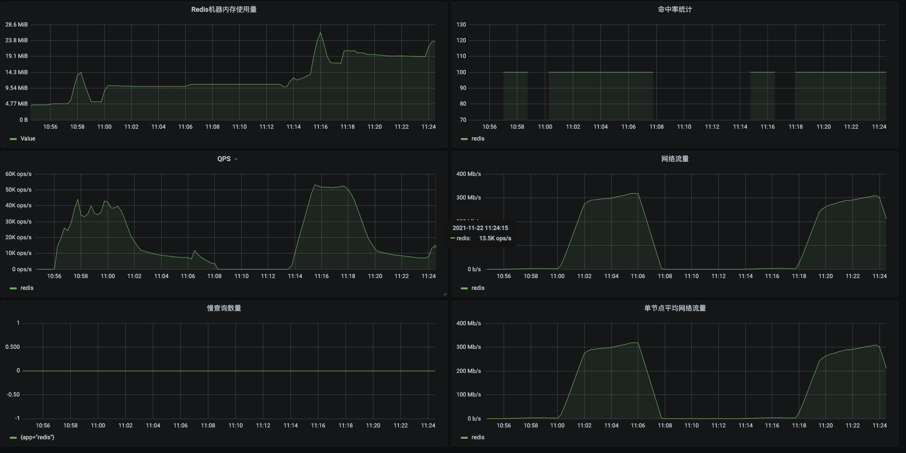
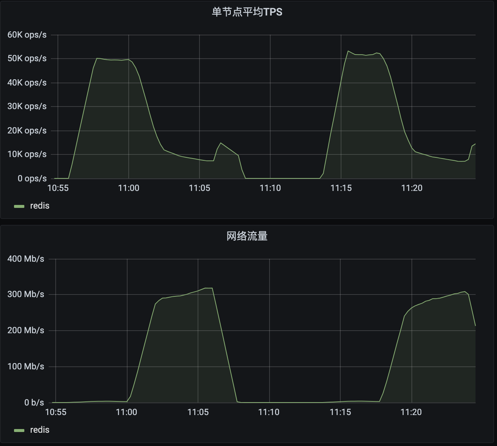
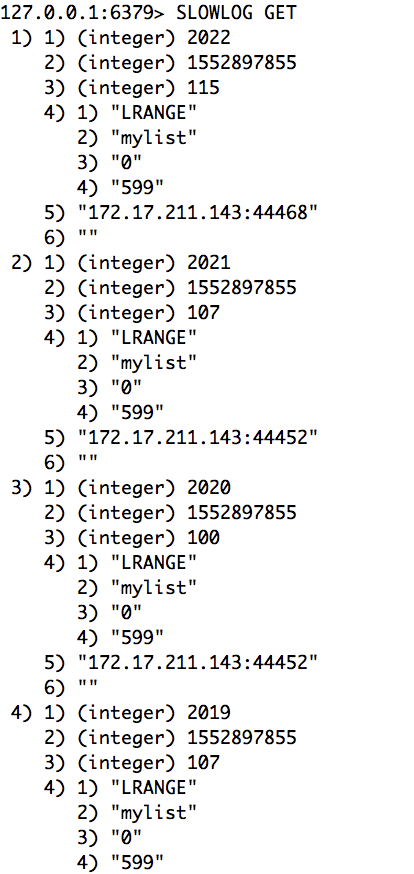
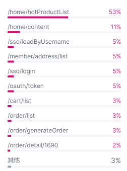

---
date: "2019-06-23"
---  
      
# 27 | 全局监控（下）：如何快速落地全局监控？
你好，我是高楼。

上节课，我们就全局监控中的k8s+docker监控、操作系统监控和数据库监控进行了详细的讲解。


这节课呢，我们继续全局监控这一部分的内容。我们一起来看看应用监控、链路监控、缓存监控和日志监控这四部分都是怎样的。

## 应用监控

在应用监控中，是要先考虑开发语言的。我们这个专栏是用Java语言开发的应用，所以这里我描述一下Java应用的性能分析决策树。



在Java应用的性能分析决策树中，我会主要关注两个方面：堆和栈。

具体的计数器我在上面这张图里用红色标记出来了。但是要说Java的监控工具，那就像汪洋大海了。不管是开源的还是商用的，可以说都是多如牛毛。我不建议在Java应用的监控工具选型上花太多功夫，我们只需要选择易用、成本低的工具就可以了。当前开源的Java监控工具已经完全可以实现所有的功能了。

之前我在专栏中提到过JVisualVM，这是一个我非常常用的工具之一。不过我想强调一点，在全链路压测过程中，如果我们用基于k8s+docker的微服务分布式架构，那使用JVisualVM会比较麻烦。因为它的每个Java实例都需要单独连接，并且要把容器中的端口映射出来，操作上比较繁琐。

我们的这个专栏的项目使用的是Spring Cloud架构，这也是当前市场上最流行的一种架构了。我选择的工具是Spring Boot Admin，在应用中集成了相关依赖之后，你可以打开Spring Boot Admin，查看应用墙。

<!-- [[[read_end]]] -->



这个应用墙可以看到一个应用的所有实例。要注意的是，这里的绿色只是代表进程端口的启动是正常的，并不表明这个应用性能就是好的。

如果你想看具体的性能分析决策树中的信息，可以点击实例进入到相应的监控界面中。下面这张图展示的是我经常看的几个监控界面。


在上面的这个图里，我们不仅可以看到堆和非堆内存使用的情况，也同时可以判断GC的效率，这就可以对应到我们性能分析决策树的 GC、CPU 和 Memory 三个部分的计数器了。

再来看一下线程视图：


在线程视图中，可以看到自打开此界面后的所有线程状态。我们可以通过这个视图判断线程是否健康。

像上面这张图就是线程的 blocked 过多的情况。这时我们就要去使用 jstack 之类的命令去打印栈信息，然后打到对的时间点上。

请注意，这个界面即使全是绿色也并不能说明性能就是好的。比如下面这张图：



这种情况下，我们还要进一步判断方法执行时间是不是过长。像上面这张图里，绿色段较长的地方也是不合理的。这个界面要多观察一会，不能刚打开就判断，不然就看不到状态随着时间变化的趋势了。

不过，要判断Java应用方法的执行时间，只看Java应用监控也是不行的。我们还要结合上节课提到的操作系统的计数器做关联分析。

关联分析的逻辑就是：当us cpu（注意这里是us cpu，不要看错了，这可是关键的一个起点）使用率过高时，查看相应的进程；当确定了是 Java 进程时，再到线程图（上面两张图）界面查看方法的执行时间。

当我们点击线程图（上面两张图）中的某段带有红颜色或绿颜色的线时，就可以看到相应的Java栈了：

```
    "http-nio-8401-exec-884" #86813 daemon prio=5 os_prio=0 tid=0x00007f2868073000 nid=0x559e waiting for monitor entry [0x00007f2800c6d000]
       java.lang.Thread.State: BLOCKED (on object monitor)
    	at java.security.Provider.getService(Provider.java:1035)
    	- waiting to lock <0x000000071ab1a5d8> (a sun.security.provider.Sun)
    	at sun.security.jca.ProviderList.getService(ProviderList.java:332)
    .....................
    	at com.dunshan.mall.auth.util.MD5Util.toMD5(MD5Util.java:11)
    	at com.dunshan.mall.auth.config.MyPasswordEncoder.matches(MyPasswordEncoder.java:23)
    .....................
      at com.dunshan.mall.auth.controller.AuthController.postAccessToken$original$sWMe48t2(AuthController.java:46)
    	at com.dunshan.mall.auth.controller.AuthController.postAccessToken$original$sWMe48t2$accessor$jl0WbQJB(AuthController.java)
    	at com.dunshan.mall.auth.controller.AuthController$auxiliary$z8kF9l34.call(Unknown Source)
    .....................
    	at com.dunshan.mall.auth.controller.AuthController.postAccessToken(AuthController.java)
    .....................
    

```

这就已经到了代码层了。但是！是不是就怕看到但是？没有办法，在性能分析中，这一个个但是，就是我们的分析路径。

但是上面的栈信息中只有代码的调用关系，并没有每个方法的调用时间。怎么办呢？这时候我们就需要进一步去拆分栈中每一个方法的调用时间了。你可以用JVisualVM、Arthas等等的工具，这里我用Arthas截取一段栈的内容看一下。

```
    -- 执行语句
    trace -E com.dunshan.mall.cart.controller.CartItemController listPromotionnew -n 5 -v --skipJDKMethod false '1==1'
    
    -- 局部内容
    `---ts=2021-01-16 15:08:58;thread_name=http-nio-8086-exec-34;id=f8;is_daemon=true;priority=5;TCCL=org.springframework.boot.web.embedded.tomcat.TomcatEmbeddedWebappClassLoader@56887c8f
        `---[97.827186ms] com.dunshan.mall.cart.service.imp.CartItemServiceImpl$$EnhancerBySpringCGLIB$$ac8f5a97:listPromotion()
            `---[97.750962ms] org.springframework.cglib.proxy.MethodInterceptor:intercept() #57
                `---[97.557484ms] com.dunshan.mall.cart.service.imp.CartItemServiceImpl:listPromotion()
                    +---[72.273747ms] com.dunshan.mall.cart.service.imp.CartItemServiceImpl:list() #166
                    +---[0.003516ms] cn.hutool.core.collection.CollUtil:isNotEmpty() #172
                    +---[0.004207ms] java.util.List:stream() #173
                    +---[0.003893ms] java.util.stream.Stream:filter() #57
                    +---[0.003018ms] java.util.stream.Collectors:toList() #57
                    +---[0.060052ms] java.util.stream.Stream:collect() #57
                    +---[0.002017ms] java.util.ArrayList:<init>() #177
                    +---[0.003013ms] org.springframework.util.CollectionUtils:isEmpty() #179
                    `---[25.152532ms] com.dunshan.mall.cart.feign.CartPromotionService:calcCartPromotion() #181
    

```

从上面的执行结果中可以看到，Arthas可以把一个栈中每个方法的调用时间都梳理出来。这里还要强调一点，不要只看一次就轻易判断说某个方法的执行时间过长，最好多刷几次。如果确认一直就是这个方法的执行时间较长，你就可以拿着这个证据挺胸抬头去找这个应用的开发讲理去了。

上面就是我在进行应用监控分析时的思路。主要就是从操作系统出发，判断出进程和线程所消耗的资源大小，然后根据语言特性做判断，找到出问题的代码段就可以了。

不过这里我还是要强调一点，对于应用监控分析，分析的逻辑是最重要的，无论是使用Java、C/C++、Python 还是 Go，这个逻辑都不会变！不会变！之所以这样强调是因为，我经常看到有些同学因为换了语言就手足无措，其实只是换个监控工具而已。

## 链路监控

对于全链路压测来说，不说链路监控是不行的。因为微服务分布式架构中的服务太多，一个个去追着日志查，那是要崩溃的。如果使用链路监控，我们就可以高效、即时地判断时间消耗在哪里了。

在链路监控工具中，我们主要是看两个内容：

* 服务拓扑图：
* 服务链路调用耗时树。

我们这个专栏的项目是选择Sleuth+Zipkin来做链路的全局监控的。

先来看下服务拓扑图：


在全链路压测的过程中，服务拓扑图的地位可以说是重中之重了。从这个图里，你不仅可以看到链路的调用路径，还能看到每个服务的流量大小。看到上面线上的点点没有？当压力发起时，那些点是流动的。观察这个流动的状态，你就可以判断出哪个服务的调用次数多，进而重点关注了。

虽然这里我是以Zipkin来演示的，但并不代表只有Zipkin有这样的功能，其实所有的链路监控工具都能做到这一点。所以在链路监控工具的选型上，不用过于执着，只要用着顺手就可以了。

我们再来看下服务调用链路耗时树：


在服务调用链路耗时树中，我们可以看到一个接口从网关开始直到一个具体的SQL执行的整个过程。这里不仅可以显示数据库，还可以显示Redis缓存、RabbitMQ队列各种调用所耗的时间。当然，你需要加相应的依赖包，这一点我们在标记透传那两节课已经详细讲过了。

像上面这张图，我们就可以判断出是由于Portal服务响应慢，导致了Cart服务响应慢，再进一步导致了Order服务响应慢。这层级关系清晰而优雅。

有了这个判断之后，我们就可以用刚才讲的应用监控部分的分析逻辑，进一步定位具体是哪段代码了。

## 缓存监控

缓存对大容量系统的作用不容忽视，这一点你可以在很多地方看到相应的案例。而开源缓存中，使用较多的那就非Redis莫属了，它用C语言开发，效率高，稳定性好。我们这个专栏的项目同样也用到了Redis。

记得在上一个专栏，我就在对登录的功能做优化时加了一层缓存，TPS直接上升了一倍，而对于一些系统的热点数据来说，如果使用了缓存，效率会更为明显。

同样，我也画了一下Redis的性能分析决策树：



虽然Redis的计数器看起来也不少，但在我的经验里，要看的其实并不多。总结下来其实就三点：

1.  有没有慢命令（我看有的地方叫慢查询，其实是不合理的，应该是慢命令）。
2.  内存够不够用。
3.  持久化对性能的影响。

这次监控呢，我们采用Prometheus+Grafana+redis\_exporter来实现对Redis的全局监控。展示效果如下：



这里我截了几个我认为重要的计数器。并且把原模板中的QPS改为了TPS。

在这个图上我们需要关心的几点是：单节点平均TPS、总TPS和慢命令数量。你可以看到这个图里有两段数据。第一段数据所在的时间段是10：55 \- 11：08；第二段数据所在的时间段是11：13 \- 11：24。

对比一下你就会发现，虽然连接数有10倍的差别，但是TPS在两个时间段里并没有什么区别，可见已经有瓶颈了。至于瓶颈在哪个环节，只看这些图还不能确定。

我们再来看一下同一段数据的前后两个部分。



在第一段数据10：55 \- 11：08这个时间范围里，从10：55 \- 11：01是属于操作的数据较小的阶段，TPS很高，但网络流量不大；而从11：01 \- 11：08是属于操作的数据较大的阶段，TPS很低，但网络流量是比较大的，一度达到了300M。第二段数据也类似。

在这种情况下，如果你想进一步定位问题，就需要再结合操作系统的计数器做关联分析了。

如果你觉得上面的监控图表不够用，还可以直接登录到Redis中执行info命令，那里可以看到更多数据。只是info命令和mysqlreport一样，统计的是累加数据。如果你需要做判断，就需要判断数据是否在你执行的场景时间范围内有效，不让数据累加到场景之外的值。

这里我也给出我对Redis的分析思路：当TPS不再增加时，我建议你先去看操作系统的全局监控。对于C语言编写的Redis来说，在操作系统上可以直接看到它的CPU、内存、IO、网络等的资源消耗（而对于Java语言编写的应用来说，还是先去看JVM里面的计数器为好）。

举例来说，如果Redis的内存不足，那在大流量下，必然会出现page faults增加的情况。这里我们需要重点关注major page faults的增加，它代表着页面硬错误，这里只能产生IO了；所以我们还要去查看当前的IO状态。对于主要用内存的缓存服务来说，出现大量的读写IO，那是会严重拖慢系统的。

还有一点需要强调，对于缓存服务来说，因为是以使用内存为主，所以数据的丢失就必须要提到台面上来讨论。我们必须得知道，如果内存中的数据丢失的话会产生什么样的后果。为了保证内存数据丢失不至于产生严重的生产事故，Redis给出了AOF和RDB两种持久化策略，你可以根据自己的项目做相应的选择。但是你得知道，无论是哪种持久化策略，它对性能的影响都是有的；而且，如果Redis因为故障而死掉，那也必然会有数据的丢失，就是多少的区别而已。

通常我们在生产环境中会选择AOF策略，因为这种策略会让我们丢失的数据少一点。这是一个平衡上的哲学问题，持久化频繁了性能差，持久化不频繁就要承担风险。所以这个持久化策略，我建议你针对项目做严格的验证（对于一些不关心性能的企业，倒也无所谓，反正我的资源多得很，就可以用最严苛的策略，上最多的资源）。

另外对Redis来说，慢命令日志也是极为重要的参考数据。你可以通过slowlog get来获取有哪些慢的命令：



解释一下每个命令的前四条：

1.  日志标识符：具有唯一性\(unique\)；
2.  执行时间点：以 Unix 时间戳格式表示，你可以转为当前时间；
3.  执行时间：以微秒为单位，也就是这个命令慢到什么程度；
4.  具体命令：以数组的形式排列。比如第4个就是：LRANGE mylist 0 599。

到这里，你就可以判断到Redis为什么慢，慢在哪里了。但是对性能分析来说，只知道问题出在哪还是不够的，最好你还能提出解决方案。

Redis作为一个非常成熟且稳定的缓存服务器，要想找到代码层面的问题还是比较难的。所以大部分对于Redis的优化都是参数配置或使用方法方面的优化。比如使用Pipelining、设置一下内存分配器、持久化配置得合理一些、日志级别调低一些。上面这些都是通过调整Redis来调优，如果还想再调优的话，基本上就是在操作系统上做动作了，比如配置网络参数（进出队列）、优化CPU（NUMA和绑定配置）等等操作。

这样，我就基本把对Redis这样的缓存服务进行优化的思路描述清楚了，总的来说，Redis的可优化的点并不是非常多，是容易掌握的。

说完了缓存的部分，下面再来说说日志监控。

## 日志监控

可能会有人说，日志监控，最多不就是查查日志吗？但其实，对于性能来说，通过日志你是看不出来快慢的，除非你把请求时间、响应时间打印到日志中并提取出来。

如果你想说的是找问题查日志，那通常也是在报错的时候才需要的。而我们要通过日志得到的不止是某个具体的日志，而是通过日志得到业务模型，所以日志聚合监控是非常有必要的。

对于微服务分布式系统来说，因为没有日志聚合分析系统，所以要想找到某些依赖日志的问题，会浪费至少一半以上的时间。这里我推荐使用ELFKK\(Elasticsearch/Logstash/Filebeat/Kibana/Kafka\)套件，这一套下来，说覆盖80\%的日志分析场景应该不过分。

在日志全局监控的逻辑中，我最经常看的是下面这个图：


这个图是我用来判断某个时间段内的请求量级的。同时在这个界面里，也可以看到每个接口的请求趋势。记住哦，这个请求趋势可不是看一眼热闹就可以了的。我们应该通过它来判断应该设置多少个业务场景。简单来说，就是如果所有接口的趋势都是一样的，都是在同样的时间点请求量高，那只需要设置一个场景就可以了；如果接口的高峰请求量不在同一时间点，那就需要判断是否需要增加业务场景了。

另一个我常看的视图是这样的：



从这个视图中可以看到接口的请求比例，这可以方便我们做压测时配置业务比例。不过，这里涉及到一个用什么压测工具的问题。如果你用的是录制回放工具，这个图是不用看的，因为录制时的业务比例已经固定了，只放大就行了。这个时候，你直接回放就已经是按这个业务比例发出的请求了。

## 总结

好了，这节课呢，就聊到这里了。在这节课中，我们把应用监控、链路监控、缓存监控、日志监控等在全链路压测中非常常用的几个部分拆解了一下。如果这两节课还有没涉及到的其他组件，你可以根据我所描述的逻辑自己思考一下，落地到你的全局监控思路中。

关于全局监控有几个点需要提醒一下：

1.  全局监控计数器要尽量覆盖范围大一些，不能遗漏大的模块；
2.  一定要先画性能分析决策树，再找监控工具，如果工具不能全部覆盖你想看的计数器，要记得在具体的分析过程中做相应的补充；
3.  全局监控是定向监控的起点，定向监控是找证据链的过程，而证据链是可以让我们找出问题的根本原因的。所以全局监控想不清楚，计数器不能理解，那后面的步骤都会卡住。性能分析从来都没有只看某个计数器、或只看某个监控工具就可以完全定位出问题的证据链的，只有层层分析才能找到证据链。可惜现在市面上的监控工具，没有一个是以这个思路来设计的，这就没有办法只能靠性能分析人员的逻辑思维能力了。

希望通过这节课，你可以对全局监控有个更深刻的认识。在我们后面的章节中，我会直接使用这些思路来分析具体的问题。

## 问题

学完这节课，请你思考两个问题：

1.  你在自己的项目中有没有画过全局性能决策树？有没有分析过每个性能监控工具的局限性？
2.  如何快速理解每个技术组件的每个计数器？

欢迎你在留言区与我交流讨论。我们下节课见！