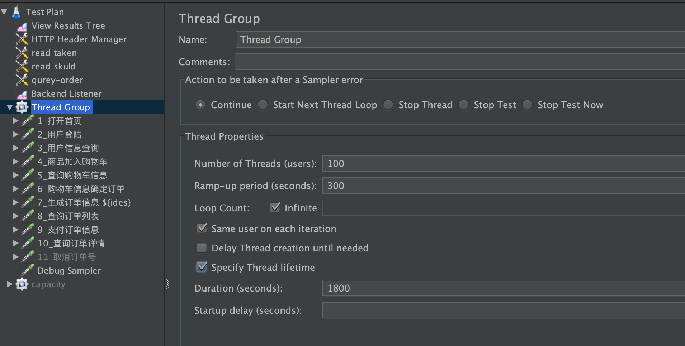
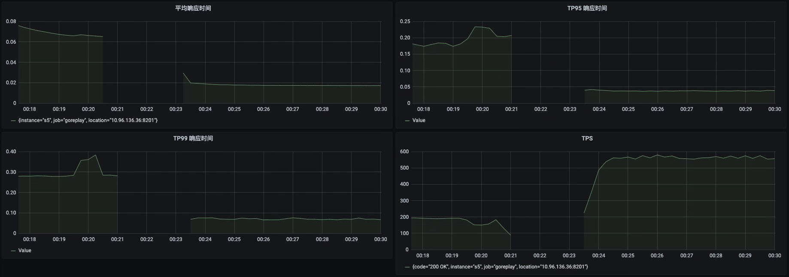
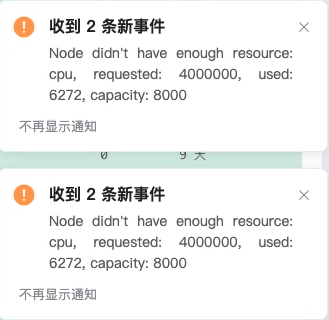
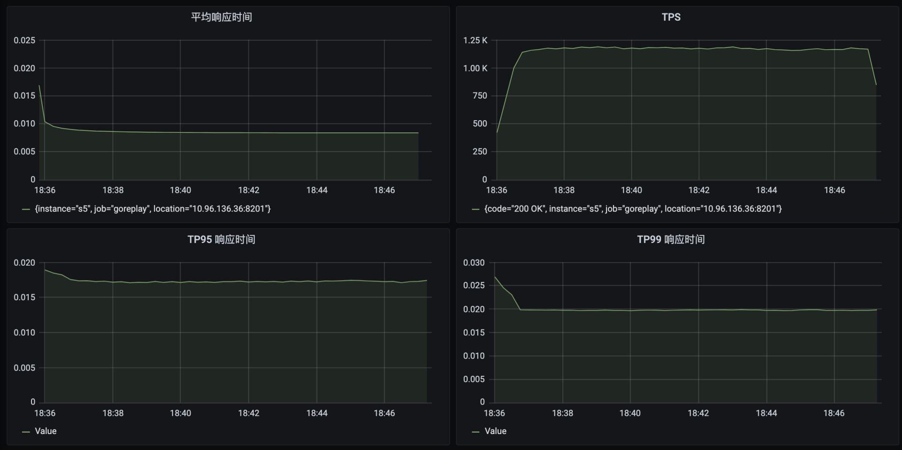
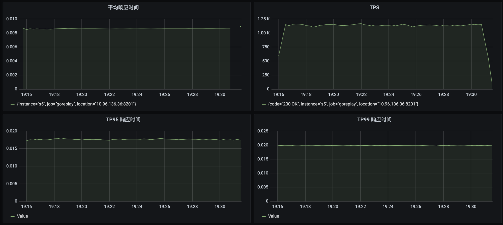
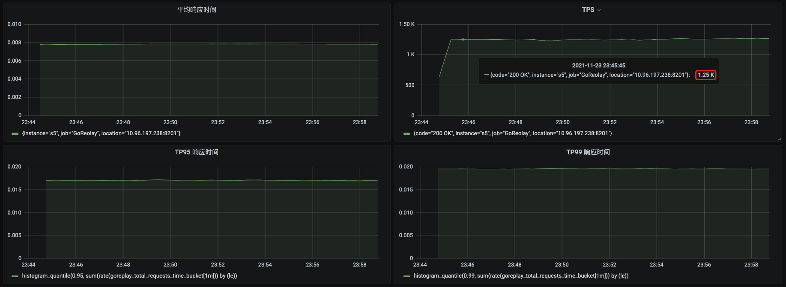

---
date: "2019-06-23"
---  
      
# 29 | 基准场景：一个案例，带你搞懂基准场景的关键要点
你好，我是高楼。

学到这里，我们可以小小地庆祝一下了。因为在前面的28讲里，我已经把全链路压测所需要的前提条件全部都梳理了一遍。从这节课开始，我们就正式进入场景执行阶段了。

在我的RESAR性能工程理念中，我一直强调只有四种性能场景类型。分别是：基准场景、容量场景、稳定性场景和异常场景。这四种场景是递进的关系，每一类场景都是有清晰的目标的。这一节课，我们就是要先整体地了解一下这四种性能场景的目标，然后进行具体的演示。

## 一个场景设计的问题

在说每个场景的目标之前，我要先说一个问题，这是一个同行问我的。我觉得这是性能行业中非常典型的疑问，也是现在性能行业中经常有人做错的一个地方。

> 你好，我想请教一个关于TPS压测指标的问题。我们的生产环境，一个场景的系统TPS在高峰期达到了4000/s，但是就持续了几秒，按小时统计最大也不到30w业务量。业务人员给我们的业务指标是75w/h，那在实际压测的时候，如何兼顾两者的指标呢？如果全部按峰值TPS去跑一个小时，感觉太高了，不切实际。这种情况该如何评估压测呢？

我们可以来分析一下这几句话中的关键词：

1.  4000TPS持续了几秒（这里我把问题中的4000直接当成业务级的事务来看了，因为他并没有描述清楚这个4000是哪一级的事务）；
2.  真实环境下，30w笔业务每小时；
3.  业务部门给的需求是，系统可以支持每小时75w笔的业务量。

<!-- [[[read_end]]] -->

第2、3点的区别是，一个是真实的每小时业务量，另一个是新提的需求。因为新提的需求要高于真实的每小时业务量，所以我们就以这个更高的要求作为场景目标。

那这时我们容易出现的疑问是：如果每个小时的业务量增加了一倍多，生产峰值TPS会不会增加呢？这个问题，我们从上面的描述中还看不出来，所以也没办法判断。因为75w/h的需求如果平均算过来，每秒大约只有208，这个值远远小于生产上真实达到过的峰值。

所以我们还是拿之前的4000TPS来要求TPS峰值，但是这里要记录一下，有需要的话再去和业务部门沟通。

那我们再整理一下需求就是：

1.  4000TPS：这是一个明确的需求。但是也要注意，这是真实的业务模型所要求的TPS，这里会包括多少业务接口，我们还不清楚。
2.  75w/h：这也是一个明确的需求。但是，我们还不确定是否会因此导致峰值TPS的增加，既然不知道，那我们就先设计场景满足这个75w/h的容量需求。至于峰值TPS，我们先按4000TPS来计算。

明确了这个需求之后，我们还不知道要设计什么样的场景来覆盖这个需求对不对？要想知道这点，我们先来看看每个场景的具体要求，再对应上述问题，看看如何设计可用的场景。

## 四类性能场景解析

### 基准场景

基准场景的目标是把每个接口都调优到最好的状态。这里我们要把每个接口都压测一遍，以便将基础的问题呈现出来。很显然，基准场景是不考虑真实的业务模型的，只是为了排除基础问题。

说明一下，这里提到的接口是原子类的接口，是业务流程中涉及到的一个个单独的接口。

### 容量场景

容量场景的目标是模拟真实的业务峰值。容量场景是性能项目中最重要的场景之一，要给出线上环境是否能满足需求的**明确的答案**。

在设计容量场景的压力过程时，要注意最核心的两点，那就是**场景的连续递增设计和业务模型。**

你也许会问，那容量场景的持续时间应该设置为多长呢？通常情况下，我们对容量场景的持续时间是不做特别限制的，具体的时间长度要根据实际的情况做出判断。比如说，场景TPS上升到最高点之后持续了几分钟，这时你看到TPS有下降的趋势，那就必然需要再多等一会，看一下性能衰减有多快。

那话说回来，对应上面那个问题的第一个需求（4000TPS），显然这个容量场景是一定要做的，对应的目标就是4000TPS。

### 稳定性场景

稳定性场景的核心是能够覆盖业务积累量，它的**两个要点**就是**时长和业务积累量。**

这两个要点之间是有关系的，用固定TPS值来执行稳定性的场景时，业务积累量和时长是线性的关系。对应上面的问题中的需求，如果容量场景中的4000TPS能够稳定达到的话，那显然75w的业务积累量只需要3.125分钟（750000笔业务 ÷ 4000TPS = 187.5s）就可以完成了。

那可不可以用这样的逻辑来计算TPS呢？750000笔业务 ÷ 3600s（即一小时）≈ 208.3TPS，也就是用208.3TPS运行一个小时来达到业务积累量。

从业务积累量上来说，显然，这两者是没有区别的，但区别在于TPS的量级和时长。这个区别在技术层面会产生什么影响呢？

我们先假设在这两个场景中用到的参数化数据都是一样的。那4000TPS和208TPS的区别就在于，在单位时间内发送了多少请求到服务端。当请求较为集中的时候（前面我们已经说了4000TPS是可以达到的），服务器上需要开启的工作线程资源、内存资源、CPU资源、网络资源等显然都需要得更多。

不过这里我还想提一下，其实CPU、网络、工作线程类的资源和容量场景中的要求是一样的，但是内存会有不同。在容量场景中，因为跑得时间较短，服务器端或数据库层不需要那么多的内存资源。但在稳定性场景中呢，就需要更多的内存来保存临时数据了，因为参数化数据的量级在稳定性场景中是更多的。

### 异常场景

异常场景的目标是在出现故障（操作系统、数据库、中间件、进程等等故障）时，验证业务受到的影响。异常场景就是为了模拟生产故障出现时的场景，以此来验证业务系统能不能自动调整。很多企业中把它归结为“非功能测试”的范畴。这一点如果你想了解更多，可以参考一下我上一个专栏的[第28讲](https://time.geekbang.org/column/article/377229)。

所以针对前面我们提到的需求，显然容量场景和稳定性场景都是必须要做的。那基准场景就不用考虑了吗？直接上容量场景和稳定性场景就够了吗？

其实没有基准场景是不行的。但是，因为上面的需求中只描述了容量场景和稳定性场景的需求，所以有些人会觉得可以跳过基准场景。但是，基准场景作为可以发现通用性能问题的阶段，在性能问题的定位上起着不可忽视的作用。所以，当有了容量场景的需求的时候，你就应该默认基准场景是必须要做的了。

描述了这么多场景设计的内容，针对我们的这个项目，后面我们自然是要把四类场景都执行起来的。

在这节课中，我们一起先来看一下基准场景是怎么跑起来的。

要想把场景跑起来，自然先要有压力数据。在全链路压测的逻辑中，经常会有人提到一种先进炫酷的技术那就是用流量录制回放，那这里我们就来用它产生基准场景的压力。

不过这里有个小的难点。因为我们这个是自己搭建的项目，并没有真实的流量，而GoReplay 可以做的又只是录制回放，那GoReplay要录制的真实流量怎么产生呢。我的逻辑是：

1.  先用 JMeter 模拟真实用户的请求。
2.  在 Gateway 上用 GoReplay 录制请求。
3.  将录制的请求放大回放。

我们就按照这个步骤来做一下。

## 准备工作

### 使用Go录制回放

首先，我们要安装一下 Go 语言环境和 GoReplay ：

```
    下载go语言包。解压。
    # tar -C /usr/local -zxvf go1.14.4.linux-amd64.tar.gz
    
    # 打开环境变量文件
    vim /etc/profile
    # 添加
    export GOROOT=/usr/local/go
    export PATH=$PATH:$GOROOT/bin
    # 生效
    source /etc/profile
    

```

下载GoReplay包。

```
    [root@vm ~]# curl -L -O https://github.com/buger/goreplay/releases/download/v1.3.1/gor_1.3.1_x64.tar.gz
    

```

更详细的安装步骤可以参考：[《性能工具之 Goreplay 安装及入门使用》](https://mp.weixin.qq.com/s/O66d9hwIw4L7Gmgvmm_8UA)。  
然后，我们用JMeter 把100个线程运行起来。JMeter配置如下：



这里，我把 Ramp-up period 配置为300秒，这是为了实现递增的过程，从而模拟生产环境中的递增趋势。请注意，在真实环境中是不需要这样做的。在真实环境中，我们直接在要录制的网关上执行GoReplay录制的动作就可以了。

接下来，我们使用GoReplay录制回放请求，这里又分了几个小步骤。

 1.     创建录制脚本。

```
    [root@gateway-mall-gateway-764bdbcc94-qdp5k /]# cat record.sh 
    
    #!/bin/bash
    
    PORT="8201"
    OUT_FILE="request.gor"
    HEADER="dunshan:7DGroup"
    
    ./gor --input-raw :$PORT --output-file=$OUT_FILE  -output-file-append --http-set-header $HEADER
    
    [root@gateway-mall-gateway-764bdbcc94-qdp5k /]#
    

```

在上面的脚本中，“PORT”是我们要录制的端口，“OUT\_FILE”是保存的文件名。“HEADER”是在录制的过程中要添加到请求中的HTTP Header，这样在回放的时候，我们就可以直接根据这个Header进行判断了。

 2.     执行./record.sh启动录制，这样在同目录下会生成request.gor文件。
 3.     将request.gor复制到压力机上。
 4.     创建GoReplay压力脚本run.sh，脚本内容如下：

```
    #!/bin/bash
    
    OUTPUT="http://10.96.136.36:8201"
    MIDDLEWARE="./middleware_wrapper.sh"
    #MIDDLEWARE="./middleware_echo.py"
    INPUT_FILE="request.gor"
    
    sudo ./gor --input-file $INPUT_FILE --input-file-loop  --output-http=$OUTPUT --prettify-http --output-http-track-response
    

```

在上面这段脚本当中，“OUTPUT”是目标服务器的URL路径；“MIDDLEWARE”是用来扩展GoReplay功能的中间件，我们可以根据需要自己编写，像关联这样重要的功能就要在这一步实现（详见本专栏第21-22讲）；“INPUT\_FILE”是在录制过程中生成的文件。

5.  执行run.sh。

我们先只执行一遍，查看下调用的内容是不是正常。

先看订单有没有生成，影子库的截图是这样的：  
  
从影子库的最近一条订单时间来看，确实是产生了新的订单，说明执行是成功的。

下面再来看看日志，确定一下执行的过程也是没问题的。Auth服务上的日志：

```
    2021-10-24 11:22:56.464  INFO [mall-auth,ddcce4f1b50707d1,1551de5039a85bf9,false] 1 --- [nio-8401-exec-1] c.d.mall.auth.aop.db.DataSourceAspect    : ==============redis=mall.auth==请求内容===============
    2021-10-24 11:22:56.464  INFO [mall-auth,ddcce4f1b50707d1,1551de5039a85bf9,false] 1 --- [nio-8401-exec-1] c.d.mall.auth.aop.db.DataSourceAspect    : 请求地址:http://10.100.220.76:8401/oauth/token
    2021-10-24 11:22:56.464  INFO [mall-auth,ddcce4f1b50707d1,1551de5039a85bf9,false] 1 --- [nio-8401-exec-1] c.d.mall.auth.aop.db.DataSourceAspect    : 请求方式:postAccessToken
    2021-10-24 11:22:56.465  INFO [mall-auth,ddcce4f1b50707d1,1551de5039a85bf9,false] 1 --- [nio-8401-exec-1] c.d.mall.auth.aop.db.DataSourceAspect    : 请求类方法头信息:7DGroup
    2021-10-24 11:22:56.465  INFO [mall-auth,ddcce4f1b50707d1,1551de5039a85bf9,false] 1 --- [nio-8401-exec-1] c.d.mall.auth.aop.db.DataSourceAspect    : redis 压测流量：5
    2021-10-24 11:22:56.465  INFO [mall-auth,ddcce4f1b50707d1,1551de5039a85bf9,false] 1 --- [nio-8401-exec-1] c.d.mall.auth.aop.db.DataSourceAspect    : ============My===请求内容===============
    2021-10-24 11:22:56.465  INFO [mall-auth,ddcce4f1b50707d1,1551de5039a85bf9,false] 1 --- [nio-8401-exec-1] c.d.mall.auth.aop.db.DataSourceAspect    : 请求地址:http://10.100.220.76:8401/oauth/token
    2021-10-24 11:22:56.465  INFO [mall-auth,ddcce4f1b50707d1,1551de5039a85bf9,false] 1 --- [nio-8401-exec-1] c.d.mall.auth.aop.db.DataSourceAspect    : 请求方式:POST
    2021-10-24 11:22:56.465  INFO [mall-auth,ddcce4f1b50707d1,1551de5039a85bf9,false] 1 --- [nio-8401-exec-1] c.d.mall.auth.aop.db.DataSourceAspect    : 请求类方法:CommonResult com.dunshan.mall.auth.controller.AuthController.postAccessToken(Principal,Map)
    2021-10-24 11:22:56.465  INFO [mall-auth,ddcce4f1b50707d1,1551de5039a85bf9,false] 1 --- [nio-8401-exec-1] c.d.mall.auth.aop.db.DataSourceAspect    : 请求类方法参数:[org.springframework.security.authentication.UsernamePasswordAuthenticationToken@f00b9e84: Principal: org.springframework.security.core.userdetails.User@ff46140: Username: portal-app; Password: [PROTECTED]; Enabled: true; AccountNonExpired: true; credentialsNonExpired: true; AccountNonLocked: true; Not granted any authorities; Credentials: [PROTECTED]; Authenticated: true; Details: null; Not granted any authorities, {password=123456, grant_type=password, client_secret=123456, client_id=portal-app, username=7dTest005}]
    2021-10-24 11:22:56.465  INFO [mall-auth,ddcce4f1b50707d1,1551de5039a85bf9,false] 1 --- [nio-8401-exec-1] c.d.mall.auth.aop.db.DataSourceAspect    : 请求类方法头信息:7DGroup
    2021-10-24 11:22:56.465  INFO [mall-auth,ddcce4f1b50707d1,1551de5039a85bf9,false] 1 --- [nio-8401-exec-1] c.d.mall.auth.aop.db.DataSourceAspect    : Mysql 压测流量
    2021-10-24 11:22:56.469 DEBUG [mall-auth,ddcce4f1b50707d1,1551de5039a85bf9,false] 1 --- [nio-8401-exec-1] c.d.mall.auth.aop.db.DataSourceAspect    : redis switch 0 to 5
    

```

Portal日志：

```
    2021-10-24 11:22:56.403  INFO [mall-portal,1bd396aebbbcc2b7,98336b0b0e15d0ba,false] 1 --- [nio-8085-exec-9] c.d.mall.portal.aop.db.DataSourceAspect  : ===============请求内容===============
    2021-10-24 11:22:56.403  INFO [mall-portal,1bd396aebbbcc2b7,98336b0b0e15d0ba,false] 1 --- [nio-8085-exec-9] c.d.mall.portal.aop.db.DataSourceAspect  : 请求地址:http://10.96.136.36:8201/home/content
    2021-10-24 11:22:56.403  INFO [mall-portal,1bd396aebbbcc2b7,98336b0b0e15d0ba,false] 1 --- [nio-8085-exec-9] c.d.mall.portal.aop.db.DataSourceAspect  : 请求方式:GET
    2021-10-24 11:22:56.403  INFO [mall-portal,1bd396aebbbcc2b7,98336b0b0e15d0ba,false] 1 --- [nio-8085-exec-9] c.d.mall.portal.aop.db.DataSourceAspect  : 请求类方法:CommonResult com.dunshan.mall.portal.controller.HomeController.content(Integer,Integer)
    2021-10-24 11:22:56.403  INFO [mall-portal,1bd396aebbbcc2b7,98336b0b0e15d0ba,false] 1 --- [nio-8085-exec-9] c.d.mall.portal.aop.db.DataSourceAspect  : 请求类方法参数:[4, 1]
    2021-10-24 11:22:56.403  INFO [mall-portal,1bd396aebbbcc2b7,98336b0b0e15d0ba,false] 1 --- [nio-8085-exec-9] c.d.mall.portal.aop.db.DataSourceAspect  : 请求类方法头信息:7DGroup
    ........................
    

```

Order日志：

```
    2021-10-24 11:22:57.015  INFO [mall-order,8f7b6e9d44c60348,85b18558eb463fc5,false] 1 --- [nio-8084-exec-5] c.d.mall.order.aop.db.DataSourceAspect   : ===============请求内容===============
    2021-10-24 11:22:57.015  INFO [mall-order,8f7b6e9d44c60348,85b18558eb463fc5,false] 1 --- [nio-8084-exec-5] c.d.mall.order.aop.db.DataSourceAspect   : 请求地址:http://10.96.136.36:8201/order/generateConfirmOrder
    2021-10-24 11:22:57.015  INFO [mall-order,8f7b6e9d44c60348,85b18558eb463fc5,false] 1 --- [nio-8084-exec-5] c.d.mall.order.aop.db.DataSourceAspect   : 请求方式:POST
    ........................
    

```

从上面的日志内容来看，每个服务中的日志都显示正确。

下面我们再来看一下Zipkin中的调用树，确认一下是不是已经把设置的Header加到标签中去了。


从Zipkin来看，请求确实调到了不同的脚本上，结果也是正确的。

 6.     循环多遍执行run.sh，查看网关上的回放日志。

```
    2021-10-24 11:10:36.710  INFO [mall-gateway,8313cfa404164710,8313cfa404164710,false] 1 --- [undedElastic-13] c.dunshan.mall.filter.AuthGlobalFilter   : dunshan-流量标识：7DGroup
    2021-10-24 11:10:36.710  INFO [mall-gateway,8313cfa404164710,8313cfa404164710,false] 1 --- [undedElastic-13] c.dunshan.mall.filter.AuthGlobalFilter   : AuthGlobalFilter.filter() user:{"user_name":"7dTest005","scope":["all"],"id":2434424,"exp":1635129516,"authorities":["前台会员"],"jti":"8368728f-79db-4bff-9afc-c63d15247257","client_id":"portal-app"}
    2021-10-24 11:10:36.837  INFO [mall-gateway,c6efe4825748f2d4,c6efe4825748f2d4,false] 1 --- [undedElastic-13] c.dunshan.mall.filter.AuthGlobalFilter   : dunshan-流量标识：7DGroup
    2021-10-24 11:10:36.837  INFO [mall-gateway,c6efe4825748f2d4,c6efe4825748f2d4,false] 1 --- [undedElastic-13] c.dunshan.mall.filter.AuthGlobalFilter   : AuthGlobalFilter.filter() user:{"user_name":"7dTest005","scope":["all"],"id":2434424,"exp":1635129516,"authorities":["前台会员"],"jti":"8368728f-79db-4bff-9afc-c63d15247257","client_id":"portal-app"}
    ........................
    

```

从日志上看，系统已经按照预期执行了相应的请求，压测标签在日志中也都是对的。

## 执行基准场景

上面的准备工作都完成了之后，我们就可以放大更多倍数进行回放，执行基准场景了。还记得我们基准场景的目标吧？主要是为了找到系统中的各种单接口的问题。

### 压力场景数据

我们先来模拟访问首页这个基准场景。首页是最为常用的，所以也非常重要。我们先来看看首页的访问路径。


图中这个结构就是访问首页时的路径了，你也可以把它看成是逻辑图。因为这个架构并不复杂，所以RESAR性能分析七步法中的第二步“分析架构图”就可以省了。

下面，我们根据GoReplay录制回放的逻辑，准备好相关的脚本，使用Goreplay放大100倍执行首页基准场景。脚本如下：

```
    [root@s5 ~]# cat run.sh
    #!/bin/bash
    
    OUTPUT="http://10.96.136.36:8201"
    #MIDDLEWARE="./middleware_wrapper.sh"
    INPUT_FILE="request-mall-home.gor|10000%"
    sudo ./gor_ldd --input-file $INPUT_FILE --input-file-loop --output-http=$OUTPUT --prettify-http --output-http-track-response --stats --output-http-stats  -output-http-compatibility-mode true
    

```

可以看到，上面的脚本中，“10000\%”就是放大的倍数，这里是指100倍。

接着我们执行run.sh发起压力，监控结果如下：


从这张监控截图中我们可以看到，一开始响应时间较高，达到了500ms，这时候TPS只有50；随着压力的持续，响应时间降到了200ms左右，TPS也增加到了200左右。

但是200TPS算是好还是坏呢？根据我在上一个专栏的经验，我们对这个系统优化之后，这个首页的TPS在单个容器上达到过1200，而现在只有200，这显然是不能接受的。

这里我们可以先停一下，不要着急去猜问题的答案。回想我们的基准场景的目标，就是要找到单接口的性能问题，而现在我们已经从压力数据判断出这个接口的性能是有问题的了。那下一步要做什么事情呢？

请注意，我说的是“下一步”。**现在你要做的就是静下心来，不要慌张，想清楚“下一步”，这恰恰是最重要的。**

我带领团队做性能分析的时候经常一再强调，做性能分析并不是直接给出性能瓶颈的答案，而是给出性能分析的逻辑。有了逻辑自然会找到性能瓶颈的证据链，也自然会找到性能瓶颈的根本原因。所以在分析性能瓶颈的过程中，知道答案并不是首要的，只要知道“下一步”做什么具体的动作，自然可以做到心中不慌乱。

好了，现在我们回想一下RESAR性能分析七步法。


显然，前两步“压力场景数据”和“分析架构图”我们已经看过了。下一步就是去“拆分响应时间”了。但是鉴于我们这个首页架构非常简单，只有 gateway-portal-mysql 三个环节，而首页的逻辑就是在portal上，至于mysql慢不慢，我们也很容易从portal上做出判断，所以这一步也不用花太多时间。

接下来，我们可以直接去全局监控数据中看一看有什么不合理的地方。

### 全局监控

全局监控数据如下：


通过这张截图我们发现，Portale服务所在的s7工作节点的CPU已达到97\%了。但是因为这个机器是一个只有2C的虚拟机，配置过低，稍微有一点压力就会达到很高的CPU消耗，何况我们也达到了200TPS，所以暂时不分析原因，而是把服务移到配置高一点的机器上再接着观察。

下面我们把Portal服务移到一个8C16G的虚拟机上。再次查看压力数据。



从这张趋势图中我们看到，TPS可以达到550左右。因为这个接口只需要300多的TPS，而且根据经验，压力越大的时候TPS增加得越慢。所以我们可以限制资源到4C8G，再来看一下能不能达到300TPS。限制资源配置如下：


这里出现一个了插曲，在保存资源限制时出现了报错：节点没有足够的CPU可用。报错信息是下面这个样子：



为了搞清楚这个问题的原因，我们去查看了这个 Portal 所在的 Worker 上的服务，发现这个Worker上还有其他服务。这个Worker上的资源分配情况是，虽然资源使用率都很低，但是CPU已经被分配出去了。所以当我们想分配4C8G的资源给Portal服务时，显示了上面的错误。

为了避免服务之间的资源争用，我们把这个Portal服务移到一个没有任何服务的Worker上去了。这时，我们添加了一个8C16G的新Worker节点，单独运行Portal服务。再次启动压力：


看起来已经很美好了：TPS能达到700左右，响应时间在15毫秒，并且抖动也不大。我们再查看一下全局监控：


从图上可以看出，s6消耗的资源多。s6是一个2C的机器，我们先进去看一下是哪个进程导致的CPU消耗过高。

```
    [root@s6 ~]# top
    top - 18:05:53 up 75 days, 23:20,  2 users,  load average: 9.16, 7.58, 4.12
    Tasks: 198 total,   2 running, 196 sleeping,   0 stopped,   0 zombie
    %Cpu(s): 69.7 us, 12.1 sy,  0.0 ni, 12.1 id,  0.0 wa,  0.0 hi,  6.1 si,  0.0 st
    KiB Mem :  8008972 total,   192056 free,  5909516 used,  1907400 buff/cache
    KiB Swap:        0 total,        0 free,        0 used.  1797212 avail Mem
    
      PID USER      PR  NI    VIRT    RES    SHR S  %CPU %MEM     TIME+ COMMAND
    31214 root      20   0 4681832 612756   7152 S 125.0  7.7 365:49.67 java
      956 root      20   0 1058124  90796   6636 S  25.0  1.1   6274:30 dockerd
      954 root      20   0 2465836 152556  20364 S   6.2  1.9   5786:27 kubelet
     4310 root      20   0 4617612 546260   6820 S   6.2  6.8 201:44.12 java
     9241 root      20   0  162152   2268   1544 R   6.2  0.0   0:00.01 top
    

```

通过PID 31214对应的容器，我们知道问题出在 Gateway：

```
    [root@s6 ~]# docker ps |grep gateway
    8a4bf818dfab        registry.cn-beijing.aliyuncs.com/7d-mall/mall-gateway   "java -Dcom.sun.mana饪?"   13 days ago         Up 13 days                              k8s_mall-gateway_gateway-mall-gateway-7cf7868798-fc2gr_default_7c55578b-7e1d-4c58-a58e-f347caa3bbdc_0
    25dbe722defd        registry.aliyuncs.com/k8sxio/pause:3.2                  "/pause"                 13 days ago         Up 13 days                              k8s_POD_gateway-mall-gateway-7cf7868798-fc2gr_default_7c55578b-7e1d-4c58-a58e-f347caa3bbdc_0
    [root@s6 ~]# docker inspect --format "{{.State.Pid}}" 8a4bf818dfab
    31214
    [root@s6 ~]#
    

```

因为我们希望Gateway能支撑更大的转发能力。而s6只是一个2C的虚拟机，在这个TPS下表现已经很不错了，没有太大的可操作空间了。所以我们选择直接增加一个Gateway的节点，并且把它调度到其他的Worker上去：

```
    [root@s5 ~]# kubectl get pods -n default -o wide|grep gateway
    gateway-mall-gateway-69dc766c9d-gbvbb        1/1     Running     0          31s     10.100.219.253   s11    <none>           <none>
    gateway-mall-gateway-69dc766c9d-n828c        1/1     Running     0          24m     10.100.59.84     s12    <none>           <none>
    [root@s5 ~]#
    

```

查看一下压力数据：



这时候，TPS已经可以达到1100了，响应时间在10ms左右。现在，我们来判断一下瓶颈在哪里，查看全局监控数据：


现在已经没有明显的系统资源占用太高的情况了。但是只看这一层还不够，我们还要看一下Service级别的资源。我们要根据这个接口的路径，一层层去找瓶颈点在哪里，当查到mysql服务的资源时，我看到了下面的信息：


恼火得很，这里只分配了512M的内存，但申请的内存已经超过了660M，这个限制就有点过狠了。


所以我们就得来调整一下资源了。放开mysql的资源限制，让他可以用到8C16G的资源。再压一遍看看：



压力数据看起来和上一轮一样，还是得再看一下全局监控：


从这张全局监控的截图里，我们已经看不出有什么明显的问题了。但我们在[第26讲](https://time.geekbang.org/column/article/468591)中说过这个界面是有缺陷的，所以还是要登录到各个主机上查看一下是否有优化点。

### 定向监控

下面我们来看下定向监控。我们要到每个机器里去执行一下top（我之所以喜欢喜欢用top是因为top给出的CPU数据是非常明确且完整的，而CPU又是非常综合的计数器，所以我习惯性地会进到系统中执行一下top，看一下每颗CPU的情况）。

在每个机器里都执行了一遍top之后，我发现了这样的情况。

```
    %Cpu0  : 29.4 us,  5.8 sy,  0.0 ni, 64.9 id,  0.0 wa,  0.0 hi,  0.0 si,  0.0 st
    %Cpu1  : 21.2 us,  4.4 sy,  0.0 ni, 73.0 id,  0.0 wa,  0.0 hi,  1.4 si,  0.0 st
    %Cpu2  : 31.8 us,  5.5 sy,  0.0 ni, 62.7 id,  0.0 wa,  0.0 hi,  0.0 si,  0.0 st
    %Cpu3  : 19.6 us,  5.1 sy,  0.0 ni, 74.3 id,  0.0 wa,  0.0 hi,  1.0 si,  0.0 st
    %Cpu4  : 26.2 us,  5.5 sy,  0.0 ni, 68.2 id,  0.0 wa,  0.0 hi,  0.0 si,  0.0 st
    %Cpu5  : 21.3 us,  3.8 sy,  0.0 ni, 73.9 id,  0.0 wa,  0.0 hi,  1.0 si,  0.0 st
    %Cpu6  : 27.6 us,  5.1 sy,  0.0 ni, 53.1 id,  0.0 wa,  0.0 hi, 54.8 si,  0.0 st
    %Cpu7  : 28.6 us,  3.4 sy,  0.0 ni, 67.0 id,  0.0 wa,  0.0 hi,  1.0 si,  0.0 st
    

```

一看到这种情况我就怀疑是软中断，这是我最近经常会遇到的问题（如果你不了解这个分析逻辑，可以查看一下上一个专栏的[第14讲](https://time.geekbang.org/column/article/365426)。）我去查了一下这个机器所用的网络队列：


显然，是单队列网卡了。但是这是一个虚拟网卡。

当前用的是Calico的IPIP模式，查看Calico源码之后，我发现IPIP模式有局限，只能使用单队列网卡，那就没招只能换网络插件了。于是我把网络插件换成了Flannel。接着压起来，看一下效果：



看起来有效果哦，同样的场景，已经达到了1250TPS。再来看看软中断：

```
    %Cpu0  : 38.2 us, 14.2 sy,  0.0 ni, 39.2 id,  0.0 wa,  0.0 hi,  8.3 si,  0.0 st
    %Cpu1  : 26.4 us, 13.9 sy,  0.0 ni, 58.3 id,  0.0 wa,  0.0 hi,  1.4 si,  0.0 st
    %Cpu2  : 40.5 us, 13.9 sy,  0.0 ni, 35.0 id,  0.0 wa,  0.0 hi, 10.5 si,  0.0 st
    %Cpu3  : 32.9 us, 12.1 sy,  0.0 ni, 52.6 id,  0.0 wa,  0.0 hi,  2.4 si,  0.0 st
    %Cpu4  : 40.7 us, 14.5 sy,  0.0 ni, 31.6 id,  0.0 wa,  0.0 hi, 13.1 si,  0.0 st
    %Cpu5  : 33.0 us, 11.7 sy,  0.0 ni, 52.9 id,  0.0 wa,  0.0 hi,  2.4 si,  0.0 st
    %Cpu6  : 39.7 us, 14.8 sy,  0.0 ni, 36.2 id,  0.0 wa,  0.0 hi,  9.3 si,  0.0 st
    %Cpu7  : 31.8 us, 11.1 sy,  0.0 ni, 55.4 id,  0.0 wa,  0.0 hi,  1.7 si,  0.0 st
    

```

这里我们看到，si已经能用到四颗CPU了。效果还是明显的。

到这里，定向监控分析也就完成了。

## 总结

好了，这节课就讲到这里。这是我们这个专栏中关于场景的第一课。执行场景是压测项目的核心环节，它不仅把前面准备的所有内容都用起来了，还是性能分析的起点。

在这一节课里，我描述了各类场景的目标，也给了你一个案例，告诉你如何去分析性能需求并设计出合适的场景。

在这节课所讲的基准场景中，我们的目标就是把所有的接口都调试到最好的状态。这一步在全链路压测中是非常重要的环节，我不建议你跳过。

刚才，我们只通过对一个接口的基准场景模拟，就发现了Calico IPIP模式单网卡软中断的问题。像这样的问题，如果直接执行容量场景再去做判断，会因为容量场景里的接口过于复杂而导致你需要查更多的计数器，分析成本和判断成本都会高出很多。

当然，如果艺高人胆大，你也可以直接执行容量场景，那样的话，出现了多个性能问题会交织在一起，就只能凭借技术功底做判断了。我不建议你这样做。

## 课后题

学完这节课，我想请你思考两个问题：

1.  你在执行场景的时候是直接压大容量的场景还是有非常清晰的策略？可以分享一下。
2.  在k8s的云原生环境中，网络结构有什么特点？

欢迎你在留言区与我交流讨论。我们下节课见！