---
date: "2019-06-23"
---  
      
# 31 | 容量场景：决定线上容量场景的关键因素是什么？
你好，我是高楼。

上节课，我们对场景进行了一个预压测，提前解决了一些基础性的问题。这节课呢，我们就可以直接上大的压力来执行容量场景了。容量场景的目的就是验证线上环境能不能满足需求，最后给我们一个明确的答案。

通常在真实的项目中，我们都会有总TPS的需求，也会有详细的TPS需求（每个接口应该在多长的响应时间内达到多少TPS）。在第3讲的压测方案中，我们已经有了一个指标表，我也把它直接放在下面了。

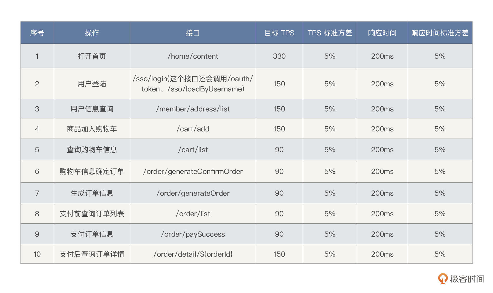

**这里的目标TPS都加在一起是1350**，后面响应时间也给出了个大概的值（200ms以下），这也算是个比较明确的指标了。下面我们就通过容量场景来看看这个目标能不能达到，要是能达到，我们就可以给出“测试通过”的结论了。

下面我们先运行一下容量场景，这里用JMeter或GoReplay来运行都是可以的。

不过在这之前我们得知道，虽然在前面的预压测中，我们有过把TPS调到900左右的时候。但是现在环境也经过了好几轮的折腾，各应用也重启过好几次了，我们不知道各个服务是不是还是在预压测的那个状态。

这也是我们在性能项目中经常会面对的问题：有些指标在之前执行的场景中一切良好，但在解决其他问题的过程中，突然就出现了性能变差的情况。这种情况经常会随机地出现，所以如果有性能工程师把某一次压力良好的数据直接当成最终的性能结果，就这样把它写进性能报告里，这肯定是应付差事的表现。

<!-- [[[read_end]]] -->

果然，在我们的这个容量场景中就出现了性能衰减的问题。我们一起来看看数据。

## 第一阶段

### 压力场景数据

先来看压力场景的数据：


在预压测中，同样的20个压力线程，我们达到过900左右的TPS。但是现在只有600左右了。这里要说明一下，在性能项目中，由于环境的变化、版本的变化、数据量级的变化等，TPS有下降也是时有发生的事情，遇到这样的事情，首先是不要慌，先分析下是什么原因，再来看如何解决。

从响应时间上看，有几个事务的响应时间已经到80ms左右了。这和之前的数据相比差了很多。

我们还是按照性能分析七步法来分析一下问题在哪。

因为架构图我在前面也提了很多次了，相信你跟着我这个专栏走下来，这个架构图是可以记得住的。所以在这里我就不再强调了。

在性能分析七步法中，“拆分时间”和“全局监控”这两步我经常是不分先后的，因为这两步都有可能直接看到性能瓶颈的问题方向。如果我们分析全局监控看不到问题的方向，就可以回去拆分响应时间来判断瓶颈点在哪了。对于性能来说，核心其实就是响应时间的快慢，我们所有的努力都是为了让响应时间更快。当响应时间快了之后，单节点的容量也就高了。然后我们可以再进行扩展性测试，来判断需要多少资源才能支撑整个架构的容量。

下面我们先来看看全局监控的计数器。

### 全局监控分析

前面我们讲过全局监控分析的设计和落地实现，我们按照这个思路查看一下全局监控计数器。在微服务分布式架构中，全局监控主要的视角包括：Node级（系统级）、微服务级和Pod级。从Node级来看：


s6 CPU资源占用比较高。它的算法是用CPU使用核数/CPU总核数得到的数据，所以可能会让你感觉这个值不精准。比如上面的s6节点的CPU使用率是80.5\%，这个数据就跟主机监控视图里的数据不一样：


在主机监控视图里，我们看到s6的CPU使用已经超过90\%了。这个值有点太高了，应该从它开始往下分析。

### 定向监控分析

我们再来看下定向监控。登录s6主机，查看资源。

```
    top - 16:44:01 up 15 days,  1:10,  1 user,  load average: 16.38, 13.87, 7.53
    Tasks: 127 total,   2 running, 125 sleeping,   0 stopped,   0 zombie
    %Cpu0  : 67.2 us, 14.4 sy,  0.0 ni,  2.0 id,  0.0 wa,  0.0 hi, 16.4 si,  0.0 st
    %Cpu1  : 66.7 us, 18.4 sy,  0.0 ni, 11.9 id,  0.0 wa,  0.0 hi,  3.1 si,  0.0 st
    KiB Mem :  8008964 total,   267664 free,  2270248 used,  5471052 buff/cache
    KiB Swap:        0 total,        0 free,        0 used.  5430304 avail Mem
    
      PID USER      PR  NI    VIRT    RES    SHR S  %CPU %MEM     TIME+ COMMAND
    13465 root      20   0 4607344 491400  12044 S  94.0  6.1  18:21.24 java -Dcom.sun.management.jmxremote -Dcom.sun.management.jmxremote.authenticate=false -Dc+
     7931 root      20   0 4636424 713848  11920 S  64.1  8.9 120:26.35 java -Dcom.sun.management.jmxremote -Dcom.sun.management.jmxremote.authenticate=false -Dc+
     1473 root      20   0  675856  84604  20440 S  14.6  1.1 562:05.09 /usr/bin/dockerd -H fd:// --containerd=/run/containerd/containerd.sock
     1894 root      20   0 1729636  83780  24696 S   3.7  1.0 649:29.87 /usr/bin/kubelet --bootstrap-kubeconfig=/etc/kubernetes/bootstrap-kubelet.conf --kubeconf+
    13446 root      20   0  109096   3724   2768 S   2.3  0.0   0:23.05 containerd-shim -namespace moby -workdir /var/lib/containerd/io.containerd.runtime.v1.lin+
     7913 root      20   0  109096   5684   2716 S   2.0  0.1   4:42.36 containerd-shim -namespace moby -workdir /var/lib/containerd/io.containerd.runtime.v1.lin+
    21598 root      10 -10  229756  58396  13980 S   2.0  0.7  32:35.85 /usr/local/aegis/aegis_client/aegis_11_17/AliYunDun
    

```

从上面的数据可以看到，有两个Java进程消耗CPU比较多。这个时候我们要再往下分析就需要考虑是从哪里开始了。上面的数据中，us CPU在66\%左右，sy在20\%以下，这两个部分是挺正常的数据了。但si CPU达到了16\%，这就有点高了。我们可以先从这里往下找，查看软中断计数器（注意这个值是累加值）：

```
    [root@s6 ~]# cat /proc/softirqs
                        CPU0       CPU1
              HI:          1          0
           TIMER:  234909974  214047397
          NET_TX:         25         40
          NET_RX:  126031087   17310460
           BLOCK:     904406          0
    BLOCK_IOPOLL:          0          0
         TASKLET:     175969        485
           SCHED:  113910312  103576801
         HRTIMER:          0          0
             RCU:  169468493  162852369
    

```

可以看到，CPU0确实比CPU1中断次数要多很多。

我们接着查看一下网卡队列。这里需要查看两个网卡，一个是系统网卡，一个是k8s网络插件Flannel的网卡。

```
    [root@s6 ~]# ll /sys/class/net/eth0/queues/
    total 0
    drwxr-xr-x 2 root root 0 Nov 17 23:33 rx-0
    drwxr-xr-x 2 root root 0 Nov 17 23:33 rx-1
    drwxr-xr-x 3 root root 0 Nov 17 23:33 tx-0
    drwxr-xr-x 3 root root 0 Nov 17 23:33 tx-1
    [root@s6 ~]# ll /sys/class/net/flannel.1/queues/
    total 0
    drwxr-xr-x 2 root root 0 Nov 17 15:47 rx-0
    drwxr-xr-x 3 root root 0 Nov 17 15:47 tx-0
    [root@s6 ~]#
    

```

从检查的结果来看，系统的网卡队列是和CPU数一致的，而Flannel的插件只创建了一个网卡接收队列和一个网卡发送队列。  
我们再查一下这上面总共有多少个Pod。

```
    [root@s5 runMall]# kubectl get pods -n default -o wide|grep s6
    kafka-1                                   1/1     Running     48         13d     10.100.1.3       s6     <none>           <none>
    node-exporter-rqgrx                       1/1     Running     0          3d21h   172.31.184.226   s6     <none>           <none>
    svc-mall-cart-dd5db86d7-dcwdd             1/1     Running     0          4d16h   10.100.1.14      s6     <none>           <none>
    svc-mall-member-85668c9bbf-f97kg          1/1     Running     0          16h     10.100.1.16      s6     <none>           <none>
    [root@s5 runMall]#
    

```

从查询的结果来看，这里有Cart和Member两个服务，还有Kafka和node\_exporter，这是每个机器上都会有的监控容器。

因为s6只有2C，数据即使能接收下来处理能力也有限，所以我们先把服务从s6移到其他主机上去，然后再执行一下场景，看看效果：

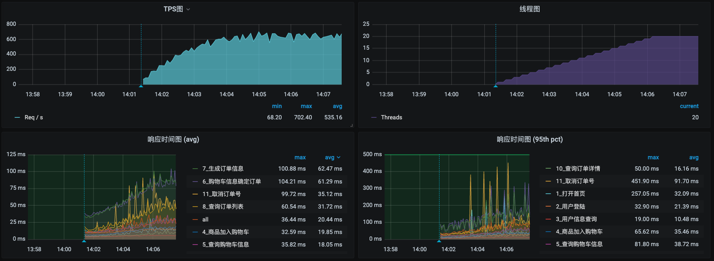

这次TPS增加到了700左右，已经不再增加了。主机资源呢，s12的CPU使用率达到了75\%左右。 同时，网络带宽也用起来了。


不过这个网络带宽还是有点高的，所以我们来查一下是什么消耗了这么大的网络带宽。登录到s11上，执行下iftop命令。

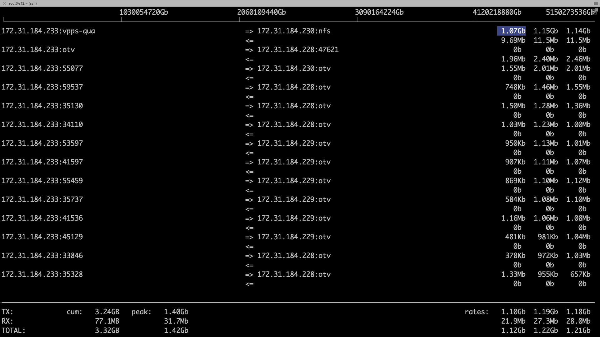

发现这是NFS做同步时使用的带宽。172.31.184.233这台主机是s12，而s12上使用最多的是我们的shadow数据库。

从全局监控的数据来看，s12和s11之间的带宽占得实在是有点高。在同步比较大的时候，居然能达到1.7G以上。就像下面这张图：


我们到s12和s11上分别执行命令netstat，查看一下网络的队列是否存在。


这一步我们要把两边的机器对应着来看。显然，这里是长期有网络队列的，我多次执行了命令来查看这个数据，发现双方还都有send\_Q队列值。这就明显是网络带宽不足的问题了。

因为s12上是数据库，现在的问题就是，数据库作持久化时，由于数据量较大，所以把持久化数据通过NFS写到s11上会占用很大的带宽。要想让带宽降下来，只有一个办法就是把MySQL表数据大小降下来。

在这里，我先把压力产生的数据库的数据给清理一下，像记录表、订单表、购物车表等等，让NFS的流量先降下来。然后再来看看TPS能不能上升一些。

```
    truncate table mall.oms_order_item ;
    truncate table mall.ums_member_login_log ;
    truncate table mall.oms_cart_item ;
    analyze table mall.oms_order_item ;
    analyze table mall.ums_member_login_log ;
    analyze table mall.oms_cart_item ;
    

```

一顿迅猛的操作之后，我们再来看看压力数据。

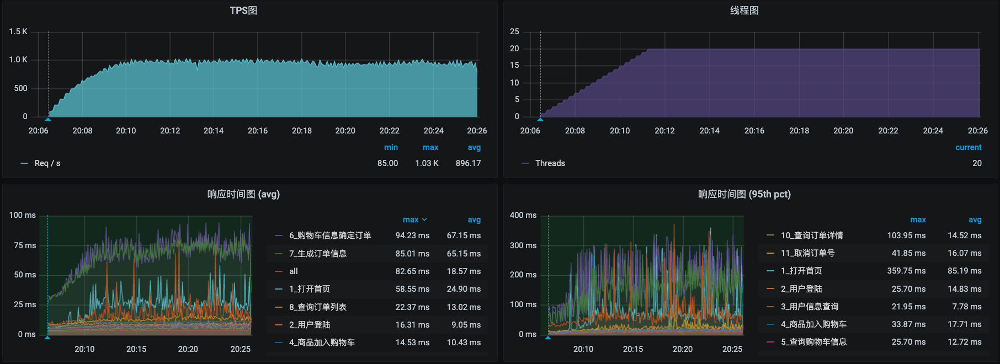

哟，这一下可是快到1000TPS了！再来看一下全局监控的数据。


网络带宽也已经降下来很多了。 效果看起来还不错！

不过这个优化动作虽然在我们这个场景中有效，但是不是一个一劳永逸的解决办法。正常的处理方式应该是换个性能好的IO存储设备，我们这个云服务器的本地磁盘做的NFS，确实在读写能力上是比较差的。当然啦，我们这个示例项目还是可以继续通过清理数据的方式先往下分析。

## 第二阶段

从上面的监控截图中可以看到，我们的目标TPS还没有达到，响应时间倒是挺低。各服务器的CPU资源使用率也并没有特别高，资源都没有用完，还是心有不甘的。

接下来应该怎么办呢？我们还是要来分析有没有优化的点。

### 拆分响应时间

先来看看响应时间。我们得想想时间消耗到哪里去了，再来判断下有没有优化时间的可能性，从资源没有用完的角度来看，应该是有阻塞点。

打开Zipkin，搜索一下结果：

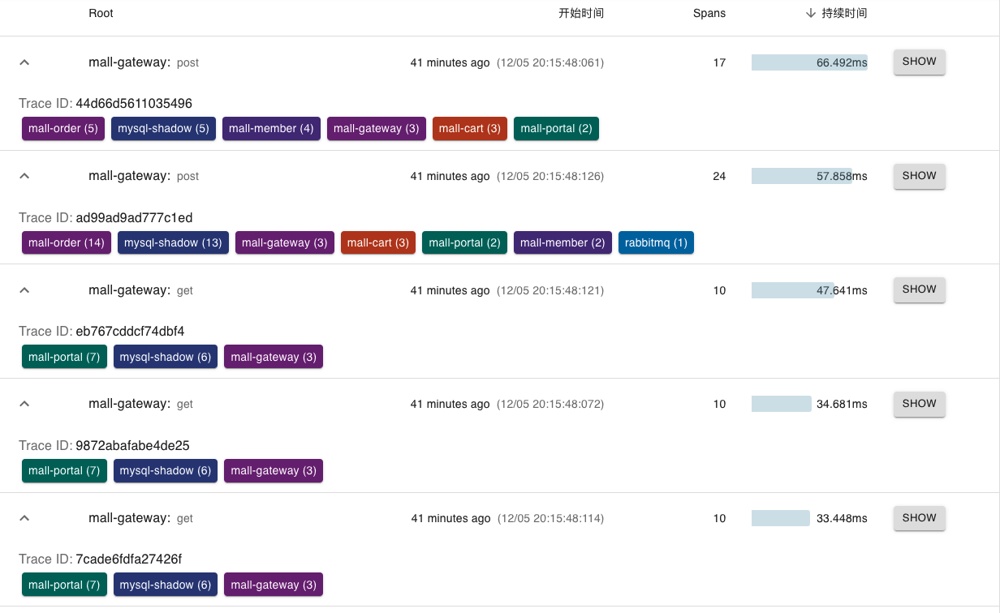

这个时间倒是和JMeter上的时间是接近的。我们点第一个接口show看看：

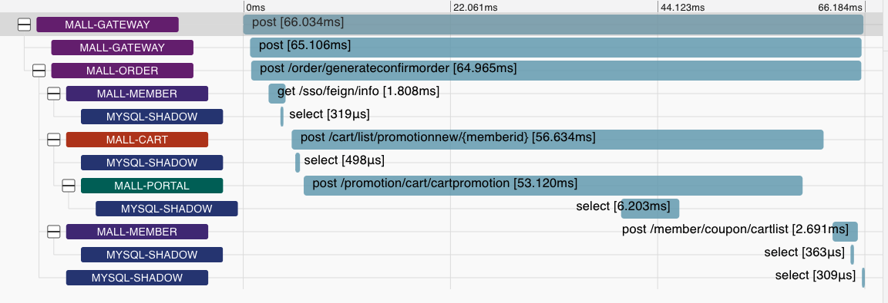

再点第二个接口show，看到的是下面的结果：

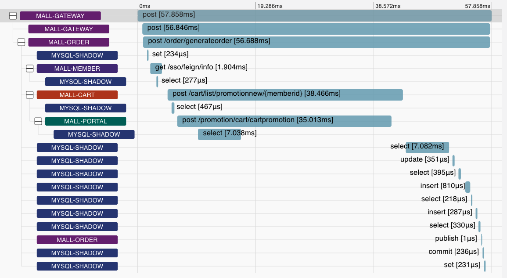

从这两个接口的调用树来看，都是在cartpromotion这里比较慢，子调用中的SQL语句看起来也并不慢。

### 定向监控分析

接着我们就要看看是哪个具体的方法耗时比较长了。这里我用Arthas跟踪一下cartpromotion接口。

我们可以先从代码中找到cartpromotion的接口代码：

```
        @PostMapping("/cart/CartPromotion")
        @ResponseBody
        List<CartPromotionItem> calcCartPromotion(@RequestBody List<OmsCartItem> cartItemList) {
            List<CartPromotionItem> cartPromotionItems = omsPromotionService.calcCartPromotion(cartItemList);
            return cartPromotionItems;
        }
    

```

这里是calcCartPromotion，是计算优惠券的。又因为这个接口是从Portal里面调的，所以我们进入Portal服务中，下载Arthas并启动跟踪。

```
    [root@svc-mall-portal-75cf5c7989-ccsr4 /]# curl -O https://arthas.aliyun.com/arthas-boot.jar
      % Total    % Received % Xferd  Average Speed   Time    Time     Time  Current
                                     Dload  Upload   Total   Spent    Left  Speed
    100  138k  100  138k    0     0   363k      0 --:--:-- --:--:-- --:--:--  364k
    [root@svc-mall-portal-75cf5c7989-ccsr4 /]# java -jar arthas-boot.jar 
    
    [arthas@1]$ trace com.dunshan.mall.portal.controller.CartPromotionController calcCartPromotion -v -n 5 --skipJDKMethod false '1==1'
    Press Q or Ctrl+C to abort.
    Affect(class count: 1 , method count: 1) cost in 97 ms, listenerId: 6
    Condition express: 1==1 , result: true
    `---ts=2021-12-05 21:50:29;thread_name=http-nio-8085-exec-85;id=74b5;is_daemon=true;priority=5;TCCL=org.springframework.boot.web.embedded.tomcat.TomcatEmbeddedWebappClassLoader@5ed190be
        `---[37.443819ms] com.dunshan.mall.portal.controller.CartPromotionController:calcCartPromotion()
            `---[37.38849ms] com.dunshan.mall.portal.service.OmsPromotionService:calcCartPromotion() #35
    
    Condition express: 1==1 , result: true
    `---ts=2021-12-05 21:50:29;thread_name=http-nio-8085-exec-73;id=7438;is_daemon=true;priority=5;TCCL=org.springframework.boot.web.embedded.tomcat.TomcatEmbeddedWebappClassLoader@5ed190be
        `---[34.832809ms] com.dunshan.mall.portal.controller.CartPromotionController:calcCartPromotion()
            `---[34.811947ms] com.dunshan.mall.portal.service.OmsPromotionService:calcCartPromotion() #35
    Condition express: 1==1 , result: true
    
    `---ts=2021-12-05 21:50:29;thread_name=http-nio-8085-exec-86;id=74b9;is_daemon=true;priority=5;TCCL=org.springframework.boot.web.embedded.tomcat.TomcatEmbeddedWebappClassLoader@5ed190be
    
    Condition express: 1==1 , result: true
    `---ts=2021-12-05 21:50:29;thread_name=http-nio-8085-exec-81;id=7480;is_daemon=true;priority=5;TCCL=org.springframework.boot.web.embedded.tomcat.TomcatEmbeddedWebappClassLoader@5ed190beCondition express: 1==1 , result: true
    
        `---[41.252226ms] com.dunshan.mall.portal.controller.CartPromotionController:calcCartPromotion()
            `---[40.220118ms] com.dunshan.mall.portal.service.OmsPromotionService:calcCartPromotion() #35
    
    `---ts=2021-12-05 21:50:29;thread_name=http-nio-8085-exec-71;id=7430;is_daemon=true;priority=5;TCCL=org.springframework.boot.web.embedded.tomcat.TomcatEmbeddedWebappClassLoader@5ed190be
    Command execution times exceed limit: 5, so command will exit. You can set it with -n option.
        `---[42.934061ms] com.dunshan.mall.portal.controller.CartPromotionController:calcCartPromotion()
            `---[42.849213ms] com.dunshan.mall.portal.service.OmsPromotionService:calcCartPromotion() #35
    

```

接着跟踪。

```
    [arthas@1]$ trace com.dunshan.mall.portal.service.OmsPromotionService calcCartPromotion -v -n 5 --skipJDKMethod false '1==1'
    Condition express: 1==1 , result: true
    `---ts=2021-12-05 21:51:36;thread_name=http-nio-8085-exec-91;id=74db;is_daemon=true;priority=5;TCCL=org.springframework.boot.web.embedded.tomcat.TomcatEmbeddedWebappClassLoader@5ed190be
        +---[0.007964ms] com.dunshan.mall.portal.service.impl.OmsPromotionServiceImpl:groupCartItemBySpu() #40
        +---[19.243656ms] com.dunshan.mall.portal.service.impl.OmsPromotionServiceImpl:getPromotionProductList() #42
        +---[0.002098ms] java.util.ArrayList:<init>() #44
        +---[0.001859ms] java.util.Map:entrySet() #45
        +---[0.002208ms] java.util.Set:iterator() #45
        +---[min=0.001209ms,max=0.001753ms,total=0.002962ms,count=2] java.util.Iterator:hasNext() #45
        +---[0.001215ms] java.util.Iterator:next() #45
        +---[0.001574ms] java.util.Map$Entry:getKey() #46
        +---[0.003588ms] com.dunshan.mall.portal.service.impl.OmsPromotionServiceImpl:getPromotionProductById() #47
        +---[0.004646ms] java.util.Map$Entry:getValue() #50
        +---[0.001664ms] com.dunshan.mall.portal.domain.PromotionProduct:getPromotionType() #51
        `---[0.038219ms] com.dunshan.mall.portal.service.impl.OmsPromotionServiceImpl:handleNoReduce() #135
    
    Condition express: 1==1 , result: true
    `---ts=2021-12-05 21:51:36;thread_name=http-nio-8085-exec-85;id=74b5;is_daemon=true;priority=5;TCCL=org.springframework.boot.web.embedded.tomcat.TomcatEmbeddedWebappClassLoader@5ed190be
        `---[40.440293ms] com.dunshan.mall.portal.service.impl.OmsPromotionServiceImpl:calcCartPromotion()
            +---[0.010603ms] com.dunshan.mall.portal.service.impl.OmsPromotionServiceImpl:groupCartItemBySpu() #40
            +---[18.010145ms] com.dunshan.mall.portal.service.impl.OmsPromotionServiceImpl:getPromotionProductList() #42
            +---[0.002138ms] java.util.ArrayList:<init>() #44
            +---[0.001818ms] java.util.Map:entrySet() #45
            +---[0.001696ms] java.util.Set:iterator() #45
            +---[min=0.00118ms,max=0.001659ms,total=0.002839ms,count=2] java.util.Iterator:hasNext() #45
            +---[0.0012ms] java.util.Iterator:next() #45
            +---[0.00145ms] java.util.Map$Entry:getKey() #46
            +---[0.004004ms] com.dunshan.mall.portal.service.impl.OmsPromotionServiceImpl:getPromotionProductById() #47
            +---[0.001356ms] java.util.Map$Entry:getValue() #50
            +---[0.001632ms] com.dunshan.mall.portal.domain.PromotionProduct:getPromotionType() #51
            `---[0.043778ms] com.dunshan.mall.portal.service.impl.OmsPromotionServiceImpl:handleNoReduce() #135
    

```

接着跟踪。

```
    Condition express: 1==1 , result: true
    `---ts=2021-12-05 21:58:38;thread_name=http-nio-8085-exec-94;id=7551;is_daemon=true;priority=5;TCCL=org.springframework.boot.web.embedded.tomcat.TomcatEmbeddedWebappClassLoader@5ed190be
        `---[18.520576ms] com.dunshan.mall.portal.service.impl.OmsPromotionServiceImpl:getPromotionProductList()
            +---[0.001613ms] java.util.ArrayList:<init>() #145
            +---[0.001367ms] java.util.List:iterator() #146
            +---[min=0.001099ms,max=0.001269ms,total=0.002368ms,count=2] java.util.Iterator:hasNext() #146
            +---[0.001267ms] java.util.Iterator:next() #146
            +---[0.001399ms] com.dunshan.mall.model.OmsCartItem:getProductId() #147
            +---[0.00125ms] java.util.List:add() #147
            `---[17.622753ms] com.dunshan.mall.portal.dao.PortalProductDao:getPromotionProductList() #149
    
    Condition express: 1==1 , result: true
    `---ts=2021-12-05 21:58:38;thread_name=http-nio-8085-exec-109;id=7576;is_daemon=true;priority=5;TCCL=org.springframework.boot.web.embedded.tomcat.TomcatEmbeddedWebappClassLoader@5ed190be
        `---[58.172854ms] com.dunshan.mall.portal.service.impl.OmsPromotionServiceImpl:getPromotionProductList()
            +---[0.002119ms] java.util.ArrayList:<init>() #145
            +---[0.001274ms] java.util.List:iterator() #146
            +---[min=0.001152ms,max=0.001362ms,total=0.002514ms,count=2] java.util.Iterator:hasNext() #146
            +---[0.001101ms] java.util.Iterator:next() #146
            +---[0.001395ms] com.dunshan.mall.model.OmsCartItem:getProductId() #147
            +---[0.001216ms] java.util.List:add() #147
            `---[58.125958ms] com.dunshan.mall.portal.dao.PortalProductDao:getPromotionProductList() #149
    

```

可以看到，跟踪到DAO层的时候，这里就直接对应着一个SQL了。

```
    SELECT 
        p.id,
        p.`name`,
        p.promotion_type,
        p.gift_growth,
        p.gift_point,
        sku.id sku_id,
        sku.price sku_price,
        sku.sku_code sku_sku_code,
        sku.promotion_price sku_promotion_price,
        sku.stock sku_stock,
        sku.lock_stock sku_lock_stock,
        ladder.id ladder_id,
        ladder.count ladder_count,
        ladder.discount ladder_discount,
        full_re.id full_id,
        full_re.full_price full_full_price,
        full_re.reduce_price full_reduce_price
    FROM
        mall.pms_product p
            LEFT JOIN
        mall.pms_sku_stock sku ON p.id = sku.product_id
            LEFT JOIN
        mall.pms_product_ladder ladder ON p.id = ladder.product_id
            LEFT JOIN
        mall.pms_product_full_reduction full_re ON p.id = full_re.product_id
    WHERE
        p.id IN (7);
    

```

可是要说SQL执行效果差，也没见数据库所在的节点资源使用率高。这时就不能不来查查JDBC连接池了：  


从这张application.yml截图里可以看到，最大JDBC也只有20，有点低了。我们调到40，把压力线程也提高到60，再压起来，看一下压力场景的数据：

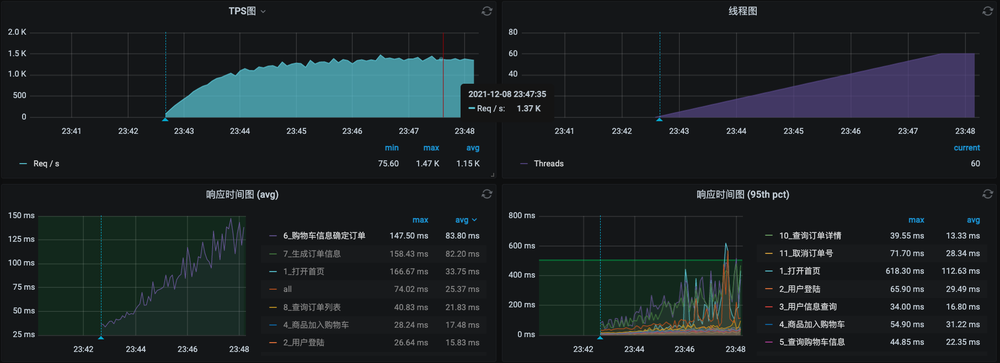

这时候TPS已经能达到1300了！可以达到我们对这个系统的TPS的预期目标了。再来看一下主机的资源：


挺好！资源也用起来了。

不过这里还要说明一下，calcCartPromotion方法的实现是比较复杂的。代码你可以看看我给你截的下面这张图：


这还是折叠起来的。如果把代码都展开，一屏都显示不完。如果想再优化的话，就得考虑一下怎么优化这个方法了。

因为我们现在要做的是全链路压测，现在我们的主要目标是跑出正常流量和压测流量来，所以这个优化方向就先放一放，先跑出两种流量的场景再说。

## 第三阶段

我们再接着来分析还有没有优化的空间。既然刚才我们已经看到了，有些接口的响应时间会随着压力增加而增加，那么我们就直接来判断一下响应时间消耗在哪里去了。

打开Zipkin，看一下排名前十的请求，这里我截取几个图给你看一下。

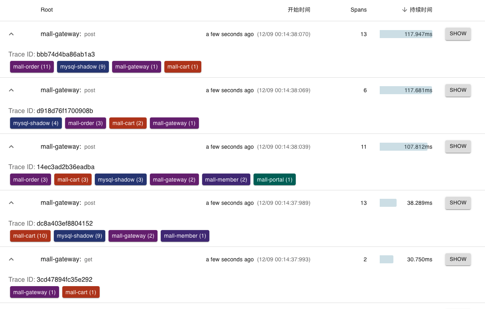

点开一个来看一下。

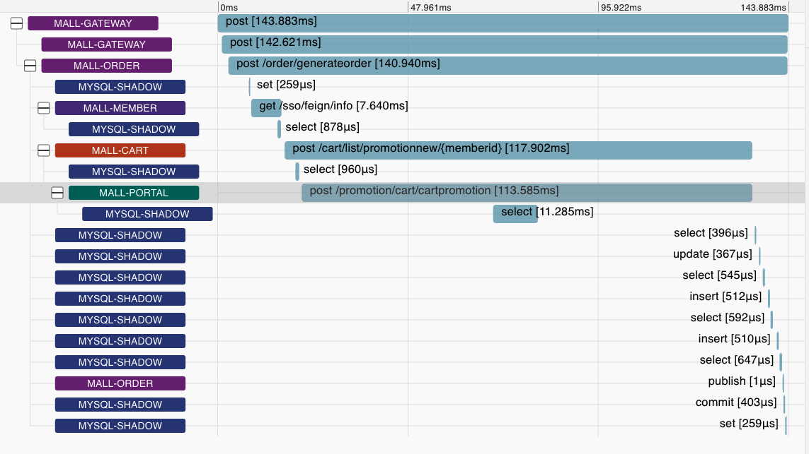

可以看到，这里cartpromotion耗时是最长的，这个逻辑我们前面已经看过了，我就不重复上面的动作了。

### 同时启动正常流量和压测流量

现在我们换个逻辑来跑。我们一边用JMeter来跑正常的流量，一边用GoReplay来跑压测的流量。

还记得我们前面的全链路改造架构图吧。


我把它简化一下就是下面的样子：


现在我们就来按全链路压测的逻辑来实现真实流量和压测流量。我们把JMeter运行起来，TPS在100左右，GoReplay放大150倍。因为GoReplay本身没办法实现连续递增加压（可以自己写脚本实现），我们这里就直接加压力了。

先看看看能达到多高的峰值，我们前面知道，系统的整体TPS大概在1300左右。

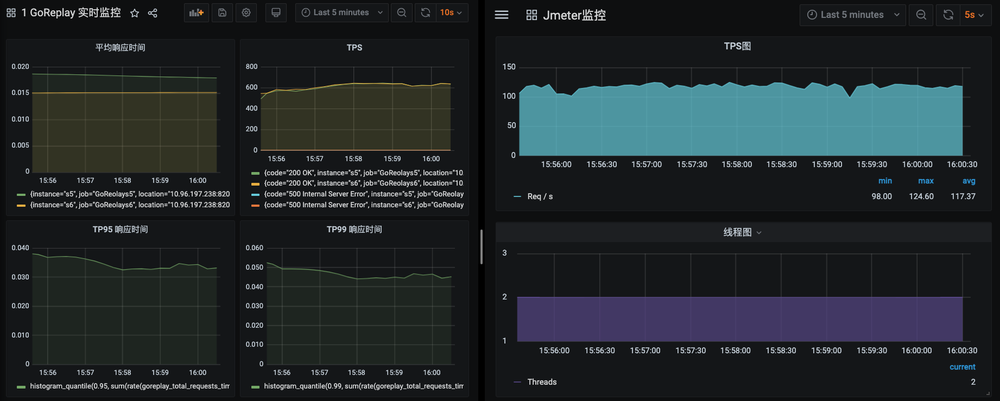

从上面的截图可以看出来，左边的GoReplay运行了两个实例，加在一起大概能达到1250左右，右边JMeter大概能达到120TPS左右。两边加在一起在1370左右。运行非常稳定。

再来看看主机资源使用情况。


现在s11这个主机，CPU使用率接近80\%，其他的还好，说明硬件资源还有空间。

再来看一下两个数据库的流量。

```
    [root@s5 ~]# kubectl get pods -n default -o wide | grep mysql
    db-mysql-produce-7b8fc76c76-45nc7         2/2     Running            5          6d1h    10.100.4.86      s8     <none>           <none>
    db-mysql-shadow-74ff9bdfb4-kkxbq          2/2     Running            0          5d19h   10.100.2.92      s9     <none>           <none>
    [root@s5 ~]#
    

```

这是两个数据库的信息，我们把两边的监控都打开对比看一下。  


可以看到，影子库的连接（MySQL Connections图）和执行的SQL数量（MySQL Questions图）都比正式库要高出很多。

作为全链路压测的场景，这样的资源使用率是比较合理的。因为我们不能给生产环境带来风险，所以不能像在线下压测的环境中那样，让资源使用率达到100\%，这也是要注意的一个要点。

因为前面我们也做了大量的工作，所以这里我们要把相应的记录表给清理一下。再次运行JMeter和GoReplay看看结果：

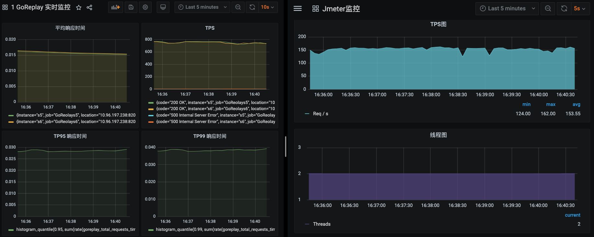

从这个数据可以看到，GoReplay的TPS达到1500左右，JMeter的TPS达到150左右，加在一起一共1650左右，比之前多了300TPS。可见，数据量大了之后对性能的影响也是比较明显的，所以定时定量清理的策略是非常有必要的。

同时你也可以看到，在前面的截图中，有很多次都出现了分区使用率较高的情况，在这个过程中，由于我们的磁盘空间不太多（NFS现在只有100G），很快就用完了，所以我们还要不停去清理日志、监控数据清理等。但是为了不影响主线叙述逻辑，这些琐碎的工作我都没有体现在专栏中。不过你在做压测的时候，一定是要考虑到的。

## 总结

好了，这节课就讲到这里。

刚才，我们同时启动了正常流量和压测流量，模拟了全链路压测场景应该有的样子。

我们全链路压测的目标呢，就是要把两种流量一起跑起来，并且让结果保持稳定。但是不要因为我们把这些场景都跑起来了，也没遇到啥问题，就觉得这个场景非常简单。其实，全链路压测的准备工作是非常多的，像我们之前讲的全链路的改造、数据的准备、两种压力流量脚本的准备、监控的准备等等都是要提前处理好的。我们是在做准备的时候就解决了疑难的技术点，才有了一个比较让人满意的结果。

那么，影响全链路线上压测容量场景的关键因素有哪些呢？我来画个思维导图说明一下：

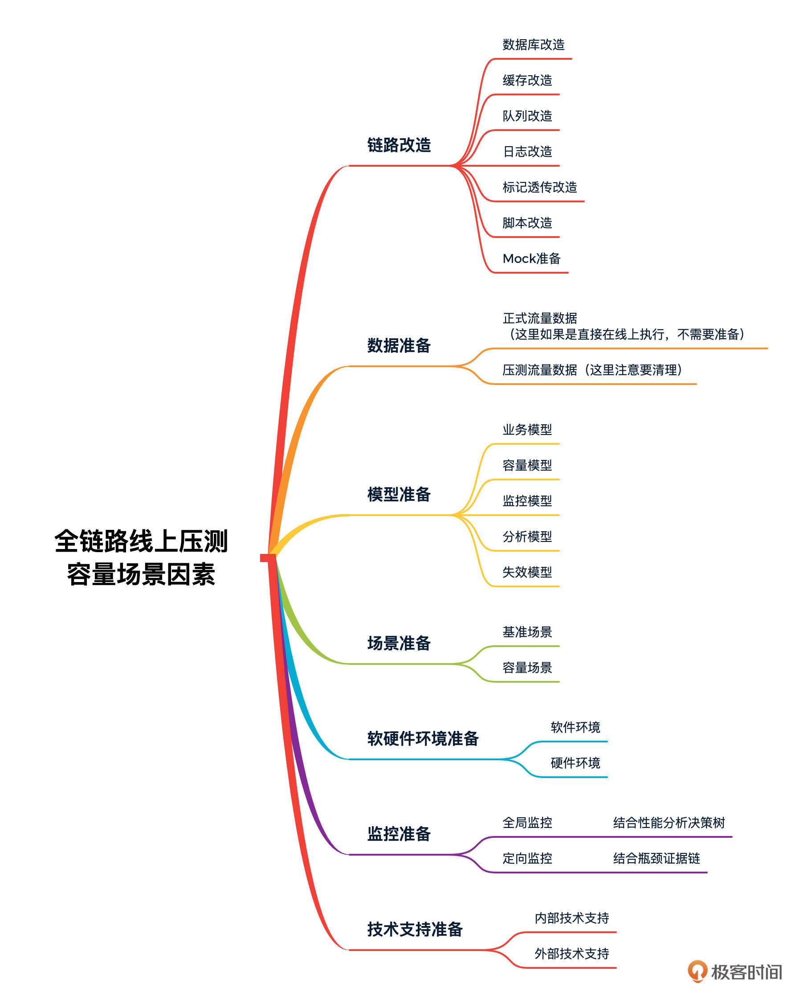

其实在全链路线上压测的逻辑中，想同时跑起来两类场景，对企业的各方面支持都要求非常高。上图中的因素都是需要在具体落地时保证细致而精准的。

全链路线上压测，到这里，我觉得我已经把逻辑描述完整了。如果你一步步跟着学下来，就可以看到全链路压测的所有技术落地细节。全链路压测的实现并不是一个方案就可以描述清楚的，只有通过这些技术的完整落地，才能实现真正的全链路线上压测。

## 课后题

学完这节课，请你思考两个问题：

1.  如果让你实现一个系统的全链路压测，你有明确的方向吗，可以分享一下。
2.  如果你的企业想要落地全链路压测，你觉得最大的阻碍在哪？

欢迎你在留言区与我交流讨论。当然了，你也可以把这节课分享给你身边的朋友，他们的一些想法或许会让你有更大的收获。我们下节课见！