---
date: "2019-06-23"
---  
      
# 32 | 稳定性场景：怎样搞定线上稳定性场景？
你好，我是高楼。

要让我来说几个对线上系统来说特别重要的质量属性的话，我觉得稳定性绝对排在最靠前的位置。在我看来，它对一个系统的重要性可以堪比性能，甚至更为重要。

## 稳定性的重要性

那一个对稳定性要求特别高的系统，靠什么来支撑呢？我认为高性能、高可用、可扩展的设计绝对是不可或缺的，而且这三点的关系是依次递进的。

但是在这三个关键的质量属性上，现实的企业又是如何表现的呢？

**为什么技术市场上有很多企业愿意花大量的资金（通常一年都是千万级甚至亿级）购买硬件来保证系统的稳定性，而不愿意花少量的费用（通常是百万级）来做完整的性能项目呢？**

性能项目的价值显然被低估了。为什么会这样呢？这里我给出最主要的两点原因：

一个原因是，通常业务系统的上线周期中，给技术预留的时间窗口非常有限。一般领导决策、业务分析这些环节就会消耗大量的时间；而到了技术落地的环节，又在架构设计、逻辑设计等层面消耗了大量的时间；等到了实际的代码实现、测试环节呢，它们通常是被认为是体力活的部分，只要堆人就可以堆得出来。虽然我们不同职位的人仍然想奋力实现自己的价值而不断强调自己在做的事情的重要性，但其实你从市场上各职位的薪资情况就可以看得出来自己的实际地位。

<!-- [[[read_end]]] -->

不要跟我说虽然你做测试拿得比架构师少，但是干得比他多就比他重要了。重要性不是这么算的，这得看你的职位在一个系统的整个生命周期中处在什么位置。对于测试实施活动来说，因为它处在架构设计、开发之后，所以从流程顺序的角度而言，这是合理的。性能测试实施也不例外。

但性能工程的思考角度就不一样了，在整个性能工程中，有很多前置的工作。比方说，需要和架构、开发过程紧密结合的工作，需要环境准备、数据准备的工作，需要延伸到运维阶段以环比的工作。这样看来，性能就不仅仅是测试可以覆盖的了。但如果我们只把性能当成“测试”，就注定了时间窗口的局限性，这一点必须承认并接受。

有些人为了摆脱测试工作的被动并发挥测试的所谓重要性，还提出了“测试左右移”的概念。要我说，左右移听起来是想把一些工作揽到测试这个角色上来。倒不如换个思路，将测试换个名称，比如说叫“巡游质检”之类的，这样往哪移似乎都是可以说得通的。

其实打破工作流程中对“测试”的局限，根本不是要改变测试的位置，而是要从性能工程的视角来看一个具体的性能项目，不再受到“测试”的局限。这时它在企业中的价值就会体现出来，而且整体的成本并没有增加，因为那些活动都是必须做的，只是之前是被认为兼职着做，而现在当成正式的工作内容了。

性能项目被低估的第二个原因是，堆硬件确实给一些不缺钱的企业带来了长期稳定的信心，而多数性能测试则做不到这一点。

有很多企业线上的硬件资源使用长期在10\%以下（甚至是5\%以下），而不得不等着那用到40\%的提心吊胆的一刻。但硬件资源的投入仍然往往被认为是绝对有必要的。而技术人员的成本虽然在整个软件工程中并不算少，但测试工程师绝对是这里面最便宜的一类角色了。从外包市场上可见一斑，一个普通的研发外包叫到三四万应该是常见的，而一个测试外包能到3万就算是绝对的高级了。企业内部在招聘时对测试人员的定价也是同样的逻辑。

为什么会这样呢？其实简单来说，就是当前的性能测试从业人员不能给人一个系统一定会稳定运行的**信心**。

这同样依赖于性能项目带给企业的价值。**性能的价值体现是什么呢？就是当你测试了一个系统之后，首先可以给出一个非常明确的能上线不能上线的结论；其次可以给运维非常明确的配置列表，让运维根据你给出的配置来设置生产系统，而且测试场景确实和你的测试结论一致。**这样的性能项目怎么可能让人不放心呢？

综合以上两点，如果我们能够定义好并发挥好性能项目的价值，在稳定性方面给予企业以信心，那企业自然就会愿意在我们身上多花钱了。

## 稳定性场景的准备工作

在运行稳定性场景之前，有几件事情是比较重要的，也是必须要做的：

1.  检查磁盘空间是不是足够；
2.  检查系统状态是不是良好；
3.  检查系统状态数据要不要重置；
4.  协调各部门做好准备。

下面我们就按照这四个要点操作一下。我们首先要保证磁盘空间是足够的。


这里我们要先来看一遍当前的磁盘空间使用率。从上图可以看到，磁盘还有一些空间可用，但是能支持多长时间的稳定性场景我还不能确定，所以我们要尽量腾出更多的磁盘空间。下面这些可以腾出磁盘空间的动作我建议你都先做一下。

日志级别在稳定性执行之前，我建议你先调整为Error，以免产生太多的日志。如下所示：

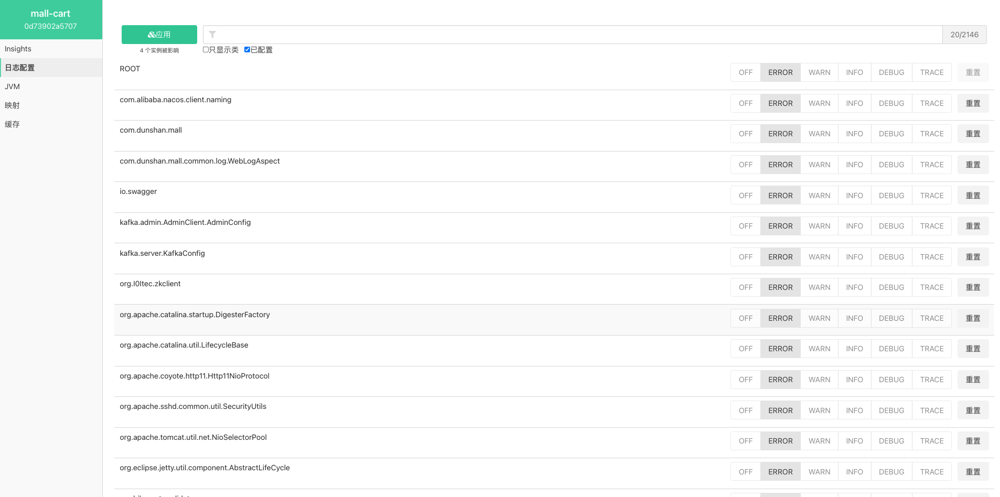

链路跟踪索引文件也要清理：


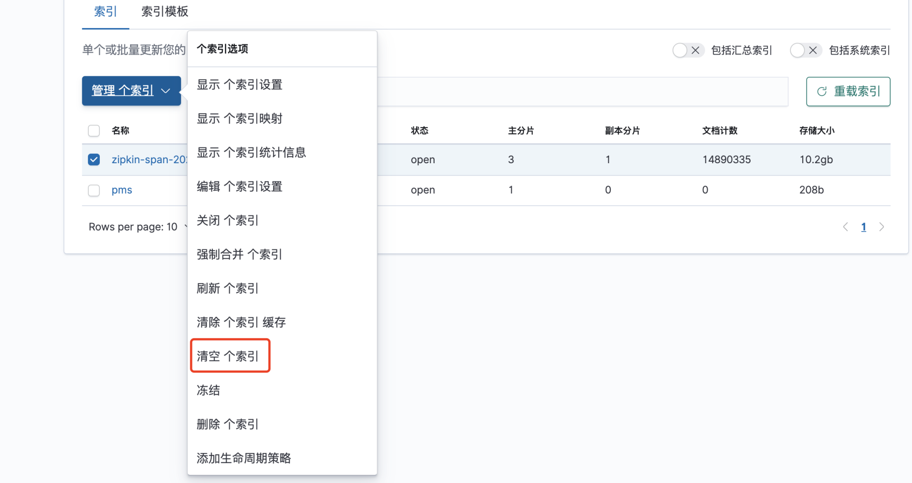

其次，检查系统状态，在我们这个环境中，那就是检查我们在前面提到的全局监控计数器。

再接着，检查系统状态的重置数据，像MySQL、Redis等的状态数据，我基本在每次执行之前都会刷新一遍，手段就是用flush、truncate等命令或直接重启。

最后，就是要通知各部门灯光、音效、磨牙棒都准备好，盯好各自的系统和监控视图了。

但是，现在就可以开始跑了吗？ 别急，我们还要来说一下稳定性场景中的两个关键指标。

## 稳定性场景的两个关键指标

这里就涉及到了稳定性的需求问题了，它具体包括：

1.  稳定性运行时长。
2.  稳定性要用多大压力运行。

上节课我们看到TPS能达到1300左右，对吧。接下来，我们要想知道稳定性运行时长，就得给稳定性运行的业务累积量定个小目标，这里我定了个500万。注意哦，这个纯属是我拍脑袋来的。如果你是在自己的项目中，你要知道怎么得到你的稳定性运行目标。

这一点我在[上一个专栏](https://time.geekbang.org/column/intro/100074001)的稳定性章节已经有过详细的说明，这里为了不让你迷路，我也简单说一下。稳定性场景的运行时长，一定不是胡乱猜的，而是根据系统要支持的业务累积量，再结合系统的容量场景结果计算得来的。

而系统要支持的业务累积量取决于运维周期，有人说现在不都AIOps了吗？还需要人工运维吗？还有运维周期吗？请别那么天真，自动化运维除了在大会和PPT里非常完美之外，能完整又完美落地的企业，不管多大的厂，我还没有见到过。所以你还是乖乖按照老方法把业务累积量算出来就好了，这里我就不多说了。

再回来看看我的这个示例。我把这个业务累积量定为500万，而前面容量场景告诉了我们TPS能达到1350。那我们的场景运行时长就是：

\$\$ \\frac\{5000000\(业务量） \\div 1350\(TPS\)\}\{3600\(秒\)\} \\approx 1\(小时\)\$\$

通过上面的公式，你也可以看出来我是用容量场景的最大TPS来计算的。这是我在RESAR性能工程中定义的。就是说，只要达到业务累积量，稳定性场景可以用容量场景的最大TPS来运行。

当然你也可以用少一点的TPS来运行，那自然就需要更长的时间了。那这两者有没有区别呢？在我的经验中，从稳定性的角度来说，没有什么区别。如果你要考虑成本、业务特性等等杂七杂八的因素，那估计会有一些区别，但那就是另一个话题了。

解释清楚这两个稳定性场景的关键前提之后，下面我们就可以来运行了。

## 运行稳定性场景 Round1

终于能把场景运行起来了，是不是等这一刻也挺久的了？这里我还是沿用容量场景中的配置，只是把时间设置为1个多小时（只要大于前面计算的时长即可）。


真是不动真格不知道，一动真格就掉链子。眼睁睁地看着TPS像西去的太阳就往下落了。

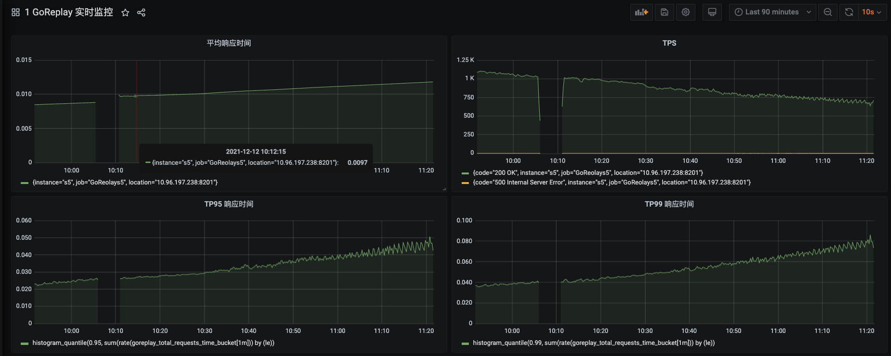

这种系统越来越慢的情况，前面我们已经分析很多遍了，就是走RESAR性能工程的性能分析七步法，找到问题的源头。在这里我直接给出分析的结论部分。

在稳定性场景持续运行过程中，我发现有几个SQL会越来越慢，这里我挑出两个来给你看看。

* SQL1: 第一次观察


* SQL1: 第二次观察


* SQL1: 第三次观察


* SQL2: 第一次观察

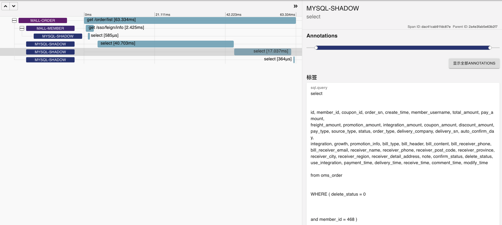

* SQL2: 第二次观察

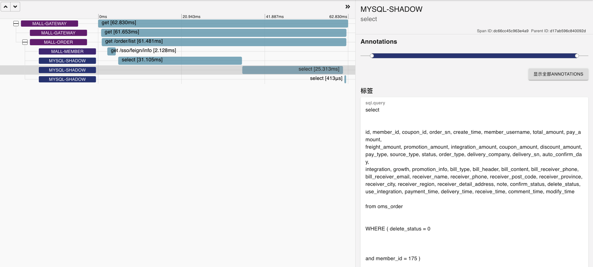

* SQL2: 第三次观察

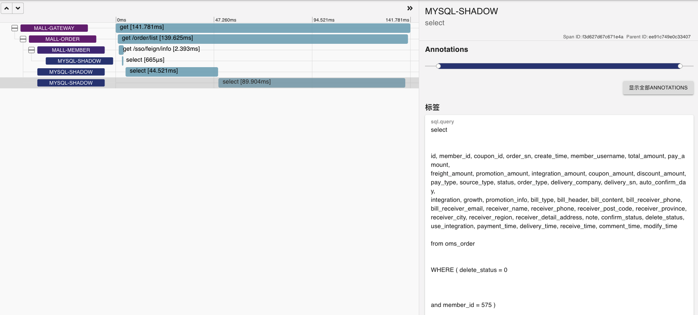  
看到这种SQL越来越慢的情况，我们就可以把慢日志用上了。先来配置一下慢日志。

```
    slow_query_log= 1 
    long_query_time = 0.1
    

```

再到数据库中查一下慢日志的路径。


然后，用pt-query-digest把慢日志梳理一下，看下慢的SQL有哪些。这里我把我发现的前两个慢的SQL展示在这里。

```
    gaolou@GaoMacPro mysqlslowLog % ./pt-query-digest db-mysql-shadow-7b4cfd69fc-5brxd-slow.log
    
    # A software update is available:
    
    # 1.4s user time, 230ms system time, 36.56M rss, 4.15G vsz
    # Current date: Sun Dec 12 13:23:42 2021
    # Hostname: GaoMacPro
    # Files: db-mysql-shadow-7b4cfd69fc-5brxd-slow.log
    # Overall: 7.37k total, 28 unique, 0.56 QPS, 0.07x concurrency ___________
    # Time range: 2021-12-12T01:33:45 to 2021-12-12T05:12:37
    # Attribute          total     min     max     avg     95%  stddev  median
    # ============     ======= ======= ======= ======= ======= ======= =======
    # Exec time           938s   100ms      1s   127ms   171ms    73ms   110ms
    # Lock time          633ms       0     1ms    85us   144us    49us    66us
    # Rows sent          1.33M       0   6.47k  188.89    4.96   1.03k    0.99
    # Rows examine      10.23M       0 740.27k   1.42k   1.61k   8.46k   1.20k
    # Query size         3.28M       6   1.25k  466.26  874.75  390.87   92.72
    
    # Profile
    # Rank Query ID                            Response time  Calls R/Call V/M
    # ==== =================================== ============== ===== ====== ===
    #    1 0xCE1BA85B4464E7410BF01A7637544A08  371.2299 39.6%  3080 0.1205  0.02 SELECT oms_order
    #    2 0xEA7B7E3B4E7276C29456ABBAA4C32D90  275.2189 29.3%  2236 0.1231  0.04 SELECT oms_order
    #    3 0xB694F8C5658ACE1E9488C66225BD6B97  188.9060 20.1%  1468 0.1287  0.06 UPDATE oms_cart_item
    #    4 0xD732B16862C1BC710680BB9679650648   29.2493  3.1%   147 0.1990  0.14 SELECT oms_cart_item
    #    5 0x56A0B23D82E7DDCA8D6F24101F288802   28.2842  3.0%   235 0.1204  0.00 SELECT pms_product pms_sku_stock pms_product_ladder pms_product_full_reduction
    # MISC 0xMISC                               45.0501  4.8%   204 0.2208   0.0 <23 ITEMS>
    
    # Query 1: 0.29 QPS, 0.03x concurrency, ID 0xCE1BA85B4464E7410BF01A7637544A08 at byte 1963385
    # Scores: V/M = 0.02
    # Time range: 2021-12-12T02:14:47 to 2021-12-12T05:12:37
    # Attribute    pct   total     min     max     avg     95%  stddev  median
    # ============ === ======= ======= ======= ======= ======= ======= =======
    # Count         41    3080
    # Exec time     39    371s   100ms      1s   121ms   148ms    49ms   110ms
    # Lock time     61   392ms    78us     1ms   127us   152us    43us   119us
    # Rows sent      1  15.04k       5       5       5       5       0       5
    # Rows examine  37   3.88M     716   1.71k   1.29k   1.61k  143.73   1.20k
    # Query size    80   2.64M     898     901  899.89  874.75       0  874.75
    # String:
    # Databases    mall
    # Hosts        10.100.4.0 (1035/33%), 10.100.3.0 (1023/33%)... 1 more
    # Users        reader
    # Query_time distribution
    #   1us
    #  10us
    # 100us
    #   1ms
    #  10ms
    # 100ms  ################################################################
    #    1s  #
    #  10s+
    # Tables
    #    SHOW TABLE STATUS FROM `mall` LIKE 'oms_order'\G
    #    SHOW CREATE TABLE `mall`.`oms_order`\G
    # EXPLAIN /*!50100 PARTITIONS*/
    select
        id, member_id, coupon_id, order_sn, create_time, member_username, total_amount, pay_amount,
        freight_amount, promotion_amount, integration_amount, coupon_amount, discount_amount,
        pay_type, source_type, status, order_type, delivery_company, delivery_sn, auto_confirm_day,
        integration, growth, promotion_info, bill_type, bill_header, bill_content, bill_receiver_phone,
        bill_receiver_email, receiver_name, receiver_phone, receiver_post_code, receiver_province,
        receiver_city, receiver_region, receiver_detail_address, note, confirm_status, delete_status,
        use_integration, payment_time, delivery_time, receive_time, comment_time, modify_time
        from oms_order
         WHERE (  delete_status = 0
                      and member_id = 651 )
          order by create_time desc LIMIT 5\G
    
    # Query 2: 0.17 QPS, 0.02x concurrency, ID 0xEA7B7E3B4E7276C29456ABBAA4C32D90 at byte 1963110
    # Scores: V/M = 0.04
    # Time range: 2021-12-12T01:33:45 to 2021-12-12T05:12:36
    # Attribute    pct   total     min     max     avg     95%  stddev  median
    # ============ === ======= ======= ======= ======= ======= ======= =======
    # Count         30    2236
    # Exec time     29    275s   100ms      1s   123ms   148ms    66ms   110ms
    # Lock time     19   123ms    24us   480us    55us    73us    17us    52us
    # Rows sent      0   2.18k       1       1       1       1       0       1
    # Rows examine  26   2.75M     416   1.70k   1.26k   1.61k  136.22   1.20k
    # Query size     4 165.68k      74      76   75.87   72.65       0   72.65
    # String:
    # Databases    mall
    # Hosts        10.100.2.114 (772/34%), 10.100.4.0 (761/34%)... 1 more
    # Users        reader
    # Query_time distribution
    #   1us
    #  10us
    # 100us
    #   1ms
    #  10ms
    # 100ms  ################################################################
    #    1s  #
    #  10s+
    # Tables
    #    SHOW TABLE STATUS FROM `mall` LIKE 'oms_order'\G
    #    SHOW CREATE TABLE `mall`.`oms_order`\G
    # EXPLAIN /*!50100 PARTITIONS*/
    SELECT count(0) FROM oms_order WHERE (delete_status = 0 AND member_id = 658)\G
    
    ................................
    

```

这两个SQL显然都和会员相关，并且都涉及到了Order表，另外我还发现它们带宽用得越来越大。


也就是说持续时间越长，即便是压力并没有增加，带宽使用得也会越来越大。

如果业务是固定的话，这种情况显然是不合理的哇。 我仔细考虑了场景的逻辑，觉得应该不会出现越来越大的数据，除非是搞错了。那接下来怎么办呢？

既然带宽增长是和member\_id、Order表有关，那我们就到Order表里按member\_id做一个直方图来看看。结果，不看不知道，一看气血直往上涌。表里只有1000个会员的订单。


看到这里，如果你是有性能参数化经验的人，大概就可以想到原因了，这是请求的参数中只包括了1000个会员导致的。

而我们这里是通过录制回放的方式生成的数据，可见录制的源头也只有1000个用户的数据。我们追回去重新查询了数据，发现果然在JMeter中只用了1000个会员的数据。

没办法，我们只能把参数化数据重做一遍了。这里也要说明一下，经常会有人使用少量的用户模拟容量场景和稳定性场景，这里一定要注意用足够的参数化数据，要不然就只能像我们一样重新再跑一遍了。

## 运行稳定性场景 Round2

好了，重做了一遍参数化数据之后，我们再把场景运行起来。我们是在晚上睡觉之前把场景跑起来的，到了第二天一看，好几个容器都起不来了。 这是什么问题呢？

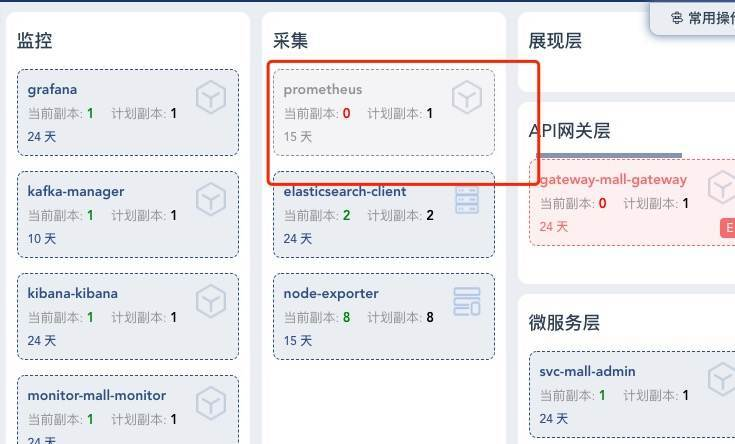

再查看一下k8s里的事件，这里我看到有大量因为磁盘不足导致的容器被驱逐的问题。虽然前面我们已经有过很多操作，想要尽可能保证磁盘空间够用，结果还是着了道。

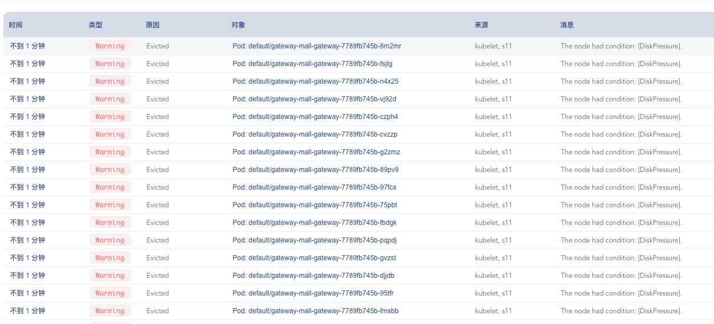

再打开监控工具，发现大部分的数据都展示不出来了。


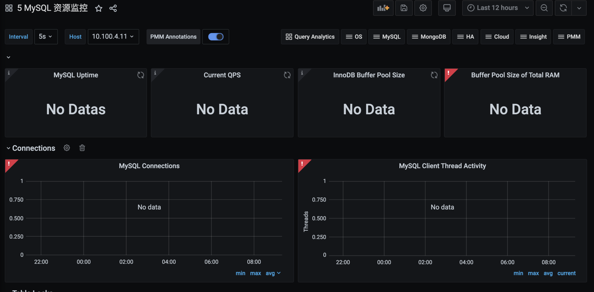

这就是典型的磁盘不足导致的结果。

所说，如果你是在执行稳定性场景，一定要计算好磁盘的空间。刚才我已经强调了磁盘空间会导致稳定性失败的情况，但是因为我在执行的过程中没有设置GoReplay的运行时长（-exit-after参数），导致这里还是出了问题，让整个系统都玩不转了。没办法，只有先清理出足够的磁盘空间，再把各种应用启动起来查看数据。

```
    [root@s9 /]# df -h
    Filesystem                                                                                                             Size  Used Avail Use% Mounted on
    devtmpfs                                                                                                               7.5G     0  7.5G   0% /dev
    tmpfs                                                                                                                  7.6G     0  7.6G   0% /dev/shm
    tmpfs                                                                                                                  7.6G  2.1M  7.5G   1% /run
    tmpfs                                                                                                                  7.6G     0  7.6G   0% /sys/fs/cgroup
    /dev/vda1                                                                                                               40G   16G   23G  41% /
    .................
    172.31.184.230:/nfs/data/default-elasticsearch-master-elasticsearch-master-2-pvc-150ba193-b0c7-4a3b-a303-3d98c94aebdc   99G   89G  5.7G  95% /var/lib/kubelet/pods/291c3569-730d-4efd-a8b8-83fbd2b2ef90/volumes/kubernetes.io~nfs/pvc-150ba193-b0c7-4a3b-a303-3d98c94aebdc
    .................
    172.31.184.230:/nfs/data/default-data-kafka-0-pvc-1dad22ee-9870-41cc-9ad9-3833b7930701                                  99G   89G  5.7G  95% /var/lib/kubelet/pods/27c1eb21-3c98-4a2e-a18a-0ee6c5c98466/volumes/kubernetes.io~nfs/pvc-1dad22ee-9870-41cc-9ad9-3833b7930701
    .................
    172.31.184.230:/nfs/data/default-data-zookeeper-0-pvc-f0af4c78-75e0-4d19-b748-b3471fd994d0                              99G   89G  5.7G  95% /var/lib/kubelet/pods/ec234fbe-7711-4696-82bd-055ada800b8b/volumes/kubernetes.io~nfs/pvc-f0af4c78-75e0-4d19-b748-b3471fd994d0
    .................
    

```

从上面的信息可以看到，挂载的NFS都达到了95的磁盘消耗。而k8s默认的情况下，磁盘空间达到75\%就会驱逐容器了。

经过了一轮磁盘空间清理之后，各机器也有了足够的磁盘空间。

```
    [root@s9 mall]# df -h
    Filesystem                                                                                                             Size  Used Avail Use% Mounted on
    devtmpfs                                                                                                               7.5G     0  7.5G   0% /dev
    tmpfs                                                                                                                  7.6G     0  7.6G   0% /dev/shm
    tmpfs                                                                                                                  7.6G  2.0M  7.5G   1% /run
    tmpfs                                                                                                                  7.6G     0  7.6G   0% /sys/fs/cgroup
    /dev/vda1                                                                                                               40G   17G   22G  44% /
    .................
    172.31.184.230:/nfs/data/default-elasticsearch-master-elasticsearch-master-2-pvc-150ba193-b0c7-4a3b-a303-3d98c94aebdc   99G   61G   34G  65% /var/lib/kubelet/pods/291c3569-730d-4efd-a8b8-83fbd2b2ef90/volumes/kubernetes.io~nfs/pvc-150ba193-b0c7-4a3b-a303-3d98c94aebdc
    .................
    172.31.184.230:/nfs/data/default-data-kafka-0-pvc-1dad22ee-9870-41cc-9ad9-3833b7930701                                  99G   61G   34G  65% /var/lib/kubelet/pods/27c1eb21-3c98-4a2e-a18a-0ee6c5c98466/volumes/kubernetes.io~nfs/pvc-1dad22ee-9870-41cc-9ad9-3833b7930701
    .................
    172.31.184.230:/nfs/data/default-data-zookeeper-0-pvc-f0af4c78-75e0-4d19-b748-b3471fd994d0                              99G   61G   34G  65% /var/lib/kubelet/pods/ec234fbe-7711-4696-82bd-055ada800b8b/volumes/kubernetes.io~nfs/pvc-f0af4c78-75e0-4d19-b748-b3471fd994d0
    .................                                                                                                            
    

```

我们再把场景运行起来。这次我们还是老老实实地运行时间短一些，能达到我们的小目标（500万的累积数据量）就可以了。

这里我还是用JMeter模拟正常的生产流量，GoReplay模拟压测流量。我们一起来看看结果吧：

* JMeter的运行结果：

  
从JMeter的运行结果来看，在近两个小时的时间内，业务累积的请求量超过了102万。TPS稳定，响应时间也很稳定。

上图中间有一个掉下来的缺口，应该是和某个单节点的服务FullGC有关，这里我不再对它进行具体分析了。因为对稳定性来说，我们关注的是整体的累积业务量。

* GoReplay的运行结果：  
  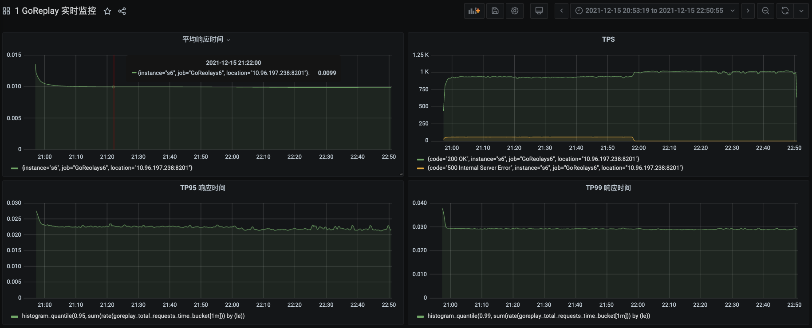

从TPS的趋势图上来看，TPS非常稳定。但因为GoReplay没有总请求量的数据，我们只有拿它的TPS来和JMeter的TPS进行比较计算。也就是：  
\$\$102万 \\times \\frac\{1000\}\{150\} \\approx 680万\$\$

这里之所以用1000来计算，是看到TPS曲线接近1000，这里没有达到容量场景的1350的原因是经过了长时间的运行，数据库中的数据比之前又增加了一些，SQL的执行时间变长了一点。即便TPS也有低的时候，也应该不会小于500万的数据量了。

再来观察一下这段时间的资源使用情况。


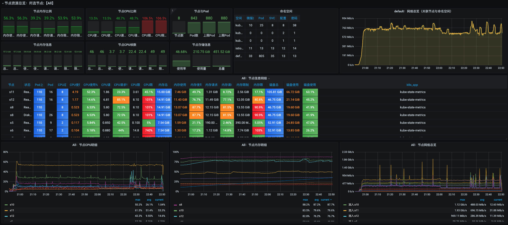

可以看到，资源也都一直保持良好的状态。这样，我们的稳定性场景就可以顺利完成了。

## 总结

好了，这节课就讲到这里。

稳定性场景是一个系统能否持续运行下去的证据，对于稳定性场景来说，最重要的当然就是稳定。当然，对于稳定的定义，不同的系统也有不同的逻辑。不过通常我们要关注的就是稳定性场景的两个重要指标：**稳定性运行时长和TPS量级。**不管你用多大的TPS量级来运行稳定性场景，业务累积量都是要达到的。

我们经常听到企业中说“系统要7\*24运行，可用性要达到99.99\%”，可是达到这样的目标，要用什么样的技术实现来保证呢。只喊一句空话倒也是简单，但如果可用性的百分比只能事后计算，那也意义不大。

如果你想用稳定性场景来覆盖可用性的需求，其实是可以做得到的，但是，必须要考虑成本。就拿724这种在大部分企业中都只是挂在嘴上而不落地的虚假指标来说，如果想把它变成可以落地的不虚假的指标，就需要把一个系统完整地运行一个星期。你可以想像在参数准备、环境占用、人力保证等各方面的成本投入。至今为止，我还没见过几个企业真正做到过724的稳定性场景。那怎么办呢？结果就是运维背锅呗。这种情况是我们都不愿意看到的。

刚才说的这些听起来非常完美的指标理论上不是不对，只是成本太高很难实现。毕竟让系统无损地持续下去才是关键，所以我们只要按照今天所讲的逻辑把稳定性场景运行起来，把问题都解决掉，这就很好了。

## 问题

学完这节课，请你思考两个问题：

1.  在你经历过的性能项目中，稳定性场景是如何设计的？
2.  你觉得稳定性场景在落地过程中最大的难点在哪里？

欢迎你在留言区与我交流讨论。当然了，你也可以把这节课分享给你身边的朋友，他们的一些想法或许会让你有更大的收获。我们下节课见！