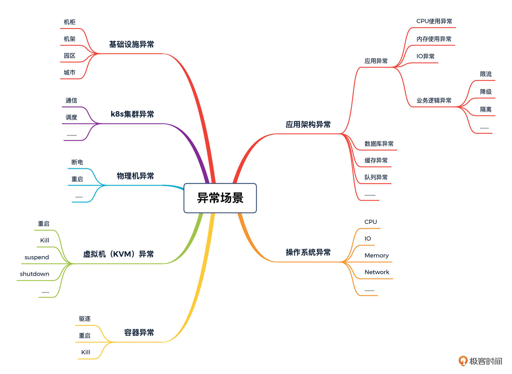
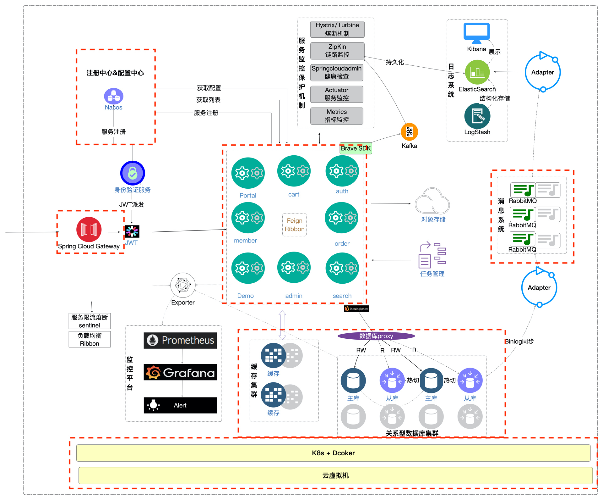
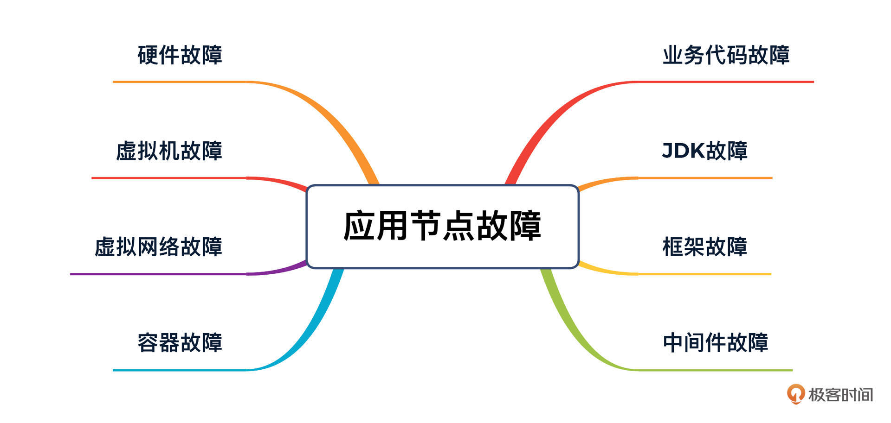
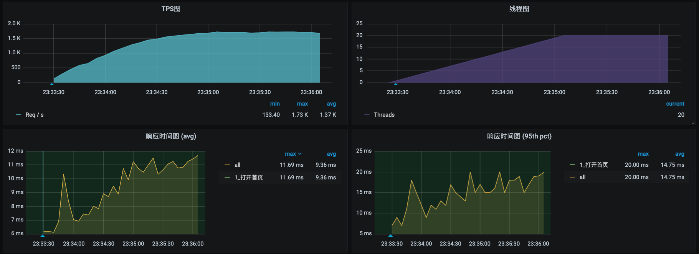
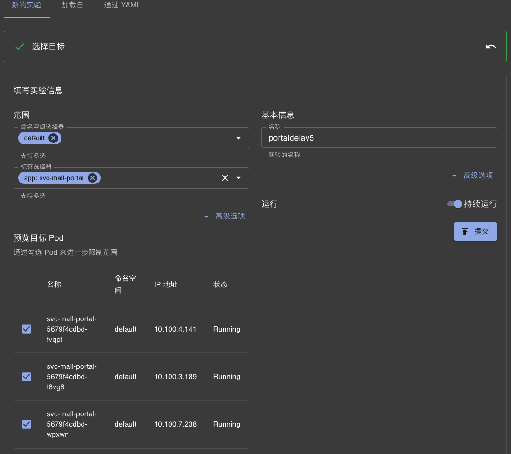
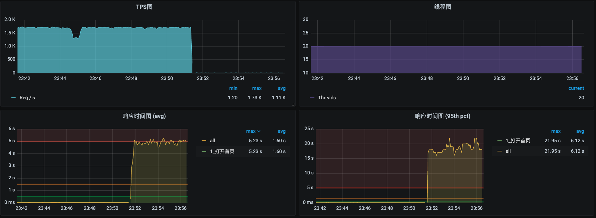
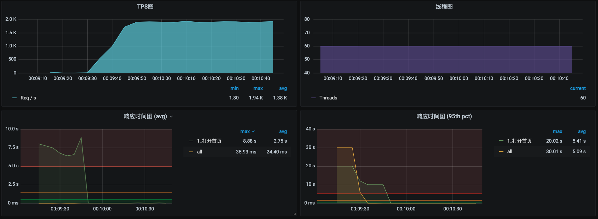
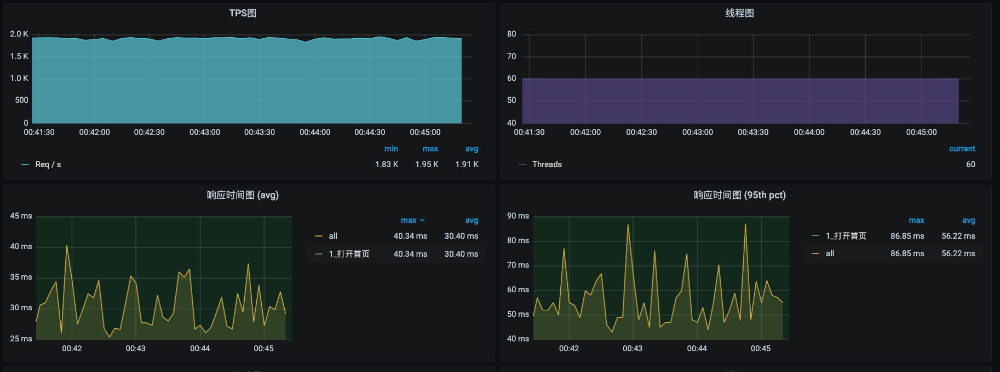
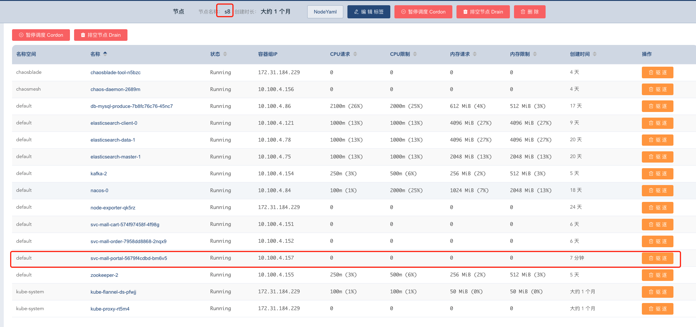
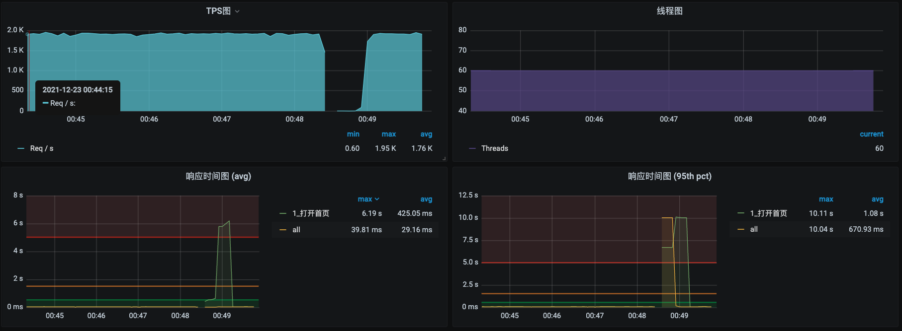

---
date: "2019-06-23"
---  
      
# 33 | 异常场景：如何模拟线上不同组件的异常场景？
你好，我是高楼。

这节课，我们来讲讲如何模拟全链路压测的异常场景。异常场景的本意就是通过在场景正常运行时对故障进行模拟，来查看故障产生时业务的响应能力。相比以前的SOA技术架构，全链路压测的异常场景更复杂了一些。复杂点来自于微服务分布式架构的特性、容器化和云基础环境等内容。

## 异常场景有哪些？

我们以前做的异常场景基本上是：宕主机、宕应用、宕网卡。而在我们云原生的微服务分布式的全链路逻辑中，需要考虑的异常场景就更多了，我给你画了一张思维导图，你可以参考一下。



除了异常场景，还有两个词经常被拿来表示故障模拟：混沌工程和非功能测试。

混沌工程这个词这几年非常流行，想必大家是听说过的。不过它的概念虽然听起来非常高级，经过我的观察，现在我们看到的到混沌工程方向上的开源工具，其实有着一定的局限性。它基本上要实现的就是容器异常、代码异常、应用异常、系统异常这几个方面， 结合我们上面的图来看，你会发现像基础设施级的故障它就模拟不到，所以说混沌工具现在还是有缺失的。

故障模拟在企业中的另一个叫法就是非功能测试。如果你接触过企业里的非功能测试案例，会有一个直观的感受，那就是故障案例都是模拟的非常重要的故障点。但是！不管是叫异常、还是混沌、还是非功能，我们所能够看到的案例都是有限的几个、几十个，顶多上百个，在企业里能看到上千个案例的非常少。

<!-- [[[read_end]]] -->

如果说通过前面我们提到的基准场景、容量场景、稳定性场景就已经可以说明一个系统在正常运行时的性能了，那么异常场景到底应该如何设计才能做到全面覆盖呢？这是一个非常难回答的问题。大部分人可能根本不会从测试的全面性的角度来思考这个问题，而是选择一些看似很重要的案例来执行一下就好了。你可以说这是一种不负责任的做法，当然也可以认为只能是这样了，因为没有一个更好的方式。

我做性能这些年来，对业务异常的思考也从来没有停止过。借助工作上的一些契机，最近我在尝试做一个之前从来没有做过的事情，那就是把异常场景考虑完整。为了说明我是怎么思考的，我把我们这个项目的架构图又放在了下面。



从图中你可以看到，我在一些关键的部分画上了红色的框框。为什么要画这些红框呢？因为如果让我设计异常场景的话，从一个架构的视角来看，我就会从这些角度去设计。但是，只考虑这些就够了吗？如果你是买的云虚拟机，从架构上看，应该是没有盲点了。但是底层的硬件、网络仍然不在掌控范围内。所以如果一个企业决定用云厂商提供的环境，底层的硬件故障就不可能模拟得到了。

如果你天真地问：“云厂商提供的环境不是可以不考虑硬件吗？由厂商来保证可用性就可以了呀。”那我估计你是没有经历过因为厂商硬件损坏导致的不可逆故障。Netflix刚开始想做混沌工程，就是因为遇到了几次云厂商故障导致的事故，他们这才想到用混沌工程的逻辑来验证系统的稳定性。其实严格点来说，混沌工程就是硬件不在手里不得已而为之的一个思维逻辑。

现在再回头看看，如果我想把异常故障场景考虑周全，还需要做什么呢？在混沌工程的逻辑之上，我们只要再多考虑一下硬件基础设施的故障就可以了。这样就和我刚才给出的异常场景思维导图对应上了。

光说不练假把式，只有理论还不行，我们还是要落地才会有真实的效果展现。下面我们就落地一个应用级的故障点来看一下要考虑的东西有多少。

拿这个专栏用的应用节点（其他各节点也都类似）来说，我们虽然有k8s+docker来保证调度的均衡，但是当节点出现故障的时候，要想评估故障对用户产生的影响，我们还是要从业务代码、JDK、框架等各种角度来模拟更为全面的故障，你可以看看下面我给你画的这张图：



在具体落地的时候，我们还可以对这张图再进行细化。比如，对业务代码故障，我们可以去模拟方法执行时间长、内存溢出等故障；对容器，我们可以模拟CPU、内存等故障；对网络，我们可以模拟延迟、丢包、抖动、重复包等故障。这样一个个列下去，这张图就会变得非常完整了。

那说了这么多的故障分析逻辑，我们还是要通过具体的案例来看看异常场景应该如何操作。下面我会用把原理解说和混沌工具的使用结合起来，给你演示一个非常具体的异常场景。在这里我虽然会使用工具，但是我不想强调工具的作用，因为工具是实现思维逻辑的，没有逻辑，工具是没有灵魂的。

我选择了一个重要的场景进行演示，那就是响应延迟场景。因为很多故障出现的时候，都会表现为响应延迟。比如说方法执行时间长、内存在慢慢泄露、CPU负载高、IO负载高、线程配置不合理等等原因都有可能导致一个服务出现响应延迟。

下面我就通过模拟完整的网络延迟故障，来让你理解异常场景的具体落地过程和原理。

## 网络延迟故障模拟

我们来模拟一下Pod级网络延迟的异常场景。

首先，我们把场景跑起来。这里为了操作简单，我只用了一个访问首页的接口，毕竟异常场景也不是为了看最大容量。



好，我们把场景跑了一会儿之后，看到TPS已经非常稳定了。下面我们就来模拟一下网络的延迟。这一次我使用ChaosMesh这个工具，如果你对这个工具不熟悉，可以参考一下这几篇文章：

* [《混沌工具之ChaosMesh编译安装》](https://mp.weixin.qq.com/s/9EvKaTiq62OwfpxqyOTXvQ)
* [《混沌工程之ChaosMesh使用之一模拟CPU使用率》](https://mp.weixin.qq.com/s/3O-cYIggprhgzORMvZOcxg)
* [《混沌工程之ChaosMesh使用之二模拟POD网络延迟》](https://mp.weixin.qq.com/s/XSIsO2N1sUvnmxMqSOTO8Q)
* [《混沌工程之ChaosMesh使用之二模拟POD网络丢包》](https://mp.weixin.qq.com/s/pWd-R7aZVRaNMFt2wZCMDQ)
* [《混沌工程之ChaosMesh使用之三模拟POD网络丢包》](https://mp.weixin.qq.com/s/KTkPQ9WHgqG11X5y3Fgc5g)
* [《混沌工程之ChaosMesh使用之四模拟网络Duplicate包》](https://mp.weixin.qq.com/s/twq-3Pprm14F5BVjBy3SbA)

打开ChaosMesh，创建一个新的实验。


选择网络攻击，再选择DELAY，写入Latency 1000ms，提交。



接着配置范围，选择Portal服务中的三个节点，填入名称，点击持续运行。

注意，这里先别点提交。我们先到容器里来看一下网络队列有没有配置。上图中的容器是svc-mall-portal-5679f4cdbd-fvqpt，现在进入到这个容器中去。


下一步点击“Bash”，可以直接进入到这个窗口的Shell中。执行如下命令：

```
    [root@svc-mall-portal-5679f4cdbd-fvqpt /]# tc QDisc ls dev eth0
    QDisc noqueue 0: root refcnt 2 
    

```

可以看到，当前容器的网卡QDisc队列中什么也没有配置。

我们再回到ChaosMesh的界面中点击两次提交，就看到下面这个界面：


再次进入到这个容器的Shell容器执行命令：

```
    [root@svc-mall-portal-5679f4cdbd-fvqpt /]# tc QDisc ls dev eth0
    QDisc netem 1: root refcnt 2 limit 1000 delay 1.0s
    

```

可以看到，这里产生了一个延迟1秒的配置。

现在我们回到TPS界面看一眼效果。



发现居然所有请求的响应时间都上升了，并且没有继续提升上去。


我们停止运行这个实验，再回来看看TPS。



通过截图可以看到，TPS已经恢复了。

现在我们来解释一下这个实验的实现原理。为什么我在提交实验之前先去查了一遍网络呢？这是为了让你看到，一开始在网卡排队规则上没有任何的延迟配置，我们是在提交了实验之后才看到了1秒的延迟配置。这就是这个实验的核心。

那这个QDisc是个什么队列呢？我们来看一张数据传输图。


请注意看我在图上标识的红框，这个QDisc就是我们前面的实验操作控制的网卡排队的地方。现在我们来说明一下这个QDisc。

> QDisc\(排队规则\)是queueing discipline的简写，Linux内核需要通过网络接口发送数据包，在发送时都要为网络接口配置QDisc（排队规则），数据包要根据这个规则加入到队列当中。

我们的实验就是通过控制这个排队规则实现网络包的延迟发送的。

其实你没有工具也照样可以做到这一步，你可以直接使用TC命令来操作QDisc，实现的逻辑是完全一致的。具体的操作你可以参考这篇文章：[《性能场景之网络模拟》](https://mp.weixin.qq.com/s/O0OgE51El_rF2EZ02LGjdA)。

在k8s架构中，要实现上面这个实验的配置文件内容如下：

```
    kind: NetworkChaos
    apiVersion: chaos-mesh.org/v1alpha1
    metadata:
      name: portaldelay6
      namespace: default
      annotations:
        experiment.chaos-mesh.org/pause: 'true'
    spec:
      selector:
        namespaces:
          - default
        labelSelectors:
          app: svc-mall-portal
      mode: one
      action: delay
      delay:
        latency: 1000ms
        correlation: '0'
        jitter: 0ms
      direction: to
    

```

你可以直接创建一个yml文件，把上面的内容放进去，直接执行一下kubectl apply \-f \<文件名>即可实现。

所以你看，我们不用特别依赖工具，手工的操作也同样可以做到。像ChaoBlade/ChaosToolkit也都是这样的实现逻辑。

## Pod驱逐故障模拟

下面我们再来看一下Pod驱逐的异常场景。Pod被驱逐应该说是k8s的环境中比较常见的问题之一了。

我们还是先把场景跑起来，等待TPS稳定了之后再操作。



这次我们不借助什么混沌工具了，等TPS稳定之后，我们直接用k8s的管理工具实现驱逐。



直接点击驱逐。


点击确定，再来看看我们的TPS。



可以看到，TPS确实又掉下来了。再检查一下现在被驱逐的容器调度到哪台机器上去了。


看，现在没有s8了，因为我们已经把它驱逐掉了。

## 总结

好了，这节课就讲到这里。刚才，我对我认为比较重要和常见的两个异常场景进行了模拟。当然了，除此之外的异常场景还有很多。你可以根据我这节课讲的内容，自已尝试模拟一下其他的异常场景，看一下应用架构的应用策略是否符合业务的要求。

在微服务分布式架构中，不管系统是不是全链路的，其实异常场景的范围是不会有什么变化的。我们要注意的是，如果你使用的是我们这个专栏的全链路的逻辑，那在做异常场景时，因为真实流量和压测流量走的是同样的服务，所以故障会同时影响到正常流量和压测流量。

如果你想在生产环境中做故障模拟，我还是提醒你小心行事，避免因为操作失误产生额外的风险。如果你想实现的是灰度发布的逻辑，也就是我们在[第20讲](https://time.geekbang.org/column/article/462212)中提到的Service Mesh的发布逻辑，那么因为压测流量和正式流量走的是不同的应用节点，就不会产生相互的影响。但那样的话，也就不是真正的全链路了，你可以把它看成是完全独立的两个应用链路。

## 课后题

学完这节课，请你思考两个问题：

1.  你可以根据项目中的应用架构列出需要测试的异常场景吗？
2.  如果要模拟CPU负载异常，你能想出几种方式？

今天是2022年的第一天，希望你有个漂亮的开年。2021已经结束了，但学习不会止步。也欢迎你在留言区继续与我交流讨论。我们下节课再见！