---
date: "2019-06-23"
---  
      
# 35 | 压测报告：怎样写出一份让老板满意的报告？
你好，我是高楼。

在一个性能项目中，我觉得有三类文档是必须要存在的，那就是性能方案、调优报告和性能报告，它们分别代表了我们在项目实施前、实施中、实施后三个阶段的工作表现。而我们只要看看性能报告，大概率就可以知道一个项目做得如何了。

性能报告是非常重要的一份文档，它不仅要给性能方案中提出的问题一个准确的答复，也就是明确测试目的有没有达到，还要告诉非技术型领导，这个系统能不能支撑正常的业务运行。所以性能报告通常会有两种形式：Word版和PPT版。Word版是给技术人看的，PPT版是给领导看的。

但是，现在大部分人写的性能报告都只是应付一下流程，除了告诉别人“这个系统我检查完了”，好像也没有什么实质性的作用。为什么这么说呢？原因有下面几点：

* 没有明确的可不可以上线的结论。

这一点至关重要。我收集了几个结论型的描述语句给你看看。

> 经过多轮的性能测试及调优，系统在部分方面达到了设计需求，可以满足当前部分业务需求，但还未达到最佳性能状态，仍存在可调优的点。

> 测试含风险通过。

> CPU用了80\%、内存用了90\%，TPS达到1000，95\%响应时间是500ms。

类似这样的描述可以说是数不胜数。总结一下就是只有模糊的描述，没有明确的结论。有人说，CPU使用率80\%不算是明确的结论吗？那是肯定不能算的。

<!-- [[[read_end]]] -->

结论首先要和方案中的目标对应上，你的结论应该是，目标有没有达到。可惜的是很多方案连写的目标都是模糊的，那就导致结论也是没法精确的。

另外，结论还要和场景对应上，其中最重要的就是容量、稳定性和异常场景。有人说，咦，你不是一直说四类场景吗？怎么不要基准场景了？ 在结论处，我们要描述的是整个项目对线上的系统运行有什么明确的支撑，我觉得基准场景可描述可不描述。但容量、稳定性、异常是必须要描述的，因为我们的目标就是要回答线上是否能正常运行的问题。

* 没有明确的性能上限原因的证据。

每一个系统都有性能的上限。通常我们给出的是**稳定运行的最大TPS值**。而报告中，要描述出来的是为什么系统只能达到这个TPS值。

如果是因为指标只需要这么多，那硬件资源还有多少可用的水位；如果是某类硬件资源（CPU、IO、内存、网络、存储等）用到了上限，那就会有非常明确的证据；如果是因为系统设计导致的上限、因为参数配置导致的上限…那也都会有明确的证据。

唯独没有描述证据是不行的。你要是说“我的系统只能支持1000TPS，但是为啥只能支撑1000TPS，我不知道”，这肯定是不行的。

* 没有生产运维的配置数据。

作为性能项目，在明确上面两点的基础之上，我们还一定要告诉生产运维如何配置。比如说：最大最小线程数、超时时间、熔断限流规则等等各类参数。有多少这样的配置项呢？这就要参考我们的性能分析决策树对应的性能配置树了。

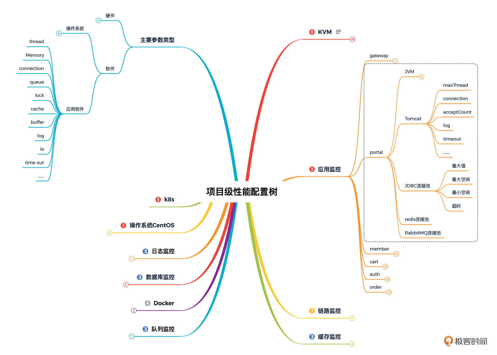  
我把配置树的思维导图放在了上面，展开了其中一部分给你参考一下。

在一个具体的项目中，如果全取默认值，倒也简单了，你可以直接告诉运维都取默认值就可以了。不过但凡有值的变动，你都应该记录下来给到运维。关于这一部分你可以参考我上一个专栏的[第30讲《如何确定生产系统配置？》](https://time.geekbang.org/column/article/379841)。 在这个专栏中我们就不展开了，不然就重复了。

那接下来，关键的问题来了。针对我们这个专栏，压测报告应该怎么写呢？压测的报告中的很多内容跟压测方案是一一对应的，所以我在报告中也会把相应的内容列出来并给出解释。如果你不记得方案了，可以回去看看[第3讲](https://time.geekbang.org/column/article/428497)。

## 压测目标

> 1.  根据经典的电商下单流程，测试当前系统的单接口最大容量。
> 2.  录制真实的线上流量，回放压测流量，充分利用当前服务器资源，找到当前系统的性能瓶颈并优化，最终达到最佳容量状态。
> 3.  结合稳定性场景，做到精准的容量规划，给服务做限流降级提供数据上的参考。
> 4.  结合异常场景，实践并判断当前系统中的异常情况对线上产生的影响。

显然，上面的每一条我们都是实现了的。第一条对应的是第29讲基准场景；第二条对应的是第30和31讲的容量场景；第三条对应的是第32讲的稳定性场景；第四条对应第33讲的异常场景。

## 压测范围

> 通过梳理核心压测链路，即电商下单主流程，可确定压测范围，如下所示：  
> 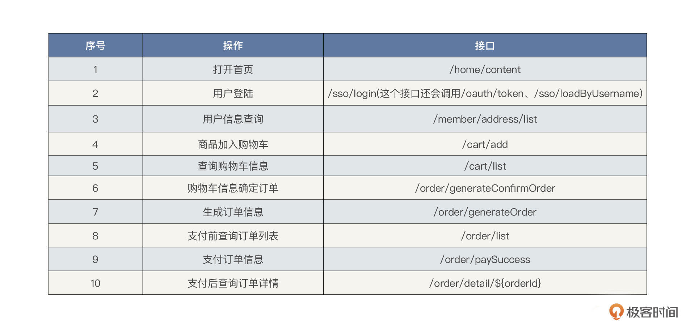

我们在编写脚本时就是对应这10个接口的。

## 系统架构图

### 系统技术栈

> 微服务框架：Spring Cloud 、Spring Cloud Alibaba  
> 容器+MVC 框架：Spring Boot  
> 认证和授权框架：Spring Security OAuth2  
> ORM 框架：MyBatis  
> 数据层代码生成：MyBatisGenerator  
> MyBatis 物理分页插件：PageHelper  
> 文档生产工具：Knife4j  
> 搜索引擎：Elasticsearch  
> 消息队列：RabbitMQ  
> 分布式缓存：Redis  
> NoSQL 数据库：MongoDB  
> 应用容器引擎：Docker  
> 数据库连接池：Druid  
> 对象存储：OSS、MinIO  
> JWT 登录支持：JWT  
> 日志收集、处理、转发：LogStash  
> 日志队列和缓冲：Kafka  
> 日志采集：Filebeat  
> 可视化分析与展示：Kibana  
> 简化对象封装工具：Lombok  
> 全局事务管理框架：Seata  
> 应用容器管理平台：Kubernetes  
> 服务保护：Sentinel  
> 分布式链路追踪系统：Zipkin  
> 基础资源监控： Promethues  
> 容器级链路监控： Weave Scope  
> 可视化看板：Grafana

### 系统逻辑架构图

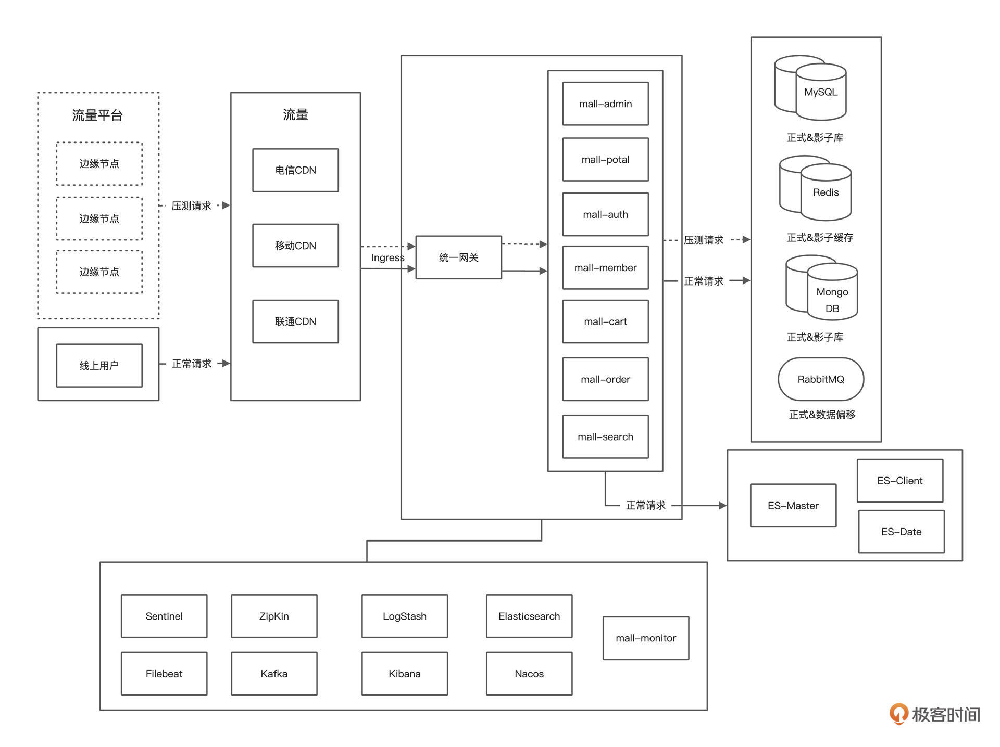

### 系统部署架构图

这些显然就是我们测试的基础信息了，这一点不会有偏差，因为我们的压测就是在这样的架构中做的。

## 硬件环境

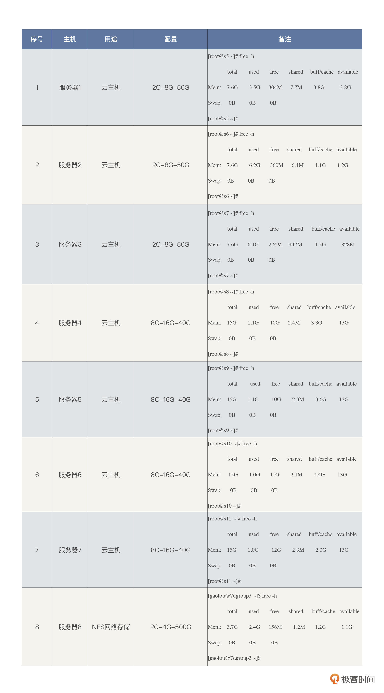

在压测方案中，我们规划的硬件资源是8台服务器，但我们最后用到的硬件不止8台，中间我们又多加了四台8C16G的机器，所以总共是12台。

## 基础数据

### 铺底数据

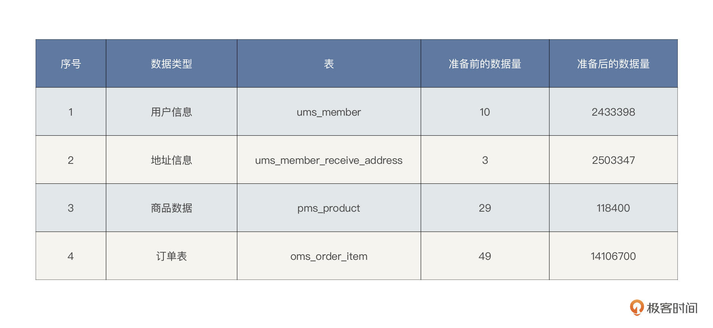

这是原始的铺底数据，在场景执行的过程中，产生的数据还有很多，在容量评估那一讲，我们也有截图表示。

## 系统改造

这里我们要重点说一下了。

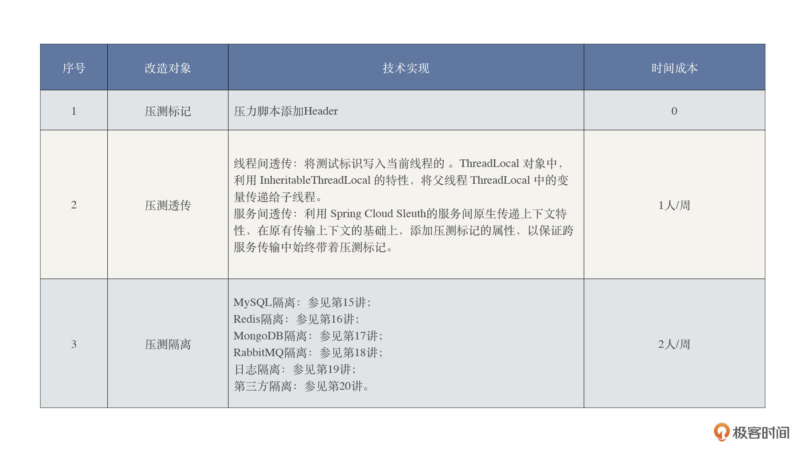

但是要说明一点，这里提到的时间成本是在你比较熟练的情况下需要的时间。如果需要重新学习这些技术，那估计就不是两三个月的事情了。但是不管怎么说，我觉得全链路的改造成本真的不算高，而且也并不高深。

## 压测设计

这里我只摘了压测方案中的关键内容过来。

> 对于性能场景，我们认为它必须满足两个条件：连续和递增，所以在这次的全链路压测执行过程中，我们会把这两点应用到下面的业务场景中。

> 在 RESAR 全链路压测中，性能场景只需要四类，执行顺序依次为：基准场景、容量场景、稳定性场景和异常场景。  
> 除了这四类性能场景外，再没有其他类型的场景了。在每一个场景分类中，我们都可以设计多个具体的场景来覆盖完整的业务。

在执行过程中，我是完全按照这个思路来做的，这也是很多性能测试人员纠结的点，他们不知道这四类场景是否可以覆盖住所有的性能需求。但是请不要再纠结啦，在我的职业生涯中，还没有什么需求是可以逃到这四类场景之外的。 反而是那些拿“压力测试”“负载测试”“极限测试”等之类的幌子设置的场景最终无法给出明确的结论。

## 监控设计

下面两个图就足够说明我们在这个项目中的监控设计了，并且从文章中给出的各类的监控截图也可以看得出来，图里面的东西几乎都用到了，我们也没有偷工减料。

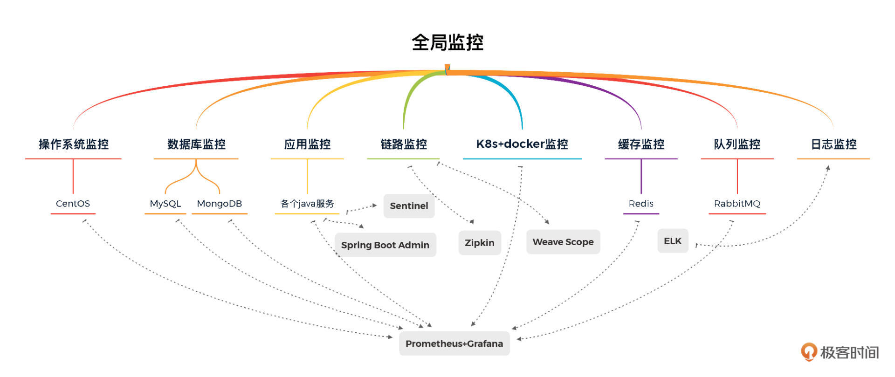

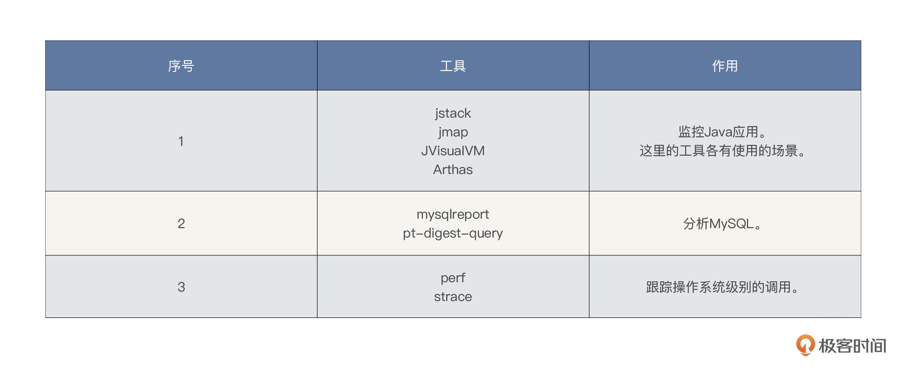

现在就要来说说输出的内容了。

## 结果整理

在结果整理这一步，我是坚决反对用表格的。我认为直接帖压力工具或监控工具的截图即可，因为表格表达不出趋势。这里你可以直接看第29-33讲，把截图帖出来就行。比如：

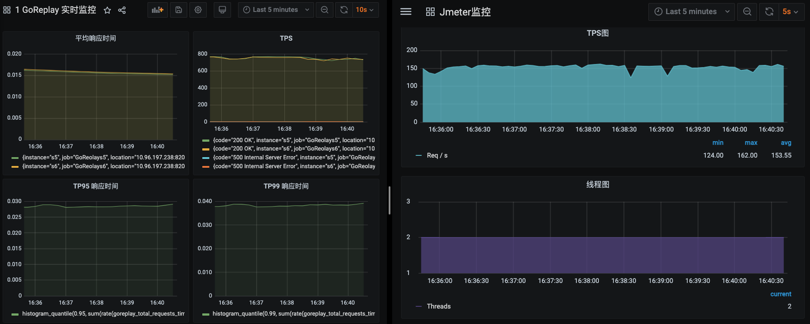

这一张压力工具的趋势图就可以准确说明容量场景能跑到多大。

关于资源的截图，因为它太多了，所以我建议你帖几个全局监控的图即可。毕竟这里只是要说明一下，不是在分析过程，不用太详细。

## 结论

好，现在重点的来了。针对每个和生产有关的场景，我们要给出最终的结论。

### 容量场景

在容量场景中我们知道，系统达到了1650的最大稳定的TPS。而我们一开始的目标是1350。目标显然是达到了，可以**通过**。

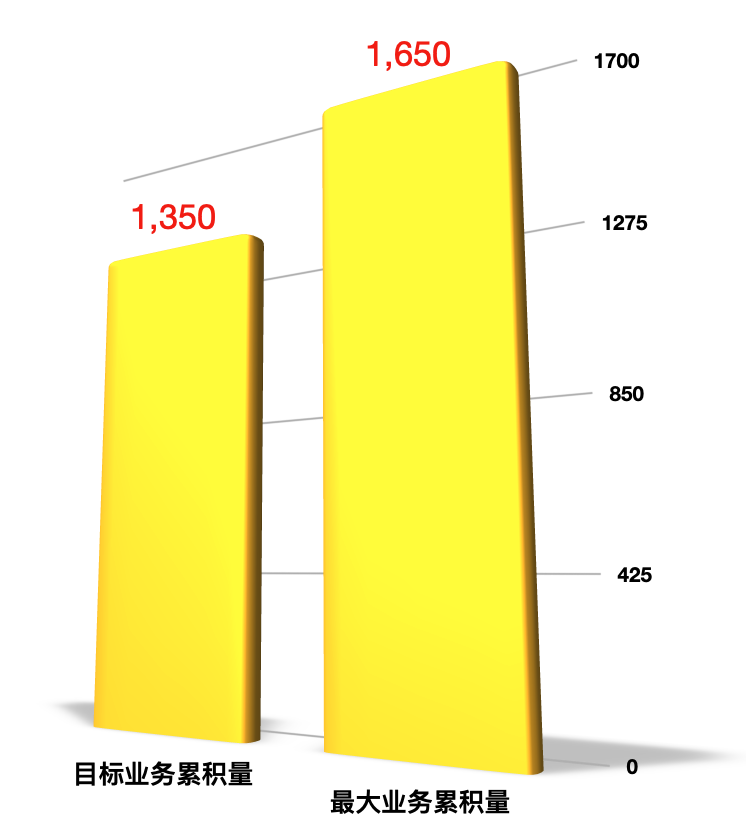

### 稳定性场景

业务累计量我们定了一个500万的小目标，最后跑到了680万。结论显然也是**通过**。

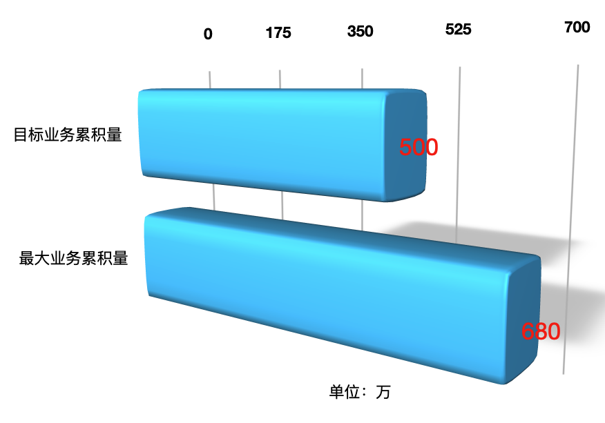

### 异常场景

我们只模拟了两个异常的场景，应该说做得非常不全面。对一个专栏来说，为了说明逻辑倒也足够了。但对一个项目来说，那显然是远远不够的。所以在这个专栏的报告中，我认为异常场景的结论是**不通过**。

在真实的项目中，你可以把我们在异常场景那一节中所提到的各个层级的异常场景都覆盖一遍，只有这样做才算是真正的通过。

## 总结

对于性能项目来说，性能测试人员需要给出明确的通过或者不通过的结论，另外还要给出清晰的生产配置建议，关于如何确定配置值，前面我们也给出了相应的链接。

在这节课所讲的性能报告中呢，我们必须明确说明项目所使用的硬件、软件、数据、压力策略、监控策略等等内容，因为看报告的人没必要再把压测方案找过来跟报告一起对着看，那太麻烦了。

同时，给出结果整理也是必须的，这是所有执行过程中最精华的部分。虽然你只有一两张好看的截图放在那里，但那背后是一个个辛酸的调优故事。

最后呢，我们还要给出一个结论，这是我一直强调的。这个结论首先要有数据的直接对比，其次要有能不能上线的直接说明。在报告中，模棱两可的话绝不许出现，没有结论的数据也绝不能出现。

## 课后题

​学完这节课，请你思考两个问题：

1.  你觉得性能报告的重点是什么呢？
2.  你觉得你写过的性能报告有没有问题呢？如果有，是什么？

这是我们这一次、也是最后一次思考题，欢迎你在留言区与我交流讨论。