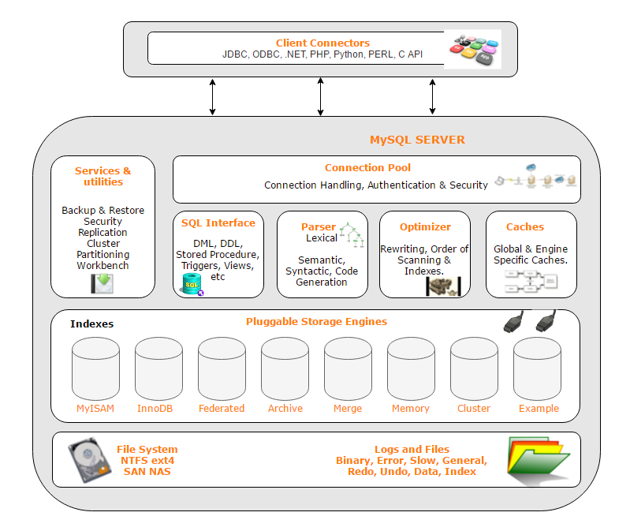
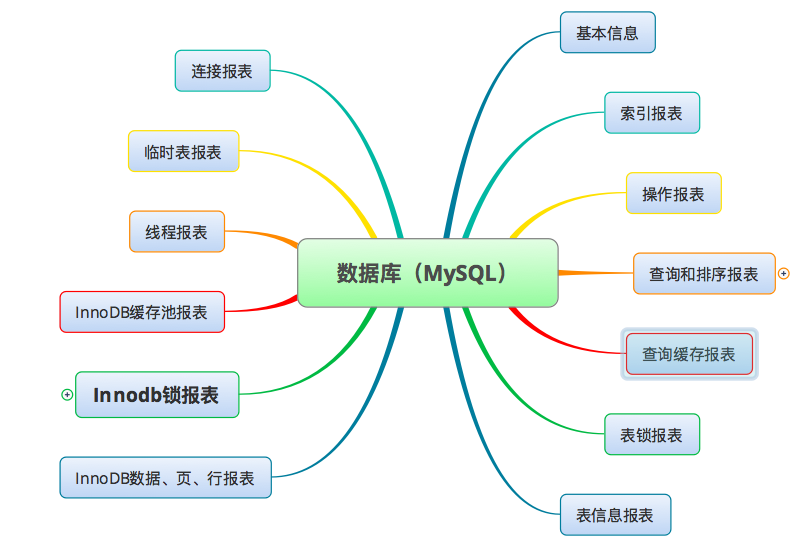

---
date: "2019-06-23"
---  
      
# 22丨MySQL：数据库级监控及常用计数器解析（上）
数据库是一个非常大的话题，我们在很多地方，都会看到对数据库的性能分析会包括以下部分。


但其实呢，以上这些内容都是我们应该具备的基础知识，所以我今天要讲的就是，具备了这些基础知识之后我们应该干什么事情。

也就是说，从性能瓶颈判断分析的角度入手，才是性能从业人员该有的逻辑。每次我分析一个性能问题时，逻辑总是这样的：


1.  先画出整个系统的架构图。
2.  列出整个系统中用到了哪些组件。这一步要确定用哪些监控工具来收集数据，具体的内容你可以看下之前讲到的监控设计相关的内容。
3.  掌握每个组件的架构图。在这一步中需要列出它们的关键性能配置参数。
4.  在压力场景执行的过程中收集状态计数器。
5.  通过分析思路画出性能瓶颈的分析决策树。
6.  找到问题的根本原因。
7.  提出解决方案并评估每个方案的优缺点和成本。

这是我一直强调的分析决策树的创建逻辑。有了这些步骤之后，即使不熟悉一个系统，你也可以进行性能分析。

对于MySQL数据库来说，我们想对它进行分析，同样也需要看它的架构图。如下图所示（这是MySQL5版本的架构示意图）：



这里就有一个问题了：看架构图是看什么？这个图够细吗？

首先，看架构图，一开始肯定是看大而全的架构。比如说上图，我们知道了，MySQL中有Connection Pool、SQL Interface、Parser等这些大的模块。

<!-- [[[read_end]]] -->

其次，我们得知道这些模块的功能及运行逻辑。比如说，我们看到了这些模块之后，需要知道，当一个SQL通过Connection Pool进到系统之后，需要先进入SQL Interface模块判断这个语句，知道它是一个什么样的SQL，涉及到了什么内容；然后通过Parser模块进行语法语义检查，并生成相应的执行计划；接着到Optimizer模块进行优化，判断走什么索引，执行顺序之类的；然后就到Caches中找数据，如果在Caches中找不到数据的话，就得通过文件系统到磁盘中找。

这就是一个大体的逻辑。但是知道了这个逻辑还不够。还记得前面我们说的对一个组件进行“全局—定向”的监控思路吧。

这里我们也得找工具实现对MySQL的监控，还好MySQL的监控工具非常多。

在讲MySQL的监控工具之前，我们先来了解下MySQL中的两个Schema，分别是`information_schema`和`performance_schema` 。

为什么呢？

`information_schema`保存了数据库中的所有表、列、索引、权限、配置参数、状态参数等信息。像我们常执行的`show processlist;`就来自于这个schema中的processlist表。

`performance_schema`提供了数据库运行时的资源消耗情况，它以较低的代价收集信息，可以提供不少性能数据。

所以这两个Schema对我们来说就非常重要了。

你没事的时候，也可以查一下它们相关的各个表，一个个看着玩。监控工具中的很多数据来自于它们。

还有两个命令是你在分析MySQL时一定要学会的：`SHOW GLOBAL VARIABLES;`和`SHOW GLOBAL status;`。前一个用来查看配置的参数值，后一个用来查询状态值。当你没有其他工具可用的时候，就可以用这两个命令的输出结果来分析。对于全局监控来说，这两个命令绝对够用。

对于MySQL的监控工具有很多，但我主要讲的是以下几个工具：  
mysqlreport、pt-query-digest、mysql\_exportor+Prometheus+Grafana。

今天我们先来说一下mysqlreport。

## 全局分析：mysqlreport

这个工具执行之后会生成一个文本文件，在这个文本文件中包括了如下这些内容。



我觉得这个工具是属于既不浪费资源，又能全局监控MySQL的很好的工具。

在我们执行性能场景时，如果想让mysqlreport抓取到的数据更为准确，可以先重启一下数据库。如果你觉得重启数据库这个动作实在是有点大，可以先把状态计数器、打开表、查询缓存等数据给刷新一下。

我认为mysqlreport有一些重要的知识点需要你知道，在这里我找一个例子给你解释一下。

### 索引报表

```
    _ Key _________________________________________________________________
    Buffer used     5.00k of   8.00M  %Used:   0.06
      Current       1.46M            %Usage:  18.24
    

```

请注意，这里所指的Key Buffer是指MyISAM引擎使用的`Shared Key Buffer`，InnoDB所使用的`Key Buffer`不在这里统计。

从上面的数据来看，MySQL每次分配的`Key Buffer`最大是5K，占8M的0.06\%，还是很小的。下一行中的数据可以看到的是当前只用了1.46M，占8M的18.24\%。

显然这个Key Buffer是够用的，如果这个使用率高，你就得增加`key_buffer_size`的值了。

### 操作报表

```
    __ Questions ___________________________________________________________
    Total         126.82M    32.5/s
      +Unknown     72.29M    18.5/s  %Total:  57.00
      Com_         27.63M     7.1/s           21.79
      DMS          26.81M     6.9/s           21.14
      COM_QUIT     45.30k     0.0/s            0.04
      QC Hits      38.18k     0.0/s            0.03
    Slow 2 s        6.21M     1.6/s            4.90  %DMS:  23.17  Log:
    DMS            26.81M     6.9/s           21.14
      SELECT       20.73M     5.3/s           16.34         77.30
      INSERT        3.68M     0.9/s            2.90         13.71
      UPDATE        1.43M     0.4/s            1.13          5.33
      DELETE      983.11k     0.3/s            0.78          3.67
      REPLACE           0       0/s            0.00          0.00
    Com_           27.63M     7.1/s           21.79
      admin_comma  11.86M     3.0/s            9.35
      set_option   10.40M     2.7/s            8.20
      commit        5.15M     1.3/s            4.06
    

```

从这个数据可以看到的信息量就有点大了，它可以反应出来这个数据库现在忙不忙。

从32.5每秒的操作量上来说，还是有点忙的。你还可以看到下面有操作数的细分，其实我不太愿意看下面的这些细分，描述上除了`QC Hits`和`DMS`的意思比较清晰之外，其他的几个值理解起来比较费劲。我也不建议你看下面那几个，因为它们对性能分析来说没起到什么正向的作用。

而Slow 那这一行就很重要了，从这行可以看出`slow log`的时间是设置为2秒的，并且每秒还出现1.6个的慢日志，可见这个系统的SQL的慢日志实在是有点多。

`DMS`部分可以告诉我们这个数据库中各种SQL所占的比例。其实它是具有指向性的，像我们的这个例子中，显然是`SELECT`多，那如果要做SQL优化的话，肯定优先考虑`SELECT`的语句，才会起到立竿见影的效果。

### 查询和排序报表

```
    __ SELECT and Sort _____________________________________________________
    Scan            7.88M     2.0/s %SELECT:  38.04
    Range         237.84k     0.1/s            1.15
    Full join       5.97M     1.5/s           28.81
    Range check   913.25k     0.2/s            4.41
    Full rng join  18.47k     0.0/s            0.09
    Sort scan     737.86k     0.2/s
    Sort range     56.13k     0.0/s
    Sort mrg pass 282.65k     0.1/s
    

```

这个报表具有着绝对的问题指向性。这里的`Scan`（全表扫描）和`Full join`（联合全表扫描）在场景执行过程中实在是太多了，这显然是SQL写得有问题。

Range范围查询很正常，本来就应该多。

### 查询缓存报表

```
    __ Query Cache _________________________________________________________
    Memory usage  646.11k of   1.00M  %Used:  63.10
    Block Fragmnt  14.95%
    Hits           38.18k     0.0/s
    Inserts         1.53k     0.0/s
    Insrt:Prune    2.25:1     0.0/s
    Hit:Insert    24.94:1
    

```

在这部分中，我们看的关键点是，`Query Cache`没用！因为各种`query`都没有缓存下来。同时这里我们还要看一个关键值，那就是`Block Fragment`，它是表明`Query Cache`碎片的，值越高，则说明问题越大。

如果你看到下面这样的数据，就明显没有任何问题。

```
    __ Query Cache ______________________________________________________
    Memory usage   38.05M of 256.00M  %Used:  14.86
    Block Fragmnt   4.29%
    Hits           12.74k    33.3/s
    Inserts        58.21k   152.4/s
    Insrt:Prune  58.21k:1   152.4/s
    Hit:Insert     0.22:1
    

```

这个数据明显看到缓存了挺多的数据。Hits这一行指的是每秒有多少个SELECT语句从`Query Cache`中取到了数据，这个值是越大越好。

而通过`Insrt:Prune`的比值数据，我们可以看到Insert远远大于Prune（每秒删除的`Query Cache`碎片\)，这个比值越大就说明`Query Cache`越稳定。如果这个值接近1：1那才有问题，这个时候就要加大`Query Cache`或修改你的SQL了。

而通过下面的`Hit:Insert`的值，我们可以看出命中要少于插入数，说明插入的比查询的还要多，这时就要去看这个性能场景中是不是全是插入了。如果我们查看了，发现SELECT语句还是很多的，而这个比值又是Hit少，那么我们的场景中使用的数据应该并不是插入的数据。其实在性能场景的执行过程中经常这样。所以在性能分析的过程中，我们只要知道这个值就可以了，并不能说明`Query Cache`就是无效的了。

### 表信息报表

```
    __ Table Locks _________________________________________________________
    Waited              0       0/s  %Total:   0.00
    Immediate         996     0.0/s
    
    
    __ Tables ______________________________________________________________
    Open             2000 of 2000    %Cache: 100.00
    Opened         15.99M     4.1/s
    
    

```

这个很明显了，表锁倒是不存在。但是你看现在`table_open_cache`已经达到上限了，设置为2000，而现在已经达到了2000，同时每秒打开表4.1个。

这些数据说明了什么呢？首先打开的表肯定是挺多的了，因为达到上限了嘛。这时候你会自然而然地想到去调`table_open_cache`参数。但是我建议你调之前先分析下其他的部分，如果在这个性能场景中，MySQL的整体负载就会比较高，同时也并没有报错，那么我不建议你调这个值。如果负载不高，那再去调它。

### 连接报表和临时表

```
    __ Connections _________________________________________________________
    Max used          521 of 2000      %Max:  26.05
    Total          45.30k     0.0/s
    
    
    __ Created Temp ________________________________________________________
    Disk table    399.77k     0.1/s
    Table           5.81M     1.5/s    Size:  16.0M
    File            2.13k     0.0/s
    

```

这个数据连接还完全够用，但是从临时表创建在磁盘（Disk table）和临时文件（File\)上的量级来说，还是有点偏大了，所以，可以增大`tmp_table_size`。

### 线程报表

```
    __ Threads _____________________________________________________________
    Running            45 of   79
    Cached              9 of   28      %Hit:  72.35
    Created        12.53k     0.0/s
    Slow                0       0/s
    
    
    __ Aborted _____________________________________________________________
    Clients             0       0/s
    Connects            7     0.0/s
    
    
    __ Bytes _______________________________________________________________
    Sent          143.98G   36.9k/s
    Received       21.03G    5.4k/
    

```

当Running的线程数超过配置值时，就需要增加`thread_cache_size`。但是从这里来看，并没有超过，当前配置了79，只用到了45。而这里Cached的命中`%Hit`是越大越好，我们通常都希望在99\%以上。

### InnoDB缓存池报表

```
    __ InnoDB Buffer Pool __________________________________________________
    Usage           1.87G of   4.00G  %Used:  46.76
    Read hit      100.00%
    Pages
      Free        139.55k            %Total:  53.24
      Data        122.16k                     46.60 %Drty:   0.00
      Misc            403                      0.15
      Latched                                  0.00
    Reads         179.59G   46.0k/s
      From file    21.11k     0.0/s            0.00
      Ahead Rnd         0       0/s
      Ahead Sql                 0/s
    Writes         54.00M    13.8/s
    Flushes         3.16M     0.8/s
    Wait Free           0       0/s
    

```

这个部分对MySQL来说是很重要的，`innodb_buffer_pool_size`为4G，它会存储表数据、索引数据等。通常在网上或书籍里，你能看到有人建议将这个值设置为物理内存的50\%，当然这个值没有绝对的，还要在具体的应用场景中测试才能知道。

这里的`Read hit`达到100\%，这很好。

下面还有些其他的读写数据，这部分的数据将和我们在操作系统上看到的I/O有很大关系。有些时候，由于写入的过多，导致操作系统的`I/O wait`很高的时候，我们不得不设置`innodb_flush_log_at_trx_commit`参数（0：延迟写，实时刷；1：实时写，实时刷；2：实时写，延迟刷）和`sync_binlog` 参数（0：写入系统缓存，而不刷到磁盘；1：同步写入磁盘；N：写N次系统缓存后执行一次刷新操作）来降低写入磁盘的频率，但是这样做的风险就是当系统崩溃时会有数据的丢失。

这其实是我们做测试时，存储性能不高的时候常用的一种手段，为了让TPS更高一些。但是，你一定要知道生产环境中的存储是什么样的能力，以确定在生产环境中应该如何配置这个参数。

### InnoDB锁报表

```
    __ InnoDB Lock _________________________________________________________
    Waits          227829     0.1/s
    Current             1
    Time acquiring
      Total     171855224 ms
      Average         754 ms
      Max            6143 ms
    

```

这个信息就有意思了。显然在这个例子中，锁的次数太多了，并且锁的时间都还不短，平均时间都能达到754ms，这显然是不能接受的。

那就会有人问了，锁次数和锁的平均时间多少才是正常呢？在我的经验中，锁平均时间最好接近零。锁次数可以有，这个值是累加的，所以数据库启动时间长，用得多，锁次数就会增加。

### InnoDB其他信息

```
    __ InnoDB Data, Pages, Rows ____________________________________________
    Data
      Reads        35.74k     0.0/s
      Writes        6.35M     1.6/s
      fsync         4.05M     1.0/s
      Pending
        Reads           0
        Writes          0
        fsync           0
    
    
    Pages
      Created      87.55k     0.0/s
      Read         34.61k     0.0/s
      Written       3.19M     0.8/s
    
    
    Rows
      Deleted     707.46k     0.2/s
      Inserted    257.12M    65.9/s
      Read        137.86G   35.3k/s
      Updated       1.13M     0.3/
    

```

这里的数据可以明确告诉你的一点是，在这个性能场景中，插入占有着绝对的量级。

## 总结

好了，我们拿一个mysqlreport报表从上到下看了一遍之后，你是不是觉得对MySQL有点感觉了？这里我给一个结论性的描述吧：

1.  在这个性能场景中，慢日志太多了，需要定向监控看慢SQL，找到慢SQL的执行计划。
2.  在这个插入多的场景中，锁等待太多，并且等待的时候又太长，解决慢SQL之后，这里可能会解决，但还是要分析具体的原因的，所以这里也是指向了SQL。

这里为什么要描述得这么细致呢？主要是因为当你看其他一些工具的监控数据时，分析思路是可以共用的。

但是有人说这里还有一个问题：SQL怎么看？

其实对于我们分析的逻辑来说，在数据库中看SQL就是在做定向的分析了。请你不要相信一些人所吹嘘的那样，一开始就把所有的SQL执行时间统计出来，这真的是完全没有必要的做法。因为成本太高了。

在下一篇文章里，我们换个工具来看看SQL的执行时间到底应该怎么分析。

## 思考题

最后给你留两道思考题吧，MySQL中全局监控工具可以给我们提供哪些信息？以及，如何判断MySQL状态值和配置值之间的关系呢？

欢迎你在评论区写下你的思考，也欢迎把这篇文章分享给你的朋友或者同事。