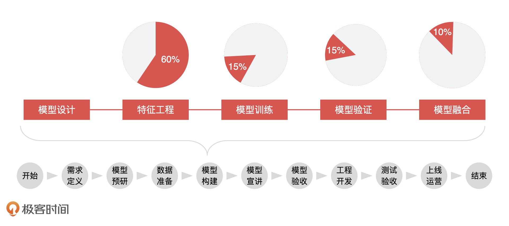
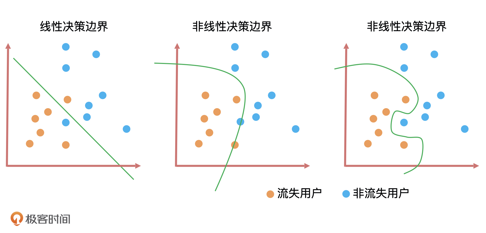
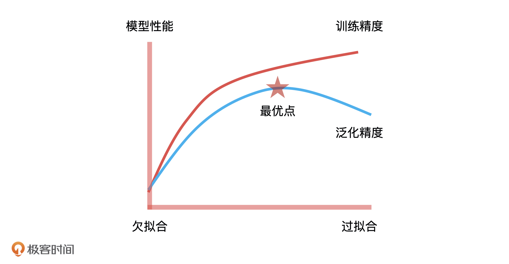
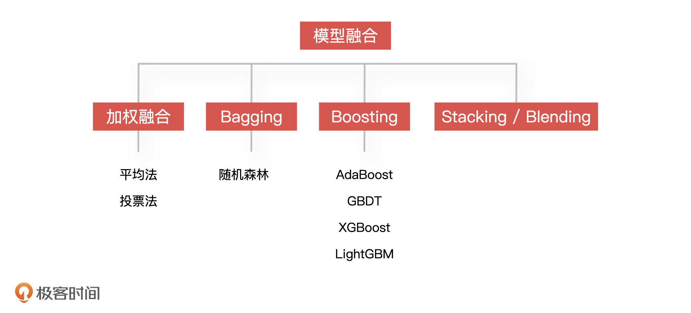

---
date: "2019-06-23"
---  
      
# 07 | AI模型的构建过程是怎样的（下）
你好，我是海丰。

上节课，我们讲了一个模型构建的前 2 个环节，模型设计和特征工程。今天，我们继续来讲模型构建的其他 3 个环节，说说模型训练、模型验证和模型融合中，算法工程师的具体工作内容，以及AI 产品经理需要掌握的重点。

## 模型训练

模型训练是通过不断训练、验证和调优，让模型达到最优的一个过程。**那怎么理解这个模型最优呢？**下面，我拿用户流失预测模型这个例子来给你讲讲。

这里，我想先给你讲一个概念，它叫做**决策边界**，你可以把它简单理解为我们每天生活当中的各种决策。比如，当华为 Mate 降价到 5000 元的时候我就打算购买，那这种情况下我的决策边界就是 5000 元，因为大于 5000 元的时候我不会购买，只有小于 5000 元时我会选择购买。

那放到预测用户流失这个案例中，我们模型训练的目标就是，在已知的用户中用分类算法找到一个决策边界，然后再用决策边界把未知新用户快速划分成流失用户或者是非流失用户。

不同算法的决策边界也不一样，比如线性回归和逻辑回归这样的线性算法，它们的决策边界也是线性的，长得像线条或者平面，而对于决策树和随机森林这样的非线性算法，它们的决策边界也是非线性是一条曲线。因此，**决策边界是判断一个算法是线性还是非线性最重要的标准**。

<!-- [[[read_end]]] -->

上图就是三种算法的决策边界。决策边界的形式无非就是直线和曲线两种，并且这些曲线的复杂度（曲线的平滑程度）和算法训练出来的模型能力息息相关。**一般来说决策边界曲线越陡峭，模型在训练集上的准确率越高，但陡峭的决策边界可能会让模型对未知数据的预测结果不稳定。**

这就类似于我们投资股票，低收益低风险，高收益高风险，所以我们一般都会平衡风险和收益，选择出最合适的平衡点。

对于模型训练来说，这个风险和收益的平衡点，就是拟合能力与泛化能力的平衡点。拟合能力代表模型在已知数据上表现得好坏，泛化能力代表模型在未知数据上表现得好坏。它们之间的平衡点，就是我们通过**不断地训练和验证找到的模型参数的最优解，因此，这个最优解绘制出来的决策边界就具有最好的拟合和泛化能力**。这是模型训练中“最优”的意思，也是模型训练的核心目标，我们一定要记住。

具体到我们这个流失用户预测的例子上，模型训练的目的就是找到一个平衡点，让模型绘制出的决策边界，能够最大地区分流失用户和非流失用户，也就是预测流失用户的准确率最高，并且还兼顾了模型的稳定性。

一般情况下，算法工程师会通过**交叉验证**（Cross Validation）的方式，找到模型参数的最优解。

## 模型验证

刚才我们说了，模型训练的目标是找到拟合能力和泛化能力的平衡点，让拟合和泛化能力同时达到最优。那这该怎么做呢？

如果算法工程师想让拟合能力足够好，就需要构建一个复杂的模型对训练集进行训练，可越复杂的模型就会越依赖训练集的信息，就很可能让模型在训练集上的效果足够好，在测试集上表现比较差，产生**过拟合**的情况，最终导致模型泛化能力差。

这个时候，如果算法工程师想要提高模型的泛化能力，就要降低模型复杂度，减少对现有样本的依赖，但如果过分地减少对训练样本的依赖，最终也可能导致模型出现**欠拟合**的情况。

因此，算法工程师需要花费大量的时间去寻找这个平衡点，而且很多时候我们认为的最优，未必是真正的最优。**这个时候，模型验证就起到了关键性的作用。**

模型验证主要是对待验证数据上的表现效果进行验证，一般是通过模型的性能指标和稳定性指标来评估。下面，我一一来解释一下。

**首先是模型性能。模型性能可以理解为模型预测的效果，你可以简单理解为“预测结果准不准”**，它的评估方式可以分为两大类：分类模型评估和回归模型评估 。

分类模型解决的是将一个人或者物体进行分类，例如在风控场景下，区分用户是不是“好人”，或者在图像识别场景下，识别某张图片是不是包含人脸。对于分类模型的性能评估，我们会用到包括召回率、F1、KS、AUC 这些评估指标。而回归模型解决的是预测连续值的问题，如预测房产或者股票的价格，所以我们会用到方差和 MSE 这些指标对回归模型评估。

对于产品经理来说，我们除了要知道可以对模型性能进行评估的指标都有什么，还要知道这些指标值到底在什么范围是合理的。虽然，不同业务的合理值范围不一样，我们要根据自己的业务场景来确定指标预期，但我们至少要知道什么情况是不合理的。

比如说，如果算法同学跟我说，AUC 是 0.5，我想都不想就知道，这个模型可能上不了线了，因为 AUC = 0.5 说明这个模型预测的结果没有分辨能力，准确率太差，这和瞎猜得到的结果几乎没啥区别，那这样的指标值就是不合理的。

**其次是模型的稳定性，你可以简单理解为模型性能（也就是模型的效果）可以持续多久。**我们可以使用 PSI 指标来判断模型的稳定性，如果一个模型的 PSI > 0.2，那它的稳定性就太差了，这就说明算法同学的工作交付不达标。

总的来说，模型的验证除了是算法工程师必须要做的事情之外，也是产品经理要重点关注的。就好像研发同学需要单元测试，测试同学需要冒烟测试，产品经理需要产品验收一样。这节课，我们先熟悉它在整个模型构建中所扮演的角色，之后，我也会单独拿出一模块的时间来和你详细讲一讲，模型评估的核心指标都有什么，以及它们的计算逻辑、合理的值都是什么。掌握了这些，你就可以清楚知道算法同学交付的模型到底是好是坏，模型到底能不能上线，上线后算法同学是不是该对模型进行迭代了。

## 模型融合

前面我们讲的 4 个环节都是针对一个模型来说的，但在实际工作中，为了解决很多具体的细节问题，算法工程师经常需要构建多个模型才获得最佳效果。这个时候，就要涉及多个模型集成的问题了。那模型集成或者说集成学习究竟是怎么一回事儿呢？听我慢慢给你讲。

我们先来看一个生活中的例子，如果你打算买一辆车，你会直接找一家 4S 店，然后让汽车销售员推销一下，就直接决定购买了吗？大概率不会，你会先去各头部汽车咨询网站看看其他车主的评价，或者咨询一下同事或朋友的意见，甚至会自己整理一堆汽车各维度的专业对比资料，再经过几次讨价还价，才会最终做出购买的决定。

模型融合就是采用的这个思路，同时训练多个模型，再通过模型集成的方式把这些模型合并在一起，从而提升模型的准确率。简单来说，就是用多个模型的组合来改善整体的表现。

模型融合有许多方法，我们知道一些常用的就可以了，比如对于回归模型的融合，最简单的方式是采用算数平均或加权平均的方法来融合；对于分类模型来说，利用投票的方法来融合最简单，就是把票数最多的模型预测的类别作为结果。另外，还有 Blending 和 Stacking，以及 Bagging 和 Boosting这些比较复杂的模型融合方法。

除了要注意模型融合的方法，我们还要注意算法模型的选择，不同行业选择的算法模型一定不一样。比如，互联网数据和银行金融机构数据就不一样，因为银行数据大部分都是强相关性的金融性数据，所以它可能会更多考虑机器学习算法，而互联网的数据特征基本都是高维稀疏，会较多考虑深度学习算法。

并且，由于不同行业对于算法模型的风险状况也有不同的考虑，所以对模型的选择也会有不同的限制标准，比如银行、金融行业会监管模型的特征和解释性，因此，会选择可解释性很强的算法模型，如逻辑回归。

除此之外，我们还要考虑算法模型选择的成本。比如说，产品经理可能认为通过 Boosting 或 Bagging 的方式集成模型的效果，一定比单一的算法模型效果要好。

但是在实际中，算法工程师常常会为了提成模型 AUC 的一个点，让特征的规模增大很多，导致模型部署上线的成本翻倍，这就非常不划算了。因此，成本是算法工程师在选择算法模型时会去考虑的事情，也是需要产品经理去理解算法同学工作的地方。

## 模型部署

一个模型训练完成并通过评估后，算法工程师就要考虑怎么把它部署到线上，并应用到业务场景中。虽然模型部署不属于模型构建中的环节，但它却是 AI 产品上线中必不可少的一环，所以我也要在这里和你讲一下。

一般情况下，因为算法团队和工程团队是分开的两个组织架构，所以算法模型基本也是部署成独立的服务，然后暴露一个 HTTP API 给工程团队进行调用，这样可以解耦相互之间的工作依赖，简单的机器学习模型一般通过 Flask 来实现模型的部署，深度学习模型一般会选 TensorFlow Serving 来实现模型部署。

但是，具体的交互方式也还要看模型应用的业务场景，比如业务需求就是要对 UGC 内容进行分类，如果业务场景是要实时预测用户 UGC 的类别，那我们的分类模型就需要部署成在线的 Web 服务并提供实时响应的 API 接口；如果我们只是需要对一批已有的 UGC 数据进行分类，然后使用分类后的结果，那我们的模型通过离线任务的方式运行，每日定时处理增量的 UGC 数据就可以了 。

## 小结

通过第 6 和第 7 课的学习，我们一起梳理了整个模型构建的流程。

**模型设计**是模型构建的第一个环节，这个环节需要做模型样本的选取和模型目标变量的设置，模型样本和目标变量的选择决定了模型应用的场景。

**特征工程**是所有环节中最乏味和耗时的。因为，实际生产中的数据会存在各种各样的问题，如数据缺失、异常、分布不均、量纲不统一等等，这些问题都需要在特征工程中解决的。 但是这种耗时绝对值得，一个好的特征工程直接影响算法模型最终的效果。

**模型训练**就是一个通过不断训练数据，验证效果和调优参数的一个过程，而**模型验证**和它是一个不断循环迭代的过程，目标都是寻找模型泛化能力和模型效果的平衡点。所以模型训练我们要和模型验证一块来看。

更具体点，在我们的例子中，模型训练的目标就是为了预测用户是否为流失用户，模型训练就是在已知用户数据中通过算法找到一个决策边界，然后在这条决策边界上，模型的拟合和泛化能力都能达到最好，也就是说，在训练集和测试集上对流失用户预测准确率都很高。

而**模型验证**主要是对待测数据上的表现效果进行验证，一般是通过模型的性能指标和稳定性指标来进行评估。

**模型融合**环节主要是通过多个模型的组合来改善整体的表现。模型融合有许多方法，简单的有加权平均和投票法，复杂的有 Bagging 和 Bosting。作为产品经理，我们要知道，模型融合虽然可以提升模型的准确率，但也需要均衡开发成本来综合考虑。

**模型部署**关注的是模型的部署上线和提供服务的方式，这里一般只需要事先约定好算法与工程的交互方式即可。

最后，我还想给你一个小建议，如果你是**偏基础层或者技术层的产品经理**，需要对模型构建的过程了解得更加清楚，你可以在一些开放的机器学习平台（比如阿里的机器学习平台 PAI）上，尝试自己搭建一个简单的模型。**对于应用层的产品经理**，你只需要了解大概流程就可以了，把学习的重点放到如何去评估模型效果上。

## 课后讨论

在整个模型构建的过程中，你认为最重要的阶段是哪个？为什么？

欢迎在留言区写下你的思考和疑惑，我们下节课见！