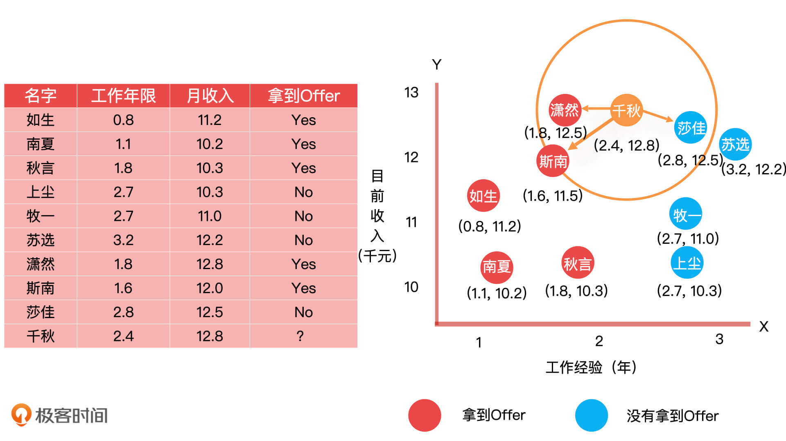

---
date: "2019-06-23"
---  
      
# 09 | K近邻算法：机器学习入门必学算法
你好，我是海丰。

今天，我们正式进入算法的学习，来学习K 近邻算法（K-Nearest Neighbor），简称 KNN 算法。它是一种用来解决分类问题的算法，简单来说，就是用来预测用户是男是女，或者是否喜欢某件商品。**分类算法有很多，只不过，不同算法的实现机制不同，我们今天要讲的 KNN 算法是基于距离计算的方式来解决分类问题的。**

下面，我就借助生活中常见的例子，给你讲清楚 KNN 算法的原理、优缺点，以及应用场景。

## 如何理解 KNN 算法

我们的生活中总是充斥着各种各样的小抉择，这些抉择虽然对我们的影响不大，但总会让我们有些苦恼。比如，手机买什么牌子、买什么型号？午饭吃什么？周末陪女朋友去哪儿玩？你每次遇到这类问题的时候，都会怎么解决呢？

先别着急回答，我们先来做一个小测试题。如果现在就让你给女朋友选礼物，你会怎么做？我希望你能在 5 秒内，从下面 3 个选项中选一个：

1.  随便选一个就行了
2.  问问周围兄弟们都送了什么礼物
3.  做一份详细的报告，根据女朋友的情况量身定制礼物挑选方案

好了，我想你有很大可能会选择第2个选项。因为选1，就意味着你会承担更高的风险，选到一个非常不靠谱的礼物，还很有可能踩雷，而选3意味着你会花费大量的时间和成本去做准备，一般人估计也没有这么大的耐心。

<!-- [[[read_end]]] -->

事实上也是这样，如果你周围最好的几个朋友都送了女朋友口红，只有少数几个送了香水，那你选择送口红给女友更不容易踩雷，因此，你做出相似决定的概率也会更大。简而言之就是，你周围的环境将影响你的决定。

你选购礼物的逻辑其实就是 KNN 算法的实现思路了。通俗一点来说，**KNN 的原理就是，对于一个犹豫不决的选择，我们先参考周围最近的一些已经做出的选择，然后再做出相似的决定**，你也可以记成：“近朱者赤，近墨者黑”。

如果用数学去描述 KNN的原理，**就是对于一个待测的样本点，我们去参考周围最近的已知样本点的分类，如果周围最近的 K 个样本点属于第一类，我们就可以把这个待测样本点归于第一类**。

这个概念中提到了一个词“最近”，那我们该如何定义样本间距离的远近呢？通常来讲，我们会通过数学公式计算两个样本点之间的距离，最常见的一个计算方法就是欧式距离（Euclidean Space）。最后再做一个简单的统计，找到距离待测样本点最近的 K 个样本点中，哪些类别最多。当然除了欧式距离，还有很多距离计算的方式，如曼哈顿距离、余弦距离等等。

以上就是运用 KNN 进行分类决策的基本逻辑了。

## 应用场景：预测候选人能不能拿到Offer

知道了 KNN 算法的基本原理，接下来，我再通过一个预测候选者是否符合公司标准的例子，来说一说 KNN 算法的应用场景。

我之前参加过一个算法马拉松竞赛，这个竞赛的题目就是为公司的人事部门开发一套减少招聘成本的 AI 产品。它要求参赛者在已知公司历史**候选者姓名、工作年限、每月收，以及最终是否拿到公司 Offer** 的情况下，通过一个算法模型来预测一个新的候选者是否能通过公司的招聘考核，最终拿到 Offer。

上面左侧的图表图就是公司历史候选者的数据采样，我们将数据可视化制作出了二维平面图（如上图右）。其中，X 轴代表候选者的工作年限，Y 轴代表候选者目前的月收入，我们对拿到Offer的人用红色进行了标记，对没拿到的用蓝色进行了标记。

有了这些基础信息之后，我们接下来要解决的问题就是，怎么评估一个新候选者成功拿到 Offer 的概率。我们以上图中的千秋同学为例，他的薪资目前是 12.8 K，有 2.4 年的工作经验。

在对样本进行了评估之后，我们发现样本特征相对单一，并且数据量也不多，所以我们决定使用 KNN 算法来解决这个问题。具体的实现思路也很简单，就是给定一个人，再去寻找和他的相似度比较大的那些人，看看他们都是什么属性。

比如说，在这份数据中，我在千秋同学的附近，选出距离他最近的 3 个人，分别是潇然同学、斯南同学和莎佳同学。这三人中，潇然和斯南同学都拿到了 Offer，莎佳同学没拿到 Offer。这样一来，我们就可以直接预测出千秋同学是可以拿到 Offer 的，因为距离最近的三个人当中，拿到 Offer 的人数大于没有拿到 Offer 的人数，或者说“少数服从多数”。

当然，我知道你看到这个结论之后，肯定有非常多的疑问，别着急，听我接着说。首先，我为什么选择跟预测样本距离最近的 3 个样本呢 ？其实，这里的 3 就是 K 值（即，周围最近的 K 个样本点），你也可以选择 4 个或者 5 个或者其他的数字，但要注意的是 K 值的选取会影响到模型的预测效果。

当 K 取 1 的时候，就表示我们只评估与待测样本最近的一个样本的值是什么分类就行了，如距离千秋同学最近的是莎佳，她最终没有拿到 Offer ，所以，我们就可以预测千秋同学也拿不到 Offer。

当 K 取 9 的时候，就表示我们需要评估与样本集个数一样的样本点。可想而知，最终的结果就和整体的样本分布一样了，哪个分类的样本多，预测结果就是哪个分类，模型也就不起作用了。

**总的来说，当 K 越小的时候，模型就越容易过拟合，因为预测结果与最近一个样本点强相关。而 K 越大的时候，就越容易欠拟合，因为预测结果要考虑所有样本的情况，就相当于没有预测。所以，对于 K 的取值，一种有效的办法就是从 1 开始不断地尝试，并对比准确率，然后选取效果最好的那个 K 值。**

刚才这个例子，其实就是 KNN 一个最常见的应用场景：做分类。除此之外，KNN 还有一个比较常见的应用场景就是做推荐。

比如，在京东图书中，我们已知用户A和用户B的历史购买记录：用户 A 购买了《三体》《太空漫步》《流浪地球》；用户 B 购买了《原则》《影响力》《金字塔原理》。这个时候，如果京东图书要给一个购买了《三体》和《流浪地球》的新用户C进行图书推荐，它的推荐系统就可以通过计算出用户 C 和用户 A 的相似喜好，给用户 C 推荐其他的科幻小说。

到此，我们已经把 KNN 算法的原理和应用场景都讲完了，下面我们再来看看它的优缺点。

## KNN算法优缺点

虽然产品经理不需要写代码，但只有掌握了算法的优缺点，我们才能更好地评估算法适不适合当前业务需求，并且落地业务场景能达到什么样的效果。

**我们先来说KNN算法的优点。**

KNN 算法最大的优点就是简单易懂，实现起来非常容易，简单到都不需要进行训练了，只要把样本数据整理好，就可以直接预测新数据了。

**除此之外，KNN 在处理边界不规则数据的分类问题时要比线性分类器的效果好。** 线性分类器可以理解成画一条直线对数据进行分类，不规则的数据则很难找到一条线来分割开所有样本点数据。而KNN 的预测方式是以未知样本点作为中心点，然后画一个圈，使得圈里有 K 个数据，这就完全不用考虑数据的边界问题。

但是，KNN 的缺点也非常明显，首先是它只**适合小数据集**，因为 KNN 是基于距离的分类算法，如果数据量特别大的时候，就需要计算待测样本和每一个已有样本之间的距离，那样计算量是非常大的。对于大数据集，一般会选型 KNN 的优化算法，如 kd-tree 来实现。

**其次，KNN算法对数据容错性偏低。**因为 KNN 对于数据样本的质量依赖度很高，如果训练数据集中存在错误的样本数据，并且又刚好在待测样本的旁边，这样就会直接导致预测的数据不准确。

也正是因为 KNN 对于数据样本的依赖度很高，如果数据分布不均衡，同样会影响 KNN 的预测效果。比如，有的类别数据量特别多，那么基于 KNN 的预测效果就会很差，因为特别多的数据就会占有绝对的投票优势。针对这种情况改进的方法就是，对待测样本周围 K 个近邻数据增加权重，距离越近，权重越大。

## 总结

KNN 算法是机器学习领域中的入门级算法，作为产品经理，我们要掌握它的核心原理、应用场景以及优缺点。

KNN 核心原理你可以理解为“近朱者赤近墨者黑”，即基于距离的一个简单分类算法。在数据量不多，特征都相对单一的业务场景下（如我们课程中的例子）很适合选择 KNN 算法。因为构建起来不复杂，所以当团队中缺少算法同学的情况下，产品经理就可以提出建设性的建议，根据场景特点来选型 KNN 算法。这样，工程研发同学也可以通过学习完成算法的实现，最终实现业务需求。

KNN 的优点很明显，简单易实现，可以快速解决多分类问题，并且相对于线性分类算法用一条直线来分割数据的方式来说，KNN 对于边界不规则的数据预测效果会更好。

对于KNN 缺点，你要记住，KNN 对于数据的容错性很低。比如，当待测样本周围的 K 个数据样本中存在错误样本的时候，就会对预测结果有很大的影响。

另外，KNN 一般适用于样本数较少的数据集。因为它在处理数据量比较大的样本时会非常耗时，所以，在实际工业中，我们一般会选用 Kd-tree 来进行预测。

## 课后讨论

在你现有的业务场景需求中，有适合应用 KNN 算法来实现的吗？

欢迎在留言区分享你的观点，如果你的朋友也正在学习KNN算法，不妨也把这节课转发给他，我们下节课见！