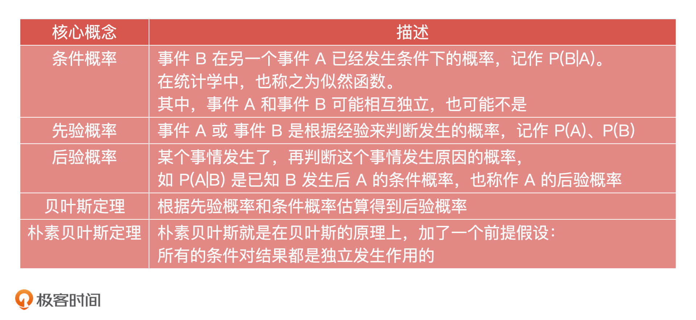

---
date: "2019-06-23"
---  
      
# 12 | 朴素贝叶斯：让AI告诉你，航班延误险该不该买？
你好，我是海丰。

今天，我们接着来讲一个基础的分类算法，朴素贝叶斯（NBM，Naive Bayesian Model），也可以简称 NB 算法。

你可能想说，贝叶斯我听过，什么叫朴素贝叶斯呢？其实，朴素贝叶斯就是我们在贝叶斯原理的基础上，预先假定了特征与特征之间的相互独立。那特征之间的相互独立是什么意思呢？简单来说，一个人的性别是女性和她是中国国籍这两项特征就是相互独立的，因为她的国籍不会影响到她的性别。那特征之间不相互独立也很好理解了，像是一个人的身高会影响他衣服的尺码，所以身高和衣服的尺码就不是相互独立的。

那特征与特征之间相互独立的好处是什么呢？朴素贝叶斯算法怎么解决分类问题呢？我们又该怎么使用它呢？今天，我们就通过一个预测购买航班延误险的例子，来给你详细讲一讲。

## 如何理解 朴素贝叶斯 算法？

有的同学可能对贝叶斯算法还不是非常熟悉，或者忘得差不多了，所以在讲朴素贝叶斯算法之前，我们先来说说贝叶斯算法以及相关的基础概念。

### 1\. 贝叶斯的原理

贝叶斯是由一名英国数学家提出来的，贝叶斯就是这个数学家的名字。那它是干什么的呢？

比如说，我们拿到一个长得很大的西瓜，拍一拍它会有咚咚咚的声音，而且这个西瓜的价格还特别贵，那我们就觉得它应该挺甜。虽然这个西瓜不一定是甜的，但是这些经验可以帮助我们在一定概率下找到甜西瓜。

<!-- [[[read_end]]] -->

这就是贝叶斯的原理：**当不知道这个事物实际情况的时候，我们可以根据一些相关的条件来判断这个事物的本质**。与贝叶斯相关的基础概念有 3 个，分别是**条件概率、先验概率、后验概率**。

**条件概率**就是事件 B 在另一个事件 A 已经发生条件下的概率，记作 P\(B|A\)。在统计学中，也称之为似然函数。比如说，北京下雨后，发生道路堵车的概率。

**先验概率**是事件 A 或 事件 B 是根据经验来判断发生的概率，记作 P\(A\)、P\(B\)。比如说，今天我面试了某厂的员工，根据过去的经验这个公司来的员工都很优秀，所以我判断这个人大概率也很优秀。

**后验概率**是我们已经看到某个事情发生了，再判断这个事情发生原因的概率，即**在事件已经发生后，推测原因**。比如 P\(A|B\) 是已知 B 发生后 A 的条件概率，也叫做 A 的后验概率。比如说，我们知道一个西瓜很甜，这个西瓜很甜的原因可能是土壤好，光照充分等等。这个时候，一个西瓜很甜是因为它的土壤非常好的概率，就是后验概率。

实际上，**贝叶斯的原理就是根据先验概率和条件概率估算得到后验概率。**

### 2\. 朴素贝叶斯的原理

朴素贝叶斯就是在贝叶斯的原理上，加了一个前提假设：所有的条件对结果都是独立发生作用的。这该怎么理解呢？

我们先来看朴素贝叶斯的公式：

\$\$  
\\mathrm\{P\}\(A \\mid B\)=\\frac\{P\(B \\mid A\) P\(A\)\}\{P\(B\)\}  
\$\$

你可能会说，看到公式我就头大。别着急，我们这就来快速理解一下这个公式。我们假设，公式里的 A 代表堵车，B 代表北京下雨，P 代表概率，所以我们可以得到这几个概率：

* P\(A\)：堵车的概率，也就是事件 A 发生的概率；
* P\(B\)：下雨的概率，也就是事件 B 发生的概率；
* P\(B|A\)：在堵车的情况下，北京下雨的概率，也就是在 A 的情况下，发生 B 的概率；
* P\(A|B\)：在北京下雨的情况下，堵车的概率，也就是在 B 的情况下，发生 A 的概率。

那朴素贝叶斯公式就可以理解成是在北京下雨的情况下，求堵车的概率。根据过往的统计结果，我们可以得到 P\(A\)=60\%，P\(B\)=30\%，P\(B|A\)=40\%，根据公式：P\(A|B\)=P\(B|A\) P\(A\)/P\(B\) = 40\% \* 60\% / 30\% = 80\%。也就是说，在北京下雨的情况下，有 80\% 的可能性会堵车。

因此，**在实际的应用中，朴素贝叶斯更适用于文本分类、情感分析、垃圾邮件分类这类场景，毕竟这些数据的相互独立性更高。另外，朴素贝叶斯还会和协同过滤一起，使用到推荐系统中**。当然，在实际工作中，贝叶斯的应用会更加复杂。接下来，我就以售卖机票的场景下，是否增加延误险的需求为例，来给你讲讲它的应用。

## 朴素贝叶斯的应用案例

之前，国内的 OTA 行业（Online Travel Agency，在线旅行行业）基本都接入了延误险。业内的做法是在售卖机票的时候，直接搭售延误险，但这样的产品设计对于用户体验来说是有损害的，用户往往在不知情的情况下，购买了本不需要的产品。

这个时候，我们就可以通过预测航班是否可能延误，给用户提一个航班延误概率的提示，让用户自己做主是否有购买延误险。从平台角度来说，这既丰富了平台的产品，又提高了总体 GMV，从用户角度来说，这既不需要面对不存在的延误险和机票的捆绑销售，又有了更多的选择和参考。

那我们该怎么去判断航班是否可能延误呢？我们可以用朴素贝叶斯快速构建一个模型进行预测。具体的做法是这样的：我们已经知道，决定航班是否延误最主要的因素就是起飞地和降落地的天气情况。假设这些原因之间完全没有影响，那么我们可以去收集过去的飞行数据，计算出每一个条件，比如天气和飞机延误之间的关系。

假设，我们的用户正在浏览北京飞往深圳的航线，他坐飞机的时间段内，起飞地北京的天气是雪天，降落地深圳是雨天。

上面这些条件，我们给它们都分配一个代号。其中，北京的天气是雪天是 A1，深圳的天气是雨天是 A2，飞机延误的概率是 B1，不延误的概率是 B2。这样一来，我们就可以统计飞机延误和不延误情况下，北京是雪天和深圳是雨天的概率了。那么上面那些概率就可以变换为：

* 飞机延误的情况下，北京天气是雪天 = P\(A1|B1\) = 20\%
* 飞机延误的情况下，深圳天气是雨天 = P\(A2|B1\) = 40\%
* 飞机不延误的情况下，北京天气是雪天 = P\(A1|B2\) = 10\%
* 飞机不延误的情况下，深圳天气是雨天 = P\(A2|B2\) = 10\%

根据历史数据，我们可以得到总体延误的概率为 P\(B1\) = 30\%，不延误的概率是 P\(B2\)= 70\%。这个时候，根据我们之前讲的贝叶斯公式，就可以得到北京雪天同时深圳雨天的时候，飞机延误和不延误的概率了，具体公式如下所示。

* 飞机发生延误的概率是：P\(B1|A1A2\) = P\(A1A2|B1\) \* P\(B1\) / P\(A1A2\)
* 飞机不发生延误的概率是：P\(B2|A1A2\) = P\(A1A2|B2\) \* P\(B2\) / P\(A1A2\)

虽然这两个公式中的分母 P\(A1A2\) 我们不知道是多少，但我们直接比较分子就可以知道延误概率和不延误概率哪个更大。把具体的数值套入到公式中，我们就能得到发生延误的概率是 24\%，不发生延误的概率是 7\%，计算公式如下：

* P\(A1|B1\) \* P\(A2|B1\)\*P\(B1\)/P\(A1\)\*P\(A2\) = 20\% \* 40\% \* 30\% = 24\%
* P\(A1|B2\) \* P\(A2|B2\)\*P\(B2\)/P\(A1\)\*P\(A2\) = 10\% \* 10\% \* 70\% = 7\%

这样一来，当用户在浏览这个航线的时候，我们就可以提示用户，“该航线大概率会延误，请您按需购买延误险”。

## 朴素贝叶斯的优缺点

朴素贝叶斯的优点主要有两个，首先是算法的逻辑简单，因为它的核心就是贝叶斯公式，所以它实现的过程是不需要训练的，算法计算的时候对资源也占用比较小。

因此，当公司没有算法工程师的情况下，如果你想做一些相对简单并且条件比较独立的事件预测时，你完全可以对研发工程师提出这样的要求：由你来提供相应的条件，研发工程师通过公式来帮你预测结果。

**这个时候，你不只是一个需求提出方，还是一个解决方案架构师，能够推动一个需求从0到1 的落地，同时还不需要公司提供额外的资源，这就是你价值的体现。**

但是由于朴素贝叶斯有一个假设前提，就是各个条件之间相互独立，互不影响。这让它的使用非常有局限性，只有在条件比较少，并且相互独立的时候，朴素贝叶斯的效果才会比较好。可是，现实世界中这种情况往往不存在，所以在面对条件个数比较多，或者条件之间有一些相关性的时候，朴素贝叶斯得到的效果就会差很多。

## 总结

今天，我带你一起学习了第三个分类算法，朴素贝叶斯。作为产品经理，我们首先要记住，这个算法的核心来自于贝叶斯公式，算法的前提假设是，算法中各个条件相互独立、互不影响。

同时，为了帮助你加深理解，我也把它的原理和基础概念总结在了下面的表格里。

接着，我们要重点掌握朴素贝叶斯的应用场景，我从两个方面帮你做了总结。

从算法适合的场景上来说，朴素贝叶斯比较适合用于垃圾邮件分类，用户情感预测这些和文本处理相关的场景，这些场景中，算法依赖的条件相互之间比较独立，所以适合用朴素贝叶斯算法来做。

从算法开发成本上来说，朴素贝叶斯适合项目周期比较紧张，算力资源不太充足的情况，因为朴素贝叶斯模型相对简单，构建过程不会太复杂，占用时间相对比较短，并且由于其相对简单的特点，对于算力的要求也不会太高。

## 课后讨论

假设，我们业务方 HR 团队希望你分析每一个员工的离职概率，你觉得用朴素贝叶斯合不合适？为什么？

欢迎在留言区写下你的思考和疑惑，也欢迎你把这节课分享给你的朋友，我们下节课见！