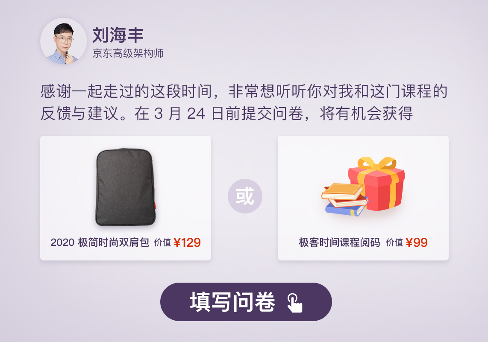

---
date: "2019-06-23"
---  
      
# 期末考试 | “AI产品经理”100分试卷等你来挑战！
你好，我是海丰。

《成为AI产品经理》这门课程到这里就正式完结了，非常感谢你一直以来的认真学习和支持！

为了帮助你检验自己的学习效果，我特别给你准备了一套结课测试题。因为在31讲，我已经给你留了20道面试题用于自测，所以这里，我只准备了 10 道题目用于结课测试，主要包括2道单选题和8道多选题，满分 100 分。

还等什么，快点击下面的按钮，开始测试吧！

除此之外，我还特意准备了一份问卷，想听听你的声音和反馈，以便我后面对课程进行更好地优化。同时，填写问卷还有机会获得礼物或者是课程阅码哦。

<!-- [[[read_end]]] -->