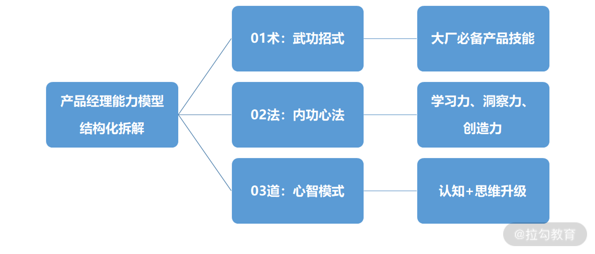
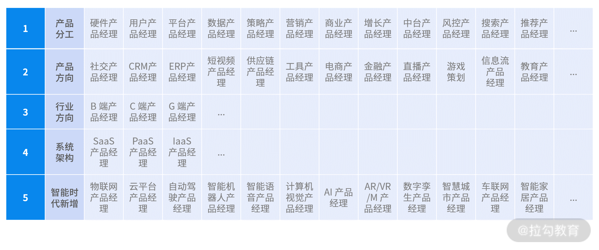
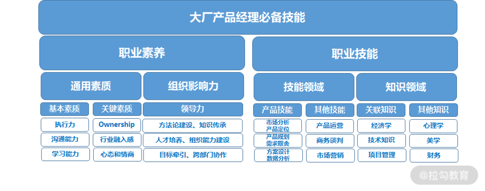
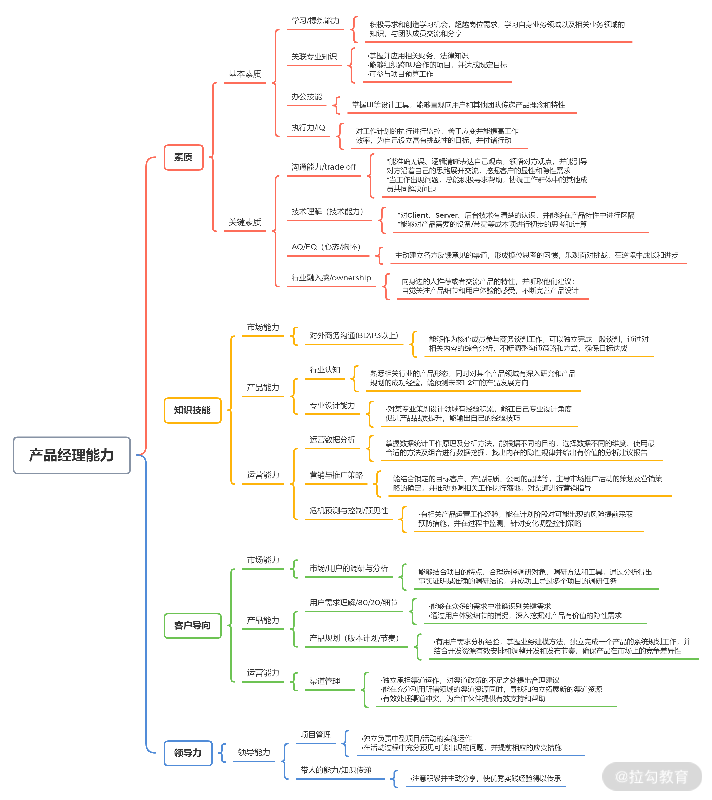

---
date: "2019-06-23"
---  
      
# 01 | 基础认知：大厂必备产品技能
你好，我是夏叶华，迄今为止，我在互联网产品领域 15 年有余。

多年来，我发现身边一个有意思的现象：有些人因职业路径选择不同而终点不同，比如有的选择产品经理→ 产品 Leader → 产品总监的**管理路线**，而有的选择前端产品 → 后端产品→ 产品架构师的**专业路线**。

此时，你可能会说：产品经理的职业生涯不可能这么顺，并不是每个人都能进大厂，也不是每个人都有很好的职业晋升机会。

平台和环境，从某种意义上来说确实会成为一部分人潜力发挥的限制因素，如果你暂时没处在一个很好的平台，也没有遇到好的成长机遇，该如何提升自己的产品能力呢？

### 产品能力模型拆解

因在大厂摸爬滚打了十余年，腾讯、滴滴、百度都待过，所以我对大厂到底需要什么样的产品能力可谓是了如指掌。接下来我将结合个人多年大厂经历，分享下大厂必备的产品能力，助你全方位认知产品经理能力模型，然后对标个人实际能力，设立更清晰的成长目标和实现路径。

关于产品能力模型，我将它拆解为三个层级：**基础认知、进阶认知和关键认知，** 如下图所示：

这三个层级的内容将在认知篇中分别进行讲解：01 讲主要从“术”的层面助你学会产品武功招式，02 讲主要从“法”的层面助你学会产品内功心法，03 讲主要从“道”的层面助你完成底层心智模式升级。接下来我们先看看产品经理常面临的一些困惑。

### 面临的困惑

随着移动互联网的发展，技术的进步，业务形态的多元化，产品经理的角色逐步被细分。

从各大招聘网站中我们可以看到，产品经理已经被细分为了大大小小几十个种类，如下表所示。

随着产品经理的工作被逐渐拆解，产品经理的职责范围越来越有限，在职业生涯发展过程中，我们也就不可避免遇到诸多困惑。

通过细化梳理，我发现这些困惑主要体现在**能力提升**和**职业发展**这两个层面。

#### 1.能力提升方面

如果我们长期从事同一个产品领域/同一个模块内容（即每天处于重复性的工作状态），也就无法接触到更大的业务范畴和更好的平台，整体能力也难以实现大幅提升。

比如前端产品经理主要负责用户交互和用户体验的相关工作，虽然能积累不少用户场景的设计经验，但在产品系统能力的打造、底层技术架构实现，以及 AI 算法能力的应用等方面关注较少。

又比如数据产品经理主要负责数据采集、数据治理、数据指标体系和数据可视化的相关工作，虽然在底层数据体系能力建设上很擅长，但缺乏用户思维和商业敏感度。

#### 2.职业发展方面

事实上，产品经理的职业发展和产品能力的构成密切相关。如果我们的工作内容过于单一，能力和潜力也会相应受到限制，从而对职业发展感到迷茫，然后滋生出以下 3 类问题：

* 该不该换个行业（比如电商领域换成金融领域）？

* 该不该换个产品方向（比如用户端换成平台端）？

* 该不该转型换个岗位（比如市场岗位换成商务岗位）？

出现以上困惑，本质上是因为我们缺乏对产品经理能力模型的全方位认知，从而无法对自身能力状况进行精准评估。而这一讲我们主要从基础认知，大厂必备产品技能的角度进行说明。

### 大厂必备产品技能

比如有些产品经理无论再怎么努力，收获总是有限，而有些产品经理稍微努力下就能达到职业顶峰，为什么会存在如此大的差异？我们先来看一个真实的案例。

> 冯磊和大伟是我非常好的两位朋友，可以说两人在专业领域上的表现都很优秀。认识他们时，他俩还只是国内一线大厂的产品专家，都在负责无人驾驶业务线的商业化产品工作。
> 
> 冯磊性格相对内向些，与人交流也不多，他比较喜欢独立完成一些工作，不过他工作非常努力，每天工作到夜里 11 点再回家都是常有的事，也经常利用业余时间学习些新知识。
> 
> 而大伟的性格恰恰相反，他非常喜欢与人沟通，建立连接。在平时工作中，他除了完成本职工作，还会利用空闲时间分析不少行业竞品及相关产品技术路线，并不定期在团队内进行分享。新业务人手短缺时，他还会积极配合 BD 部门拜访客户，收获了不少谈判技巧，也对 B 端客户的核心诉求有了更深入的理解。
> 
> 由于冯磊性格比较封闭，导致成长比较缓慢，目前他还在大厂做同类业务的产品专家。而大伟因为心态开放，努力抓住每一个学习和成长的机会，且具备超强的协作力和影响力，能快速推动产品落地，因此很快在大厂获得了职业晋升的机会。现如今，他已经是国内腰部互联网企业的 CTO。

从这个案例中我们不难看出，产品经理是一个极富创造力的一份职业，努力完成工作只是产品经理的工作底线。

实际上大厂在考核一名产品经理时，主要看我们是否足够优秀及我们到底能为企业持续创造什么价值。

那到底是什么样的产品能力，促使产品经理持续创造价值呢？这里我梳理了一套通用的大厂必备产品能力模型，助你对标自身能力优势与不足，如下图所示。

下面我将结合上面的真实案例为你详细解读每个技能分类。

#### 职业素养（职业软技能）

对于一名优秀的产品经理而言，我们不光需要拓宽相关领域知识，沉淀扎实的专业技能，更需要提升自己的职业素养，建立坚实而平稳的处事原则。只有这样，我们才能打造出持续具备竞争力的产品，并在组织中不断构建自己的影响力，最终实现产品经理的价值。

根据专业线和管理线的侧重点不同，我把职业素养划分为通用素质和组织影响力两个层面。

**1\. 通用素质（基本素质+关键素质）**

在上面的例子中，我们发现冯磊与大伟两人在产品专业领域表现都很优秀。

他们俩在工作期间，都能独立完成自己的本职工作，且非常努力，这里其实体现了产品经理**基本素质中的执行力、关键素质中的 Ownership**；而他们还会利用业务时间去学习新的知识，这里其实体现的就是**基本素质中的学习能力**。

既然两人同等优秀，为什么两人的职业终点不一样呢？从以上案例中，我们知道两人的性格不一样，一个内向不喜交流，另一个外向喜欢与人沟通，这里其实体现的是**基本素质中的沟通能力**，一个善于沟通的人往往会在工作中很快打开局面，快速赢得宽松的发展空间。同时，大伟还会利用空闲时间分析不少行业竞品及相关产品技术路线，并在团队内不定期做分享，这就是**关键素质中行业融入感、心态与情商**的良好体现，他也因此磨炼了个人关键素质，与他人逐步拉开了差距。

一般来说，产品经理经过 3 \~ 5 年的专业学习和产品实践都能达到一定的专业水准，这时**人和人之间的能力差异往往体现在通用素质上。因此，通用素质是大厂选拔人才的一个重要标准**。

那通用素质如何习得呢？这就要求我们讲究渗透学习方法：先有概念→再内化于心→最后渗透工作细节，最终达成整体素质的提升。

**2\. 组织影响力（领导力）**

组织影响力（领导力）是产品经理通往高阶专业岗或管理岗的基本能力，因为高阶产品通常需要负责一条或多条完整产品线，需要具备极强的领导力来牵动复杂资源体系，最终带领团队共同完成产品目标。

冯磊和大伟之前主要负责无人驾驶商业化的产品工作，无人驾驶是一个相对复杂的智能产品系统，涉及汽车大脑、智能传感设备及云平台的各类算法服务。对于无人驾驶的业务组织架构来说，光核心技术团队就有七八个，大伟如何从众多的人员中实现了突围？

这是因为大伟平时特别重视领导力的构建，且擅长设立清晰的产品目标，喜欢与团队交流，还经常进行复盘与经验总结。通过不断构建个人组织影响力，他顺利推动了团队实现产品的上线，这其实就是关键素质中**方法论建设、组织能力建设、目标牵引**的良好体现。

对于大厂来说，管理岗的核心 KPI 包含**产品指标和人才培养指标**，比如百度 P9 或产品总监一年内至少需要培养 2 \~ 3 个 P7。因此，作为一名管理者，我们不光要顾着自己成长，还需要通过领导力驱动他人成长。为了快速获得职业晋升，我们有必要提前建立自身在团队中的组织影响力。

#### 职业技能（职业硬技能）

职业技能主要靠产品经理的知识领域和产品实践经验习得，它需要通过逐步沉淀最后形成扎实基本功。

下面我将从技能领域和知识领域两个维度，来讲讲如何提升职业技能。

**1\. 技能领域（产品技能+其他技能）**

在上面的例子中，大伟除了完成本职工作（这里涉及**市场分析、产品规划、方案设计、项目管理等技能**），还会积极配合 BD 部门拜访客户，收获了不少谈判技巧，也对 B 端客户的核心诉求有了更深入的理解。

他就是因为不给自己设限，抓住一切学习和锻炼的机会，不断拓宽自己的技能领域，比如**市场洞察技能、商务谈判技能、市场营销技能……** 逐步成长为一个综合型人才，进而有能力进入更大的平台，承担更重要的职责，实现职业上的晋升。

产品技能是产品经理的基线技能，不论是专业岗还是管理岗，都需要通过扎实的产品实践来夯实这项技能，而其他技能是加分技能。尤其是工作 3 \~ 5 年的产品经理，如果想要往产品负责人方向发展，就更要特别关注全方位技能的提升，因为需要作出很多重大决策。

**2\. 知识领域（关联知识+其他知识）**

关联知识，指与产品经理日常工作强相关的知识领域，比如产品经理需要了解经济学原理，来理解业务战略和商业模式，从而形成与战略匹配的产品规划；需要了解前瞻技术知识，来明确技术的边界，从而与技术人员达成很好的协作；需要了解项目管理知识，通过专业化的项目管理方法论推动产品落地迭代。

除此之外，产品经理还需要学习其他知识，比如了解心理学，构建更好的用户洞察力；了解美学，更好地开展产品体验设计；了解财务模型，更好地计算产品的 ROI（投入产出比）。

产品关联知识和其他知识对于一个产品经理的能力提升至关重要。

产品经理是一个富有创造力的职业，**很多时候创造力看似来自某一刻的灵感，实际上它来自长时间的积累，而知识体系的丰富度就是产品经理创造力的源泉**。那么，从今天开始，让我们一起博览群书吧。

为了帮助你进一步理解和内化产品经理的能力要求，我整理了一个产品能力模型图，如下图所示。

### 小结

这一讲我们主要介绍了大厂产品能力模型，让你从全局的视角了解产品经理岗位的能力要素。

产品能力模型是产品能力提升的原点，后续整个专栏我们都会围绕产品能力模型的构建来展开，通过把产品方法论和实践案例相结合，助你一步步达成目标。

这里留一道思考题：目前你所在的企业如何进行产品经理角色细分？你属于哪类产品经理？请对照产品能力模型，分析自身存在哪些优势与不足，欢迎你在留言区与我互动、交流。

另外，如果你觉得这门课程有价值，也欢迎转发给有需要的朋友哦。