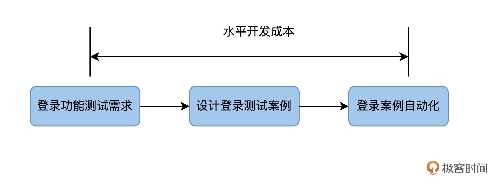
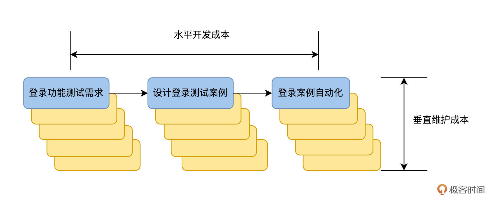
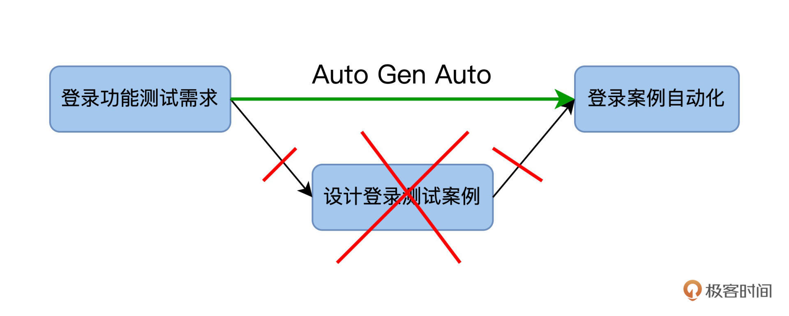
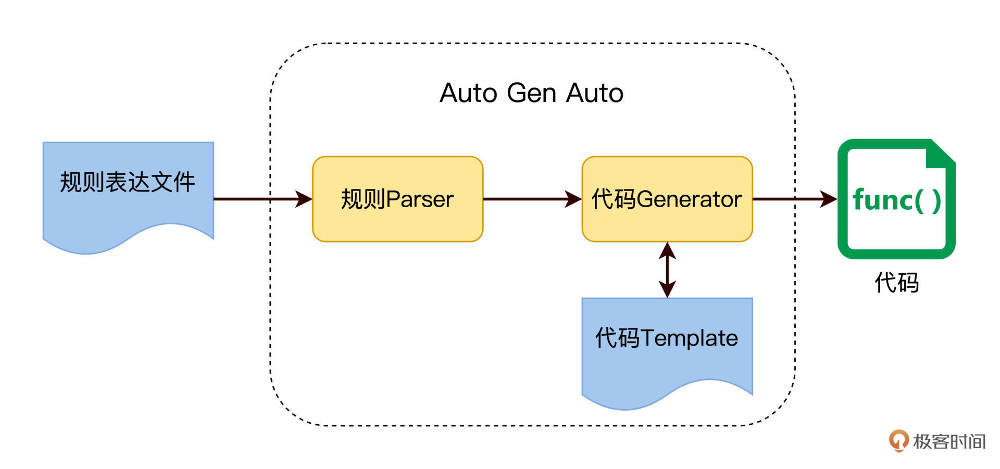
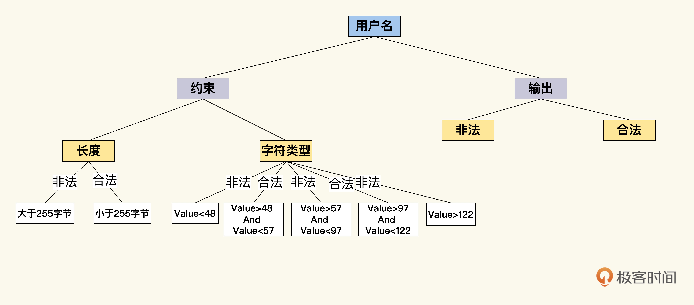
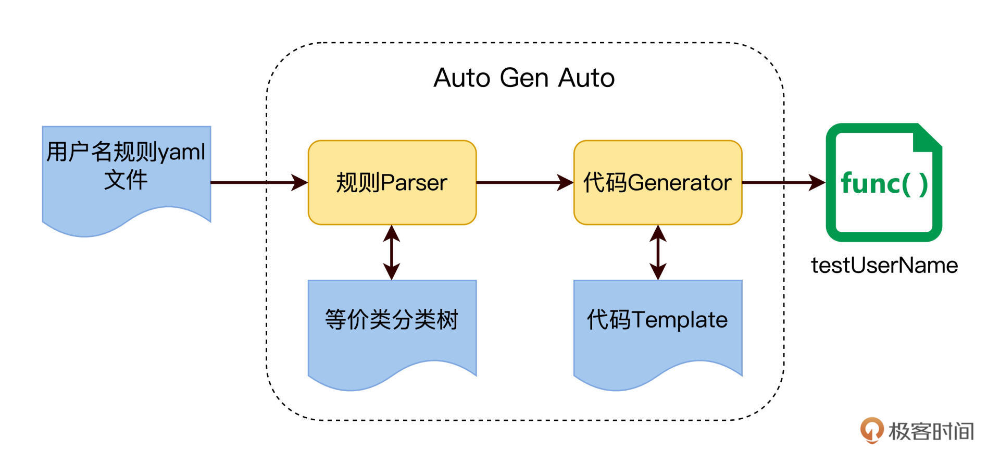
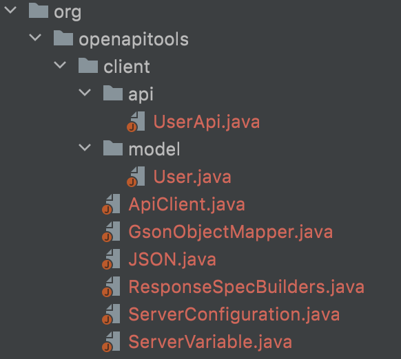

---
date: "2019-06-23"
---  
      
# 05｜Auto Gen Auto：所有测试工作即代码
你好，我是柳胜。

我们前面用了4讲篇幅，讨论ROI模型和由此衍生出来的一套实践原则，从分层测试、选型思路和具体代码多个角度探索提升ROI的方法。

这些方法还都是基于常规的自动化测试开发流程，先有测试需求，再设计测试案例，然后做自动化。以登录测试为例，我画了一张流程图做说明。


自动化测试的开发成本，就是把测试需求转变成自动化测试代码这个过程花费的时间。在我们的图里，它是从左向右，所以我管它叫做**水平开发成本**。



当登录功能测试需求发生变化时，就会重新走一遍这个流程，出现了多个版本的测试需求，也会带来多个版本的自动化测试案例。从下图可见，这个版本是自上向下增加，所以我管它叫做**垂直维护成本**。



我们现在可以直观地看到开发成本和维护成本了。好，问题来了，有没有办法**从流程上动手术，来降低这两个成本呢**？

这就是我们今天要讲的Automation Generate Automation，也叫自动化产生自动化测试代码，为了方便起见，下面的篇幅用缩写Auto Gen Auto来指代。

## Auto Gen Auto 技术

常规的自动化测试，是指用代码实现设计好的TestCase，而Auto Gen Auto的目的是让Test Case生成也自动化，如下图所示。

<!-- [[[read_end]]] -->



因为从测试需求到自动化测试案例是完全自动化的，每次需求改变的时候，只需运行一次Auto Gen Auto即可生成新的自动化案例，垂直维护成本为零。所以Auto Gen Auto技术如果能落地，ROI就会大大提高。

### 从何处下手

那Auto Gen Auto用在哪性价比更高呢？

业界熟知的测试方法是黑盒测试和白盒测试。白盒测试从测试案例设计开始，需要我们先了解代码逻辑结果，一个函数里有几个判断分支，处理那些数据。基于这些了解，再设计案例验证函数输出和达成代码覆盖率。

在白盒测试里，Auto Gen Auto不是啥稀奇事，XUnit框架都提供了不少开发IDE的plugin，可以扫描一个class的函数，直接产生test方法。开发人员只需补充少量代码，test方法就可以运转起来了。

与之对应的是黑盒测试，测试案例设计不基于产品代码，而是用户规格说明。比如，用户在订餐系统上完成一个订单，用户该怎么操作，下单成功后应该收到物流单号等等，设计这些测试案例的目的是验证业务能够完成，不需要去看代码。

今天，我们要关注的是**在黑盒测试领域的Auto Gen Auto**，这个更有挑战性，也更有探索价值。因为，作为测试人员花了大量时间来设计黑盒测试案例，而且还要手工维护这些测试案例的变化，这个过程要是都能自动化了，就会省去很大的重复又枯燥的工作量。

### 如何实现

怎么做到Auto Gen Auto呢？用代码生成代码，前提是测试需求得有一定的规则或模式，然后代码才能解析规则，根据规则生成最终的测试代码。

这个实现思路，在开发中是很常用的，比如Maven Archetype使用模版自动生成项目代码，Soap使用WSDL来生成调用桩等等，原理图如下。



所以，要做Auto Gen Auto，我们的目标是先要找出测试需求里的这些规则，并把它们表达出来，放在一个规则文件里。我们看看下面的例子。

## 测试等价类的规则

远在天边，近在眼前，我们在测试案例设计中经常用到的等价类和边价值方法，就可以作为Auto Gen Auto的规则。

等价类是指某个输入域的子集合，在同一个子集合里的所有元素对于测试的效果都是等价的。

我们要测试一个订餐系统的用户名，首先要了解用户名上的约束。从长度上来看，假设用户名最大长度是255个字节，根据这个约束，至少能产生2个测试等价类：有效等价类是小于255字节的用户名，无效等价类是大于255字节的用户名。测试用户注册功能时，就可以用到这2个等价类了。

用同样的思路看用户名的另外一个约束，那就是字符类型的限制，假设用户名只能由英文字母和数字组成，根据这个约束，又可以产生多个等价类，中文字符、ASCII字符、数字、High ASCII等等。

看到没有？其实我们用等价类方法设计测试案例时，遵循的是**等价类划分规则，设计出来的测试案例也与等价类一一对应**。但手工做这些，工作量会很大，因为整理约束时会有遗漏，改变约束的时候，也容易忘了维护测试案例。

如果能让测试案例和等价类自动对应，然后依据规则动态产生测试案例，这些问题就会迎刃而解。不过，我们得先把这些约束规则外化表达出来，在这里，我用一个user-rule.yaml文件来表达这些规则。

```
    name: user name rules
      appliedTestCase: register, login
      rules:
        lengthRule:
          express: <=255 chars
        characterRule:
          express: value>=97 and value<=122
          express: value>=48 and value<=57
    

```

为了让这个YAML文件能对代码友好，我把express表达式部分做了技术处理，ASCII值从97到122之间是a～z的字符，48到57是数字0～9。

然后，我们写一段代码，从这个YAML文件中直接把规则加载进来，在内存中形成一个分类树。



1个用户名，有2个约束，每种约束都取1次不同的等价类，那测试案例的组合总共有2 \* 5= 10个测试案例。

如果对每一个等价类再加上权值，我们还可以根据权值，过滤掉部分权值偏小的测试案例。基于YAML可以生成以下测试案例，从案例名字，你可以看出用户名的取值规则：

TestUserNameLengthLessThan255  
TestUserNameLengthBigThan255  
TestUserNameAsciiValueLessThan48  
TestUserNameAsciiValueBetween48And57  
TestUserNameAsciiValueBetween57And97  
TestUserNameAsciiValueBetween97And122  
TestUserNameAsciiValueBigThan122

好，这里看到成果是很明显的。因为测试案例的生成是自动化的，所以，以后需求变化时，比如允许用户名出现中文，那就在user-rule.yaml里增加一条rule，测试案例也会自动被修改，测试案例维护工作量等于0。

到这里，我再画个图总结一下这个方案的实现思路。



## 业务的逻辑规则

用等价类的规则表达小试牛刀后，我们尝到了甜头。看来，只要能把规则表达出来，生成测试案例这个工作就可以交给代码去做。我们再找一个更加实用的场景，来看看怎么落地。

在做API测试的时候，restAPI的接口一般是通过Open API规范来描述。在设计阶段，开发先定义要实现的API接口，Client要发送什么样的Request，Server要返回什么样的Response。

比如下面的user-restapi.yaml文件，就是遵循Open API规范，定义了一个根据name查询User的RestAPI。

```
    /api/users:
        get:
          description: 通过name查询用户.
          parameters:
            - username
              type: string
              description: 用户name
          responses:
            '200':
              description: 成功返回符合查询条件的用户列表.
              schema:
                type: array
                items:
                  $ref: '#/definitions/User'
    

```

这个接口很简单，但它也声明了一个简单的契约，Client要想查询User，它需要向server发送一个http get请求，发送的url格式如下：

http://\{host\}:\{port\}/api/users\?username=liusheng

而server如果查询到了User，它应该返回这样一个http status code为200的response，内容如下：

```
    {
            "items": [
              {
                "ID": "123456",
                "name": "liusheng",
                "age": 18
              }
              ]
    }
    

```

YAML文件里定义接口所用到的关键字，像get、description、parameters等等，它们都是Open API里定义好的，含义也是明确的，那么YAML表达出来的规则内容也是可以解析出来的。因此，我们同样可以根据规则内容，直接生成测试代码。

实际上，业界已经有了现成的工具，有Spring Clond Contract，也有[OpenAPI generator](https://github.com/OpenAPITools/openapi-generator)。

我们这就借用这个工具跑一下，把它下载到本地，运行如下命令行：

```
    java -jar openapi-generator-cli.jar generate
    >   -i user-restapi.yaml \
    >   -g java \
    >   --library rest-assured
    

```

运行后就会生成一个基于RestAssure的测试项目。这个自动生成的项目里包含了API测试运行所需要的Client、Config、Model、API所有代码。



对照上图，UserApi.java里的testGetUserByName函数，就是根据YAML文件的API定义自动生成的测试代码，可以直接运行。

```
    @ApiOperation(value = "Get user by user name",
            notes = "通过name查询用户")
    @ApiResponses(value = { 
            @ApiResponse(code = 200, message = "成功返回符合查询条件的用户列表") })
    public GetUserByNameOper testGetUserByName() {
        return new GetUserByNameOper(createReqSpec());
    }
    

```

是不是很酷？一份契约就这样变成了可执行的测试代码，完全不需要任何开发工作量。

在解放生产力这件事上，优秀的工程师从不满足。上面只生成了一个测试案例，能不能生成多个测试案例，做更多的测试覆盖，让这个好点子物尽其用呢？

当然可以，按照等价类规则的思路，多个测试案例来自于多个约束，那我们可以在YAML文件中，加入username更多的约束描述。在user-restAPI.yaml文件里，username加两行属性，minLength是5，maxLength是255，代表用户名最小长度是5个字符，最大长度是255个字符。

```
    /api/users:
        get:
          description: 通过name查询用户
          parameters:
            - username
              type: string
              minLength: 5
              maxLength: 255
              description: 用户name
             .............
    

```

现在，我们就可以用等价类规则转变成测试案例的思路，解析YAML文件，把testGetUserByName分裂生成多个测试方法了：

testGetUserByNameLengthLessThan5  
testGetUserByNameLengthBetween5And255  
testGetUserByNameLengthBigThan255

OpenAPI generator这个开源工具就说到这，你可以根据具体需求灵活修改它，加入对YAML文件任何属性的解析，赋予它测试上的意义，使之成为强大的Auto Gen Auto工具，为你所用。

到这里，我们回顾一下，想要做好API测试0代码，自动生成的测试案例够多，有2个隐含的前提条件要满足：

1.API设计先行。在API**设计阶段**就要理清接口规则并把它表达出来。

2.在API接口的规则文件里，规则描述得越详细，可自动生成的测试案例就会越多。

在实践中，我看到很多公司忽视了API设计先行原则，开发团队写完代码，再生成YAML接口文件，然后交给测试人员开发API测试代码，这把流程恰好搞颠倒了。本来应该是根据接口设计文档来开发代码，开发和测试都能依据设计并行展开工作，这个做法也会促进团队在设计阶段考虑好设计。

但是，先写代码再产生接口文档，实际就会默许甚至鼓励开发人员先信马由缰写代码，写出来什么接口都算数。从API测试角度来看，测试需求就处在一个不稳定的状态，会带**来高昂的自动化测试垂直维护成本**。在第二模块里，你也会看到，设计先行对于开发人员内部协作也至关重要。

另外，有了一份定义完备详细的接口设计文档，Auto Gen Auto解决方案才可能实现。它不仅能够生成API test，还可以生成performance test等等。

有兴趣你可以自己研究一下这块的工具（相关工具有兴趣你可以点[这里](https://github.com/sheng-geek-zhuanlan/awesome-test-automation)了解），OpenAPI是其中的一个，我们在后面的课程还会提到Spring Cloud Contract，也是类似的解决方案。

## 小结

今天，我们一起学习了如何通过Auto Gen Auto技术，进一步降低我们的开发、维护成本。白盒测试中实现自动生成并不稀奇，所以我们把重心放在了更有挑战的黑盒测试领域。

想要自动生成测试案例，需要我们先洞察业务场景里的规则，并把它表达出来，形成文档，在团队里达成共识，作为**开发和测试的契约**。

我们先从黑盒测试里最熟悉的等价类案例设计方法开始，把用户名的命名规则整理清楚，并且把它表达在一个YAML文件里，将这个规则作为我们Auto Gen Auto的输入。然后经过加载，解析，最后输出测试案例。在这个过程中，我们关注的是实现思路，没有给出具体的实现方案，有兴趣你可以自己尝试一下。

在第二个例子里，我们着重看业界经验，以OpenAPI为例，它对RestAPI接口设计不仅有设计规范，还提供了一套工具集，我们使用了它的Generator生产了一个查询user的测试案例代码，你能直观感受到它的便利。而且，像OpenAPI generator代码都是开源的，你完全可以改造它，做适合自己项目的定制化扩展。

做Auto Gen Auto这样的项目，带来的ROI是非常高的，一次性开发工作量，不需要代码维护工作量。重要的话再说一遍：**任何提高ROI的努力，都是值得去尝试的。**

## 牛刀小试

访问<https://github.com/OpenAPITools/openapi-generator>，按照指令，运行generator命令，在Python，JavaScript，Java，Go四种语言里选一种生成代码。

欢迎你在留言区和我交流互动，也推荐你把这讲内容推荐给身边的测试同学，一起精进技术，提升效率。