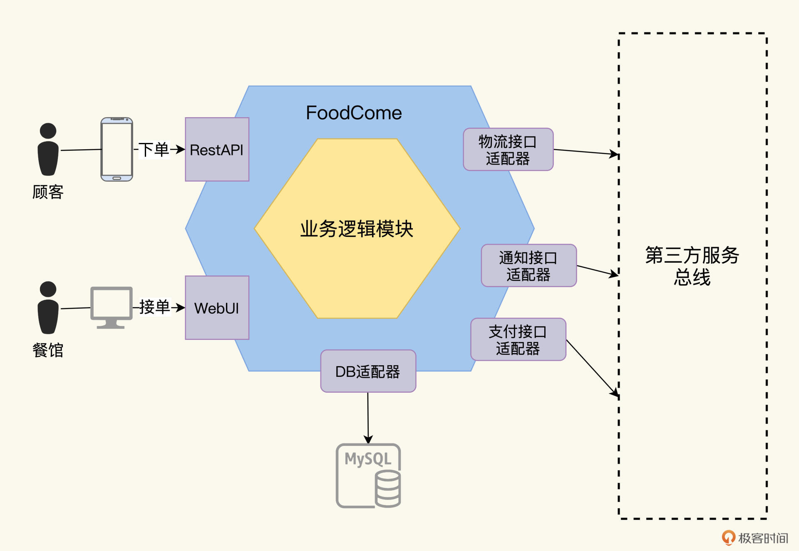
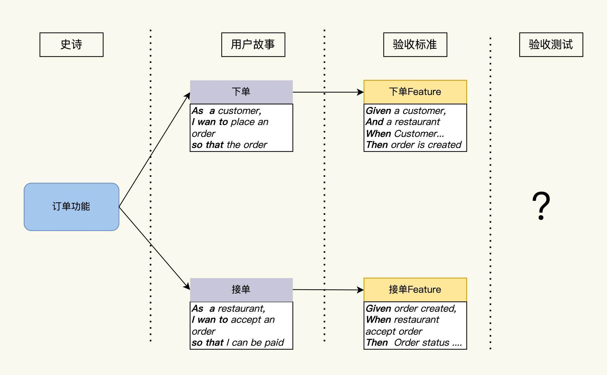
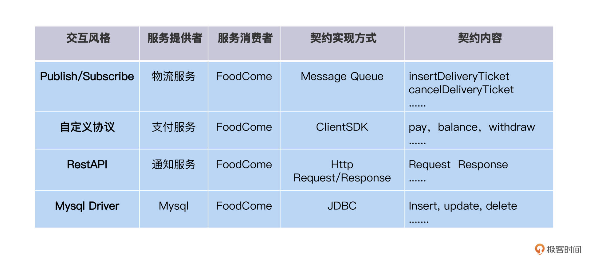

---
date: "2019-06-23"
---  
      
# 07｜需求提炼（一）：单体应用要测什么？
你好，我是柳胜。

通过第一模块价值篇的学习，我们已经掌握了自动化测试效益的量化思维。理解思路还不够，我们在设计篇这个新模块，会把自动化测试里的各种类型、策略和实现技术都梳理一遍，把上个模块学到的知识应用起来，通过科学设计达到测试效益整体最优的目标。

为了让学习过程更接地气，尽可能贴近你日常的工作应用，我们这个模块会围绕一个具体的订餐系统项目，逐一分析它的需求、接口、用户场景，然后制定相应的自动化测试方案。掌握了这套推演逻辑，对单元测试、接口测试和系统测试，哪个层面的测试应该做什么、工作量分配比例是多少，你都能胸有成竹。

今天这一讲，我们的目标是整理出清晰、完整的测试需求，这是所有测试工作开始的第一步。有了这个基础，后面才能制定计划、设计自动化测试用例，完成测试代码开发。

## FoodCome的单体系统

我们现在有一个名为FoodCome的应用。它刚开发出来的时候是一个单体系统。

这里要解释一下，什么是单体系统。一般的理解是，单体系统是一个整体，用一种语言开发，一次构建所有代码，产生一个部署实体，在运行态下是一个进程。比如常见的Web应用，就是一个war包。

这个FoodCome就是一个Web应用，它为用户提供点餐功能。用户可以通过手机下单点餐，订单生成后，餐馆可以接单，厨房制作完成，转给物流交付给用户。

<!-- [[[read_end]]] -->

为了分析测试需求，我们用六边形架构图方法来理清系统内外的交互接口。六边形架构法是把服务画成一个嵌套的六边形，最外层的大六边形是适配器层，代表了本系统和对外的所有交互。里层的六边形是领域业务层。适配器层负责对外交互，这个和业务关系不大，一般是通用的技术，主要是驱动、协议和基础设施，而领域层是业务逻辑的组织和实现。如果你对六边形架构不太熟悉，还可以参考[这里](https://www.jianshu.com/p/c2a361c2406c)了解。

为了简化，这里我只画出顾客下单和餐馆接单两个交互。



FoodCome是一个单体系统，它运行起来后，外层六边形上的接口有这么2种：

1.用户接口，用户有2种类型，一个是食客顾客，一个是餐馆业主。顾客通过手机下单，进入到FoodCome系统，而餐馆通过FoodCome的Web客户端可以查看和接受订单。

2.适配器接口，和第三方系统的集成接口。FoodCome集成了物流系统、通知系统和支付系统。顾客的订单通过支付系统完成支付后，餐馆开始加工，加工完毕后，食品通过物流系统快递给顾客。整个工作流，都会有状态的变更通知发送给用户。

2种接口明确了，我们再具体分析下测试需求都有哪些。

## 用户接口的测试需求

想定义测试需求，先要明确功能需求。功能需求是描述软件的功能，听着是不是像循环定义？想描述清楚软件的功能并不容易，这里我们借用迈克·凯恩提出的方法，一个软件软件功能需求要回答这三个问题：**第一，这个功能存在的价值是什么？第二，软件是怎么实现这个价值的？第三，这个功能能给谁带来价值？**

### 用户故事User Story

刚才说的这三个问题，到后来就成了User Story的表达3要素，WHY为什么、WHAT是什么和WHO为谁，把这三个要素说明白了，这个功能也就表达出来了。

我们用FoodCome举个例子。“用户下单买食物”这么简单一句话，算不算一条功能需求呢？算，因为它包含了那3个基本要素，目的（WHY）、行为（WHAT）和人物（WHO）。用户是主体人物。他做了什么呢？下单。下单有什么价值呢？能得到食物。所以这就是一个最精简的功能需求表达。

细节是魔鬼，我们再来看个反例。相比来说，我相信不少人都会看到这样的需求：“用户使用username，password来登录FoodCome。”这是不是一条功能需求呢？

这句话里好像也包含了目的、行为和人物，但它并不是一个合格的功能需求。“使用username，password”和“登录FoodCome”这两个都是登录的行为，还是在重复WHAT，并没有说明登录的价值。

所以它的正确描述，应该是“用户登录FoodCome来购买食物”，或者“用户登录FoodCome来获得优惠券”，“购买食物”和“获得优惠券”是受登录保护的功能，也是能给用户带来价值的事情。

这个细微的差别，迈克·凯恩曾经这样说“A user story is a way of remembering that a piece of work why need to be done, without committing to actually doing it, or diving into the details too soon”。意思是，功能需求的主要目的是描述功能的商业价值逻辑，而不是刻画实现的细节。

如果我们用一个语句范式来组织前面三个要素，就是下面这样：

```
    As a <type of user>
    I want <capability>
    so that <business value>
    

```

用了这样一组关键字，as a说明用户的角色，I want to后面是描述用户的行为，so that是获得的商业价值。  
FoodCome的下单功能描述就变成了这样：

```
    As a customer of foodcome,  
    I want to place an oder for food
    so that the food arrive in 30 minutes 
    

```

作为顾客，我希望能在FoodCome上下一个单，然后食物在30分钟内就来到我眼前，这就是FoodCome下单给我带来的价值。

用户下单之后，餐馆就会接单。FoodCome的接单功能描述如下：

```
    As a restaurant of foodcome,  
    I want to accept an order from customer
    so that I can be paid after deliver the food 
    

```

那你可能会说，这个需求很笼统啊，作为开发人员不知道怎么实现，作为测试人员也不知道怎么测？好，这时就要进入BDD feature阶段了。

### 测试需求BDD Feature

BDD的全称叫做Behavior Drive Development，**行为驱动开发模式**。想达到驱动开发的程度，这个Behavior行为的定义就要足够细化，开发人员知道怎么去实现了，同样，测试人员也知道该怎么测试了。

BDD是怎么做的呢？它把User Story细化成一个或多个feature，每一个feature都是一个可测试的场景。

这个feature的文件书写也是有格式要求的，通过一个叫做Gherkins的语法关键字模版来写feature文件。

Gherkins提供的常见关键字有：

**Given:** 用户场景的前提条件，可以是时间条件，也可以是另外一个用户场景的输出结果。

**When**: 用户在这个场景里做的行为操作

**Then**: 行为的输出结果

**And**: 连接多个关键字

Gherkins还提供了更多其他关键字，你可以参看[这里](https://cucumber.io/docs/gherkin/reference)了解更多。

使用Gherkins语法，描述下单的Feature，是下面这样的：

```
    Given a consumer
      And a restaurant
      And a delivery address/time that can be served by that restaurant
      And an order total that meets the restaurant's order minimum
    When the consumer places an order for the restaurant
    Then consumer's credit card is authorized
      And an order is created in the PENDING_ACCEPTANCE state
      And the order is associated with the consumer
    

```

我们可以看到，在Given、When、Then这些关键字的组合下，BDD feature比User Story丰满多了：一个用户下单的条件是什么，有地址的约束、信用卡的付款授权，下单之后的结果是什么，订单在系统里被创建，状态是Pending\_Acceptance。

同样的，餐馆接单的feature文件如下：

```
    Given an order that is in the PENDING_ACCEPTANCE state
    When a restaurant accepts an order with a promise to prepare by a particular
         time
    Then the state of the order is changed to ACCEPTED
      And the order's promiseByTime is updated to the promised time
    

```

Given、And、When、Then这些关键字，和编程语言里的If，else，then相似，所以Gherkins描述方法从自然语言向编程语言迈进了一步，更加详细精准，也更符合软件技术人员的习惯。

到这里，我们就通过BDD把可测试需求表达出来了。这个Feature要细化到什么程度呢？从测试角度来看，要达到可测试的程度，也就是说要能够通过feature来验收User Story，所以，feature在敏捷开发里又叫Accept Criteria，在传统测试里叫做验收标准。

我画了一张图，User Story和Feature的关系，你会看得更清楚一些



既然有了测试需求，建立了验收标准，后面再做验收测试就很轻松了，这个怎么做验收测试的问号，我先卖个关子，留到第16讲为你揭开答案。

## 适配器接口的测试需求

说完了功能需求如何表达，我们再来看看适配器接口。

FoodCome和3个外部服务有集成，分别是物流系统、通知系统和支付系统。和用户接口的强业务属性不同的是，适配器接口的技术属性强，因为适配器层走的都是协议和数据，这里我们的难点是，每个适配器接口用到的协议是不一样的，比如物联网用的MQTT，同步调用用restAPI，异步调用用Message Queue等等，那怎么把他们的测试需求梳理出来呢？

像使用Gherkins语法来表达功能需求一样，我们也可以通过一个契约的概念，理清集成点的内容。

一份契约的形成，包含以下几个要素：

* **服务提供者**：提供服务的一方
* **服务的消费者:**调用服务的一方
* **交互风格**: 双方交互的类型
* **契约的实现方式**: 交互用到的具体协议和方法
* **契约内容**： 交互的数据  
  在软件设计阶段，就应该定义契约，用什么服务、基于什么协议、消费者需要发送什么request，以及服务提供者返回什么response等等；在软件开发阶段，开发人员需要按照契约来实现代码；到了测试阶段，我们的任务就是验证双方是否按照之前定义的契约进行交互。

按照契约格式，可以整理出FoodCome的集成点，结果你可以参考下表：



在实际工作中，你可以把这张表扩展和细化，加上版本信息，项目计划等等，让这个表更具有可操作性。

好，到这里，收割一下成果，对于单体系统，我们用六边形法找到了系统对外的交互点。这些交互点上，有不同类型的需求。根据测试点类型，我们采用不同方法来表达这些测试需求。

1.功能需求用gherkins语法表达出user story。

2.把第三方服务的集成点整理成契约。

其实测试需求不仅是功能需求和第三方服务集成这两种，还有安全性、兼容性、易用性和性能等方面的需求。不过我们这个专栏关注的是自动化测试，所以其他需求不做讨论。

## 小结

这一讲我们学了3种方法：六边形架构法、User Story三要素，Gherkins feature表达方法和接口契约。在订餐单体测试需求分析中，这些方法是如何应用的呢？我们一起回顾一下。

我们先用六边形架构法来从概要层面上观察系统的对外交互方式，也就是我们的测试点。然后根据测试点的不同类型提炼需求：对于功能性需求，用Gherkins表达方法来表达成用户故事；而接口性需求，用契约要素来厘清双方的“权利”和“义务”。

在实践中，这些测试需求不会那么理想，在设计阶段定义清楚了，就会一直不变，我们这里重点关注的是需求表达的格式化和文档化，做到这些，可以入库进行变更管理流程，作为我们下一步自动化测试设计和实现的基础。

另外，从这个过程中，你能感受到，想要把测试需求整理得清楚、完备，测试人员应该尽早尽多地参与到软件需求分析、软件设计等活动中去。这些能帮助我们更全面地理解“测什么”。

今天我们研究的还是一个单体应用，下一讲这个单体应用会演变成服务集群，测试需求的复杂度会加大，我们还要使用更多的方法来应对挑战，敬请期待。

## 思考题

今天我留两个思考题，你可以选择自己喜欢的题目说说看法。

1.思考一下你工作的软件系统，它们的测试需求在哪里？是怎么被表达的？怎么存储和变更的？

2.你遇到过什么奇葩的测试需求，如果换你来提交需求文档，你会如何改进它？

欢迎你在留言区跟我交流讨论，也推荐你把这一讲分享给身边的同事、朋友，说不定就能帮他解决需求整理的困惑。