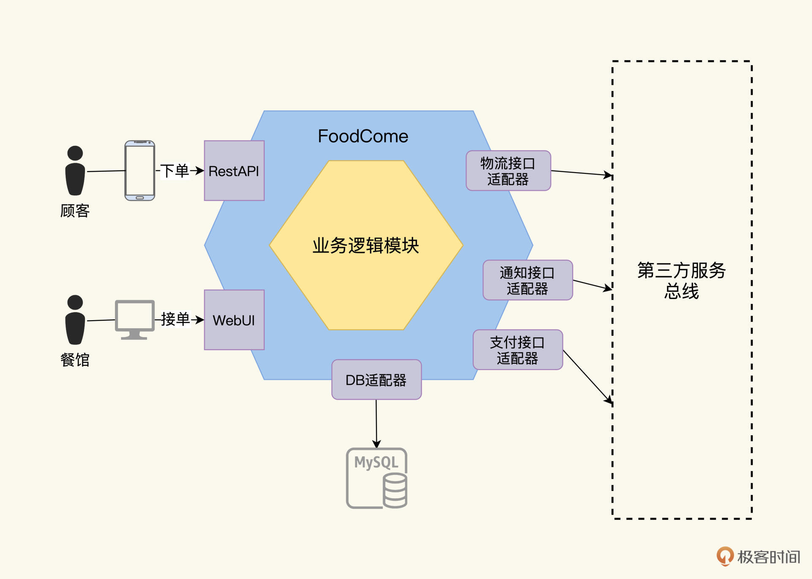
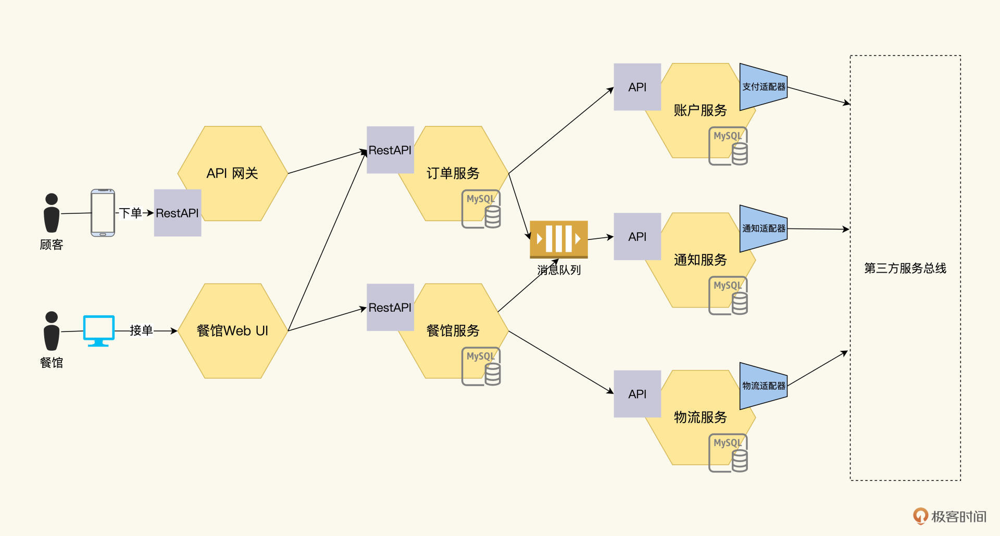
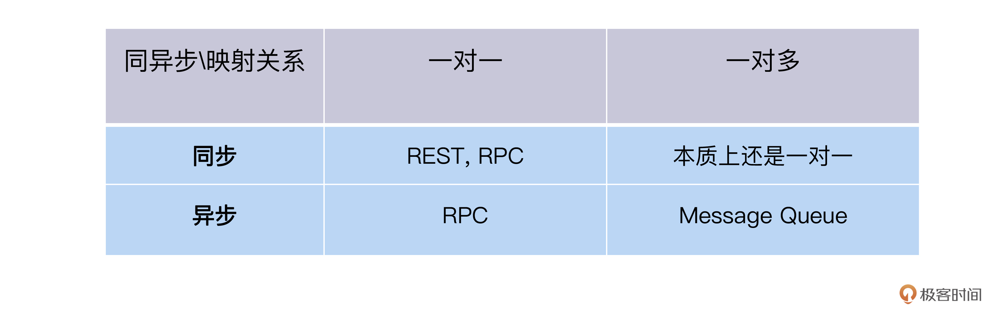
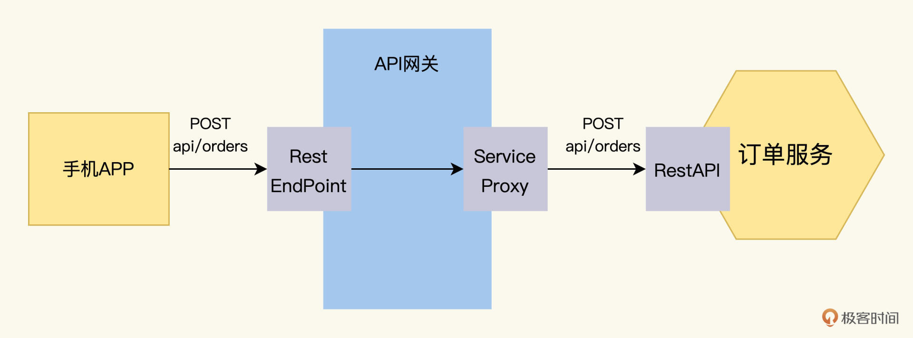
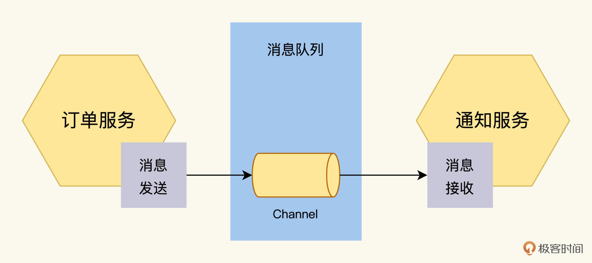
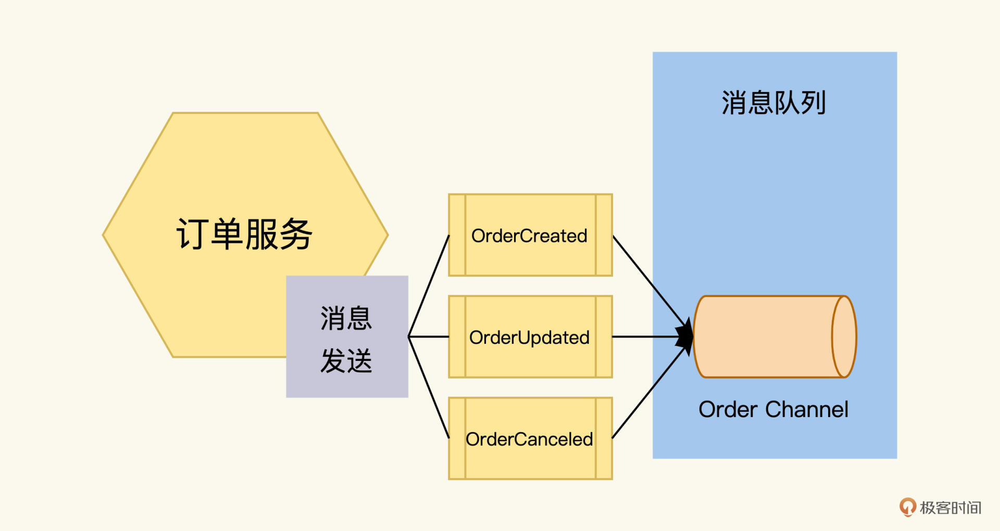
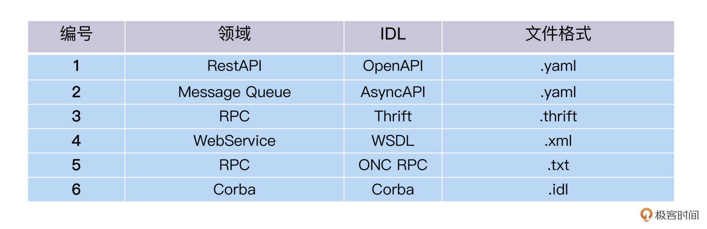
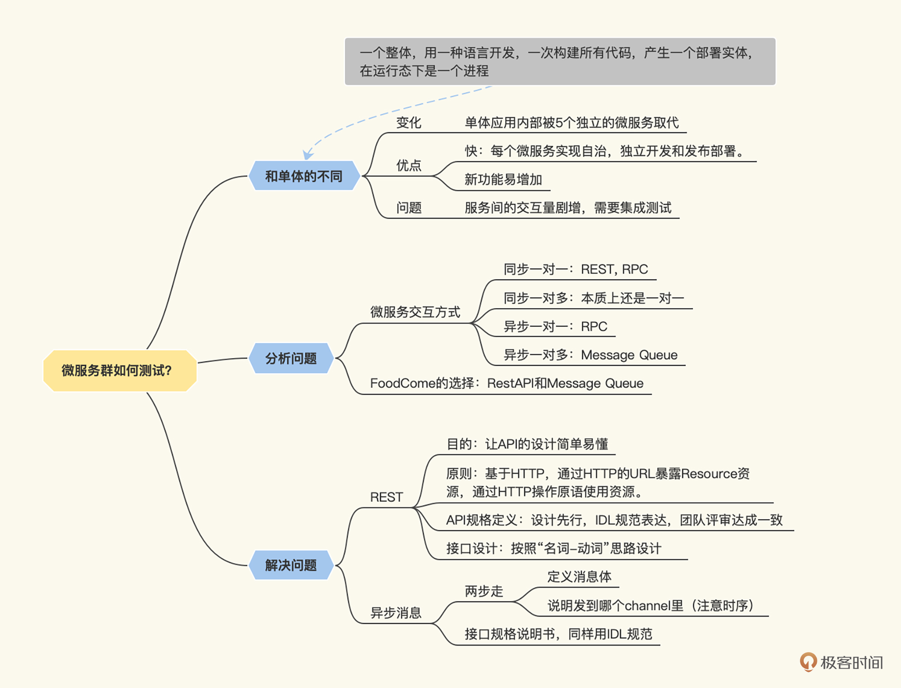

---
date: "2019-06-23"
---  
      
# 08｜需求提炼（二）：微服务集群要测什么？
你好，我是柳胜。

随着互联网发展和软件场景普及，单体应用逐渐暴露出致命缺陷，比如过于庞大，大大增加系统的复杂度、交付速度变慢，协作困难、错误难以隔离、维护成本巨大等等。

同时，软件技术也在发展，出现了VMware、Docker和Kubernetes等轻量化部署方式，这使得拆分的困难变小，部署的成本降低。微服务架构诞生后，一个系统拆分成多个独立开发和运行的服务，这个服务不管大小，业界都管它叫微服务。它们也有一套服务治理的技术规范，用来保证部署和运行的可靠性和扩展性。

微服务集群的开发方式确实方便了用户需求快速实现和交付，但今天我们的关注点是，从测试角度看，微服务相比单体应用有什么不一样？有没有新的测试点？

这一讲我们将继续延续FoodCome的例子，看看它从单体应用变成微服务架构之后，给测试工作带来的变化和挑战。

## 微服务架构下的FoodCome

在上一讲，单体应用的FoodCome是这样的：

随着业务规模的扩大，开发人手增加，FoodCome被拆分成5个微服务，具体如下：

* 订单服务：处理用户下的订单；
* 物流服务：Foodcome内部的物流管理，与外部物流对接；
* 餐馆服务：管理餐馆的信息，参与订单的工作流；
* 账户服务：管理订单里的顾客信息，和外部的支付系统对接。
* 通知服务：产生消息通知用户，和外部的邮件系统对接。

<!-- [[[read_end]]] -->

由此组成的FoodCome的微服务架构如下图：



在这个架构下，原先单体应用的对外接口保持不变，但是单体应用内部被5个独立的微服务取代。用户的订单请求先通过API网关到达订单服务，完成支付后，餐馆接单，再通过物流系统交付订单。

每个微服务实现自治，独立开发和发布部署，加快发布速度。而且增加新功能也很方便，比如登录鉴权，在这个图中再增加一个认证服务就可以，这是给客户带来的好处。

现在的问题是，这给测试带来哪些变化呢？分拆后，FoodCome系统变成了微服务集群，就像一部巨大机器，由多个零件组成，互相咬合，一起工作。作为测试人员，不但要验证每个零件是合格的，还要有办法预测它们组装起来的机器也能正常工作。

这里的测试难点是，微服务的数量增加，服务间的交互量也会剧增，相比单体系统，集成测试在微服务集群架构下更加关键。

要做集成测试，我们就先搞明白微服务间是怎么交互的。在微服务架构下，交互可以有多种风格，比如RPC远程过程调用、REST风格、Message Queue消息队列等等。根据交互的方法和风格，我把它们整理出一个表格，方便你理解。

  
在FoodCome采用了两种交互方式，RestAPI和Message Queue。

RestAPI用来处理实时性强的服务间交互，比如前端通过API网关调用订单服务来下订单。



Message Queue用来处理异步的交互，订单服务和通知服务之间通过Message Queue来交换信息.



下面我们来看一下这两种交互方式的具体实现，然后找出测试点。

## REST

我们需要先知道Rest接口是怎么设计的，才能找出后面都要测什么。

### 什么是REST

REST是Representational State Transfer的缩写，叫做表现层状态转换。听起来挺拗口，但我一说你就能懂，它其实是一组松散的规范，不是严格的协议，也不是强制的标准。这个规范的目的就是让API的设计更加简单易懂。

它包含以下几个基本原则：

1.REST是基于HTTP协议的；  
2.通过HTTP的URL暴露Resource资源；  
3.通过HTTP的操作原语，提供对Resource的操作，GET、 POST、PUT、DELETE对应着增删改查的操作。

只要开发人员懂HTTP协议，按照上面的规则用REST风格表达他的API是很容易的。同样，另外一个开发人员看到REST API，也很快就能知道这些API是干什么用的，几乎不用看难懂的文档。

这是REST的优点，REST风格下设计的AP，学习成本非常低，所以互联网上有很多服务都是通过REST方式对外提供API，比如亚马逊的AWS云服务、Google的Document服务等等。

当然，现实中的REST，从2000年概念诞生到现在发展了20年，在上面的基本规范上又增加了很多内容，让REST接口具备自解释、可发现等优势，有兴趣你可以看RichardSon提出的 [REST四级成熟度模型](https://martinfowler.com/articles/richardsonMaturityModel.html)。

### Order Service的REST API设计

遵循REST规范，Order Service的接口设计可以按照“名词-动词”的思路来捋清。

首先寻找名词，Order，它对应REST上的一个Resource资源：

```
    http://api.foodcome.com/api/v1/orders
    

```

再找到动词“下单”，它对应HTTP协议上的POST原语，对Orders资源发送POST请求就是下单：

```
    POST http://api.foodcome.com/api/v1/orders
    

```

之后将“查询订单”这个动词，转成HTTP协议上的GET原语，查询条件orderID以参数形式加在URL里：

```
    GET http://api.foodcome.com/api/v1/orders?orderID=123456
    

```

同样，修改订单使用PUT原语，删除订单使用DELETE原语。

我们再用同样的方法来把其他名词“顾客”和“餐馆”，转成Resource和操作：

```
    http://api.foodcome.com/api/v1/customers
    http://api.foodcome.com/api/v1/restaurants
    

```

### Order service的RestAPI规格定义

不成熟的开发团队，经常是一边写代码，一边设计API，这样做的结果不难推测，一千个开发人员会写出一千个Order Service API，虽然他们都声称遵循了REST规范。

所以，好的实践是，开发团队需要先设计RestAPI，并把它表达出来，然后团队就可以进行评审，达成理解一致。

那表达的载体是什么呢？这里就要提到Interface Definition Language这个概念了，顾名思义，**IDL是接口定义语言，它通过一种独立于编程语言的语法规则来描述API。**不同类型的API，它的IDL是不一样的。

我们用REST主流的IDL，也就是OpenAPI的语法规范，来描述下订单的这个接口的参数，把请求和响应写在一个YAML文件里。

```
    "/api/v1/orders":
        post:
          consumes:
          - application/json
          produces:
          - application/json
          parameters:
          - in: body
            name: body
            description: order placed for Food 
            required: true
            properties:
              foodId:
                type: integer
              shipDate:
                type: Date
              status:
                type: String
                enum:
                - placed
                - accepted
                - delivered
          responses:
            '200':
              description: successful operation
            '400':
              description: invalid order
    

```

到这里，FoodCome服务间的REST接口规格说明书就生成了！

这个规格说明书定义了客户端和服务端之间的契约，顾客要下单的话，客户端应该向服务端"api/v1/orders"发送一个请求，里面包含了食品的代码、日期等等，而服务端成功则返回一个HTTP 200的响应，失败返回一个HTTP 400的响应。

## 异步消息

说完了同步常用的REST，我们再分析一下异步消息。

什么是异步消息呢？消息就是客户端和服务端交换的数据，而异步指的是调用的方式，客户端不用等到服务端处理完消息，就可以返回。等服务端处理完，再通知客户端。

异步消息在微服务集群的架构里，能够起到削峰、解耦的作用。比如FoodCome在订餐高峰时段，先把订单收下来，放到消息队列，排好队，等待餐馆一个个处理。所以异步消息是现在业界很常用的一种服务交互方式，它的技术原理是消息队列，技术实现是消息代理，有Kafka、RabbitMQ等等。

而开发人员在设计微服务时，首先要设计异步消息接口，定义好我的微服务什么时候往消息队列里放消息，放什么样的消息。同样，也要定义好取消息的时机和方法。

### 异步消息接口设计

好，那我们就来看一下订单服务是怎么设计它的异步消息接口的。

首先，要定义消息体，订单服务会向外发出三种消息OrderCreated、OrderUpdated、OrderCancelled。消息里包含了order ID、order items、order Status这些字段。

其次，还要说明这个消息发送到哪个channel里。Channel就是消息的队列，一个消息代理里可以有多个channel，每个channel有不同的功能。

因为order的消息有严格的时序，比如，OrderCancelled和OrderCreated这两个消息的顺序反了的话，会引起程序处理的混乱。所以，我们把这三种消息都发送到一个叫order的channel里。

如下图：



### 异步消息接口规格说明书

好，下面就到关键环节了，对于测试人员来说，我们最关心的就是**接口规格说明书**，跟REST一样，消息队列也需要找到IDL来描述接口上的信息。

RestAPI的主流IDL是OpenAPI，相对应地，MessageAPI的IDL是 AsyncAPI。上面的Order消息接口，用AsyncAPI规范来定义，会是下面这个样子：

```
    asyncapi: 2.2.0
    info:
      title: 订单服务
      version: 0.1.0
    channels:
      order:
        subscribe:
          message:
            description: Order created.
            payload:
              type: object
              properties:
                orderID:
                  type: Integer
                orderStatus:
                  type: string
    

```

这段代码描述的是，订单服务在运行时会向Order channel输出OrderCreated消息，这个OrderCreated消息包含了2个字段，order的ID和order的状态。

## 在设计阶段测试要做什么？

刚刚我们花了不少篇幅分析API设计，如果你之前一直只做测试，也许会疑惑：“这些看起来是开发领域的知识啊，是不是跑题了？”其实我想说的是，API领域是开发、测试共同关注的。测试应该主动参与到这些领域的活动，才能让测试更加有效。

我曾经看到过两个微服务团队各自开发都很快，但是微服务一上线，就发现问题了，有的是接口就对不上，有的是数据类型不一致等等千奇百怪的问题，这些问题花了大把诊断时间不说，甚至会给客户带来损失。

单体应用基本没这些问题，它们是微服务集群的典型问题，那微服务集群的测试，该怎么避免这些问题呢？

有两个比较好的实践，推荐你尝试一下。

第一，测试设计先行原则。

测试设计先行，需要的是开发设计先行。开发不做设计，测试干着急也没法设计。怎么督促开发设计先行呢？一个关键指标是，它在设计阶段是否输出了接口规格说明书。**对于开发工作来说，是需要去代码实现的开发需求。对于测试工作来说，它就是测试需求，需要根据它写测试案例。**

第二，找到合适的IDL来表达接口设计。

一份周密、高质量的测试需求，会是成功测试的开始。所以这个接口规格说明书不仅要有，还得规范，能指导我们生成测试案例。

怎么做到呢？让开发人员写一份Word文档？一千个开发人员能写出一千个规格说明。这时，IDL的价值就显现出来了，它提供一套规范和语法，像一门专用语言，能精准描述接口。而且它与编程语言无关，可以根据IDL做Java的实现，也可以是C++, JavaScript，Python等等。

OpenAPI和AsyncAPI是IDL族群里的2种。我这里列出一个常见的IDL列表，你可以看看你领域里的IDL是什么。

  
找到了IDL，你和团队就可以一起商量怎么践行设计先行原则，使用IDL设计接口了。有了规格说明书之后，之后我们还会讲到，在测试阶段怎么运用它们设计、开发测试案例，敬请期待。

## 小结

这一讲，我们先分析了FoodCome升级成为微服务集群架构后，发生了哪些变化。其中最主要就是服务间的交互量大幅增加。Foodcome采用了2种交互方式，一是RestAPI同步接口，用来接收用户的订单；二是Message Queue的异步接口，用来处理用户的订单。

这两种API在设计中用到了不同的IDL：OpenAPI和AsyncAPI，产生出来的接口规格说明书是**YAML文件**。这个YAML文件对开发很重要，可以保证他们开发出来的微服务在集成时，能咬合在一起；对于测试来说也很重要，这是后续测试的测试需求。在后面的测试阶段，我们需要去验证，服务是不是遵循了接口。

当然微服务架构还有一些其他变化，比如服务的治理模式，分布式事务，可靠性的实现等等。我们本专栏关注和自动化相关的测试需求，其他变化可能需要开一个新专栏才能详细讨论。



## 思考题

在你的项目组里，能不能推行设计先行，你预想会遇到什么困难，要怎么应对呢？

欢迎你在留言区和我交流互动，也推荐你把这一讲分享给更多同事、朋友。