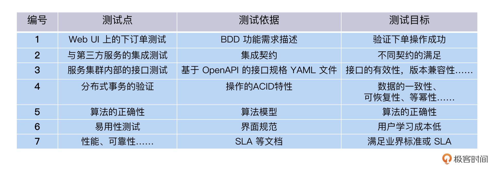
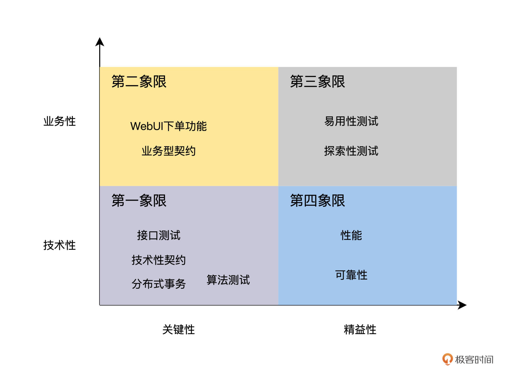
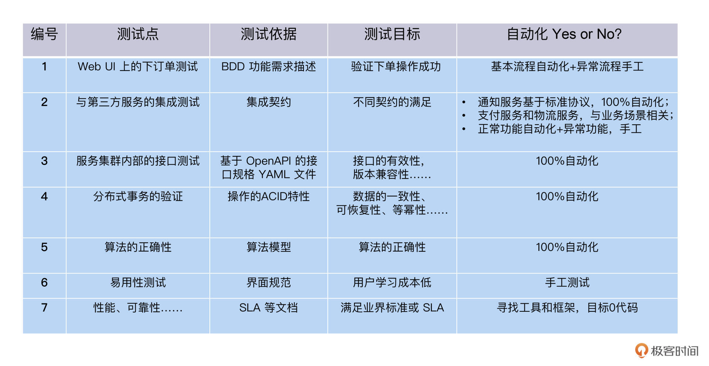
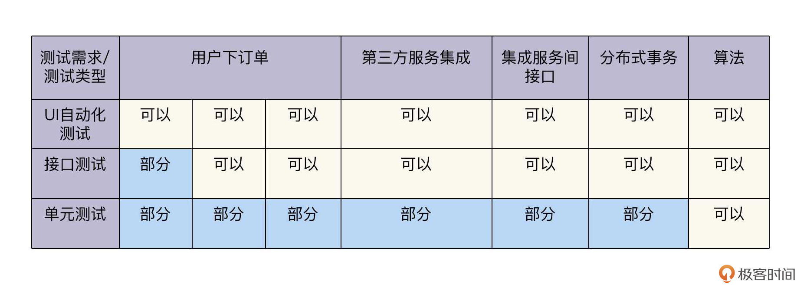
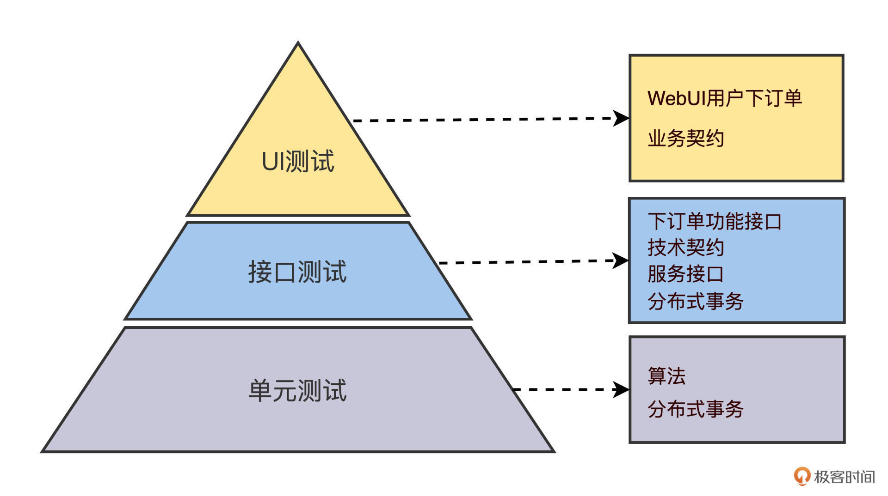
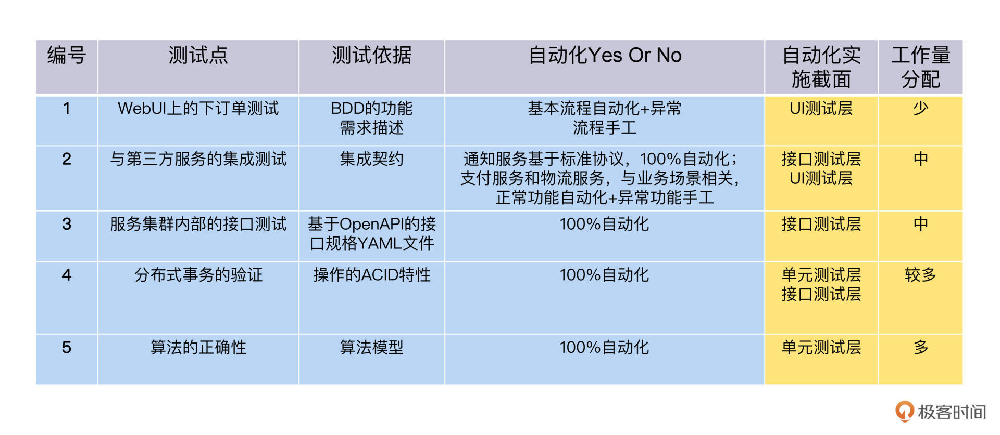
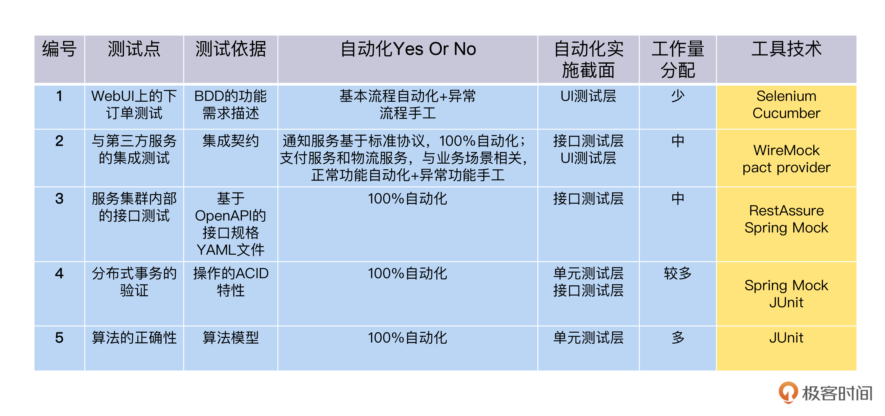
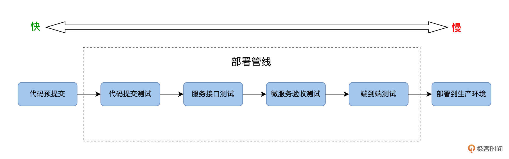
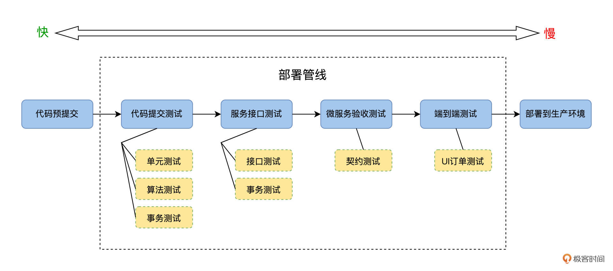
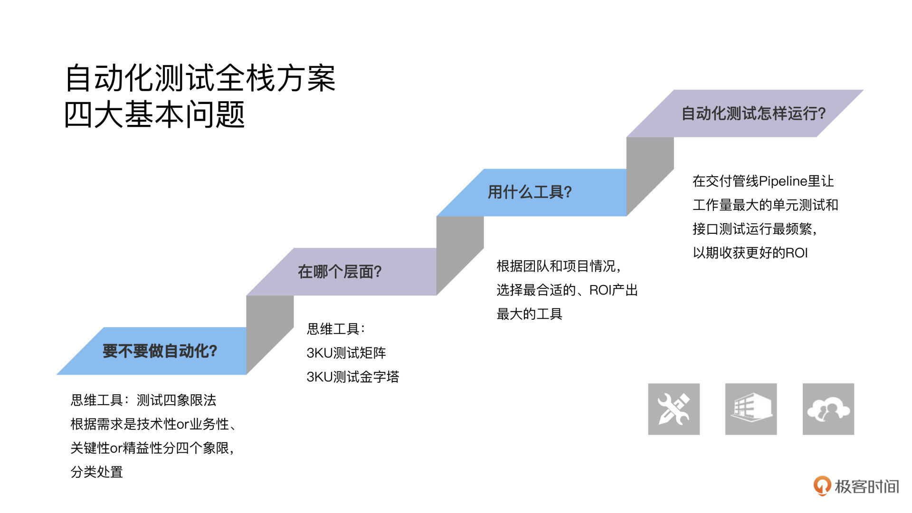

---
date: "2019-06-23"
---  
      
# 09｜3KU法则：为一个订餐系统设计全栈测试方案
你好，我是柳胜。

上一讲，我们找出了FoodCome订餐系统各截面的测试需求，今天我们就根据这些需求，完成测试设计，给这个订餐系统设计一个全栈的测试方案。我们前面讲到的很多思路和原则，都能在今天的课程里得以应用。

这个测试方案非常关键，它能回答自动化测试设计中的四大基本问题：做不做自动化？在哪里做、怎么做、怎么运行。这四个基本问题梳理清楚了，自动化测试项目就相当于有了骨架。

## FoodCome的订餐需求

我们先列出前几讲提炼的测试需求，每项需求都过一遍上面的问题清单。让我们头脑中的测试方案，形成一个文档化的列表。

结合FoodCome订餐系统的例子，我们把测试需求整理如下：

订餐系统还有很多其他的测试需求，比如兼容性、安全性等等，因为本专栏的关注点是自动化测试，我在这里就不再列出来了。

## 做不做自动化测试？

有了文档化的测试需求列表后，我们在设计自动化测试方案时，需要先想清楚，这些需求做不做自动化测试？

**测试四象限法则**能帮我们有效完成这个思考过程。这个测试四象限，是布雷·麦瑞克提出来的方法模型：根据需求的性质和等级2个维度，对测试需求进行分类。

一个维度是**测试需求的性质**，是技术性还是业务性的？通俗来说就是，如果这个需求越靠近程序员的思维，比如算法、接口、事务等等，它的技术性就越强；而越靠近用户的思维，比如工作流，场景等等，就是业务性越强。

<!-- [[[read_end]]] -->

另一个维度是**测试需求的等级**，也就是需求属于关键性的还是精益性的？你可以这样理解，关键性的需求指的是，对于用户显式而重要的需求。比方说，一个系统必须能下单，才能成为订餐系统。而精益性的需求指的是用户隐式的需求，没有直接表达出来，但也可能很重要，比如性能、可靠性等等。

好，明白了性质和等级这2个维度后，我们现在用这两个维度把测试需求列表过一遍，把它们填到象限里。

先看算法、接口、分布式事务测试，它们技术性强、也是关键需求，放在了第一象限，WebUI测试业务性强且属于关键需求，放在了第二象限，易用性测试放在第三象限，性能和可靠性放在第四象限。

针对每个象限，测试四象限法建议自动化测试实施策略如下：

* 第一象限里的测试需求是100\%全部自动化；
* 第二象限里的测试需求是自动化+手工；
* 第三象限里的测试需求是手工测试；
* 第四象限里的测试需求是通过工具和框架来执行，追求0代码。

四象限的策略你不必死记硬背，因为这些只是表象，底层逻辑还是ROI，学会了分析思路你自己也可以推导结论。

举例来说，第一象限里的算法和接口测试，因为它们验证的是关键功能，所以回归测试高，自动化测试收益就大。而技术性强，意味着这类测试不会因业务变化受太大影响，所以开发、维护的成本就低。因此，第一象限的测试需求可以100\%自动化。至于其他象限的情况，你可以自己试着推演一下，同样符合ROI的规律。

好，到这里，通过四象限法则，我们已经有了一个自动化测试Yes or No的决定。更新一下表格，加入自动化测试Yes or No一列。

这张表是我们自动化测试方案迈出的第一步。现在，我们就能根据测试需求的性质和类型，判断它的测试方式是自动化测试还是手工测试了。

## 在哪个层面做自动化测试？

确定了测试方式，我们还要进一步考虑，这些测试需求的自动化测试是应该在哪个层面实现呢？在单元测试、接口测试还是UI自动化测试？

在专栏的[第二讲](https://time.geekbang.org/column/article/497405)里，我们学习过3KU测试矩阵和3KU测试金字塔，那就可以把它们应用到FoodCome的自动化测试设计了。

排除掉前面表格里提到的手工测试项，我们把其余内容填入到3KU测试矩阵里。

按照自动化测试寻求最大ROI实施层面原则，我们把上面的表格，转换成ROI自动化测试金字塔。

在ROI自动化测试金字塔里，我们又确定了两个信息。

第一，各个需求自动化测试实现的截面，单元测试截面上测试算法和分布式事务，接口测试层面来验证技术契约、服务接口和分布式事务，UI层面做用户下订单自动化测试和部分业务契约的验证。

第二，各部分自动化测试规模的配比，按照金字塔形状，单元测试案例最多，接口测试居中，UI自动化测试案例最少。

现在，我们再次更新表格，把在哪一层做自动化，还有工作量分配的比例加进去。

好，到这里，这个表格里，我们针对每个测试需求，已经做出了自动化测试方案，包括做不做自动化测试，在什么层面做自动化测试，做多少自动化测试。

下面，我们继续完善，把这个方案想周全。

## 用什么工具做自动化测试？

选择对了工具和框架，会让自动化测试事半功倍。这个“选对”的意思，就是工具必须适合你的项目、你的团队。

在[第三讲](https://time.geekbang.org/column/article/498458)“怎么选型自动化测试工具和框架”中，我已经和你分享了怎么选择工具的方法和原则。在工作量大的单元测试和接口测试，要选择成熟和支持模块化开发的工具，比如JUnit和Restassure；在工作量较小的UI测试，工具的稳定性最重要，其次追求效率。

在这里，我直接给结果，具体列出了FoodCome各个自动化测试技术和工具，你可以想想为什么选取它们。

## 怎么运行自动化测试？

在自动化测试方案里，除了做不做自动化测试，以及在哪个层面做。我们还要考虑清楚另外一个事，就是自动化测试开发出来后，它们在什么时候运行。

在第一模块里，我们讲ROI的时候，经常提到一个自动化测试的收益，其重要因子之一就是它的运行次数。所以，设计ROI高的自动化测试的运行场景是很关键的，而软件部署管线Deployment Pipeline就是重要的自动化测试运行场景之一。

那Deployment Pipleline是怎么设计的呢？先从概念说起，在2010年，Jez Humble 出版了《持续交付》一书，这里提出了部署管线的概念：

> “部署管线是代码从开发人员的个人电脑到生产环境的自动化过程”。

为什么会叫管线呢？因为部署管线由一系列测试的阶段组成，每个阶段首尾相接，这就形成了一条流水线一样的管道。

部署管线通常是这样的：

我们把FoodCome的自动化测试任务，填充到部署管线的各个阶段里去，如下图所示：

沿着部署管线发布的方向，也就是从左向右，自动化测试的运行速度由快变慢，而ROI也是由高到低。**越靠近代码，活动越频繁，ROI就越高**，而每一个关卡都会有失败的，最后能成功到达可部署生产环境的会是很少一部分，十次代码变更能有二次到生产环境。

所以，后面测试阶段得到运行的次数比较少，相应ROI也比较低。

这样的规律对我们工作有啥帮助呢？其实不难想到，我们要尽量把自动化测试放在管线的开始端，只要它具备条件，而且够快，这也是我们在[第六讲](https://time.geekbang.org/column/article/501526)里提到的自动化测试左移实践。

## 小结

今天，我们给FoodCome订餐系统整理了一套全栈自动化测试方案。这个方案里要回答自动化测试项目的四个问题，这些问题也是测试设计最基本的问题。那就是，给定一个测试需求，我们做不做自动化？具体在哪里做、怎么做、怎么运行。

1.要不要自动化？这里我们用到了测试需求2维度4象限法，帮助我们分析每个需求的性质和等级，遵循最佳实践来确定，它们需不需要自动化。

2.在哪个层面做自动化？分配多少工作量？这里我们用到了第一模块学到的3KU测试矩阵和3KU测试金字塔，从ROI的角度来回答这些问题。

3.用什么工具做自动化？每一个层面，我们都要使用工具来帮助我们做自动化。在这里，工具不选择最好的，但要根据团队和项目情况，选择最合适的、ROI产出最大的工具。

4.自动化测试怎么运行？应该物尽其用，我们投入工作量最大的单元测试和接口测试，它们应该在交付管线Pipeline里运行次数最频繁，这样才能收获好的ROI。

回答了这些基本问题后，我们自动化测试方案的骨架也就建立起来了。在实践中，你还可以结合团队的人手、项目的时间等等因素，来填充方案的血肉，比如设定任务的优先级等等。

接下来的课程里，我们还会进入到每一个测试点，看看怎么实现，敬请期待。

## 思考题

结合你的工作实践想一想，要怎么回答自动化测试设计中这四大问题？

欢迎你在留言区跟我交流，也推荐你把这一讲分享给更多同事、朋友，说不定就能帮Ta搞定下一次的测试方案设计。