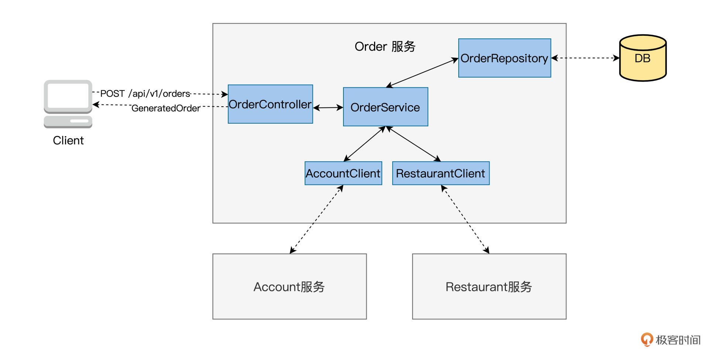
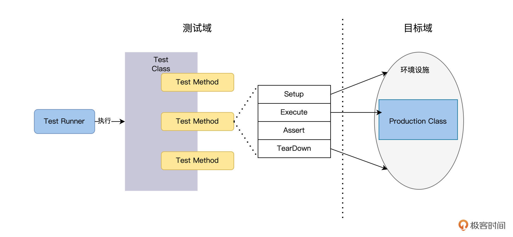
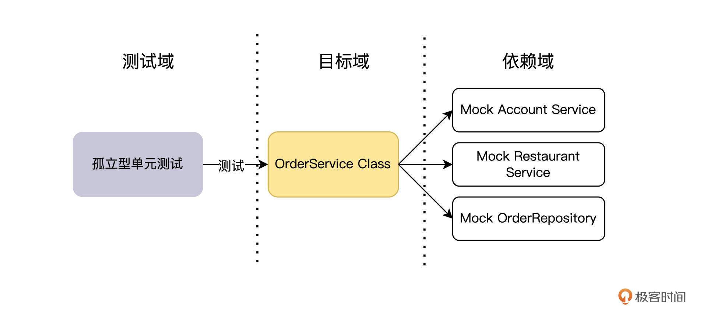
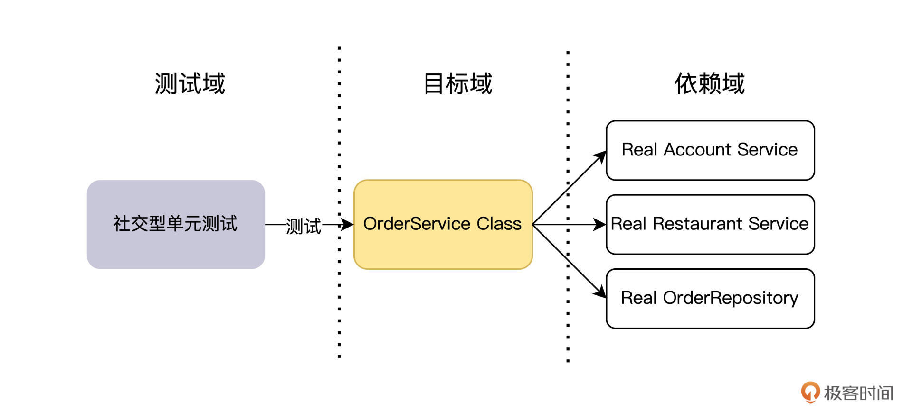
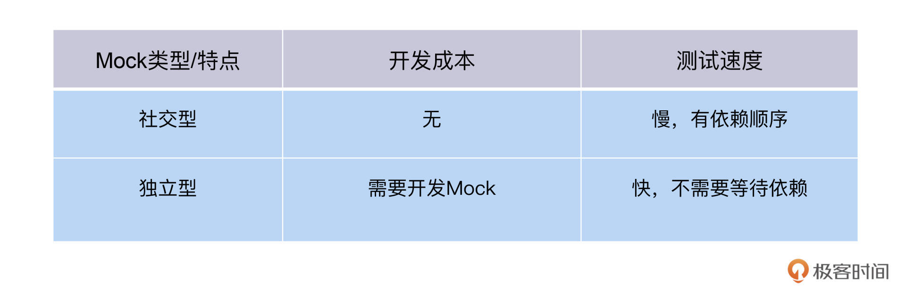
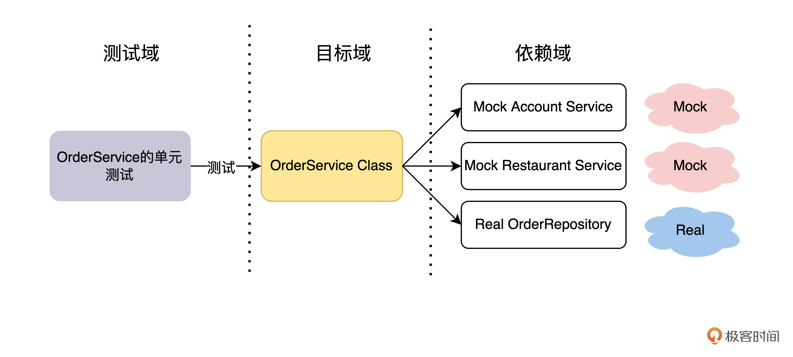
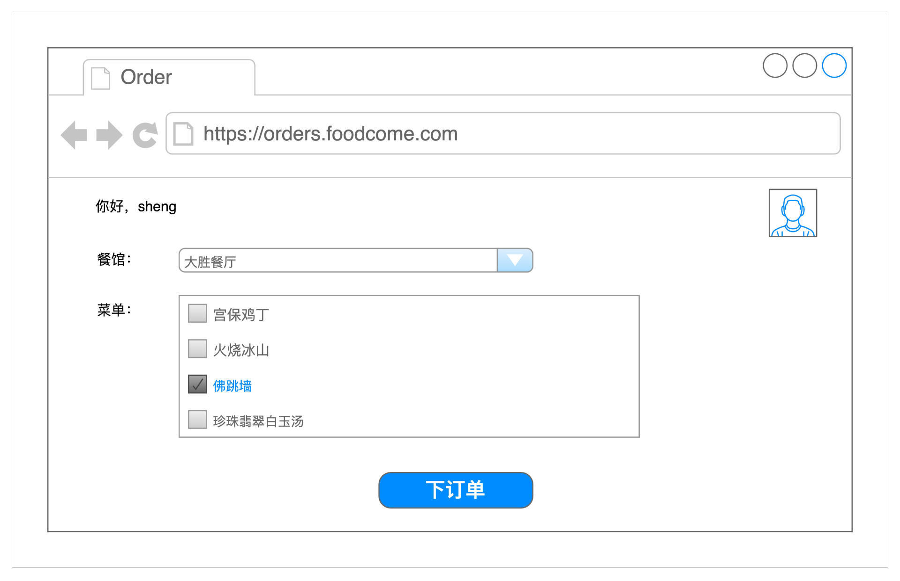
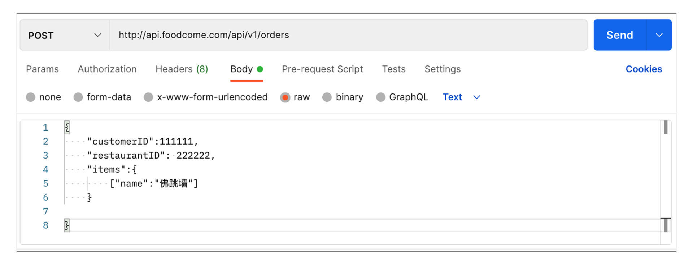
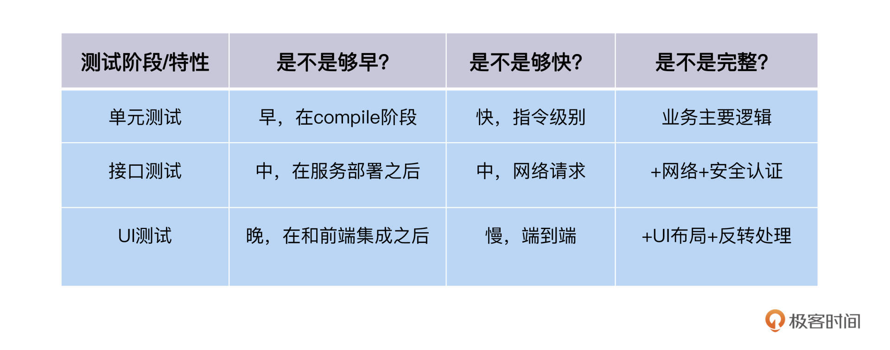

---
date: "2019-06-23"
---  
      
# 10｜单元测试（一）：原来测试可以这么高效
你好，我是柳胜。

提到单元测试，你可能第一反应是，这个不是归开发做么？作为测试的你，为什么不但要懂UI、接口测试，还要了解单元测试呢？学完今天的内容，你会有自己的答案。

先从一个常见的业务场景说起，开发同学在实现Order服务的时候，需要代码化一些业务逻辑。比如处理一个订单，要计算总价、优惠扣减、库存查验等等。

现在Order服务的开发想要测试自己写的这些代码是否预期运转，他最先想到的办法可能是，把Order服务构建完运行起来，向它发送HTTP Request “POST /api/v1/orders”, 然后检查返回的Response内容，看是不是订单已经如期生成。

这个方法当然也能达到测试目标，但是你已经学习过了3KU原则，就可以问开发人员一个问题 “同样的验证目标，能不能在ROI更高的单元测试阶段实现？”

你看，测试人员和开发人员的单元测试工作联系起来了，它们之前在实践中一直是不太交流的两个领域，现在需要相互配合，服务于测试的整体目标。

这一讲会用一个FoodCome系统里的一个Order服务的代码作为例子，帮你捋清楚单元测试能做什么，怎么做。

## 制定单元测试策略

我们先来看一下Order服务的内部结构，我画了一张Class关系图来展现内部的逻辑结构。

<!-- [[[read_end]]] -->



我们先看图里的蓝色色块，通过这五个Class就能实现Order服务。

它们是这样分工的：**OrderController**接收Client发来的"POST /api/v1/orders" request, 交传给OrderService createOrder方法处理，再把生成的订单信息封装成Response返还给Client；

**OrderService**是主要的业务逻辑类，它的createOrder完成了一个订单创建的所有工作，计算价格、优惠扣减，调用**AccountClient**做支付验证，调用**RestaurantClient**做餐馆库存查验。订单生成后，就交给OrderRepository去写DB生成订单记录。

**OrderRepository**实现了和Order自带的数据库交互，读写操作。

知道了这些，还无法马上动工写单元测试代码，我们还需要考虑清楚后面这几件事。

### 需要写多少个Test Class？

这里我需要交代一个背景知识，那就是单元测试里的“单元”是什么？

如果你问不同的开发人员，可能会得到非常不一样的答案。在过程语言里，比如C、脚本语言，单元应该就是一个函数，单元测试就是调用这个函数，验证它的输出。而面向对象语言，C++或者Java，单元是一个Production Class。

FoodCome系统是Java面向对象语言开发的，包含5个Production Class，做单元测试，我们把规则设得简单一点，**开发一个Test Class去测试一个Production Class，保持一对一的关系**。

如下图所示，一个Test Class有多个Test Method。每个Method会Setup建立Production Class的上下文环境，Execute调用Production Class的Method，Assert验证输出，TearDown销毁上下文。



### 孤立型还是社交型？

一个Test Class对应一个Production Class看起来简单明了，但理想虽然美好，现实却是复杂的。在实践中，很少有Production Class能独立运行。

我们拿出OrderSerevice这个Class的源代码看一下：

```
    public class OrderService {
      //依赖注入OrderRepository, AccountClient, RestaurantClient
      @Autowired
      private OrderRepository orderRepository;
      @Autowired
      private AccountClient accountClient;
      @Autowired
      private RestaurantClient restaurantClient;
      @Autowired
      private OrderDomainEventPublisher orderAggregateEventPublisher;
      public Order createOrder(OrderDetails orderDetails) {
      //调用restaurantClient验证餐馆是否存在
      Restaurant restaurant = restaurantRepository.findById(orderDetails.getRestaurantID())
                .orElseThrow(() 
                -> new RestaurantNotFoundException(orderDetails.getRestaurantID()));
      //调用AccountClient验证客户支付信息是否有效
      .............
      //统计订餐各个条目，根据优惠策略，得出订单价格
      float finalPrice = determineFinalPrice(orderDetails.getLineItems());
      //生成订单
      Order order = new Order(finalPrice,orderDetails);
      //写入数据库
      orderRepository.save(order);
      return order;
      }
    }
    

```

看完代码，我们发现问题了，createOrder运行时，需要调用AccountClient、RestaurantClient和OrderRepository三个Class，如果它们不工作的话，createOrder就没法测试。

在单元测试里，这3个Class叫做Order Class的Dependency，这3个Class还会有各自的依赖，以此递归。到最后你会发现，想测试Order Class，需要整个服务都要运转起来。

我打个比方，方便你理解。就像本来你只想请一个朋友来派对，结果朋友还带来了他的朋友，以此类推，你最后发现，现场坐满了你不认识的人，自己的心情完全被毁掉了。

为了解决这个问题，有两种应对方法。

第一种孤立型，我只关注我的测试目标Class，而Dependency Class一律用Mock来替代，Mock只是模仿简单的交互。相当于我给派对立下一个规矩：客人不能带客，如果需要，就带个机器人来。



另一种是社交型，我还是关注我的测试目标Class，但是Depdency Class用真实的、已经实现好的Class。这就好比，我告诉大家，你们先玩，等你们派对结束，我最后再开个只有我自己在的派对。



社交型和独立型各有优缺点。



独立型的好处是确实独立，不受依赖影响，而且速度快，但是你要花费成本来开发Mock Class。

而社交型的好处是没有任何开发成本，但是有一个测试顺序的路径依赖，先测试依赖少的Class，最后才能测试依赖最多的那个Class。

在实践中，其实没有一定谁好的说法，就看怎么做，更加快捷方便。对于OrderService Class来说，我们两种策略都用。

我们用社交型处理Dependency OrderRepository，也就是先开发测试OrderRepository Class，再测试OrderService Class，为什么呢？OrderRepository和OrderService在同一个微服务内部，由同一个开发团队甚至同一个人开发，完全不用担心依赖会造成工作阻塞。

我们用孤立型处理Dependency AccountService和Restaurant Service，自己开发Mock service，因为这涉及到跨服务的依赖。等别的团队AccountService开发完，才能开始测自己的OrderService，这样的情况我们不能接受。

最后我们得出OrderService Class的测试策略图如下：



到这里，我们已经大概捋清楚OrderService的单元测试要做哪些事了，可以分三步走。

1.开发一个OrderSerivceTest，来测试OrderService；  
2.开发出来OrderRepository，作为OrderServiceTest的真实注入对象；  
3.开发2个Mock Class：AccountClient和RestaurantClient，辅助OrderServiceTest运行。

“三步走”策略已定好，下面就撸起袖子加油干吧。

## OrderService的单元测试

回到这一讲开头的那个问题 “同样的验证目标，能不能在ROI更高的单元测试阶段实现？”

### 这个TestCase能不能在单元测试阶段做？

OrderService是Order服务里业务逻辑最多的Class，因为它包办了创建订单的所有工作。所以测试创建订单可以粗略和测试OrderService划等号，那我们来研究一下OrderServiceTest怎么写。

我们需要创建一个名为OrderServiceTest的Class，在这个Test Class里，完成对OrderService对象的组装，它依赖的三个Class，通过构造函数的方式注入到OrderService对象里。

```
    public class OrderServiceTest {
      //声明test需要用到的对象
      private OrderService orderService;
      private OrderRepository orderRepository;
      private AccountClient accountClient;
      private RestaurantClient restaurantClient;
      @Before
      public void setup() {
        orderRepository = new OrderRespistory();  
        //mock restaurantClient对象                    
        restaurantClient = mock(RestaurantClient.class);
        //mock accountClient对象
        accountClient = mock(AccountClient.class);
        //组装被测orderSerivce对象
        orderService = new OrderService(orderRepository, restaurantClient，accountClient);
      }
      @Test
      public void shouldCreateOrder() {
        //组装订单内容
        OrderDetails orderDetails = OderDetails.builder()
            .customerID(customerID)
            .restaurantID(restaurantID)
            .addItem(CHICKEN)
            .addItem(BEEF)
            .build();
        Order order = orderService.createOrder(orderDetails);
        //验证order是否在数据库里创建成功
        verify(orderRepository).save(same(order));                             
      }
    }
    

```

上面的测试代码基于Junit规范实现，为了帮你理解测试的主要逻辑，省去了一些关联度不高的代码。

OrderServiceTest运行时，会创建一个OrderService对象。我们先构造出订单内容OrderDetails，把它作为参数传递到createOrder的方法里。createOrder方法运行结束之后，预期结果是在数据库里生成一条订单记录。

这个下订单的TestCase如果通过UI来测，你需要打开页面手工、登录、输入订单信息、点击下订单按钮。内容如下：



下订单TestCase如果通过接口来测，你需要生成订单内容数据，然后发送一个POST请求到“/api/v1/orders”，内容如下：



那我们来对比一下，同一个TestCase，在单元、接口和UI上运行的效果如何？



单元测试能覆盖下订单功能的大部分业务逻辑，而且又早又快，是非常理想的自动化测试实施截面。这再次验证了在[第二讲](https://time.geekbang.org/column/article/497405)我们学过的3KU测试金字塔：“单元测试是ROI最高的自动化测试，自动化案例应该最多。”

### 提高单元测试ROI

既然单元测试又好又快，那么我们不妨把一些费力气的测试工作挪到这一层。哪些测试比较麻烦呢？

线上购物的场景就很典型，你在网购时一定用过优惠券，这些优惠券的使用条件十分复杂：要知道在什么时间、什么商品会有多大折扣，而且优惠券还存在叠加使用的情况，又有了各种规则，能把人搞晕。但用户可以晕，平台却不能晕，用了优惠券，最终结果还要非常精准地保证盈利，不能亏。

要是在UI层面测试优惠券，你需要重复运行大量的测试数据，来产生不同的优惠条件，这个代价是高昂的。

放在单元测试里，这个TestCase就好理解了。负责价格计算的是OrderService里的determineFinalPrice方法，在determineFinalPrice里需要考虑和计算各种优惠条件和规则，再输出一个最终价格。

因此，优惠券在单元测试里，就转换成了对determineFinalPrice方法的测试。

怎么测试这个方法呢？ 我们要构建多组OrderDetails数据，传到determineFinalPrice方法里去。这时，我们用JUnit测试框架里的DataProvider来完成这个工作：

```
    @DataProvider
    public static Object[][] OrderDetails() {
       return new Object[][]{
          {1111,2222,"佛跳墙"},
          {1112,2223, "珍珠翡翠白玉汤"}
       };
    }
    
    @DataProvider("OrderDetails")
    @Test
      public void shouldCreateOrder(OrderDetails orderDetails) {
        Order order = orderService.createOrder(orderDetails);
        //验证order是否在数据库里创建成功
        verify(orderRepository).save(same(order));                             
      }
    

```

对照代码可以看到，Test方法上加了一个注解\@DataProvider，指定了Test方法的入口参数是来自于一个名为OrderDetails的数据源。OrderDetails是一个二维数组，存储了多条OrderDetails数据，有多少条数据，就会运行多少次Test方法。

这样，我们就不需要在UI上重复提交表单来做测试了，这个工作交给单元测试来做，在几毫秒内就完成上千条测试数据的测试了。Oh Yeah，原来单元测试可以这么Cool！

等从激动中缓过神来，你可能还发现了一个问题，不对？上面的Test方法好像没有验证输出的价格呀？

没错，这里有一个困难，determineFinalPrice方法实际上是实现了一个价格计算的算法，它会根据输入计算输出一个数值，算法怎么测？怎么验证它的输出是对的，还是错的？

这个领域业界的做法很不一样，有的会在测试代码里把算法又实现了一遍，然后得出一个数值作为预期值，跟开发代码算出来的数值做比对。

这种做法其实是错误的，**因为测试代码里加入了被测单元的实现细节（算法逻辑）**，你本来想验证产品线生产的产品A是不是合格，但你采用办法是让产品线再生产一个产品B，来比对A和B，这样验证没有意义，因为如果产品线本身就是有问题的，A和B都会是错的。

业界给这样的测试起了一个名，叫“领域知识泄漏”，你可以搜索一下“Domain Knowledge Leakage”，会发现各种各样的测试方法错误。

正确的做法是，你应该只关注产品A的合格标准，用标准来检查A就可以了。

在我们的情景里，很简单，把determineFinalPrice的输入参数和输出参数都写出来，作为常量。只要输入一个x1,x2,x3, 那就会得到y，然后就用x1,x2,x3,y这一组数据来测试determineFinalPrice方法就可以。

现在你可以思考一下，上面的代码应该怎么变动？相信你可以解决这个问题，也欢迎你在留言区晒一下你的“作业”。

## **小结**

当今，业界一般都会把单元测试划到开发领域，接口测试和UI测试划到测试领域，这让两个领域很少交流。对于测试整体来说，这就存在着重叠和资源浪费。

做自动化测试的你，其实应该了解单元测试能做什么，都做了什么，甚至你应该设计好测试案例，让开发人员去实现。因为你是自动化测试的Owner和架构师，你应该对整体效益负责。

单元测试里很多内容：框架的接口、Mock的开发、Assert语句的使用等等，一本书都讲不完。今天我们通过FoodCome的代码里的一个OrderServiceTest的实现，学习了单元测试策略，以一个测试整体的视角来观察单元测试能做什么，在整个测试方案里的功能作用。

通过这一讲，你可以直观感受到，单元测试的ROI又高，速度又快。但在现实中，这是测试人员的一块短板，也是相对陌生的领域。所以，我[下一讲](https://time.geekbang.org/column/article/506638)还会继续单元测试的话题，谈谈怎样推动单元测试的“可测试性”，敬请期待。

## 思考题

去了解一下你开发团队里有没有做单元测试，有的话都做了什么。

欢迎你在留言区和我交流互动，也推荐你把这一讲分享给更多同事、朋友，说不定就能通过单元测试来解放双手，提高工作效率啦。