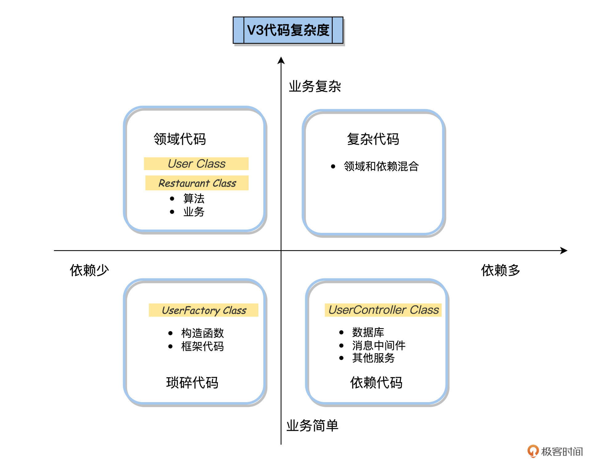

---
date: "2019-06-23"
---  
      
# 11｜单元测试（二）：四象限法让你的单测火力全开
你好，我是柳胜。

上一讲，我们写了OrderServiceTest测试类，来测试FoodCome的OrderService类。这样不管开发代码还是测试代码，都是简单清楚的。这是因为FoodCome的开发人员对代码有一个好的设计，实现了Controller、Service、Repository等Class的职能划分，OrderService类里专注订单管理，我们写出的OrderServiceTest才能集中火力测试。

但是好的设计不是天上掉下来的，有的团队在刚一开始写的代码结构性并不好，这有可能是项目的问题，需求不明确、赶进度，也有可能是开发人员的技术功底不扎实、抽象能力不够。所以，在软件生命周期内，需要持续重构，才能打磨出好的设计。

今天我们就用一个例子，来看看好的代码设计是怎么打磨出来的，而且，我们要从测试的角度来评估设计的效果，那就是单元测试容易写、覆盖率高、干净易懂，这又叫代码可测试性。

作为自动化测试架构师，你需要掌握观察和评估代码可测试性的能力，有能力推动你的开发团队做好代码设计，走向单元测试。

## 从一个需求说起

有一天，老板给FoodCome订餐系统提了一个需求，希望用户在页面上可以修改自己的邮箱地址。

<!-- [[[read_end]]] -->


这个修改行为后端实现起来似乎很简单，修改邮箱就是更新数据库里的用户信息。但在FoodCome平台上有一个业务逻辑，邮箱地址域名如果是\@foodcome.com，这说明是平台上注册的餐馆商家，否则，就是普通顾客。

这样，我们就需要在用户修改邮箱的时候，加入一个判断，如果邮箱地址的修改是从普通域到\@FoodCome域，商家在平台里的数量就+1，否则，就-1。

这个需求看起来很简单，是吧。但是我要告诉你，即使这么简单的逻辑，也需要做好设计，否则，写出来的代码可能完全无法单元测试，不信就来看看吧。

## 版本V1

既然老板提了需求，自然要赶紧完成。开发人员小胜同学立刻在下班前完成了一个版本，新建了一个User类，在User类里有一个changeEmail的方法，负责修改邮箱地址。这是第一版代码**User.java**下的内容：

```
    public class User
    {
        public int UserId { get; private set; }
        public string Email { get; private set; }
        public UserType Type { get; private set; }
    
        public void ChangeEmail(int userId, string newEmail)
        {
            //查询出来用户的ID，email和type
            object[] data = Database.GetUserById(userId);             
            UserId = userId;
            Email = (string)data[1];
            Type = (UserType)data[2];
            //如果和修改前的email相同，直接返回
            if (Email == newEmail)
                return;
            //从数据库里获得商家的数量
            int numberOfRestaurtants = Database.GetRestaurant();
            //判断用户要修改的类型是商家还是顾客
            string emailDomain = newEmail.Split('@')[1];
            bool isEmailRestaurant = emailDomain == "foodcome.com";
            UserType newType = isEmailRestaurant                       
                ? UserType.Restaurant                                   
                : UserType.Customer;                                  
            //如果是修改成为商家，那么商家数量+1，如果是修改为顾客，商家数量-1  
            if (Type != newType)
            {
                int delta = newType == UserType.Restaurant ? 1 : -1;
                int newNumber = numberOfRestaurtants + delta;
                Database.SaveRestaurant(newNumber);   
                MessageBus.SendEmailChangedMessage(UserId, newEmail);                     
            }
            //提交用户信息修改，入库
            Database.SaveUser(this);                                  
               
        }
    }
    public enum UserType
    {
        Restaurant = 1,
        Employee = 2
    }
    

```

上面的代码并不复杂，主要功能是判断邮件地址是否为FoodCome，然后更新数据库，发送通知到消息总线上。

那它的可测试性怎么样呢？

我们引入一个代码复杂度四象限法则来完成这个评估，它的原理是，用以下2个维度来评估代码：

1.领域复杂度，代码的领域复杂度越高，里面的业务逻辑就越多。  
2.对外依赖度，依赖度越高，说明代码和外部的Class交互点多。

每个维度都有高低，2个维度的高低组合在一起就成了四个象限。

1.业务复杂、依赖又少，是业务逻辑集中的代码。比如业务算法。  
2.业务简单、依赖又少，是一些简单代码，比如构造函数，数据对象等。  
3.业务复杂、依赖多，是复杂度高的代码，测试起来也会比较困难。  
4.业务简单、依赖多，是管理依赖的代码。比如消息总线。


我们要把开发的代码放到四个象限里，每个象限对应不同的测试策略。那小胜同学的User Class，应该放到哪个象限呢？

User Class里包含了changeEmail的业务逻辑，就是根据Email的地址决定如何变更Restaurant的数量。同时，User Class里还有2个外部依赖：Database和MessageBus，这个依赖还是隐式的，没有声明在成员变量里，你得看代码才能找到2个外部依赖是怎么使用的。

显然，User class属于领域和依赖混合的代码，应该归属于**复杂代码**象限。

那么在这种情况下，怎么测试User Class呢？

为了调用changeEmail方法，你可能会想到Mock Database和MessageBus两个对象，但难点是，根本没有办法把Mock对象传递changeEmail方法里去。

所以，现在我们是没有办法单元测试User Class的，它的可测试性为0。

因此，小胜同学需要重构代码，把**复杂代码**象限的代码分解到**领域代码**象限和**依赖代码**象限。


## 版本V2

下面来到第二个版本，小胜将业务逻辑和与外部依赖的交互分离，创建了一个新的UserController Class来专注管理外部依赖。

**UserController.java**的代码如下：

```
    public class UserController
    {
        //在controller里声明两个外部依赖
        private readonly Database _database = new Database();
        private readonly MessageBus _messageBus = new MessageBus();
        //changeEmail方法里调用依赖
        public void ChangeEmail(int userId, string newEmail)
        {
            object[] data = _database.GetUserById(userId);
            string email = (string)data[1];
            UserType type = (UserType)data[2];
            var user = new User(userId, email, type);
    
            int numberOfRestaurants = _database.GetRestauruant();
            string companyDomainName = "foodcome.com";
            //调用User的changeEmail，返回变化的商家数量。
            int newNumberOfRestaurants = user.ChangeEmail(
                newEmail, companyDomainName, numberOfRestaurants);
            //调用依赖，变更数据库和发布消息
            if(newNumberOfRestaurants!=numberOfRestaurants){
              _database.SaveCompany(newNumberOfRestaurants);
              _database.SaveUser(user);
              _messageBus.SendEmailChangedMessage(userId, newEmail);
            }
        }
    }
    

```

同时我们要修改User Class，它不负责任何依赖，只关注changeEmail的业务逻辑，根据输入参数，算出来新的商家的数量。

**User.java**的代码如下：

```
    public class User
    {
        public int ChangeEmail(string newEmail,
        string companyDomainName, int numberOfRestaurants)
       {
        if (Email == newEmail)
            return numberOfRestaurants;
    
        string emailDomain = newEmail.Split('@')[1];
        bool isEmailCorporate = emailDomain == companyDomainName;
        UserType newType = isEmailCorporate
            ? UserType.Restaurant
            : UserType.Customer;
        if (Type != newType)
        {
            int delta = newType == UserType.Employee ? 1 : -1;
            int newNumber = numberOfRestaurants + delta;
            numberOfRestaurants = newNumber;
        }
        return numberOfRestaurants;
      }
    }
    

```

我们发现，相比版本1 ，版本2有了进步，多了UserController Class来专门负责管理外部交互，隐式依赖的Database和MessageBus变成了显式成员变量。User class专门负责业务逻辑，判断为餐馆还是客户。

我们再用复杂度四象限来观察现在的代码，它的分布情况变为下图这样。

可以看到，复杂代码消失了，原先一个User.java文件里的逻辑被分散到了两个文件里，一个是UserController.java，它专注于管理依赖，位于依赖代码象限；还有修改后的User.java，专注于业务逻辑实现，位于领域代码象限。


现在可以测试了！

User Class只有一个changeEmail的方法，方法里只是对邮件地址做判断，并计算新的餐馆数量，将新值返回，不会涉及到操作数据库和消息总线。User Class可以测试了，因为不需要做任何Mock，我叫它**简单测试**。

而2个外部依赖Database和MessageBus都被显式地封装在UserController Class里，我们可以通过构造函数来传递Mock对象，UserController也是可以测试的，我叫它**Mock测试**。

但是，版本2依旧不够清爽，还存在两个问题。

1.  UserController里实例化了User class，这包含了业务逻辑（如何构造一个User对象），而我们希望UserController更为纯粹，专注依赖管理；

2.  User class和Restaurant数据也存在耦合，通过User Class的ChangeEmail函数返回了Restaurant的newNumofRestaurant，这和User的行为模型毫无关系。

好，撸起袖子加油干，我们来完成第三个版本，一次性解决上面提到的问题。

## 版本V3

首先，使用UserFactory模式封装User实例化逻辑，如下：

```
    public class UserFactory
    {
        public static User Create(object[] data)
        {
            Precondition.Requires(data.Length >= 3);
            int id = (int)data[0];
            string email = (string)data[1];
            UserType type = (UserType)data[2];
    
            return new User(id, email, type);
        }
    }
    

```

可以看到UserFactory也是可以简单测试的✌️！这是阶段性胜利，可喜可贺。

然后，我们常见一个Restaurant Class用来封装关于Restaurant的业务逻辑，如下：

```
    public class Restaurant
    {
        public string DomainName { get; private set; }
        public int NumberOfRestaurant { get; private set; }
    
        public void ChangeNumberOfRestaurants(int delta)
        {
            Precondition.Requires(NumberOfRestaurants + delta >= 0);
            NumberOfRestaurants += delta;
        }
        public bool IsEmailCorporate(string email)
        {
            string emailDomain = email.Split('@')[1];
            return emailDomain == DomainName;
        }
    }
    

```

Restaurant Class也是可以简单测试的！

参考UserFactory的思路，再做一个RestaurantFactory，专门做Restaurant对象的构建，此处省略代码，实现起来其实并不复杂，有兴趣你可以自己写写看。

而UserController更关注与外部依赖的管理和交互，如下：

```
    public class UserController
    {
        private readonly Database _database = new Database();
        private readonly MessageBus _messageBus = new MessageBus();
    
        public void ChangeEmail(int userId, string newEmail)
        {
            object[] userData = _database.GetUserById(userId);
            User user = UserFactory.Create(userData);
    
            object[] restaurantData = _database.GetRestaurant();
            Restaurant restaurant = RestaurantFactory.Create(restaurantData);
            user.ChangeEmail(newEmail, restaurant);
            
            _database.SaveUser(user);
            //如果restaurant数量有变化，就写数据库，发送通知信息
            if(restaurant.numberChanged()){
              _database.SaveRestaurant(restaurant);
              _messageBus.SendEmailChangedMessage(userId, newEmail);
             }
        }
    }
    

```

UserController Class里没有业务逻辑，只有Database和MessageBus的管理和操作。在单元测试时，只需要用Mock替代，就OK了！UserController是可以轻松Mock测试的！

经过前面的操作，User Class变化如下：

```
    public class User
    {
        public int UserId { get; private set; }
        public string Email { get; private set; }
        public UserType Type { get; private set; }
    
        public void ChangeEmail(string newEmail, Restaurant restaurant)
        {
            if (Email == newEmail)
                return;
    
            UserType newType = company.IsEmailCorporate(newEmail)
                ? UserType.Employee
                : UserType.Customer;
    
            if (Type != newType)
            {
                int delta = newType == UserType.Employee ? 1 : -1;
                restaurant.ChangeNumberOfRestaurants(delta);
            }
        }
    }
    

```

Oh Yeah, User Class是可以简单测试的！

现在我们再来看一下V3版本代码在复杂度四象限的位置，变成了这样：



经过3个版本后，我们把代码重构完，复杂代码完全被消解掉了，分解到了其他3个象限。

现在，我们就可以为不同象限的代码，制定好单元测试策略和优先级了。我特意准备了一张总结表放在了后面。


有了这张表，你就可以使用[上一讲](https://time.geekbang.org/column/article/505695)提到的测试方法来做业务逻辑测试和Mock测试了！

## 小结

向着提高代码可测试性的目标，复杂代码经过一步步的重构，被分解到了依赖管理和业务逻辑两个领域，如果也算上数据库代码的话，正好和软件架构的MVC模式一致。这不是凑巧，这恰恰说明好的代码结构等同于单元测试高覆盖率。如果你的项目，单元测试做不下去，测试覆盖率提不上来，那应该重构代码了。

反之也一样，如果开发人员声称做了非常好的设计，那么我们通过单元测试，就应该能直观感受到这个好的设计。期待今天这讲内容成为你开启开发领域大门的一把钥匙。


另外，结合今天的三个版本的代码例子，你也应该发现了，单元测试并不是眉毛胡子一把抓。

首先，你应该关注业务逻辑能否在单元测试里充分测试，这是跟我们自动化测试高度关联的地方。而Mock的目标，则是辅助业务逻辑能够更早更快地测试。以后，当开发人员骄傲地跟你说：“代码行覆盖率达到80\%”的时候，你应该和他一起检查下，他到底测了什么。

单元测试看起来已经是个完美的测试方案了，那在单元测试层面还有什么做不到的事么，下一讲我们就来揭晓答案。

## 思考题

制定单元测试覆盖率100\%的目标有价值么？如果让你制定目标，你会怎么做？

欢迎你在留言区跟我交流互动，也推荐你把这讲内容分享给更多同事、朋友。