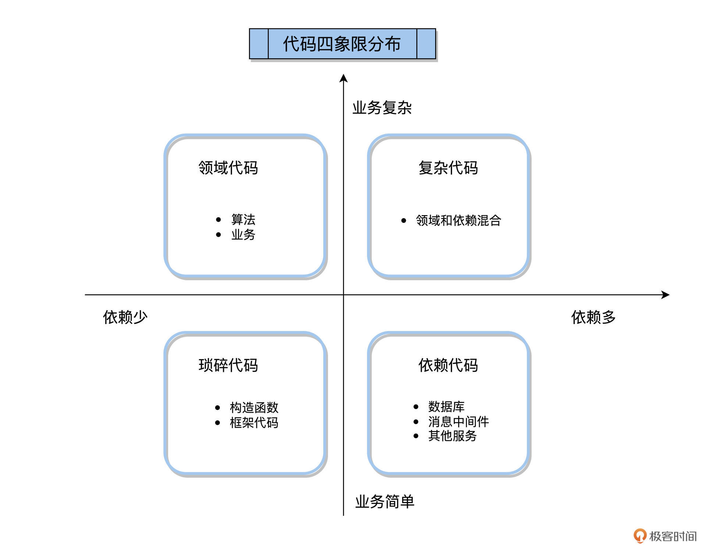
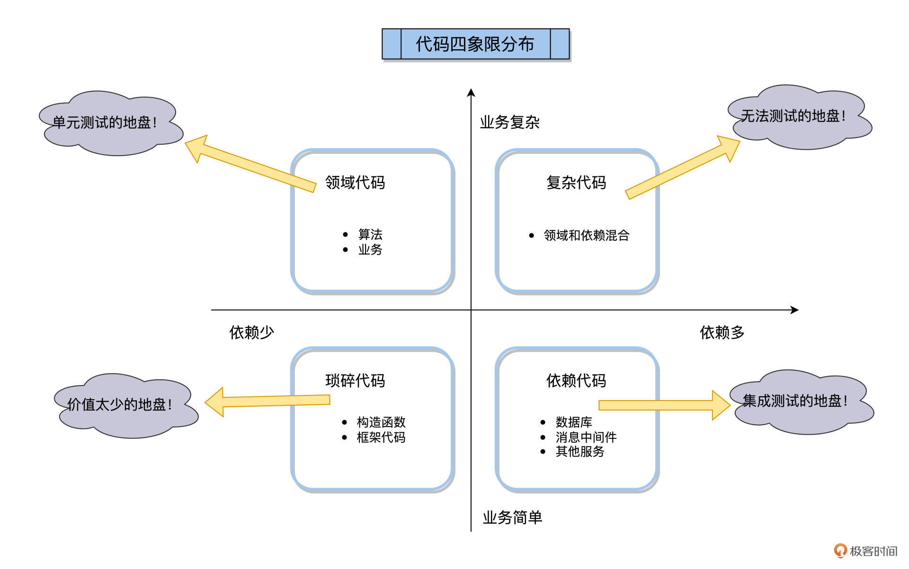
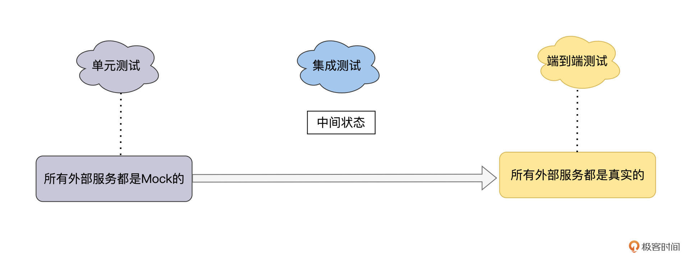
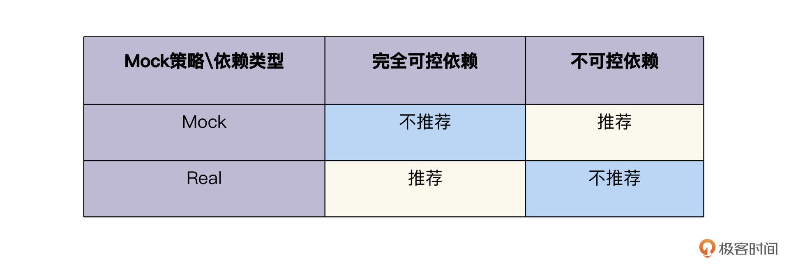
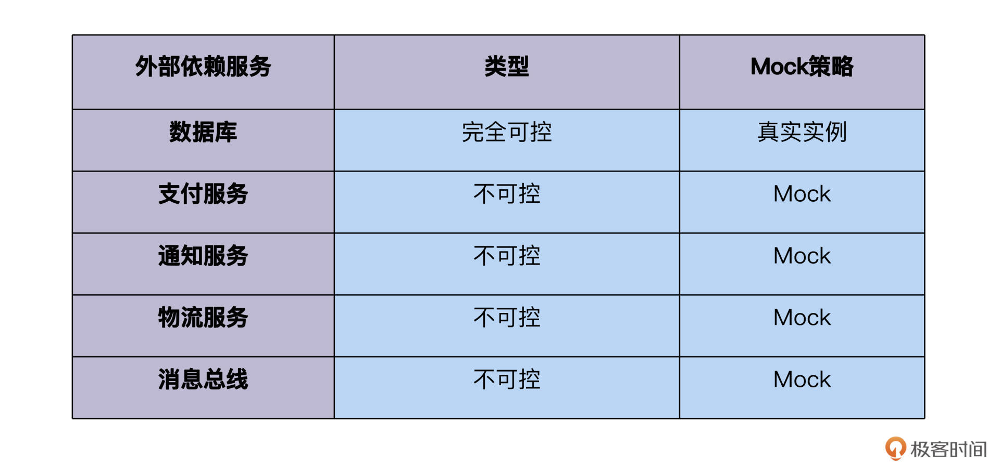

---
date: "2019-06-23"
---  
      
# 12｜集成测试（一）：一条Happy Path扫天下
你好，我是柳胜。

上一讲，我们学习了单元测试，在验证业务逻辑方面，它的优势在于速度又快，阶段又早。既然单元测试看起来是一个完美的自动化测试方案，那为什么还需要集成测试呢？

我在[第二讲](https://time.geekbang.org/column/article/497405)的3KU原则说过，测试需求首先要找ROI最高的截面来验证。在金字塔模型里，ROI最高的就是单元测试，如果无法实现，才回退到ROI第二高的截面，一直到ROI最低的端到端测试。

那集成测试存在的价值，一定是做得了单元测试层面做不到的事，否则，集成测试这个概念就没必要存在。那这些事具体有哪些呢？你要是能找到这些事，就找到了集成测试省力又见效的窍门。今天咱们就一起寻找这个答案。

## 集成测试和单元测试

上一讲我们学过了代码四象限法则，产品的代码按照业务相关性和依赖程度，可以划分到下面四个象限里。



那集成测试和单元测试分别应该归到第几象限呢？

集成测试，顾名思义，是验证本服务代码和其他进程的服务能不能一起配合工作。在上面的四象限里，集成测试的活动领域就在“依赖代码”象限，而单元测试的活动领域是在“领域代码”象限。

我再用图解的方式划分一下地盘，你会看得更清楚。



这张图里的信息量很大，展示了单元测试和集成测试的各自战场，我来跟你细说一下。

单元测试掌管领域代码的测试，这些领域代码只是负责数据计算，并不会触及外部依赖。像上一讲的changeEmail方法，只是计算出一个新的餐馆数目，单元测试只需要验证这个计算逻辑是否正确就好了。

<!-- [[[read_end]]] -->

那什么是单元测试测不了的呢？ 那就是依赖代码。在FoodCome的代码设计里，这些外部的依赖管理交给一个独立的Controller Class去做，它负责读写数据库、发送消息等等。这块就是集成测试的领域。

看到这里，你脑袋里可能会冒出这样一个问题：不对呀！单元测试也可以测试外部依赖，我们在前面讲过可以Mock外部依赖，如果我把Database、MessageBus都Mock了，那不就也可以做单元测试了么？

你能想到这一层，说明你已经关注概念背后真正的事情了。是的，如果所有的外部服务都Mock了，集成测试就变成了单元测试，往另外一个方向，如果所有的外部服务都是真实的，集成测试又变成了端到端的测试。**集成测试就是处在单元测试和端到端测试中间的一个状态。**



在这里，我们要关注**Mock和Real的优劣势，集成测试怎么能做得更聪明一些，用最少的工作量，获得最大的测试效果**。下面我们就展开来说一说。

## 集成测试测什么？

相比单元测试，集成测试有2个特点。

第一，集成测试运行速度慢，这个时间主要花在2个地方，第一个是准备集成测试环境的时间，你要先把依赖的外部服务启动起来，让环境处在一个健康状态；第二个是运行集成测试的时间，因为集成测试不像单元测试是进程内工作，它是跨进程通讯，除了计算时间，还要加上网络通讯时间等等。

第二，执行集成测试，要运行的代码量比单元测试要多。因为它走过的路径更长，从网络请求，到处理请求，再到网络返回结果，中间需要经历过n个代码单元，还有框架代码，库代码等等。

这两个特征告诉我们，集成测试是有比较大的成本的，并且它测试的代码逻辑和单元测试是有重叠的。

本着追求整体最大ROI效益的目标，集成测试和单元测试需要协同作战，保持一个平衡，这个平衡的原则是：

1.在单元测试阶段验证尽可能多的业务逻辑，这样能让集成测试关注在外部依赖上。

2.集成测试至少覆盖一条长路径案例，叫“Happy Path”。

### 怎么挑选Happy Path

Happy Path是指一条正常业务的测试案例，走尽可能多的外部依赖服务。比如，一条案例，同时走了Database和MessageBus。

针对[上一讲](https://time.geekbang.org/column/article/506638)提到的用户修改邮箱功能，我们有几个案例：

1.修改邮箱名从 a\@foodcome.com到b\@foodcome.com  
2.修改邮箱名从 a\@example.com到a\@foodcome.com  
3.修改邮箱名从 a\@example.com到b\@example.com

哪个案例是Happy Path呢？再回头看一下代码：

```
    public class UserController
    {
       .............
        public void ChangeEmail(int userId, string newEmail)
        {
            .....................
            user.ChangeEmail(newEmail, restaurant);
            _database.SaveUser(user);
            //如果restaurant数量有变化，就写数据库，发送通知信息
            if(restaurant.numberChanged()){
              _database.SaveRestaurant(restaurant);
              _messageBus.SendEmailChangedMessage(userId, newEmail);
             }
        }
    }
    

```

我们不难发现案例2符合Happy Path，因为它触发了多次与2个外部依赖的交互，更新了Databse的用户信息和餐馆信息，还触发了消息总线发送一条通知出去。

你可能还想到一个疑问，如果我们找不到一个能触发全部外部依赖交互点的Happy Path，那怎么办？很简单，那就再加一条Happy Path。

## 集成测试用Mock还是Real测试？

集成测试领域一个有争议的话题，就是外部依赖是用Mock还是用真实的实例。在前面我们讲单元测试是“孤立型”还是“社交型”的时候，提到了Mock和Real两种方法都有优劣，都有适用的场景（可以回看[第十讲](https://time.geekbang.org/column/article/505695)）。

今天我们详细说说，选择Mock还是Real的方法。

首先要看外部依赖的特征，我把它划分成2种类型。

1.完全可控依赖  
2.不可控依赖

什么是完全可控依赖呢？ 这个外部的服务被你的应用独享，你也能够控制它的开发和运维，那这个服务就是完全可控依赖的。一个典型的例子，就是数据库，在微服务模式下，每一个服务独享一个自己的数据库Schema。

那什么又是不可控依赖？与可控依赖相反，这个外部的服务不止你的应用调用，大家都得遵守一个协议或规范，和这个公共的外部服务交互。典型的例子，就是外部的支付系统，SMTP邮件通知服务等等。

与这两种类型相对应的Mock策略如下：



为什么是这样的？ 完全可控依赖的服务，虽然是在你的应用之外的一个进程，但你可以把跟它的交互当作是你开发的内部实现。你可以升级数据库版本、修改表格结构、增加数据库函数，只要跟着应用的代码一起修改即可。

这种情况下，你可以把这个数据库和你的应用当作一个整体，没必要花力气做Mock，如果你脑子一抽做了Mock，就还要维护Mock的变化，恭喜进坑。

而不可控依赖服务就不一样了，它是公共的，你控制不了它，而且你跟它的交互还要遵守一个规范的契约。在这种情况下，做Mock就划算了，原因有二：**第一，基于契约的Mock的维护成本比较低；第二，使用Mock可以保证你的应用持续重构，向后兼容**。

分析到这，我们就能梳理出FoodCome的Mock策略了。



## 集成测试的实现

找出了Happy Path，也定了Mock策略后，就可以动手写代码了。

根据2号案例，我们来创建一个测试方法，方法名为change\_email\_from\_example\_to\_foodcome：

```
    [Fact]
    public void Changing_email_from_example_to_foodcome()
    {
        // Arrange
        var db = new Database(ConnectionString);                          
        User user = CreateUser(                                           
            "a@example.com", UserType.customer, db);                                              
        var messageBusMock = new Mock<IMessageBus>();                     
        var sut = new UserController(db, messageBusMock.Object);
        // 调用changeEmail方法
        string result = sut.ChangeEmail(user.UserId, "b@foodcome.com");
        // 校验返回
        Assert.Equal("OK", result);
        // 校验数据库里字段
        object[] userData = db.GetUserById(user.UserId);                 
        User userFromDb = UserFactory.Create(userData);                  
        Assert.Equal("b@foodcome.com", userFromDb.Email);                 
        Assert.Equal(UserType.Restaurant, userFromDb.Type);                
            messageBusMock.Verify(                                           
            x => x.SendEmailChangedMessage(                              
                user.UserId, "b@foodcome.com"),                           
            Times.Once);                                                 
    }
    

```

上面的代码完成了以下步骤，我特意分点列出来，方便你看清楚每一步。

1.创建真实的数据库连接对象；  
2.创建MessageBus的Mock对象；  
3.把2个依赖注入到被测UserController class里，调用changeEmail方法；  
4.检验数据库里的User状态；  
5.检验Mock的MessageBus里的消息。

## 小结

今天我们学习了和外部服务的集成测试的方法，在动手之前，我们要想明白测什么，用什么测，Mock还是Real。

测什么，怎么测，这就是集成测试方案要回答的问题，而且，这个方案的制定遵循3KU原则，也就是尽量不做重复的事，把精力和时间花在有价值的地方。

单元测试需要做好业务逻辑的验证，集成测试主要是测试与外部依赖的集成，集成又有2种策略，采用Mock还是Real真实的依赖，应该遵循**能Real就Real的原则，不能Real的再采用Mock**，如果一股脑Mock所有依赖，你会发现集成测试没测到什么有用的逻辑，都在Mock上，而真正集成时还是会遇到问题。

在集成测试案例的设计上，我提出了**Happy Path**，让你能用最少的工作量做最有效果的事情，这对于集成测试刚起步的项目来说，十分关键。在Mock策略上，也是遵循同样的原则，尽量把开发和维护Mock的工作量花在最有价值的外部依赖上。

## 思考题

在实际工作中，你有多个测试案例，怎么找出那条Happy Path？除了看代码，还有别的方法么？

欢迎你在留言区跟我交流互动，也推荐你把这讲内容分享给更多同事、朋友。