---
date: "2019-06-23"
---  
      
# 13｜集成测试（二）：携手开发，集测省力又省心
你好，我是柳胜。

专栏里我一直强调这样一个观点，**以全局ROI最高为导向，把各个测试类型综合考虑，而非割裂、独立地分析某一层的测试**。不谋全局者，不足谋一域，测试领域如此，开发和测试领域协同也一样。比如前面咱们学过的单元测试，把单元测试做好，实际就能推动开发代码的结构优化。

集成测试也是一样，做好集成测试也需要开发的支持。在上一讲里，我提到了集成测试轻量化的想法：Mock服务和Happy Path。你学完了后，可能已经跃跃欲试，盘算着自己的项目该怎么做Mock，去哪里寻找那条Happy Path了。

但理论推演畅通无阻，现实挑战却障碍重重。很可能现实里你面临两难：做Mock成本高，需要修改很多开发代码，调用链条又长又复杂，根本理不出那条Happy Path。面临这样的困难，要么只能放弃ROI不高的集成测试，要么硬着头皮去设计和执行一些测试案例，而且这些案例你也不确定是否有效。

有没有第三种方法呢？有，这第三种方法不仅能让集成测试保持轻量和高效，而且还能让测试进入一个Bug越来越少的正反馈循环。但需要你主动介入代码世界，和开发人员一起推动集成测试的可测试性。后面的知识点不少，但只要你跟住我的思路，愿意跟着我思考，一定不虚此行。

<!-- [[[read_end]]] -->

## 接口与Mock

先从开发Mock说起，这是集成测试里一项必不可少的工作内容。怎么能又快又简单地开发Mock呢？带着这个问题，我们来看一下Mock的原理。

在面向对象语言里，Interface接口是个常被提及的概念。一个Interface接口定义了契约，而实现细节由继承类去完成。在代码里你经常会看到Interface-Class成对出现的情况：

```
    public interface IMessageBus
    public class MessageBus : IMessageBus
    
    public interface IUserRepository
    public class UserRepository : IUserRepository
    

```

从设计的角度这叫做解耦，目的是**分离定义和实现**，有一个Interface，可以对应多个实现Class。那从集成测试的角度来看，Mock和Real不就是一个Interface的两个实现么？

这么说你可能还没理解，做个对比你就更清晰了，这个场景就像图灵实验。

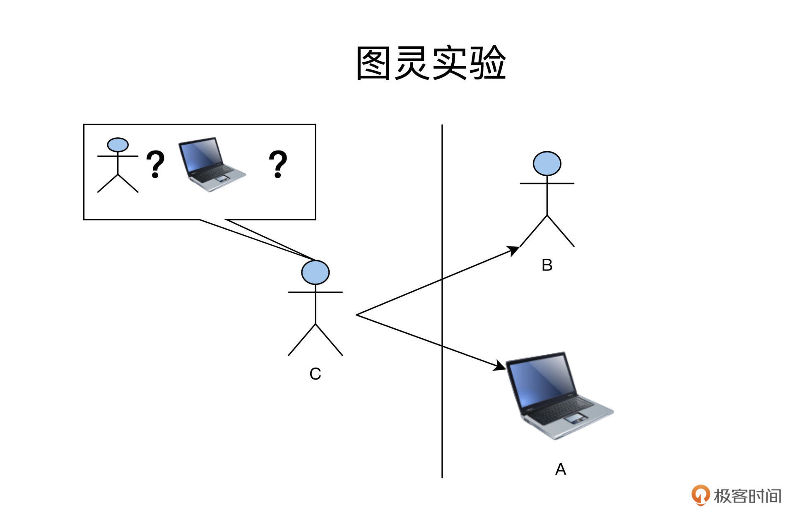

在图灵实验里，人类C隔着一堵墙，分别跟B和A交流。当他分辨不出来哪个是人，哪个是电脑的时候，我们就说，电脑A已经具备了和人类B一样的人工智能了。

在集成测试里，就变成了下图这样：

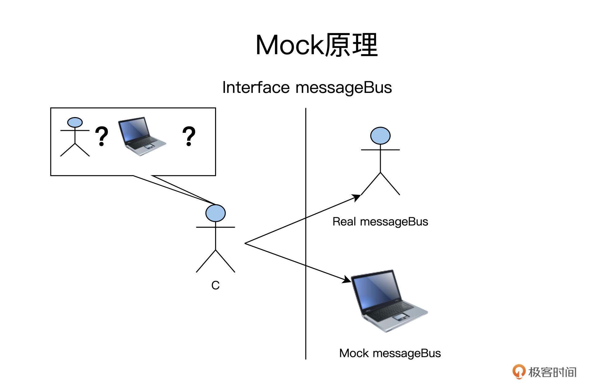

C通过Interface定义的规范和A、B打交道，而Mock和Real都是对Interface MessageBus的实现。所以，C不能分辨出哪个是A，哪个是B，因为它们都遵循Interface MessageBus。

在Java语言里，MessageBus的Interface定义如下：

```
    public interface IMessageBus{
        //发送消息
    	public  void sendEmailChangeMessage(Srting userID,String changedEmail);
    	//接收消息
        public  Message fetchMessageById(Integer msgId);
    	............................
    }
    

```

有了Interface后，你可以借助工具生成Mock实现。

下面的例子是Mockito框架，直接通过Interface MessageBus生成Mock messageBus：

```
    import org.mockito.Mock;
    import org.mockito.MockitoAnnotations;
    public class FoodComeTest{
      @Mock
      private IMessageBus mockMessageBus;
      public class InterfaceMethodMockingUsingMockAnnotationTest {
        ........
         user.changeEmail(userID,changedEmail);
         mockMessageBus.sendEmailChangeMessage(userID,changedEmail);
         ........
      }
    }
    

```

通过这个例子，我们看得出Interface的存在对于集成测试十分有用，有很多Mock框架支持通过Inteface生成Mock Class，这就大大降低了Mock的成本。

现在，我们得出了一条**可测试性实践原则**：开发人员在实现对外部服务访问的时候，应该要设立并通过Interface来完成访问，哪怕是一个Interface只有一个实现Class，也需要有Interface的存在。

## 高效Happy Path

很好，现在Mock的成本降低的原则找到了，咱们再接再厉，再分析下集成测试的另外一项重要工作。

还记得上一讲，我们提到过的Happy Path么？它是一条代码执行路径，如果你能找到有效的Happy Path，集成测试可以做得简单而高效。

但是，有没有Happy Path，你又能不能找到它，这很大程度取决于代码的结构。有的项目代码写得混乱，调用链复杂，甚至还有回路死循环，这样的代码你想集成测试，恐怕是走入迷宫难回头。

因此，从集成测试的可测试性角度，代码要满足三条要求：

1.**结构：**领域逻辑和依赖管理分离，清楚可见；  
2.**层次：**调用链简洁而短，减少无效代码；  
3.**调用关系：**调用链单向，避免回路的产生。

这三条要求具体怎么实现，我们一一来看。

### 领域逻辑和依赖管理的分离

之前讲单元测试时，我们已经学习了通过代码四象限法则，把代码分解到各个功能象限里去，我们以FoodCome为例做了练习，分解后的结果就是，我们建立Controller专门管理依赖；建立User类、Restaurant类，专门做业务逻辑相关的操作。

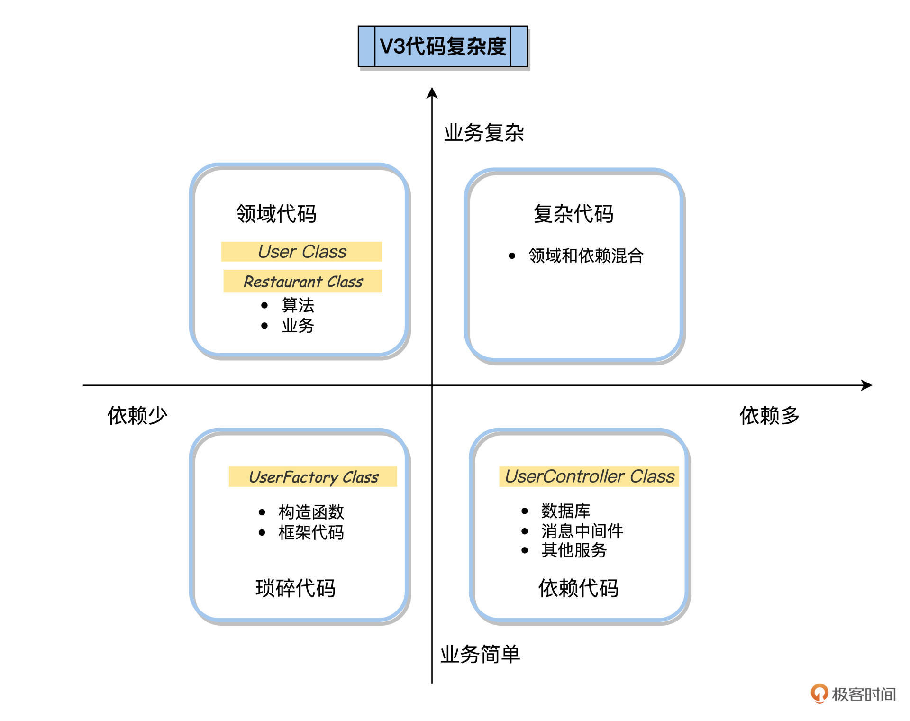

不过明确了分工思路还不够，今天我们就展开说说代码层面的实操细节。

领域逻辑和依赖管理的边界不能只存在开发人员脑子里，否则，项目开发了一段时间后，这个边界就模糊了，甚至埋下项目未来走向腐化的隐患。要让这个边界持续可维护，它应该是可见的。

怎么让这个边界可见呢？最直观的做法就是，把领域逻辑和依赖管理的代码放在一个项目的不同的package下。

FoodCome划分了如下几个package：

* Controller: 用来存放Controller类，还有外部依赖的Interface；
* Service: 用来存放Service类，Controller类调用Service，在Service里实现领域逻辑计算；
* Dao: Service类调用Dao类，实现对数据的持久化。

这样，通过不同package组织的代码，开发人员在后面修改的时候，会自然遵循这些规律，把不同功能的代码添加到相应的package里去。

### 调用链条短而简洁

再结合例子说说调用链的问题，在FoodCome应用里，调用关系是这样的：

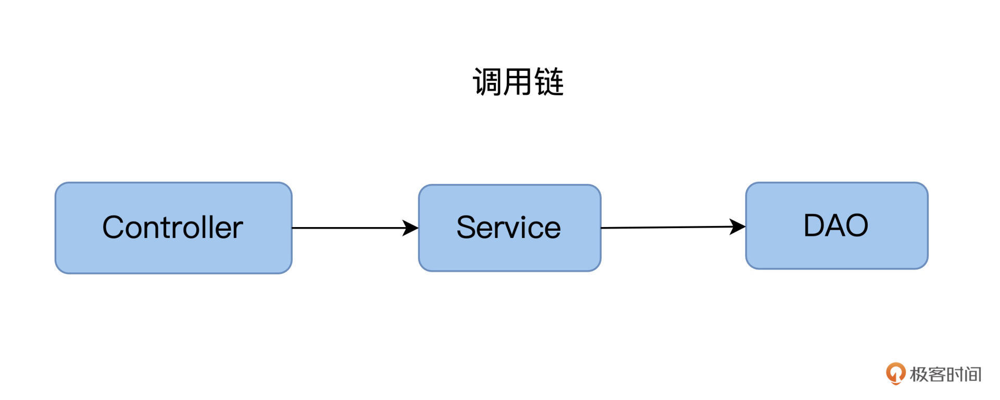

这个调用链非常简单有效，从Controller处理请求，到最后数据入库，就走了三个截面，分别是：Controller层，Service层和DAO层。

在很多项目实践中，调用链比这个复杂，有的刚开始简单，后来项目规模变大后，开发人员不断地往里“加货”。比如，有的开发人员特别喜欢加抽象层，加Interface，而且还会引用一堆软件的理论，说得有理有据，认为Interface可以增加将来的可扩展性。

这些理论没错，但这里我想提醒你，添加抽象层这件事需要保持一个度。在极限编程里还有一个YAGNI理论，YAGNI是英文“You aren’t gonna need it” 的缩写，YAGNI 原则指出，程序员应该在面临确凿的需求时，才要实现相应功能。

### 调用链条单向，避免回路产生

单向指的是，我们从Controler调Service，从Service调DAO，这是调用链的方向，而不能反着来。

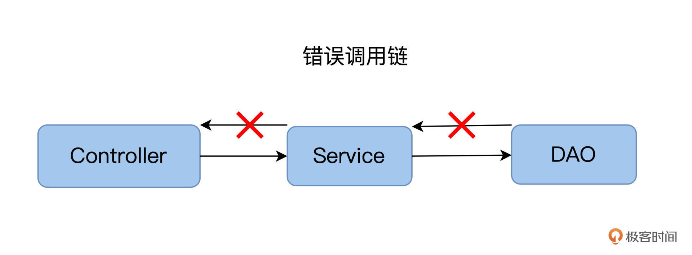

回路指的是，存在两个或以上的Class，它们在调用时互相依赖。

比方说我们开发FoodCome，遇到这样的问题：在结账时需要检查详细列表，而产生详细列表时又需要先结账，这就成了一个死循环。

示例代码如下，实际调用路径比这个绕了好几道圈。

```
    public class CheckOutService
    {
        public void CheckOut(int orderId)
        {
            var service = new ReportGenerationService();
            service.GenerateReport(orderId, this);
            /* other code */
        }
    }
    
    public class ReportGenerationService
    {
        public void GenerateReport(
            int orderId,
            CheckOutService checkOutService)
        {
            /* calls checkOutService when generation is completed */
        }
    }
    

```

解决这样的问题，我们就需要理清工作流，从业务逻辑上彻底解除这样的回路依赖关系。

## 集成测试神器

前面，我们从查看代码的角度来寻找Happy Path，对代码的结构、层次和调用关系提出了一系列要求。

现在，我们再换个思路，能不能从**结果**上观测Happy Path呢？也就是说，我们有没有办法直观地看到这个调用链条呢？

### Happy Path探测神器

你可以在头脑中想象这样一个场景：客户端向系统发起一个请求，就相当于客户要求物流公司把一个货物送到目的地，物流公司先把货物运送到A站点，然后A站点再运到B站点，以此类推，经过多个站点后，最后到达目的地仓库。

这个场景里，物流公司就是软件系统，货物经过的A站点、B站点就是一个个软件服务，而货物走过的ABCD路径，就是服务的调用链。

要想追溯物流的派送路径，那就得问物流公司的负责人，要想知道服务的调用链，我们就得问系统的管理员。在现实中，这个系统的管理员往往是生产环境的运维人员，它们可以**借用各种运维工具，来观测和追踪生产环境的负载**。

能做链路观测和追踪的运维工具有很多，有Zipkin、Dapper、Skywalking等。这里我们以SkyWalking为例，来看一下分布式追踪是怎么做的。

SkyWalking是Apache基金项目下的一个开源项目，用来做可观测性分析，提供分布式跟踪、服务网格遥测分析、度量聚合和可视化一体化解决方案。

在Skywalking [官方网站](https://skywalking.apache.org)，你可以看到它的架构图：

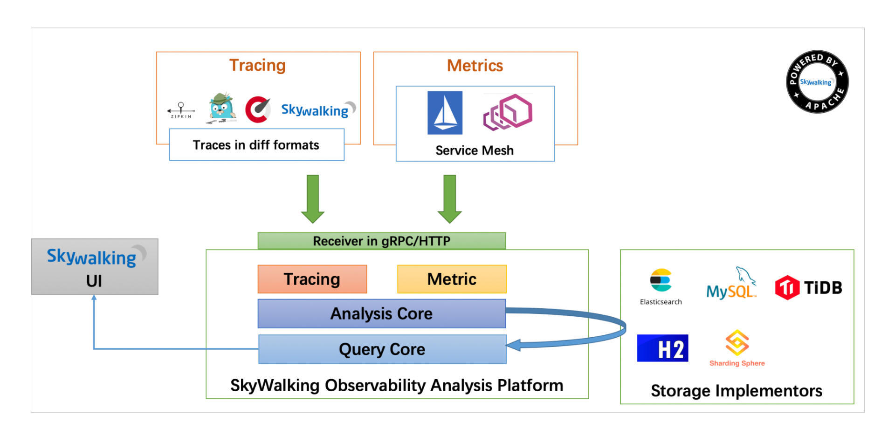

安装配置SkyWalking，你参照[这个文档](https://skywalking.apache.org/docs/skywalking-showcase/latest/readme)就能自学。这里我重点说说Skywalking是怎么工作的呢？

Skywalking需要在每一个服务上启用Skywalking的Agent，也就是图的左上方Tracing部分。

每当服务处理Inbound和Outbound请求时，Agent就把这些信息发送到SkyWalking的OAP服务器上去，OAP服务将这些信息经过链接、聚合、分析后，用户就能通过左下方的UI来查看这些调用信息组织形成的调用链条了。

SkyWalking UI上的功能很多，寻找Happy Path，我们可以使用下面这2个功能。

先看Topology功能下的服务拓扑图，通过拓扑图，可以看到所有的服务和它们的调用关系。

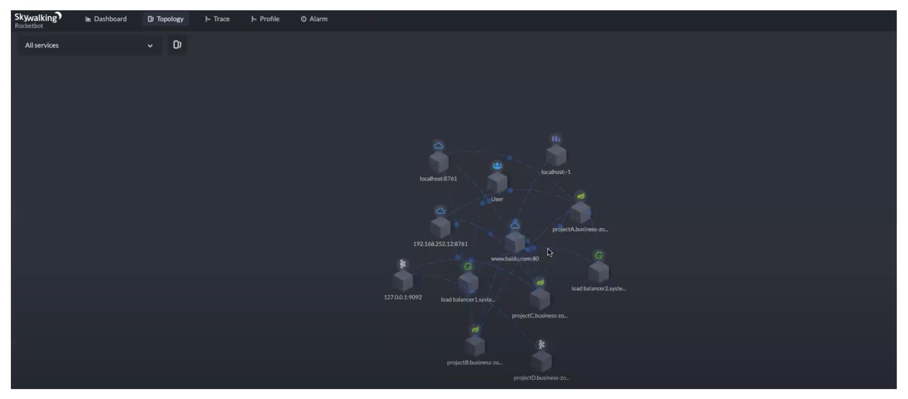

如果我们想观测一个特定的请求，看它走过了哪些路径，可以看Skywalking UI上的Trace Tree。

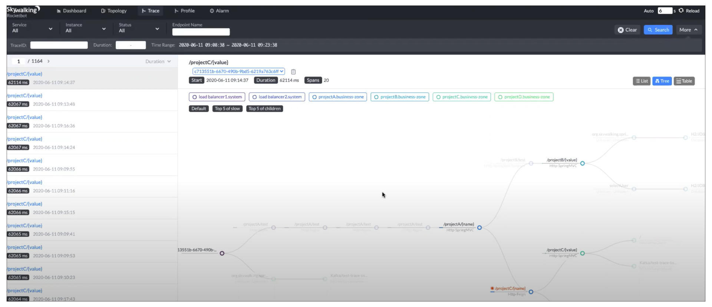

Trace图里，左边导航栏里是一个个的请求，右边的Tree视图里展现了每个请求走过的调用链。这张页面截图主要是让你大概了解。清晰的调用关系，你可以参看下面这张逻辑图。

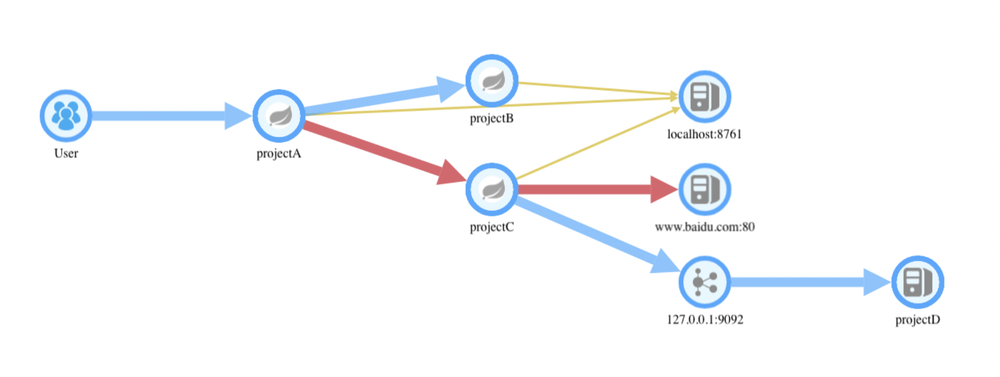

有了调用Tree后，我们就可以运行两个测试案例A和B，使用白盒测试的路径覆盖法则，查看哪个测试案例能覆盖更多的路径，哪个就是Happy Path了！

如果你对白盒测试的路径覆盖方法不太熟悉，可以通过[这个资料](https://www.jianshu.com/p/8814362ea125)，了解一下白盒测试的基本理论。

### Docker构建随时可测的数据库

上一讲，我们提到直接用真实的数据库实例来做集成测试。不过这个在实践中，你可能会遇到一系列问题，这个真实的数据库实例是生产环境么？如果不能用生产环境数据库，自己搭建数据库怎么能够保证真实模拟的测试的效果？

这些问题解决不了，集成测试的成本也会很高，甚至导致在实践中，集成测试无法开展。

应该怎么办呢？我先抛出开展集成测试的三个关键目标。

第一，集成测试的环境应该是独立的，和生产环境分离；

第二，集成测试的数据库上的数据库对象应该和生产环境保持同步；

第三，集成测试数据库实例的生成应该是快速的。

要实现第一条和第三条，我们可以采用Docker的方式来准备集成测试环境。Docker比较轻量，速度也快。但是要做到第二个目标，通过Docker构建一个和生产环境同样对象版本的环境，这就需要开发人员对数据库的对象、脚本的维护都能进行版本化管理。

这里我说说我的实践经验，希望你能灵活应用，帮助DBA和开发人员管理好数据库。

第一，**版本化管理**。所有的数据库对象、脚本、数据都要和应用代码一起进行版本化管理。结合自己的实践验证，我特意给你梳理了后面的自检清单。

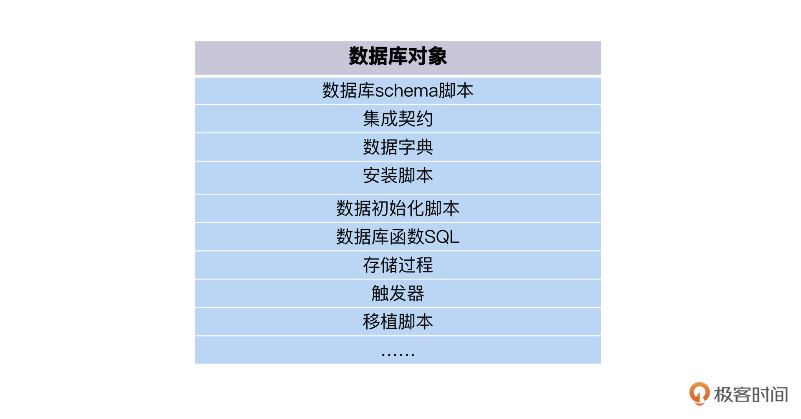

这项工作的完成标准，就是你随时可以从版本库里，拉出来一个版本的应用代码和数据库脚本，部署成一个可运行的应用+数据库。

第二，跟应用代码升级一样，数据库的变更也要通过版本化的脚本来完成。

一些开发人员有一个不好的习惯，直接用Console等工具变更数据库，比如给表加一个字段、修改一个字段的长度等等。这些变更没有记录，之后数据库的维护、回滚、重建都会遇到困难。

正确的姿势是，开发人员应该写脚本来完成数据库的变更。如果变更数据库schema，那就写一段ALTER SQL，在开发环境测试通过后，把它提交到版本库里，**和提交、合并应用代码是一样的流程**。然后Ops通过部署，把应用代码和数据库变更，一起更新到生产环境。

好，如果你的开发人员和DBA完成了这些工作，那就可以享受集成测试的方便和敏捷了，你可以写一个Dockerfile，来描述Mysql数据库的生成步骤，比如这样：

```
    FROM mysql:5.6
    ENV MYSQL_ROOT_PASSWORD liusheng12345
    COPY sql/my_install.sql /tmp/
    # https://hub.docker.com/_/mysql 
    COPY sql/seed_data.sh /docker-entrypoint-initdb.d/
    COPY cnf/my.cnf /etc/mysql/
    

```

然后，你再运行一个Docker 命令：

```
    Docker build -t "myintegration:1.0" .
    

```

这样一来，你的数据库实例就启动了，可以测试了！

### 集成测试环境搭建神器

通过前面的学习，我们发现Docker具有快速、轻量、低成本的特点，是我们搭建集成测试环境的理想技术方案。沿着这个方向，你可以学习Kubernetes、Helm、Docker Compose这些Docker部署技术，把它们应用在集成测试里，但这个学习过程也是个耗时又耗脑细胞的过程。

那有没有一种方案，能封装这些技术，让测试人员不用懂Docker，也能管理集成测试环境呢？

有痛点，就一定会有人去做解决方案。所以测试容器化应运而生，有Testcontainers、Arquillian等工具。我们这就来看一下Testcontainers是怎么做的。

Testcontainer实际就是一组Java Library，自动化测试开发人员通过调用Java代码，来生成Docker容器实例。

```
    public class OrderTest{
      @Container
      PostgreSQLContainer<?> postgreSQLContainer = new PostgreSQLContainer<>("postgres:latest");
     
      @Before
      public void setup(){
        String jdbcURL = postgreSQLContainer.getJdbcUrl();
        String username =  postgreSQLContainer.getUsername();
        String password = postgreSQLContainer.getPassword();
        //使用刚创建的数据库容器作为测试数据库
        OrderRepository.initializeDB(jdbcUrl,username,password);  
      }
      public void testCreateOrder(){
        //创建订单
        .........createOrder............
        //从数据库容器获得订单数据，验证创建成功
        ........ fetch order from containerized postgreSQL............
      }
    }
    

```

上面的Java代码，在new PostgreSQLContainer对象的时候，实际上创建并启动了一个用Postgres作为镜像的Docker容器，用这个Docker容器作为Order数据库，这样，创建的订单会被保存在容器里。

容器对象建好以后，在后面的Test方法，我们就可以连上这个容器对象，来验证里面的订单数据了。是不是很简单？甚至你根本不需要懂Docker是怎么启动的，就可以集成测试了。

利用容器代码化这个便捷方法，你还可以创建错误数据的数据库，做异常测试。

```
    @Container
    public PostgreSQLContainer<?> goodPostgreSQLContainer = new PostgreSQLContainer<>("postgres:alpine")
                .withInitScript("db_init.sql")
                .waitingFor(Wait.forLogMessage("good database startup", 1));
    @Container
    public PostgreSQLContainer<?> badPostgreSQLContainer = new PostgreSQLContainer<>("postgres:alpine")
                .withInitScript("db_wrong.sql")
                .waitingFor(Wait.forLogMessage("bad database startup", 1));
    

```

TestContainer的解决方案不限于数据库，还有RabbitMQ、Kafaka消息中间件，Elastic search服务实例、Azure云服务等等。更多同类的解决方案，你还可以到[这个网站](https://www.testcontainers.org)上去看一下模块列表。

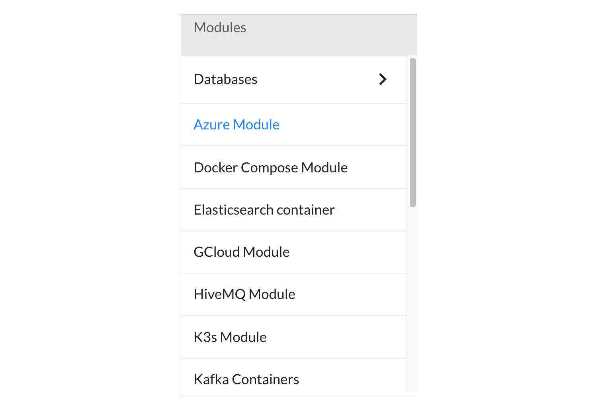

## 小结

一口气学到这里不容易，给坚持学习的你点赞。今天围绕集成测试的可测试性这个主题，我们一起学习了不少开发知识。

开发需要定义Interface，这样测试程序就可以通过Interface快速生成可用的Mock对象。简单高效的Happy Path，实际要依赖**设计合理、边界清楚、调用简捷的代码**。

除了代码规范，我还介绍了一些链路观测、追踪工具。有了这些神器加持，你就能直观看到某个请求的调用路径，从结果上寻找Happy Path。

结合实践经验来看，搭建集成测试环境这项工作也不容忽视。想要快速搭建集成测试环境，还需要开发人员和DBA有效管理好数据库对象，所有的数据库对象、脚本、数据都要和应用代码一起进行版本化管理。

此外，测试环境Docker容器化也是一个必然的趋势，我们需要学会怎么利用Docker来容器化集成测试所需的外部实例，甚至我们的测试环境也可以被容器化，达到开箱即用的效果。

说句题外话，[第十一讲](https://time.geekbang.org/column/article/506638)和这一讲，是第二模块我认为最有价值的两篇内容，它们的出发点都是**从测试推动开发**。

也许现在的你，并没有决定未来选择什么方向发展，但我希望你可以掌握全栈知识，看到更多立足测试思维去解决问题的可能性，自由穿梭于测试和开发之间，这样你的工作前景也会越来越宽广。

## 思考题

分享一下你有哪些好办法来搭建集成测试环境？

欢迎你在留言区和我交流互动，也推荐你把今天这一讲分享给你的同事、朋友。