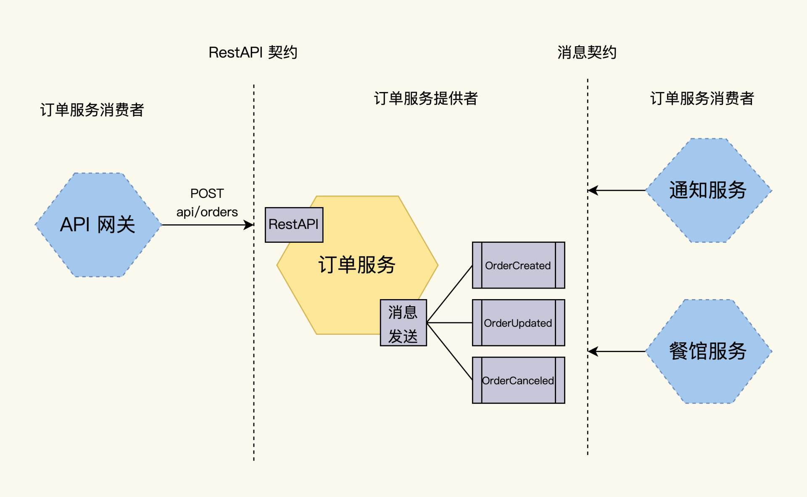
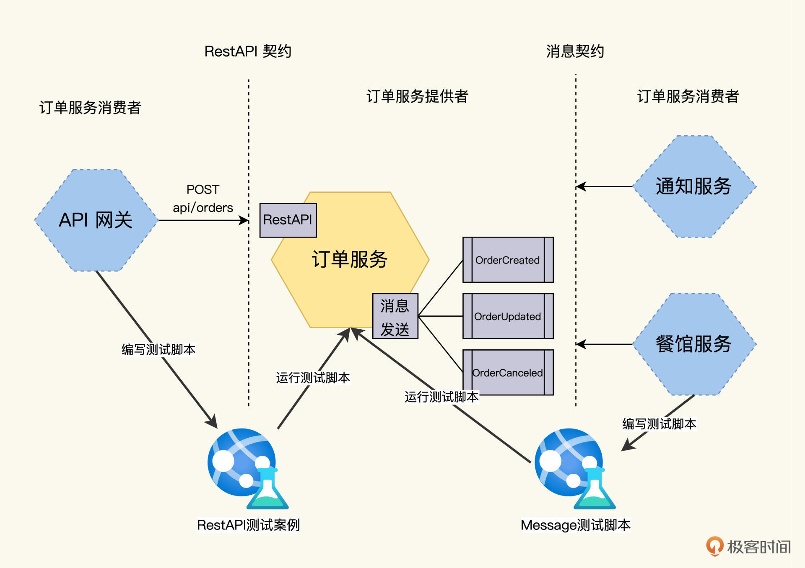
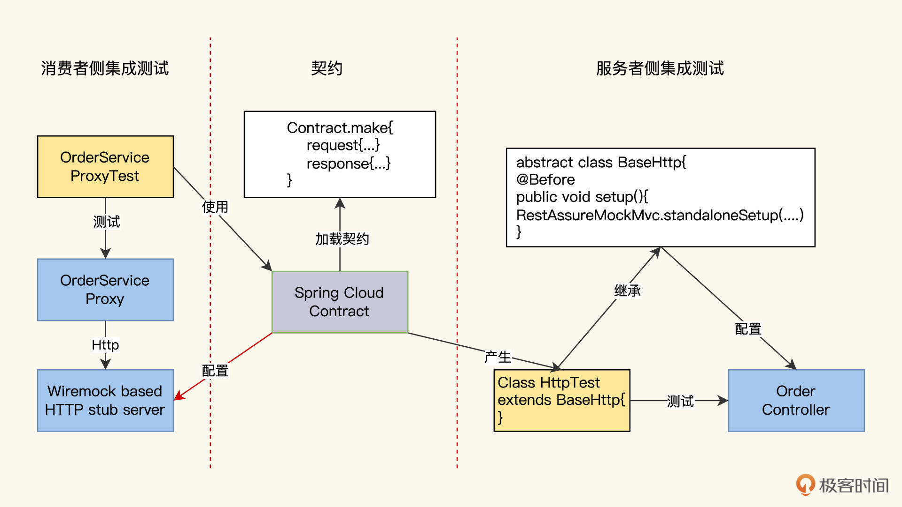
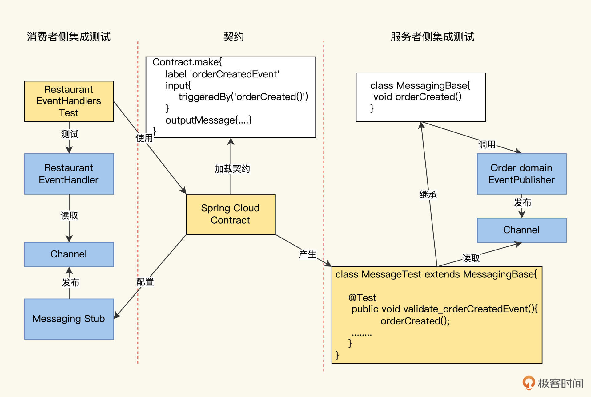

---
date: "2019-06-23"
---  
      
# 14｜集成测试（三）：护航微服务集群迭代升级
你好，我是柳胜。

从第七讲开始，我们的FoodCome系统一步步演变。可以看到，当FoodCome从一个单体应用发展成一个服务集群的时候，它的内部服务，按功能可以划分出前端和后端、上游和下游等等

这就像传统社会走向现代化，开始分出第一产业、第二产业和第三产业，接着逐渐出现精细分工，产生了各种专业岗位，共同协作来完成整个社会的运转。这么复杂的社会，是靠什么协调不同的职业呢？靠的是大家都遵守法律和契约。

而在微服务集群的世界，也是一样的道理。各个服务之间通过契约来交互协作，整个系统就能运转起来。所以，契约就是微服务世界里一个重要的概念。契约是怎么用起来的呢？

这就绕不开两个关键问题，**第一，契约的内容是什么？第二，谁来保障，怎么保障契约的履行？**今天我们就带着这两个问题来学习服务的契约，学完这一讲之后，你就知道怎么做微服务的集成测试了。

## 契约的内容

在“微服务测什么”一讲中（[第八讲](https://time.geekbang.org/column/article/503214)），我们已经整理出来了订单服务的契约。我带你复习一下当时我们整理出来的两个接口规范，我把它们贴到了后面。

一个是RestAPI，完成用户下单的功能，OpenAPI接口定义如下：

```
    "/api/v1/orders":
        post:
          consumes:
          - application/json
          produces:
          - application/json
          parameters:
          - in: body
            name: body
            description: order placed for Food 
            required: true
            properties:
              foodId:
                type: integer
              shipDate:
                type: Date
              status:
                type: String
                enum:
                - placed
                - accepted
                - delivered
          responses:
            '200':
              description: successful operation
            '400':
              description: invalid order
    

```
<!-- [[[read_end]]] -->

还有一个是消息接口，它在处理完订单后，还要往消息队列的Order Channel里发布这样的消息，这样别的服务就能从Order Channel取到这个订单，再进行后续的处理。

AsyncAPI接口定义如下：

```
    asyncapi: 2.2.0
    info:
      title: 订单服务
      version: 0.1.0
    channels:
      order:
        subscribe:
          message:
            description: Order created.
            payload:
              type: object
              properties:
                orderID:
                  type: Integer
                orderStatus:
                  type: string
    

```

这两份契约的服务提供者是订单服务，消费者有两个，一个RestAPI契约的消费者，一个是消息契约的消费者。我画了一张图，你会看得更清楚些。



## 契约的游戏规则

有了契约后，微服务的开发协作，就基于契约运转起来了，怎么运行呢，分成契约的**建立、实现、验证**三个阶段。

1.契约建立。契约双方，也就是服务提供者和消费者“坐在一起”，签订了一个契约，大家都同意遵守这个规则来做自己的开发。

2.契约的实现。订单服务按照契约来实现自己的服务接口，同时，API网关和通知服务、餐馆服务，它们都按照契约来实现自己的调用接口。

3.契约的验证，契约双方完成自己的工作后，然后再“坐在一起”完成集成，看看是不是履行了契约。

这个协作模型，跟我们现实里常见的债务合同很相似。合同签订的内容是，订单服务欠下了一笔债，到开发周期结束后，订单服务要按照合同约定的方式向调用者偿还这笔债。

但这还是个模型，想要真正落地实践，有两个问题需要考虑清楚。

第一个问题是监督机制。在契约建立日到履行日之间的这段时间里，有没有办法设置检查点来检查契约履行的进度和正确性，万一订单服务跑偏了，可以提前纠正。

第二个问题是检查办法，也就是如果要做检查，谁负责检查？

显然，这个检查的手段就是测试，那么谁来做这个测试呢？让服务者自测？

这个不太靠谱，最合适的办法，是让消费者去做测试，这就像在债务合同里，法律规定债权人要定时追讨债务，不履行追讨权超过一定时间，最终法院可能会不支持诉讼。这样做的目的是保证契约机制运转高效。

欠债还钱的现实世界，债权人推动着合同如期履行。按时交付的技术领域，消费者驱动着契约测试，那这个过程具体是怎么操作的呢？

## 消费者驱动契约测试

消费者驱动契约测试的玩法是这样的：消费者来主动去定义契约，开发测试脚本，然后把这个测试脚本交给服务者去跑，服务者要确定自己开发的代码能测试通过。这个过程相当于消费者完成了验收测试。

对于FoodCome来说，API网关负责编写RestAPI测试案例，通知服务和餐馆服务负责编写Message测试案例，如下图：



## RestAPI的契约测试

先来看一下RestAPI的契约测试怎么做。

首先你要明白，我们这种契约测试的场景处于**开发阶段**，契约测试案例的工具需要持续而快速地维护和验证契约。

所以，这个工具应该有高效的自动化能力，具体要满足这两个条件，首先要能解析契约，其次还能根据契约生成Test Class和Stub方便测试。

符合这两个条件的工具有不少，其中Pact和SpringCloud比较主流。今天我们就以Spring Cloud为例来看一下RestAPI契约测试怎么做的。

第一步，Spring Cloud先要加载契约，代码示例如下：

```
    org.springframework.cloud.contract.spec.Contract.make {
        request {
            method 'POST'
            url '/api/v1/orders'
        }
        response {
            status 200
            headers {
                header('Content-Type': 'application/json;charset=UTF-8')
            }
            body('''{"orderId" : "1223232", "state" : "APPROVAL_PENDING"}''')
        }
    }
    

```

第二步，根据契约，Build分别生成Stub和Test Class，其中Test Class给服务提供者，Stub给消费者，因为它们是同一份契约产生的，所以只要运行成功，就等同于双方都遵守了契约。

原理图是这样的，在订单服务项目下，运行Spring Cloud Contract Build，会在target/generated-test-sources目录下，自动产生一份ContractVerifierTest代码，供订单服务（也就是服务提供者）来测试自己的服务接口，也就是下图的右侧区域。

同时，SpringCloud Contract还提供一个sub-runner的Jar包，供消费者做集成测试的stub，这里对应着下图的左侧区域。



服务者侧的集成测试代码示例如下：

```
    public abstract class ContractVerifierTest {
      private StandaloneMockMvcBuilder controllers(Object... controllers) {
        ...
        return MockMvcBuilders.standaloneSetup(controllers)
                         .setMessageConverters(...);
      }
      @Before
      public void setup() {
        //在开发阶段，Service和Repository还是用mock
        OrderService orderService = mock(OrderService.class);                    ❶
        OrderRepository orderRepository = mock(OrderRepository.class);
        OrderController orderController =
                  new OrderController(orderService, orderRepository);
      }
      @Test
      public void testOrder(){
        when(orderRepository.findById(1223232L))                                 ❷
                .thenReturn(Optional.of(OrderDetailsMother.CHICKEN_VINDALOO_ORDER));
        ...
        RestAssuredMockMvc.standaloneSetup(controllers(orderController));        ❸
      }
    }
    

```

这段代码的意思是，开发人员先写好OrderController代码，把接口代码写好，负责业务逻辑的OrderService和OrderRepository暂时用Mock来替代。而自动生成的ContractVerifierTest是来测试和验证OrderController的接口，不管将来OrderService和OrderRepository怎么实现和变化，只要保证OrderController接口不变，就可以。

消费者这一侧，这是在本地启动一个HTTP的Stub服务，在真实的订单服务没有完成之前，消费者可以和Stub做集成测试。具体代码如下：

```
    @RunWith(SpringRunner.class)
    @SpringBootTest(classes=TestConfiguration.class,
            webEnvironment= SpringBootTest.WebEnvironment.NONE)
    @AutoConfigureStubRunner(ids =                                            
             {"com.foodcome.contracts"},
            workOffline = false)
    @DirtiesContext
    public class OrderServiceProxyIntegrationTest {
      @Value("${stubrunner.runningstubs.foodcome-order-service-contracts.port}")  
      private int port;
      private OrderDestinations orderDestinations;
      private OrderServiceProxy orderService;
      @Before
      public void setUp() throws Exception {
        orderDestinations = new OrderDestinations();
        String orderServiceUrl = "http://localhost:" + port;
        orderDestinations.setOrderServiceUrl(orderServiceUrl);
        orderService = new OrderServiceProxy(orderDestinations,               
                                              WebClient.create());
      }
      @Test
      public void shouldVerifyExistingCustomer() {
        OrderInfo result = orderService.findOrderById("1223232").block();
        assertEquals("1223232", result.getOrderId());
        assertEquals("APPROVAL_PENDING", result.getState());
      }
      @Test(expected = OrderNotFoundException.class)
      public void shouldFailToFindMissingOrder() {
        orderService.findOrderById("555").block();
      }
    }
    

```

可以看到，只要契约不变，生成的服务端测试代码也是不变的。如果有一天，服务端在迭代开发中没有遵守契约，那么测试案例就会失败。

测试案例失败之后，服务端面临两个选择，要么修改自己的代码让契约测试通过，要么去修改契约，但是修改了契约后，消费者的测试又会失败。这样，我们就能以**测试结果**为准绳，让消费者和服务者始终保持同步。

## Message的契约测试

Spring Cloud Contract也支持基于Message的契约，它和RestAPI的契约实现方法比较像，直接上原理图，你理解起来更直观。



这里我画了一张图片，为你解读餐馆服务和订单服务通过契约做集成测试的内部原理。

还是同样的配方，熟悉的味道，一份契约产生服务者端集成测试代码和消费者集成测试代码。跟OpenAPI的原理类似，这里我同样把示例代码贴出来，供你参考。

服务端的集成测试代码如下：

```
    @RunWith(SpringRunner.class)
    @SpringBootTest(classes = MessagingBase.TestConfiguration.class,
                    webEnvironment = SpringBootTest.WebEnvironment.NONE)
    @AutoConfigureMessageVerifier
    public abstract class MessagingBase {
      @Configuration
      @EnableAutoConfiguration
      @Import({EventuateContractVerifierConfiguration.class,
               TramEventsPublisherConfiguration.class,
               TramInMemoryConfiguration.class})
      public static class TestConfiguration {
        @Bean
        public OrderDomainEventPublisher
                OrderDomainEventPublisher(DomainEventPublisher eventPublisher) {
          return new OrderDomainEventPublisher(eventPublisher);
        }
      }
    
      @Autowired
      private OrderDomainEventPublisher OrderDomainEventPublisher;
      protected void orderCreated() {                                   
         OrderDomainEventPublisher.publish(CHICKEN_VINDALOO_ORDER,
              singletonList(new OrderCreatedEvent(CHICKEN_VINDALOO_ORDER_DETAILS)));
      }
    }
    

```

消费者端集成测试代码如下：

```
    @RunWith(SpringRunner.class)
    @SpringBootTest(classes= RestaurantEventHandlersTest.TestConfiguration.class,
            webEnvironment= SpringBootTest.WebEnvironment.NONE)
    @AutoConfigureStubRunner(ids =
            {"foodcome-order-service-contracts"},
            workOffline = false)
    @DirtiesContext
    public class RestaurantEventHandlersTest {
      @Configuration
      @EnableAutoConfiguration
      @Import({RestaurantServiceMessagingConfiguration.class,
              TramCommandProducerConfiguration.class,
              TramInMemoryConfiguration.class,
              EventuateContractVerifierConfiguration.class})
      public static class TestConfiguration {
        @Bean
        public RestaurantDao restaurantDao() {
          return mock(RestaurantDao.class);                                    
         }
      }
      @Test
      public void shouldHandleOrderCreatedEvent() throws ... {
        stubFinder.trigger("orderCreatedEvent");                                 
         eventually(() -> {                                                      
           verify(restaurantDao).addOrder(any(Order.class), any(Optional.class));
        });
      }
    

```

使用Pact也可以达到同样的效果，如果感兴趣，你可以研究一下。

## 小结

今天我们主要讲了微服务群内部之间的集成测试。

跟外部的服务集成测试不同，内部服务经常处在一个迭代开发的状态，可能一个服务变动了，就会导致别的服务不能工作。

为了解决这种问题，我们引入了**消费者驱动契约测试**的方法论。这个契约测试的特点是消费者把自己需要的东西写入契约，这样一份契约产生两份测试代码，分别集成到契约的服务端和消费端，服务端有任何违背契约的代码变更，会第一时间以测试失败的形式抛出。

为了让你深入理解契约测试的思想，学会怎样把这个方法论真正落地。我还带你一起实现了Spring Cloud的在RestAPI和Message两个方面的契约示例。有了这个基础，你可以结合自己面对的实际情况做调整，实现更契合自己项目的一套契约，集成测试做起来也会更得心应手。

当然了，Sping Cloud Contract还有更多的扩展使用，比如和OpenAPI的转换、Cotract的中央存储和签发等等，你有兴趣可以在这个领域继续深挖，也期待你通过留言区晒出自己的心得。

## 牛刀小试

这一讲中的契约是Groovy方式书写的，我们之前总结的契约是以YAML方式表现的，你可以在Spring Cloud Contract和Pact中任选其一，实现对yaml契约的加载。

欢迎你和我多多交流讨论，也推荐你把今天的内容分享给身边的朋友，和他共同进步。