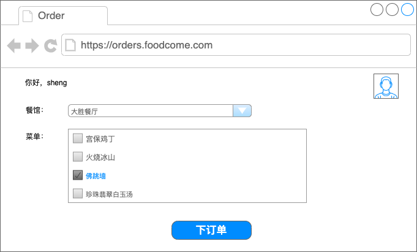
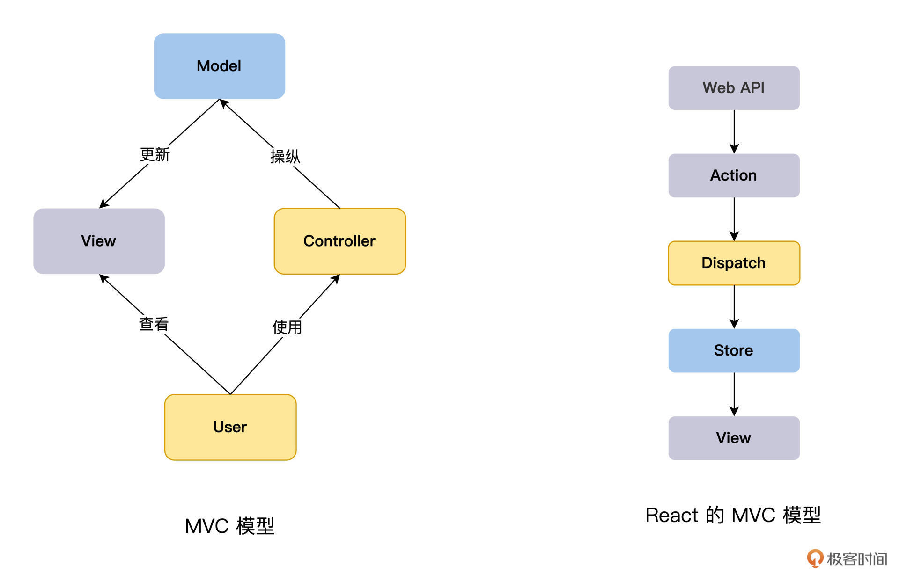
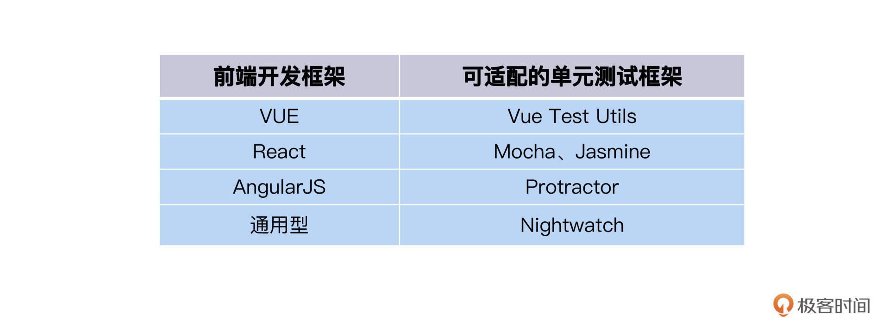

---
date: "2019-06-23"
---  
      
# 15｜UI测试：如何让UI测试更轻快便捷？
你好，我是柳胜。

恭喜你坚持到这里，我们顺着测试金字塔底层的单元测试一步步向上，现在终于到了金字塔顶部。按照我们的整体设计，其实脏活累活已经在底层干得差不多了。

爬上塔顶不容易，应该是一身轻松，纵览风光了。可以想象，如果没有前面的整体设计，没有单元测试来夯实基础，把测试工作全都压到端到端测试，它必然会垮掉。

不过，既然需要金字塔顶部这个UI测试层，一定是它不可替代，做得了其他层力所不能及的事儿。今天咱们就来梳理下UI测试要做什么，怎么做才能收割更高的ROI。

UI全名叫做User Interface，在当下，User这个概念已经被扩展，甚至被滥用，我倒觉得，UI叫做PI（People Interface）更为准确，专指和人格用户交互的界面。

从UI这个角度，主要有三个测试点需要去关注：第一，用户的行为；第二，UI的布局；第三是用户的易用性。当然，根据具体业务的需求，还有其他的点，比如Globalization全球化、Accessibility亲和力等等。

## 用户行为测试

用户的行为，指的是用户通过操作UI，获得他想要的功能。在FoodCome里，用户通过WebUI填好订单信息，然后点击“下订单”按钮，就能完成下单功能。

<!-- [[[read_end]]] -->



分析一下就能知道，在这个过程里，有两部分代码逻辑参与了下单，一个是前端逻辑，就是HTML+JavaScript代码；另外一个就是后端逻辑，也就是我们前面讲过的RestAPI和DB。

既然后端逻辑我们在单元测试就测过了，而前后端集成我们也用契约测试测过了，那么UI测试的关键点，就在于前端逻辑有没有，又有多少？

这里要分两种情况。第一种，前端没有业务逻辑，就是简单的发送请求，接收响应并展现。这些工作都是通过浏览器的内嵌功能来完成的。比如FoodCome可以用一个HTML form来完成订单的提交过程：

```
    <form method="POST" enctype="application/x-www-form-urlencoded" action="/html/codes/html_form_handler.cfm">
    <p>
    <label>餐馆名字
    <input type="text" name="restaurant_name" required>
    </label> 
    </p>
    
    <fieldset>
    <legend>菜单</legend>
    <p><label> <input type="checkbox" value="no1"> 宫保鸡丁 </label></p>
    <p><label> <input type="checkbox" value="no2"> 佛跳墙 </label></p>
    <p><label> <input type="checkbox" value="no3"> 珍珠翡翠白玉汤 </label></p>
    </fieldset>
    <p><button>下订单</button></p>
    
    </form>
    

```

这也是业界提到过的Thin Client瘦客户端，客户端里没有或只有很少的业务逻辑。

瘦客户端怎么测？我的答案是，在单元测试和集成测试已经充分的情况下，瘦客户端只需找两三个典型业务场景测一下，甚至都不需要考虑UI自动化。因为主要的逻辑和路径都已经测过了嘛，你没必要再花时间重复。

与瘦客户端相对应的是胖客户端，也叫Rich Client，当然胖客户端里是嵌入了大量的业务逻辑。当今业界，胖客户端更加普遍，比如WebUI里嵌入了JavaScript来聚合后端的数据、画图、表格、排序等等，从这个角度，你也可以把Desktop客户端直接当作胖客户端来对待。

胖客户端该怎么测？ 要回答这个问题，我们需要首先思考一下“胖客户端是什么”。在微服务世界里，每个微服务实现自己的业务逻辑，向外提供服务，同时也是客户端去消费其他的服务。

而胖客户端是什么呢，它也有自己的业务逻辑，聚合数据、图形化都是它的业务逻辑。但是有一点特殊，胖客户端是微服务集群调用链条最早一个，它只会去调用别人，调用胖客户端的是终端用户。

从这个角度来看，胖客户端满足了提供服务，也消费其他服务的微服务特征，因此**胖客户端本质上也是一个微服务。**

说到这里，胖客户端怎么测这个问题的答案就呼之欲出了。微服务该怎么测，胖客户端就该怎么测。什么意思呢？你还是要遵循测试3KU金字塔原则，胖客户端首先要做单元测试，再做集成测试，最后才是UI测试。

看到这里你可能会有点困惑，UI客户端还要分层，这是怎么回事呢？我拿WebUI的开发框架举个例子，你就明白了。

React是业界很常用的JavaScript开发框架，看看它是怎么实现下订单操作的：

```
    class FlavorForm extends React.Component {
      constructor(props) {
        super(props);
        this.handleChange = this.handleChange.bind(this);
        this.handleSubmit = this.handleSubmit.bind(this);
      }
    
      handleChange(event) {    this.setState({value: event.target.value});  }
      handleSubmit(event) {
        alert('Your order is: ' + this.state.value);
        event.preventDefault();
      }
    
      render() {
        return (
          <form onSubmit={this.handleSubmit}>
            <label>
              Pick your favorite flavor:
              <select value={this.state.value} onChange={this.handleChange}>            
                <option value="no1">宫保鸡丁</option>
                <option value="no2">佛跳墙</option>
                <option value="no3">珍珠翡翠白玉汤</option>
              </select>
            </label>
            <input type="submit" value="下订单" />
          </form>
        );
      }
    }
    

```

上面一段简单React JavaScript代码有render来做数据的展现，有Handler来做数据的处理，还有props做数据的存储。其实React开发的前端功能，跟一个后端服务的MVC结构是类似的。



看到没有？UI前端也有设计模式，也可以实现很多业务逻辑。所以，你可以把UI前端当做一个微服务来测试，既然是微服务，那就可以分层，做单元测试。

那前端的单元测试怎么做呢？和后端原理是一样的，该写Test方法写Test方法，该Assert就Assert，该Mock就Mock。只是前端开发框架有很多种，相对应地，单元测试框架也有多种，你需要找到匹配的那一对。我给你总结了一个表格，你也可以结合自己实践拓展、丰富它。



下面是使用Vue Test Utils来执行单元测试的例子，在订单页面，点击一个check Order按钮，验证页面上是否会显示“order validated”的消息。

```
    import { shallowMount } from '@vue/test-utils'
    	import OrderToggle from '@/components/OrderToggle.vue'
    	import Order from '@/components/Order.vue'
    	describe('OrderToggle.vue', () => {
    	  it('toggles msg passed to Order when Place Order button is clicked', () => {
    	    const wrapper = shallowMount(OrderToggle)
    	    const button = wrapper.find('#check-order')
    	    button.trigger('click')
    	    const OrderComponent = wrapper.find(Order)
    	    expect(OrderComponent.props()).toEqual({msg: 'order validated'})  
    	  })
    	})
    

```

你可以看到，JavaScript单元测试能测试数据逻辑，也能测试页面事件，模拟人的行为，发送一个个点击、输入事件。那么你可能还想问，前端JavaScript的单元测试做完，是不是就不需要额外的UI测试了呢？

这是一个好问题，不过完成之上，我们希望做得更加完美、更有效益。结合我们专栏里我不厌其烦给你提到的3KU原则，本着“做有效的，不做浪费的测试”的目标，单元测试做完了，UI上只做单元测试没做到的事情。

你可以思考一下符合这个条件的场景有没有，在哪里？

## 页面的Layout布局测试

相比API测试，UI的测试还有一个特殊的地方，不但要验证UI的控件画出来了，而且还要验证它们都在正确的位置上，这个验证就叫做UI布局测试。

你可以这样理解，API测试里，我们检查数据的时候，是一维的检查，而在UI测试里，数据的检查是二维的，有了x、y的坐标。这个复杂度一下子就上来了。

布局测试怎么做？有两种方案，咱们分别来看看。

一种是抓图方案，它是在运行UI自动化测试的时候，顺便调用captureScreen函数，对当前的UI抓屏，保存成图片。然后利用图片比较技术，去看页面的布局有没有发生变化。所以这个方案的技术关键点，就是**位图比较**。业界比较成熟的技术实现有Applitools、Sikuli。

比如，用Applitools的eyes类进行对比：

```
    driver = new ChromeDriver();
    eyes = new CompareEyes();
    // 设置匹配级别为Layout布局
    eyes.setMatchLevel(MatchLevel.LAYOUT);
    eyes.setEnableComparison(true);
    eyes.open(driver, appName, testName, viewPortSize);
    eyes.switchToComparisonMode(driver);
    // 使用eyes对比当前窗口和已经保存的图片
    eyes.check("/Users/sheng/Desktop/login.png", Target.window());
    eyes.close();
    driver.quit();
    

```

上面的代码是，启动Selenium Web Driver，加载页面，初始化eyes，然后调用eyes的check函数来实现图片的比较。

Applitools有AI的功能，在早期，测试人员手工地对它的比对结果进行确认或纠正，这相当于是训练了AI比对模型。这样使用一段时间后，它的比对会越来越智能，结果会越来越准确。

第二种是Layout规格说明书方案，什么意思呢？跟传统测试一样，需要先写一份Layout规格说明书，比如屏幕上在什么位置应该出现什么元素等等，应该有一个列表展示。

然后，自动化测试运行的时候，就把render出来的页面和规格说明书相比较，测试成功或失败。在这个领域里的工具也有很多种，Galen和Lineup是其中的代表。

比如说，下面我用Galen这个工具，演示的FoodCome系统login页面的Layout规格说明书LoginPage.spec：

```
    @objects
    	    login-box           id  login-page
    	    login-caption       css #login-page h2
    	    username-textfield  css input[name='login.username']
    	    password-textfield  css input[name='login.password']
    	    login-button        css .button-login
    	    cancel-button       css .button-cancel
    	= Login box =
    	    @on *
    	        login-box:
    	            centered horizontally inside content 1px
    	            below menu 20 to 45px
    	        login-caption:
    	            height 20 to 35px
    	            text is "Login"
    	        username-textfield, password-textfield:
    	            height 25 to 35 px
    	        login-button, cancel-button:
    	            height 40 to 50 px
    

```

在这个spec里，描述了登录页面的布局，有6个页面对象：登录框、登录标题、用户名输入框，密码输入框、登录按钮和取消按钮，还说明了它们各自的样式和位置。

在运行测试的时候，当加载login页面的时候，会把展现出来的页面和LoginPage.spec进行匹配验证，匹配成功，说明Layout是按照预期加载的。

```
    public void loginPage_shouldLookGood_onDevice(TestDevice device) throws IOException {
    	load("/");
    	getDriver().findElement(By.xpath("//button[.='Login']")).click();
    	checkLayout("/specs/loginPage.spec", device.getTags())
    }
    

```

## 小结

到这里，总结一下我们今天学习到的内容。

UI测试主要有三个关注点：第一，用户的行为；第二，UI的布局；第三，用户的易用性。

我并没有在正文介绍易用性，是因为这个关注点，最终指向的问题是：用户体验是一个“感觉好还是坏”。这是一个通过计算机技术，很难做回答的问题。所以，用户体验还是手工测试的方法，你可以考虑用探索性测试的策略来去发现易用性的问题，而这一讲我们重点讨论了前两个关注点，用户的行为和UI的布局。

从用户行为这个视角分析，UI测试的客户端，可以分为瘦客户端和胖客户端，瘦客户端的测试简单，你可以按照Happy Path的思路找出一两个案例来跑一下就可以了。而胖客户端包含了大量的业务逻辑，你应该用测试服务的方法来测试胖客户端，也要做单元测试。这一讲中针对JavaScript开发框架，列出了相应的单元测试框架，供你参考。

UI的布局测试也是一个特殊的领域，业界里有两种自动化思路，一个是基于图片，一个是基于Spec，两种方法都各有优势和劣势。我们可以根据项目目标和具体情况，采用其中一个，也可以把这两个思路都用上。

## 牛刀小试

说说你的项目中，UI前端有没有做单元测试？

欢迎你在留言区跟我交流互动，也推荐你把这讲内容分享给更多同事、朋友。