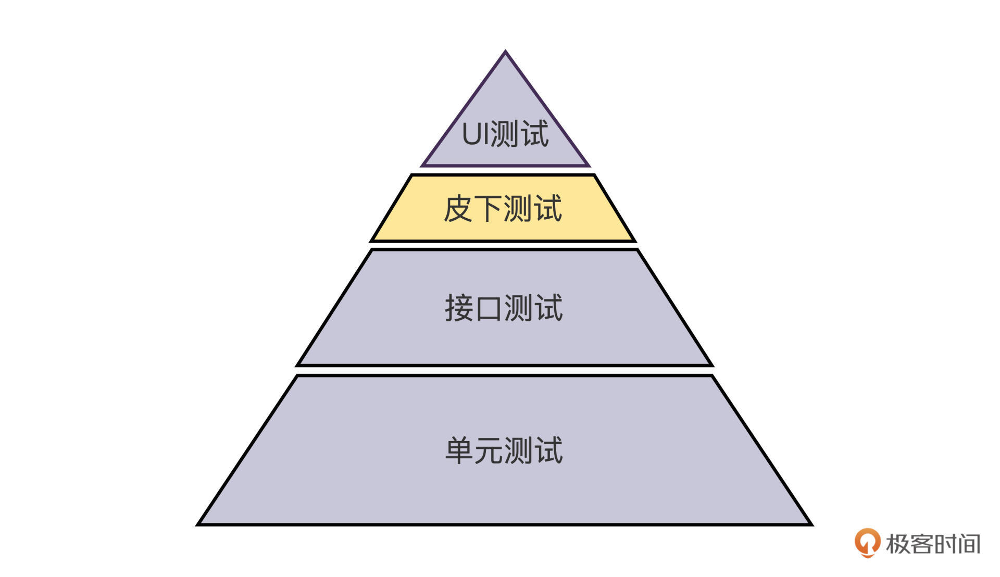
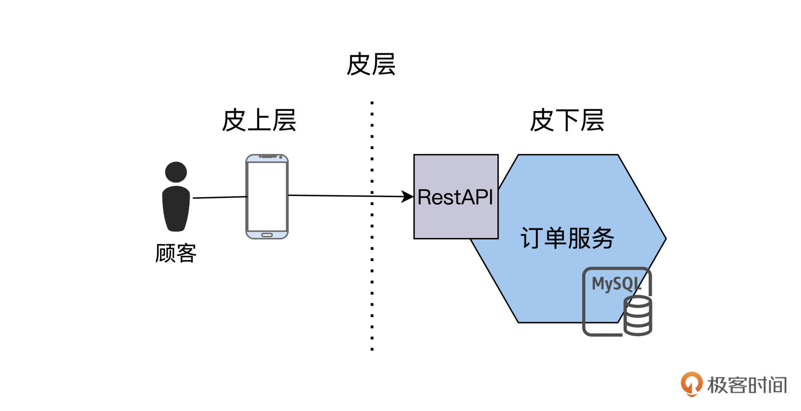
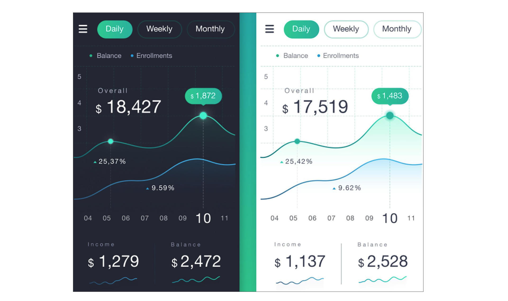

---
date: "2019-06-23"
---  
      
# 16｜概念重识：如何用3KU为端到端&验收测试赋能？
你好，我是柳胜。

看到这一讲标题里的“端到端测试”和“验收测试”，还有上一讲的“UI测试”，你可能还有点懵：在实践中，它们三个经常是一回事啊？

先给你理一理这三个概念。验收测试是指的客户视角，端到端的测试指的是测试方法，UI测试指的是测试发起的地方。听着不太一样，是吧？

可是我们为什么会觉得这些是一回事呢？因为在实践里，这三个测试概念常常指向同一个测试场景，即客户从UI端发起了一个对系统整体的可接受性测试。几年前的传统软件测试，这是成立的。但现在不一定了：客户不一定是UI用户，还有可能是API用户、SDK用户，端到端测试也不一定包括UI端。

这一讲，我们就用3KU法则重新审视一下这些测试概念，让我们的实践事半功倍。

## 验收测试

验收测试，相当于是一个契约履行。不同于建立在开发者之间的接口契约，验收契约建立在用户和系统之间。所以验收测试的前提条件有两条：第一，这个契约存在；第二，这个契约具有可测试性。

我们在[第七讲](https://time.geekbang.org/column/article/502863)“单体应用测什么”的时候，已经把FoodCome的契约表达出来了，就是**用Ghkerkin语法描述出来的用户使用场景**。

```
    Given a consumer
      And a restaurant
      And a delivery address/time that can be served by that restaurant
      And an order total that meets the restaurant's order minimum
    When the consumer places an order for the restaurant
    Then consumer's credit card is authorized
      And an order is created in the PENDING_ACCEPTANCE state
      And the order is associated with the consumer
    

```
<!-- [[[read_end]]] -->

这样一段描述写在一个名为placeOrder.feature文件里，只要满足了Given的条件，做了When中定义的操作，就会得到Then里的结果。这就是契约的内容。

我之前和你说过Gherkins语法的好处，它的表达在自然语言和技术语言之间，需求人员理解起来不吃力，往前走一步又能成为测试案例，甚至自动化测试代码。

今天咱们就接着说说，这件事儿怎么实现。我介绍一个BDD自动化测试框架，它就是Cucumber。

Cucumber是支持行为驱动开发的软件工具。Cucumber的核心是它的Gherkin语言解析器，能够根据Feature文件直接生成自动化测试代码。详细情况，你可以参考Cucumber的[官方网站](https://cucumber.io)。

下面，我们用一个例子来说明一下Cucumber怎么使用。

具体操作步骤如下：

第一步，我们先生成一个测试项目工程，Cucumber可以支持多种开发语言，Ruby，Java，Javascript，.NET等。我们这里以Java为例，使用mvn来生成一个模版项目：

```
    mvn archetype:generate                      \
       -DarchetypeGroupId=io.cucumber           \
       -DarchetypeArtifactId=cucumber-archetype \
       -DarchetypeVersion=2.3.1.2               \
       -DgroupId=foodcometest                  \
       -DartifactId=foodcometest               \
       -Dpackage=foodcome                 \
       -Dversion=1.0.0-SNAPSHOT                 \
       -DinteractiveMode=false
    

```

运行上面的命令，会生成一个空的Java项目，里面包含了Cucumber所需要的Library文件。

第二步，把上面的Feature文件，添加到项目路径：src/test/resources/foodcometest/placeorder.feature

接着是第三步，运行mvn命令：

```
    mvn test
    

```

遵循输出的指示，最终就可以自动生成一个测试Class文件了。

```
    public class PlaceOrderTest ...  {
      ...
      @Given("A valid consumer")
      public void useConsumer() { ... }
      @Given("a valid restaurant")
      public void useRestaurant() { ... }
      @Given("a valid address")
      public void validAddres(String address) { ... }
      @Given("a valid order")
      public void validAddres(Order orderDetails) { ... }
      @When("I place an order")
      public void placeOrder() { ... }
      @Then("the credit card should be authorized")
      public void authorizeCreditCard(Long creditCardNo) { ... }
      @Then("order shoudl be Created with pending status")
      public void orderCreatedInPendingStatus()  { ... }
    }
    

```

在Feature文件里，使用Given，When，Then关键字描述的步骤，对应着PlaceOrderTest的一个个函数，你通过函数名上的注解就可以看到这个对应关系，但是函数体还是TODO，需要你去实现。等你实现了这些函数，再运行Cucumber，它会按照Given，When，Then这个顺序来执行契约的验证了！

你可以看到这样操作的好处，自动化测试代码是紧紧贴合Feature文件的，如果契约变化了，那可以重新运行mvn命令，同步自动化测试代码。那么同时也意味着，自动化测试成功了，就代表契约验证通过，验收测试通过。

当然，上面说的只是一个Feature的测试，验收测试里还有一个关键问题，验收测试的范围应该有多大？我的建议是，**签订了多少契约，就做多少验收测试**。也就是说，用户显式表达了多少需求，就应该以这个为基准来做验收。

你可能会问，有些需求不一定是显式的，但又确实存在。比如一些业务异常路径、边角案例，甚至性能指标，这些也需要整体测试，该怎么测呢？这就要说到端到端的测试。

## 端到端测试

为什么要做端到端测试呢？我们在单元测试验证了业务逻辑，在集成测试验证了接口，现在终于要真刀真枪，拉上战场了。所有服务都一起上线，要看是不是能匹配得上。

所以，端到端测试（End-to-end testing）指的是一个功能从开始到结束，贯穿了整个系统的A服务、B服务，一直到N服务。通常这个功能是从哪里发起的呢？一般是UI端。它又在哪里结束呢？在某个服务模块，比如是数据库。

但是，根据3KU测试金字塔，在UI执行测试是ROI最小的。有没有办法找到一种ROI较高的端到端测试方法呢？在[第二讲](https://time.geekbang.org/column/article/497405)里，我提到过“**分层是追求整体ROI的结果** ”，反过来也是成立的，如果为了追求更高的ROI，你甚至可以创建出一个新的分层。

当时我就在想，UI测试ROI小，但好处是业务可见性强。如果下沉到代码层和接口层，ROI上来了，但是业务又模糊了。所以在接口测试层和系统测试层的中间地带，有没有可能找到一个业务可见性也比较强、ROI也比较高的测试层呢？

我很惊喜地发现，业界还真有人跟我一样在考虑这个问题了。Martin Fowler在他的网站提出了一种新的测试方法，叫做Subcutaneous Test，中文叫做**皮下测试**。

皮下测试，顾名思义，是当你要做的端到端测试在UI上测试很难做，或者能做但是成本很高，所以，选择紧贴着UI测试的下一层发起测试。在3KU测试金字塔里，它是在集成测试和UI测试中又加入了一层。



### 皮下测试

要想实现皮下测试，首先要找到皮层在哪里，看看请求链路，肉眼可见的皮层就是Http request，手机APP是皮上层，后台的订单服务是皮下层。



皮下测试就是模拟客户端发出的HTTP请求，直接发送到后端服务。这个用RestAssure测试框架就可以轻松做到：

```
    public class E2ERestTest {
        @Test
        public void shouldOrderBeCreated() throws Exception {
            when()
                    .post("https://api.foodcome.com/api/v1/orders", 443))
            .then()
                    .statusCode(is(200))
                    .body(containsString("order created"));
        }
    }
    

```

可以看出来，刚才做的皮下测试在执行方法上就是一个API测试。不过它跟正常的API测试相比，有两点不同：

第一，测试请求注入的地方是订单服务，也是UI端直接连接的入口，这个请求也贯穿了后端的服务A，服务B直到服务N，只是它绕过了ROI最小的UI端。

第二，发起的测试请求，目的是模拟UI端行为，而不是单纯地为了测试订单服务。

我给你分析一下，这个皮下测试的方法论原理：本来我们要端到端测试n个服务，但是由于第1个服务，也就是UI端的测试ROI非常低。在这里，怎么把复杂的问题简单化呢？可以利用动态规划的思维，我们把原先的测试工作量f\(n\)做了这样一个分解。

具体公式如下：**f\(n\)=f\(1\)+f\(n-1\)**

f\(n-1\)因为绕过了UI，它的难度一下子降下来了。而f\(1\) 我们上一讲单独讲到了UI测试，可以用单元测试的方法降低UI测试的复杂度。所以，分而治之后，两部分难度都降下来了。皮下测试的价值也就出来了。

这里插一句提示，动态规划你不了解的话，可以通过后面[这个资料](https://baike.baidu.com/item/%E5%8A%A8%E6%80%81%E8%A7%84%E5%88%92/529408)了解一下。

我们说回正题，有哪些系统适合做皮下测试呢？ 刚才说到，自动化在UI层做不了，或者能做但是成本很大。比如一些带有画图功能的应用，在UI上有很多的曲线。像下面这样的，就适合皮下测试。



当然，皮下测试还有另外一个问题，就是这个离UI最近的这个“皮层”到底在哪里？

要找到这样一个合适的截面，需要结合你的项目而定。这个截面可能在网间请求，也可能就在客户端内部。但是原则就是，**这个皮层离UI越近越好，能测试的逻辑最多越好，而且自动化实施的ROI越大越好**。

### 端到端测什么？

皮下测试是一个准端到端的测试，本着3KU的原则，业务逻辑在单元测试已经验证过了，接口在集成测试也测过了，在端到端测试，我们的策略可以是 “Trust But Verify”，就是说信任前面阶段做的测试工作，但也要做一些基本的验证的工作。因此在策略上，端到端测试不会把全部的案例都走一遍。

那现在的端到端测什么？我们可以挑出一些测试案例，形成Workflow，作为端到端的测试案例。这个Workflow的选取原则可以参照集成测试的Happy Path。也就是说一个Workflow能够走过尽可能多的服务。

对FoodCome来说，客户下单->验证支付->餐馆接单->发送物流->通知客户，就是满足这样条件的一个Workflow。

## 小结

这一讲我们谈到了验收测试和端到端测试，这两种测试在业界经常被混在一起。还是那句话，如果它们是一回事，我们就没必要保留多余的概念。

经过我们的分析，实际上，这两者从测试角度和测试范围还是不一样的。验收测试是以客户视角，来验证是否按照契约交付，在这里我们用了Gherkins来表达契约，用Cucumber来生成测试代码，验收测试的范围是严格按照契约的内容来测试的。

对于端到端测试，我们依据3KU原则，提出了皮下测试的概念和实现方法，通过分析，这能够带来更高的ROI。

到这里，我们第二模块就结束了，我们把测试里的概念和策略都过了一遍，每种策略是什么样的，它在整体起到的什么作用。

你也可以看到，在3KU原则下，分层这个概念非常灵活：有的需求是在这个层测试，有的需求在那个层测试；甚至一个需求的一部分在这个层做，另外的部分在那个层做，只要ROI最高。

这就给自动化测试设计提出了挑战，原有的各层的测试方法就需要连接、兼容、打通，怎么做到呢？我们在第三模块设计篇，马上会引出微Job测试模型来解决这个问题。我们下一讲见吧。

## **思考题**

UI测试、端到端测试还有验收测试的区别是什么？

欢迎你在留言区跟我交流互动，也推荐你把今天的内容分享给更多同事、朋友。