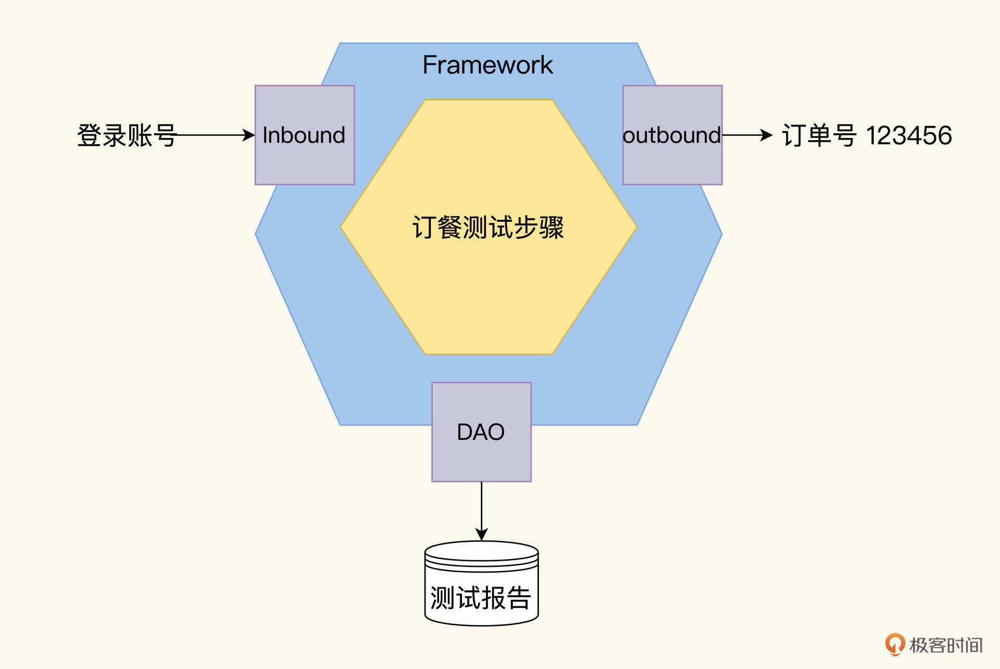
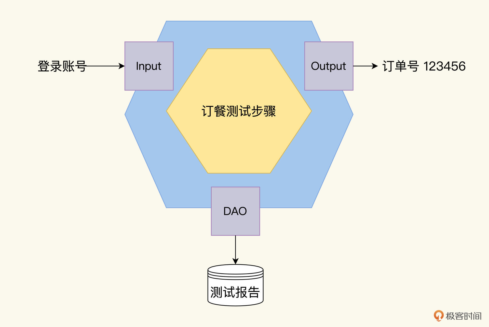
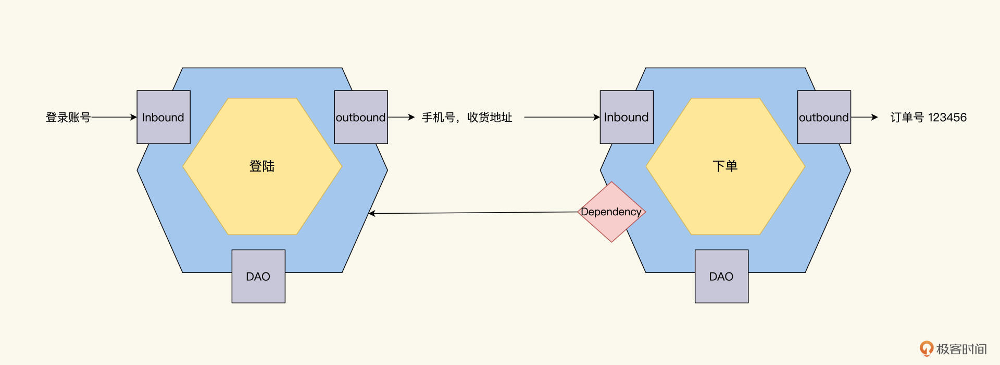
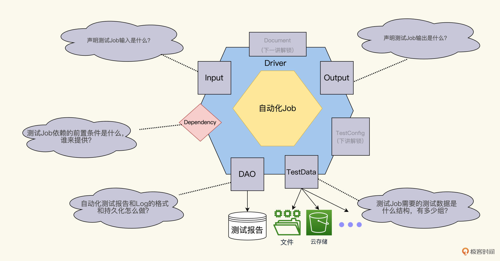

---
date: "2019-06-23"
---  
      
# 17｜元数据模型（一）：小Job模型构建大蓝图
你好，我是柳胜。

在价值篇我们学习了3KU整体最优分层模型。而到了策略篇，又结合一个具体的订餐系统，为你提供了一个测试设计实现案例，演示具体如何应用3KU法则。

不过推演下来，你有没有隐约感觉到，事情有点不对劲了？以前我们是先分层，再在每个层上设计自己的TestCase，UI上的TestCase的功能定义和粒度大小，可能和API层上的TestCase完全不一样。

现在，不同的测试需求，可能会落到不同的分层截面上去做自动化。甚至，一个测试需求的不同部分，也可以放在不同截面上。比如，你可以在API上测试createOrder，在UI上测试verifyOrder，只要这样做ROI最高。

所以，在3KU法则下，自动化测试设计是先定义TestCase，然后再判断它应该落在哪个层面。这跟我们以往熟悉的自动化测试设计大相径庭，需要我们在设计方法论上有新的突破。没错，现在我们的挑战是，需要找到一种新的概念指导我们做任务建模和设计，从而跨越各层的“TestCase”。

因为内容比较多，为了让你跟得上，我安排了两讲内容，带你**找到一个测试设计的元数据模型，将各种类型和层次的测试纳入到这同一个模型里。一生二，二生三，三生万物，从这一个模型里，衍生出我们自动化测试中所需要的设计方法和策略、执行计划，效益度量甚至生死定夺等等一切**。

<!-- [[[read_end]]] -->

“好大的口气”，看到这里，我猜你会这么说，不过，你不妨耐心看完后面的内容，相信会改变你以往的认知，换一个新的角度来审视自动化测试，能抓住最关键的东西做好设计。

## TestCase的设计态和运行态

设计新模型前，我们有必要先分析一下，原有自动化测试设计有什么问题。我们可以从设计态和运行态复盘一下，自动化测试的产生过程是怎样的，借此发现问题。这里，我们延续之前那个订餐系统的例子讲解。

先看**设计态。**设计态下，自动化测试表现为测试案例，一个测试集合TestSuite包含了多个测试案例TestCase。TestCase测试案例里的信息包含以下元数据：测试名字、测试环境、测试步骤、测试结果等等。

对于订餐系统里“订餐”这个测试案例，就会这么写。

* 测试名字：下单
* 测试环境：Web终端
* 测试步骤：第一步，登陆订餐系统；第二步，选择餐品、收货地址；第三步，下订单
* 预期结果：下单成功，产生物流配送记录

然后，我们对应到运行态。在**运行态**下，也就是自动化测试跑起来，就成为了一个运行的程序功能。这个程序功能有自己的运行环境、对外依赖和数据交互，我们可以用微服务的六边形架构方法（参看[第七讲](https://time.geekbang.org/column/article/502863)）描述订餐Job的运行态结构。

看到了没有，运行态的Job相比设计态的测试案例，多了不少信息，包括输入Inbound、输出Outbound、DAO，我们依次来看看。

* **Inbound**：本Job运行开始之前，接收的外部输入Input。
* **Outbound**：本Job运行结束之后，对外的输出Output。用户在订餐系统完成下单后，会产生一个物流单号，比如123456。
* **DAO：**Data Access Object, 本Job运行中需要持久化的信息。本次订餐测试运行结果的序列化，存储到数据库或文件里。

## 原本的设计存在什么问题？

分析完自动化测试的设计态和运行态长什么样，从内部和外部两个角度，我们很容易发现问题。

从内部看，传统的测试案例里的元素和自动化测试Job里的信息差别较大。用咱们现在流行的“元”概念来说，就是两者的元数据不一致。在基因上，它们是两个物种。

从外部看，传统测试案例之间关系比较松散，即使刚开始测试人员遵循规则来产生案例，但时间长了，也很难维护案例设计逻辑的一致性和完整性。而自动化测试Job从一开始就互相咬合，在生命周期中，遵循软件扩展和持续重构的规律：腐化或是优化。

这些问题导致了，自动化测试从设计态转化成运行态困难重重。反映到现实中，我们看到就是，测试案例设计和自动化测试实现脱节，貌合神离、各玩各的。造成的结果也很明显，就是自动化测试缺失了设计。代码一旦没有了设计，它的功能、效率、维护性、投产比都失去了追踪和控制。

那怎么解决这些问题呢？咱们开个脑洞，从软件设计的角度，重新审视一下自动化测试应该怎么做。

面向对象设计里，有Interface和Class概念，Interface定义行为表现，Class负责具体实现，Abstract Class提供代码重用。一个Interface，可以有多个实现；如果修改了Interface，那么Class也需要修改。

设计和实现解耦，但又保持一致，这个机制使得代码有内建生命力，有扩展能力而不会垮掉，对不对？

其实,我们可以把这个设计思路引入到测试模型里，测试案例设计就相当于定义Interface，暴露契约，要提供什么样的功能、达成什么目标，但是Interface不能实例化，更不能运行。

自动化测试Job就是实现了Interface的Class，有血有肉，能实例化也能跑。对一个测试案例，可以有不同的自动化实现，手工测试也相当于是测试案例的另外一个实现。如何定义这个Interface，就是我们要找的测试元数据模型。

好，说到这里，我们简单总结一下到现在的观点。

1.自动化测试和手工测试共用一套案例模型和设计方法。TestSuite和TestCase这些概念已经过时了，需要找到新的模型。

2.自动化测试设计本质是软件设计，精髓在于对测试场景的抽象和建模。这就像开发软件先设计Interface一样，而自动化测试工具和框架属于实现层面，用哪个取决于需求，而不能削足适履。

## **初探微测试Job模型**

有了前面的推导，我们现在试图找到一个大一统的测试元数据模型，用它描述一个测试案例的设计态和运行态。为了区别于传统的测试案例，还有自动化测试脚本的叫法，我们管它叫**自动化测试Job**。

回顾一下运行态里的六边形，其实它已经初步勾勒出一个Job模型，但它还是像一个开发的通用模块，现在我们继续丰富它，**添加更多的自动化测试基因，这个基因满足自动化测试的基本原则**（你可以回顾[第一讲](https://time.geekbang.org/column/article/496857)），让它成为一个针对自动化测试的Job。

为了对齐自动化测试的术语习惯，我们把Inbound重命名为Input，把Outbound重命名为Output。

### 模型属性

先说结论，我们的自动化测试Job模型，除了上面的Input、Ouput和DAO 三个属性，下面还要加上Dependency、TestData、TestConfig、Document四个属性，一共七个属性。

这七个核心属性，其实是你在设计自动化测试案例时，需要考虑的七个方面，也是后续开发中要去实现的Interface（接口）。

这么多属性“扑面而来”，你也许有点应接不暇。别慌，下面我结合订餐系统例子，逐一给你解释。

对于自动化测试，我们需要创建一个依赖的概念，目的是通过阻断错误在Job链条上的传递、扩散，来缩短自动化测试的执行时间。Depedency的Job如果失败了，那么后续的Job没有必要再去运行。因此，我们要在后面的模型示意图中，用一个红色菱形描述这个**Dependency。**它的数据表达类型是List，存放1个或n个前置Job的名字。

结合具体例子，Depdency的使用场景更好理解。在下图，我们有2个Job，一个是登陆的Job，另外一个是下单的Job，让下单Job的前置依赖是登陆Job，登录成功后才要运行订餐案例，登陆失败则不必运行订餐案例。

除了可以引入Dependency概念，帮我们缩短测试执行时间，要想提升测试ROI，还有什么着手点呢？

早在[第四讲](https://time.geekbang.org/column/article/499382)我们就说过，要提高自动化测试的ROI，一个方法就是增加自动化测试的运行次数。所以，从设计的角度来看，我们的期望是：一份代码，运行多次。这里的“多次”可以是多个场景、多个语言、多个客户端、多组数据，不管哪种，都是数据驱动的循环迭代。

所以，每一个自动化测试Job应该有一个自己的**数据源TestData**，它的数据表达类型是Hashmap，存放相似特征的N条KV（Key Value）数据记录，每一条KV记录触发一次Job运行。

看到这里，可能你会产生这样的疑问，在TestNG和Junit框架里，都有DataProvider机制，不就有了你说的TestData功能么？是，也不是，我们这里谈的是自动化测试Job的特征提取和建模，各个框架的DataProvider也好，DataValue也好，都是对模型的实现。

很好，我们又完成了一个TestData机制，让1份代码的产出效益翻n倍。

## 课程小结

为了设计一个更科学的模型**，**我们从传统自动化测试设计入手，通过传统自动化测试的设计态和运行态对比，看到了设计与实现之间的鸿沟。类似的鸿沟举不胜举，比如手工测试与自动化测试之间，测试分层之间。

从测试整体看，我们投入了这么多资源和精力，初心是编一张大网来捕捉bug的，但实际上却是各个小网工作，有重复、有遗漏，而这些问题不能度量，也无法提升。

为了编好大网，我们找到了一个统一的Job模型，用这个模型来设计我们各种类型各个层次的自动化测试，那我们不仅能明确大网有没有重复和遗漏，甚至网眼密度也可以统一。

这个Job模型包含七个属性，你在设计自动化测试的时候，需要把这七个属性想清楚。今天我们讲到了其中的5个属性，Input、Output、DAO、Dependency和TestData。

Input和Output要声明测试Job输入和输出是什么；DAO要解决自动化测试报告和Log的格式和持久化怎么做的问题；Dependency要回答的问题是，测试Job依赖的前置条件是什么，谁来提供？而TestData要回答的问题是，测试Job需要的测试数据是什么结构，有多少组？

在下一讲，我们会介绍剩下两个属性，并继续分析自动化测试设计中你必须关注的其他问题。比如，怎么保证自动化测试健壮性，你可以自己先想一下，我们下一讲一起探讨。

## 思考题

说一下你设计自动化测试任务的时候，有哪些比较好的实践，怎么在团队里推行的？

欢迎你在留言区跟我交流讨论，也推荐你把这一讲分享给更多朋友。