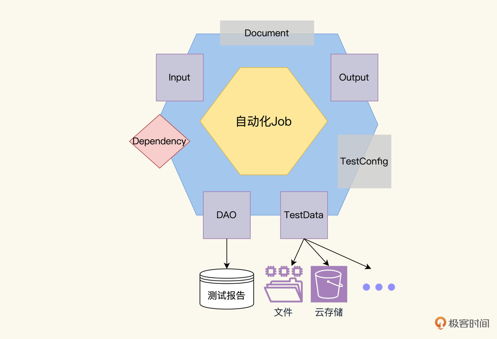
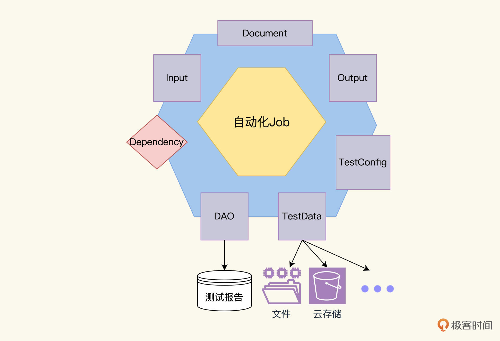
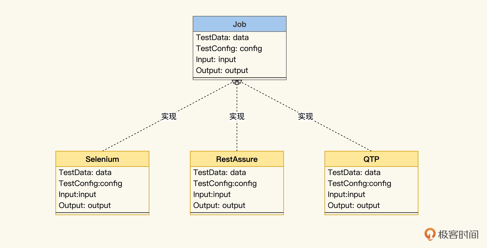
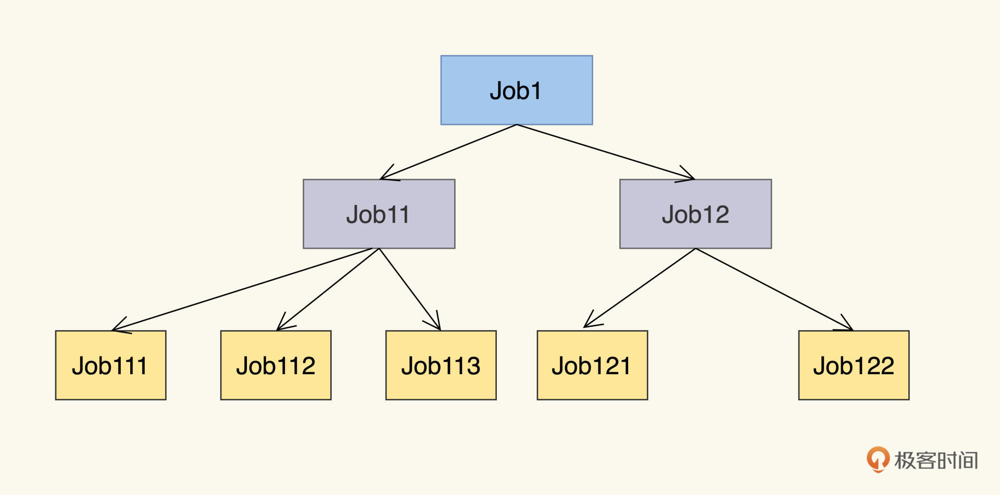
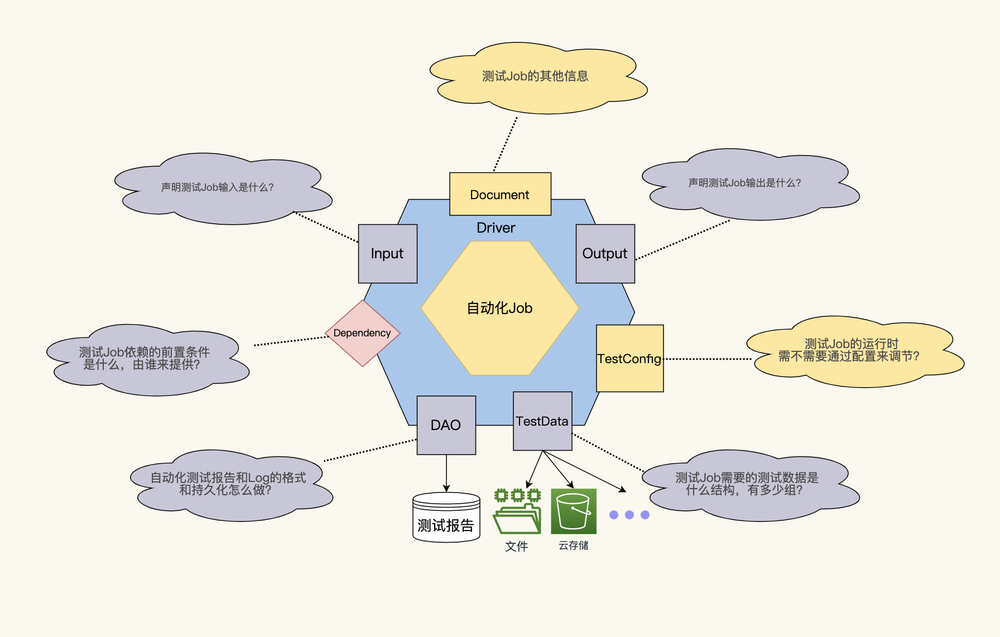

---
date: "2019-06-23"
---  
      
# 18｜元数据模型（二）：小Job模型构建大蓝图
你好，我是柳胜。

上一讲，我们分析了传统自动化测试设计态和运行态存在的鸿沟，并且提出了一个更科学的Job模型的设想。如下图所示，这个模型包含七个核心属性，其实也是后续在设计自动化测试案例时，我们需要考虑的七个方面，也是后续开发中要去实现的Interface（接口）。

模型属性我们上一讲开了个头，重点讲了Dependency和TestData，Dependency描述业务关联性、阻断错误、缩短执行时间，TestData可以实现一份代码多组数据运行，提升自动化测试的ROI。

今天咱们继续分析剩下的模型属性，勾勒整个Job模型的全貌，这样你就能进一步掌握自动化测试设计建模的利器了。

## 模型属性

自动化测试有一个令人头疼的问题——不稳定，经常失败，有没有办法通过设计攻克这个难题呢？

自动化测试Job像开发的微服务一样，都是独立的运行单元，我们可以通过给每个Job增加一个**TestConfig**，它的数据表达类型是HashMap，每一条记录代表一个配置，我们通过修改配置来控制Job的运行。结合实践，**有三个关键配置，可以增强自动化测试的健壮性和诊断性，分别是：日志级别、超时时间以及重试次数**。

Log是诊断程序运行问题最有力的工具，自动化测试也不例外，通过定义不同的log级别和相应输出信息，把它应用在不同环境下，可以形成一个自动化测试诊断策略。比如，Log level 如果是debug级别，抓取环境信息、屏幕截图、运行时堆栈，用于在自动化测试开发阶段做调试。Error级别记录出错trace和调用Job链状态，用在自动化测试生产运行环境。

<!-- [[[read_end]]] -->

我建议你在设计自动化测试Job的时候，一定要在TestConfig里加上**Log\_Level**，用来提醒测试开发人员，在自动化开发中实现相应的Log信息的收集、分类和输出机制。

我们再看看超时问题，在自动化测试运行中，经常会因为各种奇怪的原因，导致运行不能返回，单元测试中阻塞调用不能返回，API测试中Http response超时，UI测试中页面刷不出来。

通常在技术层上不会无限等待，也有TimeOut的限制，比如http request的默认超时是120秒，我们这里关注的Timeout是执行整个Job的时间最大限值，从而保证自动化测试可以满足快速反馈的目标。

所以，我们应该在TestConfig里有一个Job的超时配置，**TimeOut**: 3min, 提醒自动化测试开发人员去做相应的代码实现。

定义了超时处理机制后，我们再来看看Retry重试，这是开发人员提高代码运行健壮性的常用手段，其实对于提高自动化测试的健壮性也很关键。

咱们在UI测试里经常遇到一些状况，比如在低环境里环境不稳定，有的页面刷一次出不来，第二次就没问题了。手工测试时测试人员通常会自己多刷两次，把功能测试完，这种不稳定性的问题，只要在生产环境里不重现即可。

那自动化程序怎么处理这种状况呢？我们可以加入一个**Retry\_Number**的配置项，它的value是N。是什么意思呢？Job运行1次不成功，还可以尝试最多N-1次直到成功，或在N次失败后才返回失败状态。

在**TestConfig**中定义Log\_Level、 TimeOut、 Retry\_Number这些配置项，实际上是我们针对自动化测试的运行不稳定问题而设计的解决方案。TestConfig本身是一个HashMap，当然也可以加入其它你认为有用的配置项。至于怎么实现，那是代码阶段要去做的事情。

说完TestConfig后，别忘了我们还需要一个属性**Document**，来存放Job的描述信息。它的数据表达类型是一个对象，Document里可以存放Job的名字、测试执行步骤、测试环境信息等等。

到这里，我们的Job模型六边形，最终更新成了下面的样子。

讲到这里，你可能又有一个疑问：不对啊，之前学自动化测试都是在学框架，最重要的框架是不是忘了放进自动化测试Job模型里？

不，这正是我要强调的，在自动化测试Job模型里，我们关注的是设计，是如何满足测试需求和提高自动化的效益。而工具或框架，它是Job实现层面所关注的内容。

我们用Selenium也好，QTP也好，它们可以帮助我们实现设计意图，但不能喧宾夺主，倒逼我们按照它们的结构来设计，否则我们永远是一个工具使用者，而不能成为一个有设计思维的自动化测试人员。

这就相当于软件开发中，先定义了微服务实现业务接口，至于每个微服务选择哪种语言作为编程语言，选GO还是Java，这要交给开发人员根据经验和喜好权衡。

所以说，在Job模型里，七大属性是设计面的，而框架是Job实现面的。为了更好地理解，我们把刚才的六边形架构展成UML类关系图，就会看到框架在垂直下方。

## 模型层级

听到这里，你也许对Job模型有一点点明白了，但困惑也不少。以前接触的都是TestSuite和TestCase这些概念，这个Job模型到底说的是啥？是一个TestCase还是一个大场景？

我们暂且忘记TestSuite和TestCase，你先想一下软件设计是怎么做的：一个系统的行为设计是为了解决一个大问题，把这个大问题分解成若干个小问题，对应着系统分解成服务，依次递归下钻一直到单元级别。大问题与小问题同构，系统与服务同构，这叫自顶向下的设计。

讲到这，是不是顿时开悟了？Job模型描述的是一个同构的测试任务，它既可以是一个小小的测试案例，也可以是一个大大的测试需求。这小和大之间，是通过组合编排来完成的。

Job之间到底是如何组合的？一生二，二生三，三生万物，这描述的是一个树形关系，软件架构如此，自动化测试Job也一样。

一个Job的定义是由父节点完成，Job的实现由它的子Job们完成。我们可以类比开发的Interface、abstract class和final class，理解根节点和子节点的用处。

图中的根Job，是我们运行的自动化测试的任务，对应着interface。我们需要按照Job模型设计它的Input、Output、TestData、TestConfig等信息；叶子Job，这是已经实例化可运行的Job，相当于final class，也就是说一定有代码来负责这个Job的执行；在根Job与叶子Job之间的Job相当于abstract class，起到功能和接口划分的作用。

我们最终是要跑Job的，在Job跑起来的时候，会通过这个树形链接传递一些信息，我们定义以下四条规则。

1.一个Job的运行，实际上是运行其所有的子Job，并且Input和Output上也等价。也就是说，Job1 = Job11+Job12。 Job11+Job22是实现了Job1的定义。

2.Job的运行结果是其子Job们运行结果的与运算。这个很好理解，Job11和Job12全部成功，才能设定Job1成功，有一个失败，Job1就会失败。

3.子Job默认继承父Job的属性，除非自定义了属性去覆盖父Job上的同名属性。像TestConfig，比如父Job上已经定义了log级别为error，那么对其下子Job也适用，除非在子Job里定义不同的log级别。

4.一个Job的Depdency只能指向和它同一层次的Job。Job113可以一来Job112，但是不能依赖Job12。

这个层次模型，可以用自顶向下来去设计，也可以自底向上去组合。所以，根Job是相对的，不是绝对的，它完全可以和另外的Job组合在一起，生成一个更大的Job。

比如IT Ops开发的产品部署监控自动化Job对他们来说是终极任务，但是也可以和QA团队的测试自动化Job组合在一起，进行环境信息对接，形成一个部署测试一体自动化的Job，这就是我们常用的Pipeline。Pipeline本身就是一个有Input和Output的Job，Pipeline之间可以再对接组合成更多的场景。

## Job模型设计的四大优势

好，到这里，我们已经把Job模型讲完了。明确了这个模型的设计之后，我们不妨进一步思考一下，Job模型是怎么帮助我们做好自动化测试的呢？我们可以从这四个方面来理解。

**第一，高可复用的自动化测试模块化设计。**像软件设计逐层分解系统、子系统、服务和模块一样，自动化测试可以自顶向下分解一个大的任务，到中任务，再到小任务，直到可执行的代码级别；也可以自底向上聚合成新的测试场景，比如API测试可以和UI测试聚合生成跨端测试。

**第二，低成本的扩展和重构。**Job任务的定义是基于自动化测试的需求，并不预先依赖于某个工具框架的实现，我们重构Job也更轻松了。更改一个Job里的实现代码，甚至更换工具从QTP切到Selenium，只要保持对外的Input和Output不变，那这就属于内部的事，不会影响到其他关联Job。这就叫高内聚，低耦合。

**第三，动态的生成执行计划。**在Job执行的时候，根据我们定义的运行规则，就可以把树形图展成可执行的有向无环图，获得关键路径、关键Job，从而动态确定最优执行计划。

**第四，有助于后续的度量和改进。**有了统一模型来做案例设计和自动化测试实现，我们就可以获得准确的度量数据了，比如自动化测试覆盖率、自动化测试ROI等等，可以持续驱动自动化测试效益的提升。

## 课程小结

我们通过两讲，一起推导建立了微测试Job模型。我这里再总结一下，Job模型包括属性和层级两个方面。

七个属性，其实是回答了自动化测试里，七个可以提高ROI的关键问题：

* Input\&Output：测试Job的输入和输出是什么？
* DAO：测试Job应该用什么格式，怎么持久化自动化测试报告、日志、抓图等等。
* Depdedncy：测试Job的前置条件是什么，由谁来提供？
* TestData：测试Job的测试数据是什么结构，需要多少组？
* TestConfig：测试Job的运行时需不需要通过配置来调节？比如，健壮性、诊断性、环境信息等等。
* Document：测试Job的其它信息。

我准备了图解，方便你记忆：

当你想清楚了这七大属性，就相当于Job的接口已经确定了。

但刚开始做自动化测试设计的时候，也是先想到一个大概要完成的任务，不可能一下子就到脚本实现的级别。就像软件设计，也是先有概要设计，再做详细设计。

微测试Job怎么赋能自动化测试开发人员做设计呢？那就是Job的层级能力，Job下面可以有子Job，一层层做细化，直到叶子节点Job，是可开发的自动化测试案例，至于怎么实现，那是自动化测试开发阶段需要考虑的事情。

你可能会问，这个Job模型真的好用么？可以用来做设计么？后面的课程里，我还会用几个实例，为你演示一下，怎么用Job模型来完成自动化测试的设计，敬请期待。

## 练习题

请用测试微Job七要素模型，描述一下你目前正在使用的测试案例。注意，不要代入工具和框架。

欢迎你在留言区跟我交流讨论，也推荐你把这一讲分享给更多朋友。